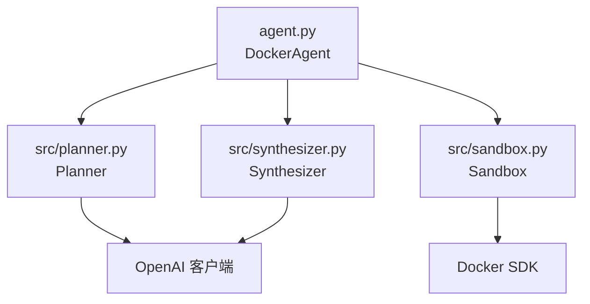
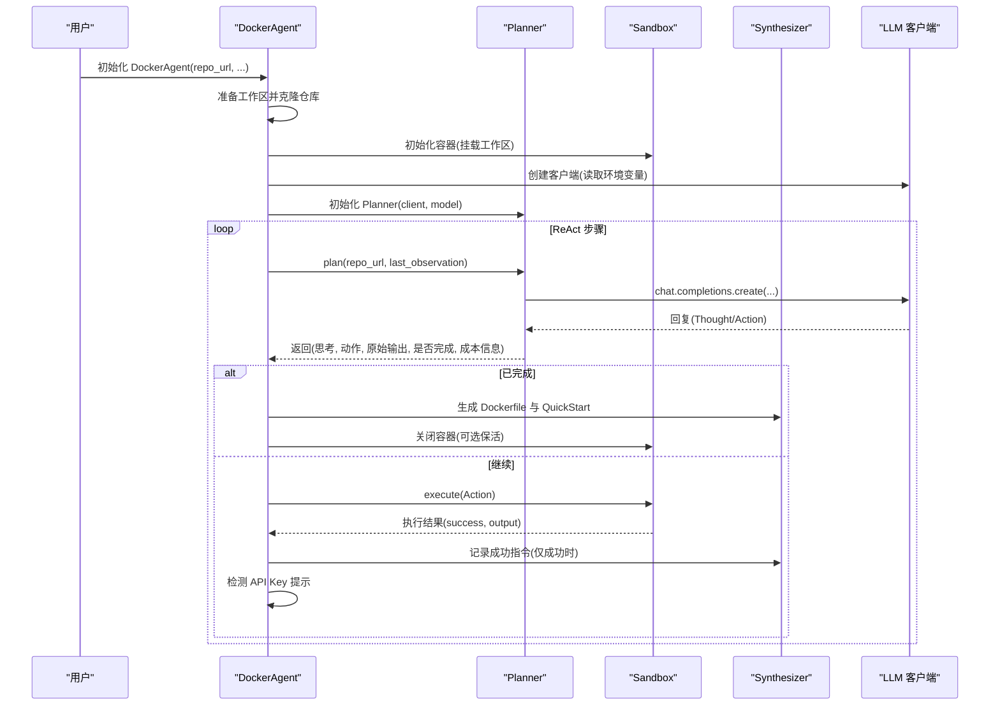
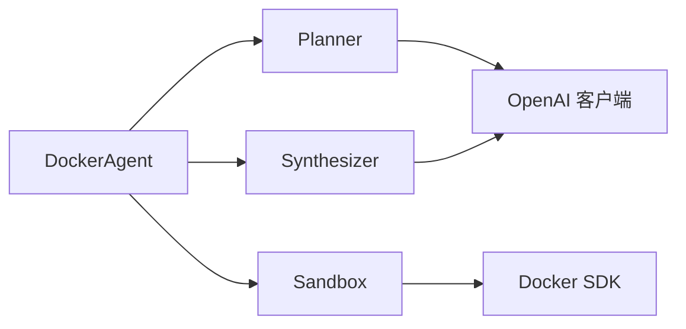

# API 参考

<cite>
**本文引用的文件**
- [agent.py](file://agent.py)
- [src/planner.py](file://src/planner.py)
- [src/sandbox.py](file://src/sandbox.py)
- [src/synthesizer.py](file://src/synthesizer.py)
- [requirements.txt](file://requirements.txt)
- [README.md](file://README.md)
- [doc/运行示例.md](file://doc/运行示例.md)
- [workplace/QuickStart.md](file://workplace/QuickStart.md)
- [test.py](file://test.py)
</cite>

## 目录
1. [简介](#简介)
2. [项目结构](#项目结构)
3. [核心组件](#核心组件)
4. [架构总览](#架构总览)
5. [详细组件分析](#详细组件分析)
6. [依赖关系分析](#依赖关系分析)
7. [性能考量](#性能考量)
8. [故障排查指南](#故障排查指南)
9. [结论](#结论)
10. [附录](#附录)

## 简介
本参考文档面向 Repo Dockerizer Agent 的使用者与集成者，系统化梳理以下 API 与接口：
- DockerAgent 主类及其公共方法、参数与返回值
- Planner 模块的 ReAct 接口、LLM 集成 API 与成本计算接口
- Sandbox 模块的容器管理 API、命令执行接口与回滚机制
- Synthesizer 模块的文档生成 API、Dockerfile 生成接口与配置检测方法
并提供使用示例、错误处理策略与性能注意事项，以及 API 版本兼容性与迁移建议。

## 项目结构
- 入口脚本与主控制器：agent.py
- 核心子模块：
  - src/planner.py：ReAct 规划器与 LLM 对话、成本统计
  - src/sandbox.py：容器执行与回滚
  - src/synthesizer.py：指令记录与文档/Dockerfile 生成
- 运行与示例：README.md、doc/运行示例.md、workplace/QuickStart.md
- 测试与代理验证：test.py
- 依赖声明：requirements.txt

图表来源
- [agent.py](file://agent.py#L14-L39)
- [src/planner.py](file://src/planner.py#L3-L10)
- [src/sandbox.py](file://src/sandbox.py#L1-L13)
- [src/synthesizer.py](file://src/synthesizer.py#L1-L8)

章节来源
- [agent.py](file://agent.py#L1-L160)
- [src/planner.py](file://src/planner.py#L1-L145)
- [src/sandbox.py](file://src/sandbox.py#L1-L178)
- [src/synthesizer.py](file://src/synthesizer.py#L1-L144)
- [README.md](file://README.md#L1-L47)

## 核心组件
- DockerAgent：主控制器，负责工作区准备、容器初始化、ReAct 循环调度、成本打印、最终产物生成与容器收尾。
- Planner：基于 ReAct 的计划器，封装系统提示词、历史对话、成本计算与响应解析。
- Sandbox：容器执行器，支持命令执行、成功快照、失败回滚、信息性退出识别与资源清理。
- Synthesizer：记录成功指令、生成 Dockerfile 与 QuickStart 文档、检测 API Key 需求。

章节来源
- [agent.py](file://agent.py#L14-L39)
- [src/planner.py](file://src/planner.py#L3-L10)
- [src/sandbox.py](file://src/sandbox.py#L4-L13)
- [src/synthesizer.py](file://src/synthesizer.py#L1-L8)

## 架构总览
下图展示 DockerAgent 如何协调 Planner、Sandbox 与 Synthesizer 完成一次 ReAct 循环与最终产物生成。

图表来源
- [agent.py](file://agent.py#L60-L126)
- [src/planner.py](file://src/planner.py#L69-L105)
- [src/sandbox.py](file://src/sandbox.py#L29-L91)
- [src/synthesizer.py](file://src/synthesizer.py#L9-L22)

## 详细组件分析

### DockerAgent API 参考
- 类名：DockerAgent
- 作用：主控制器，负责工作区准备、容器初始化、ReAct 循环、成本打印、产物生成与容器收尾。

主要方法与参数
- __init__(repo_url, base_image="python:3.10", model="gpt-5", workplace="workplace")
  - 参数
    - repo_url: GitHub 仓库 URL
    - base_image: 容器基础镜像，默认 "python:3.10"
    - model: LLM 模型名称，默认 "gpt-5"
    - workplace: 本地工作目录路径，默认 "workplace"
  - 行为
    - 准备工作区并克隆仓库
    - 初始化 Sandbox（挂载工作区至 /app）
    - 初始化 LLM 客户端（读取 OPENAI_API_KEY，可选 OPENAI_API_BASE）
    - 初始化 Planner 与 Synthesizer
  - 异常
    - 若未设置 OPENAI_API_KEY，抛出异常
  - 返回
    - 无（构造函数）

- run(max_steps=30, keep_container=False)
  - 参数
    - max_steps: 最大 ReAct 步数，默认 30
    - keep_container: 完成后是否保持容器运行以便检查，默认 False
  - 行为
    - ReAct 循环：Plan -> Execute -> Synthesize -> 检测 API Key 提示
    - 成功条件：Planner 返回 Final Answer: Success
    - 成功后生成 Dockerfile 与 QuickStart.md
    - 无论成功与否，最终关闭 Sandbox（可选保活）
  - 返回
    - 无（过程性输出）

- _prepare_workplace()
  - 行为
    - 删除现有工作区目录（若存在）
    - 创建新目录并克隆仓库到工作区
  - 返回
    - 无

- _detect_api_key_issues(observation)
  - 行为
    - 检测输出中是否包含常见 API Key 相关错误模式
    - 将检测到的键名与上下文记录到 Synthesizer
  - 返回
    - 无

使用示例
- 命令行运行
  - python agent.py <GITHUB_REPO_URL> [--image BASE_IMAGE] [--model MODEL] [--steps N] [--keep-container]
- 代码示例（路径）
  - [agent.py](file://agent.py#L148-L159)

错误处理
- OPENAI_API_KEY 缺失：构造函数直接抛出异常
- Git 克隆失败：捕获子进程异常并打印错误
- ReAct 循环中命令失败：Sandbox 回滚至上一成功镜像；继续循环直到完成或超步数

性能考量
- 每步执行前对容器进行 commit，可能占用较多磁盘空间；完成后会清理快照镜像与悬空镜像

章节来源
- [agent.py](file://agent.py#L14-L39)
- [agent.py](file://agent.py#L40-L59)
- [agent.py](file://agent.py#L60-L126)
- [agent.py](file://agent.py#L127-L147)
- [agent.py](file://agent.py#L148-L159)

### Planner API 参考
- 类名：Planner
- 作用：基于 ReAct 的计划器，维护对话历史、系统提示词、成本统计与响应解析。

主要方法与参数
- __init__(client, model="gpt-4o")
  - 参数
    - client: LLM 客户端实例（需支持 chat.completions.create）
    - model: 模型名称，默认 "gpt-4o"
  - 行为
    - 初始化历史、累计成本、定价表与系统提示词
  - 返回
    - 无

- plan(repo_url, last_observation=None)
  - 参数
    - repo_url: 仓库 URL
    - last_observation: 上一步观察结果（可选）
  - 行为
    - 首次调用：向历史添加仓库信息
    - 追加 last_observation 作为用户消息
    - 调用 client.chat.completions.create，使用系统提示词与历史
    - 解析响应：提取 Thought/Action，判断是否完成
    - 计算本次调用成本并累加
  - 返回
    - (thought, action, raw_output, is_finished, cost_info)
    - cost_info 包含 input_tokens、output_tokens、total_tokens、step_cost、total_cost

- _calculate_cost(usage)
  - 参数
    - usage: LLM 调用返回的 usage 对象（包含 prompt_tokens、completion_tokens、total_tokens）
  - 行为
    - 根据模型定价表计算输入/输出成本，返回本次与累计成本
  - 返回
    - 字典：包含 tokens 与成本信息

- _extract_tag(text, tag)
  - 参数
    - text: LLM 原始回复文本
    - tag: 标签名（如 "Thought" 或 "Action"）
  - 行为
    - 使用正则提取指定标签内容，去除代码块与单引号包裹
  - 返回
    - 提取后的字符串或 None

使用示例
- 在 DockerAgent 中调用
  - [agent.py](file://agent.py#L71-L73)
- LLM 调用接口
  - [src/planner.py](file://src/planner.py#L85-L90)

错误处理
- 未检测到 Action 时，Planner 返回 action=None，DockerAgent 会提示澄清并继续循环

性能考量
- 成本计算基于 tokens，定价表覆盖多模型；注意不同模型价格差异较大

章节来源
- [src/planner.py](file://src/planner.py#L3-L10)
- [src/planner.py](file://src/planner.py#L69-L105)
- [src/planner.py](file://src/planner.py#L107-L129)
- [src/planner.py](file://src/planner.py#L131-L144)

### Sandbox API 参考
- 类名：Sandbox
- 作用：容器执行器，支持命令执行、成功快照、失败回滚、信息性退出识别与资源清理。

主要方法与参数
- __init__(base_image="python:3.10", workdir="/app", volumes=None)
  - 参数
    - base_image: 基础镜像，默认 "python:3.10"
    - workdir: 容器内工作目录，默认 "/app"
    - volumes: 本地到容器的卷映射字典（可选）
  - 行为
    - 初始化 Docker 客户端，创建初始容器并确保工作目录存在
  - 返回
    - 无

- _setup_initial_container()
  - 行为
    - 以 /bin/bash 启动容器，设置工作目录与卷映射
  - 返回
    - 无

- execute(command)
  - 参数
    - command: 要执行的 bash 命令字符串
  - 行为
    - 执行命令，解析退出码与输出
    - 若为信息性退出（如显示帮助），视为成功但不提交
    - 成功且需要变更时：提交为新镜像，更新 last_success_image，并清理旧快照
    - 失败时：停止并删除当前容器，从 last_success_image 或 base_image 重启容器
  - 返回
    - (success: bool, output: str)

- _should_commit(command)
  - 行为
    - 判断命令是否会产生持久性变更（非只读命令）以决定是否提交
  - 返回
    - bool

- _is_informational_exit(exit_code, output)
  - 行为
    - 判断退出码与输出是否为信息性退出（如显示帮助）
  - 返回
    - bool

- get_container_info()
  - 行为
    - 返回容器基本信息（ID、短ID、名称、状态）
  - 返回
    - dict 或 None

- close(keep_alive=False)
  - 参数
    - keep_alive: 是否保持容器运行
  - 行为
    - 可选保活；否则停止并移除容器
    - 清理 last_success_image 快照镜像与悬空镜像
  - 返回
    - 无

使用示例
- 在 DockerAgent 中调用
  - [agent.py](file://agent.py#L100)
- 命令执行与回滚流程
  - [src/sandbox.py](file://src/sandbox.py#L29-L91)

错误处理
- 信息性退出：不视为错误，但不提交镜像
- 失败回滚：自动从上一成功镜像重启容器
- 资源清理：关闭时清理快照与悬空镜像

性能考量
- 每步 commit 会产生镜像层，建议完成后清理；只对有副作用的命令提交

章节来源
- [src/sandbox.py](file://src/sandbox.py#L4-L13)
- [src/sandbox.py](file://src/sandbox.py#L15-L28)
- [src/sandbox.py](file://src/sandbox.py#L29-L91)
- [src/sandbox.py](file://src/sandbox.py#L93-L112)
- [src/sandbox.py](file://src/sandbox.py#L114-L134)
- [src/sandbox.py](file://src/sandbox.py#L136-L145)
- [src/sandbox.py](file://src/sandbox.py#L147-L178)

### Synthesizer API 参考
- 类名：Synthesizer
- 作用：记录成功指令、生成 Dockerfile 与 QuickStart 文档、检测 API Key 需求。

主要方法与参数
- __init__(base_image="python:3.10", workdir="/app")
  - 参数
    - base_image: 基础镜像，默认 "python:3.10"
    - workdir: 工作目录，默认 "/app"
  - 行为
    - 初始化基础镜像、工作目录与内部记录列表
  - 返回
    - 无

- record_success(command)
  - 参数
    - command: 成功执行的 bash 命令
  - 行为
    - 记录为 RUN 指令；同时识别并记录环境配置相关命令（用于 QuickStart）
  - 返回
    - 无

- record_api_key_hint(key_name, detection_context="")
  - 参数
    - key_name: 检测到的 API Key 名称
    - detection_context: 检测上下文（可选）
  - 行为
    - 记录 API Key 需求，避免重复
  - 返回
    - 无

- _is_setup_command(command)
  - 行为
    - 判断命令是否为环境配置相关（用于 QuickStart）
  - 返回
    - bool

- generate_quickstart_with_llm(workplace_path, client, model="gpt-4o", file_name="QuickStart.md")
  - 参数
    - workplace_path: 工作区根路径
    - client: LLM 客户端
    - model: LLM 模型名称
    - file_name: 输出文件名，默认 "QuickStart.md"
  - 行为
    - 基于 README 与已验证的安装命令生成简洁 QuickStart 文档
    - 写入文件并返回内容
  - 返回
    - 生成的文档内容或 None

- _is_relevant_for_quickstart(command)
  - 行为
    - 过滤掉纯信息查询类命令，仅保留安装/配置相关命令
  - 返回
    - bool

- generate_dockerfile(file_path="Dockerfile")
  - 参数
    - file_path: 输出 Dockerfile 路径
  - 行为
    - 以 base_image 与 workdir 开头，拼接记录的 RUN 指令生成完整 Dockerfile
  - 返回
    - 生成的 Dockerfile 内容

使用示例
- 在 DockerAgent 中调用
  - [agent.py](file://agent.py#L116-L117)
- LLM 生成 QuickStart 文档
  - [src/synthesizer.py](file://src/synthesizer.py#L32-L122)
- 生成 Dockerfile
  - [src/synthesizer.py](file://src/synthesizer.py#L130-L143)

错误处理
- 无 setup 命令：跳过 QuickStart.md 生成并输出警告
- README 不可读：使用占位提示
- LLM 生成异常：捕获并输出错误信息

性能考量
- 生成 QuickStart 时会调用 LLM，注意 tokens 与成本控制

章节来源
- [src/synthesizer.py](file://src/synthesizer.py#L1-L8)
- [src/synthesizer.py](file://src/synthesizer.py#L9-L22)
- [src/synthesizer.py](file://src/synthesizer.py#L23-L31)
- [src/synthesizer.py](file://src/synthesizer.py#L32-L122)
- [src/synthesizer.py](file://src/synthesizer.py#L123-L129)
- [src/synthesizer.py](file://src/synthesizer.py#L130-L143)

## 依赖关系分析
- DockerAgent 依赖
  - OpenAI 客户端：用于 Planner 与 Synthesizer 的 LLM 调用
  - Docker SDK：用于 Sandbox 的容器生命周期管理
- Planner 依赖
  - 定价表：按模型计算成本
  - 系统提示词：约束 ReAct 行为与环境限制
- Sandbox 依赖
  - Docker SDK：容器运行、exec、commit、stop/remove
- Synthesizer 依赖
  - LLM 客户端：生成 QuickStart 文档
  - 文件系统：写入 Dockerfile 与 QuickStart.md

图表来源
- [agent.py](file://agent.py#L14-L39)
- [src/planner.py](file://src/planner.py#L3-L10)
- [src/sandbox.py](file://src/sandbox.py#L1-L13)
- [src/synthesizer.py](file://src/synthesizer.py#L1-L8)

章节来源
- [requirements.txt](file://requirements.txt#L1-L4)
- [agent.py](file://agent.py#L1-L12)

## 性能考量
- LLM 成本
  - Planner 内置按模型定价表的成本计算，输出 step_cost 与 total_cost
  - 建议根据任务复杂度选择合适模型，控制 tokens
- 容器镜像层
  - Sandbox 每步 commit 会产生镜像层，建议在完成后清理快照与悬空镜像
- I/O 与网络
  - 代理/中转站调用需关注网络稳定性与响应时间
- 示例参考
  - 代理验证脚本展示了如何通过实时问题验证模型联网能力与稳定性
    - [test.py](file://test.py#L10-L44)

章节来源
- [src/planner.py](file://src/planner.py#L107-L129)
- [src/sandbox.py](file://src/sandbox.py#L56-L74)
- [src/sandbox.py](file://src/sandbox.py#L162-L177)
- [test.py](file://test.py#L10-L44)

## 故障排查指南
- OPENAI_API_KEY 未设置
  - 现象：构造函数抛出异常
  - 处理：在环境变量中设置 OPENAI_API_KEY，或提供 base_url
  - 参考
    - [agent.py](file://agent.py#L28-L36)
- Git 克隆失败
  - 现象：子进程异常并打印错误
  - 处理：检查网络、仓库 URL 与权限
  - 参考
    - [agent.py](file://agent.py#L48-L58)
- 命令执行失败
  - 现象：Sandbox 回滚至上一成功镜像
  - 处理：检查命令合法性与依赖安装顺序
  - 参考
    - [src/sandbox.py](file://src/sandbox.py#L76-L91)
- 代理/中转站验证
  - 方法：通过实时问题验证模型联网能力
  - 参考
    - [test.py](file://test.py#L10-L44)
- 生成文档失败
  - 现象：无 setup 命令或 LLM 调用异常
  - 处理：确认成功指令记录与 README 内容
  - 参考
    - [src/synthesizer.py](file://src/synthesizer.py#L36-L45)
    - [src/synthesizer.py](file://src/synthesizer.py#L119-L121)

章节来源
- [agent.py](file://agent.py#L28-L36)
- [agent.py](file://agent.py#L48-L58)
- [src/sandbox.py](file://src/sandbox.py#L76-L91)
- [test.py](file://test.py#L10-L44)
- [src/synthesizer.py](file://src/synthesizer.py#L36-L45)
- [src/synthesizer.py](file://src/synthesizer.py#L119-L121)

## 结论
本参考文档系统化梳理了 Repo Dockerizer Agent 的核心 API 与接口，涵盖 DockerAgent 主控制器、Planner ReAct 规划器、Sandbox 容器执行与回滚、Synthesizer 文档与 Dockerfile 生成。结合使用示例、错误处理与性能考量，可帮助用户高效集成与扩展该 Agent，实现仓库到可运行 Docker 环境的自动化配置。

## 附录

### 使用示例
- 命令行运行
  - python agent.py <GITHUB_REPO_URL> [--image BASE_IMAGE] [--model MODEL] [--steps N] [--keep-container]
  - 参考
    - [README.md](file://README.md#L23-L26)
    - [agent.py](file://agent.py#L148-L159)
- 成功运行示例（ReAct 步骤与输出）
  - 参考
    - [doc/运行示例.md](file://doc/运行示例.md#L1-L475)
- 生成的 QuickStart 文档示例
  - 参考
    - [workplace/QuickStart.md](file://workplace/QuickStart.md#L1-L46)

### API 版本兼容性与迁移指南
- 模型与定价
  - Planner 内置多模型定价表，若更换模型需同步调整成本预算
  - 参考
    - [src/planner.py](file://src/planner.py#L10-L41)
- LLM 客户端
  - 当前使用 OpenAI 客户端；若迁移到其他平台，需替换 Planner 与 Synthesizer 的调用点
  - 参考
    - [src/planner.py](file://src/planner.py#L85-L90)
    - [src/synthesizer.py](file://src/synthesizer.py#L103-L107)
- 容器与卷映射
  - Sandbox 默认将工作区挂载到 /app；如需自定义路径，修改 Sandbox 初始化参数
  - 参考
    - [src/sandbox.py](file://src/sandbox.py#L5)
- 代理/中转站
  - 通过 OPENAI_API_BASE 设置 base_url，验证模型联网能力
  - 参考
    - [agent.py](file://agent.py#L29-L36)
    - [test.py](file://test.py#L5-L8)