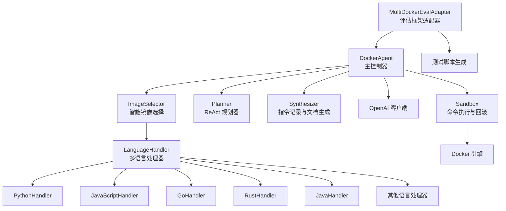
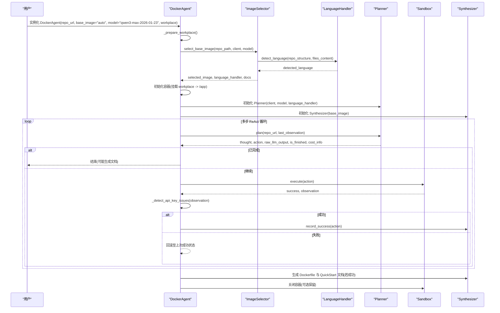
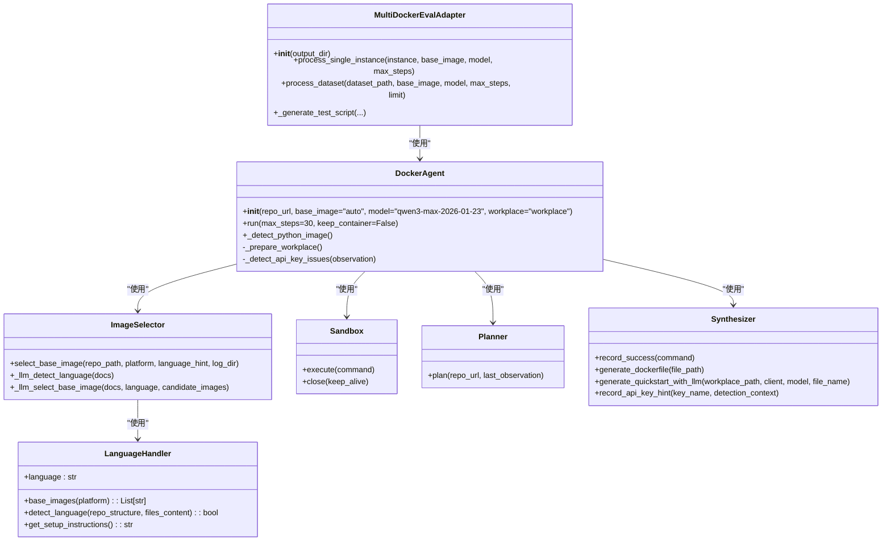

# DockerAgent 类 API

<cite>
**本文引用的文件**
- [agent.py](file://agent.py)
- [multi_docker_eval_adapter.py](file://multi_docker_eval_adapter.py)
- [sandbox.py](file://src/sandbox.py)
- [planner.py](file://src/planner.py)
- [synthesizer.py](file://src/synthesizer.py)
- [image_selector.py](file://src/image_selector.py)
- [language_handlers.py](file://src/language_handlers.py)
- [README.md](file://README.md)
</cite>

## 更新摘要
**变更内容**
- 新增智能基础镜像选择功能，支持20+种编程语言的自动检测
- 更新构造函数参数默认值（base_image从"python:3.9"改为"auto"）
- 新增多语言支持和语言处理器架构
- 更新默认模型为"qwen3-max-2026-01-23"
- 增强Multi-Docker-Eval评估框架支持

## 目录
1. [简介](#简介)
2. [项目结构](#项目结构)
3. [核心组件](#核心组件)
4. [架构总览](#架构总览)
5. [详细组件分析](#详细组件分析)
6. [依赖关系分析](#依赖关系分析)
7. [性能考量](#性能考量)
8. [故障排查指南](#故障排查指南)
9. [结论](#结论)
10. [附录](#附录)

## 简介
本文件为 DockerAgent 类的详细 API 文档，覆盖以下内容：
- 构造函数 DockerAgent.__init__() 的参数说明（repo_url、base_image、model、workplace）
- 智能基础镜像选择功能的实现细节
- run() 方法的参数与返回值说明
- 私有方法 _prepare_workplace() 的作用与实现要点
- 私有方法 _detect_api_key_issues() 的接口与错误检测逻辑
- Multi-Docker-Eval评估框架适配器类的使用方法
- 参数验证规则、异常处理策略与最佳实践
- 完整的使用示例与常见问题排查

## 项目结构
DockerAgent 是一个端到端的自动化 Docker 环境配置 Agent，现已增强支持智能基础镜像选择和多语言支持。其核心由以下模块组成：
- DockerAgent：主控制器，负责工作区准备、容器沙箱、计划器、合成器与 LLM 客户端的协调
- ImageSelector：智能基础镜像选择器，基于 LLM 分析仓库结构和文件内容
- LanguageHandler：多语言处理器架构，支持20+种编程语言的自动检测
- MultiDockerEvalAdapter：评估框架适配器，专门用于将DockerAgent输出转换为Multi-Docker-Eval评估格式
- Sandbox：基于 Docker SDK 的命令执行与回滚机制
- Planner：基于 ReAct 思维链的环境配置规划器
- Synthesizer：记录成功指令并生成 Dockerfile 与 QuickStart 文档

**图表来源**
- [agent.py](file://agent.py#L17-L69)
- [image_selector.py](file://src/image_selector.py#L117-L285)
- [language_handlers.py](file://src/language_handlers.py#L10-L654)
- [multi_docker_eval_adapter.py](file://multi_docker_eval_adapter.py#L39-L406)

## 核心组件
- DockerAgent：封装了仓库克隆、智能镜像选择、容器沙箱、LLM 规划与指令合成的完整流程
- ImageSelector：基于多步骤 LLM 分析的智能基础镜像选择器，支持20+种编程语言
- LanguageHandler：抽象基类，定义了多语言处理器的标准接口
- MultiDockerEvalAdapter：专门用于Multi-Docker-Eval评估框架的适配器，支持批量处理数据集
- Sandbox：提供命令执行与基于提交的回滚能力，支持只读命令跳过快照
- Planner：基于系统提示词与历史对话，输出下一步 Thought 与 Action
- Synthesizer：记录成功指令，生成 Dockerfile 与 QuickStart 文档

**章节来源**
- [agent.py](file://agent.py#L17-L69)
- [image_selector.py](file://src/image_selector.py#L117-L285)
- [language_handlers.py](file://src/language_handlers.py#L10-L654)
- [multi_docker_eval_adapter.py](file://multi_docker_eval_adapter.py#L39-L406)
- [sandbox.py](file://src/sandbox.py#L4-L13)
- [planner.py](file://src/planner.py#L5-L159)
- [synthesizer.py](file://src/synthesizer.py#L1-L192)

## 架构总览
DockerAgent 的运行流程现已扩展支持智能基础镜像选择和多语言支持：
- 初始化阶段：准备工作区、挂载工作区到容器、初始化 LLM 客户端、创建 Planner 与 Synthesizer
- 智能镜像选择阶段：使用 ImageSelector 分析仓库结构和文件内容，自动选择最优基础镜像
- 语言检测阶段：通过 LanguageHandler 架构检测项目主要编程语言
- 执行阶段：循环执行 ReAct 步骤（Plan -> Execute -> Observe -> Detect API Key Issues -> Synthesize）
- 收尾阶段：根据配置是否成功生成 Dockerfile 与 QuickStart 文档，并按需保留容器

Multi-Docker-Eval适配器的运行流程：
- 输入解析：读取JSONL格式的Multi-Docker-Eval数据集
- 环境配置：调用DockerAgent进行智能环境配置
- Dockerfile转换：将生成的Dockerfile转换为评估框架格式
- 测试脚本生成：为评估框架生成多语言测试脚本
- 结果输出：生成docker_res.json格式的评估结果

**图表来源**
- [agent.py](file://agent.py#L18-L69)
- [image_selector.py](file://src/image_selector.py#L214-L285)
- [multi_docker_eval_adapter.py](file://multi_docker_eval_adapter.py#L102-L190)

## 详细组件分析

### DockerAgent.__init__(repo_url, base_image="auto", model="qwen3-max-2026-01-23", workplace="workplace")
- 功能：初始化 DockerAgent，准备工作区、智能选择基础镜像、初始化 LLM 客户端、创建 Planner 与 Synthesizer
- 参数
  - repo_url: GitHub 仓库 URL，字符串类型，必填
  - base_image: 容器基础镜像名称或"auto"，字符串类型，默认 "auto"
  - model: LLM 模型名称，字符串类型，默认 "qwen3-max-2026-01-23"
  - workplace: 本地工作区路径，字符串类型，默认 "workplace"
- 行为
  - 将 workplace 转为绝对路径
  - 调用 _prepare_workplace() 克隆仓库
  - 初始化 OpenAI 客户端（从环境变量加载 OPENAI_API_KEY）
  - **新增**：智能基础镜像选择
    - 如果 base_image 为 "auto"，调用 select_base_image() 分析仓库并选择最优镜像
    - 分析仓库结构和文件内容，检测主要编程语言
    - 使用 LanguageHandler 架构获取候选镜像列表
    - 通过 LLM 综合考虑语言版本要求、CI配置等因素选择最佳镜像
  - 以 workplace 为宿主目录，映射到容器内 /app，创建 Sandbox
  - 创建 Planner(client, model, language_handler) 与 Synthesizer(base_image)
- 参数验证与异常
  - 若未设置 OPENAI_API_KEY，抛出 ValueError
- 最佳实践
  - 在运行前确保 Docker 引擎可用且可访问
  - 确保 workplace 目录权限允许写入
  - 使用 "auto" 模式让系统自动选择最适合的基础镜像
  - 为 model 选择稳定且具备联网能力的模型以提升规划质量

**章节来源**
- [agent.py](file://agent.py#L18-L69)
- [image_selector.py](file://src/image_selector.py#L214-L285)
- [language_handlers.py](file://src/language_handlers.py#L638-L700)

### DockerAgent._detect_python_image()
- 功能：扫描项目文件以确定所需的Python版本，返回docker镜像标签
- 返回值：字符串格式的docker镜像标签（如 "python:3.9"），如果未检测到则返回 None
- 检测优先级：`.python-version` > `pyproject.toml` > `setup.cfg` > `setup.py` > GitHub Actions > `.travis.yml` > `tox.ini`
- 检测逻辑
  - 验证版本号必须为Python 3.6+，排除Python 2.x或过旧的3.x版本
  - 解析版本规范（如 `>=3.8,<3.11` 或 `==3.9.*`），提取具体版本
  - 从各种CI配置文件中提取可用的Python版本
- 参数与返回
  - 无参数；返回检测到的Python版本或None
- 异常处理
  - 无显式异常；解析失败时返回None
- 最佳实践
  - 该方法会自动检测项目的真实Python版本需求
  - 支持多种项目配置文件，确保准确性
  - 仅接受Python 3.6及以上版本

**章节来源**
- [agent.py](file://agent.py#L71-L182)

### DockerAgent.run(max_steps=30, keep_container=False)
- 功能：启动 ReAct 循环，逐步规划、执行、观察、检测 API Key 问题并记录成功指令
- 参数
  - max_steps: 最大执行步数，整数类型，默认 30
  - keep_container: 是否在完成后保留容器以便检查，布尔类型，默认 False
- 返回值
  - 无显式返回值；内部通过打印与文档生成反馈结果
- 行为
  - 初始化 observation 与配置成功标志位
  - 在 max_steps 范围内循环：
    - 调用 Planner.plan() 生成 thought 与 action
    - 打印成本信息（输入/输出 token 与累计费用）
    - 若 Planner 标记完成且结论为成功，设置配置成功标志并结束
    - 若 action 缺失，提示 Planner 明确格式后继续
    - 在 Sandbox 中执行 action，记录返回的 success 与 observation
    - 调用 _detect_api_key_issues(observation) 检测 API Key 相关错误
    - 若成功，记录到 Synthesizer；否则回滚至上一成功状态
  - 若配置成功，生成 Dockerfile 与 QuickStart 文档；否则提示失败
  - 最终调用 Sandbox.close(keep_alive=keep_container)
- 异常处理
  - run() 内部捕获异常并打印错误信息，随后执行清理
- 最佳实践
  - 对于大型项目，适当提高 max_steps
  - 开发调试阶段可启用 keep_container 以便进入容器检查
  - 避免在 run() 中直接暴露敏感信息，确保日志最小化

**章节来源**
- [agent.py](file://agent.py#L204-L282)

### DockerAgent._prepare_workplace()
- 功能：清理并初始化本地工作区，克隆指定的 GitHub 仓库到 workplace
- 行为
  - 若 workplace 存在则先删除再创建
  - 使用 git clone 将 repo_url 克隆到 workplace
  - 捕获子进程异常并重新抛出
- 参数与返回
  - 无参数；无返回值
- 异常处理
  - git clone 失败时打印错误并抛出异常
- 最佳实践
  - 确保网络可达与仓库可读
  - 避免在 workplace 中存放敏感文件

**章节来源**
- [agent.py](file://agent.py#L184-L202)

### DockerAgent._detect_api_key_issues(observation)
- 功能：检测命令输出中是否包含 API Key 相关错误提示，并记录到 Synthesizer
- 输入
  - observation: 字符串，通常来自 Sandbox 的命令执行输出
- 行为
  - 将 observation 转为小写
  - 匹配预定义的关键字模式（如 openai_api_key、anthropic_api_key、api_key、access_token 等）
  - 若匹配成功，调用 Synthesizer.record_api_key_hint(key_name, context)，并打印检测到的键名
- 参数与返回
  - 无返回值
- 异常处理
  - 无显式异常；空 observation 直接返回
- 最佳实践
  - 该方法仅作为提示，实际 API Key 配置仍需用户自行完成
  - 可结合 QuickStart.md 的 API Key 配置部分进行指引

**章节来源**
- [agent.py](file://agent.py#L284-L303)
- [synthesizer.py](file://src/synthesizer.py#L47-L51)

### ImageSelector 类
- 功能：智能基础镜像选择器，基于多步骤 LLM 分析选择最优 Docker 基础镜像
- 核心方法
  - select_base_image(repo_path, platform="linux", language_hint=None, log_dir=None)
  - _llm_detect_language(docs)：使用 LLM 检测主要编程语言
  - _llm_select_base_image(docs, language, candidate_images)：使用 LLM 选择基础镜像
- 分析流程
  - 生成仓库结构树
  - 使用 LLM 定位潜在相关文件
  - 过滤相关文件并读取内容
  - LLM 检测主要编程语言
  - 获取语言处理器的候选镜像
  - LLM 综合分析选择最佳镜像
- 支持的语言：Python、JavaScript、TypeScript、Rust、Go、Java、C#、C++、C、Ruby、PHP、Kotlin、Scala、R、Dart 等20+种
- 最佳实践
  - 使用 log_dir 参数保存 LLM 调用日志
  - 通过 language_hint 提供语言提示以加速选择过程
  - 在复杂项目中允许更多 LLM 调用以获得准确结果

**章节来源**
- [image_selector.py](file://src/image_selector.py#L117-L285)
- [language_handlers.py](file://src/language_handlers.py#L638-L700)

### LanguageHandler 抽象基类
- 功能：定义多语言处理器的标准接口
- 核心属性
  - language: 返回语言名称（只读属性）
- 核心方法
  - base_images(platform="linux"): 返回候选基础镜像列表
  - detect_language(repo_structure, files_content): 检测是否使用该语言
  - get_setup_instructions(): 获取语言特定的设置指令
- 支持的语言处理器
  - PythonHandler：Python 项目，支持 3.6-3.14 版本
  - JavaScriptHandler：Node.js 项目，支持 18-25 版本
  - TypeScriptHandler：TypeScript 项目，继承 JavaScriptHandler
  - RustHandler：Rust 项目，支持 1.70-1.90 版本
  - GoHandler：Go 项目，支持 1.19-1.25 版本
  - JavaHandler：Java 项目，支持 11、17、21 版本
  - 其他：C#、C++、C、Ruby、PHP、Kotlin、Scala、R、Dart 等

**章节来源**
- [language_handlers.py](file://src/language_handlers.py#L10-L654)

### MultiDockerEvalAdapter 类
- 功能：将 DockerAgent 输出转换为 Multi-Docker-Eval 评估框架所需的 docker_res 格式
- 构造函数 MultiDockerEvalAdapter(output_dir="./multi_docker_eval_output")
- 主要方法
  - process_single_instance(instance, base_image="auto", model="qwen3-max-2026-01-23", max_steps=30)
  - process_dataset(dataset_path, base_image="auto", model="qwen3-max-2026-01-23", max_steps=30, limit=None)
  - _generate_test_script(workplace, language, problem_statement, test_patch, dockerfile_content)
- 输入格式：JSONL格式的Multi-Docker-Eval数据集
- 输出格式：docker_res.json格式的评估结果
- 多语言支持：支持 Python、JavaScript、TypeScript、Go、Rust、Java、Ruby、PHP、C/C++ 等语言的测试脚本生成
- 最佳实践
  - 使用 `--limit` 参数进行测试运行
  - 确保评估框架依赖已正确安装
  - 检查生成的Dockerfile是否包含必要的测试依赖

**章节来源**
- [multi_docker_eval_adapter.py](file://multi_docker_eval_adapter.py#L39-L406)

### 使用示例
- 基本用法
  - 通过命令行传入 repo_url、可选的 base_image、model、steps 与 keep_container
  - 示例命令：python agent.py https://github.com/psf/requests
- 编程方式
  - 实例化 DockerAgent 并调用 run()，例如：
    - agent = DockerAgent(repo_url, base_image="auto", model="qwen3-max-2026-01-23")
    - agent.run(max_steps=50, keep_container=True)
- Multi-Docker-Eval评估
  - 使用适配器处理数据集：python multi_docker_eval_adapter.py task.jsonl --limit 1
  - 生成评估结果：docker_res.json
- 生成文档
  - 当配置成功时，将在 workplace 目录生成 Dockerfile 与 QuickStart.md

**章节来源**
- [agent.py](file://agent.py#L305-L317)
- [multi_docker_eval_adapter.py](file://multi_docker_eval_adapter.py#L409-L457)
- [README.md](file://README.md#L32-L41)

## 依赖关系分析
- DockerAgent 依赖
  - Sandbox：命令执行与回滚
  - Planner：ReAct 规划
  - Synthesizer：指令记录与文档生成
  - OpenAI 客户端：LLM 能力
  - **新增**：ImageSelector：智能基础镜像选择
  - **新增**：LanguageHandler：多语言处理器架构
- MultiDockerEvalAdapter 依赖
  - DockerAgent：核心环境配置功能
  - 评估框架：Multi-Docker-Eval官方评估工具
- 外部依赖
  - Docker 引擎：容器运行与卷挂载
  - git：仓库克隆
  - 环境变量：OPENAI_API_KEY

**图表来源**
- [agent.py](file://agent.py#L17-L69)
- [image_selector.py](file://src/image_selector.py#L117-L285)
- [language_handlers.py](file://src/language_handlers.py#L10-L654)
- [multi_docker_eval_adapter.py](file://multi_docker_eval_adapter.py#L39-L406)
- [sandbox.py](file://src/sandbox.py#L4-L13)
- [planner.py](file://src/planner.py#L5-L159)
- [synthesizer.py](file://src/synthesizer.py#L1-L192)

## 性能考量
- 容器快照与回滚
  - Sandbox 在成功命令后会提交镜像快照，便于失败回滚；但可能导致镜像堆积，建议在完成后清理
- LLM 成本控制
  - Planner 提供 token 用量与累计费用统计，便于控制成本
  - **新增**：ImageSelector 可能进行多次 LLM 调用，建议合理设置 max_steps
- 步数上限
  - 通过 max_steps 控制执行上限，避免无限循环
- 磁盘与网络
  - 大型仓库克隆与依赖安装会消耗磁盘与带宽，建议在高速网络与充足磁盘环境下运行
- **新增**：智能镜像选择开销
  - ImageSelector 分析仓库结构和文件内容需要一定时间，但能显著提高后续配置的准确性
  - 支持20+种语言的自动检测，适用于多语言项目

**章节来源**
- [sandbox.py](file://src/sandbox.py#L29-L178)
- [planner.py](file://src/planner.py#L121-L143)
- [image_selector.py](file://src/image_selector.py#L214-L285)
- [README.md](file://README.md#L67-L71)

## 故障排查指南
- OPENAI_API_KEY 未设置
  - 现象：初始化时抛出 ValueError
  - 处理：在 .env 文件中设置 OPENAI_API_KEY，或通过环境变量传入
- Docker 不可用
  - 现象：容器无法启动或命令执行失败
  - 处理：确认 Docker 引擎已安装并运行，必要时切换为 podman
- 仓库克隆失败
  - 现象：git clone 抛出异常
  - 处理：检查网络与仓库 URL，确保仓库可读
- 容器未清理
  - 现象：镜像与容器堆积
  - 处理：运行后清理 dangling 镜像与停止的容器
- API Key 相关错误
  - 现象：输出提示缺少 API Key
  - 处理：参考 QuickStart.md 的 API Key 配置部分，设置环境变量或 .env 文件
- **新增**：智能镜像选择失败
  - 现象：ImageSelector 无法检测语言或选择镜像
  - 处理：手动指定 base_image 参数，或提供 language_hint 语言提示
- **新增**：多语言项目识别错误
  - 现象：检测到错误的编程语言
  - 处理：检查项目文件结构，确保包含足够的语言标识文件
- **新增**：Multi-Docker-Eval评估失败
  - 现象：生成的docker_res.json格式不正确
  - 处理：检查必需字段是否存在，确保Dockerfile和测试脚本生成成功

**章节来源**
- [agent.py](file://agent.py#L26-L34)
- [agent.py](file://agent.py#L184-L202)
- [image_selector.py](file://src/image_selector.py#L167-L194)
- [multi_docker_eval_adapter.py](file://multi_docker_eval_adapter.py#L196-L207)
- [README.md](file://README.md#L67-L71)

## 结论
DockerAgent 提供了从仓库克隆到智能环境配置再到文档生成的一体化解决方案。通过新增的智能基础镜像选择功能和多语言支持，系统现在能够更准确地分析项目需求并选择最优的基础镜像，支持20+种编程语言的自动检测和配置。通过合理的参数配置、成本控制与故障排查，可在本地快速搭建可复现的 Docker 环境，并输出标准化的 Dockerfile 与 QuickStart 文档，极大提升项目交付效率。

## 附录
- 快速开始
  - 安装依赖后，运行 python agent.py <GITHUB_REPO_URL>
  - 使用Multi-Docker-Eval评估：python multi_docker_eval_adapter.py task.jsonl --limit 1
- 常用参数
  - --image：基础镜像（默认 "auto"）
  - --model：LLM 模型（默认 "qwen3-max-2026-01-23"）
  - --steps：最大步数
  - --keep-container：保留容器以便检查
  - **新增**：Multi-Docker-Eval评估参数
    - --output-dir：输出目录
    - --limit：限制处理实例数量
- **新增**：评估框架集成
  - 生成docker_res.json后，可使用Multi-Docker-Eval官方评估框架进行评估
  - 支持多种编程语言的基础镜像选择和测试脚本生成
- **新增**：智能镜像选择
  - 支持 Python、JavaScript、TypeScript、Rust、Go、Java、C#、C++、C、Ruby、PHP、Kotlin、Scala、R、Dart 等20+种语言
  - 通过多步骤 LLM 分析提供准确的基础镜像选择

**章节来源**
- [README.md](file://README.md#L11-L71)
- [multi_docker_eval_adapter.py](file://multi_docker_eval_adapter.py#L409-L457)
- [image_selector.py](file://src/image_selector.py#L214-L285)
- [language_handlers.py](file://src/language_handlers.py#L638-L700)