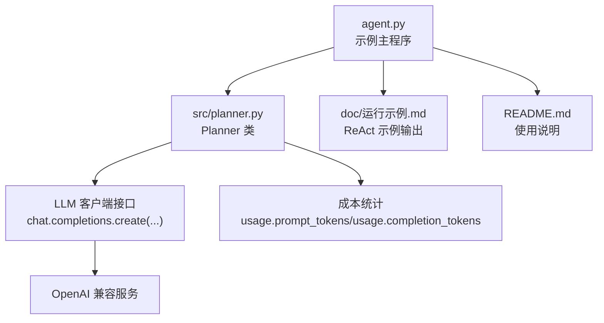
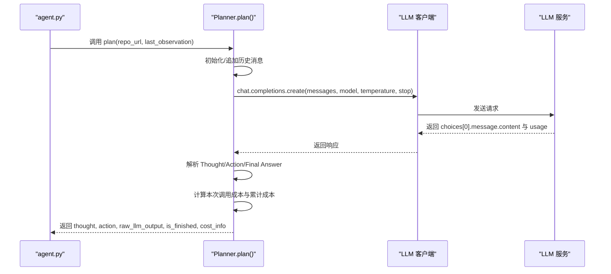
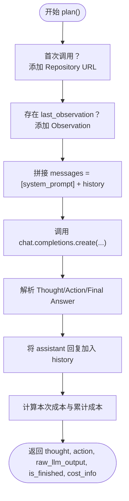
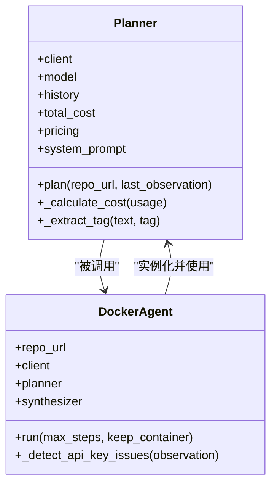

# Planner 模块 API

<cite>
**本文引用的文件**
- [src/planner.py](file://src/planner.py)
- [agent.py](file://agent.py)
- [doc/运行示例.md](file://doc/运行示例.md)
- [README.md](file://README.md)
- [workplace/src/minisweagent/models/litellm_model.py](file://workplace/src/minisweagent/models/litellm_model.py)
- [workplace/src/minisweagent/models/openrouter_model.py](file://workplace/src/minisweagent/models/openrouter_model.py)
- [workplace/src/minisweagent/exceptions.py](file://workplace/src/minisweagent/exceptions.py)
</cite>

## 目录
1. [简介](#简介)
2. [项目结构](#项目结构)
3. [核心组件](#核心组件)
4. [架构总览](#架构总览)
5. [详细组件分析](#详细组件分析)
6. [依赖关系分析](#依赖关系分析)
7. [性能考虑](#性能考虑)
8. [故障排除指南](#故障排除指南)
9. [结论](#结论)
10. [附录](#附录)

## 简介
本文件为 Planner 模块的全面 API 参考文档，聚焦以下目标：
- 详尽记录 Planner 类的构造函数与初始化参数
- 文档化 plan() 方法的完整接口：输入参数、返回值与数据结构
- 解释 ReAct 思考-行动-观察循环的工作原理与实现细节
- 记录成本计算接口与令牌统计功能
- 提供 LLM 集成 API 规范、错误处理机制与性能优化建议
- 给出实际使用示例与常见问题解决方案

Planner 是一个基于 ReAct（思考-行动-观察）范式的智能体规划器，负责为给定的 GitHub 仓库生成下一步可执行的 Bash 命令，以完成容器环境的自动配置。

## 项目结构
围绕 Planner 的相关文件与职责如下：
- src/planner.py：Planner 类定义与 ReAct 循环实现
- agent.py：示例主程序，展示如何实例化 Planner 并驱动 ReAct 循环
- doc/运行示例.md：真实运行轨迹示例，体现 ReAct 流程与输出格式
- README.md：项目背景与使用说明
- workplace/src/minisweagent/models/litellm_model.py：通用 LLM 客户端封装示例，展示 chat.completions 接口风格
- workplace/src/minisweagent/models/openrouter_model.py：第三方 LLM 服务封装示例，展示 cost 计算与响应结构
- workplace/src/minisweagent/exceptions.py：异常类型定义，用于流程中断与错误处理

图表来源
- [agent.py](file://agent.py#L60-L126)
- [src/planner.py](file://src/planner.py#L69-L105)
- [doc/运行示例.md](file://doc/运行示例.md#L1-L475)

章节来源
- [src/planner.py](file://src/planner.py#L1-L145)
- [agent.py](file://agent.py#L1-L160)
- [doc/运行示例.md](file://doc/运行示例.md#L1-L475)
- [README.md](file://README.md#L1-L47)

## 核心组件
- Planner 类：封装 ReAct 循环、历史记录、系统提示词、成本统计与输出解析
- LLM 客户端：遵循 chat.completions.create(...) 接口规范，返回 choices[0].message.content 与 usage
- DockerAgent：示例主程序，负责准备工作区、初始化 Sandbox、执行命令并驱动 ReAct 循环

章节来源
- [src/planner.py](file://src/planner.py#L3-L145)
- [agent.py](file://agent.py#L14-L39)

## 架构总览
下图展示了从主程序到 Planner 再到 LLM 客户端与成本统计的整体交互：

图表来源
- [agent.py](file://agent.py#L60-L126)
- [src/planner.py](file://src/planner.py#L69-L105)
- [workplace/src/minisweagent/models/litellm_model.py](file://workplace/src/minisweagent/models/litellm_model.py#L80-L93)

## 详细组件分析

### Planner 类 API 参考

- 构造函数
  - 参数
    - client：LLM 客户端对象，需提供 chat.completions.create(...) 方法
    - model：字符串，指定使用的模型名称，默认为 "gpt-4o"
  - 属性
    - client：传入的 LLM 客户端
    - model：模型名称
    - history：列表，保存 ReAct 历史消息
    - total_cost：浮点数，累计成本（美元）
    - pricing：字典，模型单价表（每百万 tokens 输入/输出价格）
    - system_prompt：字符串，系统提示词模板

- plan(repo_url, last_observation=None)
  - 功能：生成 ReAct 下一步
  - 输入
    - repo_url：字符串，目标 GitHub 仓库 URL
    - last_observation：可选字符串，上次执行结果
  - 返回
    - thought：字符串，大模型的思考内容
    - action：字符串，待执行的 Bash 命令
    - raw_llm_output：字符串，原始 LLM 输出文本
    - is_finished：布尔值，是否达到 Final Answer
    - cost_info：字典，包含以下键
      - input_tokens：整数，本次输入 token 数
      - output_tokens：整数，本次输出 token 数
      - total_tokens：整数，本次总 token 数
      - step_cost：浮点数，本次调用成本（美元）
      - total_cost：浮点数，累计成本（美元）

- _calculate_cost(usage)
  - 功能：根据 usage 计算本次调用成本与累计成本
  - 输入
    - usage：包含 prompt_tokens、completion_tokens、total_tokens 的对象
  - 返回
    - 字典，同上 cost_info 结构

- _extract_tag(text, tag)
  - 功能：从 LLM 输出中提取指定标签内容（如 Thought/Action），并去除代码块标记
  - 输入
    - text：字符串，原始 LLM 输出
    - tag：字符串，"Thought" 或 "Action"
  - 返回
    - 字符串或 None

章节来源
- [src/planner.py](file://src/planner.py#L3-L145)

### ReAct 模式实现细节
- 初始阶段
  - 第一次调用时，向 history 添加用户消息："Repository URL: {repo_url}"
- 迭代阶段
  - 若提供 last_observation，则添加用户消息："Observation: {last_observation}"
  - 将 system_prompt 与 history 合并为 messages，调用 chat.completions.create(...)
  - 将 assistant 的回复写入 history
- 输出解析
  - 使用正则提取 Thought 与 Action
  - 若输出包含 "Final Answer:"，标记 is_finished 为真
- 成本统计
  - 读取 usage 中的 prompt_tokens/completion_tokens/total_tokens
  - 根据 model 查找定价，计算 step_cost 并累加 total_cost

图表来源
- [src/planner.py](file://src/planner.py#L69-L105)
- [src/planner.py](file://src/planner.py#L107-L129)

章节来源
- [src/planner.py](file://src/planner.py#L69-L145)

### LLM 集成 API 规范
- 客户端要求
  - 必须提供 chat.completions.create(...) 方法
  - 该方法应返回包含 choices[0].message.content 与 usage 的响应对象
- 请求参数
  - model：字符串，模型名称
  - messages：列表，元素为 {"role": "...", "content": "..."}，首元素为 system
  - temperature：数值，示例中使用 0
  - stop：列表，示例中使用 ["Observation:"]
- 响应字段
  - choices[0].message.content：字符串，包含 Thought/Action/Final Answer
  - usage：对象，包含 prompt_tokens、completion_tokens、total_tokens

章节来源
- [src/planner.py](file://src/planner.py#L85-L90)
- [workplace/src/minisweagent/models/litellm_model.py](file://workplace/src/minisweagent/models/litellm_model.py#L80-L93)
- [workplace/src/minisweagent/models/openrouter_model.py](file://workplace/src/minisweagent/models/openrouter_model.py#L96-L109)

### 成本计算接口与令牌统计
- 单次调用成本
  - 通过 pricing 表查找模型单价（美元/百万 tokens）
  - step_cost = (prompt_tokens/1e6)*input_price + (completion_tokens/1e6)*output_price
- 累计成本
  - total_cost 累加 step_cost
- 返回结构
  - input_tokens、output_tokens、total_tokens、step_cost、total_cost

章节来源
- [src/planner.py](file://src/planner.py#L107-L129)

### 错误处理机制
- 输出格式错误
  - 当 LLM 未按 ReAct 格式输出 Thought/Action 时，Planner 无法解析，需通过 last_observation 反馈错误并要求澄清
- 异常中断
  - 在更复杂的框架中，可能抛出 InterruptAgentFlow 及其子类（如 LimitsExceeded、FormatError）以中断流程
- API Key/权限问题
  - 主程序会检测输出中的 API Key 相关关键词，并记录提示信息以便后续配置

章节来源
- [agent.py](file://agent.py#L127-L146)
- [workplace/src/minisweagent/exceptions.py](file://workplace/src/minisweagent/exceptions.py#L1-L22)

### 实际使用示例
- 基本运行
  - 使用命令行参数指定仓库 URL、基础镜像、模型与最大步数
  - 示例命令：python agent.py <GITHUB_REPO_URL>
- ReAct 输出示例
  - 参考 doc/运行示例.md 中的多步交互，包含 Thought、Action、Observation 与 Final Answer

章节来源
- [agent.py](file://agent.py#L148-L160)
- [doc/运行示例.md](file://doc/运行示例.md#L1-L475)
- [README.md](file://README.md#L23-L41)

## 依赖关系分析
- Planner 依赖 LLM 客户端提供的 chat.completions.create 接口
- Planner 依赖 usage 对象中的 token 统计进行成本计算
- 主程序 DockerAgent 驱动 Planner 执行 ReAct 循环，并通过 Sandbox 执行命令

图表来源
- [src/planner.py](file://src/planner.py#L3-L145)
- [agent.py](file://agent.py#L14-L39)

章节来源
- [src/planner.py](file://src/planner.py#L3-L145)
- [agent.py](file://agent.py#L14-L39)

## 性能考虑
- 温度设置
  - 示例中使用 temperature=0，有助于提高输出确定性，减少不必要的 token 消耗
- 停止策略
  - 使用 stop=["Observation:"] 可避免模型继续生成 Observation，缩短响应时间
- 历史长度控制
  - 随着 ReAct 步数增加，history 会增长，建议在长对话场景中限制历史条目数量或采用摘要策略
- 成本控制
  - 通过 pricing 表与 usage 统计，可在调用前估算成本，或在运行中动态调整模型与参数以控制开销

章节来源
- [src/planner.py](file://src/planner.py#L85-L90)
- [src/planner.py](file://src/planner.py#L107-L129)

## 故障排除指南
- 无 Action 输出
  - 现象：action 为 None
  - 处理：将错误信息作为 last_observation 传回，要求 Planner 澄清格式
- API Key 缺失或无效
  - 现象：命令执行输出包含 API Key 相关关键词
  - 处理：主程序会记录 API Key 提示，随后由 Synthesizer 生成配置建议
- Final Answer 未出现
  - 现象：多次迭代后仍未达到 is_finished
  - 处理：检查 last_observation 是否包含关键错误信息；必要时降低模型温度或更换模型

章节来源
- [agent.py](file://agent.py#L92-L95)
- [agent.py](file://agent.py#L127-L146)
- [src/planner.py](file://src/planner.py#L101-L103)

## 结论
Planner 模块通过 ReAct 框架将 LLM 的推理能力与 Shell 命令执行能力结合，形成“思考-行动-观察”的闭环。其简洁的 API 设计与完善的成本统计接口，使得在自动化环境配置任务中具备良好的可控性与可观测性。配合示例主程序与文档示例，用户可以快速集成并扩展该模块以适配不同仓库与环境需求。

## 附录

### API 速查表
- 构造函数
  - Planner(client, model="gpt-4o")
- plan()
  - 输入：repo_url, last_observation=None
  - 返回：thought, action, raw_llm_output, is_finished, cost_info
- 成本统计
  - usage.prompt_tokens, usage.completion_tokens, usage.total_tokens
  - pricing[model] 用于单价查询

章节来源
- [src/planner.py](file://src/planner.py#L3-L145)