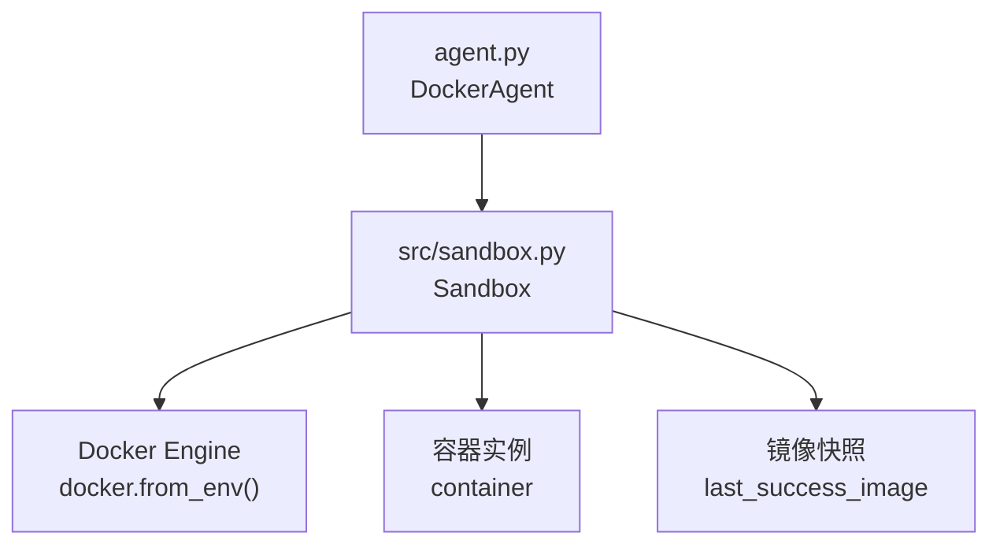
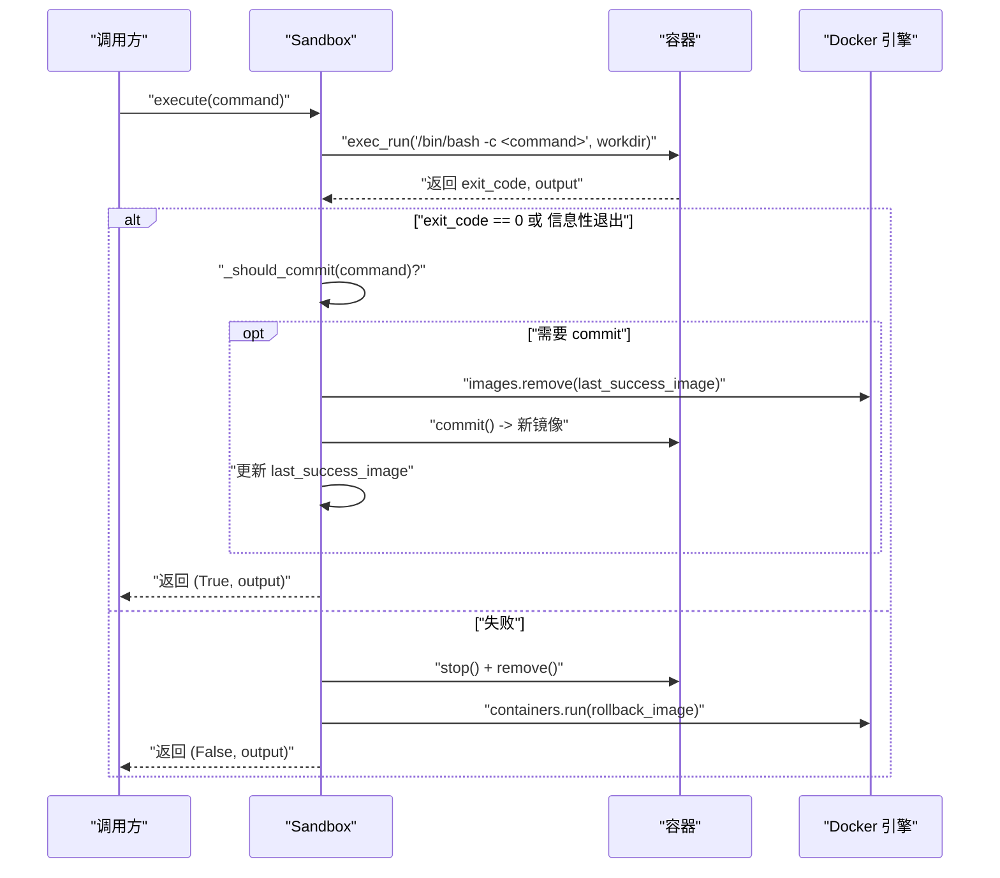
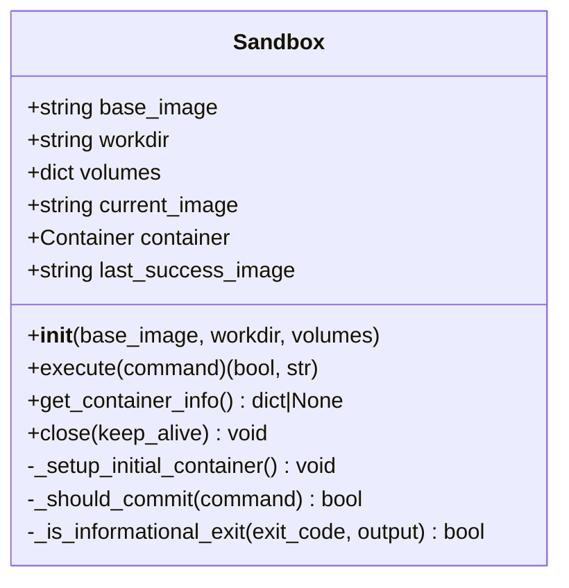
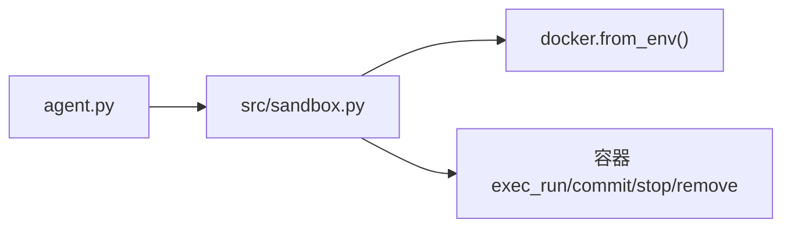

# Sandbox 模块 API

<cite>
**本文引用的文件**
- [src/sandbox.py](file://src/sandbox.py)
- [agent.py](file://agent.py)
- [doc/运行示例.md](file://doc/运行示例.md)
- [workplace/src/minisweagent/environments/docker.py](file://workplace/src/minisweagent/environments/docker.py)
- [workplace/tests/environments/test_docker.py](file://workplace/tests/environments/test_docker.py)
</cite>

## 目录
1. [简介](#简介)
2. [项目结构](#项目结构)
3. [核心组件](#核心组件)
4. [架构总览](#架构总览)
5. [详细组件分析](#详细组件分析)
6. [依赖关系分析](#依赖关系分析)
7. [性能考量](#性能考量)
8. [故障排除指南](#故障排除指南)
9. [结论](#结论)
10. [附录](#附录)

## 简介
本文件为 Sandbox 模块的详细 API 参考文档，聚焦于以下目标：
- 记录 Sandbox 类的构造函数参数：base_image、workdir、volumes。
- 文档化 execute() 方法的完整接口：输入命令字符串与返回的成功标志与输出。
- 说明容器管理 API：容器启动、停止与清理机制。
- 解释回滚机制的实现细节与使用场景。
- 包含命令执行的安全检查、超时处理与错误恢复策略。
- 提供 Docker 容器操作的最佳实践与故障排除指南。
- 给出完整的使用示例与集成代码路径。

## 项目结构
Sandbox 模块位于 src/sandbox.py，主要通过 Docker SDK 与本地 Docker 引擎交互，提供可回滚的命令执行能力，并在成功时对容器状态进行“快照”以便失败时回滚。

图表来源
- [agent.py](file://agent.py#L14-L38)
- [src/sandbox.py](file://src/sandbox.py#L4-L13)

章节来源
- [src/sandbox.py](file://src/sandbox.py#L1-L178)
- [agent.py](file://agent.py#L1-L160)

## 核心组件
- Sandbox 类：封装 Docker 容器生命周期、命令执行、回滚与清理。
- Docker Engine 客户端：通过 docker.from_env() 获取客户端，用于容器与镜像管理。
- 容器实例：每次执行命令后，若成功则提交为新镜像快照；失败则基于上次成功快照回滚。
- 快照管理：仅对会产生持久性变更的命令进行 commit，避免无意义的镜像堆积。

章节来源
- [src/sandbox.py](file://src/sandbox.py#L4-L13)
- [src/sandbox.py](file://src/sandbox.py#L147-L178)

## 架构总览
Sandbox 在初始化时拉起一个长期运行的容器，工作目录默认为 /app。每次执行命令时，先在容器内执行，根据返回码与输出判断是否成功；成功则对容器进行 commit 生成快照，失败则停止并删除当前容器，再从上次成功快照（或基础镜像）重新启动一个新容器。

图表来源
- [src/sandbox.py](file://src/sandbox.py#L29-L91)

章节来源
- [src/sandbox.py](file://src/sandbox.py#L29-L91)

## 详细组件分析

### Sandbox 类 API
- 构造函数
  - 参数
    - base_image: 字符串，默认值为 "python:3.10"。作为初始镜像与回滚兜底镜像。
    - workdir: 字符串，默认值为 "/app"。容器内工作目录。
    - volumes: 映射字典，形如 {本地路径: {'bind': 容器路径, 'mode': 'rw'}}。用于将宿主机目录挂载到容器。
  - 行为
    - 初始化 Docker 客户端。
    - 从 base_image 启动一个 detach + tty 的容器，设置工作目录与命令为 /bin/bash。
    - 确保工作目录存在。
  - 章节来源
    - [src/sandbox.py](file://src/sandbox.py#L5-L13)
    - [src/sandbox.py](file://src/sandbox.py#L15-L27)

- execute(command)
  - 输入
    - command: 字符串，表示要在容器内执行的 Bash 命令。
  - 处理流程
    - 使用容器 exec_run 执行命令，工作目录为 workdir。
    - 解析返回码与输出。
    - 判断是否为“信息性退出”（常见帮助/用法提示）。
    - 若成功或信息性退出：
      - 对会产生持久性变更的命令进行 commit，生成新镜像快照，并清理旧快照。
      - 返回 (True, output)。
    - 若失败：
      - 停止并删除当前容器。
      - 从上次成功快照（若存在）或 base_image 重新启动容器。
      - 返回 (False, output)。
  - 返回值
    - 成功标志: 布尔值，True 表示命令执行成功或信息性退出；False 表示命令失败。
    - 输出: 字符串，命令的标准输出与标准错误合并后的文本。
  - 章节来源
    - [src/sandbox.py](file://src/sandbox.py#L29-L91)

- _should_commit(command)
  - 作用：判断命令是否会对环境产生持久性影响，从而决定是否需要 commit。
  - 规则：若命令首词属于只读命令集合，则不 commit；否则 commit。
  - 章节来源
    - [src/sandbox.py](file://src/sandbox.py#L93-L112)

- _is_informational_exit(exit_code, output)
  - 作用：识别“信息性退出”，即非真正错误（如显示帮助、参数错误等）。
  - 规则：当 exit_code 为 1 或 2，且输出包含帮助特征关键词时，视为信息性退出。
  - 章节来源
    - [src/sandbox.py](file://src/sandbox.py#L114-L134)

- get_container_info()
  - 作用：返回容器的简要信息（ID、短ID、名称、状态），便于调试与验证。
  - 章节来源
    - [src/sandbox.py](file://src/sandbox.py#L136-L145)

- close(keep_alive=False)
  - 作用：关闭容器并清理相关资源。
  - 行为：
    - 若 keep_alive=True：打印如何后续进入容器与停止容器的指令，保留容器运行。
    - 若 keep_alive=False：停止并删除容器。
    - 清理 last_success_image。
    - 清理未使用的悬空镜像。
  - 章节来源
    - [src/sandbox.py](file://src/sandbox.py#L147-L178)

图表来源
- [src/sandbox.py](file://src/sandbox.py#L4-L13)
- [src/sandbox.py](file://src/sandbox.py#L29-L91)
- [src/sandbox.py](file://src/sandbox.py#L136-L178)

章节来源
- [src/sandbox.py](file://src/sandbox.py#L4-L13)
- [src/sandbox.py](file://src/sandbox.py#L29-L91)
- [src/sandbox.py](file://src/sandbox.py#L136-L178)

### 回滚机制详解
- 触发条件
  - execute() 返回失败（非 0 且非信息性退出）。
- 回滚步骤
  - 停止并删除当前容器。
  - 从 last_success_image（若存在）或 base_image 重新启动一个新容器。
- 快照策略
  - 仅对会产生持久性变更的命令进行 commit。
  - 成功后清理旧快照，避免镜像堆积。
- 使用场景
  - 安装依赖失败、编译报错、权限问题等导致环境被破坏时，快速回到上一个稳定状态。
- 章节来源
  - [src/sandbox.py](file://src/sandbox.py#L75-L91)
  - [src/sandbox.py](file://src/sandbox.py#L56-L73)

### 容器管理 API
- 启动
  - 由构造函数内部调用 _setup_initial_container() 完成，使用 detach=True、tty=True、working_dir=workdir、command="/bin/bash"。
- 停止
  - 通过 close(keep_alive=False) 或回滚过程中的 stop()。
- 清理
  - 删除容器、清理 last_success_image、prune 悬空镜像。
- 章节来源
  - [src/sandbox.py](file://src/sandbox.py#L15-L27)
  - [src/sandbox.py](file://src/sandbox.py#L147-L178)

### 命令执行安全检查与错误恢复
- 安全检查
  - 仅对会产生持久性变更的命令进行 commit，避免对只读命令（如 ls、cat、env 等）创建快照。
  - 信息性退出识别：对帮助/用法提示类命令不视为失败。
- 错误恢复
  - 失败时自动回滚至 last_success_image 或 base_image。
  - 回滚后继续执行后续步骤，无需人工干预。
- 章节来源
  - [src/sandbox.py](file://src/sandbox.py#L93-L134)
  - [src/sandbox.py](file://src/sandbox.py#L75-L91)

### 超时处理
- 当前实现
  - Sandbox.execute() 未显式设置超时参数，直接调用容器 exec_run。
- 对比参考
  - minisweagent 的 DockerEnvironment 提供了超时控制（config.timeout 与执行超时），并在异常时返回标准化输出。
- 建议
  - 如需超时保护，可在调用层对 execute() 的调用增加超时包装，或在容器侧设置进程级超时。
- 章节来源
  - [workplace/src/minisweagent/environments/docker.py](file://workplace/src/minisweagent/environments/docker.py#L101-L138)
  - [workplace/tests/environments/test_docker.py](file://workplace/tests/environments/test_docker.py#L210-L230)

## 依赖关系分析
- 外部依赖
  - docker: 通过 docker.from_env() 获取客户端，用于容器与镜像管理。
- 内部耦合
  - Sandbox 与 Docker 引擎强耦合，依赖容器 exec_run、commit、stop、remove 等能力。
  - 与 agent.py 的集成：DockerAgent 将本地工作区挂载到容器 /app，便于在容器内执行项目配置任务。
- 章节来源
  - [src/sandbox.py](file://src/sandbox.py#L1-L2)
  - [agent.py](file://agent.py#L22-L25)

图表来源
- [agent.py](file://agent.py#L22-L25)
- [src/sandbox.py](file://src/sandbox.py#L1-L2)
- [src/sandbox.py](file://src/sandbox.py#L38-L90)

章节来源
- [agent.py](file://agent.py#L14-L38)
- [src/sandbox.py](file://src/sandbox.py#L1-L13)

## 性能考量
- 快照清理
  - 成功后清理旧快照，避免镜像堆积。
- 只读命令跳过 commit
  - 减少不必要的镜像层创建，提升整体性能。
- 容器复用
  - 失败回滚时复用上次成功快照，减少重复安装时间。
- 建议
  - 对频繁执行的只读命令（如 ls、env、find）可考虑缓存输出，避免重复执行。
  - 在大规模批量执行场景下，建议分批执行并定期清理未使用镜像。

章节来源
- [src/sandbox.py](file://src/sandbox.py#L56-L73)
- [src/sandbox.py](file://src/sandbox.py#L93-L112)
- [src/sandbox.py](file://src/sandbox.py#L171-L177)

## 故障排除指南
- Docker 不可用
  - 现象：无法连接 Docker 引擎。
  - 排查：确认 Docker 服务已启动，用户具有访问权限。
  - 章节来源
    - [workplace/tests/environments/test_docker.py](file://workplace/tests/environments/test_docker.py#L10-L26)

- 镜像拉取超时
  - 现象：首次启动容器时镜像拉取耗时过长。
  - 排查：检查网络与镜像源，必要时预拉取基础镜像。
  - 章节来源
    - [workplace/src/minisweagent/environments/docker.py](file://workplace/src/minisweagent/environments/docker.py#L36-L37)

- 容器无法停止/删除
  - 现象：close() 时抛出异常或资源未释放。
  - 排查：确保 Docker 权限正确，必要时手动清理残留容器与镜像。
  - 章节来源
    - [src/sandbox.py](file://src/sandbox.py#L154-L160)
    - [src/sandbox.py](file://src/sandbox.py#L162-L177)

- 回滚后环境不一致
  - 现象：回滚后某些状态与预期不符。
  - 排查：确认 _should_commit() 判定逻辑是否符合预期；必要时调整只读命令集合。
  - 章节来源
    - [src/sandbox.py](file://src/sandbox.py#L93-L112)

- 命令输出乱码或截断
  - 现象：输出解码出现错误或内容被截断。
  - 排查：检查字符集与编码设置，必要时在调用层进行转码处理。
  - 章节来源
    - [src/sandbox.py](file://src/sandbox.py#L44)

## 结论
Sandbox 模块通过“成功即快照、失败即回滚”的策略，在保证命令执行安全性的同时，显著提升了环境配置的容错能力。结合只读命令跳过 commit 的优化，既降低了镜像层数量，也提高了执行效率。建议在生产环境中配合超时控制与资源清理策略，进一步增强稳定性与可观测性。

## 附录

### 使用示例与集成代码
- 基本用法
  - 在 agent.py 中，DockerAgent 将本地工作区挂载到容器 /app，并使用 Sandbox 执行配置命令。
  - 章节来源
    - [agent.py](file://agent.py#L22-L25)
    - [agent.py](file://agent.py#L60-L126)

- 执行流程示例
  - 运行示例展示了从克隆仓库、安装依赖到生成 Dockerfile 与 QuickStart 文档的完整流程。
  - 章节来源
    - [doc/运行示例.md](file://doc/运行示例.md#L1-L475)

- Docker 环境对比参考
  - minisweagent 的 DockerEnvironment 提供了更完善的超时、环境变量转发与清理机制，可作为扩展参考。
  - 章节来源
    - [workplace/src/minisweagent/environments/docker.py](file://workplace/src/minisweagent/environments/docker.py#L15-L43)
    - [workplace/src/minisweagent/environments/docker.py](file://workplace/src/minisweagent/environments/docker.py#L101-L138)
    - [workplace/tests/environments/test_docker.py](file://workplace/tests/environments/test_docker.py#L56-L90)