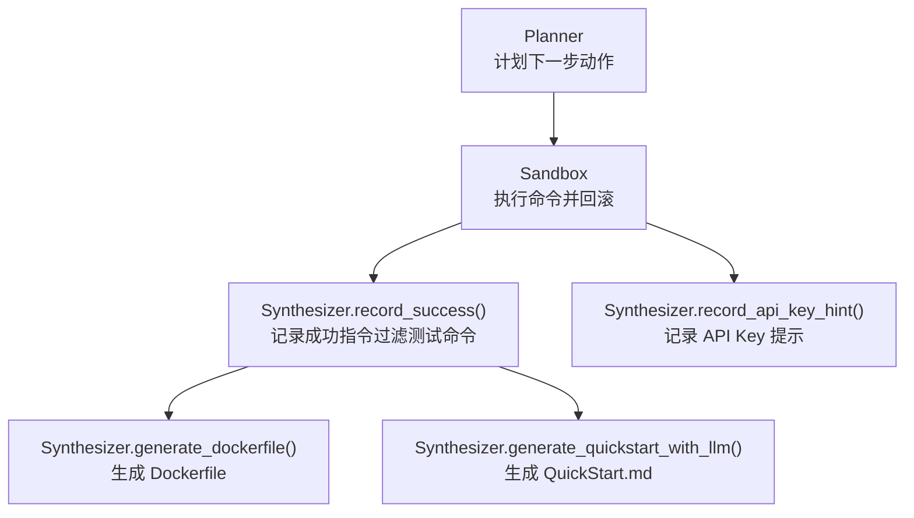
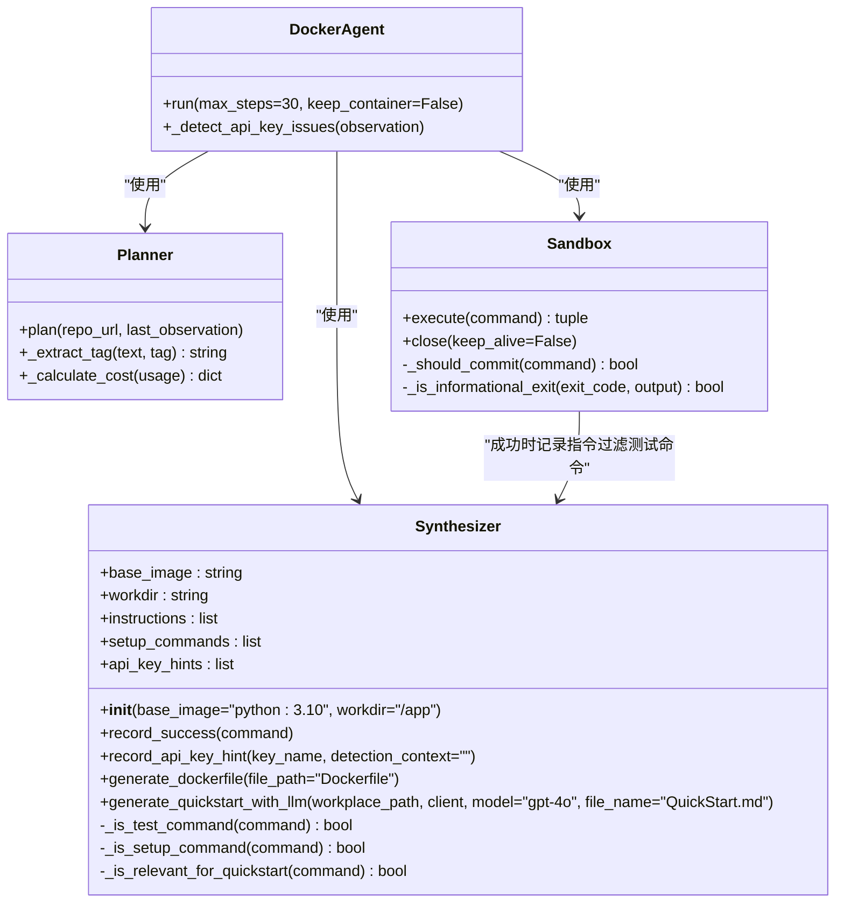
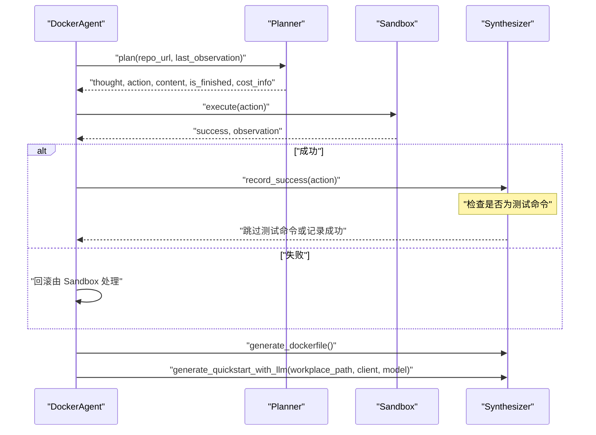

# Synthesizer 模块 API

<cite>
**本文引用的文件**
- [src/synthesizer.py](file://src/synthesizer.py)
- [agent.py](file://agent.py)
- [src/sandbox.py](file://src/sandbox.py)
- [src/planner.py](file://src/planner.py)
- [README.md](file://README.md)
- [requirements.txt](file://requirements.txt)
</cite>

## 更新摘要
**变更内容**
- 新增测试命令过滤功能：在生成 Dockerfile 时自动跳过测试命令，避免不必要的测试执行
- 更新 record_success() 方法行为：新增 _is_test_command() 检查机制
- 扩展测试命令识别关键词：包括 pytest、py.test、unittest、test、tox、nose 等
- 保持现有功能完整性：API 接口和行为保持向后兼容

## 目录
1. [简介](#简介)
2. [项目结构](#项目结构)
3. [核心组件](#核心组件)
4. [架构总览](#架构总览)
5. [详细组件分析](#详细组件分析)
6. [依赖关系分析](#依赖关系分析)
7. [性能考量](#性能考量)
8. [故障排查指南](#故障排查指南)
9. [结论](#结论)
10. [附录](#附录)

## 简介
本文件为 Synthesizer 模块的全面 API 参考文档，覆盖以下内容：
- Synthesizer 类的构造函数与初始化参数
- record_success() 方法的接口与成功指令记录机制（含测试命令过滤）
- generate_dockerfile() 方法的实现与 Dockerfile 生成逻辑
- generate_quickstart_with_llm() 方法的完整接口、参数说明与输出格式
- record_api_key_hint() 方法的 API 规范与使用场景
- 文档生成的配置选项、输出文件格式与质量控制机制
- 使用示例与自定义扩展指南

## 项目结构
Synthesizer 是一个轻量级模块，负责在 ReAct 执行流程中记录成功的 Bash 指令，并在环境配置完成后生成 Dockerfile 与 QuickStart 文档。其典型工作流如下：

**图表来源**
- [agent.py](file://agent.py#L60-L125)
- [src/synthesizer.py](file://src/synthesizer.py#L1-L154)
- [src/sandbox.py](file://src/sandbox.py#L1-L178)
- [src/planner.py](file://src/planner.py#L1-L145)

**章节来源**
- [README.md](file://README.md#L1-L47)
- [requirements.txt](file://requirements.txt#L1-L4)

## 核心组件
- Synthesizer 类：维护基础镜像、工作目录、指令列表、安装配置命令集合与 API Key 提示集合；提供记录成功指令、生成 Dockerfile、生成 QuickStart 文档以及记录 API Key 提示的能力。**新增测试命令过滤功能**。

**章节来源**
- [src/synthesizer.py](file://src/synthesizer.py#L1-L31)

## 架构总览
下图展示了 Synthesizer 在整体系统中的职责边界与交互关系：

**图表来源**
- [src/synthesizer.py](file://src/synthesizer.py#L1-L154)
- [src/planner.py](file://src/planner.py#L1-L145)
- [src/sandbox.py](file://src/sandbox.py#L1-L178)
- [agent.py](file://agent.py#L1-L160)

## 详细组件分析

### Synthesizer 类
- 构造函数
  - 参数
    - base_image: 字符串，默认值为 "python:3.10"，用于生成 Dockerfile 的基础镜像
    - workdir: 字符串，默认值为 "/app"，用于生成 Dockerfile 的工作目录
  - 初始化字段
    - instructions: 记录所有成功指令（以 RUN 形式）
    - setup_commands: 仅记录环境配置相关的安装/配置命令，用于 QuickStart 生成
    - api_key_hints: 记录检测到的 API Key 需求及其上下文

- record_success(command)
  - **更新**：新增测试命令过滤功能
  - 功能：将成功的 Bash 命令记录为 Dockerfile 中的 RUN 指令
  - 行为：
    - **新增**：首先检查命令是否为测试命令（通过 _is_test_command 判断），若是则直接返回，不记录
    - 将命令追加到 instructions 列表（格式为 RUN <command>）
    - 若命令属于环境配置相关（通过关键字匹配判断），同时追加到 setup_commands
  - 返回：无（方法内部完成记录）

- record_api_key_hint(key_name, detection_context="")
  - 功能：记录检测到的 API Key 需求
  - 行为：
    - 以字典形式存储 {key_name, detection_context}
    - 去重后追加到 api_key_hints
  - 返回：无（方法内部完成记录）

- generate_dockerfile(file_path="Dockerfile")
  - 功能：生成最终的 Dockerfile
  - 行为：
    - 以 base_image 与 workdir 作为起始内容
    - 追加所有 instructions（**已过滤测试命令**）
    - 写入指定路径的文件并打印成功提示
  - 返回：生成的 Dockerfile 内容字符串

- generate_quickstart_with_llm(workplace_path, client, model="gpt-4o", file_name="QuickStart.md")
  - 功能：基于 README 与真实安装配置命令生成简洁的 QuickStart.md
  - 参数
    - workplace_path: 工作区绝对路径（用于读取 README 与写入输出）
    - client: LLM 客户端对象（需支持 chat.completions.create）
    - model: LLM 模型名称，默认 "gpt-4o"
    - file_name: 输出文件名，默认 "QuickStart.md"
  - 行为
    - 若未记录任何 setup_commands，直接警告并返回
    - 过滤掉纯查看类指令，仅保留与安装配置相关的命令
    - 读取 README.md（若不存在则使用占位提示文本）
    - 构造 Prompt，要求生成包含以下结构的文档：
      - Setup Steps：列出安装配置命令（每个命令一行）
      - How to Run：从 README 中提取启动/运行命令、校验命令与示例命令（排除安装命令）
      - API Key Configuration：若 README 显示需要 API Key，则提供两种配置方式（环境变量与 .env 文件），并使用 README 中的实际变量名
      - Notes：其他密钥或配置说明
    - 调用 LLM 生成内容并写入文件，返回生成内容
  - 返回：生成的 QuickStart.md 内容字符串，或在异常时返回 None

- 辅助方法
  - **新增** _is_test_command(command): 判断命令是否为测试命令（不应加入 Dockerfile）
    - 测试关键词：pytest、py.test、unittest、test、tox、nose
    - 返回布尔值，用于过滤测试命令
  - _is_setup_command(command): 判断命令是否为环境配置相关（用于 QuickStart 的 setup_commands 收集）
  - _is_relevant_for_quickstart(command): 判断命令是否应出现在 QuickStart 文档中（过滤 ls/cat/echo 等只读/信息类命令）

**章节来源**
- [src/synthesizer.py](file://src/synthesizer.py#L1-L154)

### 接口序列图：成功指令记录与文档生成

**图表来源**
- [agent.py](file://agent.py#L60-L125)
- [src/synthesizer.py](file://src/synthesizer.py#L9-L154)
- [src/sandbox.py](file://src/sandbox.py#L29-L92)
- [src/planner.py](file://src/planner.py#L69-L105)

## 依赖关系分析
- 外部依赖
  - openai：用于调用 LLM 生成 QuickStart 文档
  - docker：用于 Sandbox 的容器执行与回滚
  - python-dotenv：用于加载环境变量（如 OPENAI_API_KEY）

- 组件耦合
  - Synthesizer 与 Planner/Sandbox 的交互通过 DockerAgent 协调
  - record_success 与 Sandbox 的成功执行结果强关联
  - generate_quickstart_with_llm 依赖 README.md 与 LLM 客户端

**章节来源**
- [requirements.txt](file://requirements.txt#L1-L4)
- [agent.py](file://agent.py#L1-L160)

## 性能考量
- Dockerfile 生成
  - 采用线性拼接指令列表的方式，时间复杂度 O(n)，其中 n 为记录的指令数
  - **新增**：测试命令过滤减少不必要的指令数量，提高生成效率
  - 建议在大规模指令场景下关注文件写入 I/O 开销

- QuickStart 生成
  - 依赖 LLM 调用，成本与输入长度相关（Prompt 包含 README 截断与安装命令列表）
  - 温度设为 0 以提升输出稳定性，但可能牺牲多样性
  - 建议在生成前对 README 与安装命令进行必要的清洗与去重

- 回滚与快照
  - Sandbox 的成功状态回滚与镜像快照会占用磁盘空间，建议在任务结束后清理

**章节来源**
- [src/synthesizer.py](file://src/synthesizer.py#L140-L154)
- [src/synthesizer.py](file://src/synthesizer.py#L42-L132)
- [src/sandbox.py](file://src/sandbox.py#L56-L91)

## 故障排查指南
- 未生成 QuickStart.md
  - 可能原因：未记录任何 setup_commands 或过滤后为空
  - 处理：确认 Sandbox 执行是否成功，确保 Planner 输出的 Action 为安装/配置类命令

- README.md 未找到或不可读
  - 行为：使用占位提示文本替代
  - 处理：检查 workplace 路径与 README.md 权限

- LLM 生成失败
  - 可能原因：网络问题、模型不可用、API Key 配置错误
  - 处理：检查 OPENAI_API_KEY 与 base_url，确认 LLM 客户端可用性

- Dockerfile 未生成
  - 可能原因：未发生任何成功指令记录
  - 处理：确认 Sandbox 的执行逻辑与成功判定条件

- **新增** 测试命令仍出现在 Dockerfile 中
  - 可能原因：测试命令识别关键词不完整
  - 处理：检查 _is_test_command 方法中的关键词列表，必要时扩展识别规则

**章节来源**
- [src/synthesizer.py](file://src/synthesizer.py#L42-L56)
- [src/synthesizer.py](file://src/synthesizer.py#L58-L68)
- [src/synthesizer.py](file://src/synthesizer.py#L112-L132)
- [src/synthesizer.py](file://src/synthesizer.py#L140-L154)

## 结论
Synthesizer 模块通过记录成功的 Bash 指令，实现了从 ReAct 执行到可复现 Docker 环境与用户可读文档的闭环。**最新版本新增的测试命令过滤功能有效避免了不必要的测试执行，提高了 Dockerfile 生成的安全性和效率**。其 API 设计简洁、职责清晰，便于集成与扩展。在实际使用中，建议结合 Planner 的计划能力与 Sandbox 的执行回滚机制，确保生成的 Dockerfile 与 QuickStart 文档具备高可用性与准确性。

## 附录

### 使用示例
- 基本用法
  - 在 DockerAgent 中初始化 Synthesizer，并在每次成功执行后调用 record_success
  - 在配置完成后调用 generate_dockerfile 与 generate_quickstart_with_llm

- **新增** 测试命令过滤示例
  - 测试命令（如 pytest、py.test、unittest、test、tox、nose）将被自动过滤
  - 非测试命令会被正常记录到 Dockerfile 中

- 示例调用路径
  - [DockerAgent.run](file://agent.py#L181-L248)
  - [Synthesizer.record_success](file://src/synthesizer.py#L9-L19)
  - [Synthesizer.generate_dockerfile](file://src/synthesizer.py#L140-L154)
  - [Synthesizer.generate_quickstart_with_llm](file://src/synthesizer.py#L42-L132)

### 自定义扩展指南
- 自定义基础镜像与工作目录
  - 通过构造函数参数 base_image 与 workdir 控制生成的 Dockerfile 基础层与工作目录

- 自定义安装命令识别规则
  - 修改 _is_setup_command 的关键字集合，以适配不同项目的依赖管理工具

- **新增** 自定义测试命令识别规则
  - 修改 _is_test_command 方法中的测试关键词列表，添加或删除特定的测试框架识别
  - 支持扩展更多测试框架如 coverage、flake8、black 等

- 自定义 QuickStart 输出结构
  - 调整 generate_quickstart_with_llm 的 Prompt，增加或删减章节项（如新增"常见问题"、"兼容性说明"等）

- 自定义 API Key 提示来源
  - 在 _detect_api_key_issues 中扩展检测模式，以覆盖更多第三方服务的错误提示

**章节来源**
- [src/synthesizer.py](file://src/synthesizer.py#L2-L7)
- [src/synthesizer.py](file://src/synthesizer.py#L21-L25)
- [src/synthesizer.py](file://src/synthesizer.py#L133-L138)
- [agent.py](file://agent.py#L250-L269)