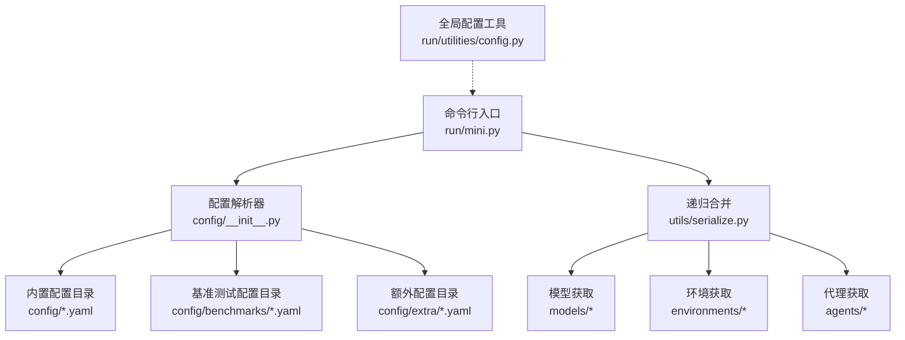
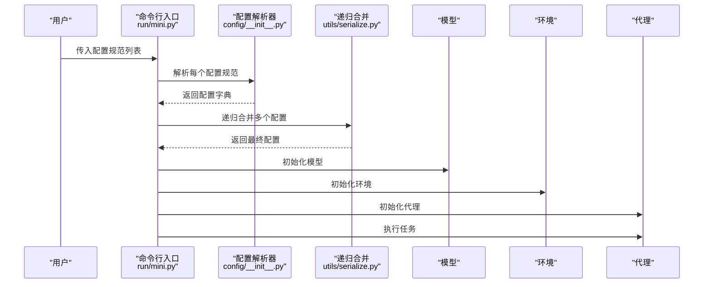
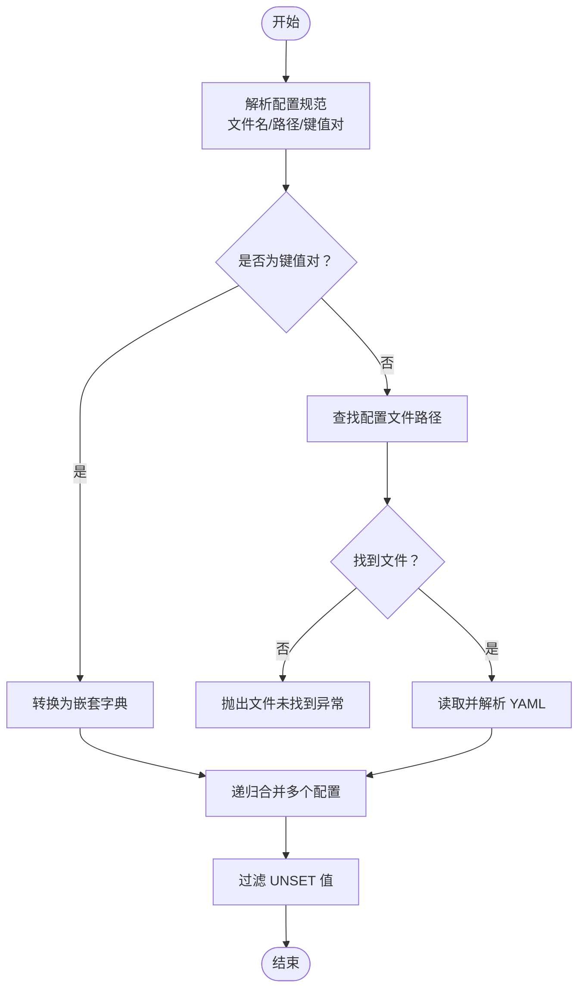
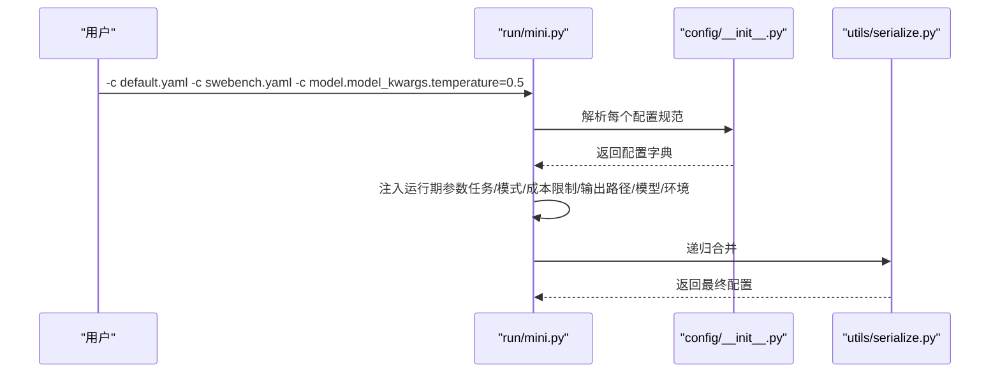
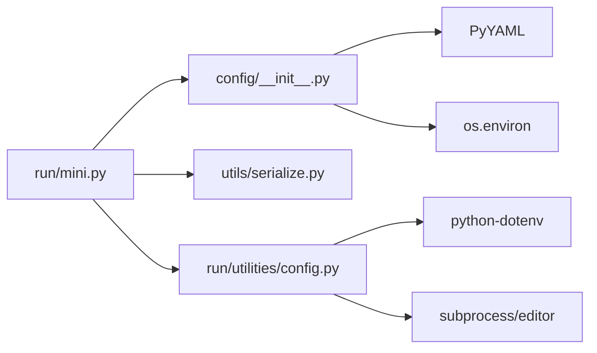

# 配置 API

<cite>
**本文引用的文件**
- [workplace/src/minisweagent/config/default.yaml](file://workplace/src/minisweagent/config/default.yaml)
- [workplace/src/minisweagent/config/mini.yaml](file://workplace/src/minisweagent/config/mini.yaml)
- [workplace/src/minisweagent/config/mini_textbased.yaml](file://workplace/src/minisweagent/config/mini_textbased.yaml)
- [workplace/src/minisweagent/config/benchmarks/swebench.yaml](file://workplace/src/minisweagent/config/benchmarks/swebench.yaml)
- [workplace/src/minisweagent/config/benchmarks/swebench_xml.yaml](file://workplace/src/minisweagent/config/benchmarks/swebench_xml.yaml)
- [workplace/src/minisweagent/config/benchmarks/swebench_modal.yaml](file://workplace/src/minisweagent/config/benchmarks/swebench_modal.yaml)
- [workplace/src/minisweagent/config/__init__.py](file://workplace/src/minisweagent/config/__init__.py)
- [workplace/src/minisweagent/run/mini.py](file://workplace/src/minisweagent/run/mini.py)
- [workplace/src/minisweagent/run/utilities/config.py](file://workplace/src/minisweagent/run/utilities/config.py)
- [workplace/src/minisweagent/utils/serialize.py](file://workplace/src/minisweagent/utils/serialize.py)
- [workplace/.env](file://workplace/.env)
</cite>

## 目录
1. [简介](#简介)
2. [项目结构](#项目结构)
3. [核心组件](#核心组件)
4. [架构总览](#架构总览)
5. [详细组件分析](#详细组件分析)
6. [依赖分析](#依赖分析)
7. [性能考虑](#性能考虑)
8. [故障排查指南](#故障排查指南)
9. [结论](#结论)
10. [附录](#附录)

## 简介
本文件面向 Repo Dockerizer Agent 的配置系统，提供完整的 API 文档与最佳实践说明。内容覆盖默认配置 default.yaml 的全部配置项（LLM 模型设置、环境变量、行为参数），.env 环境变量文件的格式与可用选项，基准测试配置文件的结构与用途，以及配置文件的优先级与继承关系。同时包含配置验证规则、默认值说明、错误处理机制，并给出定制化的最佳实践与常见场景示例。

## 项目结构
配置系统由以下关键部分组成：
- 内置配置文件：位于配置目录下的 YAML 文件，如 default.yaml、mini.yaml、mini_textbased.yaml 及基准测试配置（benchmarks）。
- 配置解析器：负责根据名称或路径解析并加载配置，支持从内置目录、额外目录、基准测试目录等多候选位置查找。
- 合并与覆盖：通过递归合并策略将多个配置源按顺序合并，后出现的配置覆盖先前配置；支持 UNSET 值过滤。
- 全局配置工具：提供交互式设置、编辑、取消设置全局配置键的能力，便于首次使用与日常维护。
- 运行入口：命令行入口会收集配置规范，构建最终配置并驱动模型、环境与代理执行。

图表来源
- [workplace/src/minisweagent/run/mini.py](file://workplace/src/minisweagent/run/mini.py#L1-L110)
- [workplace/src/minisweagent/config/__init__.py](file://workplace/src/minisweagent/config/__init__.py#L12-L62)
- [workplace/src/minisweagent/utils/serialize.py](file://workplace/src/minisweagent/utils/serialize.py#L6-L29)
- [workplace/src/minisweagent/run/utilities/config.py](file://workplace/src/minisweagent/run/utilities/config.py#L1-L117)

章节来源
- [workplace/src/minisweagent/run/mini.py](file://workplace/src/minisweagent/run/mini.py#L1-L110)
- [workplace/src/minisweagent/config/__init__.py](file://workplace/src/minisweagent/config/__init__.py#L12-L62)
- [workplace/src/minisweagent/utils/serialize.py](file://workplace/src/minisweagent/utils/serialize.py#L6-L29)
- [workplace/src/minisweagent/run/utilities/config.py](file://workplace/src/minisweagent/run/utilities/config.py#L1-L117)

## 核心组件
- 配置解析器
  - 支持通过名称或完整路径解析配置文件，按候选顺序查找：当前工作目录、MSWEA_CONFIG_DIR 环境变量指定目录、内置配置目录、额外配置目录、基准测试目录。
  - 支持命令行键值对形式的配置片段，自动转换为嵌套字典。
- 递归合并器
  - 多个配置字典按顺序递归合并，后出现的配置覆盖先前配置；字典类型字段进行深度合并，非字典直接覆盖。
  - 支持跳过 UNSET 值，确保未显式设置的键不会污染最终配置。
- 全局配置工具
  - 提供首次配置引导、设置键值、取消键值、编辑配置文件等能力，便于在不修改代码的情况下调整全局行为。
- 运行入口
  - 命令行入口支持多配置叠加与键值覆盖，构建最终配置后初始化模型、环境与代理并执行任务。

章节来源
- [workplace/src/minisweagent/config/__init__.py](file://workplace/src/minisweagent/config/__init__.py#L12-L62)
- [workplace/src/minisweagent/utils/serialize.py](file://workplace/src/minisweagent/utils/serialize.py#L6-L29)
- [workplace/src/minisweagent/run/utilities/config.py](file://workplace/src/minisweagent/run/utilities/config.py#L51-L117)
- [workplace/src/minisweagent/run/mini.py](file://workplace/src/minisweagent/run/mini.py#L54-L105)

## 架构总览
下图展示了配置从输入到生效的关键流程：命令行解析配置规范 → 解析器定位配置文件或键值对 → 递归合并 → 初始化模型/环境/代理 → 执行任务。

图表来源
- [workplace/src/minisweagent/run/mini.py](file://workplace/src/minisweagent/run/mini.py#L70-L105)
- [workplace/src/minisweagent/config/__init__.py](file://workplace/src/minisweagent/config/__init__.py#L54-L62)
- [workplace/src/minisweagent/utils/serialize.py](file://workplace/src/minisweagent/utils/serialize.py#L6-L29)

## 详细组件分析

### 默认配置 default.yaml
该文件定义了通用的系统提示模板、实例模板、步数限制、成本限制、观察模板、格式化错误模板及模型参数等。适用于基础交互式任务与通用场景。

- agent.system_template / agent.instance_template
  - 定义系统角色与任务上下文模板，支持 Jinja2 变量替换。
- agent.step_limit / agent.cost_limit
  - 步数上限与成本上限，用于控制任务执行范围与开销。
- environment.env.*
  - 环境变量集合，影响沙箱执行时的工具行为与输出显示。
- model.observation_template / model.format_error_template
  - 观察结果模板与格式化错误模板，用于标准化模型输出与错误信息。
- model.model_kwargs.drop_params
  - 是否丢弃不兼容参数，避免因模型差异导致的调用失败。

章节来源
- [workplace/src/minisweagent/config/default.yaml](file://workplace/src/minisweagent/config/default.yaml#L1-L167)

### 交互式配置 mini.yaml
该文件针对交互式任务优化，强调逐步执行与确认模式，适合本地开发与调试。

- agent.mode
  - 设置为 confirm，要求每一步操作需确认。
- agent.step_limit / agent.cost_limit
  - 与 default.yaml 类似，用于限制执行步数与成本。
- environment.env.*
  - 与 default.yaml 一致，统一环境变量。
- model.observation_template / model.format_error_template
  - 观察与错误模板，适配交互式任务的输出格式。

章节来源
- [workplace/src/minisweagent/config/mini.yaml](file://workplace/src/minisweagent/config/mini.yaml#L1-L148)

### 文本基交互配置 mini_textbased.yaml
该文件面向文本基交互场景，强调严格的响应格式与三重反引号包裹的命令块。

- agent.system_template / agent.instance_template
  - 强制每次响应仅包含一个 bash 命令块，并在命令前提供思考说明。
- agent.step_limit / agent.cost_limit
  - 控制执行步数与成本。
- model.observation_template / model.model_kwargs.drop_params
  - 观察模板与参数丢弃策略。
- model.format_error_template
  - 错误格式化模板，指导如何正确构造响应。

章节来源
- [workplace/src/minisweagent/config/mini_textbased.yaml](file://workplace/src/minisweagent/config/mini_textbased.yaml#L1-L167)

### 基准测试配置（benchmarks）
基准测试配置用于在标准环境下评估代理性能，通常包含更严格的约束与统一的环境设置。

- swebench.yaml
  - 面向 SWE-bench 评测的标准配置，包含系统提示、实例模板、步数与成本限制、工作目录、超时、解释器、环境变量、环境类（docker）、观察模板与模型参数等。
- swebench_xml.yaml
  - 与 swebench.yaml 类似，但采用 XML 标签格式的命令块，强调严格格式与一次性命令块。
- swebench_modal.yaml
  - Modal 云环境配置，通过环境类 swerex_modal 覆盖环境设置，包含启动超时、运行时超时、部署超时、pipx 安装开关、Modal 沙箱参数等；可与 swebench 基础配置合并使用。

章节来源
- [workplace/src/minisweagent/config/benchmarks/swebench.yaml](file://workplace/src/minisweagent/config/benchmarks/swebench.yaml#L1-L178)
- [workplace/src/minisweagent/config/benchmarks/swebench_xml.yaml](file://workplace/src/minisweagent/config/benchmarks/swebench_xml.yaml#L1-L228)
- [workplace/src/minisweagent/config/benchmarks/swebench_modal.yaml](file://workplace/src/minisweagent/config/benchmarks/swebench_modal.yaml#L1-L49)

### 配置解析与合并机制
- 配置解析
  - 支持三种输入：完整路径、仅文件名（自动补全 .yaml）、键值对字符串（形如 key=value 或 key.nested=value）。
  - 键值对会被转换为嵌套字典，便于后续合并。
- 配置查找
  - 按候选顺序查找：当前工作目录、MSWEA_CONFIG_DIR 指定目录、内置配置目录、额外配置目录、基准测试目录。
- 递归合并
  - 后出现的配置覆盖先前配置；字典类型字段进行深度合并；UNSET 值被过滤掉。
- 错误处理
  - 若无法找到配置文件，抛出 FileNotFoundError，包含候选路径列表，便于快速定位问题。

图表来源
- [workplace/src/minisweagent/config/__init__.py](file://workplace/src/minisweagent/config/__init__.py#L12-L62)
- [workplace/src/minisweagent/utils/serialize.py](file://workplace/src/minisweagent/utils/serialize.py#L6-L29)

章节来源
- [workplace/src/minisweagent/config/__init__.py](file://workplace/src/minisweagent/config/__init__.py#L12-L62)
- [workplace/src/minisweagent/utils/serialize.py](file://workplace/src/minisweagent/utils/serialize.py#L6-L29)

### 全局配置工具（.env）
- .env 文件
  - 存放 API 密钥与服务端点等敏感信息，建议使用受控权限的文件。
  - 示例中包含 OPENAI_API_KEY 与 OPENAI_API_BASE。
- 全局配置命令
  - setup：首次配置引导，询问默认模型与 API 密钥，写入全局配置文件并标记已配置。
  - set/unset：设置或取消设置键值。
  - edit：使用 EDITOR 编辑全局配置文件。
  - configure_if_first_time：若未配置则自动触发 setup。

章节来源
- [workplace/.env](file://workplace/.env#L1-L2)
- [workplace/src/minisweagent/run/utilities/config.py](file://workplace/src/minisweagent/run/utilities/config.py#L51-L117)

### 运行入口与配置优先级
- 运行入口
  - 支持通过 -c/--config 传入多个配置规范，按顺序解析并合并。
  - 支持直接覆盖模型、代理、环境、任务、成本限制、输出路径等运行期参数。
- 优先级与继承
  - 命令行传入的配置优先于默认配置文件；键值对覆盖优先于文件配置。
  - 合并顺序：先加载各配置文件/键值对，再注入运行期参数（如任务、模式、成本限制等），最后进行递归合并。

图表来源
- [workplace/src/minisweagent/run/mini.py](file://workplace/src/minisweagent/run/mini.py#L70-L92)
- [workplace/src/minisweagent/config/__init__.py](file://workplace/src/minisweagent/config/__init__.py#L54-L62)
- [workplace/src/minisweagent/utils/serialize.py](file://workplace/src/minisweagent/utils/serialize.py#L6-L29)

章节来源
- [workplace/src/minisweagent/run/mini.py](file://workplace/src/minisweagent/run/mini.py#L54-L105)

## 依赖分析
- 组件耦合
  - 运行入口依赖配置解析器与递归合并器；配置解析器依赖 YAML 与环境变量；全局配置工具依赖 dotenv 与子进程编辑器。
- 外部依赖
  - YAML 解析（PyYAML）、环境变量（os.environ）、键值对 JSON 解码（json.loads）。
- 循环依赖
  - 未发现循环导入；模块职责清晰，接口稳定。

图表来源
- [workplace/src/minisweagent/run/mini.py](file://workplace/src/minisweagent/run/mini.py#L1-L110)
- [workplace/src/minisweagent/config/__init__.py](file://workplace/src/minisweagent/config/__init__.py#L1-L62)
- [workplace/src/minisweagent/run/utilities/config.py](file://workplace/src/minisweagent/run/utilities/config.py#L1-L117)

章节来源
- [workplace/src/minisweagent/run/mini.py](file://workplace/src/minisweagent/run/mini.py#L1-L110)
- [workplace/src/minisweagent/config/__init__.py](file://workplace/src/minisweagent/config/__init__.py#L1-L62)
- [workplace/src/minisweagent/run/utilities/config.py](file://workplace/src/minisweagent/run/utilities/config.py#L1-L117)

## 性能考虑
- 配置解析与合并
  - 合并复杂度近似 O(N+M)，其中 N、M 为配置字典键数量；深度合并仅发生在字典类型字段。
- 输出裁剪
  - 观察模板对长输出进行头尾裁剪与警告提示，避免大体量数据影响模型处理效率。
- 环境变量
  - 通过环境变量关闭进度条与分页器等工具，减少噪声输出，提升交互流畅性。

## 故障排查指南
- 无法找到配置文件
  - 现象：抛出“未找到配置文件”异常，包含候选路径列表。
  - 排查：确认文件是否存在、路径是否正确、MSWEA_CONFIG_DIR 是否设置、文件扩展名是否为 .yaml。
- 键值对解析失败
  - 现象：键值对字符串无法解析为嵌套字典。
  - 排查：检查键名层级与分隔符（点号）、值是否为合法 JSON 字符串。
- UNSET 值导致字段缺失
  - 现象：某些字段未出现在最终配置中。
  - 排查：确认是否通过运行期参数或键值对设置了 UNSET；UNSET 将被过滤。
- 全局配置未生效
  - 现象：首次运行未弹出配置引导或 API 密钥未被识别。
  - 排查：确认 MSWEA_CONFIGURED 是否设置；检查全局配置文件路径与权限；确认 EDITOR 环境变量是否正确。

章节来源
- [workplace/src/minisweagent/config/__init__.py](file://workplace/src/minisweagent/config/__init__.py#L28-L28)
- [workplace/src/minisweagent/utils/serialize.py](file://workplace/src/minisweagent/utils/serialize.py#L20-L21)
- [workplace/src/minisweagent/run/utilities/config.py](file://workplace/src/minisweagent/run/utilities/config.py#L51-L84)

## 结论
配置系统以“可组合、可覆盖、可扩展”为核心设计原则：通过内置配置文件提供开箱即用的默认行为，借助键值对与多配置文件实现灵活定制，配合递归合并与 UNSET 过滤保障最终配置的准确性与一致性。结合全局配置工具与运行入口，用户可在不同场景（本地交互、基准测试、云环境）下快速切换并稳定运行。

## 附录

### 配置项速查表（default.yaml）
- agent.system_template / agent.instance_template
  - 作用：定义系统角色与任务上下文模板，支持变量替换。
  - 默认值：见 default.yaml。
- agent.step_limit / agent.cost_limit
  - 作用：限制执行步数与成本。
  - 默认值：见 default.yaml。
- environment.env.*
  - 作用：设置沙箱环境变量（如 PAGER、LESS、PIP_PROGRESS_BAR、TQDM_DISABLE）。
  - 默认值：见 default.yaml。
- model.observation_template / model.format_error_template
  - 作用：标准化观察结果与错误格式。
  - 默认值：见 default.yaml。
- model.model_kwargs.drop_params
  - 作用：丢弃不兼容参数。
  - 默认值：见 default.yaml。

章节来源
- [workplace/src/minisweagent/config/default.yaml](file://workplace/src/minisweagent/config/default.yaml#L1-L167)

### .env 文件格式与可用选项
- 文件位置：位于配置目录，建议使用受控权限。
- 示例键：
  - OPENAI_API_KEY：OpenAI API 密钥。
  - OPENAI_API_BASE：OpenAI 代理服务端点。
- 全局配置工具：
  - setup：首次配置引导，写入 MSWEA_CONFIGURED 标记。
  - set/unset：设置或取消设置任意键值。
  - edit：使用 EDITOR 编辑全局配置文件。

章节来源
- [workplace/.env](file://workplace/.env#L1-L2)
- [workplace/src/minisweagent/run/utilities/config.py](file://workplace/src/minisweagent/run/utilities/config.py#L58-L117)

### 基准测试配置结构与用途
- swebench.yaml
  - 用途：SWE-bench 标准评测配置，统一工作目录、超时、解释器与环境变量，指定 docker 环境类。
  - 关键字段：agent.*、environment.cwd/timeout/interpreter/env/environment_class、model.*。
- swebench_xml.yaml
  - 用途：XML 命令块格式的 SWE-bench 配置，强调严格格式与一次性命令块。
  - 关键字段：action_regex、model_class 等。
- swebench_modal.yaml
  - 用途：Modal 云环境配置，覆盖环境类为 swerex_modal，增加 Modal 特定超时与沙箱参数。
  - 关键字段：startup_timeout/runtime_timeout/deployment_timeout/install_pipx/modal_sandbox_kwargs。

章节来源
- [workplace/src/minisweagent/config/benchmarks/swebench.yaml](file://workplace/src/minisweagent/config/benchmarks/swebench.yaml#L1-L178)
- [workplace/src/minisweagent/config/benchmarks/swebench_xml.yaml](file://workplace/src/minisweagent/config/benchmarks/swebench_xml.yaml#L1-L228)
- [workplace/src/minisweagent/config/benchmarks/swebench_modal.yaml](file://workplace/src/minisweagent/config/benchmarks/swebench_modal.yaml#L1-L49)

### 配置优先级与继承关系
- 查找优先级（配置文件）
  - 当前工作目录 → MSWEA_CONFIG_DIR → 内置配置目录 → 额外配置目录 → 基准测试目录。
- 合并优先级（配置内容）
  - 命令行传入的配置优先于默认配置文件；键值对覆盖优先于文件配置；后出现的配置覆盖先前配置。
- UNSET 过滤
  - 未显式设置的键将被过滤，避免污染最终配置。

章节来源
- [workplace/src/minisweagent/config/__init__.py](file://workplace/src/minisweagent/config/__init__.py#L12-L28)
- [workplace/src/minisweagent/utils/serialize.py](file://workplace/src/minisweagent/utils/serialize.py#L20-L21)
- [workplace/src/minisweagent/run/mini.py](file://workplace/src/minisweagent/run/mini.py#L70-L92)

### 最佳实践与常见场景
- 本地交互式开发
  - 使用 mini.yaml 或 mini_textbased.yaml，设置 agent.mode=confirm，合理设置 agent.step_limit 与 agent.cost_limit。
- 基准测试
  - 使用 swebench.yaml 或 swebench_xml.yaml，确保 environment.cwd、environment.timeout、environment.environment_class 与 model.* 参数符合评测要求。
- 云环境（Modal）
  - 使用 swebench_modal.yaml 与基础配置合并，设置合适的 startup_timeout/runtime_timeout/deployment_timeout。
- 覆盖单次运行参数
  - 通过命令行 -c default.yaml -c model.model_kwargs.temperature=0.5 等方式叠加配置，确保包含默认配置文件。
- 全局密钥管理
  - 使用全局配置工具 set/unset/edit 管理 API 密钥与全局参数，避免硬编码在脚本中。

章节来源
- [workplace/src/minisweagent/run/mini.py](file://workplace/src/minisweagent/run/mini.py#L33-L47)
- [workplace/src/minisweagent/run/utilities/config.py](file://workplace/src/minisweagent/run/utilities/config.py#L87-L117)
- [workplace/src/minisweagent/config/benchmarks/swebench_modal.yaml](file://workplace/src/minisweagent/config/benchmarks/swebench_modal.yaml#L16-L49)