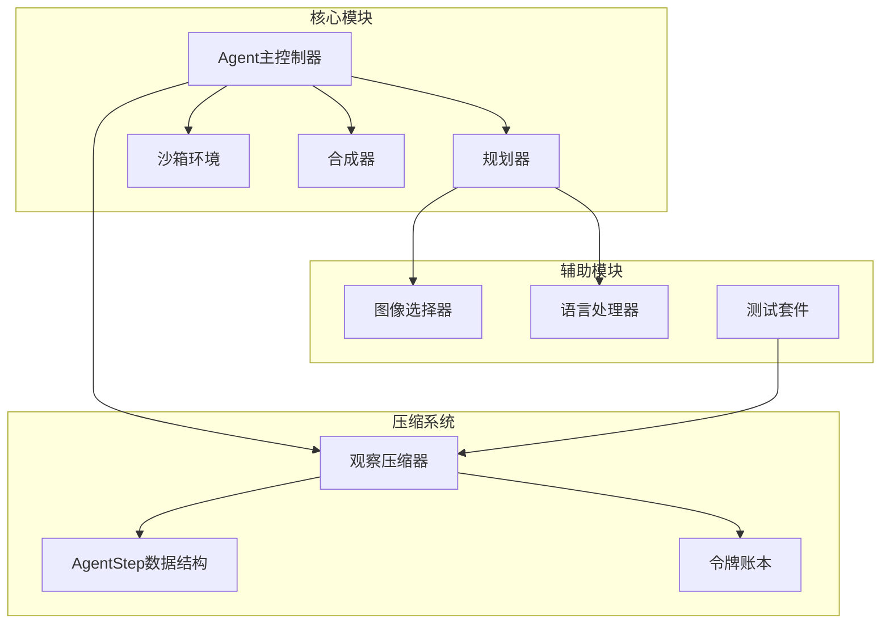
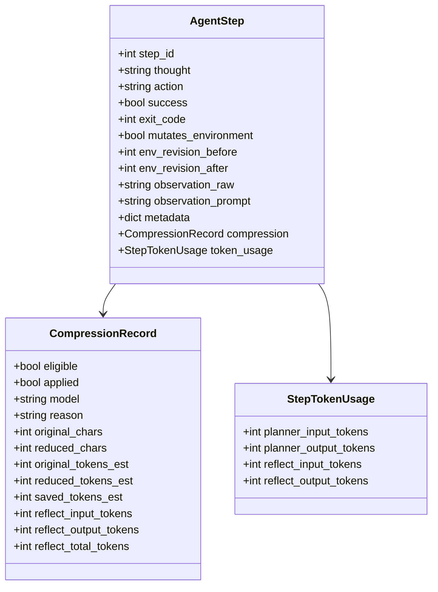
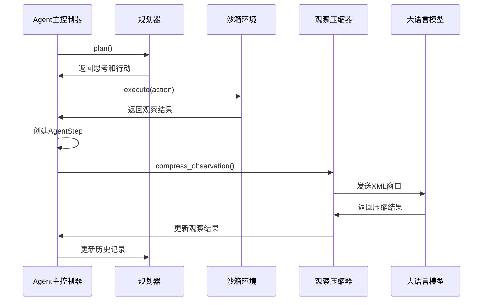
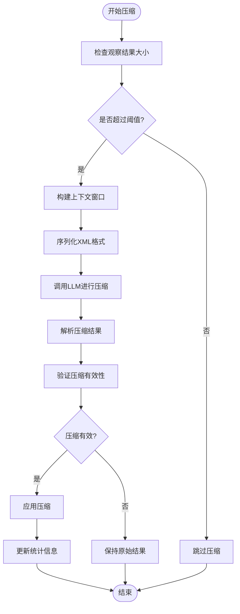
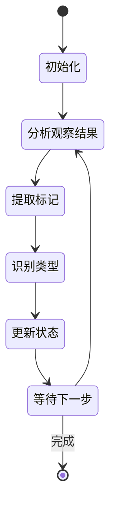
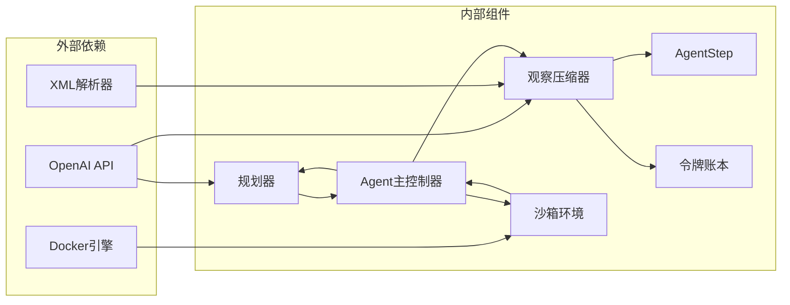

# 轨迹压缩笔记

<cite>
**本文档引用的文件**
- [trajectory_reduction_notes.md](file://doc/trajectory_reduction_notes.md)
- [observation_compressor.py](file://src/observation_compressor.py)
- [agent.py](file://agent.py)
- [planner.py](file://src/planner.py)
- [sandbox.py](file://src/sandbox.py)
- [synthesizer.py](file://src/synthesizer.py)
- [language_handlers.py](file://src/language_handlers.py)
- [image_selector.py](file://src/image_selector.py)
- [test_observation_compressor.py](file://tests/test_observation_compressor.py)
</cite>

## 目录
1. [简介](#简介)
2. [项目结构](#项目结构)
3. [核心组件](#核心组件)
4. [架构概览](#架构概览)
5. [详细组件分析](#详细组件分析)
6. [依赖关系分析](#依赖关系分析)
7. [性能考虑](#性能考虑)
8. [故障排除指南](#故障排除指南)
9. [结论](#结论)

## 简介

本文档详细介绍了代码库中的轨迹压缩系统，这是一个专门为大型语言模型（LLM）驱动的Docker环境配置代理设计的优化机制。该系统通过压缩长观察结果、应用智能反射机制、提取关键状态信息等方式，显著减少了提示词长度，提高了系统的整体效率。

轨迹压缩系统的核心目标是：
- 减少超长观察结果对提示词的影响
- 通过反射机制逐步压缩历史步骤
- 将关键环境事实抽取为结构化状态记忆
- 仅向Planner提供压缩视图，同时保留原始日志

## 项目结构

该项目采用模块化架构，主要包含以下核心模块：

**图表来源**
- [agent.py:1-100](file://agent.py#L1-L100)
- [observation_compressor.py:1-100](file://src/observation_compressor.py#L1-L100)

**章节来源**
- [agent.py:1-100](file://agent.py#L1-L100)
- [README.md:1-71](file://README.md#L1-L71)

## 核心组件

### 观察压缩器（ObservationCompressor）

观察压缩器是轨迹压缩系统的核心组件，负责将长观察结果压缩为更紧凑的形式。其主要功能包括：

- **统一压缩规则**：应用单一的压缩规则处理所有类型的观察结果
- **XML序列化**：将步骤序列化为XML格式供LLM处理
- **智能压缩决策**：根据预设阈值决定是否应用压缩
- **令牌统计**：跟踪压缩前后的令牌消耗情况

### AgentStep数据结构

AgentStep是轨迹压缩系统的基础数据结构，用于存储单个步骤的所有相关信息：

**图表来源**
- [observation_compressor.py:180-230](file://src/observation_compressor.py#L180-L230)

### 令牌账本（RunTokenLedger）

令牌账本用于跟踪整个运行过程中各组件的令牌消耗情况：

- **分桶统计**：按组件类型（image_selector、planner、reflection、total）统计令牌使用
- **实时更新**：在每个步骤执行后自动更新统计数据
- **综合报告**：提供完整的令牌使用分析

**章节来源**
- [observation_compressor.py:209-224](file://src/observation_compressor.py#L209-L224)
- [agent.py:48-59](file://agent.py#L48-L59)

## 架构概览

轨迹压缩系统采用分层架构设计，确保各个组件之间的松耦合和高内聚：

**图表来源**
- [agent.py:487-540](file://agent.py#L487-L540)
- [observation_compressor.py:257-310](file://src/observation_compressor.py#L257-L310)

## 详细组件分析

### 观察压缩算法

观察压缩系统实现了智能的压缩算法，能够识别不同类型的结果并应用相应的压缩策略：

**图表来源**
- [observation_compressor.py:312-326](file://src/observation_compressor.py#L312-L326)
- [agent.py:506-540](file://agent.py#L506-L540)

### 压缩规则体系

系统定义了三种主要的压缩规则：

#### 测试日志压缩规则
- **保留内容**：测试会话头部、平台/版本信息、收集的测试数量、简短测试摘要信息、失败/错误/预期失败的测试用例、最终统计行
- **压缩策略**：将大量连续的通过测试行替换为占位符说明

#### 安装日志压缩规则  
- **必须保留**：包管理器标识、成功安装的包名和版本、已满足的包列表、关键警告、第一个真实错误及其上下文
- **可压缩内容**：下载进度条、重复的获取/构建行、详细的wheel/构建噪声

#### 构建/通用命令日志规则
- **保留信息**：命令成功或失败的状态、关键发现的文件/路径、关键构建产物、第一个真实错误及其最相关的附近行
- **压缩策略**：重复的构建进度、重复的信息行、可以用简短总结替换的大块无关内容

**章节来源**
- [observation_compressor.py:7-84](file://src/observation_compressor.py#L7-L84)
- [trajectory_reduction_notes.md:32-86](file://doc/trajectory_reduction_notes.md#L32-L86)

### 状态管理系统

系统实现了复杂的状态管理机制，能够从历史中提取关键的环境事实：

**图表来源**
- [observation_compressor.py:105-148](file://src/observation_compressor.py#L105-L148)

**章节来源**
- [trajectory_reduction_notes.md:11-22](file://doc/trajectory_reduction_notes.md#L11-L22)

## 依赖关系分析

轨迹压缩系统与其他组件的依赖关系如下：

**图表来源**
- [agent.py:12-18](file://agent.py#L12-L18)
- [observation_compressor.py:1-10](file://src/observation_compressor.py#L1-L10)

**章节来源**
- [requirements.txt:1-4](file://requirements.txt#L1-L4)

## 性能考虑

轨迹压缩系统在设计时充分考虑了性能优化：

### 令牌优化策略
- **阈值控制**：只有当观察结果超过1500字符时才考虑压缩
- **收益评估**：只有当压缩节省的令牌数超过300时才实际应用压缩
- **延迟策略**：使用A=2的延迟策略，避免对最新步骤进行压缩

### 内存管理
- **增量压缩**：只压缩旧的步骤，最新的步骤保持不变
- **上下文窗口**：限制压缩时的上下文大小，避免内存溢出
- **状态清理**：定期清理不再需要的历史状态

### 计算效率
- **智能跳过**：快速检查条件，避免不必要的压缩尝试
- **缓存机制**：复用已有的压缩结果
- **批量处理**：支持批量压缩多个步骤

## 故障排除指南

### 常见问题及解决方案

#### 压缩失败
**症状**：压缩器返回原始结果
**可能原因**：
- LLM响应格式不正确
- 压缩收益不足
- XML序列化错误

**解决方法**：
- 检查LLM响应格式
- 调整压缩阈值
- 验证XML序列化逻辑

#### 令牌统计异常
**症状**：令牌使用统计不准确
**可能原因**：
- API调用失败
- 响应格式变化
- 计数逻辑错误

**解决方法**：
- 检查API连接
- 更新计数逻辑
- 添加错误处理

#### 内存泄漏
**症状**：长时间运行后内存使用持续增长
**可能原因**：
- 历史记录未清理
- 上下文窗口过大
- 对象引用未释放

**解决方法**：
- 实现定期清理机制
- 限制上下文大小
- 检查对象生命周期

**章节来源**
- [tests/test_observation_compressor.py:13-108](file://tests/test_observation_compressor.py#L13-L108)

## 结论

轨迹压缩系统是一个精心设计的优化机制，它通过智能压缩长观察结果、提取关键状态信息、应用反射机制等方式，显著提高了LLM驱动的Docker环境配置代理的效率和效果。

系统的主要优势包括：
- **高效压缩**：通过统一的压缩规则处理多种类型的观察结果
- **智能决策**：基于预设阈值和收益评估做出压缩决策
- **状态提取**：从历史中提取关键的环境事实
- **性能优化**：通过延迟策略和上下文限制提高整体性能

该系统为类似的LLM应用提供了宝贵的参考，展示了如何通过轨迹压缩技术来解决大型语言模型在复杂任务中的效率问题。