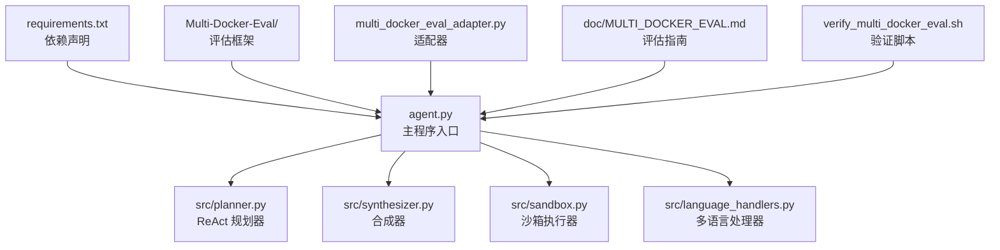
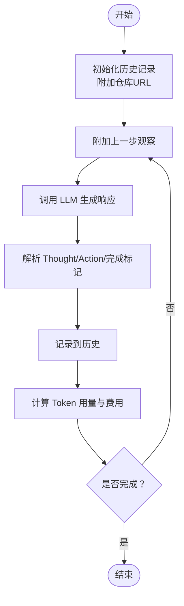
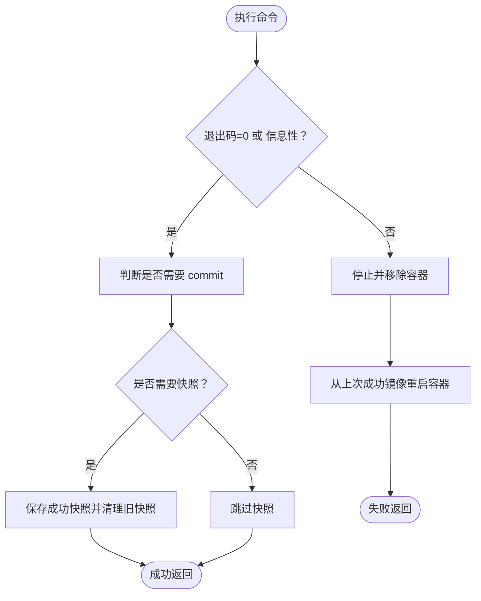
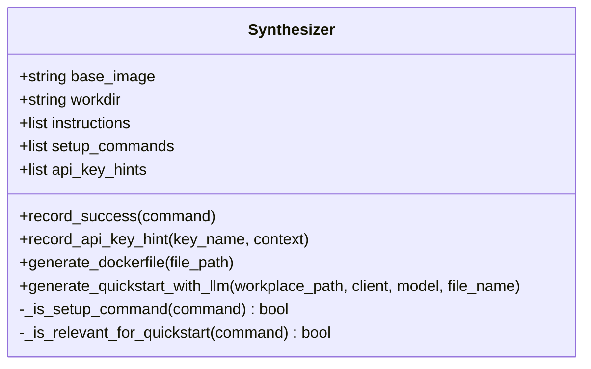
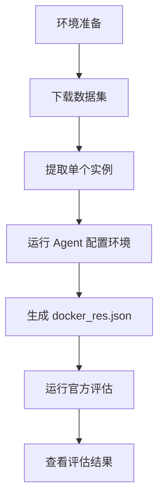
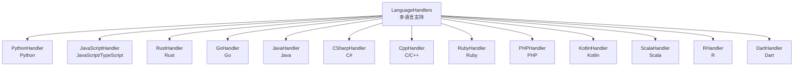
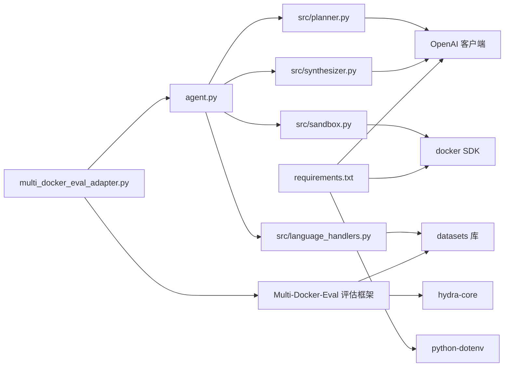

# 使用指南

<cite>
**本文引用的文件**
- [README.md](file://README.md)
- [agent.py](file://agent.py)
- [src/sandbox.py](file://src/sandbox.py)
- [src/planner.py](file://src/planner.py)
- [src/synthesizer.py](file://src/synthesizer.py)
- [src/language_handlers.py](file://src/language_handlers.py)
- [requirements.txt](file://requirements.txt)
- [multi_docker_eval_adapter.py](file://multi_docker_eval_adapter.py)
- [Multi-Docker-Eval/README.md](file://Multi-Docker-Eval/README.md)
- [Multi-Docker-Eval/evaluation/main.py](file://Multi-Docker-Eval/evaluation/main.py)
- [Multi-Docker-Eval/evaluation/conf/config.yaml](file://Multi-Docker-Eval/evaluation/conf/config.yaml)
- [Multi-Docker-Eval/evaluation/test_spec.py](file://Multi-Docker-Eval/evaluation/test_spec.py)
- [Multi-Docker-Eval/evaluation/docker_build.py](file://Multi-Docker-Eval/evaluation/docker_build.py)
- [Multi-Docker-Eval/evaluation/docker_utils.py](file://Multi-Docker-Eval/evaluation/docker_utils.py)
- [doc/MULTI_DOCKER_EVAL.md](file://doc/MULTI_DOCKER_EVAL.md)
- [verify_multi_docker_eval.sh](file://verify_multi_docker_eval.sh)
- [task.jsonl](file://task.jsonl)
- [multi_docker_eval_output/docker_res.json](file://multi_docker_eval_output/docker_res.json)
- [eval_output/DockerAgent/final_report.json](file://eval_output/DockerAgent/final_report.json)
</cite>

## 目录
1. [简介](#简介)
2. [项目结构](#项目结构)
3. [核心组件](#核心组件)
4. [架构总览](#架构总览)
5. [详细组件分析](#详细组件分析)
6. [Multi-Docker-Eval 评估流程](#multi-docker-eval-评估流程)
7. [多语言支持增强](#多语言支持增强)
8. [测试脚本生成能力](#测试脚本生成能力)
9. [依赖关系分析](#依赖关系分析)
10. [性能考虑](#性能考虑)
11. [故障排除指南](#故障排除指南)
12. [结论](#结论)
13. [附录](#附录)

## 简介
本指南面向"Repo Dockerizer Agent"使用者，提供从基础到高级的完整使用说明，涵盖命令行参数、运行参数配置、输出文件解读、批量处理、自定义配置、调试模式、性能优化与资源监控、Multi-Docker-Eval评估流程以及常见问题排查。该 Agent 基于 LLM 的 ReAct 思维链策略，在沙箱容器中自动分析并配置目标 GitHub 仓库的可执行 Docker 环境，最终生成可复用的 Dockerfile 与 QuickStart 文档。

**更新** 本次更新重点反映了评估框架增强功能、多语言支持扩展和新的测试脚本生成能力，包括：
- Multi-Docker-Eval 评估框架的完整集成
- 支持 15 种编程语言的自动检测和基础镜像选择
- 智能测试脚本生成和补丁注入能力
- 增强的 Dockerfile 生成和平台兼容性支持

## 项目结构
- 根目录包含入口脚本、核心模块与依赖声明，以及工作区 workplace 中的完整 mini-swe-agent 生态文档与 CLI 示例。
- agent.py 是主程序入口，负责初始化 DockerAgent、准备本地工作区、挂载仓库、启动 Planner 与 Synthesizer，并通过 Sandbox 执行命令与回滚。
- src/sandbox.py 提供基于 Docker SDK 的容器执行与基于 commit 的回滚能力。
- src/planner.py 实现 ReAct 规划器，负责构造系统提示词与消息历史，调用 LLM 生成下一步 Thought 与 Action。
- src/synthesizer.py 记录成功的命令，生成 Dockerfile 与 QuickStart.md，并在必要时记录缺失的 API Key 提示。
- src/language_handlers.py 提供 15 种编程语言的自动检测和基础镜像选择能力。
- requirements.txt 声明运行所需依赖（docker、openai、python-dotenv）。
- workplace 下包含 mini-swe-agent 的 CLI、配置与文档，便于对比理解不同运行方式与配置项。
- Multi-Docker-Eval 目录提供完整的评估框架，包括数据收集、评估执行和结果分析。



**图示来源**
- [agent.py](file://agent.py#L148-L160)
- [src/planner.py](file://src/planner.py#L69-L105)
- [src/synthesizer.py](file://src/synthesizer.py#L1-L144)
- [src/sandbox.py](file://src/sandbox.py#L1-L178)
- [src/language_handlers.py](file://src/language_handlers.py#L1-L715)
- [requirements.txt](file://requirements.txt#L1-L4)
- [multi_docker_eval_adapter.py](file://multi_docker_eval_adapter.py#L1-L618)
- [Multi-Docker-Eval/README.md](file://Multi-Docker-Eval/README.md#L1-L97)
- [verify_multi_docker_eval.sh](file://verify_multi_docker_eval.sh#L1-L124)

**章节来源**
- [README.md](file://README.md#L1-L47)
- [agent.py](file://agent.py#L148-L160)
- [requirements.txt](file://requirements.txt#L1-L4)

## 核心组件
- DockerAgent：封装整个流程，负责克隆仓库、初始化 Sandbox、构建 LLM 客户端、驱动 Planner 与 Synthesizer，并在完成后生成 Dockerfile 与 QuickStart 文档。
- Planner：基于 ReAct 思维链，结合系统提示词与历史消息，输出 Thought 与 Action，并统计 Token 用量与费用。
- Sandbox：基于 Docker SDK 在容器内执行命令，支持对会产生持久化变更的命令进行 commit 快照，并在失败时回滚至上一成功镜像。
- Synthesizer：记录成功的 RUN 指令，生成 Dockerfile；根据 README 与真实安装命令生成 QuickStart.md；记录缺失的 API Key 提示。
- LanguageHandlers：提供 15 种编程语言的自动检测、基础镜像选择和特定语言的环境配置指导。
- MultiDockerEvalAdapter：将 DockerAgent 适配到 Multi-Docker-Eval 评估标准，生成评估框架所需的 docker_res.json 格式输出。
- 评估框架：Multi-Docker-Eval 评估系统，包含数据加载、镜像构建、测试执行和结果分析功能。

**章节来源**
- [agent.py](file://agent.py#L14-L126)
- [src/planner.py](file://src/planner.py#L3-L105)
- [src/sandbox.py](file://src/sandbox.py#L4-L178)
- [src/synthesizer.py](file://src/synthesizer.py#L1-L144)
- [src/language_handlers.py](file://src/language_handlers.py#L1-L715)
- [multi_docker_eval_adapter.py](file://multi_docker_eval_adapter.py#L39-L618)

## 架构总览
下图展示了从命令行到容器执行与结果生成的整体流程，包括 Multi-Docker-Eval 评估流程。

```mermaid
sequenceDiagram
participant U as "用户"
participant CLI as "agent.py"
participant P as "Planner"
participant S as "Sandbox"
participant SY as "Synthesizer"
U->>CLI : "传入仓库URL与参数"
CLI->>CLI : "准备本地工作区并克隆仓库"
CLI->>S : "初始化容器并挂载工作目录"
CLI->>P : "首次调用 plan(repo_url)"
P-->>CLI : "返回 Thought/Action/完成标记/费用信息"
CLI->>S : "执行 Action 命令"
S-->>CLI : "返回执行结果与输出"
CLI->>SY : "记录成功指令"
CLI->>P : "再次 plan(观察结果)"
P-->>CLI : "返回下一步计划"
CLI->>S : "重复执行直到完成"
CLI->>SY : "生成 Dockerfile 与 QuickStart.md"
CLI-->>U : "输出结果与路径"
Note over U,S : Multi-Docker-Eval 评估流程
U->>AD as "MultiDockerEvalAdapter"
AD->>CLI : "调用 DockerAgent.run()"
CLI-->>AD : "生成 docker_res.json"
AD-->>U : "输出评估结果"
```

**图示来源**
- [agent.py](file://agent.py#L60-L126)
- [src/planner.py](file://src/planner.py#L69-L105)
- [src/sandbox.py](file://src/sandbox.py#L29-L91)
- [src/synthesizer.py](file://src/synthesizer.py#L9-L144)
- [multi_docker_eval_adapter.py](file://multi_docker_eval_adapter.py#L46-L187)

## 详细组件分析

### 命令行参数与运行方式
- 基本运行
  - 使用方式：python agent.py <仓库URL>
  - 示例：python agent.py https://github.com/psf/requests
- 支持的命令行参数
  - --image：基础镜像，默认值为 python:3.10
  - --model：LLM 模型，默认值为 gpt-4o
  - --steps：最大步数，默认值为 30
  - --keep-container：完成后保留容器以便检查
- 环境变量
  - OPENAI_API_KEY：必需，用于初始化 LLM 客户端
  - OPENAI_API_BASE：可选，自定义 LLM 基础地址
- 工作区
  - 默认将仓库克隆至 workplace 目录，映射到容器 /app 路径

**章节来源**
- [README.md](file://README.md#L11-L41)
- [agent.py](file://agent.py#L148-L160)
- [agent.py](file://agent.py#L151-L154)

### Planner 组件
- 系统提示词与约束
  - 明确禁止使用 docker build/run/compose/systemctl/service/dockerd/sudo 等命令
  - 若仓库自带 Dockerfile，需分析其依赖并通过包管理器直接安装
  - 仅允许使用包管理器与语言运行时
- ReAct 流程
  - 初始化历史记录，追加上一步观察
  - 调用 LLM 返回 Thought 与 Action
  - 解析并记录内容，计算 Token 用量与费用
- 成本统计
  - 支持多种模型价格表，按输入/输出 Token 计算美元成本
  - 累计总成本并在每次调用后更新



**图示来源**
- [src/planner.py](file://src/planner.py#L69-L105)
- [src/planner.py](file://src/planner.py#L107-L129)

**章节来源**
- [src/planner.py](file://src/planner.py#L43-L105)
- [src/planner.py](file://src/planner.py#L107-L129)

### Sandbox 组件
- 容器生命周期
  - 从基础镜像启动容器，设置工作目录与卷挂载
  - 执行命令后根据退出码与输出判断是否为"信息性退出"
- 回滚机制
  - 对会产生持久化变更的命令进行 commit 快照
  - 失败时停止并移除当前容器，从上一成功镜像重启
- 资源清理
  - 关闭容器时可选择保留容器
  - 清理成功快照镜像与悬空镜像



**图示来源**
- [src/sandbox.py](file://src/sandbox.py#L29-L91)
- [src/sandbox.py](file://src/sandbox.py#L93-L112)
- [src/sandbox.py](file://src/sandbox.py#L114-L134)
- [src/sandbox.py](file://src/sandbox.py#L147-L178)

**章节来源**
- [src/sandbox.py](file://src/sandbox.py#L4-L178)

### Synthesizer 组件
- 指令记录
  - 将成功的命令转换为 RUN 指令并记录
  - 区分安装/配置类命令，用于生成 QuickStart.md
- API Key 提示
  - 检测输出中的 API Key 相关关键词，记录缺失项
- Dockerfile 生成
  - 以 base_image 与工作目录开头，拼接所有 RUN 指令
- QuickStart.md 生成
  - 基于 README 与真实安装命令，生成简洁的"安装步骤""如何运行""API Key 配置"等章节



**图示来源**
- [src/synthesizer.py](file://src/synthesizer.py#L1-L144)

**章节来源**
- [src/synthesizer.py](file://src/synthesizer.py#L9-L144)

### 输出文件解读
- Dockerfile
  - 位于项目根目录，包含 FROM、WORKDIR 与一系列 RUN 指令
  - 由 Synthesizer 基于成功指令生成
- QuickStart.md
  - 位于 workplace 目录，包含"安装步骤""如何运行""API Key 配置""备注"等章节
  - 由 Synthesizer 结合 README 与真实安装命令生成

**章节来源**
- [src/synthesizer.py](file://src/synthesizer.py#L130-L143)
- [src/synthesizer.py](file://src/synthesizer.py#L32-L122)

### 高级使用场景

#### 批量处理多个仓库
- 单仓库运行
  - 使用命令行参数指定仓库 URL 与模型、步数等
- 批量自动化
  - 可在外部脚本循环调用 agent.py，传入不同的仓库 URL
  - 建议为每个仓库设置独立的工作区目录，避免冲突
- 与 mini-swe-agent CLI 对比
  - workplace/src/minisweagent/run/mini.py 提供更丰富的配置与输出轨迹能力，适合复杂任务与长期迭代

**章节来源**
- [agent.py](file://agent.py#L148-L160)
- [workplace/src/minisweagent/run/mini.py](file://workplace/src/minisweagent/run/mini.py#L54-L105)

#### 自定义配置选项
- 模型与价格
  - Planner 内置多模型价格表，按输入/输出 Token 计费
- 环境变量
  - OPENAI_API_KEY 必填；OPENAI_API_BASE 可选
- 容器与工作目录
  - 通过 --image 指定基础镜像；默认工作目录为 /app
- 保留容器
  - 使用 --keep-container 在完成后保留容器，便于手动检查

**章节来源**
- [src/planner.py](file://src/planner.py#L10-L41)
- [agent.py](file://agent.py#L28-L36)
- [agent.py](file://agent.py#L151-L154)
- [src/sandbox.py](file://src/sandbox.py#L147-L178)

#### 调试模式使用
- 保留容器
  - --keep-container 使容器在完成后保持运行，可通过 docker exec -it <容器ID> /bin/bash 进入交互
- 查看成本与Token
  - 每步输出包含输入/输出 Token 与累计费用，便于成本控制
- 回滚行为
  - 失败会自动回滚至上一成功镜像，减少环境污染

**章节来源**
- [agent.py](file://agent.py#L127-L146)
- [src/sandbox.py](file://src/sandbox.py#L76-L91)
- [src/sandbox.py](file://src/sandbox.py#L147-L159)

### 实际使用案例与最佳实践

- 小型 Python 项目
  - 步骤：克隆仓库 → 分析依赖 → 安装依赖 → 运行入口验证 → 生成 Dockerfile 与 QuickStart.md
  - 建议：使用 python:3.10 作为基础镜像，--steps 设为 30~50
- 大型多语言项目
  - 步骤：识别语言与包管理器（pip/apt/npm/yum），按顺序安装 → 验证入口 → 生成文档
  - 建议：适当提高 --steps，必要时使用 --keep-container 检查中间状态
- 带 Dockerfile 的仓库
  - 行为：不直接构建，而是分析其依赖并通过包管理器安装
  - 建议：关注 Planner 的"禁止使用 docker build/run"约束

**章节来源**
- [src/planner.py](file://src/planner.py#L59-L67)
- [README.md](file://README.md#L38-L41)

## Multi-Docker-Eval 评估流程

### 环境准备与数据集下载
Multi-Docker-Eval 评估框架提供了完整的评估流程，从数据集下载到结果分析：



**图示来源**
- [doc/MULTI_DOCKER_EVAL.md](file://doc/MULTI_DOCKER_EVAL.md#L5-L146)

### 数据集格式与要求
Multi-Docker-Eval 使用 JSONL 格式的任务数据集，包含以下关键字段：
- instance_id：实例唯一标识符
- repo：仓库名称或 URL
- base_commit：基准提交哈希
- problem_statement：问题描述
- patch：主要修改补丁
- test_patch：测试修改补丁
- language：编程语言

### 适配器工作原理
MultiDockerEvalAdapter 将 DockerAgent 的输出转换为 Multi-Docker-Eval 评估框架所需的格式：

1. **实例处理**：逐个处理数据集中的实例
2. **环境配置**：调用 DockerAgent.run() 配置仓库环境
3. **Dockerfile 生成**：提取并修改 Dockerfile，替换 WORKDIR 和路径
4. **测试脚本生成**：根据语言和测试补丁生成评估脚本
5. **结果输出**：生成 docker_res.json 格式的评估结果

### 评估执行与指标
评估框架执行以下步骤并计算关键指标：

1. **镜像构建**：使用生成的 Dockerfile 构建测试环境镜像
2. **容器运行**：启动容器执行测试脚本
3. **补丁应用**：在容器中应用测试补丁
4. **测试执行**：运行测试验证修复效果
5. **结果分析**：计算 F2P（Fail-to-Pass）、Build Success Rate 等指标

**评估指标说明**：
- F2P（Fail-to-Pass）：测试从失败到通过的成功率
- Build Success Rate：Docker 镜像构建成功率
- Commit Rate：平均每个任务的 commit 次数
- Time Efficiency：平均完成时间

### 输出文件结构
评估结果包含以下文件：
- `docker_res.json`：适配器输出的评估结果
- `final_report.json`：官方评估的综合报告
- `image_sizes.json`：镜像大小统计信息
- 详细日志和测试输出文件

**章节来源**
- [doc/MULTI_DOCKER_EVAL.md](file://doc/MULTI_DOCKER_EVAL.md#L1-L372)
- [multi_docker_eval_adapter.py](file://multi_docker_eval_adapter.py#L39-L618)
- [Multi-Docker-Eval/evaluation/main.py](file://Multi-Docker-Eval/evaluation/main.py#L1-L577)

## 多语言支持增强

### 语言处理器架构
系统内置了 15 种主流编程语言的支持，每个语言都有专门的处理器：



**图示来源**
- [src/language_handlers.py](file://src/language_handlers.py#L652-L682)

### 支持的语言列表
系统支持以下编程语言：
- **Python**：支持 requirements.txt、setup.py、pyproject.toml 等多种依赖管理
- **JavaScript/TypeScript**：支持 npm、yarn、pnpm 包管理器
- **Rust**：支持 cargo 构建系统
- **Go**：支持 go mod 依赖管理
- **Java**：支持 Maven 和 Gradle 构建系统
- **C#**：支持 .NET SDK
- **C/C++**：支持 CMake、Makefile 等构建系统
- **Ruby**：支持 Gemfile 和 Bundler
- **PHP**：支持 Composer 依赖管理
- **Kotlin**：支持 Gradle 构建
- **Scala**：支持 sbt 构建
- **R**：支持 R 包管理
- **Dart**：支持 Flutter 开发

### 基础镜像选择策略
每种语言处理器都提供针对该语言的最佳基础镜像推荐：

- **Python**：python:3.6-3.14（Linux）和 windowsservercore 版本
- **JavaScript**：node:18-25（支持 Windows Server 版本）
- **Rust**：rust:1.70-1.90（Linux）和 Windows 版本
- **Go**：golang:1.19-1.25（Linux）和 Windows Server 版本
- **Java**：eclipse-temurin:11/17/21 JDK（Linux 和 Windows）

**章节来源**
- [src/language_handlers.py](file://src/language_handlers.py#L44-L715)

## 测试脚本生成能力

### 智能测试命令生成
Multi-Docker-Eval 适配器能够根据仓库语言自动选择合适的测试命令：

| 语言 | 默认测试命令 | 特殊处理 |
|------|-------------|----------|
| Python | `python -m pytest -v` | 优先运行新增测试函数 |
| JavaScript/TypeScript | `npm test` | 支持 Jest、Mocha 等框架 |
| Java | `mvn test` | Maven 项目测试 |
| Go | `go test ./...` | Go 包测试 |
| Rust | `cargo test` | Rust 测试框架 |
| Ruby | `bundle exec rspec` 或 `bundle exec rake test` | RSpec 或 Minitest |
| PHP | `vendor/bin/phpunit` | PHPUnit 测试框架 |
| C/C++ | `cd test && make all` | Makefile 测试 |

### 测试补丁注入机制
系统能够智能解析测试补丁并将其注入到 Docker 镜像中：

1. **补丁解析**：从 diff 内容中提取新增的测试文件和测试函数
2. **依赖检测**：根据补丁内容检测需要的测试框架依赖
3. **镜像注入**：在 Dockerfile 中添加测试补丁和依赖安装命令
4. **自动重装**：检测到依赖变化时自动重新安装

### 新增测试函数优先执行
对于 Python 项目，系统会优先运行补丁中新添加的测试函数：

```bash
# 生成特定测试函数的执行命令
python -m pytest test_file.py::test_function_name -v
```

**章节来源**
- [multi_docker_eval_adapter.py](file://multi_docker_eval_adapter.py#L327-L498)

## 依赖关系分析
- 运行时依赖
  - docker：容器执行与回滚
  - openai：LLM 接口
  - python-dotenv：加载 .env 环境变量
  - datasets：HuggingFace 数据集访问
  - hydra-core：配置管理
- 项目内依赖
  - agent.py 依赖 src/planner.py、src/synthesizer.py、src/sandbox.py、src/language_handlers.py
  - Sandbox 依赖 docker SDK
  - Planner 依赖 OpenAI 客户端
  - Synthesizer 依赖 README 内容与 LLM
  - LanguageHandlers 提供多语言支持
  - MultiDockerEvalAdapter 依赖 agent.py 和评估框架模块



**图示来源**
- [agent.py](file://agent.py#L1-L12)
- [requirements.txt](file://requirements.txt#L1-L4)
- [src/sandbox.py](file://src/sandbox.py#L1-L3)
- [src/planner.py](file://src/planner.py#L1-L1)
- [src/synthesizer.py](file://src/synthesizer.py#L1-L1)
- [src/language_handlers.py](file://src/language_handlers.py#L1-L5)
- [multi_docker_eval_adapter.py](file://multi_docker_eval_adapter.py#L36-L36)
- [Multi-Docker-Eval/evaluation/requirements.txt](file://Multi-Docker-Eval/evaluation/requirements.txt#L1-L3)

**章节来源**
- [requirements.txt](file://requirements.txt#L1-L4)
- [agent.py](file://agent.py#L1-L12)

## 性能考虑
- 步数控制
  - 通过 --steps 控制最大 ReAct 步数，避免长时间无进展
- 成本控制
  - Planner 内置价格表，可按模型与 Token 估算成本
  - 建议在测试阶段使用较低温度与较短上下文
- 镜像体积与磁盘
  - Sandbox 会在成功命令后创建快照镜像，失败时回滚
  - 建议在完成后清理镜像与悬空镜像，避免磁盘占用过高
- 容器资源
  - 保持 --keep-container 仅在调试阶段使用
  - 大型项目建议使用更高性能的基础镜像与更强的主机资源
- 评估性能优化
  - Multi-Docker-Eval 评估框架支持并行执行，可通过配置调整 worker 数量
  - 合理设置超时时间和稳定性运行次数
  - 使用缓存机制减少重复构建
- 多语言优化
  - 语言处理器提供预定义的基础镜像列表，减少 LLM 选择时间
  - 支持平台特定的基础镜像（Linux/Windows）以提高兼容性

**章节来源**
- [src/planner.py](file://src/planner.py#L107-L129)
- [src/sandbox.py](file://src/sandbox.py#L56-L73)
- [src/sandbox.py](file://src/sandbox.py#L162-L178)
- [agent.py](file://agent.py#L151-L154)
- [Multi-Docker-Eval/evaluation/conf/config.yaml](file://Multi-Docker-Eval/evaluation/conf/config.yaml#L6-L13)
- [src/language_handlers.py](file://src/language_handlers.py#L51-L56)

## 故障排除指南
- 缺少 OPENAI_API_KEY
  - 现象：初始化 LLM 客户端时报错
  - 处理：在 .env 文件中设置 OPENAI_API_KEY，或将 OPENAI_API_BASE 设置为自定义地址
- API Key 相关错误检测
  - 现象：命令输出包含 invalid api key、missing api key 等关键词
  - 处理：Synthesizer 会记录 API Key 提示，生成 QuickStart.md 时包含"API Key 配置"章节
- 容器无法启动或命令失败
  - 现象：容器启动失败或命令退出码非 0
  - 处理：检查 --image 是否正确；使用 --keep-container 保留容器查看日志；确认仓库 URL 可访问
- 磁盘空间不足
  - 现象：多次 commit 导致镜像堆积
  - 处理：执行清理逻辑，删除成功快照镜像与悬空镜像
- README 未找到或不可读
  - 现象：生成 QuickStart.md 时提示 README 不存在或读取失败
  - 处理：确保仓库包含 README.md，或在生成前手动补充
- Multi-Docker-Eval 评估问题
  - 现象：评估框架报 ModuleNotFoundError
  - 处理：确保安装评估框架依赖，使用正确的 PYTHONPATH 路径
- 数据集访问权限
  - 现象：HuggingFace 数据集访问被拒绝
  - 处理：在 HuggingFace 网站申请数据集访问权限
- 语言检测失败
  - 现象：多语言处理器无法识别项目语言
  - 处理：检查项目结构和文件内容，确认包含正确的语言标识文件
- 测试脚本生成错误
  - 现象：生成的测试脚本无法执行
  - 处理：检查测试补丁内容和语言特定的测试命令配置

**章节来源**
- [agent.py](file://agent.py#L28-L36)
- [agent.py](file://agent.py#L127-L146)
- [src/sandbox.py](file://src/sandbox.py#L76-L91)
- [src/sandbox.py](file://src/sandbox.py#L162-L178)
- [src/synthesizer.py](file://src/synthesizer.py#L47-L57)
- [doc/MULTI_DOCKER_EVAL.md](file://doc/MULTI_DOCKER_EVAL.md#L178-L200)
- [src/language_handlers.py](file://src/language_handlers.py#L685-L715)
- [multi_docker_eval_adapter.py](file://multi_docker_eval_adapter.py#L327-L498)

## 结论
Repo Dockerizer Agent 通过 ReAct 规划、容器沙箱执行与指令合成，实现了对 GitHub 仓库的自动化环境配置与可复用文档生成。Multi-Docker-Eval 评估框架进一步提供了标准化的评估流程，支持多语言、多维度的 Docker 环境生成能力评估。本次更新重点增强了多语言支持能力和测试脚本生成功能，包括 15 种编程语言的自动检测、智能测试命令生成和补丁注入机制。建议在使用中合理设置步数与模型，关注成本与磁盘占用，并在调试阶段保留容器以便快速定位问题。对于批量处理与复杂任务，可参考 workplace 下的 mini-swe-agent CLI 与配置体系，进一步提升稳定性与可观测性。参与 Multi-Docker-Eval 评估可帮助推动该领域的技术发展与基准建设。

## 附录

### 命令行参数速查
- 必填
  - 仓库 URL：GitHub 仓库地址
- 可选
  - --image：基础镜像，默认 python:3.10
  - --model：LLM 模型，默认 gpt-4o
  - --steps：最大步数，默认 30
  - --keep-container：完成后保留容器

**章节来源**
- [agent.py](file://agent.py#L148-L160)

### 输出文件说明
- Dockerfile
  - 生成位置：项目根目录
  - 内容：FROM、WORKDIR 与 RUN 指令集合
- QuickStart.md
  - 生成位置：workplace 目录
  - 内容：安装步骤、如何运行、API Key 配置、备注
- docker_res.json
  - 生成位置：multi_docker_eval_output/ 目录
  - 内容：评估框架所需的 Docker 环境配置信息

**章节来源**
- [src/synthesizer.py](file://src/synthesizer.py#L130-L143)
- [src/synthesizer.py](file://src/synthesizer.py#L32-L122)
- [multi_docker_eval_output/docker_res.json](file://multi_docker_eval_output/docker_res.json#L1-L18)

### 与 mini-swe-agent CLI 的关系
- workplace/src/minisweagent/run/mini.py 提供更完善的 CLI 与配置体系，适合复杂任务与长期迭代
- 两者共享"ReAct + 沙箱执行"的核心思想，但 mini-swe-agent CLI 提供更丰富的配置项与输出轨迹

**章节来源**
- [workplace/src/minisweagent/run/mini.py](file://workplace/src/minisweagent/run/mini.py#L54-L105)
- [workplace/README.md](file://workplace/README.md#L1-L222)

### Multi-Docker-Eval 评估参数
- base.dataset：数据集文件路径（JSONL 格式）
- base.docker_res：Docker 结果文件路径（docker_res 格式）
- base.run_id：评估运行标识符
- base.output_path：评估输出目录
- run_time.max_workers：最大并行 worker 数（默认 16）
- docker.build_timeout：Docker 构建超时时间（秒，默认 1800）
- test.test_timeout：测试执行超时时间（秒，默认 2700）
- test.stability_runs：稳定性测试运行次数（默认 3）

**章节来源**
- [Multi-Docker-Eval/README.md](file://Multi-Docker-Eval/README.md#L74-L94)
- [Multi-Docker-Eval/evaluation/conf/config.yaml](file://Multi-Docker-Eval/evaluation/conf/config.yaml#L1-L13)

### 多语言支持配置
- 支持语言：Python、JavaScript、TypeScript、Rust、Go、Java、C#、C++、Ruby、PHP、Kotlin、Scala、R、Dart
- 基础镜像范围：每种语言提供 3-6 个版本的基础镜像选项
- 自动检测：基于文件结构和配置文件自动识别项目语言
- 语言特定指令：为每种语言提供专门的环境配置指导

**章节来源**
- [src/language_handlers.py](file://src/language_handlers.py#L652-L682)
- [src/language_handlers.py](file://src/language_handlers.py#L44-L715)

### 测试脚本生成配置
- 自动测试命令：根据语言类型自动选择合适的测试命令
- 补丁注入：智能解析测试补丁并注入到 Docker 镜像中
- 依赖检测：自动检测测试框架依赖并安装
- 新增测试优先：优先运行补丁中新添加的测试函数

**章节来源**
- [multi_docker_eval_adapter.py](file://multi_docker_eval_adapter.py#L327-L498)
- [verify_multi_docker_eval.sh](file://verify_multi_docker_eval.sh#L1-L124)