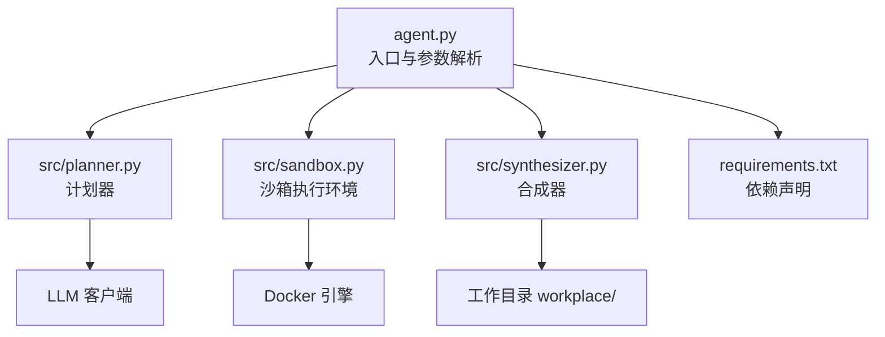
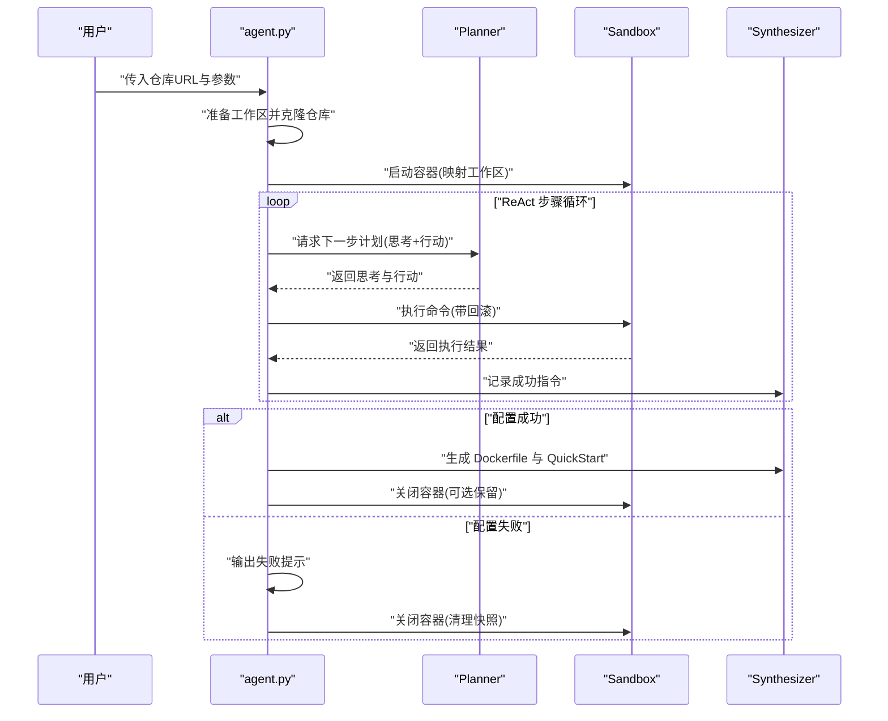
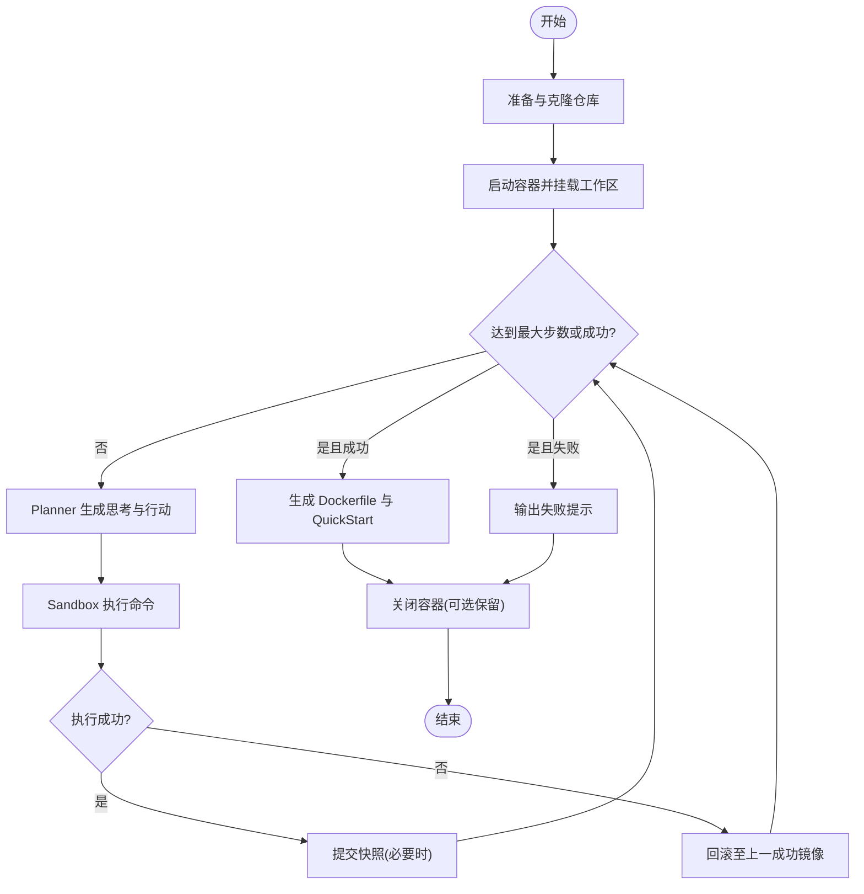
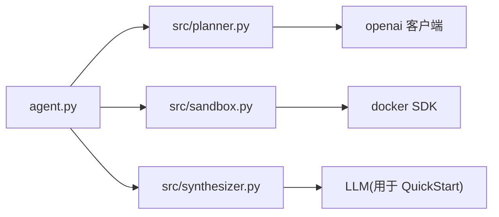

# 基本使用

<cite>
**本文引用的文件**
- [README.md](file://README.md)
- [agent.py](file://agent.py)
- [src/planner.py](file://src/planner.py)
- [src/sandbox.py](file://src/sandbox.py)
- [src/synthesizer.py](file://src/synthesizer.py)
- [requirements.txt](file://requirements.txt)
- [doc/运行示例.md](file://doc/运行示例.md)
- [workplace/QuickStart.md](file://workplace/QuickStart.md)
</cite>

## 目录
1. [简介](#简介)
2. [项目结构](#项目结构)
3. [核心组件](#核心组件)
4. [架构总览](#架构总览)
5. [详细组件解析](#详细组件解析)
6. [依赖关系分析](#依赖关系分析)
7. [性能与成本考虑](#性能与成本考虑)
8. [故障排查指南](#故障排查指南)
9. [结论](#结论)
10. [附录](#附录)

## 简介
本指南面向首次使用 Repo Dockerizer Agent 的用户，目标是帮助你快速理解并正确使用该工具：从准备环境、配置参数、到运行与产出，覆盖命令行参数、运行流程、常见场景与最佳实践。

## 项目结构
- 入口脚本负责解析命令行参数、初始化 Agent 并驱动执行循环。
- 核心模块包括：Planner（计划器）、Sandbox（沙箱执行环境）、Synthesizer（合成器，生成 Dockerfile 与 QuickStart 文档）。
- 依赖通过 requirements.txt 管理，需确保 Docker 引擎可用，且已配置 LLM API 密钥。

图表来源
- [agent.py](file://agent.py#L148-L159)
- [src/planner.py](file://src/planner.py#L3-L67)
- [src/sandbox.py](file://src/sandbox.py#L4-L28)
- [src/synthesizer.py](file://src/synthesizer.py#L1-L20)
- [requirements.txt](file://requirements.txt#L1-L4)

章节来源
- [README.md](file://README.md#L1-L47)
- [agent.py](file://agent.py#L148-L159)
- [requirements.txt](file://requirements.txt#L1-L4)

## 核心组件
- DockerAgent：封装整个流程，负责克隆仓库、初始化容器、驱动 ReAct 循环、成本统计、最终产物生成与容器收尾。
- Planner：基于系统提示词与历史对话，输出“思考+行动”指令，支持成本统计。
- Sandbox：基于 Docker SDK 在容器内执行命令，具备“提交快照+失败回滚”的能力。
- Synthesizer：记录成功的安装/配置命令，生成 Dockerfile 与 QuickStart 文档。

章节来源
- [agent.py](file://agent.py#L14-L39)
- [src/planner.py](file://src/planner.py#L3-L67)
- [src/sandbox.py](file://src/sandbox.py#L4-L28)
- [src/synthesizer.py](file://src/synthesizer.py#L1-L20)

## 架构总览
下图展示了从命令行到最终产物的端到端流程：

图表来源
- [agent.py](file://agent.py#L60-L126)
- [src/planner.py](file://src/planner.py#L69-L105)
- [src/sandbox.py](file://src/sandbox.py#L29-L91)
- [src/synthesizer.py](file://src/synthesizer.py#L9-L21)

## 详细组件解析

### 命令行参数与默认值
- 必填参数
  - repo_url：GitHub 仓库地址（作为位置参数传入）
- 可选参数
  - --image：基础镜像，默认值为 python:3.10
  - --model：LLM 模型名称，默认值为 gpt-4o
  - --steps：最大步数，默认值为 30
  - --keep-container：完成后保留容器以便检查

章节来源
- [agent.py](file://agent.py#L148-L159)

### 参数作用与默认值说明
- --image
  - 作用：指定容器的基础镜像，影响包管理器、语言运行时等可用性
  - 默认：python:3.10
  - 调整建议：若项目为 Node/Go/Rust 等，可改为对应官方镜像；若需特定系统库，可选用 Debian/Alpine
- --model
  - 作用：LLM 模型名称，用于 Planner 的对话调用
  - 默认：gpt-4o
  - 调整建议：按预算与质量需求选择不同系列模型；注意成本统计会依据模型定价表计算
- --steps
  - 作用：控制 ReAct 循环的最大迭代次数
  - 默认：30
  - 调整建议：复杂项目可适当提高；过小可能导致未完成就终止
- --keep-container
  - 作用：执行完毕后保留容器，便于进入容器内部进一步验证
  - 默认：关闭（删除容器与中间镜像）

章节来源
- [agent.py](file://agent.py#L148-L159)
- [src/planner.py](file://src/planner.py#L10-L41)

### 运行流程详解
- 环境准备
  - 准备工作区目录 workplace，克隆目标仓库
  - 初始化容器，将工作区挂载到 /app
- 执行循环（ReAct）
  - Planner 基于历史与系统提示生成“思考+行动”
  - Sandbox 执行命令，成功则提交快照，失败则回滚至上一成功镜像
  - Synthesizer 记录成功的安装/配置命令
- 结束条件
  - 若 Planner 返回“Final Answer: Success”，则认为配置成功
  - 成功时生成 Dockerfile 与 QuickStart.md；否则输出失败提示
- 收尾
  - 关闭容器；如未保留容器，清理中间镜像与快照

图表来源
- [agent.py](file://agent.py#L60-L126)
- [src/sandbox.py](file://src/sandbox.py#L29-L91)
- [src/synthesizer.py](file://src/synthesizer.py#L9-L21)

章节来源
- [agent.py](file://agent.py#L60-L126)
- [src/sandbox.py](file://src/sandbox.py#L29-L91)
- [src/synthesizer.py](file://src/synthesizer.py#L9-L21)

### 实际命令行示例与预期输出
- 示例 1：基础运行
  - 命令：python agent.py https://github.com/psf/requests
  - 预期：成功时生成 Dockerfile 与 QuickStart.md；失败时输出失败提示
- 示例 2：指定基础镜像与模型
  - 命令：python agent.py https://github.com/psf/requests --image node:18 --model gpt-4o-mini
  - 预期：以 Node 基础镜像与指定模型进行配置
- 示例 3：增加最大步数并保留容器
  - 命令：python agent.py https://github.com/psf/requests --steps 50 --keep-container
  - 预期：最多 50 步，完成后容器仍运行，可进入容器检查
- 示例 4：参考运行日志
  - 参考路径：doc/运行示例.md 中的完整交互日志，包含 Step N 的输出、命令与回滚行为

章节来源
- [doc/运行示例.md](file://doc/运行示例.md#L1-L475)

### 产物说明
- Dockerfile：基于成功指令合成，FROM 与 WORKDIR 已内置
- QuickStart.md：基于 README 与真实安装命令生成的简明使用说明，含“如何运行”“API Key 配置”等

章节来源
- [src/synthesizer.py](file://src/synthesizer.py#L130-L143)
- [workplace/QuickStart.md](file://workplace/QuickStart.md#L1-L46)

## 依赖关系分析
- 外部依赖
  - docker：用于容器生命周期管理
  - openai：用于调用 LLM 接口
  - python-dotenv：加载 .env 文件中的环境变量
- 内部模块耦合
  - agent.py 依赖 planner、sandbox、synthesizer
  - planner 依赖 openai 客户端与定价表
  - sandbox 依赖 docker SDK
  - synthesizer 依赖工作区内容与 LLM

图表来源
- [agent.py](file://agent.py#L1-L12)
- [src/planner.py](file://src/planner.py#L1-L10)
- [src/sandbox.py](file://src/sandbox.py#L1-L4)
- [src/synthesizer.py](file://src/synthesizer.py#L1-L5)
- [requirements.txt](file://requirements.txt#L1-L4)

章节来源
- [requirements.txt](file://requirements.txt#L1-L4)
- [agent.py](file://agent.py#L1-L12)

## 性能与成本考虑
- 步数上限：合理设置 --steps，避免无意义的长时间尝试
- 成本控制：Planner 内置模型定价表，会统计每次调用的输入/输出 token 并累加总成本；可在命令行中观察每步与累计成本输出
- 回滚策略：频繁提交快照会占用磁盘，建议在不需要保留中间态时使用默认清理逻辑

章节来源
- [src/planner.py](file://src/planner.py#L107-L129)
- [agent.py](file://agent.py#L75-L79)

## 故障排查指南
- Docker 未运行或不可用
  - 现象：容器无法启动或执行失败
  - 处理：确保本地 Docker Engine 已安装并运行
- API 密钥缺失或无效
  - 现象：Sandbox 输出中出现 API Key 相关错误关键词
  - 处理：Synthesizer 会记录 API Key 提示；请在工作区创建 .env 或导出环境变量
- 权限问题
  - 现象：命令执行失败或被拒绝
  - 处理：遵循 Planner 的禁令清单（禁止 docker build/run/compose/systemctl/service 等）
- 容器残留与磁盘占用
  - 现象：镜像/容器过多
  - 处理：默认清理中间镜像；如需检查，使用 --keep-container 保留容器

章节来源
- [README.md](file://README.md#L43-L47)
- [agent.py](file://agent.py#L127-L146)
- [src/sandbox.py](file://src/sandbox.py#L147-L178)

## 结论
通过合理的参数配置与对执行流程的理解，Repo Dockerizer Agent 能够自动化地为任意 GitHub 仓库生成可运行的 Docker 环境，并输出 Dockerfile 与 QuickStart 文档。建议结合项目类型选择合适的 --image 与 --model，并根据复杂度调整 --steps；在需要深入验证时使用 --keep-container。

## 附录

### 常见使用场景与最佳实践
- Python 项目
  - 建议基础镜像：python:3.10 或更高版本
  - 若项目使用现代打包工具（如 Poetry/Pipenv），可先安装对应工具再安装依赖
- Node/JS 项目
  - 建议基础镜像：node:18-alpine 或 node:20
  - 安装依赖后验证 npm/yarn 命令可用
- Go 项目
  - 建议基础镜像：golang:1.22-alpine
  - 安装依赖后验证 go build/run 可用
- 多步验证
  - 在 README 中找到“快速开始”或启动命令，优先执行以确认环境可用
- API Key 管理
  - 若项目需要外部服务密钥，优先使用 .env 文件或环境变量注入

### 参考运行示例
- 完整交互日志可参考：doc/运行示例.md
- 生成的 QuickStart 示例：workplace/QuickStart.md

章节来源
- [doc/运行示例.md](file://doc/运行示例.md#L1-L475)
- [workplace/QuickStart.md](file://workplace/QuickStart.md#L1-L46)