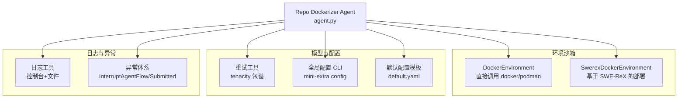
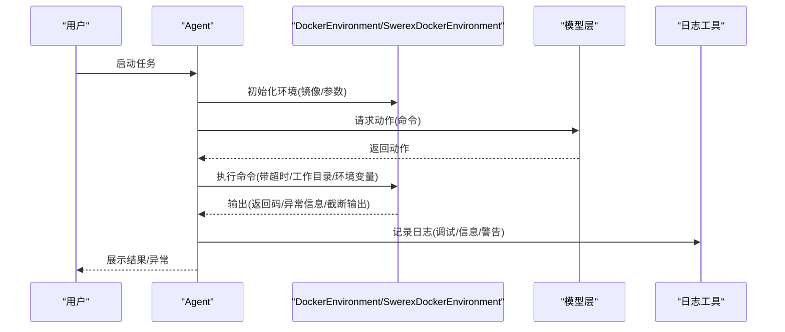
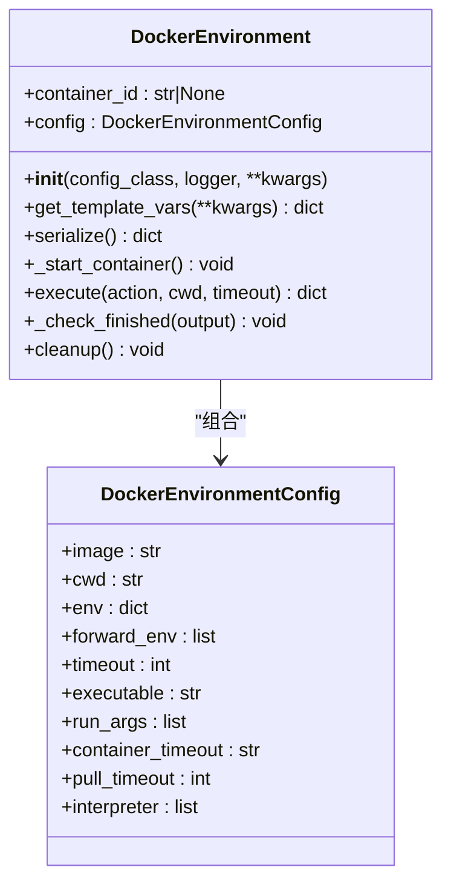
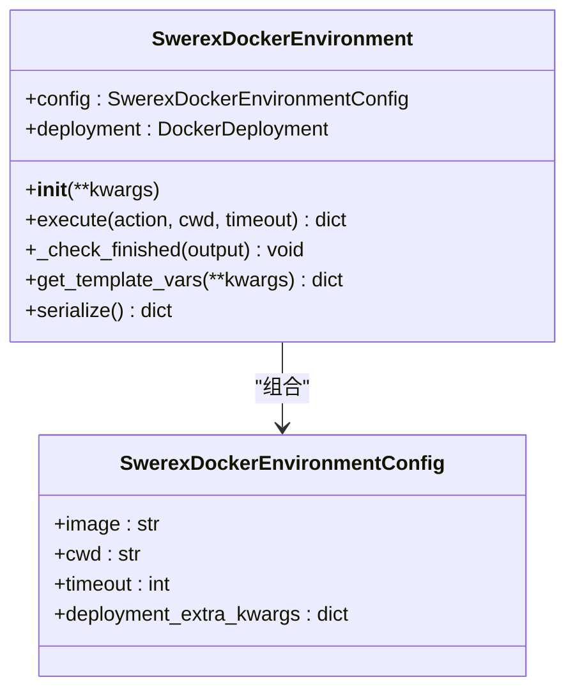
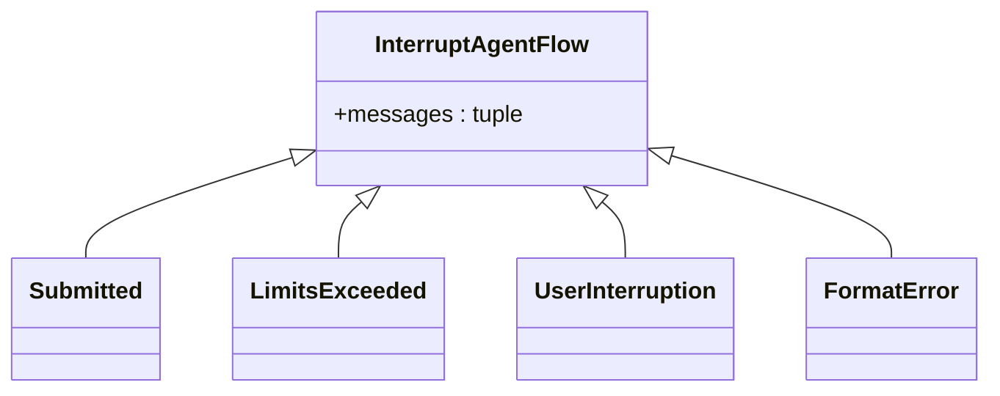
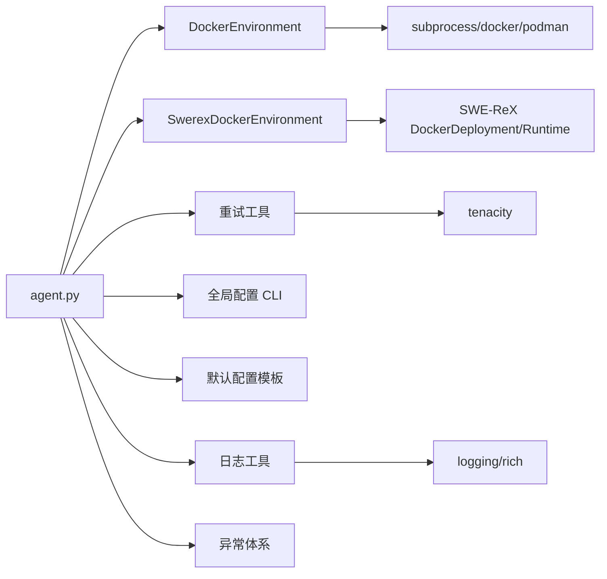

# 故障排除

<cite>
**本文引用的文件**
- [workplace/src/minisweagent/environments/docker.py](file://workplace/src/minisweagent/environments/docker.py)
- [workplace/src/minisweagent/environments/extra/swerex_docker.py](file://workplace/src/minisweagent/environments/extra/swerex_docker.py)
- [workplace/src/minisweagent/utils/log.py](file://workplace/src/minisweagent/utils/log.py)
- [workplace/src/minisweagent/exceptions.py](file://workplace/src/minisweagent/exceptions.py)
- [workplace/src/minisweagent/config/default.yaml](file://workplace/src/minisweagent/config/default.yaml)
- [workplace/src/minisweagent/run/utilities/config.py](file://workplace/src/minisweagent/run/utilities/config.py)
- [workplace/src/minisweagent/models/utils/retry.py](file://workplace/src/minisweagent/models/utils/retry.py)
- [workplace/tests/environments/test_docker.py](file://workplace/tests/environments/test_docker.py)
- [workplace/docs/models/troubleshooting.md](file://workplace/docs/models/troubleshooting.md)
- [workplace/docs/advanced/global_configuration.md](file://workplace/docs/advanced/global_configuration.md)
- [workplace/docs/reference/environments/docker.md](file://workplace/docs/reference/environments/docker.md)
- [agent.py](file://agent.py)
</cite>

## 目录
1. [简介](#简介)
2. [项目结构](#项目结构)
3. [核心组件](#核心组件)
4. [架构总览](#架构总览)
5. [详细组件分析](#详细组件分析)
6. [依赖关系分析](#依赖关系分析)
7. [性能考虑](#性能考虑)
8. [故障排除指南](#故障排除指南)
9. [结论](#结论)
10. [附录](#附录)

## 简介
本指南面向 Repo Dockerizer Agent 的使用者与维护者，聚焦于运行时常见问题的诊断与解决，覆盖以下方面：
- 网络连接问题：镜像拉取失败、代理与防火墙影响、容器启动超时等
- API 密钥配置错误：模型提供商认证失败、模型名称与提供商不匹配、成本计算异常
- Docker 权限问题：无法访问 Docker/Podman、权限不足导致的容器执行失败
- 日志分析与调试：日志级别、文件落盘、关键字段解读
- 性能问题诊断与优化：内存使用、超时处理、资源限制
- 错误代码对照与常见模式识别：返回码、异常类型、提交信号
- 预防性措施与最佳实践：配置校验、重试策略、资源规划

## 项目结构
本项目围绕“代理 + 环境沙箱 + 模型调用 + 日志工具”组织，其中 Docker 环境沙箱是 Repo Dockerizer Agent 的关键执行载体。

图表来源
- [workplace/src/minisweagent/environments/docker.py](file://workplace/src/minisweagent/environments/docker.py#L45-L162)
- [workplace/src/minisweagent/environments/extra/swerex_docker.py](file://workplace/src/minisweagent/environments/extra/swerex_docker.py#L22-L81)
- [workplace/src/minisweagent/models/utils/retry.py](file://workplace/src/minisweagent/models/utils/retry.py#L9-L25)
- [workplace/src/minisweagent/run/utilities/config.py](file://workplace/src/minisweagent/run/utilities/config.py#L58-L112)
- [workplace/src/minisweagent/config/default.yaml](file://workplace/src/minisweagent/config/default.yaml#L104-L167)
- [workplace/src/minisweagent/utils/log.py](file://workplace/src/minisweagent/utils/log.py#L7-L36)
- [workplace/src/minisweagent/exceptions.py](file://workplace/src/minisweagent/exceptions.py#L1-L23)
- [agent.py](file://agent.py#L127-L146)

章节来源
- [workplace/src/minisweagent/environments/docker.py](file://workplace/src/minisweagent/environments/docker.py#L1-L162)
- [workplace/src/minisweagent/environments/extra/swerex_docker.py](file://workplace/src/minisweagent/environments/extra/swerex_docker.py#L1-L81)
- [workplace/src/minisweagent/utils/log.py](file://workplace/src/minisweagent/utils/log.py#L1-L37)
- [workplace/src/minisweagent/exceptions.py](file://workplace/src/minisweagent/exceptions.py#L1-L23)
- [workplace/src/minisweagent/config/default.yaml](file://workplace/src/minisweagent/config/default.yaml#L1-L167)
- [workplace/src/minisweagent/run/utilities/config.py](file://workplace/src/minisweagent/run/utilities/config.py#L1-L117)
- [workplace/src/minisweagent/models/utils/retry.py](file://workplace/src/minisweagent/models/utils/retry.py#L1-L26)
- [agent.py](file://agent.py#L127-L146)

## 核心组件
- DockerEnvironment：封装容器生命周期（启动、执行命令、清理），支持自定义可执行文件（docker/podman）、工作目录、环境变量转发与设置、超时控制、容器存活时长等。
- SwerexDockerEnvironment：基于 SWE-ReX 的异步部署与执行，提供一致的执行接口与完成信号检查。
- 日志工具：统一根日志器、控制台高亮输出、文件落盘，便于问题定位。
- 异常体系：InterruptAgentFlow 及其子类（Submitted、LimitsExceeded、UserInterruption、FormatError）用于流程中断与状态上报。
- 全局配置 CLI：mini-extra config 提供设置/取消/编辑全局配置的能力，支持永久保存到 .env 文件。
- 默认配置模板：包含观察模板、格式化错误模板、系统/实例模板等，便于在输出中呈现异常信息与返回码。
- 重试工具：基于 tenacity 的指数退避重试，支持停止次数、等待范围、中止异常类型等。

章节来源
- [workplace/src/minisweagent/environments/docker.py](file://workplace/src/minisweagent/environments/docker.py#L45-L162)
- [workplace/src/minisweagent/environments/extra/swerex_docker.py](file://workplace/src/minisweagent/environments/extra/swerex_docker.py#L22-L81)
- [workplace/src/minisweagent/utils/log.py](file://workplace/src/minisweagent/utils/log.py#L7-L36)
- [workplace/src/minisweagent/exceptions.py](file://workplace/src/minisweagent/exceptions.py#L1-L23)
- [workplace/src/minisweagent/run/utilities/config.py](file://workplace/src/minisweagent/run/utilities/config.py#L58-L112)
- [workplace/src/minisweagent/config/default.yaml](file://workplace/src/minisweagent/config/default.yaml#L104-L167)
- [workplace/src/minisweagent/models/utils/retry.py](file://workplace/src/minisweagent/models/utils/retry.py#L9-L25)

## 架构总览
下图展示 Repo Dockerizer Agent 在执行过程中的关键交互：Agent 通过 DockerEnvironment/SwerexDockerEnvironment 执行命令，模型层负责对话与动作生成，日志与异常贯穿始终。

图表来源
- [workplace/src/minisweagent/environments/docker.py](file://workplace/src/minisweagent/environments/docker.py#L101-L138)
- [workplace/src/minisweagent/environments/extra/swerex_docker.py](file://workplace/src/minisweagent/environments/extra/swerex_docker.py#L29-L54)
- [workplace/src/minisweagent/utils/log.py](file://workplace/src/minisweagent/utils/log.py#L21-L29)

## 详细组件分析

### DockerEnvironment 组件分析
- 关键职责：启动容器、执行命令、环境变量注入、超时控制、完成信号检查、清理容器
- 配置要点：image、cwd、env、forward_env、timeout、executable、run_args、container_timeout、pull_timeout、interpreter
- 命令执行路径：构造 docker/podman exec 命令，设置工作目录与环境变量，捕获输出与返回码，异常转为结构化输出
- 完成信号：当输出首行匹配特定提交标记且返回码为 0 时抛出 Submitted 异常，驱动 Agent 流程结束

图表来源
- [workplace/src/minisweagent/environments/docker.py](file://workplace/src/minisweagent/environments/docker.py#L15-L99)
- [workplace/src/minisweagent/environments/docker.py](file://workplace/src/minisweagent/environments/docker.py#L101-L138)

章节来源
- [workplace/src/minisweagent/environments/docker.py](file://workplace/src/minisweagent/environments/docker.py#L45-L162)
- [workplace/tests/environments/test_docker.py](file://workplace/tests/environments/test_docker.py#L10-L231)

### SwerexDockerEnvironment 组件分析
- 关键职责：通过 SWE-ReX 异步部署与执行命令，提供一致的返回结构
- 配置要点：image、cwd、timeout、deployment_extra_kwargs
- 执行路径：构造 RexCommand 并调用 runtime.execute，捕获 stdout/exit_code，异常转为结构化输出
- 完成信号：与 DockerEnvironment 一致的提交检查逻辑

图表来源
- [workplace/src/minisweagent/environments/extra/swerex_docker.py](file://workplace/src/minisweagent/environments/extra/swerex_docker.py#L12-L81)

章节来源
- [workplace/src/minisweagent/environments/extra/swerex_docker.py](file://workplace/src/minisweagent/environments/extra/swerex_docker.py#L22-L81)

### 日志与异常体系
- 日志：统一根日志器，控制台高亮输出；可添加文件处理器，记录时间戳与完整级别信息
- 异常：InterruptAgentFlow 作为基类，Submitted 表示任务完成；LimitsExceeded、UserInterruption、FormatError 分别表示超出限制、用户中断、格式错误

图表来源
- [workplace/src/minisweagent/exceptions.py](file://workplace/src/minisweagent/exceptions.py#L1-L23)

章节来源
- [workplace/src/minisweagent/utils/log.py](file://workplace/src/minisweagent/utils/log.py#L7-L36)
- [workplace/src/minisweagent/exceptions.py](file://workplace/src/minisweagent/exceptions.py#L1-L23)

### 全局配置与模型故障排除
- 全局配置 CLI：支持设置/取消/编辑全局配置，优先读取环境变量，其次读取 .env 文件
- 模型故障排除文档：涵盖 litellm 的 API Key 无效、认证错误、成本计算异常、温度参数不支持、Portkey 模型名与提供商不匹配等问题及修复建议

章节来源
- [workplace/src/minisweagent/run/utilities/config.py](file://workplace/src/minisweagent/run/utilities/config.py#L58-L112)
- [workplace/docs/models/troubleshooting.md](file://workplace/docs/models/troubleshooting.md#L1-L115)
- [workplace/docs/advanced/global_configuration.md](file://workplace/docs/advanced/global_configuration.md#L1-L68)

## 依赖关系分析
- DockerEnvironment 依赖 subprocess 调用 docker/podman，依赖 pydantic 的配置模型
- SwerexDockerEnvironment 依赖 SWE-ReX 的 DockerDeployment 与 Runtime
- 日志工具依赖 rich.logging 与标准库 logging
- 重试工具依赖 tenacity，受环境变量控制重试次数与等待范围
- Agent 侧具备 API Key 错误识别能力，辅助定位模型认证问题

图表来源
- [agent.py](file://agent.py#L127-L146)
- [workplace/src/minisweagent/environments/docker.py](file://workplace/src/minisweagent/environments/docker.py#L74-L99)
- [workplace/src/minisweagent/environments/extra/swerex_docker.py](file://workplace/src/minisweagent/environments/extra/swerex_docker.py#L23-L27)
- [workplace/src/minisweagent/models/utils/retry.py](file://workplace/src/minisweagent/models/utils/retry.py#L19-L25)
- [workplace/src/minisweagent/utils/log.py](file://workplace/src/minisweagent/utils/log.py#L7-L18)

章节来源
- [agent.py](file://agent.py#L127-L146)
- [workplace/src/minisweagent/environments/docker.py](file://workplace/src/minisweagent/environments/docker.py#L74-L99)
- [workplace/src/minisweagent/environments/extra/swerex_docker.py](file://workplace/src/minisweagent/environments/extra/swerex_docker.py#L23-L27)
- [workplace/src/minisweagent/models/utils/retry.py](file://workplace/src/minisweagent/models/utils/retry.py#L1-L26)
- [workplace/src/minisweagent/utils/log.py](file://workplace/src/minisweagent/utils/log.py#L1-L37)

## 性能考虑
- 超时与资源限制
  - 容器启动超时：pull_timeout 控制镜像拉取等待时间
  - 命令执行超时：timeout 控制单次命令执行时限
  - 容器存活时长：container_timeout 控制容器最大运行时长
  - 工作目录与环境变量：合理设置 cwd 与 env/forward_env，避免不必要的 I/O 与变量污染
- 重试策略
  - 使用指数退避重试，避免对上游服务造成压力
  - 通过环境变量调整停止尝试次数与等待范围
- 观察模板与输出截断
  - default.yaml 中的 observation_template 将异常信息与返回码纳入观察，便于快速定位
  - 当输出过长时自动截断并提示使用更精确的命令或重定向到文件

章节来源
- [workplace/src/minisweagent/environments/docker.py](file://workplace/src/minisweagent/environments/docker.py#L26-L42)
- [workplace/src/minisweagent/models/utils/retry.py](file://workplace/src/minisweagent/models/utils/retry.py#L19-L25)
- [workplace/src/minisweagent/config/default.yaml](file://workplace/src/minisweagent/config/default.yaml#L114-L141)

## 故障排除指南

### 一、网络连接问题
- 症状
  - 镜像拉取超时或失败
  - 容器启动后立即退出
  - 执行命令时报找不到容器或连接失败
- 常见原因
  - Docker/Podman 未安装或未运行
  - 网络受限（代理/防火墙/企业内网）
  - 镜像源不可达或需要认证
- 排查步骤
  - 确认可执行文件可用：docker 或 podman
  - 检查镜像名称与标签是否正确
  - 调整 pull_timeout 以适应网络状况
  - 在测试脚本中验证容器生命周期与命令执行
- 解决方案
  - 配置本地镜像仓库或代理
  - 使用私有镜像仓库并确保凭据正确
  - 适当提高超时阈值，分阶段拉取镜像

章节来源
- [workplace/tests/environments/test_docker.py](file://workplace/tests/environments/test_docker.py#L10-L26)
- [workplace/src/minisweagent/environments/docker.py](file://workplace/src/minisweagent/environments/docker.py#L74-L99)

### 二、API 密钥配置错误
- 症状
  - 认证失败、API Key 无效、成本计算异常
  - 模型名称与提供商未匹配导致解析错误
- 常见原因
  - API Key 未设置或拼写错误
  - 模型名称缺少提供商前缀
  - 成本注册表缺失对应模型的价格信息
- 排查步骤
  - 使用全局配置 CLI 设置/查看/编辑 API Key
  - 确认模型名称包含正确的提供商前缀
  - 若涉及 Portkey，检查 litellm_model_name_override 是否与提供商匹配
- 解决方案
  - 通过 mini-extra config set 设置并持久化
  - 在模型故障排除文档中核对错误消息与修复步骤
  - 如需成本计算，参考本地模型注册表指引补充映射

章节来源
- [workplace/src/minisweagent/run/utilities/config.py](file://workplace/src/minisweagent/run/utilities/config.py#L58-L112)
- [workplace/docs/models/troubleshooting.md](file://workplace/docs/models/troubleshooting.md#L9-L35)
- [workplace/docs/models/troubleshooting.md](file://workplace/docs/models/troubleshooting.md#L72-L112)
- [workplace/docs/advanced/global_configuration.md](file://workplace/docs/advanced/global_configuration.md#L14-L48)

### 三、Docker 权限问题
- 症状
  - 无法启动容器、执行命令失败、权限不足
- 常见原因
  - 当前用户不在 docker 用户组
  - SELinux/AppArmor 限制
  - 使用 Podman 但未启用 rootless 模式
- 排查步骤
  - 在宿主机上手动执行 docker version/podman version
  - 检查容器是否成功创建并处于运行状态
  - 查看日志中是否有权限相关错误
- 解决方案
  - 将用户加入 docker 组或使用 sudo
  - 调整安全策略或使用 rootless Podman
  - 在测试脚本中验证 Docker/Podman 可用性

章节来源
- [workplace/tests/environments/test_docker.py](file://workplace/tests/environments/test_docker.py#L10-L26)

### 四、日志分析与调试技巧
- 日志级别与输出
  - 控制台输出：RichHandler，关闭路径/时间/级别显示，便于阅读
  - 文件输出：add_file_handler 添加文件处理器，记录完整时间戳与级别
- 关键字段解读
  - 返回码：returncode，0 表示成功，非 0 表示命令执行失败
  - 异常信息：exception_info，包含异常类型与描述
  - 输出截断：当输出超过阈值时自动截断并提示使用更精确的命令
- 调试建议
  - 开启文件日志，复现问题后对比时间线
  - 结合观察模板关注异常信息与返回码
  - 对超时/权限/镜像问题分别设置不同日志级别进行定位

章节来源
- [workplace/src/minisweagent/utils/log.py](file://workplace/src/minisweagent/utils/log.py#L7-L36)
- [workplace/src/minisweagent/config/default.yaml](file://workplace/src/minisweagent/config/default.yaml#L114-L141)

### 五、性能问题诊断与优化
- 内存使用监控
  - 通过容器资源限制与宿主机监控工具观察内存峰值
  - 减少一次性大输出，采用分页/筛选/重定向策略
- 超时处理
  - 合理设置 pull_timeout、timeout、container_timeout
  - 对耗时操作拆分为多步命令，避免长时间占用
- 资源限制
  - 使用 run_args 传递资源限制参数（如 --rm、--memory 等）
  - 在 CI/生产环境中固定镜像版本，减少缓存抖动

章节来源
- [workplace/src/minisweagent/environments/docker.py](file://workplace/src/minisweagent/environments/docker.py#L26-L42)
- [workplace/src/minisweagent/config/default.yaml](file://workplace/src/minisweagent/config/default.yaml#L114-L141)

### 六、错误代码对照与常见错误模式
- 返回码
  - 0：命令执行成功
  - 非 0：命令执行失败，具体值由底层命令决定
- 异常类型
  - subprocess 超时/调用错误：通常映射为 exception_info，并带有异常类型与描述
  - 完成信号：当输出首行匹配提交标记且返回码为 0 时触发 Submitted
- 常见错误模式识别
  - API Key 相关：在观察输出中识别包含“API key”、“token”、“invalid”等关键词的片段
  - 模型名称不匹配：识别缺少提供商前缀的模型名
  - 权限不足：识别与 docker/podman 权限相关的错误信息

章节来源
- [workplace/src/minisweagent/environments/docker.py](file://workplace/src/minisweagent/environments/docker.py#L125-L137)
- [workplace/src/minisweagent/environments/docker.py](file://workplace/src/minisweagent/environments/docker.py#L140-L151)
- [agent.py](file://agent.py#L127-L146)

### 七、预防性措施与最佳实践
- 配置校验
  - 使用 mini-extra config set/unset/edit 管理全局配置，避免硬编码
  - 在启动前检查环境变量与 .env 文件
- 重试策略
  - 合理设置重试次数与等待范围，避免对上游服务造成压力
- 资源规划
  - 明确超时阈值与容器存活时长，避免资源泄漏
  - 对大输出场景采用重定向与分页策略
- 文档与测试
  - 参考官方文档与测试用例，确保环境一致性

章节来源
- [workplace/src/minisweagent/run/utilities/config.py](file://workplace/src/minisweagent/run/utilities/config.py#L58-L112)
- [workplace/src/minisweagent/models/utils/retry.py](file://workplace/src/minisweagent/models/utils/retry.py#L19-L25)
- [workplace/tests/environments/test_docker.py](file://workplace/tests/environments/test_docker.py#L44-L231)

## 结论
本指南从组件、日志、配置、模型与测试五个维度构建了 Repo Dockerizer Agent 的故障排除体系。通过明确的排查步骤、错误模式识别与预防性措施，可显著降低运行时风险并提升稳定性。建议在日常使用中结合日志与观察模板，配合合理的超时与重试策略，持续优化容器执行效率与安全性。

## 附录
- 参考文档入口
  - Docker 环境类参考：[docker.md](file://workplace/docs/reference/environments/docker.md#L1-L15)
  - 模型故障排除：[models/troubleshooting.md](file://workplace/docs/models/troubleshooting.md#L1-L115)
  - 全局配置指南：[advanced/global_configuration.md](file://workplace/docs/advanced/global_configuration.md#L1-L68)