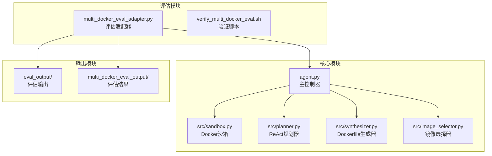
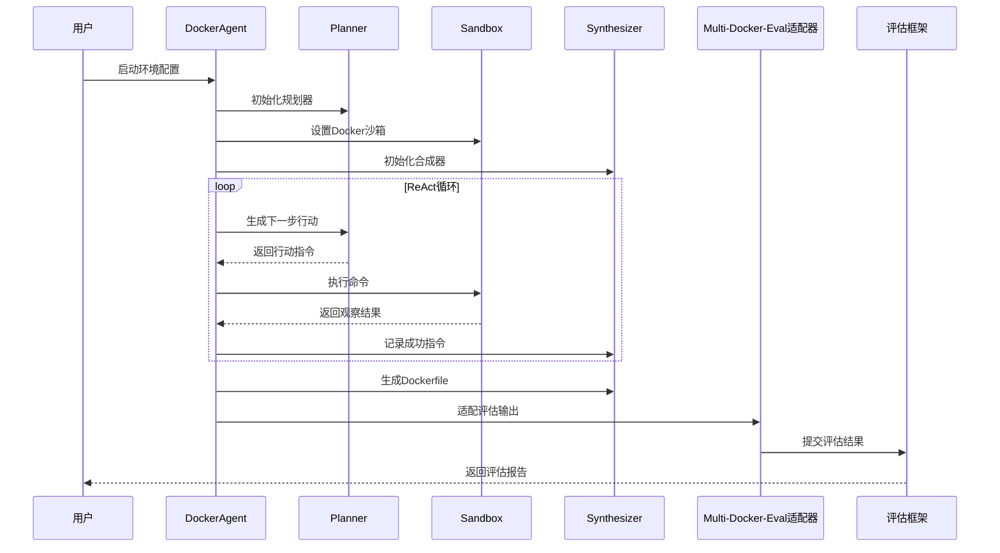
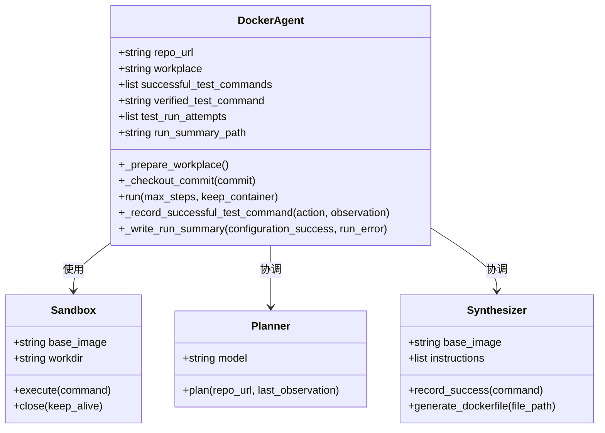
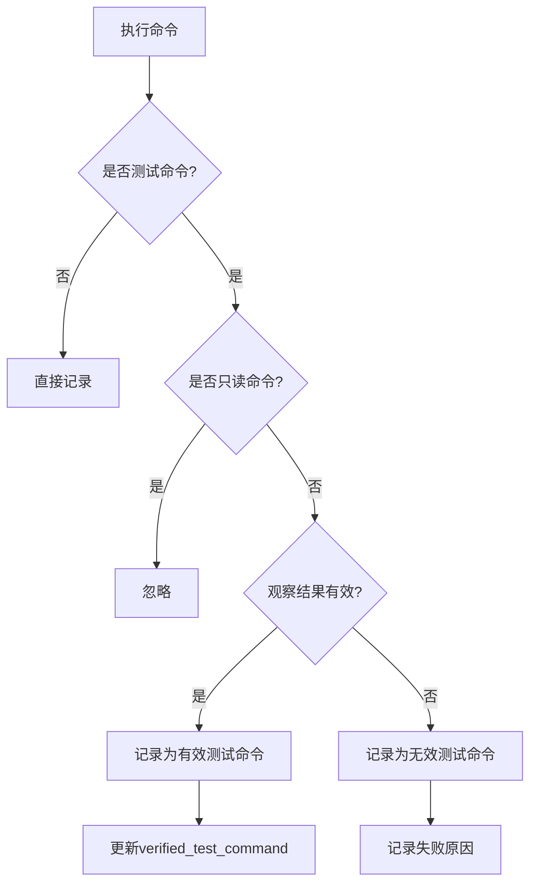
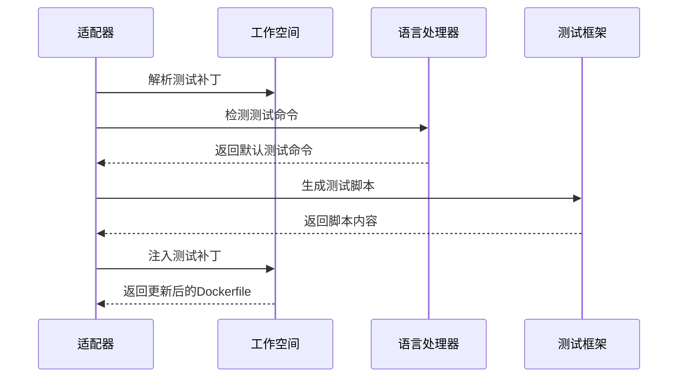
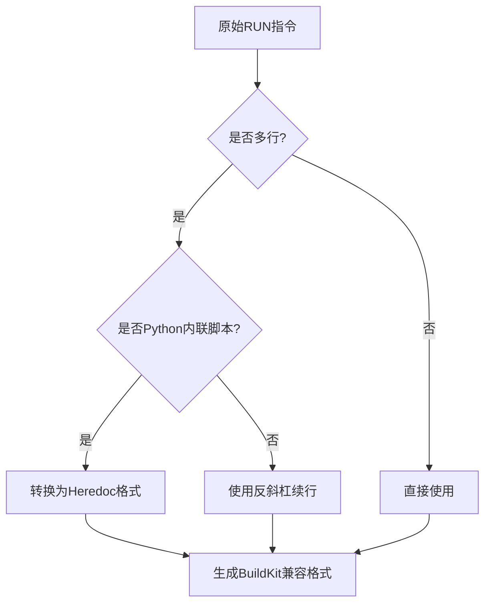
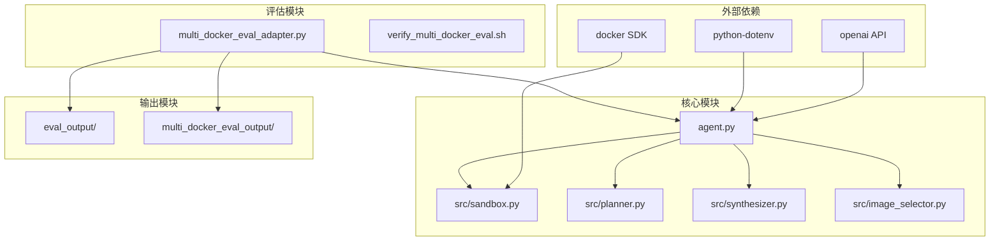
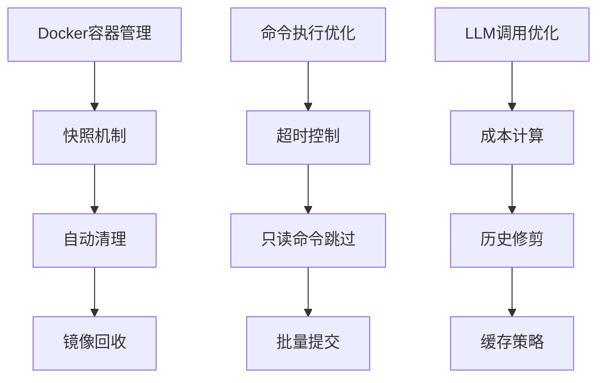
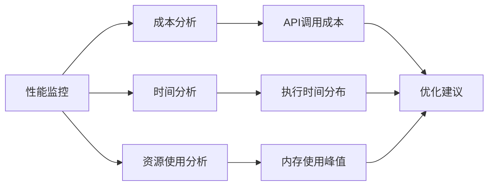
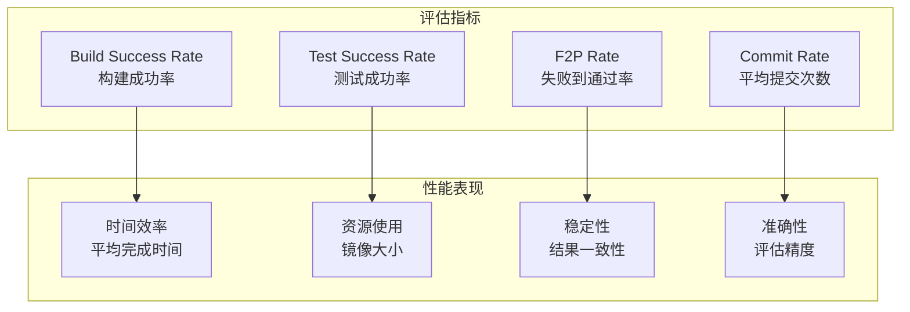

# 评估输出增强

<cite>
**本文档引用的文件**
- [README.md](file://README.md)
- [multi_docker_eval_adapter.py](file://multi_docker_eval_adapter.py)
- [agent.py](file://agent.py)
- [verify_multi_docker_eval.sh](file://verify_multi_docker_eval.sh)
- [requirements.txt](file://requirements.txt)
- [src/sandbox.py](file://src/sandbox.py)
- [src/planner.py](file://src/planner.py)
- [src/synthesizer.py](file://src/synthesizer.py)
- [src/image_selector.py](file://src/image_selector.py)
- [doc/MULTI_DOCKER_EVAL.md](file://doc/MULTI_DOCKER_EVAL.md)
- [eval_output/DockerAgent/final_report.json](file://eval_output/DockerAgent/final_report.json)
- [eval_output/DockerAgent/go:uber-go__atomic-90/combined_report.json](file://eval_output/DockerAgent/go:uber-go__atomic-90/combined_report.json)
- [eval_output/DockerAgent/go:uber-go__atomic-90/reports/report_apply_patch_0.json](file://eval_output/DockerAgent/go:uber-go__atomic-90/reports/report_apply_patch_0.json)
- [multi_docker_eval_output/docker_res.json](file://multi_docker_eval_output/docker_res.json)
</cite>

## 目录
1. [简介](#简介)
2. [项目结构](#项目结构)
3. [核心组件](#核心组件)
4. [架构概览](#架构概览)
5. [详细组件分析](#详细组件分析)
6. [依赖关系分析](#依赖关系分析)
7. [性能考虑](#性能考虑)
8. [故障排除指南](#故障排除指南)
9. [结论](#结论)
10. [附录](#附录)

## 简介

本文档深入分析了该代码库的"评估输出增强"功能，重点研究了如何将 DockerAgent 适配到 Multi-Docker-Eval 评估基准，以及如何增强评估输出的质量和完整性。

该项目是一个基于 LLM 的 Docker 环境配置 Agent，专门设计用于自动为 GitHub 仓库配置可执行的 Docker 环境。其核心创新在于实现了完整的评估输出增强机制，能够：

- 自动生成符合 Multi-Docker-Eval 标准的评估结果
- 提供详细的测试命令来源追踪
- 实现智能的平台兼容性检测
- 生成可重复的测试补丁应用机制
- 提供丰富的运行时元数据

## 项目结构

该项目采用模块化的架构设计，主要包含以下几个核心部分：

**图表来源**
- [agent.py:18-138](file://agent.py#L18-L138)
- [multi_docker_eval_adapter.py:37-295](file://multi_docker_eval_adapter.py#L37-L295)

**章节来源**
- [README.md:1-71](file://README.md#L1-L71)
- [doc/MULTI_DOCKER_EVAL.md:279-310](file://doc/MULTI_DOCKER_EVAL.md#L279-L310)

## 核心组件

### DockerAgent 主控制器

DockerAgent 是整个系统的核心控制器，负责协调各个组件完成环境配置任务：

- **初始化流程**：自动检测基础镜像、准备工作空间、设置 LLM 客户端
- **ReAct 循环**：执行思考-行动-观察的循环，直到配置完成
- **运行时元数据**：记录测试命令、配置状态等关键信息

### Multi-Docker-Eval 适配器

该适配器专门负责将 DockerAgent 的输出转换为 Multi-Docker-Eval 评估框架所需的格式：

- **格式转换**：将内部结果转换为 docker_res.json 格式
- **测试脚本生成**：自动生成可执行的测试脚本
- **补丁应用**：实现测试补丁的自动应用机制
- **平台检测**：智能检测和处理平台兼容性问题

### 智能测试命令解析

系统实现了复杂的测试命令解析机制，能够：

- 从运行时日志中提取实际有效的测试命令
- 支持多种编程语言的测试框架
- 提供测试命令来源追踪
- 实现测试命令的有效性验证

**章节来源**
- [agent.py:18-433](file://agent.py#L18-L433)
- [multi_docker_eval_adapter.py:37-800](file://multi_docker_eval_adapter.py#L37-L800)

## 架构概览

系统采用分层架构设计，各层职责明确，耦合度低：

**图表来源**
- [agent.py:285-361](file://agent.py#L285-L361)
- [multi_docker_eval_adapter.py:45-295](file://multi_docker_eval_adapter.py#L45-L295)

## 详细组件分析

### DockerAgent 类分析

DockerAgent 类实现了完整的环境配置生命周期管理：

**图表来源**
- [agent.py:18-138](file://agent.py#L18-L138)
- [src/sandbox.py:8-331](file://src/sandbox.py#L8-L331)
- [src/planner.py:6-244](file://src/planner.py#L6-L244)
- [src/synthesizer.py:4-499](file://src/synthesizer.py#L4-L499)

#### 测试命令记录机制

系统实现了智能的测试命令记录机制，能够区分有效和无效的测试命令：

**图表来源**
- [agent.py:362-382](file://agent.py#L362-L382)
- [src/synthesizer.py:106-148](file://src/synthesizer.py#L106-L148)

**章节来源**
- [agent.py:18-433](file://agent.py#L18-L433)
- [src/synthesizer.py:106-148](file://src/synthesizer.py#L106-L148)

### Multi-Docker-Eval 适配器分析

Multi-Docker-Eval 适配器是评估输出增强的核心组件：

#### 测试脚本生成流程

**图表来源**
- [multi_docker_eval_adapter.py:555-759](file://multi_docker_eval_adapter.py#L555-L759)

#### 平台兼容性检测

适配器实现了智能的平台兼容性检测机制：

| 平台类型 | 检测模式 | 兼容性处理 |
|---------|---------|-----------|
| Windows | VS项目、MSVC工具链 | 跳过评估 |
| 嵌入式 | IAR工具链 | 跳过评估 |
| macOS | Xcode工具链 | 跳过评估 |
| Linux | 通用检测 | 正常评估 |

**章节来源**
- [multi_docker_eval_adapter.py:358-440](file://multi_docker_eval_adapter.py#L358-L440)
- [multi_docker_eval_adapter.py:555-759](file://multi_docker_eval_adapter.py#L555-L759)

### Dockerfile 生成增强

系统提供了强大的 Dockerfile 生成能力，支持多种优化特性：

#### 多行RUN指令处理

**图表来源**
- [multi_docker_eval_adapter.py:178-229](file://multi_docker_eval_adapter.py#L178-L229)

#### 测试补丁集成

系统实现了完整的测试补丁应用机制：

| 补丁应用方法 | 适用场景 | 优点 | 风险 |
|-------------|---------|------|------|
| git apply | 标准Git仓库 | 稳定可靠 | 需要Git支持 |
| patch命令 | 无Git环境 | 兼容性强 | 可能失败 |
| 手动应用 | 特殊情况 | 灵活可控 | 维护复杂 |

**章节来源**
- [multi_docker_eval_adapter.py:761-789](file://multi_docker_eval_adapter.py#L761-L789)
- [multi_docker_eval_adapter.py:227-249](file://multi_docker_eval_adapter.py#L227-L249)

## 依赖关系分析

系统采用了清晰的依赖层次结构：

**图表来源**
- [requirements.txt:1-4](file://requirements.txt#L1-L4)
- [agent.py:1-16](file://agent.py#L1-L16)

**章节来源**
- [requirements.txt:1-4](file://requirements.txt#L1-L4)
- [multi_docker_eval_adapter.py:27-34](file://multi_docker_eval_adapter.py#L27-L34)

## 性能考虑

### 内存使用优化

系统在内存使用方面采用了多项优化策略：

- **历史消息修剪**：限制 Planner 的历史消息长度，避免内存泄漏
- **文件大小限制**：对大型文件进行截断处理，防止内存溢出
- **增量日志写入**：使用流式写入减少内存占用

### Docker 资源管理

**图表来源**
- [src/sandbox.py:154-167](file://src/sandbox.py#L154-L167)
- [src/planner.py:198-204](file://src/planner.py#L198-L204)

### 评估性能监控

系统提供了全面的性能监控机制：

| 监控指标 | 采集频率 | 存储位置 | 用途 |
|---------|---------|---------|------|
| API调用成本 | 每次调用 | 运行时统计 | 成本控制 |
| 命令执行时间 | 每次执行 | 日志文件 | 性能分析 |
| 镜像大小 | 构建完成后 | 结果文件 | 资源使用 |
| 测试通过率 | 评估完成后 | 报告文件 | 效果评估 |

**章节来源**
- [src/planner.py:206-228](file://src/planner.py#L206-L228)
- [src/sandbox.py:81-152](file://src/sandbox.py#L81-L152)

## 故障排除指南

### 常见问题诊断

#### Docker 相关问题

| 问题症状 | 可能原因 | 解决方案 |
|---------|---------|---------|
| Docker连接失败 | Docker守护进程未启动 | 启动Docker服务 |
| 权限不足 | 用户不在docker组 | 添加用户到docker组 |
| 镜像拉取失败 | 网络连接问题 | 检查网络设置 |
| 容器启动失败 | 资源不足 | 增加系统资源 |

#### LLM 相关问题

| 问题症状 | 可能原因 | 解决方案 |
|---------|---------|---------|
| API密钥错误 | 密钥配置错误 | 检查.env文件 |
| 请求频率过高 | 超过API限制 | 降低请求频率 |
| 模型响应异常 | 模型参数错误 | 调整模型设置 |
| 成本过高 | 调用次数过多 | 优化算法逻辑 |

#### 评估框架问题

| 问题症状 | 可能原因 | 解决方案 |
|---------|---------|---------|
| 评估结果为空 | 输出格式错误 | 检查输出格式 |
| 平台不兼容 | 架构检测失败 | 手动指定平台 |
| 测试补丁应用失败 | 补丁格式错误 | 验证补丁内容 |
| 资源不足 | 磁盘空间不够 | 清理临时文件 |

**章节来源**
- [verify_multi_docker_eval.sh:14-37](file://verify_multi_docker_eval.sh#L14-L37)
- [doc/MULTI_DOCKER_EVAL.md:319-344](file://doc/MULTI_DOCKER_EVAL.md#L319-L344)

### 调试技巧

#### 日志分析

系统提供了多层次的日志记录机制：

1. **LLM调用日志**：记录每次API调用的详细信息
2. **容器操作日志**：跟踪Docker容器的所有操作
3. **评估过程日志**：记录评估过程中的关键事件
4. **错误追踪日志**：提供完整的错误堆栈信息

#### 性能分析

**图表来源**
- [src/planner.py:206-228](file://src/planner.py#L206-L228)
- [src/sandbox.py:117-128](file://src/sandbox.py#L117-L128)

## 结论

该代码库在评估输出增强方面展现了卓越的设计理念和技术实现：

### 主要成就

1. **完整的评估生态**：从环境配置到评估输出的全流程自动化
2. **智能的平台检测**：能够识别和处理各种平台兼容性问题
3. **强大的测试补丁机制**：实现了可重复的测试补丁应用
4. **丰富的元数据追踪**：提供了完整的运行时信息记录
5. **高效的性能优化**：在保证质量的同时优化了资源使用

### 技术亮点

- **ReAct架构**：实现了智能的环境配置决策机制
- **Docker沙箱**：提供了安全可靠的执行环境
- **多语言支持**：覆盖主流编程语言的测试框架
- **成本控制**：实现了精细化的API调用成本管理

### 应用价值

该系统为软件工程领域的自动化环境配置提供了重要的技术支撑，特别是在以下方面：

- **持续集成**：为CI/CD流水线提供标准化的环境配置
- **软件测试**：为测试环境的快速搭建提供解决方案
- **开发效率**：显著提升开发者环境配置的效率
- **质量保证**：通过标准化流程提升软件质量

## 附录

### 评估结果示例分析

通过对实际评估结果的分析，可以更好地理解系统的性能表现：

**图表来源**
- [eval_output/DockerAgent/final_report.json:1-29](file://eval_output/DockerAgent/final_report.json#L1-L29)
- [eval_output/DockerAgent/go:uber-go__atomic-90/combined_report.json:1-9](file://eval_output/DockerAgent/go:uber-go__atomic-90/combined_report.json#L1-L9)

### 最佳实践建议

1. **资源配置**：确保足够的系统资源以支持大规模评估
2. **网络设置**：配置稳定的网络连接以支持API调用
3. **存储管理**：定期清理临时文件以释放磁盘空间
4. **监控设置**：建立完善的监控体系以及时发现和解决问题

**章节来源**
- [doc/MULTI_DOCKER_EVAL.md:312-372](file://doc/MULTI_DOCKER_EVAL.md#L312-L372)