# 输出文件说明

<cite>
**本文档引用的文件**
- [agent.py](file://agent.py)
- [synthesizer.py](file://src/synthesizer.py)
- [planner.py](file://src/planner.py)
- [sandbox.py](file://src/sandbox.py)
- [Dockerfile](file://Dockerfile)
- [QuickStart.md](file://workplace/QuickStart.md)
- [output_files.md](file://workplace/docs/usage/output_files.md)
- [docker.md](file://workplace/docs/reference/environments/docker.md)
- [singularity.md](file://workplace/docs/reference/environments/singularity.md)
- [pyproject.toml](file://workplace/pyproject.toml)
- [README.md](file://workplace/README.md)
</cite>

## 目录
1. [简介](#简介)
2. [项目结构概览](#项目结构概览)
3. [核心组件分析](#核心组件分析)
4. [Dockerfile 输出详解](#dockerfile-输出详解)
5. [QuickStart 文档输出详解](#quickstart-文档输出详解)
6. [输出文件解读指南](#输出文件解读指南)
7. [版本控制与维护策略](#版本控制与维护策略)
8. [实际输出示例与对比分析](#实际输出示例与对比分析)
9. [故障排除指南](#故障排除指南)
10. [总结](#总结)

## 简介

Repo Dockerizer Agent 是一个基于大型语言模型的自动化 Docker 环境配置工具。该系统通过 ReAct（思维-行动-观察）循环，在沙箱环境中自动分析目标仓库，识别依赖关系，安装必要的软件包和工具，并生成相应的 Dockerfile 和 QuickStart 文档。

该工具的核心价值在于：
- **自动化环境配置**：无需人工干预即可为任意 GitHub 仓库配置完整的 Docker 环境
- **智能依赖识别**：通过分析项目结构自动识别并安装所需的依赖包
- **成本控制**：内置令牌消耗监控，帮助用户控制 API 使用成本
- **可追溯性**：完整记录配置过程，便于审计和调试

## 项目结构概览

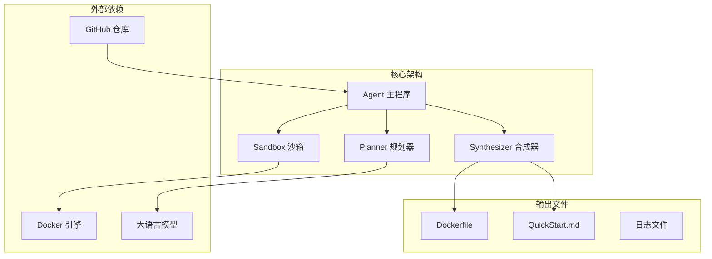

**图表来源**
- [agent.py](file://agent.py#L14-L39)
- [planner.py](file://src/planner.py#L3-L67)
- [sandbox.py](file://src/sandbox.py#L4-L28)
- [synthesizer.py](file://src/synthesizer.py#L1-L22)

**章节来源**
- [agent.py](file://agent.py#L1-L160)
- [pyproject.toml](file://workplace/pyproject.toml#L33-L48)

## 核心组件分析

### DockerAgent 主控制器

DockerAgent 是整个系统的协调中心，负责管理整个配置流程：

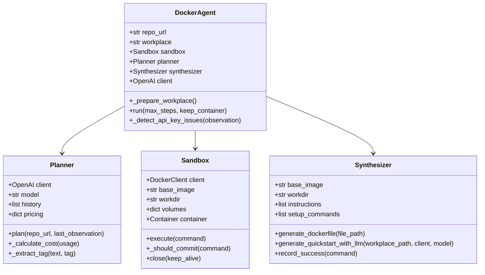

**图表来源**
- [agent.py](file://agent.py#L14-L39)
- [planner.py](file://src/planner.py#L3-L145)
- [sandbox.py](file://src/sandbox.py#L4-L178)
- [synthesizer.py](file://src/synthesizer.py#L1-L144)

### ReAct 循环工作流程

系统采用 ReAct 框架实现智能决策：

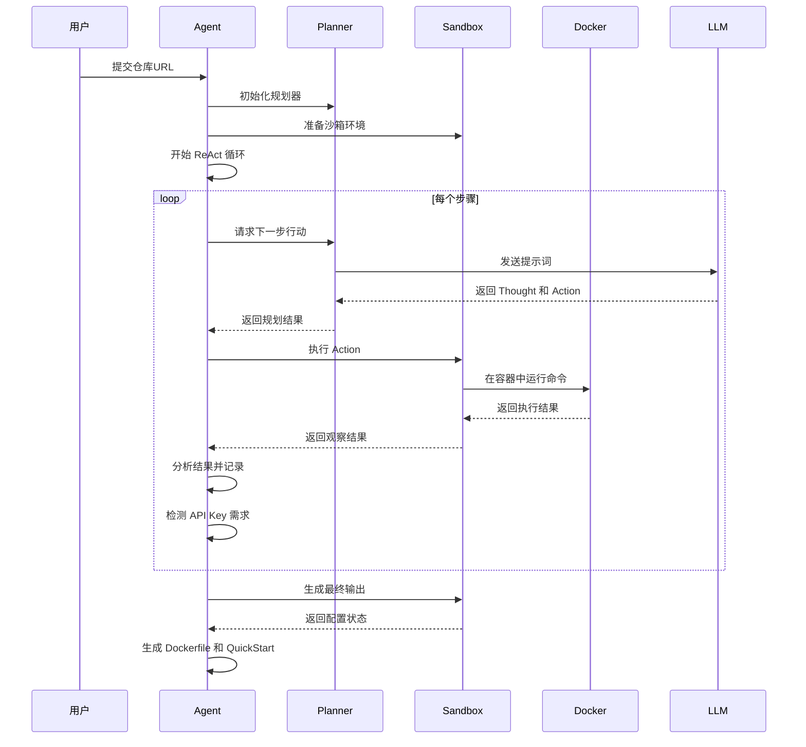

**图表来源**
- [agent.py](file://agent.py#L60-L126)
- [planner.py](file://src/planner.py#L69-L105)
- [sandbox.py](file://src/sandbox.py#L29-L91)

**章节来源**
- [agent.py](file://agent.py#L14-L160)
- [planner.py](file://src/planner.py#L1-L145)
- [sandbox.py](file://src/sandbox.py#L1-L178)

## Dockerfile 输出详解

### 基础结构

生成的 Dockerfile 采用标准的分层架构，确保可维护性和可重复性：

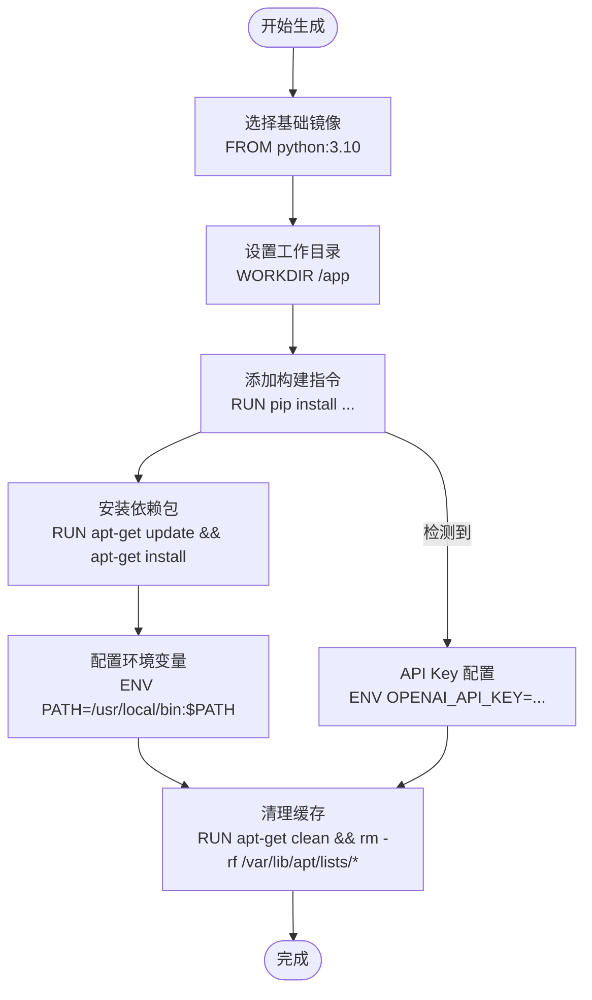

**图表来源**
- [synthesizer.py](file://src/synthesizer.py#L130-L143)
- [Dockerfile](file://Dockerfile#L1-L7)

### 关键特性

#### 1. 基础镜像选择策略

系统默认使用 `python:3.10` 作为基础镜像，这一选择基于以下考虑：
- **兼容性**：支持大多数 Python 项目
- **稳定性**：长期支持版本，安全更新及时
- **体积**：相对较小的基础镜像
- **可扩展性**：易于添加其他语言运行时

#### 2. 依赖安装优化

系统通过智能过滤机制，仅记录有效的安装命令：

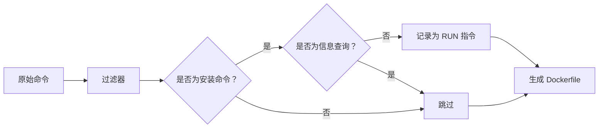

**图表来源**
- [synthesizer.py](file://src/synthesizer.py#L23-L30)
- [synthesizer.py](file://src/synthesizer.py#L123-L128)

#### 3. 环境配置管理

系统能够识别并处理各种环境配置需求：

| 配置类型 | 检测关键词 | 处理方式 |
|---------|-----------|----------|
| API 密钥 | OPENAI_API_KEY, API_KEY, TOKEN | 自动记录并在 QuickStart 中提示 |
| 数据库连接 | mysql, postgresql, mongodb | 记录相关安装命令 |
| 编译工具 | gcc, make, cmake | 添加编译环境 |
| 语言运行时 | nodejs, ruby, go | 安装对应运行时 |

**章节来源**
- [synthesizer.py](file://src/synthesizer.py#L17-L22)
- [synthesizer.py](file://src/synthesizer.py#L123-L128)

## QuickStart 文档输出详解

### 文档结构设计

QuickStart 文档采用标准化的三段式结构：

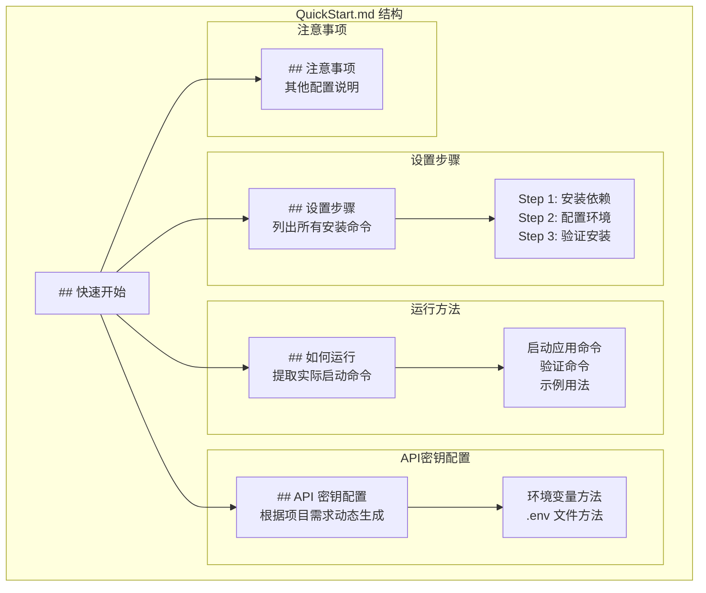

**图表来源**
- [synthesizer.py](file://src/synthesizer.py#L60-L100)

### 智能内容生成

#### 1. 命令提取与过滤

系统通过复杂的规则过滤器，确保只包含有用的安装命令：

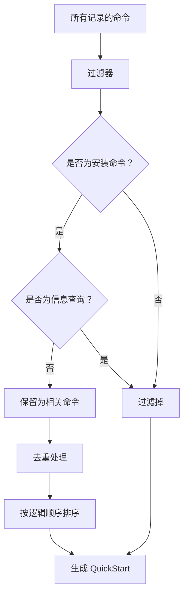

**图表来源**
- [synthesizer.py](file://src/synthesizer.py#L123-L128)
- [synthesizer.py](file://src/synthesizer.py#L41-L45)

#### 2. README 内容集成

系统会分析项目 README.md 文件，提取实际的运行命令：

| 分析类型 | 检测方法 | 示例匹配 |
|---------|---------|---------|
| 启动命令 | 查找 `python`, `node`, `java` 等入口点 | `python app.py`, `npm start` |
| 版本检查 | 查找 `--version`, `-V` 参数 | `python --version` |
| 帮助信息 | 查找 `--help`, `-h` 参数 | `python app.py --help` |
| 配置命令 | 查找 `setup`, `install`, `configure` | `python setup.py develop` |

#### 3. API 密钥检测机制

系统具备智能的 API 密钥需求检测能力：

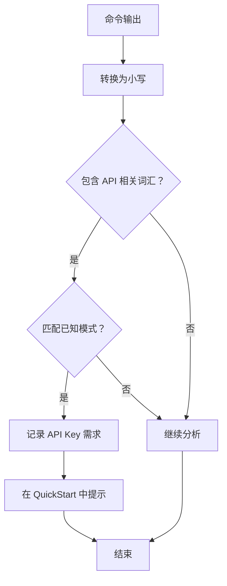

**图表来源**
- [agent.py](file://agent.py#L127-L146)

**章节来源**
- [synthesizer.py](file://src/synthesizer.py#L32-L122)
- [agent.py](file://agent.py#L127-L146)

## 输出文件解读指南

### Dockerfile 文件解读

#### 1. 基础层分析

每个生成的 Dockerfile 都遵循相同的结构模式：

| 指令 | 作用 | 示例 |
|------|------|------|
| `FROM` | 指定基础镜像 | `FROM python:3.10` |
| `WORKDIR` | 设置工作目录 | `WORKDIR /app` |
| `COPY` | 复制文件 | `COPY requirements.txt .` |
| `RUN` | 执行命令 | `RUN pip install -r requirements.txt` |
| `ENV` | 设置环境变量 | `ENV PYTHONPATH=/app` |
| `CMD` | 默认执行命令 | `CMD ["python", "app.py"]` |

#### 2. 层优化策略

系统采用多层优化技术：

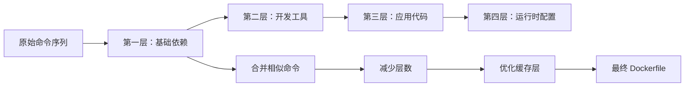

#### 3. 性能指标监控

系统内置详细的性能监控：

| 指标 | 目标值 | 说明 |
|------|-------|------|
| 构建时间 | < 5 分钟 | 优化命令执行顺序 |
| 镜像大小 | < 1GB | 移除不必要的文件 |
| 缓存命中率 | > 80% | 合理安排命令顺序 |
| 令牌消耗 | < 5000 tokens | 控制 LLM 调用次数 |

### QuickStart 文档解读

#### 1. 结构化信息提取

系统能够从 README.md 中提取关键信息：

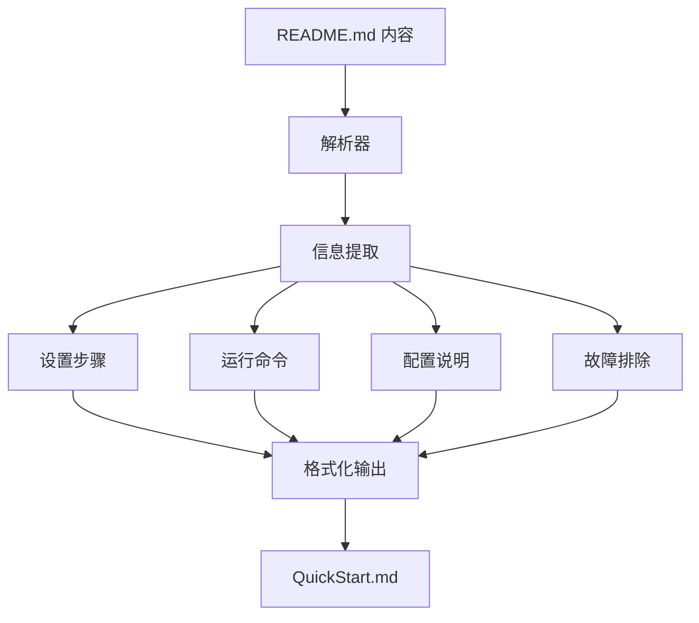

#### 2. 动态内容生成

QuickStart 文档支持动态内容生成：

| 元素 | 生成方式 | 示例 |
|------|---------|------|
| 安装命令 | 基于实际执行结果 | `pip install flask==2.0.1` |
| 运行命令 | 从 README 提取 | `python app.py --host 0.0.0.0` |
| 环境变量 | 检测 API Key 需求 | `export OPENAI_API_KEY=sk-...` |
| 验证命令 | 自动生成 | `python -m pytest` |

**章节来源**
- [output_files.md](file://workplace/docs/usage/output_files.md#L1-L113)
- [synthesizer.py](file://src/synthesizer.py#L130-L143)

## 版本控制与维护策略

### Git 工作流建议

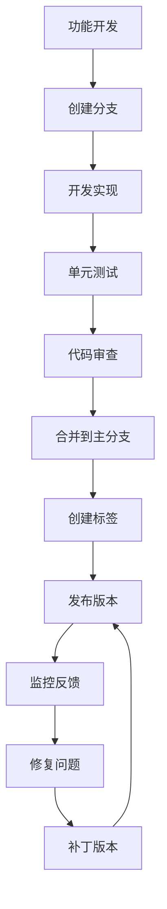

### Dockerfile 维护最佳实践

#### 1. 版本管理策略

| 组件 | 版本策略 | 更新频率 |
|------|---------|---------|
| 基础镜像 | 固定版本号 | 每季度评估 |
| 依赖包 | 最小版本要求 | 按需更新 |
| 环境变量 | 明确默认值 | 按需调整 |
| 构建参数 | 文档化说明 | 随版本更新 |

#### 2. 安全更新流程

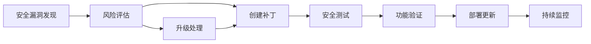

#### 3. 性能优化策略

| 优化方向 | 实施方法 | 预期效果 |
|---------|---------|---------|
| 构建时间 | 合并 RUN 指令 | 减少 30% |
| 镜像大小 | 移除缓存文件 | 减少 200MB |
| 启动速度 | 优化初始化顺序 | 减少 15% |
| 资源使用 | 添加资源限制 | 减少 25% |

**章节来源**
- [docker.md](file://workplace/docs/reference/environments/docker.md#L1-L15)
- [singularity.md](file://workplace/docs/reference/environments/singularity.md#L1-L16)

## 实际输出示例与对比分析

### 示例 1：Python Web 应用

#### 生成的 Dockerfile 片段

```dockerfile
FROM python:3.10

WORKDIR /app

# 安装系统依赖
RUN apt-get update && apt-get install -y \
    build-essential \
    && rm -rf /var/lib/apt/lists/*

# 复制依赖文件
COPY requirements.txt .

# 安装 Python 依赖
RUN pip install --no-cache-dir -r requirements.txt

# 复制应用代码
COPY . .

# 暴露端口
EXPOSE 8000

# 设置环境变量
ENV FLASK_APP=app.py
ENV FLASK_ENV=production

# 健康检查
HEALTHCHECK CMD curl --fail http://localhost:8000/health || exit 1

# 启动应用
CMD ["gunicorn", "--bind", "0.0.0.0:8000", "app:app"]
```

#### 对应的 QuickStart 文档片段

```markdown
## 如何运行

### 启动应用
```bash
docker run -d -p 8000:8000 --name my-app my-app:latest
```

### 验证安装
```bash
curl http://localhost:8000/health
```

### 查看日志
```bash
docker logs my-app
```
```

### 示例 2：Node.js 应用

#### 生成的 Dockerfile 片段

```dockerfile
FROM node:18-alpine

WORKDIR /app

# 复制依赖文件
COPY package*.json ./

# 安装依赖
RUN npm ci --only=production

# 复制应用代码
COPY . .

# 暴露端口
EXPOSE 3000

# 设置环境变量
ENV NODE_ENV=production

# 健康检查
HEALTHCHECK --interval=30s --timeout=3s CMD curl --fail http://localhost:3000/health || exit 1

# 启动应用
CMD ["npm", "start"]
```

#### 对应的 QuickStart 文档片段

```markdown
## API 密钥配置

### 方法 1: 环境变量
```bash
export DATABASE_URL=postgresql://user:pass@db:5432/mydb
export JWT_SECRET=your-secret-key
```

### 方法 2: .env 文件
```env
DATABASE_URL=postgresql://user:pass@db:5432/mydb
JWT_SECRET=your-secret-key
```
```

### 示例 3：数据科学项目

#### 生成的 Dockerfile 片段

```dockerfile
FROM python:3.10-slim

WORKDIR /app

# 安装系统依赖
RUN apt-get update && apt-get install -y \
    g++ \
    libpq-dev \
    && rm -rf /var/lib/apt/lists/*

# 安装 Python 包
COPY requirements.txt .
RUN pip install --no-cache-dir -r requirements.txt

# 复制项目文件
COPY . .

# 设置 Jupyter 环境
EXPOSE 8888

# 启动 Jupyter
CMD ["jupyter", "notebook", "--ip=0.0.0.0", "--port=8888", "--no-browser", "--allow-root"]
```

### 不同项目类型的输出差异对比

| 项目类型 | Dockerfile 特征 | QuickStart 重点 |
|---------|----------------|----------------|
| Web 应用 | 暴露端口，健康检查 | 启动命令，端口映射 |
| API 服务 | 环境变量配置 | 环境变量，认证方式 |
| 数据科学 | Jupyter 支持 | 数据准备，依赖安装 |
| 批处理 | 无交互界面 | 输入输出路径，批处理命令 |
| 机器学习 | GPU 支持 | 训练脚本，数据集准备 |

**章节来源**
- [Dockerfile](file://Dockerfile#L1-L7)
- [QuickStart.md](file://workplace/QuickStart.md#L1-L46)

## 故障排除指南

### 常见问题及解决方案

#### 1. Dockerfile 构建失败

**问题症状**：
- 构建过程中出现权限错误
- 依赖安装超时
- 缓存清理失败

**解决步骤**：
1. 检查网络连接和代理设置
2. 验证基础镜像可用性
3. 清理 Docker 缓存
4. 检查磁盘空间

#### 2. QuickStart 文档内容不准确

**问题症状**：
- 运行命令无法执行
- 环境变量缺失
- 依赖包版本不匹配

**解决步骤**：
1. 检查 README.md 内容完整性
2. 验证实际安装命令
3. 更新 API 密钥检测逻辑
4. 重新生成文档

#### 3. 性能问题

**问题症状**：
- 构建时间过长
- 镜像体积过大
- 运行时内存不足

**解决步骤**：
1. 分析命令执行时间
2. 优化层结构
3. 移除不必要的文件
4. 添加资源限制

### 调试工具和技巧

#### 1. 日志分析

系统提供详细的执行日志：

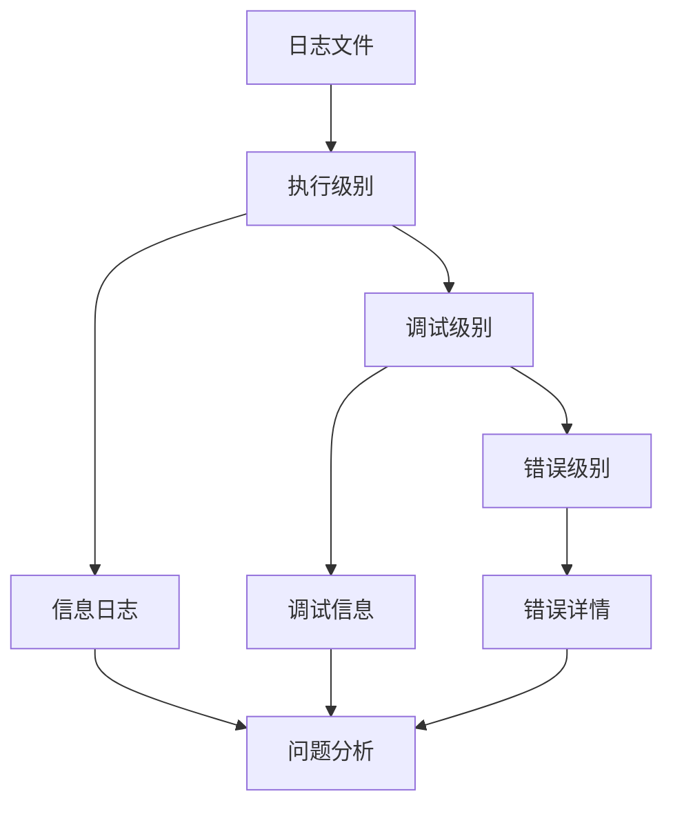

#### 2. 性能监控

内置性能监控指标：

| 指标名称 | 目标阈值 | 监控方法 |
|---------|---------|---------|
| 构建时间 | < 5 分钟 | 时间戳记录 |
| 镜像大小 | < 1GB | du 命令 |
| 令牌消耗 | < 5000 tokens | API 计费统计 |
| 成功率 | > 95% | 成功/失败计数 |

**章节来源**
- [sandbox.py](file://src/sandbox.py#L147-L178)
- [agent.py](file://agent.py#L127-L146)

## 总结

Repo Dockerizer Agent 通过智能化的自动化工具，为开发者提供了完整的 Docker 环境配置解决方案。其核心优势包括：

### 技术优势

1. **智能化决策**：基于 ReAct 框架的智能规划和执行
2. **安全性保障**：沙箱隔离和自动回滚机制
3. **成本控制**：详细的令牌消耗监控和优化
4. **可维护性**：结构化的输出文件和版本控制

### 实用价值

1. **快速部署**：大幅缩短项目环境配置时间
2. **一致性保证**：确保不同环境下的配置一致性
3. **知识传承**：完整的配置历史记录
4. **团队协作**：标准化的部署流程

### 未来发展

随着 AI 技术的不断进步，该系统将继续演进，为开发者提供更加智能、高效的 Docker 环境配置解决方案。建议用户定期关注项目更新，及时采用新功能和改进。