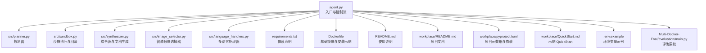
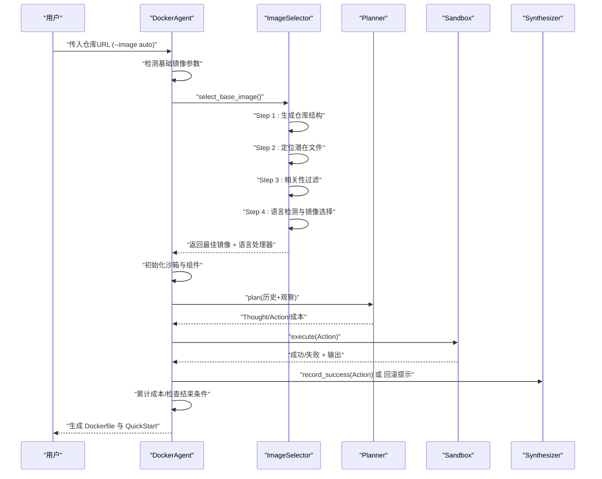
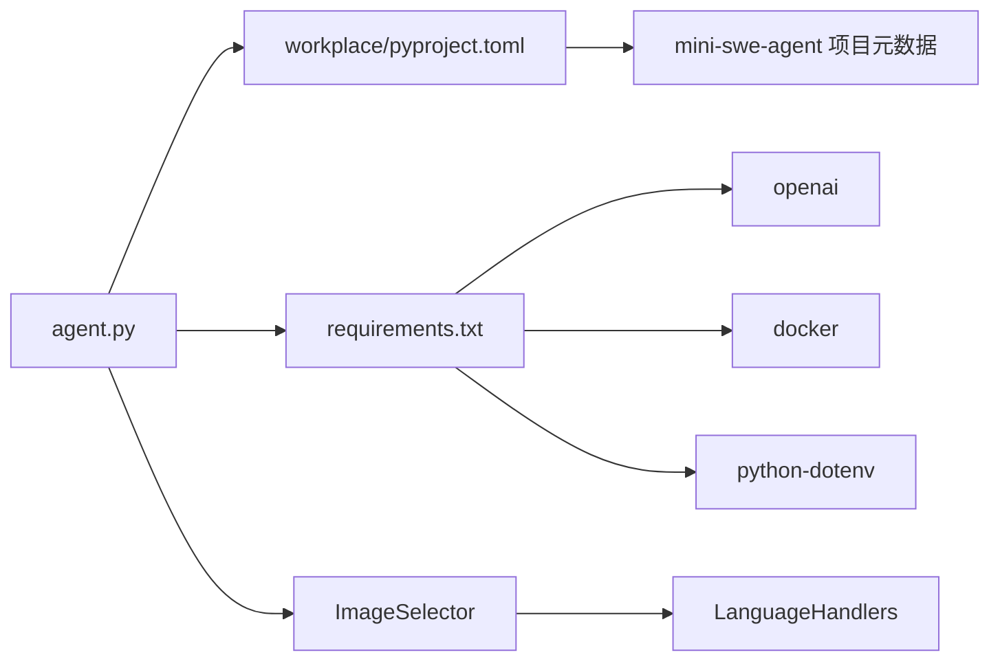
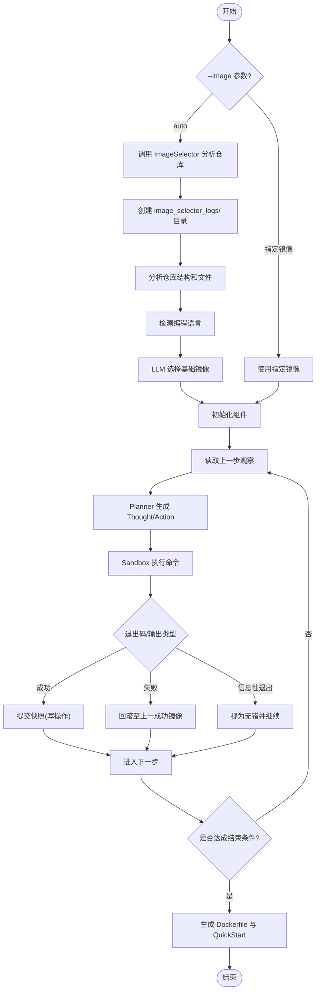

# 高级使用

<cite>
**本文引用的文件**
- [README.md](file://README.md)
- [agent.py](file://agent.py)
- [src/sandbox.py](file://src/sandbox.py)
- [src/planner.py](file://src/planner.py)
- [src/synthesizer.py](file://src/synthesizer.py)
- [src/image_selector.py](file://src/image_selector.py)
- [src/language_handlers.py](file://src/language_handlers.py)
- [requirements.txt](file://requirements.txt)
- [Dockerfile](file://Dockerfile)
- [.env.example](file://.env.example)
- [workplace/QuickStart.md](file://workplace/QuickStart.md)
- [workplace/README.md](file://workplace/README.md)
- [workplace/pyproject.toml](file://workplace/pyproject.toml)
- [workplace/src/minisweagent/config/default.yaml](file://workplace/src/minisweagent/config/default.yaml)
- [Others_work/RepoLaunch/launch/agent/setup/base_image.py](file://Others_work/RepoLaunch/launch/agent/setup/base_image.py)
- [Multi-Docker-Eval/evaluation/main.py](file://Multi-Docker-Eval/evaluation/main.py)
- [workplace/multi_docker_eval_Spomky-Labs__otphp-166/image_selector_logs/summary.json](file://workplace/multi_docker_eval_Spomky-Labs__otphp-166/image_selector_logs/summary.json)
- [workplace/multi_docker_eval_getlogbook__logbook-183/image_selector_logs/summary.json](file://workplace/multi_docker_eval_getlogbook__logbook-183/image_selector_logs/summary.json)
</cite>

## 更新摘要
**所做更改**
- 新增智能自动基础镜像选择功能章节，详细说明四步分析流程
- 更新DockerAgent组件说明，包含新的自动镜像检测逻辑
- 添加ImageSelector类的详细功能介绍，包括多语言支持和评估系统
- 更新使用案例，展示自动镜像选择的实际应用和评估结果
- 新增镜像选择日志和调试功能说明，包含详细的分析过程记录

## 目录
1. [简介](#简介)
2. [项目结构](#项目结构)
3. [核心组件](#核心组件)
4. [架构总览](#架构总览)
5. [详细组件解析](#详细组件解析)
6. [依赖关系分析](#依赖关系分析)
7. [性能与成本控制](#性能与成本控制)
8. [批量处理与脚本化](#批量处理与脚本化)
9. [调试模式与故障排除](#调试模式与故障排除)
10. [复杂项目处理策略](#复杂项目处理策略)
11. [使用案例与最佳实践](#使用案例与最佳实践)
12. [评估系统与质量控制](#评估系统与质量控制)
13. [结论](#结论)

## 简介
本指南面向希望深入掌握 Repo Dockerizer Agent 的高级用户，系统讲解自定义配置、模型参数调优、成本控制、批量处理、调试与故障排除、复杂项目策略以及最佳实践。该 Agent 基于 LLM 的 ReAct 思维链在沙箱容器内自动完成仓库环境配置，并生成可复现的 Dockerfile 与 QuickStart 文档。

**更新** 本版本新增了智能自动基础镜像选择功能，用户现在可以使用 `--image auto` 参数让系统自动分析仓库结构并推荐最佳基础镜像。同时引入了完整的评估系统，提供详细的镜像选择效果分析和质量控制指标。

## 项目结构
- 入口与运行
  - 命令入口位于根目录的主程序，负责解析参数、准备工作区、初始化 LLM 客户端、启动沙箱与 Planner/Synthesizer，并驱动 ReAct 循环。
- 核心模块
  - 沙箱模块：封装 Docker SDK，提供命令执行、回滚与快照管理。
  - 规划器模块：构造系统提示词与历史消息，调用 LLM 生成下一步 Thought/Action，并统计成本。
  - 综合器模块：记录成功指令，生成 Dockerfile 与 QuickStart 文档。
  - **智能镜像选择器模块**：基于四步分析流程的智能基础镜像推荐系统。
  - **评估系统模块**：Multi-Docker-Eval 提供完整的环境能力评估和质量控制。
- 工作区与依赖
  - 工作区 workplace 下包含项目文档、配置与示例 QuickStart，便于对照与二次开发。
  - 顶层 Dockerfile 展示了基础镜像与安装流程，可作为参考模板。



**图表来源**
- [agent.py](file://agent.py#L1-L317)
- [src/planner.py](file://src/planner.py#L1-L145)
- [src/sandbox.py](file://src/sandbox.py#L1-L178)
- [src/synthesizer.py](file://src/synthesizer.py#L1-L144)
- [src/image_selector.py](file://src/image_selector.py#L1-L506)
- [src/language_handlers.py](file://src/language_handlers.py#L1-L700)
- [requirements.txt](file://requirements.txt#L1-L4)
- [Dockerfile](file://Dockerfile#L1-L7)
- [README.md](file://README.md#L1-L71)
- [workplace/README.md](file://workplace/README.md#L1-L222)
- [workplace/pyproject.toml](file://workplace/pyproject.toml#L1-L282)
- [workplace/QuickStart.md](file://workplace/QuickStart.md#L1-L46)
- [.env.example](file://.env.example#L1-L1)
- [Multi-Docker-Eval/evaluation/main.py](file://Multi-Docker-Eval/evaluation/main.py#L1-L577)

**章节来源**
- [README.md](file://README.md#L1-L71)
- [agent.py](file://agent.py#L1-L317)

## 核心组件
- DockerAgent
  - 负责克隆仓库、挂载工作区、初始化 LLM 客户端、创建沙箱、驱动 ReAct 循环、记录成本、生成最终产物。
  - **新增** 支持自动基础镜像选择：当 `--image` 参数为 "auto" 时，系统会自动分析仓库结构并推荐最佳基础镜像。
- Planner
  - 维护对话历史，构造系统提示词，调用 LLM，解析 Thought/Action，计算单步与累计成本。
- Sandbox
  - 封装容器生命周期，执行命令，区分只读与写操作，按需提交快照，失败时回滚至上一成功镜像。
- Synthesizer
  - 记录成功指令，生成 Dockerfile；根据 README 与真实安装命令生成 QuickStart 文档；记录缺失的 API Key 提示。
- **新增** ImageSelector
  - 基于四步分析流程的智能镜像选择器，提供完整的仓库分析和镜像推荐。
  - 支持20+种编程语言的自动检测和候选镜像推荐。
  - 包含详细的日志记录和调试功能。
- **新增** 评估系统
  - Multi-Docker-Eval 提供完整的环境能力评估，包含详细的统计指标和质量报告。

**章节来源**
- [agent.py](file://agent.py#L17-L70)
- [src/planner.py](file://src/planner.py#L3-L145)
- [src/sandbox.py](file://src/sandbox.py#L4-L178)
- [src/synthesizer.py](file://src/synthesizer.py#L1-L144)
- [src/image_selector.py](file://src/image_selector.py#L117-L285)
- [Multi-Docker-Eval/evaluation/main.py](file://Multi-Docker-Eval/evaluation/main.py#L398-L448)

## 架构总览
ReAct 执行循环：Planner 生成 Action → Sandbox 执行并回滚/快照 → Synthesizer 记录成功指令 → 重复直至结束条件。

**更新** 自动镜像选择流程：当检测到 `--image auto` 时，DockerAgent 会调用 ImageSelector 分析仓库并返回最佳镜像，同时生成详细的分析日志。



**图表来源**
- [agent.py](file://agent.py#L36-L61)
- [src/image_selector.py](file://src/image_selector.py#L214-L285)
- [src/planner.py](file://src/planner.py#L69-L105)
- [src/sandbox.py](file://src/sandbox.py#L29-L91)
- [src/synthesizer.py](file://src/synthesizer.py#L9-L21)

## 详细组件解析

### DockerAgent
- 关键职责
  - 准备工作区并克隆仓库
  - 初始化 LLM 客户端（支持自定义 base_url）
  - **更新** 自动镜像选择：当 `base_image == "auto"` 时，调用 `select_base_image()` 分析仓库并返回最佳镜像
  - 创建沙箱并挂载工作区
  - 驱动 ReAct 循环，打印每步成本
  - 结束后生成 Dockerfile 与 QuickStart，并可选择保持容器运行
- 关键参数
  - --image：基础镜像，默认 "auto"（自动检测），也可指定如 "python:3.10"、"node:18"
  - --model：LLM 模型，默认 gpt-4o
  - --steps：最大步数，默认 30
  - --keep-container：完成后保持容器运行以便检查

**更新** 自动镜像选择流程：
1. 检测到 `--image auto` 或未指定时，系统自动分析仓库
2. 调用 `select_base_image()` 获取最佳镜像
3. 将镜像选择日志保存到 `workplace/image_selector_logs/` 目录
4. 使用选定的镜像初始化沙箱和组件

**章节来源**
- [agent.py](file://agent.py#L17-L70)
- [agent.py](file://agent.py#L306-L317)

### ImageSelector
- **新增** 基于四步分析流程的智能镜像选择器
- 分析步骤
  1. **仓库结构分析**：生成完整文件树结构，跳过无关目录
  2. **文件定位**：使用 LLM 识别关键配置文件和依赖文件
  3. **相关性过滤**：判断文件是否与环境配置相关，避免无关文件干扰
  4. **语言检测与镜像选择**：LLM 推荐最佳基础镜像，包含重试机制
- **新增** 多语言支持
  - 支持20+种编程语言：Python、JavaScript/TypeScript、Rust、Go、Java、C#/C++/C、Ruby、PHP、Kotlin、Scala、R、Dart 等
  - 每种语言都有专门的候选镜像列表和检测规则
  - 支持语言提示参数优化镜像选择准确性
- **新增** 详细的日志记录
  - 自动生成 LLM 对话日志，格式兼容 RepoLaunch 示例
  - 保存结构分析和最终选择结果到 summary.json
  - 支持调试和审计需求

**章节来源**
- [src/image_selector.py](file://src/image_selector.py#L117-L285)
- [src/language_handlers.py](file://src/language_handlers.py#L637-L700)

### Planner
- 系统提示词与约束
  - 明确禁止构建/运行容器、系统服务等命令
  - 强制使用包管理器与语言运行时
  - 仅输出 Thought/Action，一次一步
- 成本计算
  - 基于模型定价表，计算单步输入/输出 token 成本与累计成本
- 历史维护
  - 首次加入仓库 URL，后续每次将观察追加为用户消息

**章节来源**
- [src/planner.py](file://src/planner.py#L43-L105)

### Sandbox
- 执行与回滚
  - 成功：若为写操作则提交快照，保留最近一次成功镜像
  - 失败：停止并删除容器，从上次成功镜像重启
- 信息性退出识别
  - 对 exit code 1/2 且输出包含帮助关键字的情况视为"信息性退出"，不计入错误
- 快照策略
  - 仅对会产生持久影响的命令进行 commit，避免镜像膨胀
- 清理
  - 关闭时清理快照镜像与悬空镜像

**章节来源**
- [src/sandbox.py](file://src/sandbox.py#L29-L178)

### Synthesizer
- 指令记录
  - 将成功命令转为 Dockerfile 的 RUN 指令
  - 区分安装/配置类命令，用于生成 QuickStart
- QuickStart 生成
  - 基于 README 与真实安装命令，生成简洁的 Setup/Run/API Key/Notes
- API Key 提示
  - 记录检测到的缺失密钥类型，辅助用户配置

**章节来源**
- [src/synthesizer.py](file://src/synthesizer.py#L9-L144)

## 依赖关系分析
- 运行时依赖
  - docker：容器执行与回滚
  - openai：LLM 接口
  - python-dotenv：加载 .env
- 顶层依赖声明与工作区项目元数据
  - requirements.txt 与 workplace/pyproject.toml 中的依赖差异体现了"运行时依赖"与"项目开发/打包依赖"的分离



**图表来源**
- [requirements.txt](file://requirements.txt#L1-L4)
- [workplace/pyproject.toml](file://workplace/pyproject.toml#L1-L282)
- [agent.py](file://agent.py#L1-L317)
- [src/image_selector.py](file://src/image_selector.py#L1-L506)
- [src/language_handlers.py](file://src/language_handlers.py#L1-L700)

**章节来源**
- [requirements.txt](file://requirements.txt#L1-L4)
- [workplace/pyproject.toml](file://workplace/pyproject.toml#L1-L282)

## 性能与成本控制
- 模型与温度
  - Planner 使用 temperature=0，确保确定性输出，减少不必要的 token 浪费
  - **新增** ImageSelector 使用 temperature=0 进行语言检测和镜像选择
- 步数限制
  - 通过 --steps 控制最大迭代次数，避免长尾消耗
- 成本监控
  - 每步打印输入/输出 token 与单步/累计成本，便于实时评估
- 快照与回滚
  - 仅对写操作提交快照，避免镜像堆积；失败自动回滚，减少无效尝试
- 信息性退出
  - 识别帮助/用法输出，避免将其计入失败，提升效率
- **新增** 镜像选择成本控制
  - ImageSelector 采用多步骤 LLM 推理，包含重试机制
  - 支持日志记录，便于分析和优化

**章节来源**
- [src/planner.py](file://src/planner.py#L85-L129)
- [src/sandbox.py](file://src/sandbox.py#L49-L91)
- [src/image_selector.py](file://src/image_selector.py#L175-L180)

## 批量处理与脚本化
- 单仓库运行
  - python agent.py <仓库URL> [--image/--model/--steps/--keep-container]
  - **更新** 默认使用 `--image auto`，让系统自动选择最佳镜像
- 批量策略
  - 在外部脚本中循环调用上述命令，结合 --steps 与 --keep-container 逐个处理
  - 使用日志与临时目录隔离不同仓库的输出
  - **新增** 自动镜像选择的日志会保存到 `workplace/image_selector_logs/` 目录
- 产出物
  - 每个仓库生成独立的 Dockerfile 与 QuickStart.md，便于统一归档与对比
  - **新增** 镜像选择过程的日志文件，便于审计和调试

**章节来源**
- [agent.py](file://agent.py#L306-L317)
- [workplace/QuickStart.md](file://workplace/QuickStart.md#L1-L46)

## 调试模式与故障排除
- 保持容器运行
  - 使用 --keep-container，在完成后容器仍运行，便于手动检查 /app 目录与中间状态
  - 参考输出中的容器 ID 与命令提示进行交互
- 查看中间结果
  - 每步输出包含 Thought/Action/Observation 与成本信息，定位失败点
  - **新增** 镜像选择日志：在 `workplace/image_selector_logs/` 目录下查看详细分析过程
  - 若出现 API Key 缺失，Synthesizer 会记录缺失的密钥类型，指导配置
- 常见问题
  - API Key 相关错误：Planner 与 Agent 会检测常见关键词并提示
  - 权限与 sudo：Planner 明确禁止使用 sudo，应改用包管理器安装
  - 信息性退出：帮助/用法输出会被识别为非错误，避免误判
  - **新增** 镜像选择失败：检查 `image_selector_logs/` 目录下的日志文件，分析 LLM 推理过程



**图表来源**
- [agent.py](file://agent.py#L36-L61)
- [src/sandbox.py](file://src/sandbox.py#L29-L134)
- [src/planner.py](file://src/planner.py#L69-L105)
- [agent.py](file://agent.py#L60-L126)

**章节来源**
- [agent.py](file://agent.py#L127-L147)
- [src/sandbox.py](file://src/sandbox.py#L147-L178)

## 复杂项目处理策略
- 多阶段构建
  - 本 Agent 不直接构建镜像，而是记录成功指令并生成 Dockerfile，可由使用者在生成的 Dockerfile 基础上扩展多阶段
- 依赖冲突
  - 优先使用包管理器安装，避免系统级工具与容器内环境冲突
  - 若 README 指定特定版本，遵循其要求；Synthesizer 会保留真实安装命令，便于溯源
- 性能优化
  - 合理设置 --steps，避免无意义的探索
  - 使用更低成本模型（如 gpt-4o-mini）进行初筛，再用更高精度模型精修
  - 仅在必要时保持容器运行，缩短调试时间
- **新增** 自动镜像选择优化
  - 对于大型仓库，考虑使用 `--image auto` 让系统自动选择最适合的镜像
  - 利用镜像选择日志分析仓库特征，优化后续运行参数
  - 支持语言提示参数，提高镜像选择准确性

**章节来源**
- [src/planner.py](file://src/planner.py#L59-L67)
- [src/synthesizer.py](file://src/synthesizer.py#L130-L144)
- [src/image_selector.py](file://src/image_selector.py#L256-L285)

## 使用案例与最佳实践

### 案例一：Python 项目
- 使用默认 `--image auto`，Agent 会自动分析仓库并选择合适的 Python 版本
- 系统会检查 `.python-version`、`pyproject.toml`、`setup.py` 等文件确定最佳镜像
- 若 README 需要 API Key，Agent 会记录缺失类型并在 QuickStart 中提供两种配置方式

### 案例二：JavaScript/TypeScript 项目
- 自动检测 `package.json` 和 `tsconfig.json` 文件
- 选择合适的 Node.js 版本（通常选择 LTS 版本）
- 支持多种包管理器（npm、yarn、pnpm）

### 案例三：多语言混合项目
- ImageSelector 会分析项目结构，优先选择主要语言的镜像
- 支持复杂的依赖关系和构建工具组合
- 提供详细的镜像选择日志，便于审计

### 最佳实践
- 在运行前准备好 .env，确保 OPENAI_API_KEY 等密钥有效
- 对于大型仓库，先缩小 --steps，确认关键依赖后再增加步数
- 使用 --keep-container 临时保留容器，快速验证安装与运行
- **新增** 使用 `--image auto` 让系统自动选择最佳镜像，减少手动配置
- **新增** 定期检查 `workplace/image_selector_logs/` 目录，分析镜像选择效果
- **新增** 对于特殊需求，可以使用语言提示参数优化镜像选择

**章节来源**
- [workplace/QuickStart.md](file://workplace/QuickStart.md#L28-L46)
- [workplace/pyproject.toml](file://workplace/pyproject.toml#L33-L48)
- [src/image_selector.py](file://src/image_selector.py#L256-L285)

## 评估系统与质量控制

### Multi-Docker-Eval 评估框架
**新增** Multi-Docker-Eval 提供了完整的环境能力评估系统，包含以下关键功能：

- **实例评估流程**
  - 支持补丁应用前后环境能力对比
  - 自动检测测试通过/失败状态
  - 详细的日志记录和错误追踪
- **质量指标统计**
  - f2p_instance：失败→通过（成功检测补丁）
  - p2p_instance：通过→通过（环境无差异）
  - f2f_instance：失败→失败（补丁无效）
  - p2f_instance：通过→失败（补丁破坏环境）
- **图像大小分析**
  - 自动记录和统计镜像大小信息
  - 提供平均大小和详细分布报告

### 评估报告结构
评估系统生成详细的 JSON 报告，包含：

```json
{
  "dataset_instances": 100,
  "provided_instances": 85,
  "summary": {
    "total_instances": 85,
    "failed_before_patch": 20,
    "passed_after_patch": 15,
    "details": {
      "f2p_instance": 12,
      "p2p_instance": 3,
      "f2f_instance": 5,
      "p2f_instance": 0,
      "resolved": 12,
      "stable": 3
    }
  },
  "instance_details": [...]
}
```

### 图像大小统计
系统还提供详细的镜像大小分析：

```json
{
  "timestamp": "2026-03-07T10:16:02.123456",
  "run_id": "2026-03-07_10-16-02",
  "total_images": 85,
  "average_size_bytes": 123456789,
  "average_size_mb": 117.74,
  "average_size_gb": 0.114,
  "images": {
    "python:3.9": {
      "size_bytes": 123456789,
      "size_mb": 117.74,
      "size_gb": 0.114
    }
  }
}
```

### 使用示例
```bash
# 运行评估系统
cd Multi-Docker-Eval
python -m evaluation.main

# 查看评估结果
cat eval_output/DockerAgent/final_report.json
cat eval_output/DockerAgent/image_sizes.json
```

**章节来源**
- [Multi-Docker-Eval/evaluation/main.py](file://Multi-Docker-Eval/evaluation/main.py#L398-L448)
- [Multi-Docker-Eval/evaluation/main.py](file://Multi-Docker-Eval/evaluation/main.py#L450-L495)

## 结论
Repo Dockerizer Agent 通过 ReAct 与沙箱回滚机制，实现了对任意 GitHub 仓库的自动化环境配置与可复现产物生成。**最新版本新增的智能自动基础镜像选择功能**进一步提升了系统的易用性和准确性，用户只需简单地使用 `--image auto` 参数，系统就会自动分析仓库结构并推荐最佳基础镜像。

**新增的评估系统**提供了完整的质量控制和性能分析能力，包括详细的统计指标、图像大小分析和质量报告，帮助用户全面评估镜像选择效果和环境配置质量。

通过合理设置模型与步数、利用成本监控与调试模式、遵循依赖与冲突处理策略、充分利用自动镜像选择功能，以及结合评估系统的质量控制，可在保证质量的同时显著降低运行成本与时间开销。建议在生产环境中结合批量脚本与产物归档，形成标准化流水线，并定期分析镜像选择日志和评估报告以持续优化系统性能。