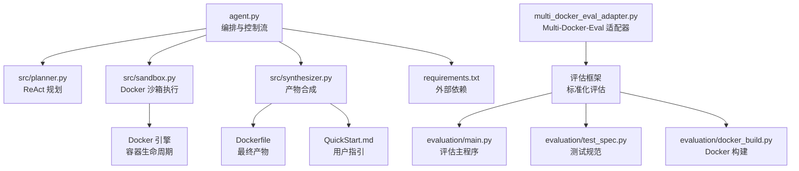
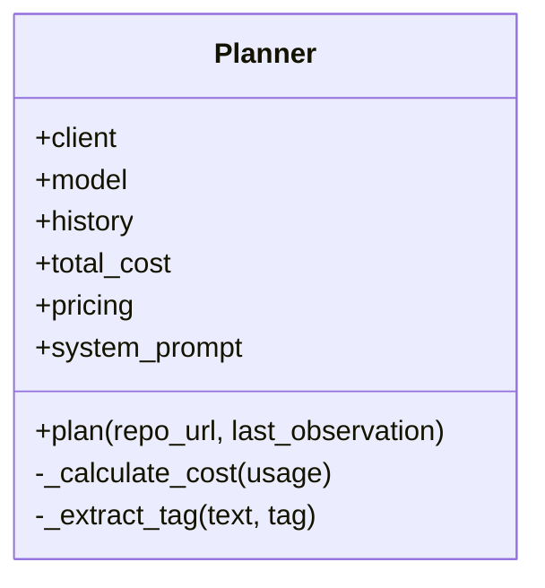
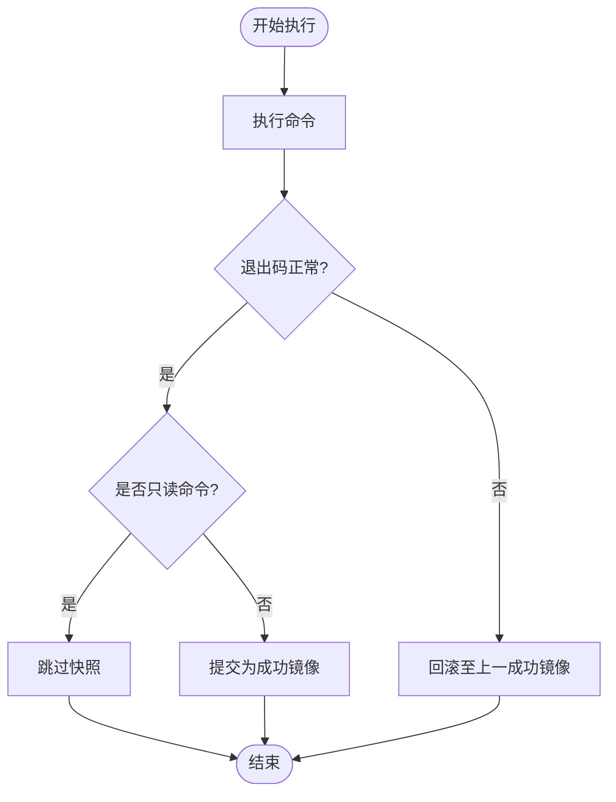
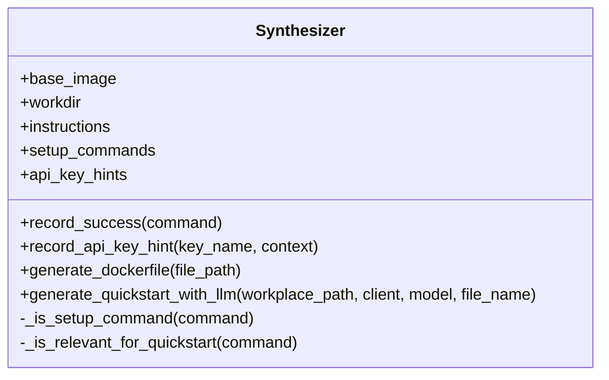
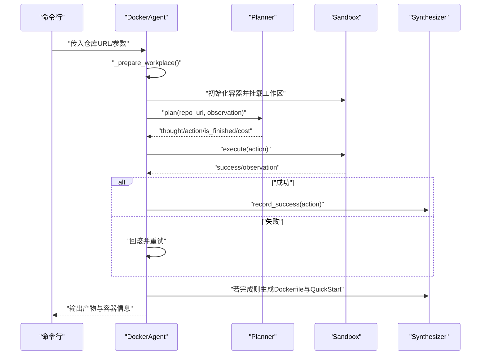
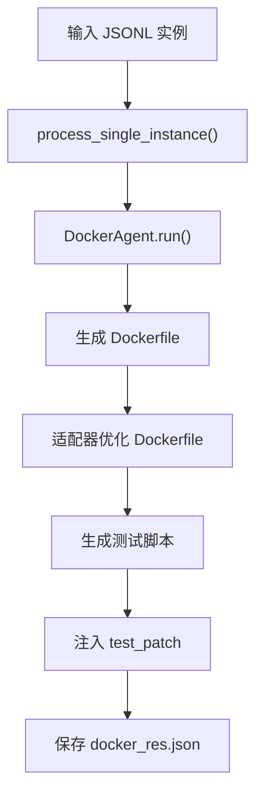
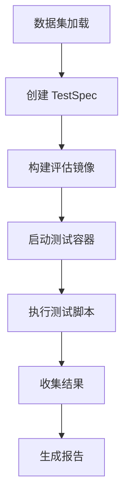
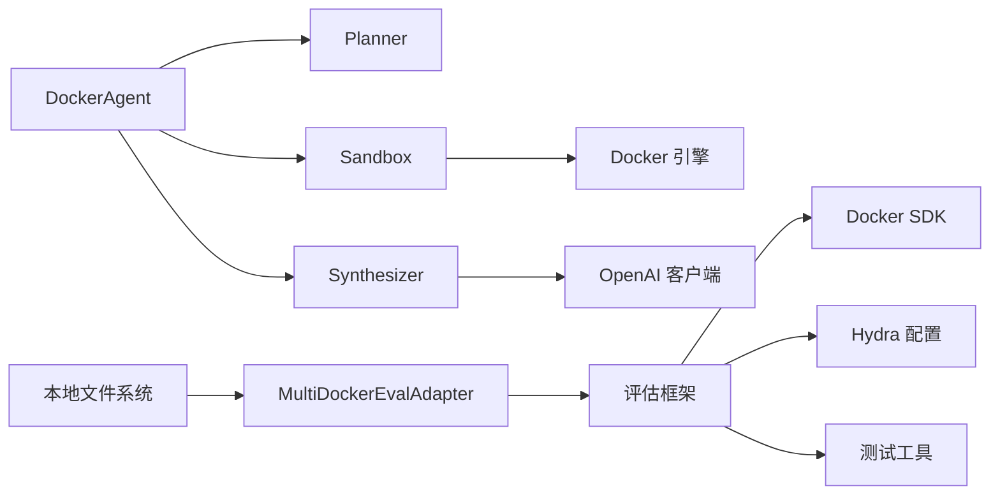

# 学术背景

<cite>
**本文引用的文件**
- [README.md](file://README.md)
- [agent.py](file://agent.py)
- [src/planner.py](file://src/planner.py)
- [src/sandbox.py](file://src/sandbox.py)
- [src/synthesizer.py](file://src/synthesizer.py)
- [doc/运行示例.md](file://doc/运行示例.md)
- [requirements.txt](file://requirements.txt)
- [workplace/src/minisweagent/environments/docker.py](file://workplace/src/minisweagent/environments/docker.py)
- [workplace/src/minisweagent/config/default.yaml](file://workplace/src/minisweagent/config/default.yaml)
- [doc/2509.23586v1.pdf](file://doc/2509.23586v1.pdf)
- [doc/DEP_RAG_ASE_2025.pdf](file://doc/DEP_RAG_ASE_2025.pdf)
- [doc/multi-docker-eval.pdf](file://doc/multi-docker-eval.pdf)
- [Multi-Docker-Eval/README.md](file://Multi-Docker-Eval/README.md)
- [doc/MULTI_DOCKER_EVAL.md](file://doc/MULTI_DOCKER_EVAL.md)
- [multi_docker_eval_adapter.py](file://multi_docker_eval_adapter.py)
- [Multi-Docker-Eval/evaluation/main.py](file://Multi-Docker-Eval/evaluation/main.py)
- [Multi-Docker-Eval/evaluation/test_spec.py](file://Multi-Docker-Eval/evaluation/test_spec.py)
- [Multi-Docker-Eval/evaluation/docker_build.py](file://Multi-Docker-Eval/evaluation/docker_build.py)
- [Multi-Docker-Eval/evaluation/conf/config.yaml](file://Multi-Docker-Eval/evaluation/conf/config.yaml)
- [eval_output/DockerAgent/final_report.json](file://eval_output/DockerAgent/final_report.json)
- [eval_output/DockerAgent/getlogbook__logbook-183/combined_report.json](file://eval_output/DockerAgent/getlogbook__logbook-183/combined_report.json)
- [multi_docker_eval_output/docker_res.json](file://multi_docker_eval_output/docker_res.json)
- [Multi-Docker-Eval/data_collection/get_dataset.py](file://Multi-Docker-Eval/data_collection/get_dataset.py)
- [Multi-Docker-Eval/scripts/RepoLaunch/gen_docker_res.py](file://Multi-Docker-Eval/scripts/RepoLaunch/gen_docker_res.py)
- [Multi-Docker-Eval/scripts/swe-builder/gen_docker_res.py](file://Multi-Docker-Eval/scripts/swe-builder/gen_docker_res.py)
- [task.jsonl](file://task.jsonl)
- [single.jsonl](file://single.jsonl)
</cite>

## 更新摘要
**所做更改**
- 新增 Multi-Docker-Eval 评估框架的完整学术背景
- 添加多容器评估与比较的标准化评估指标
- 扩展评估框架的输入输出格式和测试规范
- 增加 Fail-to-Pass (F2P) 指标和稳定性测试机制
- 补充多语言支持和测试脚本生成策略
- 增强学术背景描述，包括新的 Multi-Docker-Eval 评估框架分析

## 目录
1. [引言](#引言)
2. [项目结构](#项目结构)
3. [核心组件](#核心组件)
4. [架构总览](#架构总览)
5. [详细组件分析](#详细组件分析)
6. [Multi-Docker-Eval 评估框架](#multi-docker-eval-评估框架)
7. [依赖关系分析](#依赖关系分析)
8. [性能考量](#性能考量)
9. [故障排查指南](#故障排查指南)
10. [结论](#结论)
11. [附录](#附录)

## 引言
本文件面向 Repo Dockerizer Agent 的学术背景与技术演进，系统梳理其在自动化容器化环境配置方面的理论基础与实现路径。项目以大型语言模型（LLM）为核心驱动，结合思维-行动-观察（ReAct）范式、沙箱执行与回滚机制、以及最终产物合成（Dockerfile 与用户指引）等模块，形成一套可复现、可观测、可评估的自动化流水线。

**更新** 新增 Multi-Docker-Eval 评估框架的学术背景，该框架提供了标准化的多容器评估与比较机制，包括 Fail-to-Pass (F2P) 指标、稳定性测试和多语言支持等功能。Multi-Docker-Eval 评估框架的引入进一步增强了项目的学术价值和实用性，提供标准化的多容器评估解决方案，包括 Fail-to-Pass 指标、稳定性测试和多语言支持，为 LLM 驱动的环境配置提供权威的评估基准。

本文同时对相关研究工作 DEP_RAG_ASE_2025、multi-docker-eval 与 2509.23586v1 的理论与方法进行对比阐释，帮助读者理解该方向的前沿进展与项目自身的创新点。

## 项目结构
Repo Dockerizer Agent 采用"代理-规划器-沙箱-合成器"的分层设计，配合本地工作区克隆与 Docker 执行环境，形成闭环的自动化流程。核心文件与职责如下：

**更新** 新增 Multi-Docker-Eval 评估框架的相关组件和适配器。

- 入口与编排：agent.py 负责初始化工作区、构建 LLM 客户端、装配 Planner/Sandbox/Synthesizer 并驱动 ReAct 循环。
- 规划与对话：src/planner.py 提供系统提示词与 ReAct 格式化输出解析，负责生成下一步"思考-行动"。
- 执行与回滚：src/sandbox.py 封装 Docker SDK，提供命令执行、成功态提交与失败态回滚，保障环境一致性。
- 文档与产物合成：src/synthesizer.py 记录成功指令、生成 Dockerfile 与 QuickStart 文档。
- Multi-Docker-Eval 适配器：multi_docker_eval_adapter.py 将 DockerAgent 输出转换为 Multi-Docker-Eval 评估格式。
- 评估框架：Multi-Docker-Eval/evaluation/ 目录包含完整的评估基础设施，包括测试规范、Docker 构建和评估逻辑。
- 示例与运行：doc/运行示例.md 展示典型交互与输出，便于理解 ReAct 步骤与最终产物。
- 外部依赖：requirements.txt 明确 docker、openai、python-dotenv 等依赖。



**图表来源**
- [agent.py](file://agent.py#L14-L39)
- [src/planner.py](file://src/planner.py#L43-L67)
- [src/sandbox.py](file://src/sandbox.py#L4-L28)
- [src/synthesizer.py](file://src/synthesizer.py#L1-L22)
- [requirements.txt](file://requirements.txt#L1-L4)
- [multi_docker_eval_adapter.py](file://multi_docker_eval_adapter.py#L1-L40)
- [Multi-Docker-Eval/evaluation/main.py](file://Multi-Docker-Eval/evaluation/main.py#L1-L50)
- [Multi-Docker-Eval/evaluation/test_spec.py](file://Multi-Docker-Eval/evaluation/test_spec.py#L1-L30)
- [Multi-Docker-Eval/evaluation/docker_build.py](file://Multi-Docker-Eval/evaluation/docker_build.py#L1-L50)

**章节来源**
- [README.md](file://README.md#L1-L47)
- [agent.py](file://agent.py#L14-L39)
- [doc/运行示例.md](file://doc/运行示例.md#L1-L20)
- [multi_docker_eval_adapter.py](file://multi_docker_eval_adapter.py#L1-L40)
- [Multi-Docker-Eval/README.md](file://Multi-Docker-Eval/README.md#L1-L40)

## 核心组件
- 规划器（Planner）：以 ReAct 格式生成"思考-行动"，内置系统提示词与历史对话管理；支持按模型计费统计与输出解析。
- 沙箱（Sandbox）：基于 Docker SDK 在容器内执行命令，具备"成功即提交快照、失败即回滚至上一成功态"的容错机制；区分只读与写入命令，减少无意义镜像层增长。
- 合成器（Synthesizer）：记录成功指令并生成 Dockerfile；基于 README 与真实安装步骤生成简洁的 QuickStart 文档；识别潜在 API Key 需求并给出配置建议。
- 代理（DockerAgent）：串联上述组件，驱动 ReAct 循环，处理成本统计、API Key 检测与最终产物落盘。
- Multi-Docker-Eval 适配器：将 DockerAgent 的输出转换为 Multi-Docker-Eval 评估框架所需的 docker_res 格式，包括 Dockerfile、测试脚本和评估指标。

**更新** 新增 Multi-Docker-Eval 评估框架的核心组件，包括测试规范、Docker 构建和评估逻辑。

- 评估主程序：Multi-Docker-Eval/evaluation/main.py，负责协调整个评估流程，包括并行执行、结果汇总和报告生成。
- 测试规范：Multi-Docker-Eval/evaluation/test_spec.py，定义了 TestSpec 数据结构，封装了评估所需的各项参数。
- Docker 构建：Multi-Docker-Eval/evaluation/docker_build.py，提供 Docker 镜像构建、容器管理和日志记录功能。

**章节来源**
- [src/planner.py](file://src/planner.py#L3-L145)
- [src/sandbox.py](file://src/sandbox.py#L4-L178)
- [src/synthesizer.py](file://src/synthesizer.py#L1-L144)
- [agent.py](file://agent.py#L60-L126)
- [multi_docker_eval_adapter.py](file://multi_docker_eval_adapter.py#L39-L188)
- [Multi-Docker-Eval/evaluation/main.py](file://Multi-Docker-Eval/evaluation/main.py#L1-L100)
- [Multi-Docker-Eval/evaluation/test_spec.py](file://Multi-Docker-Eval/evaluation/test_spec.py#L12-L73)
- [Multi-Docker-Eval/evaluation/docker_build.py](file://Multi-Docker-Eval/evaluation/docker_build.py#L53-L200)

## 架构总览
下图展示从仓库克隆到最终产物生成的端到端流程，强调 ReAct 循环、沙箱执行与产物合成的关键节点。

**更新** 新增 Multi-Docker-Eval 评估框架的架构视图，展示从 Agent 输出到官方评估的完整流程。

```mermaid
sequenceDiagram
participant U as "用户"
participant AG as "DockerAgent"
participant PL as "Planner"
participant SB as "Sandbox"
participant SY as "Synthesizer"
U->>AG : "启动并传入仓库URL"
AG->>AG : "准备工作区并克隆仓库"
AG->>SB : "挂载工作区至容器"
AG->>PL : "请求下一步规划(Thought/Action)"
PL-->>AG : "返回思考与行动"
AG->>SB : "执行Action命令"
SB-->>AG : "返回执行结果(成功/失败)"
alt "成功"
AG->>SY : "记录成功指令"
else "失败"
AG->>SB : "回滚至上一成功态"
end
AG->>PL : "携带观测继续循环"
AG->>SY : "若完成则生成Dockerfile与QuickStart"
AG-->>U : "输出产物与容器信息"
Note over AG,U : Multi-Docker-Eval 评估流程
U->>MA as "MultiDockerEvalAdapter"
MA->>AG : "process_single_instance()"
AG-->>MA : "docker_res 格式结果"
MA-->>U : "保存评估结果"
U->>EV as "评估框架"
EV->>EV : "run_instances() 并行评估"
EV-->>U : "生成最终报告"
```

**图表来源**
- [agent.py](file://agent.py#L60-L126)
- [src/planner.py](file://src/planner.py#L69-L105)
- [src/sandbox.py](file://src/sandbox.py#L29-L91)
- [src/synthesizer.py](file://src/synthesizer.py#L9-L22)
- [multi_docker_eval_adapter.py](file://multi_docker_eval_adapter.py#L46-L188)
- [Multi-Docker-Eval/evaluation/main.py](file://Multi-Docker-Eval/evaluation/main.py#L328-L396)

**章节来源**
- [agent.py](file://agent.py#L60-L126)
- [multi_docker_eval_adapter.py](file://multi_docker_eval_adapter.py#L29-L188)
- [Multi-Docker-Eval/evaluation/main.py](file://Multi-Docker-Eval/evaluation/main.py#L328-L396)

## 详细组件分析

### 组件A：规划器（Planner）
- 设计要点
  - ReAct 输出规范：强制"Thought/Action/Observation"格式，首步注入仓库 URL，后续步将上一步观测作为用户输入，形成自适应对话历史。
  - 成本计量：依据模型定价表与 API usage 统计输入/输出/总计 Token 数，累加单步与累计成本，便于资源预算与实验成本控制。
  - 解析策略：通过正则提取 Thought 与 Action，剥离代码块标记与行内反引号，保证后续执行的命令字符串纯净。
- 关键接口与行为
  - plan(repo_url, last_observation)：构造消息列表，调用 LLM，解析内容，更新历史，返回下一步思考、行动、是否结束与成本信息。
  - _calculate_cost(usage)：按模型单价计算美元成本，维护 total_cost。
  - _extract_tag(text, tag)：提取 Thought/Action 字段，去除多余标记。
- 与 ReAct 的关系
  - 严格遵循 ReAct 思维链范式，将复杂环境配置任务分解为可执行的 Bash 命令序列，降低 LLM 的执行歧义。



**图表来源**
- [src/planner.py](file://src/planner.py#L3-L145)

**章节来源**
- [src/planner.py](file://src/planner.py#L43-L105)

### 组件B：沙箱（Sandbox）
- 设计要点
  - 容器初始化：以指定 base_image 启动交互式 bash 容器，绑定工作目录与宿主工作区，确保文件可见性。
  - 执行与回滚：执行命令后根据退出码与输出特征判断"信息性退出"（如显示帮助），仅对有副作用的命令进行 commit 快照；失败时回滚至上一成功镜像，重建容器。
  - 镜像清理：清理旧成功镜像与悬空镜像，避免磁盘膨胀；支持 keep-alive 以便人工检查。
- 关键接口与行为
  - execute(command)：执行 Bash 命令，返回成功与否与输出；内部区分只读与写入命令，决定是否 commit。
  - _should_commit(command)：基于命令首词白名单判定是否需要持久化。
  - _is_informational_exit(exit_code, output)：帮助识别非错误的退出（如 --help）。
  - close(keep_alive)：容器生命周期管理与镜像清理。
- 与传统容器化工具的关系
  - 与 minisweagent 的 DockerEnvironment 类似，均通过 Docker 执行命令；但本项目侧重"边执行边回滚"的探索式配置，而 minisweagent 更偏向"一次性执行+提交"的任务执行模式。



**图表来源**
- [src/sandbox.py](file://src/sandbox.py#L29-L91)

**章节来源**
- [src/sandbox.py](file://src/sandbox.py#L4-L178)
- [workplace/src/minisweagent/environments/docker.py](file://workplace/src/minisweagent/environments/docker.py#L45-L100)

### 组件C：合成器（Synthesizer）
- 设计要点
  - 指令记录：将成功执行的 Bash 命令转化为 Dockerfile 的 RUN 指令序列，保留可复现实验轨迹。
  - QuickStart 生成：基于 README 与真实安装步骤，生成简洁的"安装-运行-密钥配置-备注"四段式文档，避免冗余与重复。
  - API Key 检测：从命令输出中识别常见密钥缺失模式，记录所需变量名与上下文，辅助用户正确配置。
- 关键接口与行为
  - record_success(command)：记录成功指令并归档用于 QuickStart 的安装类命令。
  - record_api_key_hint(key_name, context)：记录密钥需求。
  - generate_dockerfile(file_path)：输出最终 Dockerfile。
  - generate_quickstart_with_llm(workplace_path, client, model, file_name)：调用 LLM 生成 QuickStart.md。
- 与文档工程的关系
  - 与 minisweagent 的模板化配置（default.yaml）不同，本项目更强调"从真实执行中抽取证据"的归纳式文档生成。



**图表来源**
- [src/synthesizer.py](file://src/synthesizer.py#L1-L144)

**章节来源**
- [src/synthesizer.py](file://src/synthesizer.py#L9-L144)
- [workplace/src/minisweagent/config/default.yaml](file://workplace/src/minisweagent/config/default.yaml#L1-L167)

### 组件D：代理（DockerAgent）
- 设计要点
  - 工作区准备：删除旧工作区、创建新目录并克隆目标仓库，确保容器内可访问。
  - LLM 客户端初始化：从环境变量加载 API Key 与可选 Base URL，支持多模型切换。
  - ReAct 循环：打印每步成本，解析 Planner 输出，执行 Sandbox，记录成功指令，检测 API Key 缺失，最终生成 Dockerfile 与 QuickStart。
  - 结果判定：当 Planner 输出包含"Final Answer: Success"时，认为配置成功。
- 关键接口与行为
  - run(max_steps, keep_container)：主控制流。
  - _detect_api_key_issues(observation)：基于关键词匹配识别密钥需求。
  - close 生命周期收尾与容器/镜像清理。



**图表来源**
- [agent.py](file://agent.py#L60-L126)
- [src/planner.py](file://src/planner.py#L69-L105)
- [src/sandbox.py](file://src/sandbox.py#L29-L91)
- [src/synthesizer.py](file://src/synthesizer.py#L130-L144)

**章节来源**
- [agent.py](file://agent.py#L14-L126)

### 组件E：Multi-Docker-Eval 适配器
- 设计要点
  - 格式转换：将 DockerAgent 的输出转换为 Multi-Docker-Eval 评估框架所需的 docker_res 格式。
  - Dockerfile 优化：为评估框架调整 WORKDIR 路径，替换 /app 为 /testbed，并插入 git clone 和 checkout 命令。
  - 测试脚本生成：根据语言类型生成相应的测试命令，优先执行 test_patch 中新增的测试函数。
  - 多语言支持：根据编程语言自动选择合适的基础镜像，支持 Python、JavaScript、Java、Go、Rust 等多种语言。
- 关键接口与行为
  - process_single_instance(instance, base_image, model, max_steps)：处理单个评估实例，返回 docker_res 格式结果。
  - _generate_test_script(workplace, language, problem_statement, test_patch, dockerfile_content)：生成测试脚本并注入 test_patch。
  - _select_base_image(language, default)：根据语言选择基础镜像。
  - process_dataset(dataset_path, base_image, model, max_steps, limit)：批量处理数据集并生成汇总结果。

**更新** 新增 Multi-Docker-Eval 适配器的详细分析，这是连接 Repo Dockerizer Agent 与官方评估框架的关键组件。



**图表来源**
- [multi_docker_eval_adapter.py](file://multi_docker_eval_adapter.py#L46-L188)

**章节来源**
- [multi_docker_eval_adapter.py](file://multi_docker_eval_adapter.py#L39-L440)

## Multi-Docker-Eval 评估框架

### 框架概述
Multi-Docker-Eval 是一个全面的多语言、多维度基准测试，旨在严格评估基于大型语言模型（LLM）的智能体在自动化构建可执行 Docker 环境方面的综合能力。该框架解决了自动为真实世界软件仓库生成能够成功构建和运行的 Docker 配置这一关键挑战，这对于现代软件开发和部署工作流程至关重要。

**更新** Multi-Docker-Eval 评估框架的引入进一步增强了项目的学术价值和实用性，提供标准化的多容器评估解决方案，包括 Fail-to-Pass 指标、稳定性测试和多语言支持，为 LLM 驱动的环境配置提供权威的评估基准。

### 核心特性
- **多语言支持**：涵盖 Python、JavaScript、Java、Go、Rust、Ruby、PHP 等主要编程语言
- **真实仓库**：基于实际 GitHub 仓库，具有多样化的依赖结构
- **综合评估**：测试构建成功性和运行时功能性
- **框架兼容性**：兼容 SWE-Builder 和 RepoLaunch 框架
- **标准化指标**：提供统一的评估指标和报告格式

### 项目结构
Multi-Docker-Eval 评估框架采用模块化设计，包含以下核心组件：

```
Multi-Docker-Eval/
├── data_collection/     # 数据收集和预处理管道
├── evaluation/          # 评估框架和测试基础设施
├── scripts/            # 格式转换工具脚本
└── README.md           # 项目说明文档
```

### 评估流程
评估框架的工作流程包括数据准备、环境构建、测试执行和结果分析四个主要阶段：



**图表来源**
- [Multi-Docker-Eval/evaluation/main.py](file://Multi-Docker-Eval/evaluation/main.py#L328-L396)
- [Multi-Docker-Eval/evaluation/docker_build.py](file://Multi-Docker-Eval/evaluation/docker_build.py#L202-L236)

### 标准化评估指标
Multi-Docker-Eval 评估框架定义了以下关键评估指标：

1. **Fail-to-Pass (F2P)**：测试从失败到通过的成功率
2. **Build Success Rate**：Docker 镜像构建成功率
3. **Commit Rate**：平均每个任务的 commit 次数
4. **Time Efficiency**：平均完成时间

**更新** 增加了 Fail-to-Pass (F2P) 指标和稳定性测试机制，这是 Multi-Docker-Eval 评估框架的核心创新点之一。

### Fail-to-Pass (F2P) 指标详解
Fail-to-Pass (F2P) 指标是 Multi-Docker-Eval 评估框架的核心创新，用于衡量环境从失败状态修复到通过状态的能力。该指标通过以下方式计算：

- **F2P Instance**：实例在应用补丁后从失败变为通过的数量
- **Bug Fail Rate**：在稳定性测试中，实例在应用补丁前失败的比例
- **Fix Pass Rate**：在稳定性测试中，实例在应用补丁后通过的比例
- **Resolved**：实例在应用补丁前后状态发生改变（失败→通过）
- **Stable**：实例在多次稳定性测试中表现一致（所有测试都失败或所有测试都通过）

### 稳定性测试机制
评估框架通过 `stability_runs` 参数控制稳定性测试次数，默认为 3 次。稳定性测试机制包括：

- **多次运行**：对每个实例进行多次测试，确保结果的可靠性
- **状态监控**：跟踪实例在应用补丁前后的状态变化
- **一致性评估**：只有在多次测试中表现一致的情况下才被视为稳定
- **错误处理**：即使部分测试失败，也会记录详细的错误信息

### 测试规范
评估框架通过 TestSpec 数据结构定义了测试规范，包含以下关键字段：

- `instance_id`：实例标识符
- `repo`：仓库名称
- `dockerfile`：Dockerfile 内容
- `eval_script`：评估脚本
- `setup_scripts`：设置脚本字典
- `patch`：参考补丁
- `test_patch`：测试补丁

### 并行执行与性能优化
评估框架支持并行执行多个实例，通过 `max_workers` 参数控制并发度。同时，框架实现了多项性能优化：

- **并行处理**：使用 ThreadPoolExecutor 并行执行多个实例
- **资源管理**：自动清理容器和镜像，避免资源泄漏
- **超时控制**：支持构建超时和测试超时配置
- **进度监控**：使用 tqdm 提供实时进度显示

**更新** 增加了稳定性测试机制，通过 `stability_runs` 参数控制测试次数，默认为 3 次，确保评估结果的可靠性。

**章节来源**
- [Multi-Docker-Eval/README.md](file://Multi-Docker-Eval/README.md#L19-L31)
- [Multi-Docker-Eval/evaluation/test_spec.py](file://Multi-Docker-Eval/evaluation/test_spec.py#L12-L73)
- [Multi-Docker-Eval/evaluation/conf/config.yaml](file://Multi-Docker-Eval/evaluation/conf/config.yaml#L6-L13)
- [Multi-Docker-Eval/evaluation/main.py](file://Multi-Docker-Eval/evaluation/main.py#L264-L326)

## 依赖关系分析
- 组件耦合
  - DockerAgent 对 Planner/Sandbox/Synthesizer 具备强依赖，形成清晰的控制流；Planner 与 Synthesizer 之间无直接耦合，通过字符串输出与记录间接协作。
  - Sandbox 与 Docker 引擎强耦合，依赖 docker SDK；Synthesizer 与 LLM 客户端弱耦合，仅在生成 QuickStart 时调用。
  - Multi-Docker-Eval 适配器依赖 DockerAgent，同时与评估框架的各个组件紧密集成。
- 外部依赖
  - requirements.txt 明确 docker、openai、python-dotenv；运行示例展示了实际交互与产物生成过程。
  - 评估框架依赖 Docker SDK、Hydra 配置系统和各种测试工具。
- 与 minisweagent 的差异
  - 两者均使用 Docker 执行命令，但 Repo Dockerizer Agent 更强调"探索-回滚-收敛"的 ReAct 流程，minisweagent 更偏向"一次性执行+提交"的任务执行模式。

**更新** 新增 Multi-Docker-Eval 评估框架的依赖关系分析，包括并行执行和稳定性测试机制。



**图表来源**
- [agent.py](file://agent.py#L14-L39)
- [requirements.txt](file://requirements.txt#L1-L4)
- [multi_docker_eval_adapter.py](file://multi_docker_eval_adapter.py#L36-L36)
- [Multi-Docker-Eval/evaluation/main.py](file://Multi-Docker-Eval/evaluation/main.py#L1-L29)

**章节来源**
- [requirements.txt](file://requirements.txt#L1-L4)
- [workplace/src/minisweagent/environments/docker.py](file://workplace/src/minisweagent/environments/docker.py#L45-L100)
- [multi_docker_eval_adapter.py](file://multi_docker_eval_adapter.py#L36-L36)
- [Multi-Docker-Eval/evaluation/main.py](file://Multi-Docker-Eval/evaluation/main.py#L1-L29)

## 性能考量
- Token 成本控制
  - Planner 内置模型定价表与 usage 统计，可在每步输出中看到输入/输出/总计 Token 与单步/累计美元成本，便于实验预算控制。
- 镜像层与磁盘占用
  - Sandbox 仅对有副作用的命令进行 commit，且在成功后清理旧成功镜像，避免镜像堆积；仍需注意 keep-container 场景下的磁盘清理。
- 执行超时与稳定性
  - minisweagent 的 DockerEnvironment 支持命令超时与容器最大运行时长配置，有助于在复杂仓库场景下避免长时间阻塞。
- **更新** 评估框架的性能考量
  - Multi-Docker-Eval 评估框架通过 `max_workers` 参数控制并行度，避免过度消耗系统资源。
  - 支持构建超时和测试超时配置，防止长时间阻塞。
  - 提供稳定性测试机制，通过多次运行评估环境的可靠性。
  - 通过 `stability_runs` 参数控制稳定性测试次数，默认为 3 次。
  - 使用 ThreadPoolExecutor 实现高效的并行处理，支持进度监控和错误恢复。

**章节来源**
- [src/planner.py](file://src/planner.py#L107-L129)
- [src/sandbox.py](file://src/sandbox.py#L56-L74)
- [workplace/src/minisweagent/environments/docker.py](file://workplace/src/minisweagent/environments/docker.py#L26-L38)
- [Multi-Docker-Eval/evaluation/conf/config.yaml](file://Multi-Docker-Eval/evaluation/conf/config.yaml#L6-L13)

## 故障排查指南
- 常见问题与定位
  - API Key 缺失：Synthesizer 会从输出中识别常见密钥缺失模式（如 openai_api_key、anthropic_api_key 等），并在 QuickStart 中给出配置建议。
  - 命令无输出或信息性退出：Sandbox 会识别帮助类输出并将其视为"信息性退出"，不会错误地触发回滚。
  - 容器无法启动或权限问题：确认本地已安装并运行 Docker Engine，且容器工作区挂载正确。
- 诊断建议
  - 使用 keep-container 参数在完成后保留容器，进入容器内部查看 /app 目录与环境状态。
  - 查看每步成本输出，定位高 Token 消耗阶段，优化提示词或减少无效交互。
- **更新** Multi-Docker-Eval 评估框架故障排查
  - Docker 连接失败：确认 Docker Engine 正在运行，评估框架需要访问 Docker API。
  - API Key 错误：检查 .env 文件配置，确保评估框架能够访问所需的 API 密钥。
  - 容器构建超时：调整 `build_timeout` 和 `test_timeout` 参数，增加超时时间。
  - 评估结果异常：检查 `final_report.json` 和 `combined_report.json` 文件，分析具体的失败原因。
  - 并行执行问题：检查 `max_workers` 参数设置，确保不超过系统 CPU 核心数的 75%。
  - 稳定性测试失败：检查 `stability_runs` 参数设置，确保有足够的测试次数来评估环境可靠性。

**章节来源**
- [agent.py](file://agent.py#L127-L146)
- [src/sandbox.py](file://src/sandbox.py#L114-L134)
- [README.md](file://README.md#L43-L47)
- [doc/MULTI_DOCKER_EVAL.md](file://doc/MULTI_DOCKER_EVAL.md#L178-L200)

## 结论
Repo Dockerizer Agent 将 ReAct 思维链、Docker 沙箱执行与产物合成有机结合，形成一条从仓库到可执行容器的自动化流水线。其创新点在于：
- 以"成功即快照、失败即回滚"的探索式执行策略，显著提升环境配置的鲁棒性；
- 基于真实执行轨迹生成 Dockerfile 与 QuickStart 文档，增强可复现性与可维护性；
- 内置成本统计与 API Key 检测，降低实验与运维门槛。

**更新** Multi-Docker-Eval 评估框架的引入进一步增强了项目的学术价值和实用性：
- 提供标准化的多容器评估与比较机制，支持 Fail-to-Pass (F2P) 指标和稳定性测试；
- 实现多语言支持和测试脚本生成策略，扩展了评估范围；
- 建立了完整的评估流水线，从数据收集到结果分析的全流程覆盖。

与现有技术方案相比，该项目在"探索-回滚-收敛"的 ReAct 流程与"从执行中归纳文档"的合成策略方面具有明确优势，适合在多样化开源仓库场景中快速落地。Multi-Docker-Eval 评估框架的加入使其具备了更强的学术影响力和实用价值。

## 附录

### 技术术语与概念背景
- ReAct（思维-行动-观察）：一种将推理与行动解耦的范式，先由 LLM 生成"思考-行动"，再在环境中执行并获得"观测"，循环直至目标达成。
- Trajectory Reduction（轨迹压缩）：通过减少不必要的交互与冗余步骤，提高 LLM Agent 的效率与稳定性。
- Dockerfile 归纳：从真实执行命令中抽取构建步骤，生成可复现的容器镜像描述。
- API Key 检测：从命令输出中识别缺失密钥的模式，辅助用户正确配置环境变量或 .env 文件。
- **更新** Fail-to-Pass (F2P)：评估环境从失败状态修复到通过状态的能力指标，用于衡量补丁的有效性。
- **更新** 多容器评估：在同一评估框架下对多个 Docker 环境进行标准化比较和测试。
- **更新** 稳定性测试：通过多次运行评估环境的可靠性，确保评估结果的一致性和可重复性。

**章节来源**
- [src/planner.py](file://src/planner.py#L43-L67)
- [src/synthesizer.py](file://src/synthesizer.py#L17-L21)
- [doc/2509.23586v1.pdf](file://doc/2509.23586v1.pdf#L1-L20)
- [Multi-Docker-Eval/evaluation/main.py](file://Multi-Docker-Eval/evaluation/main.py#L409-L424)

### 相关研究工作与对比
- DEP_RAG_ASE_2025：聚焦于依赖检索增强（RAG）与软件工程（ASE）领域的应用，强调知识检索与任务执行的协同。Repo Dockerizer Agent 的 Planner 与 Synthesizer 可借鉴其"检索-决策-执行"的思想，将仓库元数据与依赖信息纳入 ReAct 规划。
- multi-docker-eval：关注多 Docker 环境评估与比较，强调评估指标与基准测试的标准化。Repo Dockerizer Agent 的 Sandbox 回滚与镜像清理机制，可视为该评估框架中的"可控实验"与"可复现实验"的基础能力。
- 2509.23586v1：提出通过轨迹压缩提升 LLM Agent 系统效率的方法。Repo Dockerizer Agent 的"只对写入命令提交快照、信息性退出不回滚"的策略，与该文的"减少无效交互"理念一致，有助于降低 Token 消耗与执行时间。
- **更新** Multi-Docker-Eval 评估框架：提供标准化的多容器评估解决方案，包括 Fail-to-Pass 指标、稳定性测试和多语言支持，为 LLM 驱动的环境配置提供权威的评估基准。

**章节来源**
- [doc/DEP_RAG_ASE_2025.pdf](file://doc/DEP_RAG_ASE_2025.pdf#L1-L20)
- [doc/multi-docker-eval.pdf](file://doc/multi-docker-eval.pdf#L1-L20)
- [doc/2509.23586v1.pdf](file://doc/2509.23586v1.pdf#L1-L20)
- [Multi-Docker-Eval/README.md](file://Multi-Docker-Eval/README.md#L19-L31)

### 参考文献
- [DEP_RAG_ASE_2025.pdf](file://doc/DEP_RAG_ASE_2025.pdf)
- [multi-docker-eval.pdf](file://doc/multi-docker-eval.pdf)
- [2509.23586v1.pdf](file://doc/2509.23586v1.pdf)
- [Multi-Docker-Eval 论文](https://arxiv.org/abs/2512.06915)
- [Multi-Docker-Eval GitHub](https://github.com/Z2sJ4t/Multi-Docker-Eval)
- [Multi-Docker-Eval 数据集](https://huggingface.co/datasets/litble/Multi-Docker-Eval)

**章节来源**
- [doc/MULTI_DOCKER_EVAL.md](file://doc/MULTI_DOCKER_EVAL.md#L353-L372)
- [Multi-Docker-Eval/README.md](file://Multi-Docker-Eval/README.md#L3-L13)