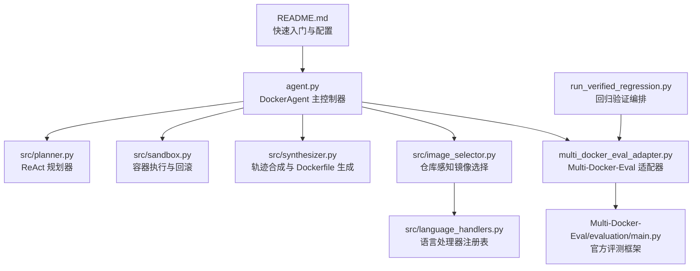
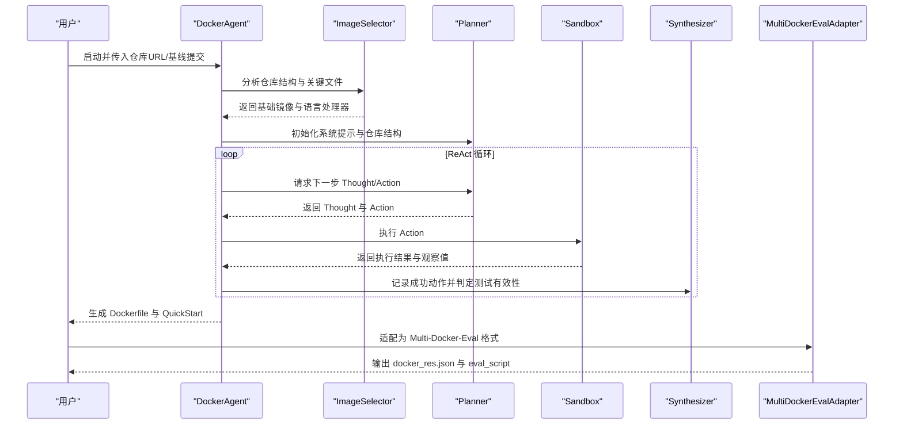
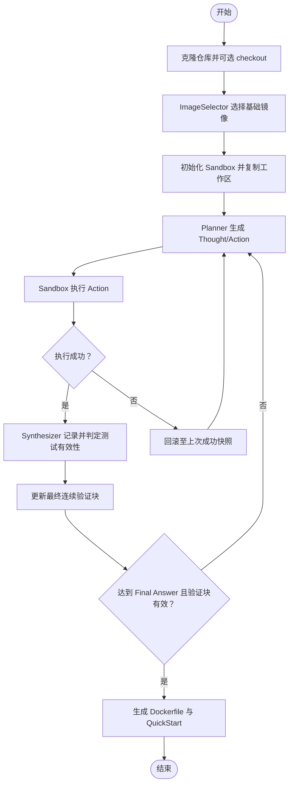
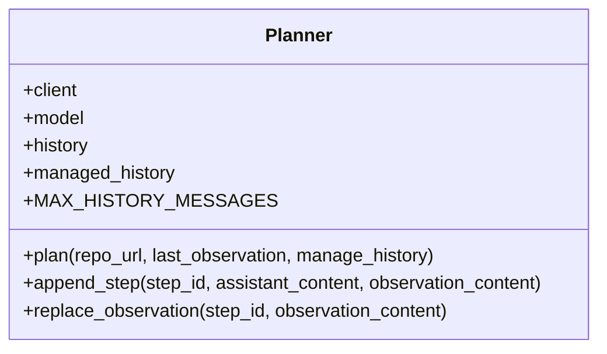
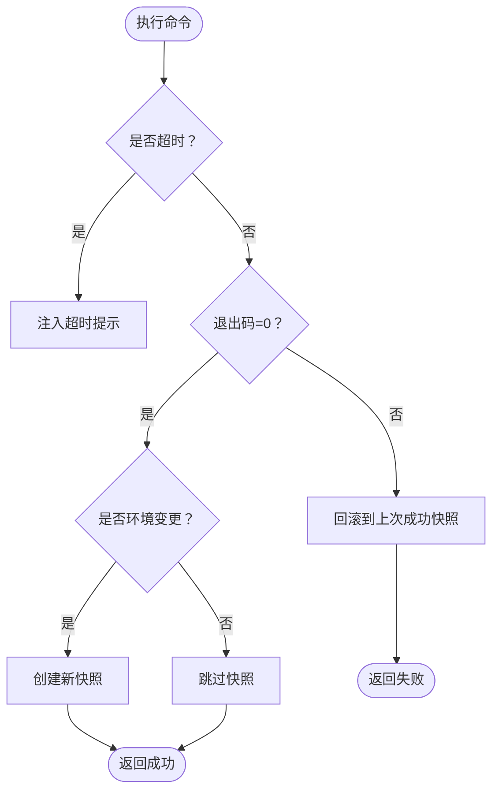
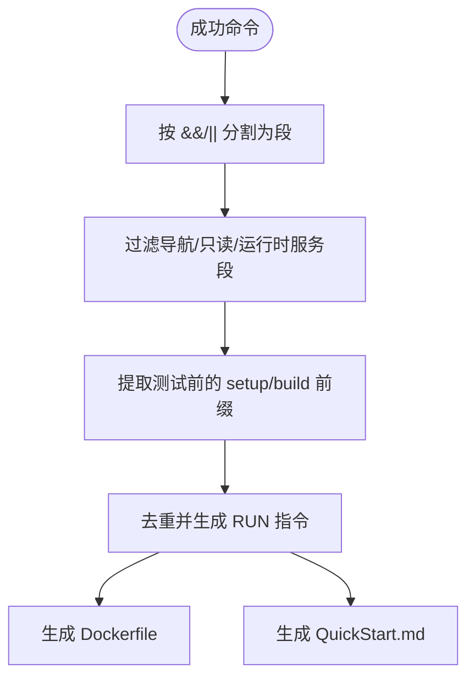
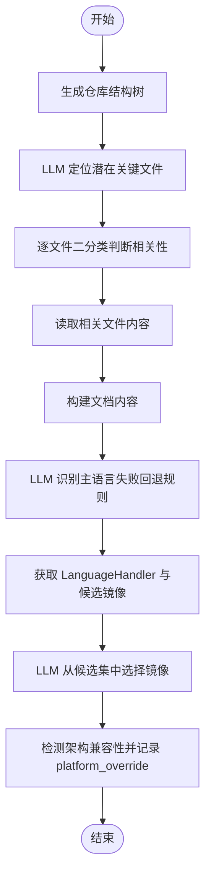
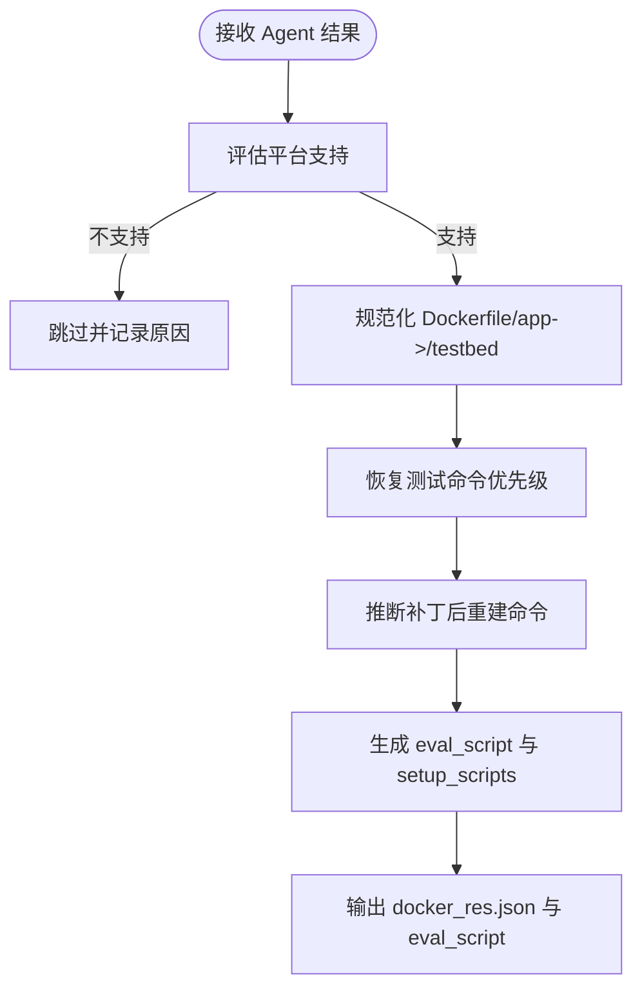
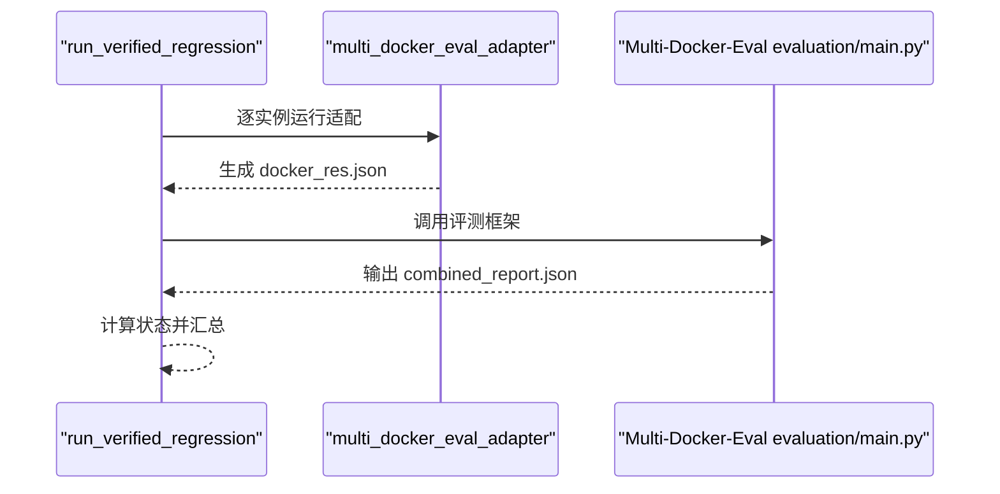
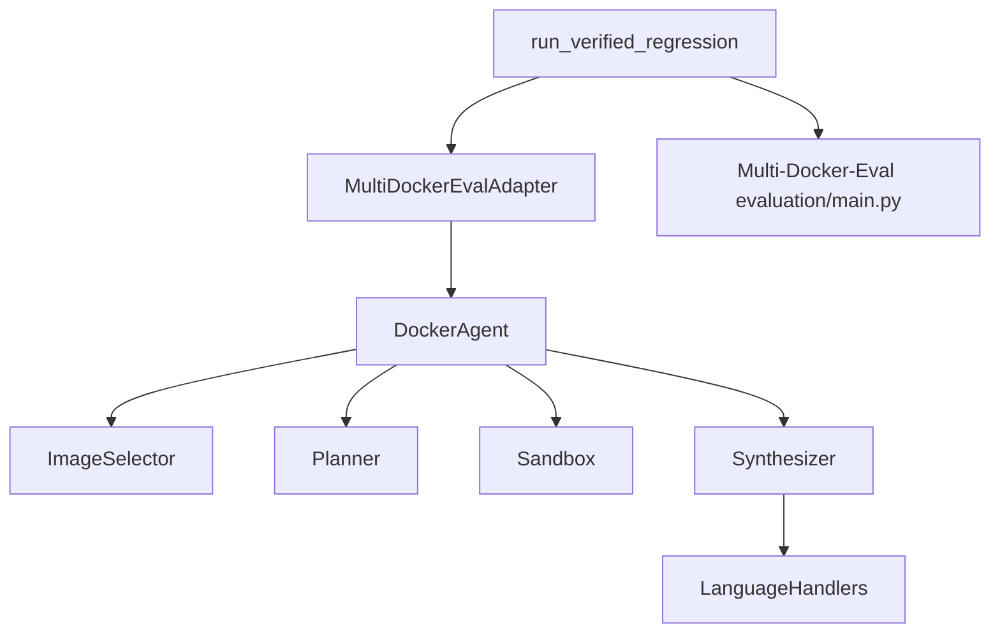

# 方法论与核心方法

<cite>
**本文引用的文件**
- [METHOD_APPROACH.md](file://doc/METHOD_APPROACH.md)
- [README.md](file://README.md)
- [agent.py](file://agent.py)
- [planner.py](file://src/planner.py)
- [synthesizer.py](file://src/synthesizer.py)
- [image_selector.py](file://src/image_selector.py)
- [language_handlers.py](file://src/language_handlers.py)
- [sandbox.py](file://src/sandbox.py)
- [multi_docker_eval_adapter.py](file://multi_docker_eval_adapter.py)
- [run_verified_regression.py](file://run_verified_regression.py)
</cite>

## 目录
1. [引言](#引言)
2. [项目结构](#项目结构)
3. [核心组件](#核心组件)
4. [架构概览](#架构概览)
5. [详细组件分析](#详细组件分析)
6. [依赖关系分析](#依赖关系分析)
7. [性能考虑](#性能考虑)
8. [故障排查指南](#故障排查指南)
9. [结论](#结论)

## 引言
本文围绕仓库的核心方法与实现，系统阐述“面向多语言 GitHub 仓库的自动化 Docker 环境构建与评测适配系统”。该系统以“可执行、可回放、可验证”为目标，将问题拆解为四个受约束的子任务：仓库语言与系统依赖识别、可回滚容器中的逐步环境配置、测试验证聚合、以及从成功轨迹合成可复用的 Dockerfile 与评测脚本。方法强调状态安全、验证严格与工件可复现三大原则。

## 项目结构
仓库采用模块化组织，核心执行入口为 agent.py，关键模块位于 src/ 目录，评测适配位于 multi_docker_eval_adapter.py，回归验证脚本为 run_verified_regression.py。README 提供快速入门与配置说明，doc/METHOD_APPROACH.md 提供方法论与设计要点。

图示来源
- [README.md](file://README.md)
- [agent.py](file://agent.py)
- [planner.py](file://src/planner.py)
- [sandbox.py](file://src/sandbox.py)
- [synthesizer.py](file://src/synthesizer.py)
- [image_selector.py](file://src/image_selector.py)
- [language_handlers.py](file://src/language_handlers.py)
- [multi_docker_eval_adapter.py](file://multi_docker_eval_adapter.py)

章节来源
- [README.md](file://README.md)
- [METHOD_APPROACH.md](file://doc/METHOD_APPROACH.md)

## 核心组件
- DockerAgent：串联镜像选择、规划执行、测试验证聚合与结果落盘，维护最终连续验证块与运行摘要。
- Planner：基于 ReAct 的单步规划器，注入仓库结构、语言专属指令与严格的测试验证约束。
- Sandbox：基于 Docker 的执行器，提供快照回滚与超时控制，失败动作不持久化。
- Synthesizer：从成功动作中抽取“应进入 Dockerfile 的配置部分”，剔除测试命令与纯运行时命令。
- ImageSelector：仓库结构建模与两阶段文件筛选，结合语言处理器生成候选镜像并由 LLM 选择。
- LanguageHandlers：多语言候选镜像集合、检测规则与专属 setup 指令。
- MultiDockerEvalAdapter：将 Agent 产物转换为 Multi-Docker-Eval 所需的 docker_res.json 与 eval_script。
- run_verified_regression：实验编排器，逐实例运行适配与评测，汇总状态与报告。

章节来源
- [agent.py](file://agent.py)
- [planner.py](file://src/planner.py)
- [synthesizer.py](file://src/synthesizer.py)
- [image_selector.py](file://src/image_selector.py)
- [language_handlers.py](file://src/language_handlers.py)
- [sandbox.py](file://src/sandbox.py)
- [multi_docker_eval_adapter.py](file://multi_docker_eval_adapter.py)
- [run_verified_regression.py](file://run_verified_regression.py)

## 架构概览
系统以 DockerAgent 为核心，通过 ImageSelector 初始化环境先验，Planner 生成单步 Thought/Action，Sandbox 执行并在失败时回滚，Synthesizer 聚合成功轨迹并生成工件，最终由 MultiDockerEvalAdapter 转换为评测格式。

图示来源
- [agent.py](file://agent.py)
- [planner.py](file://src/planner.py)
- [sandbox.py](file://src/sandbox.py)
- [synthesizer.py](file://src/synthesizer.py)
- [multi_docker_eval_adapter.py](file://multi_docker_eval_adapter.py)

章节来源
- [METHOD_APPROACH.md](file://doc/METHOD_APPROACH.md)

## 详细组件分析

### DockerAgent：状态安全与最终连续验证块
- 初始化：克隆仓库、可选 checkout 至基线提交、选择基础镜像、创建 Sandbox、加载结构化仓库信息与 setup 日志。
- ReAct 循环：规划 → 执行 → 记录成功动作 → 维护最终连续验证块 → 判定成功条件。
- 成功条件：LLM 输出 Final Answer: Success 且存在非空最终连续验证块。
- 运行摘要：记录 verified_test_commands、verified_test_command、verified_runtime_preparation_commands、验证来源与统计信息。

图示来源
- [agent.py](file://agent.py)
- [synthesizer.py](file://src/synthesizer.py)
- [sandbox.py](file://src/sandbox.py)

章节来源
- [agent.py](file://agent.py)
- [METHOD_APPROACH.md](file://doc/METHOD_APPROACH.md)

### Planner：带结构先验的 ReAct 规划
- 系统提示注入：仓库结构、语言专属 setup 指令、严格的测试验证约束（无借口规则、最终验证块、禁止旁路测试）。
- 单步输出：每次仅生成一个 Thought 与一个 Action，并在 Action 处停止，避免上下文膨胀。
- 历史管理：最大 24 条消息的滑动窗口，保留种子消息与近期上下文。

图示来源
- [planner.py](file://src/planner.py)

章节来源
- [planner.py](file://src/planner.py)
- [METHOD_APPROACH.md](file://doc/METHOD_APPROACH.md)

### Sandbox：失败不持久化的容器执行
- 快照回滚：失败动作不留下持久副作用，停止容器并从最近一次成功快照重启。
- 超时控制：若容器内存在 GNU timeout，则自动为每条命令套上超时控制。
- 选择性快照：仅对会改变环境的成功命令触发新的镜像快照；ls/cat/grep 等只读命令不引入额外镜像层。
- 测试失败注入：对输出中的典型失败信号（如 N failed、FAILED、not ok）在 observation 前注入强制警告，禁止模型输出 Final Answer: Success。

图示来源
- [sandbox.py](file://src/sandbox.py)

章节来源
- [sandbox.py](file://src/sandbox.py)
- [METHOD_APPROACH.md](file://doc/METHOD_APPROACH.md)

### Synthesizer：从混合命令中抽取可复用配置前缀
- 命令拆分：将混合命令（如 pip install -e . && pytest tests）拆分为 shell segment。
- 过滤规则：去掉纯导航段（仅 cd）、只读信息段、运行时服务启动与健康检查；若命令含测试，只保留测试前的 setup/build 前缀。
- Dockerfile 生成：FROM、WORKDIR 与去重后的 RUN 指令；QuickStart.md 基于 README 与真实安装命令生成。

图示来源
- [synthesizer.py](file://src/synthesizer.py)

章节来源
- [synthesizer.py](file://src/synthesizer.py)
- [METHOD_APPROACH.md](file://doc/METHOD_APPROACH.md)

### ImageSelector：仓库感知镜像选择
- 仓库结构建模：跳过无关目录，生成裁剪过的树状结构。
- 两阶段文件筛选：先让 LLM 仅根据目录树定位潜在关键文件，再对每个候选文件进行“是否与环境搭建相关”的二分类判断。
- 语言识别与候选镜像：优先使用 LLM 识别主语言，失败则回退规则检测；每种语言绑定 LanguageHandler，定义候选镜像集合与专属 setup 指令。
- LLM 受限选择：要求模型从候选集中选择并显式输出 <image>...</image> 标签；若检测到架构不兼容风险（如 ARM64 缺失嵌入式二进制），记录 platform_override。

图示来源
- [image_selector.py](file://src/image_selector.py)
- [language_handlers.py](file://src/language_handlers.py)

章节来源
- [image_selector.py](file://src/image_selector.py)
- [language_handlers.py](file://src/language_handlers.py)
- [METHOD_APPROACH.md](file://doc/METHOD_APPROACH.md)

### MultiDockerEvalAdapter：评测导向的工件合成
- 平台支持评估：跳过明显依赖 Windows/macOS/嵌入式工具链的实例。
- Dockerfile 规范化：将 Agent 产物中的 /app 工作目录规范化为 /testbed；对多行 RUN 指令进行 BuildKit heredoc 或反斜杠续行处理。
- 测试命令恢复优先级：优先使用 Agent 运行时记录的结构化验证命令，其次从历史 setup_logs 提取，最后基于语言默认命令。
- 补丁注入与重建：根据语言与已有 Dockerfile 推断重建命令（如 C/C++ 的 cmake/make/ninja、Java 的 mvn package、Rust 的 cargo test --no-run、Go 的 go build），将 patch 后重建移到 eval 阶段。
- 运行时服务恢复：检测测试命令是否依赖 redis-cli/redis-server，若 Dockerfile 已安装或命令已启动服务，则在 eval_script 前添加服务拉起与健康检查逻辑。

图示来源
- [multi_docker_eval_adapter.py](file://multi_docker_eval_adapter.py)

章节来源
- [multi_docker_eval_adapter.py](file://multi_docker_eval_adapter.py)
- [METHOD_APPROACH.md](file://doc/METHOD_APPROACH.md)

### run_verified_regression：实验编排与状态汇总
- 逐实例运行：从 verified.jsonl 读取实例，为每个实例单独生成数据文件与输出目录。
- 适配与评测：调用 multi_docker_eval_adapter.py 生成 docker_res.json，随后调用官方 Multi-Docker-Eval/evaluation/main.py 执行评测。
- 状态计算：以 passed/failed/adapter_skipped/evaluation_command_failed 等状态输出逐实例 JSON，汇总到 combined_report.json。

图示来源
- [run_verified_regression.py](file://run_verified_regression.py)
- [multi_docker_eval_adapter.py](file://multi_docker_eval_adapter.py)

章节来源
- [run_verified_regression.py](file://run_verified_regression.py)
- [METHOD_APPROACH.md](file://doc/METHOD_APPROACH.md)

## 依赖关系分析
- DockerAgent 依赖 ImageSelector、Planner、Sandbox、Synthesizer；Synthesizer 依赖 LanguageHandlers 以识别测试命令与运行时服务。
- MultiDockerEvalAdapter 依赖 DockerAgent 的运行摘要与结构化验证命令，将 Agent 产物转换为评测所需格式。
- run_verified_regression 依赖 multi_docker_eval_adapter 与官方评测框架，形成闭环验证。

图示来源
- [agent.py](file://agent.py)
- [image_selector.py](file://src/image_selector.py)
- [planner.py](file://src/planner.py)
- [sandbox.py](file://src/sandbox.py)
- [synthesizer.py](file://src/synthesizer.py)
- [language_handlers.py](file://src/language_handlers.py)
- [multi_docker_eval_adapter.py](file://multi_docker_eval_adapter.py)
- [run_verified_regression.py](file://run_verified_regression.py)

章节来源
- [agent.py](file://agent.py)
- [multi_docker_eval_adapter.py](file://multi_docker_eval_adapter.py)
- [run_verified_regression.py](file://run_verified_regression.py)

## 性能考虑
- 快照回滚提升稳定性，但会带来额外镜像存储成本，建议在结束后清理镜像。
- 观察值压缩：Agent 支持可选的观察值压缩，降低上下文长度与 token 消耗，提高长轨迹的可扩展性。
- 历史窗口：Planner 维护最多 24 条消息的滑动窗口，保留种子消息与近期上下文，平衡上下文长度与任务身份。
- 超时控制：Sandbox 对每条命令自动套用超时控制，避免长时间阻塞导致资源浪费。

## 故障排查指南
- API Key 相关错误：Agent 在执行过程中检测 API Key 问题并提示，需在运行环境中正确配置。
- 测试失败注入：若观察值包含典型失败信号（如 N failed、FAILED、not ok），Sandbox 会在 observation 前注入强制警告，阻止模型输出 Final Answer: Success。
- 容器与快照清理：容器异常退出或快照过多时，可通过 close(keep_alive=True) 保留容器以便调试，或在结束后清理快照镜像。
- 平台兼容性：若检测到 ARM64 兼容性风险（如嵌入式数据库缺失 ARM64 二进制），ImageSelector 会记录 platform_override，适配器据此使用 linux/amd64 平台。

章节来源
- [agent.py](file://agent.py)
- [sandbox.py](file://src/sandbox.py)
- [image_selector.py](file://src/image_selector.py)
- [METHOD_APPROACH.md](file://doc/METHOD_APPROACH.md)

## 结论
该方法论通过“仓库感知镜像选择 + 可回滚容器中的单步 ReAct 配置 + 运行期有效测试信号聚合 + 成功轨迹压缩”的闭环，实现了可执行、可回放、可验证的自动化 Docker 环境构建。其三大优势——状态安全、验证严格、工件可复现——在 Multi-Docker-Eval 评测中得到体现。未来可在语言处理器覆盖度、测试有效性判定规则与平台支持评估方面持续优化。