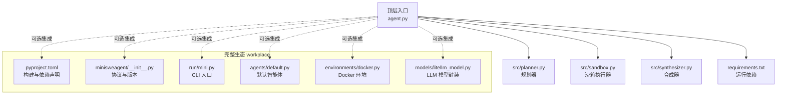
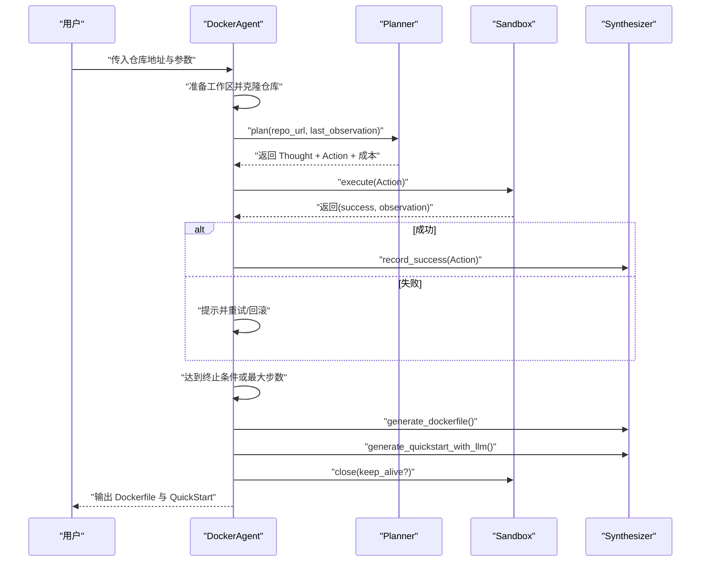
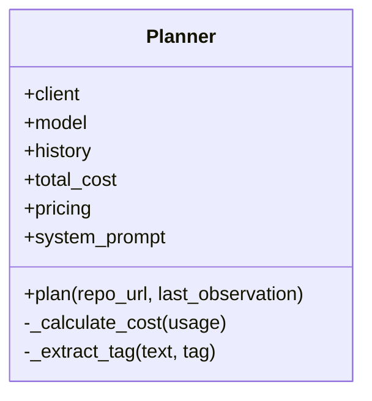
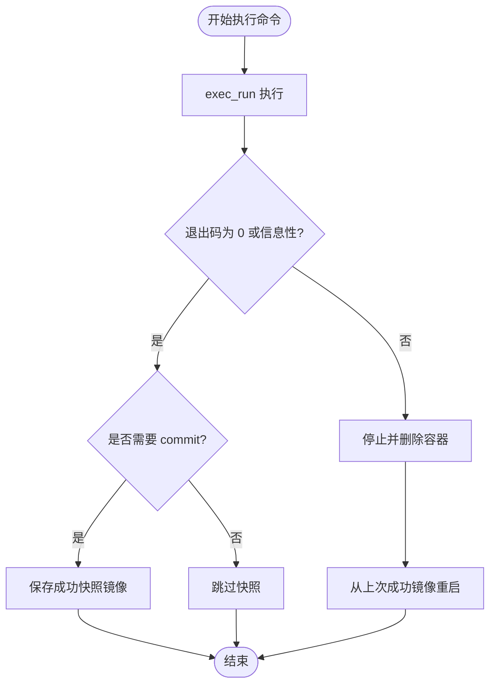
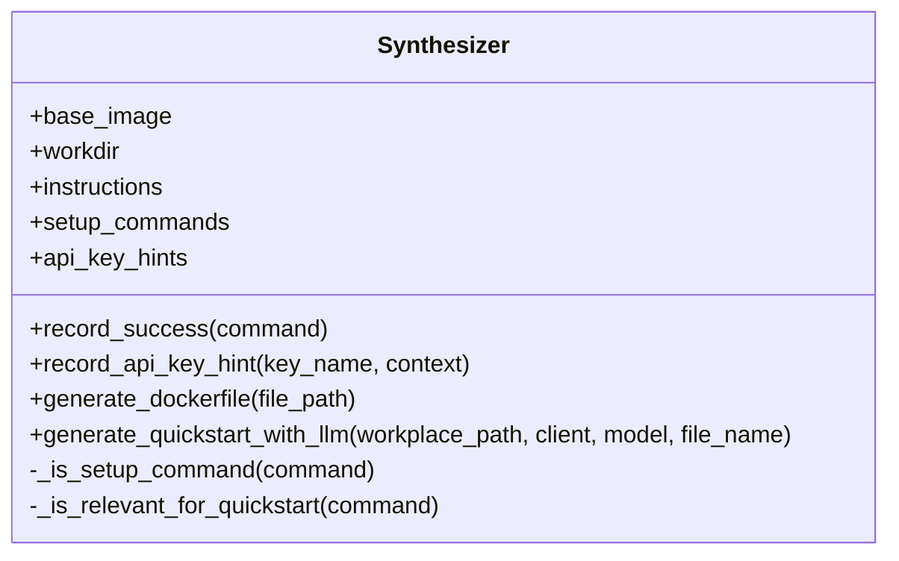
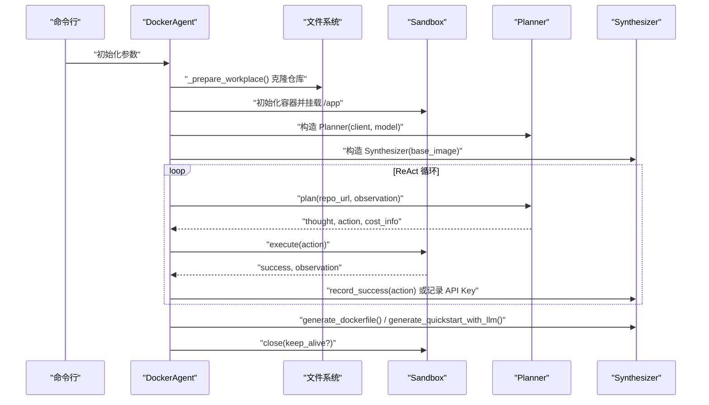
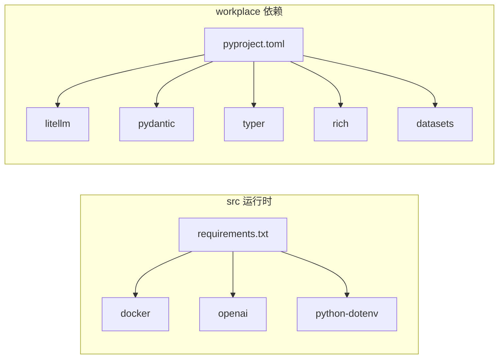

# 代码结构

<cite>
**本文引用的文件**
- [agent.py](file://agent.py)
- [src/planner.py](file://src/planner.py)
- [src/sandbox.py](file://src/sandbox.py)
- [src/synthesizer.py](file://src/synthesizer.py)
- [requirements.txt](file://requirements.txt)
- [workplace/src/minisweagent/__init__.py](file://workplace/src/minisweagent/__init__.py)
- [workplace/src/minisweagent/run/mini.py](file://workplace/src/minisweagent/run/mini.py)
- [workplace/src/minisweagent/agents/default.py](file://workplace/src/minisweagent/agents/default.py)
- [workplace/src/minisweagent/environments/docker.py](file://workplace/src/minisweagent/environments/docker.py)
- [workplace/src/minisweagent/models/litellm_model.py](file://workplace/src/minisweagent/models/litellm_model.py)
- [workplace/pyproject.toml](file://workplace/pyproject.toml)
</cite>

## 目录
1. [简介](#简介)
2. [项目结构](#项目结构)
3. [核心组件](#核心组件)
4. [架构总览](#架构总览)
5. [详细组件分析](#详细组件分析)
6. [依赖分析](#依赖分析)
7. [性能考虑](#性能考虑)
8. [故障排查指南](#故障排查指南)
9. [结论](#结论)
10. [附录](#附录)

## 简介
本文件系统化梳理 Repo Dockerizer Agent 的代码结构与设计理念，重点覆盖以下方面：
- 目录组织与分层：src 核心模块与 workplace 完整包结构的设计意图
- 四个核心模块（planner、sandbox、synthesizer）的职责与交互
- agents、environments、models、run 等主要包的功能定位与内部组织
- 模块间依赖关系与数据流
- 设计模式应用（策略模式、模板方法模式等）
- 代码导航指南与可视化图示

## 项目结构
仓库采用“轻量核心 + 完整生态”的双层结构：
- 顶层 src：最小可用的核心逻辑（规划器、沙箱、合成器、入口代理）
- workplace：完整生态包 minisweagent（多模型、多环境、多运行器、配置与工具）

图表来源
- [agent.py](file://agent.py#L1-L160)
- [src/planner.py](file://src/planner.py#L1-L145)
- [src/sandbox.py](file://src/sandbox.py#L1-L178)
- [src/synthesizer.py](file://src/synthesizer.py#L1-L144)
- [requirements.txt](file://requirements.txt#L1-L4)
- [workplace/pyproject.toml](file://workplace/pyproject.toml#L1-L282)
- [workplace/src/minisweagent/__init__.py](file://workplace/src/minisweagent/__init__.py#L1-L93)
- [workplace/src/minisweagent/run/mini.py](file://workplace/src/minisweagent/run/mini.py#L1-L110)
- [workplace/src/minisweagent/agents/default.py](file://workplace/src/minisweagent/agents/default.py#L1-L156)
- [workplace/src/minisweagent/environments/docker.py](file://workplace/src/minisweagent/environments/docker.py#L1-L162)
- [workplace/src/minisweagent/models/litellm_model.py](file://workplace/src/minisweagent/models/litellm_model.py#L1-L148)

章节来源
- [agent.py](file://agent.py#L1-L160)
- [requirements.txt](file://requirements.txt#L1-L4)
- [workplace/pyproject.toml](file://workplace/pyproject.toml#L1-L282)

## 核心组件
本项目围绕“ReAct 循环”展开，四大组件协同完成“理解任务 → 规划行动 → 执行验证 → 合成产物”的闭环。

- Planner（规划器）
  - 职责：基于系统提示词与历史对话，输出下一步“思考 + 行动”，并统计 token 成本
  - 关键点：支持多种模型定价表；ReAct 格式解析；历史会话管理
- Sandbox（沙箱）
  - 职责：在 Docker 容器内执行命令，具备“成功即提交镜像快照、失败即回滚”的幂等执行能力
  - 关键点：只对会产生副作用的命令进行 commit；识别信息性退出码；清理中间镜像
- Synthesizer（合成器）
  - 职责：记录成功命令、生成 Dockerfile 与 QuickStart 文档
  - 关键点：区分安装类与运行类命令；从 README 提取启动说明；检测并记录 API Key 需求
- DockerAgent（入口代理）
  - 职责：准备工作区、初始化 LLM 客户端、驱动 ReAct 循环、最终产出产物
  - 关键点：最大步数控制；成本统计；容器生命周期管理

章节来源
- [src/planner.py](file://src/planner.py#L1-L145)
- [src/sandbox.py](file://src/sandbox.py#L1-L178)
- [src/synthesizer.py](file://src/synthesizer.py#L1-L144)
- [agent.py](file://agent.py#L1-L160)

## 架构总览
ReAct 执行流由 DockerAgent 驱动，Planner 生成行动，Sandbox 执行并回滚，Synthesizer 记录并产出最终制品。

图表来源
- [agent.py](file://agent.py#L60-L126)
- [src/planner.py](file://src/planner.py#L69-L105)
- [src/sandbox.py](file://src/sandbox.py#L29-L91)
- [src/synthesizer.py](file://src/synthesizer.py#L9-L22)

## 详细组件分析

### Planner（规划器）
- 设计要点
  - 使用系统提示词约束 ReAct 行为，限定禁止命令集合，强调“仅在容器内执行”
  - 维护历史消息列表，按需追加观察结果
  - 解析 LLM 输出中的 Thought 与 Action，并提取 Final Answer 作为终止信号
  - 基于模型定价表计算 token 成本并累计
- 数据结构与复杂度
  - 历史消息列表 append/lookup：O(n)
  - 正则提取标签：O(m)，m 为输出长度
  - 成本计算：O(1)
- 错误处理
  - 对缺失 Action 的情况提示澄清
  - 对 Final Answer 的成功判定严格匹配
- 性能建议
  - 控制历史长度，必要时截断旧消息
  - 使用更短的 system prompt 降低 token 开销

图表来源
- [src/planner.py](file://src/planner.py#L3-L145)

章节来源
- [src/planner.py](file://src/planner.py#L1-L145)

### Sandbox（沙箱）
- 设计要点
  - 基于 Docker 容器执行命令，工作目录挂载至 /app
  - 成功分支：commit 当前状态为“上一次成功镜像”，用于后续回滚
  - 失败分支：停止并删除容器，从上次成功镜像重启
  - 信息性退出码识别：避免将“显示帮助”误判为错误
  - 只对会产生副作用的命令进行 commit，减少镜像膨胀
- 数据结构与复杂度
  - 容器操作：O(1) 但涉及外部进程调用
  - 回滚与清理：O(1) 镜像删除（受缓存影响）
- 错误处理
  - 捕获异常并尝试清理残留镜像
  - 支持 keep_alive 模式便于调试
- 性能建议
  - 合理设置 volumes，避免频繁 IO
  - 控制 commit 频率，合并相近安装命令

图表来源
- [src/sandbox.py](file://src/sandbox.py#L29-L113)

章节来源
- [src/sandbox.py](file://src/sandbox.py#L1-L178)

### Synthesizer（合成器）
- 设计要点
  - 记录成功命令为 Dockerfile 的 RUN 指令
  - 区分安装类与运行类命令，用于生成 QuickStart
  - 通过 LLM 将真实安装步骤与 README 启动说明整合为简洁文档
  - 检测 API Key 需求并给出环境变量与 .env 两种配置方案
- 数据结构与复杂度
  - 指令列表 append：O(1)
  - LLM 生成 QuickStart：O(k)，k 为 README 长度与 token 上限
- 错误处理
  - README 不存在或不可读时降级提示
  - 生成失败捕获异常并返回 None
- 性能建议
  - 限制 README 截断长度，避免 token 溢出
  - 过滤无关命令，提升 QuickStart 的可读性

图表来源
- [src/synthesizer.py](file://src/synthesizer.py#L1-L144)

章节来源
- [src/synthesizer.py](file://src/synthesizer.py#L1-L144)

### DockerAgent（入口代理）
- 设计要点
  - 准备本地工作区并克隆仓库
  - 初始化 LLM 客户端（OpenAI），构造 Planner 与 Synthesizer
  - 驱动 ReAct 循环：plan → execute → record → 终止条件
  - 最终生成 Dockerfile 与 QuickStart 文档
  - 容器生命周期管理：正常/异常/keep_alive 模式
- 数据流
  - 输入：repo_url、base_image、model、max_steps、keep_container
  - 中间：history、cost_info、observation、api_key_hints
  - 输出：Dockerfile、QuickStart.md、容器状态
- 错误处理
  - 环境变量缺失直接报错
  - 执行异常捕获并清理容器
  - API Key 缺失检测并记录

图表来源
- [agent.py](file://agent.py#L14-L126)

章节来源
- [agent.py](file://agent.py#L1-L160)

### 与完整生态包的对比与集成
workplace 下的 minisweagent 提供了更通用的框架，包含：
- agents：抽象 Agent 协议与默认实现
- environments：多环境适配（本地、Docker、Singularity 等）
- models：多模型适配（LiteLLM、OpenRouter、Portkey 等）
- run：CLI 入口与运行流程
- config：配置体系与基准样例

这些组件与 src 核心模块形成互补：src 更聚焦“仓库环境一键配置”的单一目标，workplace 提供“多模型 + 多环境 + 多运行器”的通用平台。

章节来源
- [workplace/src/minisweagent/__init__.py](file://workplace/src/minisweagent/__init__.py#L1-L93)
- [workplace/src/minisweagent/run/mini.py](file://workplace/src/minisweagent/run/mini.py#L1-L110)
- [workplace/src/minisweagent/agents/default.py](file://workplace/src/minisweagent/agents/default.py#L1-L156)
- [workplace/src/minisweagent/environments/docker.py](file://workplace/src/minisweagent/environments/docker.py#L1-L162)
- [workplace/src/minisweagent/models/litellm_model.py](file://workplace/src/minisweagent/models/litellm_model.py#L1-L148)

## 依赖分析
- 运行时依赖（src 层）
  - docker：容器执行
  - openai：LLM 接入
  - python-dotenv：环境变量加载
- 生态依赖（workplace 层）
  - pyyaml、requests、jinja2、pydantic、litellm、tenacity、rich 等
  - 可选依赖：dev、modal 等

图表来源
- [requirements.txt](file://requirements.txt#L1-L4)
- [workplace/pyproject.toml](file://workplace/pyproject.toml#L33-L48)

章节来源
- [requirements.txt](file://requirements.txt#L1-L4)
- [workplace/pyproject.toml](file://workplace/pyproject.toml#L1-L282)

## 性能考虑
- Planner
  - 控制历史长度与 system prompt 长度，降低 token 消耗
  - 使用 temperature=0 提升确定性，减少无效重试
- Sandbox
  - 合并相近安装命令，减少 commit 次数
  - 仅对有副作用命令 commit，避免镜像膨胀
  - 及时清理悬空镜像，释放磁盘空间
- Synthesizer
  - 限制 README 截断长度，避免超长 prompt
  - 过滤无关命令，提升 QuickStart 的可读性
- DockerAgent
  - 设置合理的 max_steps，防止无限循环
  - 在 keep_alive 模式下仅用于调试，避免资源占用

## 故障排查指南
- 环境变量缺失
  - 现象：启动时报错提示缺少 OPENAI_API_KEY
  - 处理：在 .env 文件中设置 OPENAI_API_KEY 与可选 OPENAI_API_BASE
- 容器执行失败
  - 现象：命令返回非零退出码
  - 处理：检查是否为信息性退出；确认命令不在禁止列表；查看观察输出定位问题
- API Key 缺失
  - 现象：执行过程中出现 API Key 相关错误提示
  - 处理：Synthesizer 会记录 API Key 需求，按提示配置环境变量或 .env
- Docker 权限不足
  - 现象：无法启动/停止容器
  - 处理：确保当前用户加入 docker 组或使用 sudo（谨慎）

章节来源
- [agent.py](file://agent.py#L28-L36)
- [src/sandbox.py](file://src/sandbox.py#L114-L134)
- [src/synthesizer.py](file://src/synthesizer.py#L17-L21)

## 结论
本项目以“ReAct 循环 + Docker 容器执行 + LLM 规划”为核心范式，通过 Planner、Sandbox、Synthesizer 的明确分工与协作，实现了从仓库到可运行环境的一键配置与产物生成。src 层提供最小可用路径，workplace 层提供通用生态扩展。整体设计遵循“高内聚、低耦合”，并通过策略模式（不同模型/环境）、模板方法模式（Agent.run 流程）等在完整生态中得到体现。

## 附录

### 设计模式应用
- 策略模式
  - 在完整生态中，通过 get_model/get_environment/get_agent 工厂函数，允许在运行时选择不同的模型、环境与智能体实现，实现“同接口、多实现”的策略切换
- 模板方法模式
  - DefaultAgent.run 定义了“构造消息 → 查询模型 → 执行动作 → 保存轨迹”的模板流程，子类可通过覆盖 query/execute_actions 等钩子实现定制

章节来源
- [workplace/src/minisweagent/agents/default.py](file://workplace/src/minisweagent/agents/default.py#L77-L123)
- [workplace/src/minisweagent/run/mini.py](file://workplace/src/minisweagent/run/mini.py#L99-L102)

### 代码导航指南
- 快速定位
  - 入口脚本：agent.py
  - 核心模块：src/planner.py、src/sandbox.py、src/synthesizer.py
  - 完整生态：workplace/src/minisweagent 下的 agents、environments、models、run
- 常用场景
  - 自定义模型：修改 workplace/src/minisweagent/models/ 下对应实现
  - 自定义环境：修改 workplace/src/minisweagent/environments/ 下对应实现
  - 自定义智能体：修改 workplace/src/minisweagent/agents/ 下实现或复用 DefaultAgent
  - CLI 使用：workplace/src/minisweagent/run/mini.py 提供命令行入口