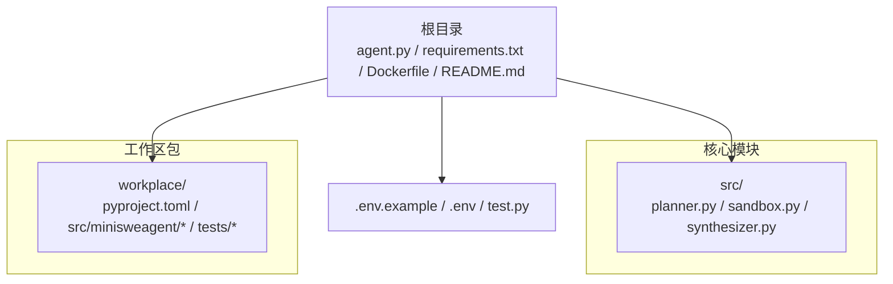
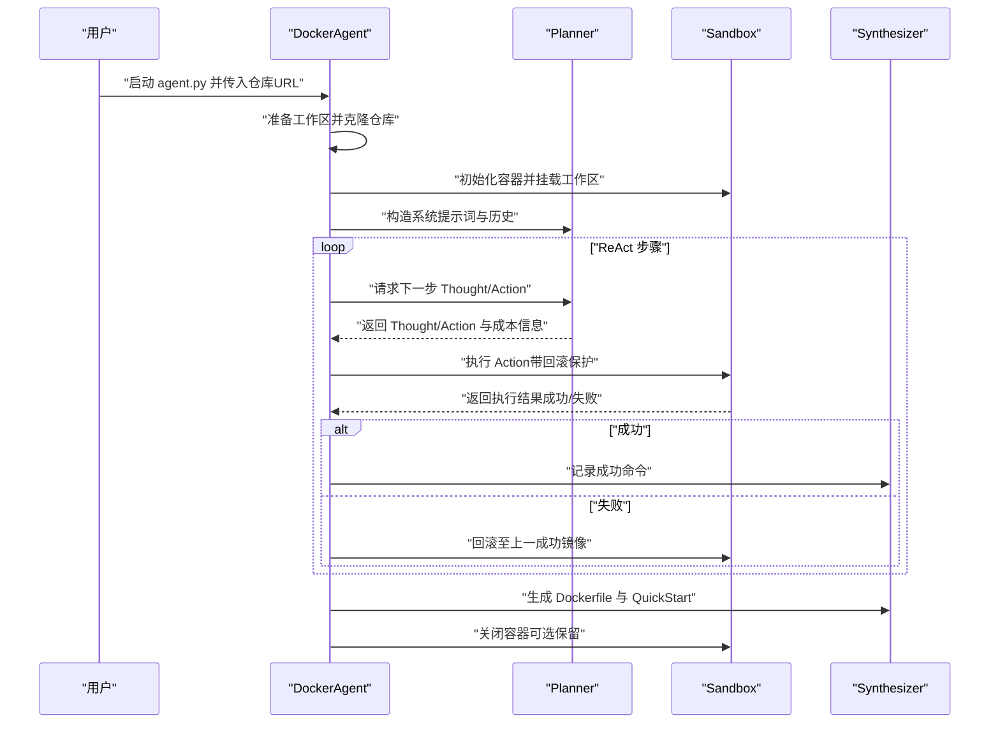
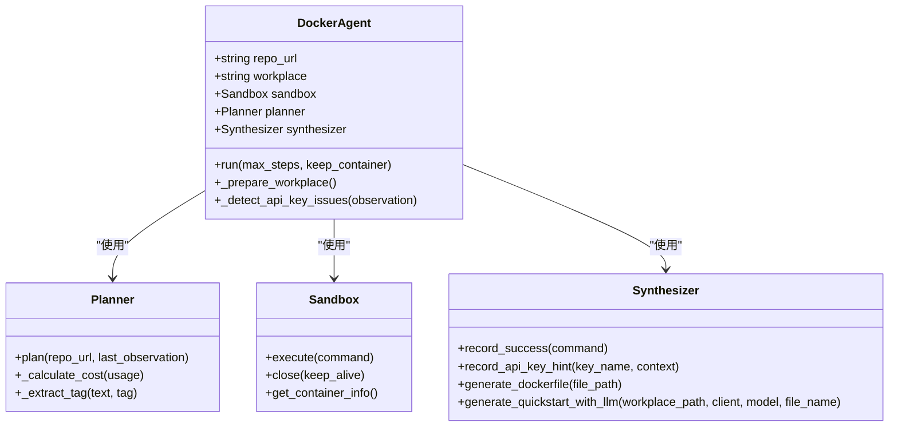
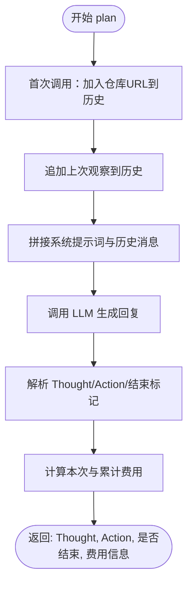
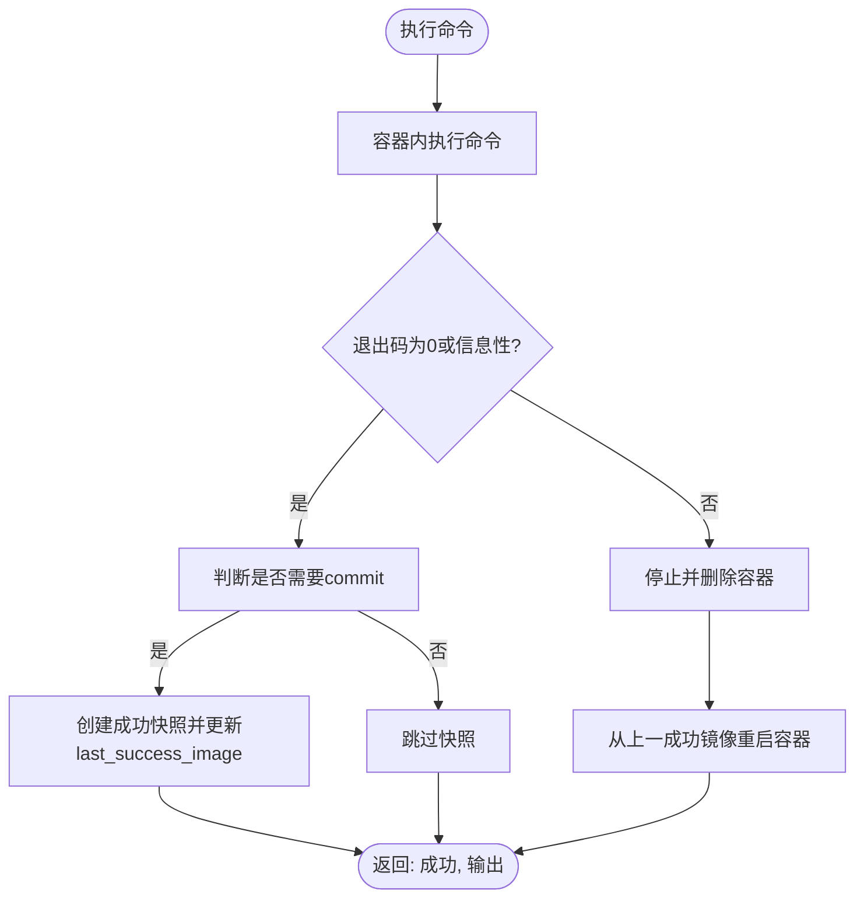
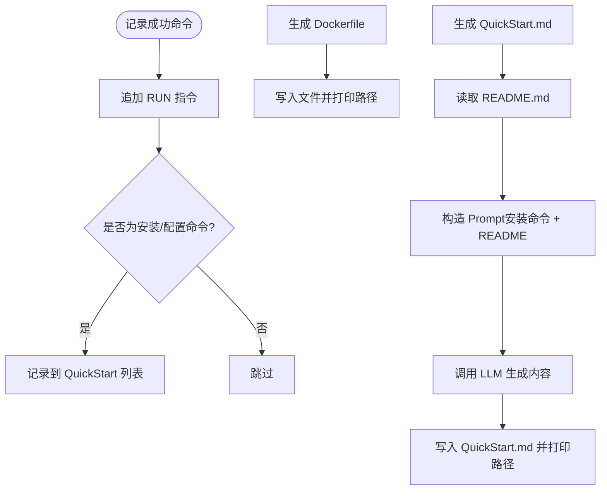
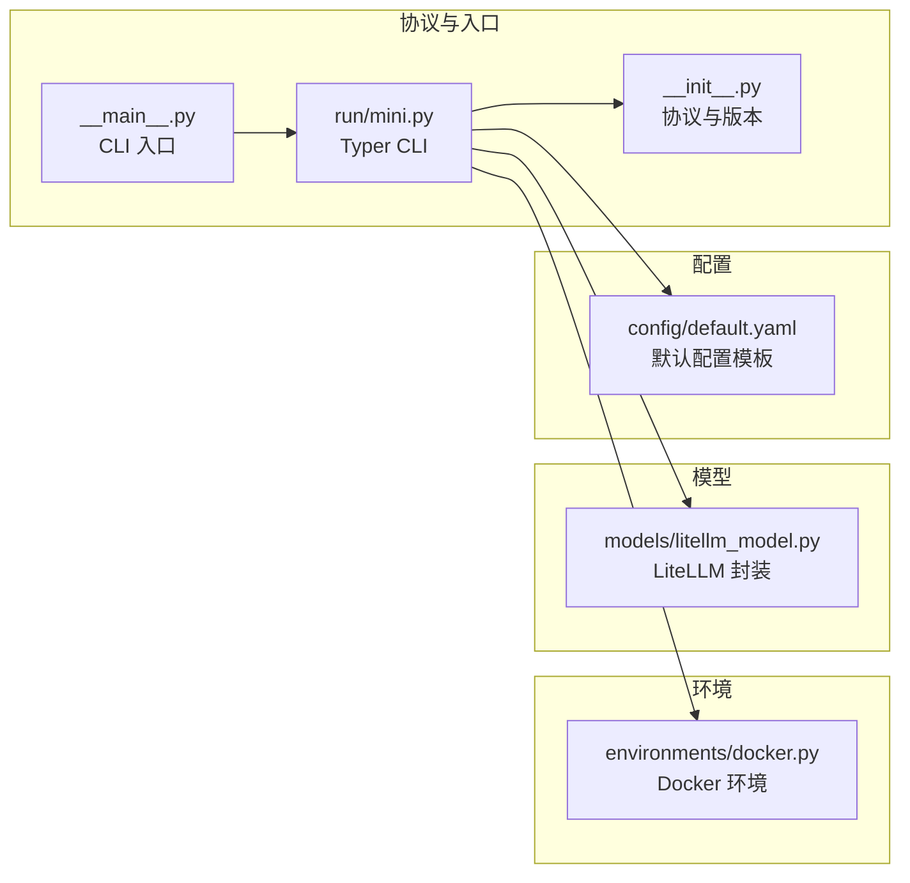
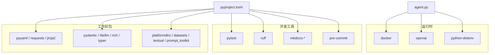

# 开发指南

<cite>
**本文引用的文件**
- [README.md](file://README.md)
- [agent.py](file://agent.py)
- [src/planner.py](file://src/planner.py)
- [src/sandbox.py](file://src/sandbox.py)
- [src/synthesizer.py](file://src/synthesizer.py)
- [requirements.txt](file://requirements.txt)
- [Dockerfile](file://Dockerfile)
- [test.py](file://test.py)
- [.env.example](file://.env.example)
- [workplace/pyproject.toml](file://workplace/pyproject.toml)
- [workplace/src/minisweagent/__main__.py](file://workplace/src/minisweagent/__main__.py)
- [workplace/src/minisweagent/__init__.py](file://workplace/src/minisweagent/__init__.py)
- [workplace/src/minisweagent/config/default.yaml](file://workplace/src/minisweagent/config/default.yaml)
- [workplace/src/minisweagent/environments/docker.py](file://workplace/src/minisweagent/environments/docker.py)
- [workplace/src/minisweagent/models/litellm_model.py](file://workplace/src/minisweagent/models/litellm_model.py)
- [workplace/src/minisweagent/run/mini.py](file://workplace/src/minisweagent/run/mini.py)
- [workplace/tests/conftest.py](file://workplace/tests/conftest.py)
</cite>

## 目录
1. [简介](#简介)
2. [项目结构](#项目结构)
3. [核心组件](#核心组件)
4. [架构总览](#架构总览)
5. [详细组件分析](#详细组件分析)
6. [依赖关系分析](#依赖关系分析)
7. [性能考虑](#性能考虑)
8. [故障排查指南](#故障排查指南)
9. [结论](#结论)
10. [附录](#附录)

## 简介
Repo Dockerizer Agent 是一个基于大语言模型（LLM）的自动化工具，目标是为任意 GitHub 仓库在本地快速配置可执行的 Docker 环境。其工作流采用 ReAct 思维链（Thought/Action/Observation）驱动，结合沙箱执行与回滚机制，最终生成可复用的 Dockerfile 与简明的 QuickStart 文档。

本开发指南面向希望参与开发、扩展与维护该项目的工程师，覆盖以下主题：
- 代码结构与模块组织
- 设计模式与控制流
- 开发环境搭建（IDE、调试、测试）
- 测试策略（单元、集成、性能）
- 代码贡献流程（规范、提交、PR）
- 扩展开发（新增 LLM 提供商、环境类型、功能模块）
- 性能优化与错误处理最佳实践

## 项目结构
仓库采用“核心脚本 + 子模块 + 工作区包”的分层组织方式：
- 根目录核心脚本与依赖：agent.py、requirements.txt、Dockerfile、README.md、.env.example、test.py
- src 子模块：planner.py（规划器）、sandbox.py（沙箱执行与回滚）、synthesizer.py（合成器）
- workplace：完整的可安装包 minisweagent（多模块、多测试、多配置）

图示来源
- [agent.py](file://agent.py#L1-L160)
- [src/planner.py](file://src/planner.py#L1-L145)
- [src/sandbox.py](file://src/sandbox.py#L1-L178)
- [src/synthesizer.py](file://src/synthesizer.py#L1-L144)
- [workplace/pyproject.toml](file://workplace/pyproject.toml#L1-L282)

章节来源
- [README.md](file://README.md#L1-L47)
- [agent.py](file://agent.py#L1-L160)
- [workplace/pyproject.toml](file://workplace/pyproject.toml#L1-L282)

## 核心组件
- DockerAgent：协调器，负责克隆仓库、初始化 LLM 客户端、构建 Planner/Synthesizer、驱动 ReAct 循环、执行沙箱命令、回滚与收尾。
- Planner：基于系统提示词与历史对话，输出 ReAct 格式的“思考 + 行动”，并统计 Token 与费用。
- Sandbox：基于 Docker SDK 的执行环境，支持命令执行、成功状态快照与失败回滚，避免磁盘膨胀。
- Synthesizer：记录成功的命令，生成 Dockerfile 与 QuickStart 文档；识别缺失的 API Key 并给出配置建议。

章节来源
- [agent.py](file://agent.py#L14-L160)
- [src/planner.py](file://src/planner.py#L3-L145)
- [src/sandbox.py](file://src/sandbox.py#L4-L178)
- [src/synthesizer.py](file://src/synthesizer.py#L1-L144)

## 架构总览
ReAct 循环的端到端流程如下：

图示来源
- [agent.py](file://agent.py#L60-L126)
- [src/planner.py](file://src/planner.py#L69-L105)
- [src/sandbox.py](file://src/sandbox.py#L29-L91)
- [src/synthesizer.py](file://src/synthesizer.py#L9-L31)

## 详细组件分析

### DockerAgent 组件
职责与行为
- 初始化工作区与仓库克隆
- 基于 Docker SDK 启动容器并挂载工作区
- 构造 OpenAI 客户端（支持自定义 base_url）
- 驱动 ReAct 循环，打印成本信息，检测 API Key 缺失并记录提示
- 成功后生成 Dockerfile 与 QuickStart 文档，失败则提示未完成

关键实现要点
- 参数解析与默认值（镜像、模型、最大步数、保留容器）
- ReAct 循环中的成本统计与输出
- 失败回滚与成功快照管理
- 最终产物生成与清理

图示来源
- [agent.py](file://agent.py#L14-L160)
- [src/planner.py](file://src/planner.py#L3-L145)
- [src/sandbox.py](file://src/sandbox.py#L4-L178)
- [src/synthesizer.py](file://src/synthesizer.py#L1-L144)

章节来源
- [agent.py](file://agent.py#L14-L160)

### Planner 组件
职责与行为
- 维护系统提示词与对话历史
- 调用 LLM 生成 ReAct 格式内容
- 解析 Thought/Action，识别结束条件
- 统计 Token 用量与累计费用

实现细节
- 价格表（按模型名映射输入/输出单价）
- 基于正则提取 Thought/Action
- 停止词控制输出长度

图示来源
- [src/planner.py](file://src/planner.py#L69-L129)

章节来源
- [src/planner.py](file://src/planner.py#L3-L145)

### Sandbox 组件
职责与行为
- 基于 Docker SDK 启动容器并挂载工作区
- 执行命令并区分“信息性退出”与“错误退出”
- 对会产生副作用的命令进行 commit 快照，失败时回滚至上一成功镜像
- 支持保留容器以便调试，清理中间镜像与快照

实现细节
- 只读命令白名单（不触发 commit）
- 信息性退出识别（常见帮助/用法输出）
- 快照清理策略，避免镜像堆积

图示来源
- [src/sandbox.py](file://src/sandbox.py#L29-L91)

章节来源
- [src/sandbox.py](file://src/sandbox.py#L4-L178)

### Synthesizer 组件
职责与行为
- 记录成功的命令（RUN 指令）
- 识别环境配置相关命令，用于生成 QuickStart
- 生成 Dockerfile 与 QuickStart.md（基于 README 与实际安装命令）
- 记录缺失的 API Key 并给出配置建议

实现细节
- QuickStart 生成 Prompt 的结构化要求
- 关键字过滤，排除纯查看类命令
- API Key 提示去重与上下文记录

图示来源
- [src/synthesizer.py](file://src/synthesizer.py#L9-L143)

章节来源
- [src/synthesizer.py](file://src/synthesizer.py#L1-L144)

### 工作区包（minisweagent）概览
工作区包提供了更通用的 Agent/Model/Environment 抽象与 CLI 入口，便于扩展与集成：
- 协议定义（Agent/Model/Environment）便于类型检查与替换
- Docker 环境执行器（直接调用 docker 命令）
- LiteLLM 模型封装（统一工具调用、成本追踪、重试）
- CLI 入口与配置加载

图示来源
- [workplace/src/minisweagent/__init__.py](file://workplace/src/minisweagent/__init__.py#L43-L92)
- [workplace/src/minisweagent/__main__.py](file://workplace/src/minisweagent/__main__.py#L1-L8)
- [workplace/src/minisweagent/run/mini.py](file://workplace/src/minisweagent/run/mini.py#L1-L110)
- [workplace/src/minisweagent/environments/docker.py](file://workplace/src/minisweagent/environments/docker.py#L1-L162)
- [workplace/src/minisweagent/models/litellm_model.py](file://workplace/src/minisweagent/models/litellm_model.py#L1-L148)
- [workplace/src/minisweagent/config/default.yaml](file://workplace/src/minisweagent/config/default.yaml#L1-L167)

章节来源
- [workplace/src/minisweagent/__init__.py](file://workplace/src/minisweagent/__init__.py#L1-L93)
- [workplace/src/minisweagent/run/mini.py](file://workplace/src/minisweagent/run/mini.py#L1-L110)
- [workplace/src/minisweagent/environments/docker.py](file://workplace/src/minisweagent/environments/docker.py#L1-L162)
- [workplace/src/minisweagent/models/litellm_model.py](file://workplace/src/minisweagent/models/litellm_model.py#L1-L148)
- [workplace/src/minisweagent/config/default.yaml](file://workplace/src/minisweagent/config/default.yaml#L1-L167)

## 依赖关系分析
- 运行时依赖：docker、openai、python-dotenv
- 开发与质量工具：pytest、ruff、mkdocs、pre-commit 等
- 工作区包依赖：pyyaml、requests、jinja2、pydantic、litellm、rich、typer、platformdirs 等

图示来源
- [requirements.txt](file://requirements.txt#L1-L4)
- [workplace/pyproject.toml](file://workplace/pyproject.toml#L33-L48)
- [workplace/pyproject.toml](file://workplace/pyproject.toml#L50-L77)
- [workplace/pyproject.toml](file://workplace/pyproject.toml#L103-L233)

章节来源
- [requirements.txt](file://requirements.txt#L1-L4)
- [workplace/pyproject.toml](file://workplace/pyproject.toml#L1-L282)

## 性能考虑
- 回滚与快照
  - 仅对会产生副作用的命令进行 commit，减少镜像数量与磁盘占用
  - 成功后清理上一个成功快照，避免镜像堆积
- 命令执行
  - 区分“信息性退出”与错误退出，避免无意义的回滚
  - 控制输出长度，必要时使用 head/tail/sed 精准查看
- LLM 调用
  - 使用 stop 控制输出，减少 Token 消耗
  - 按模型定价表统计费用，合理设置温度与步数上限
- 容器生命周期
  - 失败时回滚至上一成功镜像，减少重复安装
  - 可选保留容器以便调试，完成后清理

章节来源
- [src/sandbox.py](file://src/sandbox.py#L56-L91)
- [src/planner.py](file://src/planner.py#L85-L90)
- [README.md](file://README.md#L43-L47)

## 故障排查指南
- 环境变量与密钥
  - 确认 .env 中包含 OPENAI_API_KEY（可选 OPENAI_API_BASE）
  - 使用 test.py 验证代理 LLM 的联网能力与稳定性
- Docker 权限与可用性
  - 确保本地已安装并运行 Docker Engine
  - 若出现权限问题，检查 docker 用户组与守护进程状态
- API Key 缺失检测
  - Planner 会根据输出关键词识别缺失的 API Key 类型并记录
  - Synthesizer 会记录缺失的 Key 名称与上下文，便于生成 QuickStart 的配置说明
- 容器调试
  - 使用 keep-container 参数在完成后保留容器，执行 docker exec 进入交互
  - 查看容器状态与 ID，便于定位问题

章节来源
- [agent.py](file://agent.py#L127-L146)
- [src/sandbox.py](file://src/sandbox.py#L147-L178)
- [test.py](file://test.py#L1-L45)
- [README.md](file://README.md#L28-L47)

## 结论
本项目以 ReAct 为核心，结合 Docker 沙箱与 LLM 规划，实现了从仓库到可执行环境的自动化配置。通过明确的模块边界、回滚与快照机制、成本统计与输出控制，既保证了可靠性，也兼顾了性能与可维护性。工作区包进一步提供了可扩展的抽象与 CLI 入口，便于后续集成更多模型与环境类型。

## 附录

### 开发环境搭建
- Python 环境
  - 推荐使用 uv 创建虚拟环境并安装依赖
  - 安装 requirements.txt 中的运行时依赖
- 配置
  - 复制 .env.example 为 .env，填入 OPENAI_API_KEY（可选 OPENAI_API_BASE）
- Docker
  - 确保本地 Docker Engine 已安装并运行
- IDE 与调试
  - 在 IDE 中配置 Python 解释器指向虚拟环境
  - 设置断点于 agent.py 的循环处，逐步观察 Planner/Sandbox/Synthesizer 的交互
- 测试
  - 使用 pytest 运行 tests 目录下的测试用例
  - 可通过 --run-fire 选项启用真实 API 调用测试（需付费）

章节来源
- [README.md](file://README.md#L11-L31)
- [requirements.txt](file://requirements.txt#L1-L4)
- [workplace/tests/conftest.py](file://workplace/tests/conftest.py#L11-L18)

### 测试策略
- 单元测试
  - 针对 Planner 的解析与成本计算、Sandbox 的执行与回滚、Synthesizer 的指令记录与文档生成
- 集成测试
  - 使用真实 LLM 与 Docker 环境，验证 ReAct 循环的端到端流程
  - 使用 conftest 中的夹具与轨迹数据进行对比校验
- 性能测试
  - 通过限制 max_steps 与模型温度，评估不同配置下的成功率与成本
  - 监控容器镜像增长与磁盘占用

章节来源
- [workplace/tests/conftest.py](file://workplace/tests/conftest.py#L25-L112)

### 代码贡献流程
- 代码规范
  - 使用 ruff 进行格式化与静态检查，遵循 line-length 与规则集
  - 优先使用不可变默认值、显式类型注解与清晰的函数签名
- 提交规范
  - 使用 .cursor/rules 下的 commits.mdc、style.mdc、project.mdc 作为参考
  - 提交信息应清晰描述变更目的与范围
- Pull Request 流程
  - 在 GitHub 上创建 PR，确保 CI 通过、覆盖率达标
  - 至少一名维护者审查并批准

章节来源
- [workplace/pyproject.toml](file://workplace/pyproject.toml#L103-L233)
- [workplace/.cursor/rules/commits.mdc](file://workplace/.cursor/rules/commits.mdc)
- [workplace/.cursor/rules/style.mdc](file://workplace/.cursor/rules/style.mdc)
- [workplace/.cursor/rules/project.mdc](file://workplace/.cursor/rules/project.mdc)

### 扩展开发指南
- 新增 LLM 提供商
  - 参考 models/litellm_model.py 的封装方式，实现 query/format_message/format_observation_messages
  - 在配置中注册模型名称与参数，必要时接入成本追踪
- 新增环境类型
  - 参考 environments/docker.py，实现 execute/get_template_vars/serialize/cleanup
  - 在 CLI 中通过 --environment-class 指定新环境类
- 新增功能模块
  - 在 src 下新增模块并在 agent.py 中组合使用
  - 为新模块编写单元测试与集成测试，确保与现有流程兼容

章节来源
- [workplace/src/minisweagent/models/litellm_model.py](file://workplace/src/minisweagent/models/litellm_model.py#L48-L148)
- [workplace/src/minisweagent/environments/docker.py](file://workplace/src/minisweagent/environments/docker.py#L45-L162)
- [workplace/src/minisweagent/run/mini.py](file://workplace/src/minisweagent/run/mini.py#L54-L105)