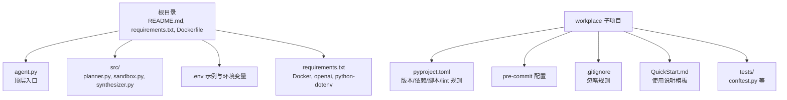
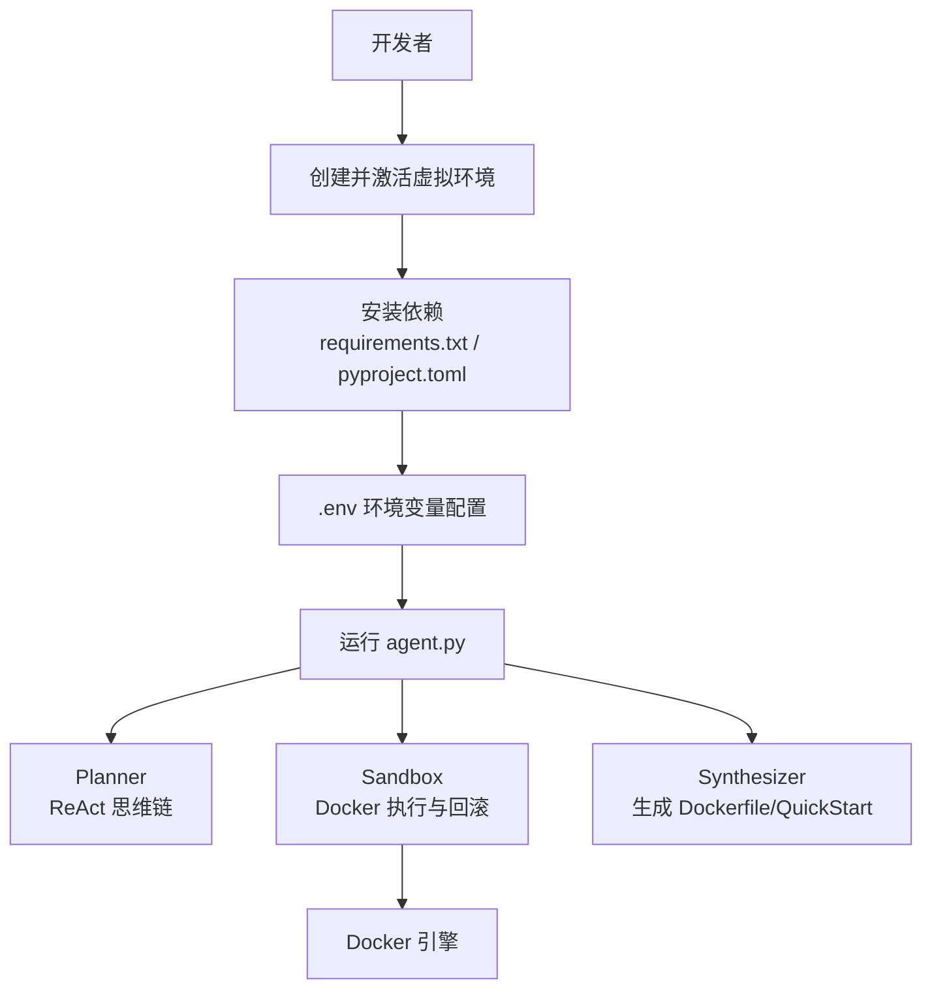
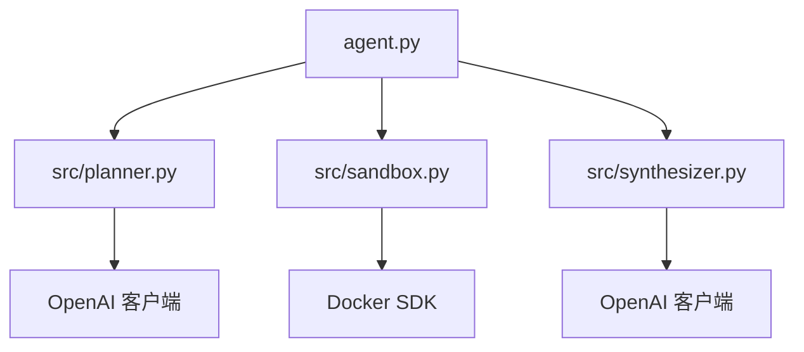

# 开发环境搭建

<cite>
**本文引用的文件**
- [README.md](file://README.md)
- [requirements.txt](file://requirements.txt)
- [Dockerfile](file://Dockerfile)
- [pyproject.toml](file://workplace/pyproject.toml)
- [.pre-commit-config.yaml](file://workplace/.pre-commit-config.yaml)
- [.gitignore](file://workplace/.gitignore)
- [.env](file://workplace/.env)
- [agent.py](file://agent.py)
- [src/planner.py](file://src/planner.py)
- [src/sandbox.py](file://src/sandbox.py)
- [src/synthesizer.py](file://src/synthesizer.py)
- [workplace/QuickStart.md](file://workplace/QuickStart.md)
- [workplace/tests/conftest.py](file://workplace/tests/conftest.py)
</cite>

## 目录
1. [简介](#简介)
2. [项目结构](#项目结构)
3. [核心组件](#核心组件)
4. [架构总览](#架构总览)
5. [详细组件分析](#详细组件分析)
6. [依赖关系分析](#依赖关系分析)
7. [性能考虑](#性能考虑)
8. [故障排查指南](#故障排查指南)
9. [结论](#结论)
10. [附录](#附录)

## 简介
本指南面向 Repo Dockerizer Agent 的本地开发环境搭建，覆盖 Python 版本要求、虚拟环境创建与依赖安装、项目配置文件与环境变量、IDE 配置建议、pre-commit hooks、调试与断点设置、常用工具（Docker、Git）安装与配置，以及开发流程最佳实践与注意事项。目标是帮助开发者快速、稳定地完成本地开发准备，并在后续迭代中保持一致的代码风格与质量。

## 项目结构
该仓库采用“根目录 + workplace 子项目”的组织方式：
- 根目录包含顶层入口脚本、示例配置与顶层依赖声明
- workplace 子项目为完整的可安装包，包含 CLI、配置、运行器、模型封装、环境与测试等模块

图表来源
- [README.md](file://README.md#L1-L47)
- [requirements.txt](file://requirements.txt#L1-L4)
- [Dockerfile](file://Dockerfile#L1-L7)
- [pyproject.toml](file://workplace/pyproject.toml#L1-L282)
- [.pre-commit-config.yaml](file://workplace/.pre-commit-config.yaml#L1-L38)
- [.gitignore](file://workplace/.gitignore#L1-L188)
- [workplace/QuickStart.md](file://workplace/QuickStart.md#L1-L46)

章节来源
- [README.md](file://README.md#L1-L47)
- [requirements.txt](file://requirements.txt#L1-L4)
- [Dockerfile](file://Dockerfile#L1-L7)
- [pyproject.toml](file://workplace/pyproject.toml#L1-L282)

## 核心组件
- 顶层入口与运行流程
  - agent.py 负责克隆仓库、初始化 LLM 客户端、构建 Sandbox 容器、驱动 ReAct 循环、记录成功指令并生成 Dockerfile 与 QuickStart 文档
- 核心模块
  - src/planner.py：基于 ReAct 思维链生成下一步计划，内置成本统计与提示词
  - src/sandbox.py：基于 Docker SDK 执行命令，具备基于 commit 的回滚能力
  - src/synthesizer.py：记录成功指令，生成 Dockerfile 与 QuickStart 文档

章节来源
- [agent.py](file://agent.py#L1-L160)
- [src/planner.py](file://src/planner.py#L1-L145)
- [src/sandbox.py](file://src/sandbox.py#L1-L178)
- [src/synthesizer.py](file://src/synthesizer.py#L1-L144)

## 架构总览
下图展示了本地开发与运行的整体流程：从创建虚拟环境、安装依赖，到通过 agent.py 驱动 Planner、Sandbox、Synthesizer 完成环境配置与产物生成。

图表来源
- [README.md](file://README.md#L11-L47)
- [requirements.txt](file://requirements.txt#L1-L4)
- [pyproject.toml](file://workplace/pyproject.toml#L1-L282)
- [agent.py](file://agent.py#L1-L160)
- [src/planner.py](file://src/planner.py#L1-L145)
- [src/sandbox.py](file://src/sandbox.py#L1-L178)
- [src/synthesizer.py](file://src/synthesizer.py#L1-L144)

## 详细组件分析

### Python 版本与虚拟环境
- Python 版本要求
  - 项目要求 Python >= 3.10；Dockerfile 也使用 python:3.10 作为基础镜像
- 虚拟环境建议
  - 推荐使用 uv 创建隔离环境，激活后安装依赖
  - 安装完成后可通过 workplace/pyproject.toml 中的脚本命令验证安装结果

章节来源
- [pyproject.toml](file://workplace/pyproject.toml#L11-L11)
- [Dockerfile](file://Dockerfile#L1-L1)
- [README.md](file://README.md#L11-L22)

### 依赖安装
- 顶层依赖
  - requirements.txt 包含 docker、openai、python-dotenv 等运行所需依赖
- 项目级依赖与可选依赖
  - pyproject.toml 定义了核心依赖、可选组（dev、modal、full）与脚本入口
  - 建议优先使用 uv 或 pip-tools 管理依赖，确保版本锁定与一致性
- 安装步骤
  - 创建并激活虚拟环境
  - 使用 uv 或 pip 安装 requirements.txt
  - 如需开发功能，可安装 dev 组依赖（pytest、ruff、pre-commit 等）

章节来源
- [requirements.txt](file://requirements.txt#L1-L4)
- [pyproject.toml](file://workplace/pyproject.toml#L33-L77)
- [README.md](file://README.md#L11-L22)

### 配置文件与环境变量
- .env 环境变量
  - workplace/.env 提供 OPENAI_API_KEY 与 OPENAI_API_BASE 的示例配置
  - 运行前请将 .env.example 重命名为 .env 并填入有效密钥
- pyproject.toml 配置要点
  - 工具配置：ruff（lint/format）、pytest、pylint 等
  - 脚本入口：mini、mini-swe-agent、mini-extra 等
  - 依赖分组：dev、modal、full，便于按需安装
- .gitignore 忽略规则
  - 自动忽略 .env、.venv、缓存与 IDE 相关文件，避免污染仓库

章节来源
- [.env](file://workplace/.env#L1-L2)
- [pyproject.toml](file://workplace/pyproject.toml#L103-L282)
- [.gitignore](file://workplace/.gitignore#L1-L188)
- [README.md](file://README.md#L28-L31)

### IDE 配置建议
- VS Code
  - 推荐启用 Python 解释器选择、自动格式化（ruff-format）、Lint（ruff）
  - 在工作区设置中启用“将 .env 注入到终端”以便调试时加载环境变量
- PyCharm
  - 将虚拟环境设为项目解释器
  - 配置外部工具：ruff lint/format、pytest 运行器
- 通用建议
  - 保持 .gitignore 与 pre-commit 钩子一致，避免提交不合规文件
  - 使用统一的行尾与缩进策略（由 ruff 控制）

（本节为通用配置建议，不直接分析具体文件，故无章节来源）

### pre-commit hooks 安装与使用
- 安装
  - 在已激活的虚拟环境中安装 pre-commit
  - 在仓库根目录执行安装命令以注册钩子
- 钩子组成
  - 文件检查：大文件、合并冲突标记、私钥检测、行尾处理、符号链接检查
  - 文本拼写：typos 对 Python/Markdown/YAML/TOML 文件进行拼写检查
  - 代码风格：ruff linter 与 formatter（自动修复）
  - 其他：prettier 对 JS/CSS 进行格式化
- 使用建议
  - 提交前自动运行，确保代码风格与基本质量
  - 若遇到误报，可在 ruff 配置中调整规则集

章节来源
- [.pre-commit-config.yaml](file://workplace/.pre-commit-config.yaml#L1-L38)
- [pyproject.toml](file://workplace/pyproject.toml#L103-L246)

### 调试配置与断点设置
- 断点设置
  - 在 agent.py 的主循环处设置断点，观察 Planner 的输出、Sandbox 的执行结果与 Synthesizer 的记录
  - 在 src/sandbox.py 的 execute 处断点，验证回滚逻辑与快照行为
- 调试参数
  - 使用命令行参数控制最大步数、是否保留容器、模型与基础镜像
  - 通过 keep-container 参数在失败时保留容器以便手动检查

章节来源
- [agent.py](file://agent.py#L148-L160)
- [src/sandbox.py](file://src/sandbox.py#L29-L91)

### 常用工具安装与配置
- Docker
  - 本地运行 Agent 需要 Docker Engine 正常运行
  - 建议在系统启动后验证 docker info 可用
- Git
  - 用于克隆目标仓库与管理本地变更
  - 建议配置用户信息与默认分支策略

章节来源
- [README.md](file://README.md#L43-L47)

### 开发流程最佳实践
- 代码风格
  - 使用 ruff 进行 lint 与格式化，遵循 pyproject.toml 中的规则
- 提交规范
  - 通过 pre-commit 钩子自动检查，减少 CI 失败概率
- 测试
  - 使用 pytest 运行测试，必要时添加 --run-fire 选项以运行真实 API 调用测试
- 文档
  - 自动生成 QuickStart.md 与 Dockerfile，确保文档与实际环境一致

章节来源
- [pyproject.toml](file://workplace/pyproject.toml#L103-L246)
- [.pre-commit-config.yaml](file://workplace/.pre-commit-config.yaml#L1-L38)
- [workplace/QuickStart.md](file://workplace/QuickStart.md#L1-L46)
- [workplace/tests/conftest.py](file://workplace/tests/conftest.py#L11-L18)

## 依赖关系分析
下图展示核心模块之间的依赖关系与交互路径。

图表来源
- [agent.py](file://agent.py#L1-L160)
- [src/planner.py](file://src/planner.py#L1-L145)
- [src/sandbox.py](file://src/sandbox.py#L1-L178)
- [src/synthesizer.py](file://src/synthesizer.py#L1-L144)

章节来源
- [agent.py](file://agent.py#L1-L160)
- [src/planner.py](file://src/planner.py#L1-L145)
- [src/sandbox.py](file://src/sandbox.py#L1-L178)
- [src/synthesizer.py](file://src/synthesizer.py#L1-L144)

## 性能考虑
- 回滚与快照
  - Sandbox 在每次成功命令后创建镜像快照，失败时回滚至上一成功状态，避免环境被破坏
  - 建议在长时间运行后清理中间镜像，避免磁盘占用过高
- 成本控制
  - Planner 内置 token 用量与费用统计，可在日志中查看累计成本
- 依赖与体积
  - Dockerfile 与 requirements.txt 中的依赖应尽量精简，避免不必要的包进入最终镜像

章节来源
- [src/sandbox.py](file://src/sandbox.py#L56-L91)
- [src/planner.py](file://src/planner.py#L107-L129)
- [Dockerfile](file://Dockerfile#L1-L7)
- [requirements.txt](file://requirements.txt#L1-L4)

## 故障排查指南
- 环境变量缺失
  - OPENAI_API_KEY 未设置会导致初始化阶段抛出异常
  - 解决：在 .env 中填入有效密钥并确保加载成功
- Docker 权限问题
  - 无法连接 Docker 引擎或权限不足会阻塞执行
  - 解决：确认 docker 服务运行、将当前用户加入 docker 组
- 容器回滚失败
  - 若上一成功镜像不存在，将回退到 base_image
  - 解决：检查命令是否产生副作用，必要时手动清理中间镜像
- API Key 检测
  - 当命令输出提示缺少 API Key 时，Synthesizer 会记录需求并建议在 QuickStart 中补充
  - 解决：根据提示在 .env 或环境变量中配置相应键值

章节来源
- [agent.py](file://agent.py#L28-L36)
- [src/sandbox.py](file://src/sandbox.py#L76-L91)
- [src/synthesizer.py](file://src/synthesizer.py#L17-L22)

## 结论
通过本指南，您可以在本地快速搭建 Repo Dockerizer Agent 的开发环境，掌握 Python 版本与依赖管理、环境变量配置、IDE 与 pre-commit 钩子的使用、调试与断点设置方法，并了解 Docker 与 Git 的安装与配置。遵循开发流程最佳实践与注意事项，可显著提升开发效率与代码质量。

## 附录
- 快速开始步骤
  - 创建并激活虚拟环境
  - 安装依赖（requirements.txt 或 pyproject.toml）
  - 配置 .env（OPENAI_API_KEY 与 OPENAI_API_BASE）
  - 运行 agent.py 并传入目标仓库 URL
- 产物说明
  - Dockerfile：基于成功指令生成的可复现镜像描述
  - QuickStart.md：结合 README 与实际安装命令生成的使用说明

章节来源
- [README.md](file://README.md#L11-L47)
- [workplace/QuickStart.md](file://workplace/QuickStart.md#L1-L46)