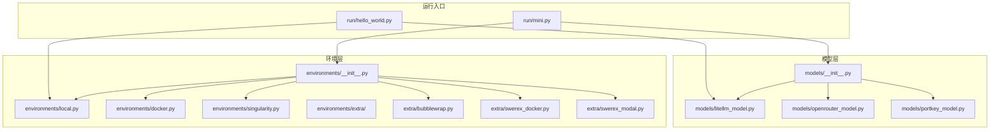
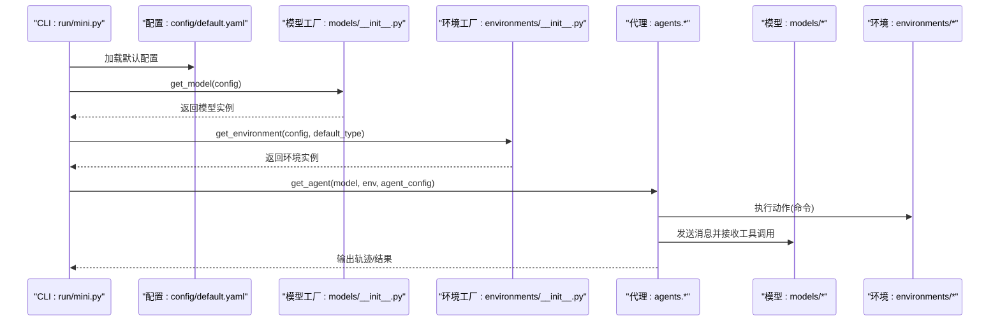
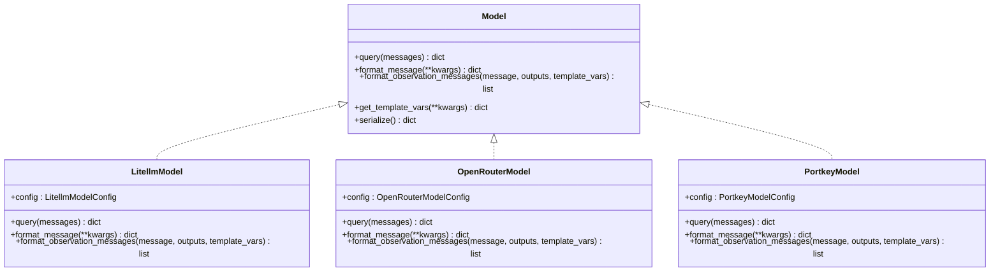
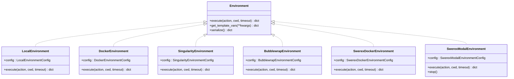
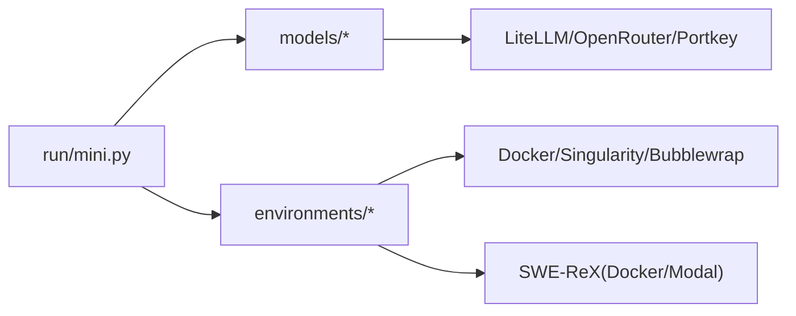

# 扩展开发

<cite>
**本文引用的文件**
- [workplace/src/minisweagent/environments/__init__.py](file://workplace/src/minisweagent/environments/__init__.py)
- [workplace/src/minisweagent/environments/docker.py](file://workplace/src/minisweagent/environments/docker.py)
- [workplace/src/minisweagent/environments/singularity.py](file://workplace/src/minisweagent/environments/singularity.py)
- [workplace/src/minisweagent/environments/local.py](file://workplace/src/minisweagent/environments/local.py)
- [workplace/src/minisweagent/environments/extra/bubblewrap.py](file://workplace/src/minisweagent/environments/extra/bubblewrap.py)
- [workplace/src/minisweagent/environments/extra/swerex_docker.py](file://workplace/src/minisweagent/environments/extra/swerex_docker.py)
- [workplace/src/minisweagent/environments/extra/swerex_modal.py](file://workplace/src/minisweagent/environments/extra/swerex_modal.py)
- [workplace/src/minisweagent/models/__init__.py](file://workplace/src/minisweagent/models/__init__.py)
- [workplace/src/minisweagent/models/litellm_model.py](file://workplace/src/minisweagent/models/litellm_model.py)
- [workplace/src/minisweagent/models/openrouter_model.py](file://workplace/src/minisweagent/models/openrouter_model.py)
- [workplace/src/minisweagent/models/portkey_model.py](file://workplace/src/minisweagent/models/portkey_model.py)
- [workplace/src/minisweagent/run/mini.py](file://workplace/src/minisweagent/run/mini.py)
- [workplace/src/minisweagent/run/hello_world.py](file://workplace/src/minisweagent/run/hello_world.py)
- [workplace/src/minisweagent/config/default.yaml](file://workplace/src/minisweagent/config/default.yaml)
- [workplace/tests/environments/test_docker.py](file://workplace/tests/environments/test_docker.py)
- [workplace/tests/environments/test_singularity.py](file://workplace/tests/environments/test_singularity.py)
- [workplace/tests/environments/test_local.py](file://workplace/tests/environments/test_local.py)
</cite>

## 目录
1. [简介](#简介)
2. [项目结构](#项目结构)
3. [核心组件](#核心组件)
4. [架构总览](#架构总览)
5. [详细组件分析](#详细组件分析)
6. [依赖关系分析](#依赖关系分析)
7. [性能考量](#性能考量)
8. [故障排查指南](#故障排查指南)
9. [结论](#结论)
10. [附录](#附录)

## 简介
本指南面向希望为 Repo Dockerizer Agent（mini-SWE-agent）进行扩展开发的工程师与研究者，系统讲解如何：
- 新增 LLM 提供商（模型适配器）
- 扩展新的执行环境（Docker、Singularity、Bubblewrap、SWE-ReX 等）
- 设计与实现新功能模块（遵循接口规范与最佳实践）
- 合理使用 extra 目录组织实验性或第三方集成
- 组件间集成与注意事项
- 实际扩展示例与测试验证方法

目标是帮助你在不破坏现有架构的前提下，快速、安全地引入新能力。

## 项目结构
该项目采用“按职责分层 + 模块化目录”的组织方式：
- environments：执行环境抽象与实现（本地、Docker、Singularity、Bubblewrap、SWE-ReX）
- models：LLM 抽象与多种提供商适配（LiteLLM、OpenRouter、Portkey 等）
- run：命令行入口与运行脚本
- config：默认配置模板
- tests：针对各环境与模型的测试用例

图表来源
- [workplace/src/minisweagent/run/mini.py](file://workplace/src/minisweagent/run/mini.py#L1-L110)
- [workplace/src/minisweagent/run/hello_world.py](file://workplace/src/minisweagent/run/hello_world.py#L1-L43)
- [workplace/src/minisweagent/models/__init__.py](file://workplace/src/minisweagent/models/__init__.py#L1-L114)
- [workplace/src/minisweagent/environments/__init__.py](file://workplace/src/minisweagent/environments/__init__.py#L1-L33)

章节来源
- [workplace/src/minisweagent/run/mini.py](file://workplace/src/minisweagent/run/mini.py#L1-L110)
- [workplace/src/minisweagent/run/hello_world.py](file://workplace/src/minisweagent/run/hello_world.py#L1-L43)
- [workplace/src/minisweagent/models/__init__.py](file://workplace/src/minisweagent/models/__init__.py#L1-L114)
- [workplace/src/minisweagent/environments/__init__.py](file://workplace/src/minisweagent/environments/__init__.py#L1-L33)

## 核心组件
- 模型选择与工厂
  - 通过统一入口选择模型类，支持名称映射与显式类名覆盖；默认使用 LiteLLM 适配器。
- 环境选择与工厂
  - 通过统一入口解析环境类型，支持内置与 extra 中的扩展环境。
- 运行脚本
  - 提供 CLI 入口，负责合并配置、实例化模型与环境、启动代理并输出轨迹。

章节来源
- [workplace/src/minisweagent/models/__init__.py](file://workplace/src/minisweagent/models/__init__.py#L45-L114)
- [workplace/src/minisweagent/environments/__init__.py](file://workplace/src/minisweagent/environments/__init__.py#L18-L33)
- [workplace/src/minisweagent/run/mini.py](file://workplace/src/minisweagent/run/mini.py#L66-L105)

## 架构总览
下图展示了从 CLI 到模型与环境的调用链路，以及配置合并与序列化的流程。

图表来源
- [workplace/src/minisweagent/run/mini.py](file://workplace/src/minisweagent/run/mini.py#L66-L105)
- [workplace/src/minisweagent/config/default.yaml](file://workplace/src/minisweagent/config/default.yaml#L1-L167)
- [workplace/src/minisweagent/models/__init__.py](file://workplace/src/minisweagent/models/__init__.py#L45-L114)
- [workplace/src/minisweagent/environments/__init__.py](file://workplace/src/minisweagent/environments/__init__.py#L18-L33)

## 详细组件分析

### 模型层扩展指南（新增 LLM 提供商）
新增模型提供商需要满足以下关键点：
- 定义配置类（Pydantic BaseModel），承载模型参数与行为开关
- 实现查询方法，封装对外 API 调用与错误处理
- 实现消息格式化与观察消息拼接方法，确保工具调用与执行输出正确对接
- 可选：成本追踪与缓存控制等增强能力
- 在模型工厂中注册映射或默认策略

图表来源
- [workplace/src/minisweagent/models/litellm_model.py](file://workplace/src/minisweagent/models/litellm_model.py#L48-L148)
- [workplace/src/minisweagent/models/openrouter_model.py](file://workplace/src/minisweagent/models/openrouter_model.py#L54-L169)
- [workplace/src/minisweagent/models/portkey_model.py](file://workplace/src/minisweagent/models/portkey_model.py#L64-L198)

扩展步骤（以新增提供商为例）：
1. 在 models 目录新增适配器文件，定义配置类与模型类
2. 在 models/__init__.py 的映射表中注册新模型类（或在工厂逻辑中支持名称映射）
3. 若需成本追踪，参考现有实现注册模型元数据或使用 LiteLLM 成本计算
4. 编写单元测试，覆盖查询、错误处理、观察消息拼接等路径
5. 在 CLI 或配置中通过 model_class 或 model_name 指定新模型

章节来源
- [workplace/src/minisweagent/models/__init__.py](file://workplace/src/minisweagent/models/__init__.py#L78-L114)
- [workplace/src/minisweagent/models/litellm_model.py](file://workplace/src/minisweagent/models/litellm_model.py#L26-L148)
- [workplace/src/minisweagent/models/openrouter_model.py](file://workplace/src/minisweagent/models/openrouter_model.py#L24-L169)
- [workplace/src/minisweagent/models/portkey_model.py](file://workplace/src/minisweagent/models/portkey_model.py#L32-L198)

### 环境层扩展指南（新增执行环境）
新增执行环境需实现统一接口：
- 配置类（BaseModel）：描述可配置项（工作目录、超时、环境变量转发等）
- execute(action, cwd, timeout)：执行命令并返回结构化输出
- get_template_vars(**kwargs)：用于模板渲染的变量注入
- serialize()：序列化当前环境配置信息
- 清理资源（cleanup 或析构）

图表来源
- [workplace/src/minisweagent/environments/local.py](file://workplace/src/minisweagent/environments/local.py#L18-L80)
- [workplace/src/minisweagent/environments/docker.py](file://workplace/src/minisweagent/environments/docker.py#L45-L162)
- [workplace/src/minisweagent/environments/singularity.py](file://workplace/src/minisweagent/environments/singularity.py#L37-L140)
- [workplace/src/minisweagent/environments/extra/bubblewrap.py](file://workplace/src/minisweagent/environments/extra/bubblewrap.py#L69-L152)
- [workplace/src/minisweagent/environments/extra/swerex_docker.py](file://workplace/src/minisweagent/environments/extra/swerex_docker.py#L22-L81)
- [workplace/src/minisweagent/environments/extra/swerex_modal.py](file://workplace/src/minisweagent/environments/extra/swerex_modal.py#L34-L91)

扩展步骤（以新增容器环境为例）：
1. 在 environments/extra 下新增文件，定义配置类与环境类
2. 在 environments/__init__.py 的映射表中注册新环境类型
3. 编写单元测试，覆盖命令执行、环境变量、工作目录、超时、清理等场景
4. 在 CLI 或配置中通过 environment_class 指定新环境

章节来源
- [workplace/src/minisweagent/environments/__init__.py](file://workplace/src/minisweagent/environments/__init__.py#L8-L26)
- [workplace/src/minisweagent/environments/extra/bubblewrap.py](file://workplace/src/minisweagent/environments/extra/bubblewrap.py#L29-L152)
- [workplace/src/minisweagent/environments/extra/swerex_docker.py](file://workplace/src/minisweagent/environments/extra/swerex_docker.py#L12-L81)
- [workplace/src/minisweagent/environments/extra/swerex_modal.py](file://workplace/src/minisweagent/environments/extra/swerex_modal.py#L9-L91)

### extra 目录使用指南
- 用途：存放实验性、第三方集成或非核心但可复用的环境/模型实现
- 命名建议：以提供商或技术栈命名（如 swerex_docker、bubblewrap）
- 注册方式：在 environments/__init__.py 的映射表中添加条目
- 版本兼容：通过环境工厂的字符串到类名解析，避免硬编码导入路径

章节来源
- [workplace/src/minisweagent/environments/__init__.py](file://workplace/src/minisweagent/environments/__init__.py#L8-L26)
- [workplace/src/minisweagent/environments/extra/bubblewrap.py](file://workplace/src/minisweagent/environments/extra/bubblewrap.py#L1-L12)
- [workplace/src/minisweagent/environments/extra/swerex_docker.py](file://workplace/src/minisweagent/environments/extra/swerex_docker.py#L1-L11)
- [workplace/src/minisweagent/environments/extra/swerex_modal.py](file://workplace/src/minisweagent/environments/extra/swerex_modal.py#L1-L11)

### 组件间集成与注意事项
- 工厂模式解耦：通过 get_model/get_environment 解析字符串或类名，降低耦合度
- 配置合并：CLI 将多个配置源递归合并，确保用户覆盖优先级清晰
- 序列化与轨迹：环境与模型均提供 serialize 方法，便于保存运行轨迹
- 错误处理：统一返回结构化输出（含 returncode、exception_info、extra），便于上层处理

章节来源
- [workplace/src/minisweagent/models/__init__.py](file://workplace/src/minisweagent/models/__init__.py#L45-L114)
- [workplace/src/minisweagent/environments/__init__.py](file://workplace/src/minisweagent/environments/__init__.py#L18-L33)
- [workplace/src/minisweagent/run/mini.py](file://workplace/src/minisweagent/run/mini.py#L70-L92)

### 实际扩展示例

#### 示例一：新增 Docker 提供商（LiteLLM）
- 步骤
  1) 在 models 目录新增适配器文件，定义配置类与查询方法
  2) 在 models/__init__.py 的映射表中注册新模型类
  3) 在 CLI 中通过 --model-class 或配置指定新模型
- 测试
  - 参考现有模型测试风格，覆盖查询、错误处理、成本追踪等

章节来源
- [workplace/src/minisweagent/models/litellm_model.py](file://workplace/src/minisweagent/models/litellm_model.py#L26-L148)
- [workplace/src/minisweagent/models/__init__.py](file://workplace/src/minisweagent/models/__init__.py#L78-L114)

#### 示例二：新增 Bubblewrap 环境
- 步骤
  1) 在 environments/extra/bubblewrap.py 实现配置类与环境类
  2) 在 environments/__init__.py 的映射表中注册
  3) 在 CLI 中通过 --environment-class 指定
- 测试
  - 参考 test_docker.py/test_singularity.py/test_local.py 的测试风格，覆盖命令执行、环境变量、工作目录、超时、清理等

章节来源
- [workplace/src/minisweagent/environments/extra/bubblewrap.py](file://workplace/src/minisweagent/environments/extra/bubblewrap.py#L29-L152)
- [workplace/src/minisweagent/environments/__init__.py](file://workplace/src/minisweagent/environments/__init__.py#L8-L26)
- [workplace/tests/environments/test_docker.py](file://workplace/tests/environments/test_docker.py#L44-L231)
- [workplace/tests/environments/test_singularity.py](file://workplace/tests/environments/test_singularity.py#L20-L180)
- [workplace/tests/environments/test_local.py](file://workplace/tests/environments/test_local.py#L11-L203)

## 依赖关系分析
- 模型层依赖
  - LiteLLM：统一 API 调用与成本计算
  - OpenRouter：HTTP 接口与错误分类
  - Portkey：虚拟键/提供商路由与成本计算
- 环境层依赖
  - Docker/Singularity/Bubblewrap：子进程调用宿主工具
  - SWE-ReX：Modal/Docker 远程沙箱运行时
- CLI 依赖
  - Typer：命令行解析
  - Rich：输出美化
  - YAML：配置加载与合并

图表来源
- [workplace/src/minisweagent/run/mini.py](file://workplace/src/minisweagent/run/mini.py#L1-L110)
- [workplace/src/minisweagent/models/litellm_model.py](file://workplace/src/minisweagent/models/litellm_model.py#L1-L148)
- [workplace/src/minisweagent/models/openrouter_model.py](file://workplace/src/minisweagent/models/openrouter_model.py#L1-L169)
- [workplace/src/minisweagent/models/portkey_model.py](file://workplace/src/minisweagent/models/portkey_model.py#L1-L198)
- [workplace/src/minisweagent/environments/docker.py](file://workplace/src/minisweagent/environments/docker.py#L1-L162)
- [workplace/src/minisweagent/environments/singularity.py](file://workplace/src/minisweagent/environments/singularity.py#L1-L140)
- [workplace/src/minisweagent/environments/extra/bubblewrap.py](file://workplace/src/minisweagent/environments/extra/bubblewrap.py#L1-L152)
- [workplace/src/minisweagent/environments/extra/swerex_docker.py](file://workplace/src/minisweagent/environments/extra/swerex_docker.py#L1-L81)
- [workplace/src/minisweagent/environments/extra/swerex_modal.py](file://workplace/src/minisweagent/environments/extra/swerex_modal.py#L1-L91)

章节来源
- [workplace/src/minisweagent/run/mini.py](file://workplace/src/minisweagent/run/mini.py#L1-L110)
- [workplace/src/minisweagent/models/__init__.py](file://workplace/src/minisweagent/models/__init__.py#L1-L114)
- [workplace/src/minisweagent/environments/__init__.py](file://workplace/src/minisweagent/environments/__init__.py#L1-L33)

## 性能考量
- 超时与资源管理
  - 为每个环境设置合理 timeout，避免长时间阻塞
  - 容器环境注意镜像拉取超时与容器生命周期管理
- 成本控制
  - 使用全局统计与成本追踪，结合环境变量限制总成本/调用次数
- I/O 与输出截断
  - 观察消息模板对大输出进行截断，避免内存与传输压力

章节来源
- [workplace/src/minisweagent/models/__init__.py](file://workplace/src/minisweagent/models/__init__.py#L13-L42)
- [workplace/src/minisweagent/config/default.yaml](file://workplace/src/minisweagent/config/default.yaml#L114-L141)

## 故障排查指南
- 常见问题
  - 环境不可用：检查 Docker/Podman/Singularity/Bubblewrap 是否安装与可用
  - API 认证失败：确认密钥环境变量是否正确设置
  - 超时与异常：查看返回结构化输出中的 exception_info 与 extra 字段
- 排查建议
  - 使用最小可复现脚本（参考 hello_world.py）
  - 逐步缩小范围：先验证环境，再验证模型
  - 查看序列化输出，定位具体步骤与错误上下文

章节来源
- [workplace/tests/environments/test_docker.py](file://workplace/tests/environments/test_docker.py#L10-L26)
- [workplace/tests/environments/test_singularity.py](file://workplace/tests/environments/test_singularity.py#L10-L17)
- [workplace/tests/environments/test_local.py](file://workplace/tests/environments/test_local.py#L105-L112)
- [workplace/src/minisweagent/run/hello_world.py](file://workplace/src/minisweagent/run/hello_world.py#L20-L38)

## 结论
通过统一的工厂接口与清晰的目录结构，mini-SWE-agent 支持以最小代价扩展新的 LLM 提供商与执行环境。建议遵循：
- 明确的配置类与最小接口契约
- 完整的测试覆盖与错误处理
- 合理使用 extra 目录承载实验性能力
- 严格的成本与超时控制

## 附录

### 扩展清单与最佳实践
- 新增模型提供商
  - 定义配置类与模型类，实现查询与格式化方法
  - 在工厂映射中注册，编写单元测试
- 新增执行环境
  - 实现 execute、get_template_vars、serialize、清理
  - 在工厂映射中注册，编写集成测试
- extra 目录
  - 仅放置非核心或实验性能力
  - 保持与主干一致的接口与测试标准

章节来源
- [workplace/src/minisweagent/models/__init__.py](file://workplace/src/minisweagent/models/__init__.py#L78-L114)
- [workplace/src/minisweagent/environments/__init__.py](file://workplace/src/minisweagent/environments/__init__.py#L8-L26)