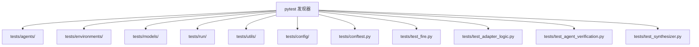
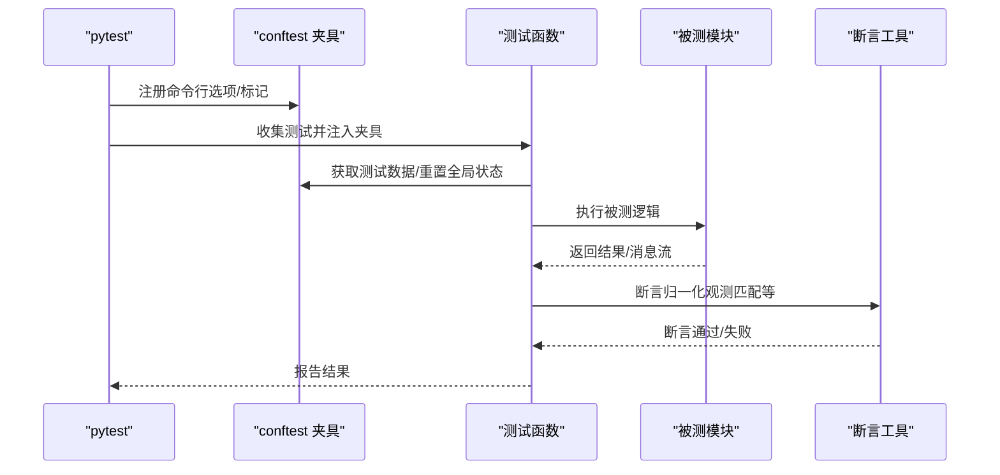
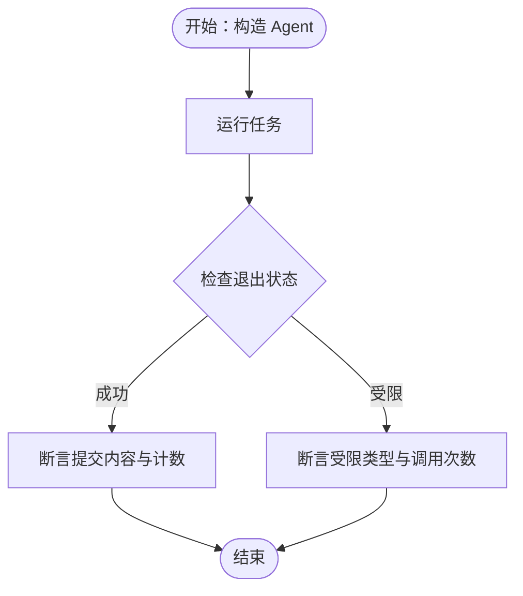
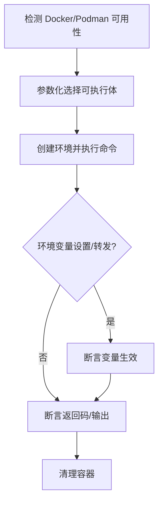
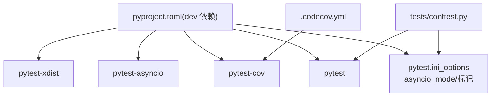

# 测试策略

<cite>
**本文引用的文件**
- [workplace/pyproject.toml](file://workplace/pyproject.toml)
- [workplace/tests/conftest.py](file://workplace/tests/conftest.py)
- [workplace/tests/test_fire.py](file://workplace/tests/test_fire.py)
- [workplace/tests/agents/test_default.py](file://workplace/tests/agents/test_default.py)
- [workplace/tests/environments/test_docker.py](file://workplace/tests/environments/test_docker.py)
- [workplace/tests/models/test_litellm_model.py](file://workplace/tests/models/test_litellm_model.py)
- [workplace/tests/run/test_run_hello_world.py](file://workplace/tests/run/test_run_hello_world.py)
- [workplace/.github/.codecov.yml](file://workplace/.github/.codecov.yml)
- [tests/test_adapter_logic.py](file://tests/test_adapter_logic.py)
- [tests/test_agent_verification.py](file://tests/test_agent_verification.py)
- [tests/test_synthesizer.py](file://tests/test_synthesizer.py)
- [multi_docker_eval_adapter.py](file://multi_docker_eval_adapter.py)
- [agent.py](file://agent.py)
- [src/synthesizer.py](file://src/synthesizer.py)
</cite>

## 更新摘要
**变更内容**
- 新增三个核心测试套件：test_adapter_logic.py、test_agent_verification.py、test_synthesizer.py
- 扩展测试覆盖范围，涵盖适配器逻辑、代理验证系统和合成器功能
- 增强平台检测能力和测试命令推理系统的可靠性保证

## 目录
1. [引言](#引言)
2. [项目结构](#项目结构)
3. [核心组件](#核心组件)
4. [架构总览](#架构总览)
5. [详细组件分析](#详细组件分析)
6. [依赖关系分析](#依赖关系分析)
7. [性能考量](#性能考量)
8. [故障排查指南](#故障排查指南)
9. [结论](#结论)
10. [附录](#附录)

## 引言
本文件系统化阐述 Repo Dockerizer Agent 的测试策略与实践，覆盖测试架构、pytest 配置与测试发现机制、单元/集成/端到端测试的分类与实施方法、测试组织结构（agents、environments、models、run 等模块）、测试编写指南（数据准备、模拟对象、断言策略）、并行测试执行（pytest -n auto）的配置与优势、覆盖率与质量标准，以及调试与常见问题解决方案。

**更新** 新增了针对适配器逻辑、代理验证系统和合成器功能的专业测试套件，确保新验证系统和平台检测能力的可靠性。

## 项目结构
测试代码位于 workplace/tests 目录下，按功能域划分为 agents、environments、models、run、utils、config 等子包，并在 tests 根目录提供通用夹具与辅助函数。pytest 通过默认的测试发现规则自动收集 tests 下的以 test_ 前缀命名的模块与函数。

**更新** 新增了三个专门的测试套件：
- `test_adapter_logic.py`：测试 MultiDockerEvalAdapter 的核心逻辑
- `test_agent_verification.py`：测试 DockerAgent 的验证聚合功能
- `test_synthesizer.py`：测试 Synthesizer 的命令分析和测试识别能力

- 测试组织要点
  - 按模块划分：agents、environments、models、run、utils、config、adapter
  - 公共夹具与工具：tests/conftest.py 提供全局夹具、命令行选项注册、轨迹数据加载与观测断言工具
  - 火测试（真实 API 调用）：tests/test_fire.py，需显式启用标志
  - 覆盖率与质量门禁：通过 .codecov.yml 设置覆盖率阈值与忽略规则

**图表来源**
- [workplace/tests/conftest.py:1-112](file://workplace/tests/conftest.py#L1-L112)
- [workplace/tests/test_fire.py:1-160](file://workplace/tests/test_fire.py#L1-L160)
- [tests/test_adapter_logic.py:1-198](file://tests/test_adapter_logic.py#L1-L198)
- [tests/test_agent_verification.py:1-54](file://tests/test_agent_verification.py#L1-L54)
- [tests/test_synthesizer.py:1-134](file://tests/test_synthesizer.py#L1-L134)

**章节来源**
- [workplace/tests/conftest.py:1-112](file://workplace/tests/conftest.py#L1-L112)
- [workplace/tests/test_fire.py:1-160](file://workplace/tests/test_fire.py#L1-L160)
- [tests/test_adapter_logic.py:1-198](file://tests/test_adapter_logic.py#L1-L198)
- [tests/test_agent_verification.py:1-54](file://tests/test_agent_verification.py#L1-L54)
- [tests/test_synthesizer.py:1-134](file://tests/test_synthesizer.py#L1-L134)

## 核心组件
- pytest 配置与发现
  - asyncio 模式与默认夹具循环作用域在 pyproject.toml 中集中配置
  - 自定义命令行选项：--run-fire 控制火测试是否执行
  - 标记：slow 用于标注耗时测试
- 全局状态安全与隔离
  - 使用线程锁保护全局模型统计，确保多线程/并发测试下的隔离性
- 测试数据与断言工具
  - 从轨迹 JSON 加载期望输出与观测序列
  - 观测断言工具对输出进行归一化处理后比较
- 火测试（真实 API）
  - 仅在显式传入 --run-fire 时执行，且需要对应提供商的环境变量

**更新** 新增了针对适配器、验证系统和合成器的专用测试组件，确保核心功能的可靠性。

**章节来源**
- [workplace/pyproject.toml:268-274](file://workplace/pyproject.toml#L268-L274)
- [workplace/tests/conftest.py:11-18](file://workplace/tests/conftest.py#L11-L18)
- [workplace/tests/conftest.py:21-40](file://workplace/tests/conftest.py#L21-L40)
- [workplace/tests/conftest.py:42-62](file://workplace/tests/conftest.py#L42-L62)
- [workplace/tests/conftest.py:65-71](file://workplace/tests/conftest.py#L65-L71)
- [workplace/tests/conftest.py:74-100](file://workplace/tests/conftest.py#L74-L100)
- [workplace/tests/test_fire.py:29-39](file://workplace/tests/test_fire.py#L29-L39)

## 架构总览
下图展示测试执行的关键流程：pytest 发现与收集、夹具注入、测试执行、断言与报告。

**图表来源**
- [workplace/tests/conftest.py:11-18](file://workplace/tests/conftest.py#L11-L18)
- [workplace/tests/conftest.py:25-40](file://workplace/tests/conftest.py#L25-L40)
- [workplace/tests/conftest.py:42-62](file://workplace/tests/conftest.py#L42-L62)
- [workplace/tests/conftest.py:74-100](file://workplace/tests/conftest.py#L74-L100)

## 详细组件分析

### 测试分类与实施方法
- 单元测试（Unit）
  - 针对单个类或函数的行为验证，常使用 patch/magic mock 模拟外部依赖
  - 示例：模型层的工具调用解析、成本计算、消息格式化等
- 集成测试（Integration）
  - 关注组件间协作，如 Docker/Podman 容器环境中的命令执行、环境变量传递、超时控制等
- 端到端测试（E2E）
  - 覆盖完整流程，从 CLI 到最终提交，结合确定性模型与真实环境夹具，验证消息序列与观测一致性

**更新** 新增了针对适配器逻辑、验证系统和合成器的专门测试分类：

- 适配器逻辑测试（Adapter Logic Tests）
  - 验证 MultiDockerEvalAdapter 的核心功能，包括平台支持检测、测试命令推理、重建命令生成等
- 代理验证测试（Agent Verification Tests）
  - 测试 DockerAgent 的验证聚合功能，确保连续验证块的正确维护
- 合成器测试（Synthesizer Tests）
  - 验证 Synthesizer 的命令分析能力，包括测试命令识别、设置命令提取、观察分析等

**章节来源**
- [workplace/tests/models/test_litellm_model.py:1-79](file://workplace/tests/models/test_litellm_model.py#L1-L79)
- [workplace/tests/environments/test_docker.py:1-231](file://workplace/tests/environments/test_docker.py#L1-L231)
- [workplace/tests/run/test_run_hello_world.py:1-47](file://workplace/tests/run/test_run_hello_world.py#L1-L47)
- [tests/test_adapter_logic.py:1-198](file://tests/test_adapter_logic.py#L1-L198)
- [tests/test_agent_verification.py:1-54](file://tests/test_agent_verification.py#L1-L54)
- [tests/test_synthesizer.py:1-134](file://tests/test_synthesizer.py#L1-L134)

### agents 模块测试
- 覆盖点
  - 成功完成、步数限制、费用限制、超时处理、多步任务、自定义配置、模板渲染、时间戳、消息历史、空动作处理等
- 方法论
  - 使用 DeterministicModel/DeterministicToolcallModel 等确定性模型驱动 agent 行为
  - 通过构造不同响应与动作序列，验证 agent 的终止条件、观测捕获与消息结构

**图表来源**
- [workplace/tests/agents/test_default.py:129-150](file://workplace/tests/agents/test_default.py#L129-L150)
- [workplace/tests/agents/test_default.py:152-182](file://workplace/tests/agents/test_default.py#L152-L182)

**章节来源**
- [workplace/tests/agents/test_default.py:1-426](file://workplace/tests/agents/test_default.py#L1-L426)

### environments 模块测试
- 覆盖点
  - Docker/Podman 可用性检测、容器配置默认值、环境变量设置与转发、工作目录切换、命令失败捕获、容器超时控制
- 方法论
  - 使用 subprocess 调用 docker/podman 并捕获异常；通过 patch.dict 模拟宿主机环境变量；参数化测试覆盖两种可执行体

**图表来源**
- [workplace/tests/environments/test_docker.py:10-26](file://workplace/tests/environments/test_docker.py#L10-L26)
- [workplace/tests/environments/test_docker.py:43-68](file://workplace/tests/environments/test_docker.py#L43-L68)
- [workplace/tests/environments/test_docker.py:92-113](file://workplace/tests/environments/test_docker.py#L92-L113)

**章节来源**
- [workplace/tests/environments/test_docker.py:1-231](file://workplace/tests/environments/test_docker.py#L1-L231)

### models 模块测试
- 覆盖点
  - 模型配置默认项、工具调用解析、无工具调用时的格式错误、观测消息格式化、无动作时的空处理
- 方法论
  - 使用 MagicMock 模拟外部 completion/cost_calculator 接口，断言工具列表、动作解析、错误抛出与消息格式化

**章节来源**
- [workplace/tests/models/test_litellm_model.py:1-79](file://workplace/tests/models/test_litellm_model.py#L1-L79)

### run 模块测试
- 覆盖点
  - hello_world 端到端流程：从 CLI 主程序到最终提交，结合真实环境夹具与确定性模型，断言消息总数、观测序列与步骤数
- 方法论
  - patch 模型类与环境变量，注入固定响应序列；使用断言工具进行观测匹配

**章节来源**
- [workplace/tests/run/test_run_hello_world.py:1-47](file://workplace/tests/run/test_run_hello_world.py#L1-L47)

### 适配器逻辑测试（新增）
- 覆盖点
  - Windows 平台特定实例的跳过逻辑、C++ 重建命令推理、Java 重建命令推理、Rust 重建命令推理、Go 重建命令推理
  - 测试命令来源验证、Redis 服务设置、Docker RUN 指令标准化、C++ 重建命令从构建到评估脚本的迁移
- 方法论
  - 使用临时目录和临时文件模拟实际工作流程
  - 通过断言适配器输出的 Dockerfile、评估脚本和日志信息

**章节来源**
- [tests/test_adapter_logic.py:1-198](file://tests/test_adapter_logic.py#L1-L198)

### 代理验证测试（新增）
- 覆盖点
  - 最终连续验证块的聚合、环境变异对验证块的影响、非变异烟雾测试对验证块的保持
- 方法论
  - 通过模拟成功的动作记录，验证验证块的正确维护和失效机制

**章节来源**
- [tests/test_agent_verification.py:1-54](file://tests/test_agent_verification.py#L1-L54)

### 合成器测试（新增）
- 覆盖点
  - 测试命令提取、设置前缀处理、导航命令丢弃、运行时健康检查前缀丢弃、运行时服务段落剥离
  - Go 测试的有效性分析、PHPunit 检测、npm tap 进度输出的有效性
- 方法论
  - 通过分析测试运行的观察结果，验证测试命令的有效性判断

**章节来源**
- [tests/test_synthesizer.py:1-134](file://tests/test_synthesizer.py#L1-L134)

### 火测试（真实 API 集成）
- 特性
  - 仅在显式传入 --run-fire 时执行；需要各提供商的 API 密钥环境变量；测试覆盖多个模型类与提供商
- 方法论
  - 通过子进程调用 minisweagent CLI，设置重试与成本上限；断言返回码

**章节来源**
- [workplace/tests/test_fire.py:29-39](file://workplace/tests/test_fire.py#L29-L39)
- [workplace/tests/test_fire.py:49-66](file://workplace/tests/test_fire.py#L49-L66)
- [workplace/tests/test_fire.py:73-101](file://workplace/tests/test_fire.py#L73-L101)
- [workplace/tests/test_fire.py:108-129](file://workplace/tests/test_fire.py#L108-L129)
- [workplace/tests/test_fire.py:136-147](file://workplace/tests/test_fire.py#L136-L147)

## 依赖关系分析
- 测试框架与插件
  - pytest、pytest-asyncio、pytest-cov、pytest-xdist 在 dev 依赖中声明
  - pyproject.toml 中配置 asyncio_mode 与标记
- 覆盖率与质量门禁
  - .codecov.yml 将 tests/** 忽略在覆盖率统计之外，并设置项目整体目标阈值
- 测试发现与夹具
  - tests/conftest.py 提供全局夹具与命令行选项注册，影响所有测试模块

**图表来源**
- [workplace/pyproject.toml:50-77](file://workplace/pyproject.toml#L50-L77)
- [workplace/pyproject.toml:268-274](file://workplace/pyproject.toml#L268-L274)
- [workplace/.github/.codecov.yml:1-20](file://workplace/.github/.codecov.yml#L1-L20)

**章节来源**
- [workplace/pyproject.toml:50-77](file://workplace/pyproject.toml#L50-L77)
- [workplace/pyproject.toml:268-274](file://workplace/pyproject.toml#L268-L274)
- [workplace/.github/.codecov.yml:1-20](file://workplace/.github/.codecov.yml#L1-L20)

## 性能考量
- 并行测试执行（pytest -n auto）
  - 通过 pytest-xdist 实现跨进程并行，提升整体测试吞吐
  - 适用于 CPU 密集型与 I/O 密集型测试，但需注意共享资源（如 Docker/Podman）的并发访问与互斥
- 耗时测试标记
  - 使用 @pytest.mark.slow 标记耗时测试，便于选择性执行与 CI 分阶段运行
- 覆盖率与速度平衡
  - 通过 .codecov.yml 的阈值与忽略规则，避免测试套件因覆盖率统计而过度膨胀

**章节来源**
- [workplace/pyproject.toml:62-77](file://workplace/pyproject.toml#L62-L77)
- [workplace/tests/environments/test_docker.py:56-56](file://workplace/tests/environments/test_docker.py#L56-L56)

## 故障排查指南
- 火测试未执行
  - 现象：测试被跳过
  - 原因：未传入 --run-fire 或缺少对应提供商的环境变量
  - 处理：确认环境变量与命令行参数
- Docker/Podman 不可用导致测试跳过
  - 现象：相关测试被跳过
  - 原因：本地未安装或未运行 Docker/Podman
  - 处理：安装并启动对应容器引擎，或在 CI 中启用相应服务
- 观测断言失败
  - 现象：断言工具提示观测不匹配
  - 原因：输出包含时间戳、容器 ID 或空白规范化差异
  - 处理：使用断言工具提供的归一化逻辑，确保比较前去除无关字段
- 全局统计竞争条件
  - 现象：测试间出现全局统计污染
  - 原因：多线程/并发下共享状态未加锁
  - 处理：使用 reset_global_stats 夹具，确保测试前后重置并独占访问

**更新** 新增了针对新测试套件的故障排查指导：

- 适配器逻辑测试失败
  - 现象：平台检测或重建命令推理失败
  - 原因：Dockerfile 解析或测试补丁分析不正确
  - 处理：检查 Dockerfile 格式和测试补丁内容，验证正则表达式匹配
- 代理验证测试失败
  - 现象：验证块聚合或失效逻辑异常
  - 原因：环境变异检测或验证状态管理错误
  - 处理：检查命令变异检测逻辑和验证组状态更新
- 合成器测试失败
  - 现象：测试命令识别或观察分析错误
  - 原因：正则表达式模式或观察文本规范化问题
  - 处理：验证测试命令模式匹配和观察文本正则表达式

**章节来源**
- [workplace/tests/test_fire.py:34-39](file://workplace/tests/test_fire.py#L34-L39)
- [workplace/tests/environments/test_docker.py:10-26](file://workplace/tests/environments/test_docker.py#L10-L26)
- [workplace/tests/conftest.py:65-71](file://workplace/tests/conftest.py#L65-L71)
- [workplace/tests/conftest.py:25-40](file://workplace/tests/conftest.py#L25-L40)
- [tests/test_adapter_logic.py:1-198](file://tests/test_adapter_logic.py#L1-L198)
- [tests/test_agent_verification.py:1-54](file://tests/test_agent_verification.py#L1-L54)
- [tests/test_synthesizer.py:1-134](file://tests/test_synthesizer.py#L1-L134)

## 结论
本测试策略以 pytest 为核心，结合统一的夹具与断言工具，覆盖单元、集成与端到端场景。通过命令行选项与标记管理真实 API 集成测试，借助并行执行与覆盖率门禁保障效率与质量。

**更新** 新增的三个专业测试套件进一步强化了系统的可靠性：
- 适配器逻辑测试确保平台检测和重建命令推理的准确性
- 代理验证测试保证验证块聚合和失效机制的正确性
- 合成器测试验证命令分析和测试识别的核心能力

建议在 CI 中分阶段运行（跳过慢测试、先跑单元再跑集成），并在本地开发中优先使用确定性模型与最小化外部依赖，以获得稳定快速的反馈。

## 附录
- 测试编写最佳实践
  - 数据准备：优先使用 tests/test_data 中的轨迹数据，或通过 DeterministicModel 构造可控响应
  - 模拟对象：使用 unittest.mock.patch/MagicMock 隔离外部依赖，明确桩函数返回值
  - 断言策略：优先使用断言工具进行观测匹配与消息结构校验，必要时进行数值与计数断言
  - 并行注意事项：避免共享资源竞争，必要时使用锁或临时隔离目录/镜像
  - 新测试套件编写：遵循现有测试模式，使用临时目录和文件模拟真实工作流程
- 覆盖率与质量标准
  - 项目整体覆盖率目标由 .codecov.yml 设定，tests/** 目录被忽略统计
  - 建议在关键模块（agents、models、environments、adapter）保持较高覆盖率，逐步提升整体水平
  - 新增测试套件应覆盖核心业务逻辑和边界情况

**章节来源**
- [workplace/.github/.codecov.yml:1-20](file://workplace/.github/.codecov.yml#L1-L20)
- [workplace/tests/conftest.py:42-62](file://workplace/tests/conftest.py#L42-L62)
- [workplace/tests/models/test_litellm_model.py:15-22](file://workplace/tests/models/test_litellm_model.py#L15-L22)
- [tests/test_adapter_logic.py:1-198](file://tests/test_adapter_logic.py#L1-L198)
- [tests/test_agent_verification.py:1-54](file://tests/test_agent_verification.py#L1-L54)
- [tests/test_synthesizer.py:1-134](file://tests/test_synthesizer.py#L1-L134)