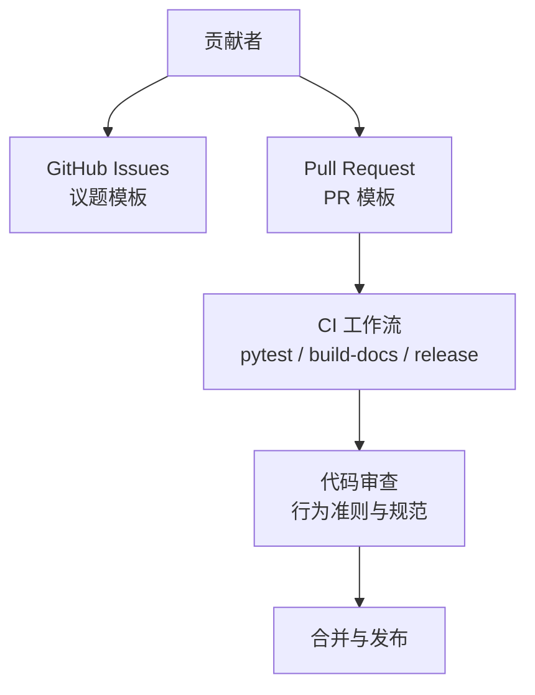
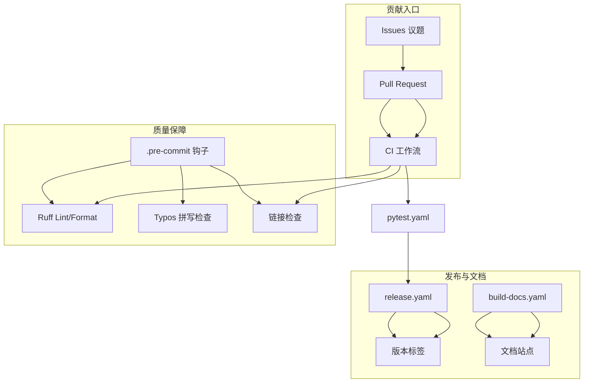
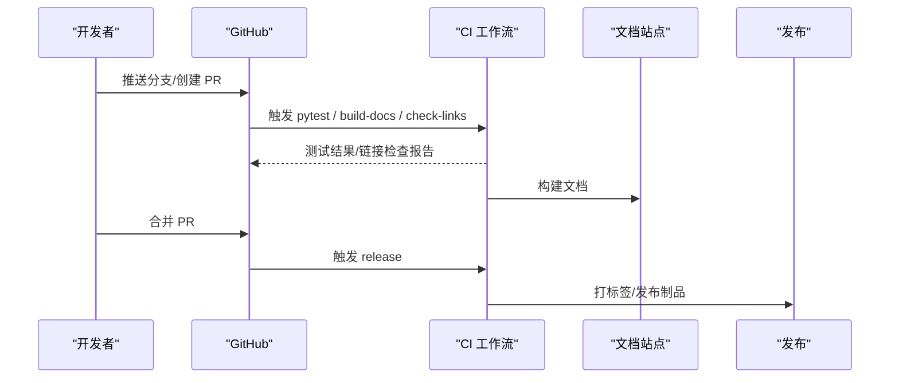
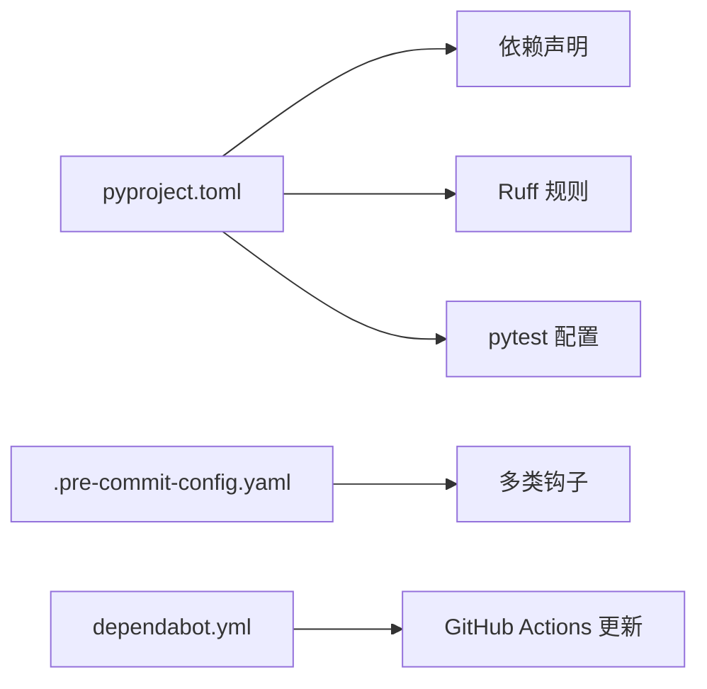

# 贡献流程

<cite>
**本文引用的文件**
- [CODE_OF_CONDUCT.md](file://workplace/.github/CODE_OF_CONDUCT.md)
- [contributing.md](file://workplace/docs/contributing.md)
- [PULL_REQUEST_TEMPLATE.md](file://workplace/.github/PULL_REQUEST_TEMPLATE.md)
- [dependabot.yml](file://workplace/.github/dependabot.yml)
- [.pre-commit-config.yaml](file://workplace/.pre-commit-config.yaml)
- [pyproject.toml](file://workplace/pyproject.toml)
- [README.md](file://workplace/README.md)
- [QuickStart.md](file://workplace/QuickStart.md)
- [docs/quickstart.md](file://workplace/docs/quickstart.md)
- [workflows/build-docs.yaml](file://workplace/.github/workflows/build-docs.yaml)
- [workflows/check-links-pr.yaml](file://workplace/.github/workflows/check-links-pr.yaml)
- [workflows/pytest.yaml](file://workplace/.github/workflows/pytest.yaml)
- [workflows/release.yaml](file://workplace/.github/workflows/release.yaml)
</cite>

## 目录
1. 引言
2. 项目结构
3. 核心组件
4. 架构总览
5. 详细组件分析
6. 依赖关系分析
7. 性能考虑
8. 故障排查指南
9. 结论
10. 附录

## 引言
本指南面向希望为 Repo Dockerizer Agent（mini-swe-agent）做出贡献的开发者，系统阐述从问题报告、功能请求到缺陷修复与合并请求（Pull Request，简称 PR）的完整协作流程；明确分支命名、提交信息格式、代码审查要求；统一代码风格、测试与文档更新标准；说明社区行为准则与沟通规范；并提供贡献者角色路径、发布与版本管理、以及持续集成/持续部署（CI/CD）工作流的实践建议。

## 项目结构
该仓库采用“多模块文档 + 源码 + 测试 + CI 工作流”的组织方式：
- 文档与贡献指南位于 workplace/docs 与 workplace/.github
- 源码位于 src/ 与 workplace/src/minisweagent
- 测试位于 workplace/tests
- CI 工作流位于 workplace/.github/workflows
- 开发工具与质量保障配置位于 workplace/.pre-commit-config.yaml、workplace/pyproject.toml 等

**章节来源**
- file://workplace/docs/contributing.md#L1-L32
- file://workplace/README.md#L1-L222

## 核心组件
- 行为准则：定义社区互动边界与执行机制，确保包容、尊重与安全的协作环境。
- 贡献指南：明确可贡献的方向、开发设置、测试与风格要求。
- PR 模板：标准化 PR 描述与关联议题的方式。
- 依赖与自动更新：通过 Dependabot 维护 GitHub Actions 依赖。
- 预提交钩子：统一代码检查、拼写校对与格式化（Ruff、Prettier、Typos）。
- 项目配置：pyproject.toml 定义依赖、脚本入口、lint 规则与测试标记等。

**章节来源**
- file://workplace/.github/CODE_OF_CONDUCT.md#L1-L132
- file://workplace/docs/contributing.md#L1-L32
- file://workplace/.github/PULL_REQUEST_TEMPLATE.md#L1-L8
- file://workplace/.github/dependabot.yml#L1-L8
- file://workplace/.pre-commit-config.yaml#L1-L38
- file://workplace/pyproject.toml#L1-L282

## 架构总览
下图展示贡献流程在仓库中的关键节点与自动化协同：

**图表来源**
- file://workplace/.github/workflows/pytest.yaml
- file://workplace/.github/workflows/build-docs.yaml
- file://workplace/.github/workflows/release.yaml
- file://workplace/.github/workflows/check-links-pr.yaml
- file://workplace/.pre-commit-config.yaml#L1-L38

## 详细组件分析

### 1) 问题报告与功能请求
- 使用 GitHub Issues 提交问题或功能请求，优先选择带有“good-first-issue”“help-wanted”等标识的议题，便于新贡献者入门。
- 在提交前，请确认是否已有类似议题；在描述中提供复现步骤、期望行为与实际行为、环境信息（操作系统、Python 版本、模型名称等）。
- 若涉及安全问题，请参考安全文档与联系方式进行私下披露。

**章节来源**
- file://workplace/docs/contributing.md#L11-L12
- file://workplace/README.md#L183-L191

### 2) 分支命名规范
- 建议使用清晰语义的短横线分隔命名，例如：
  - feat/xxx：新增功能
  - fix/xxx：缺陷修复
  - docs/xxx：文档更新
  - refactor/xxx：重构
  - test/xxx：测试补充
- 合理拆分小的变更，避免单个 PR 包含过多不相关的改动。

[本节为通用规范说明，无需特定文件引用]

### 3) 提交信息格式
- 建议采用以下结构，便于自动化处理与日志追踪：
  - 类型: 简要描述
  - 正文: 变更动机、影响范围、注意事项
  - 关联: Fixes #[issue编号] / Related #[issue编号]
- 保持首行简洁，正文段落缩进与换行清晰。

[本节为通用规范说明，无需特定文件引用]

### 4) Pull Request 创建与审查
- 在创建 PR 时，使用 PR 模板中的提示，填写变更摘要、关联议题、变更动机与影响范围。
- 确保通过所有 CI 检查（代码风格、链接检查、测试覆盖率等），并在必要时更新文档与测试。
- 至少一名维护者进行审查，审查意见应得到响应与修正后再合并。

**章节来源**
- file://workplace/.github/PULL_REQUEST_TEMPLATE.md#L1-L8

### 5) 代码风格与质量
- 预提交钩子强制执行多项检查与修复：
  - 文件大小、合并冲突、符号链接、行尾、私钥检测、末尾空白
  - 拼写检查（Typos）
  - Python 代码 Lint 与格式化（Ruff）
  - 非 Python 文档/样式（Prettier）
- 请在本地安装并启用 pre-commit，提交前先运行以自动修复可修复项。

**章节来源**
- file://workplace/.pre-commit-config.yaml#L1-L38
- file://workplace/pyproject.toml#L103-L246

### 6) 测试要求
- 使用 pytest 并支持并行执行（pytest-xdist），建议在本地运行 pytest -n auto 以加速。
- 新增功能或修复需配套单元测试；如涉及环境/部署差异，补充对应测试用例。
- 注意测试标记与慢测试隔离，避免阻塞 CI。

**章节来源**
- file://workplace/docs/contributing.md#L29-L29
- file://workplace/pyproject.toml#L268-L274

### 7) 文档更新
- 新功能或行为变更需同步更新相关文档与示例；遵循文档目录结构与写作风格。
- 文档构建由 CI 中的 build-docs 工作流负责，确保链接有效与渲染正常。

**章节来源**
- file://workplace/docs/contributing.md#L7-L11
- file://workplace/.github/workflows/build-docs.yaml

### 8) 社区行为准则与沟通规范
- 遵守 Contributor Covenant 行为准则，倡导尊重、包容、健康的社区氛围。
- 对不当行为的举报与处理流程清晰透明，社区领导有权移除或拒绝不符合规范的内容。

**章节来源**
- file://workplace/.github/CODE_OF_CONDUCT.md#L1-L132

### 9) 贡献者指南与角色路径
- 可贡献方向广泛：文档、示例、模型与环境支持、问题修复等。
- 开发设置与测试方法见快速开始与贡献指南；建议安装 dev 依赖与 pre-commit。
- 成为维护者的路径通常基于长期高质量贡献、审查反馈与社区影响力。

**章节来源**
- file://workplace/docs/contributing.md#L5-L31
- file://workplace/docs/quickstart.md#L89-L98

### 10) 发布流程与版本管理
- 依赖更新：通过 Dependabot 自动维护 GitHub Actions 依赖，减少过期风险。
- 版本标签与发布：由 release 工作流根据分支与标签触发，建议遵循语义化版本与变更日志。
- 文档发布：build-docs 工作流负责文档站点的构建与发布。

**章节来源**
- file://workplace/.github/dependabot.yml#L1-L8
- file://workplace/.github/workflows/release.yaml
- file://workplace/.github/workflows/build-docs.yaml

### 11) 持续集成与持续部署
- pytest 工作流：在 PR 与主分支上运行测试，支持并行与覆盖率统计。
- build-docs 工作流：构建与发布文档站点。
- check-links-pr 工作流：在 PR 上检查文档链接有效性，降低 broken link 风险。
- release 工作流：根据标签与分支策略触发发布流程。

**图表来源**
- file://workplace/.github/workflows/pytest.yaml
- file://workplace/.github/workflows/build-docs.yaml
- file://workplace/.github/workflows/check-links-pr.yaml
- file://workplace/.github/workflows/release.yaml

## 依赖关系分析
- 依赖管理与自动更新：pyproject.toml 定义核心与可选依赖；dependabot.yml 自动更新 GitHub Actions。
- 代码质量：.pre-commit-config.yaml 集成多类钩子，pyproject.toml 内置 Ruff lint/format 规则。
- 测试与并行：pytest 配置与 xdist 支持并行执行，提升效率。

**图表来源**
- file://workplace/pyproject.toml#L33-L77
- file://workplace/.pre-commit-config.yaml#L4-L38
- file://workplace/.github/dependabot.yml#L1-L8

**章节来源**
- file://workplace/pyproject.toml#L33-L77
- file://workplace/.pre-commit-config.yaml#L1-L38
- file://workplace/.github/dependabot.yml#L1-L8

## 性能考虑
- 测试并行：使用 pytest-xdist 并行执行，缩短 CI 时间。
- 预提交优化：在本地尽早发现并修复问题，减少 CI 失败重试成本。
- 文档构建：按需更新文档，避免不必要的大体积构建。

[本节为通用指导，无需特定文件引用]

## 故障排查指南
- 本地预提交失败
  - 确认已安装并启用 pre-commit；运行本地修复后再次提交。
  - 关注 Ruff Lint 与格式化、Typos 拼写检查、链接检查等输出。
- CI 测试失败
  - 在本地使用 pytest -n auto 复现；检查测试标记与慢测试隔离。
  - 查看具体平台与 Python 版本差异导致的兼容性问题。
- 文档链接失效
  - 使用 check-links-pr 工作流定位失效链接；更新或替换为稳定地址。
- 依赖冲突
  - 检查 pyproject.toml 与 dependabot.yml 的版本约束；必要时锁定版本或升级依赖。

**章节来源**
- file://workplace/.pre-commit-config.yaml#L1-L38
- file://workplace/.github/workflows/check-links-pr.yaml
- file://workplace/.github/workflows/pytest.yaml
- file://workplace/pyproject.toml#L268-L274

## 结论
通过统一的贡献流程、严格的代码质量与测试标准、完善的 CI/CD 协同，以及明确的行为准则与沟通规范，mini-swe-agent 项目能够高效地汇聚社区力量，持续迭代与演进。建议贡献者在提交前完成本地验证与文档更新，严格遵循分支与提交规范，并积极回应审查意见，共同维护健康、开放、高效的开源生态。

## 附录
- 快速开始与开发设置
  - 参考快速开始文档与 README 中的安装与运行说明。
- 贡献方向与设计原则
  - 参考贡献指南中的设计与架构要点，优先新增独立组件而非复杂化既有组件。
- API 与脚本入口
  - 参考 pyproject.toml 中的脚本入口与依赖声明，确保 CLI 与绑定可用。

**章节来源**
- file://workplace/README.md#L158-L191
- file://workplace/docs/quickstart.md#L66-L98
- file://workplace/pyproject.toml#L84-L88
- file://workplace/docs/contributing.md#L14-L23