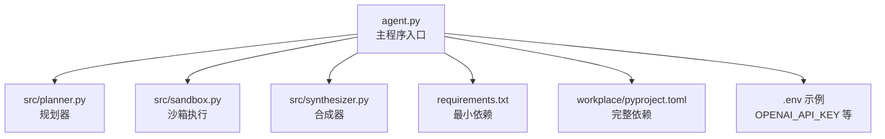
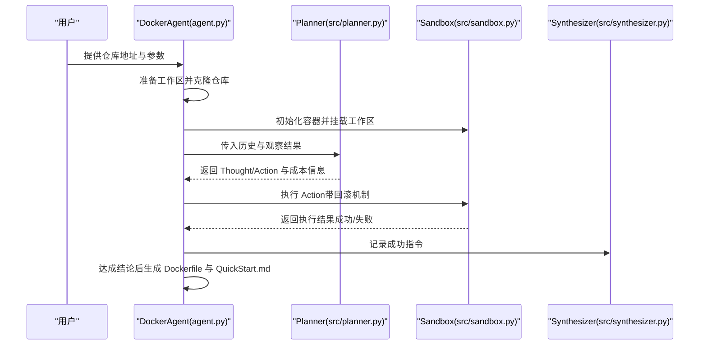
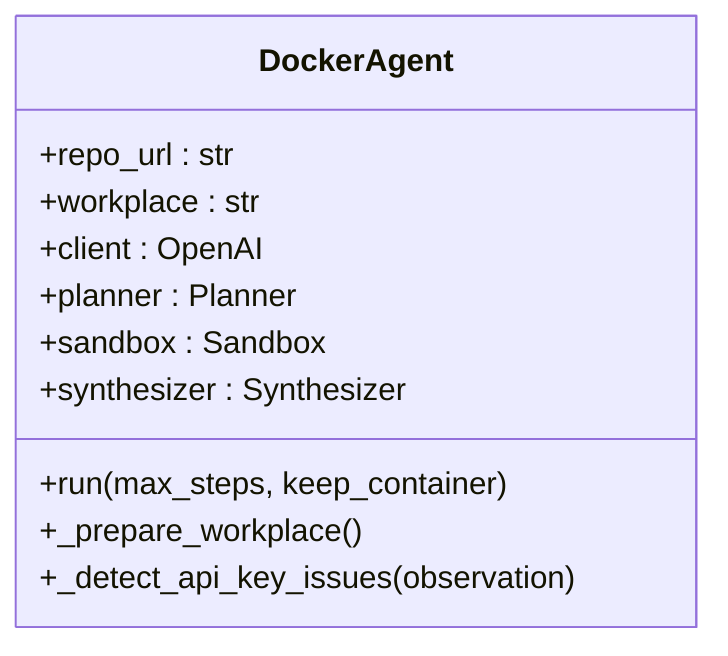
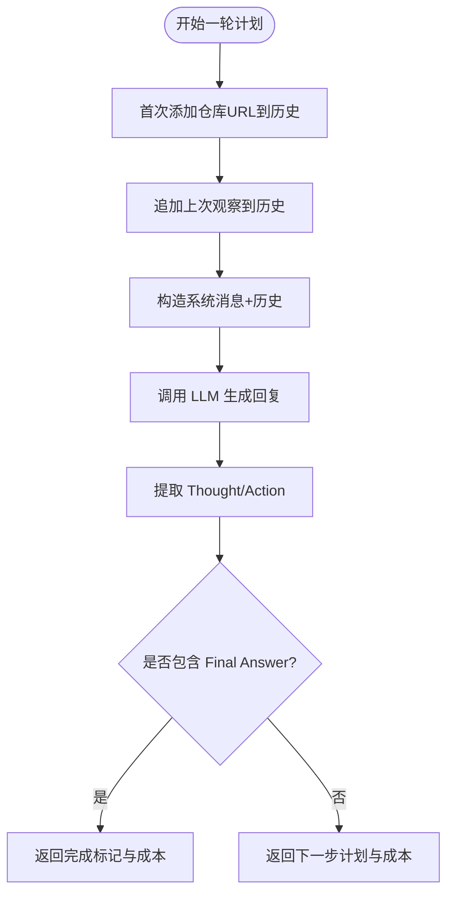
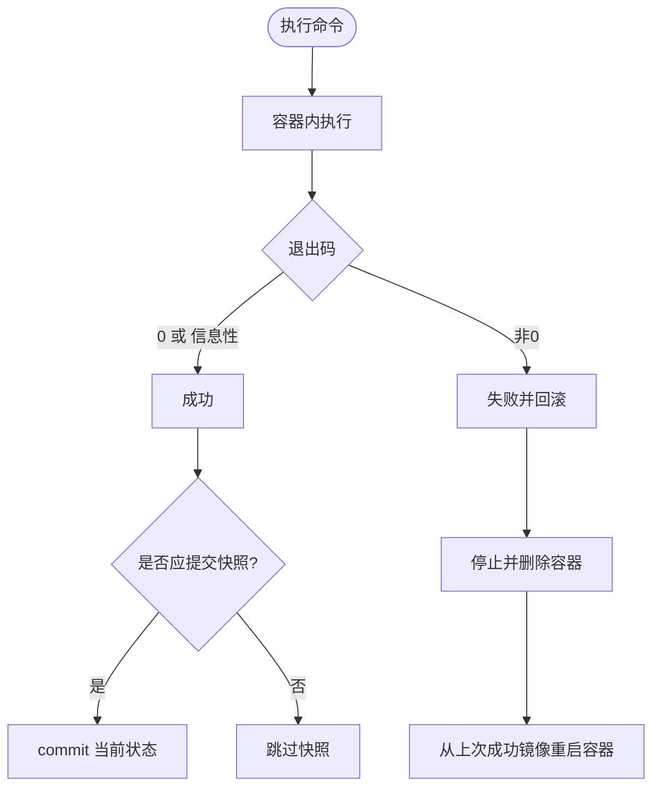
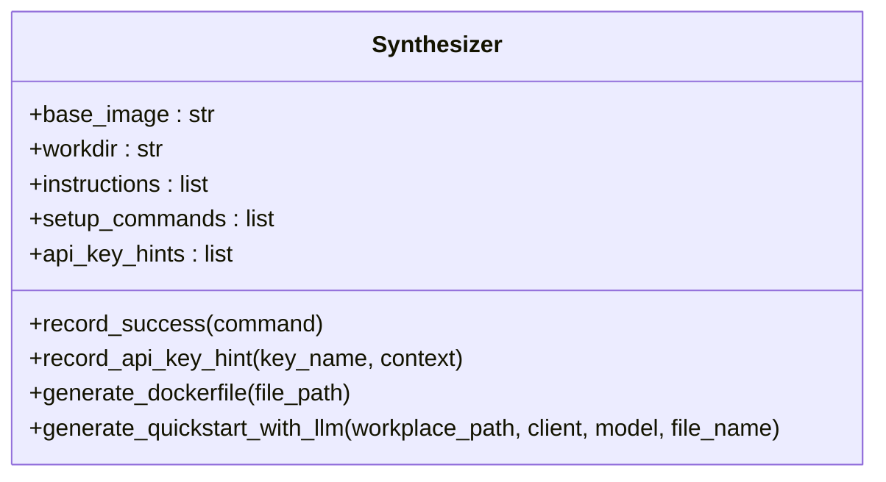
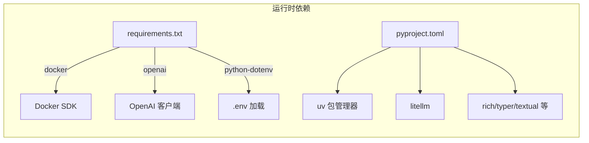

# 快速开始

<cite>
**本文引用的文件**
- [README.md](file://README.md)
- [agent.py](file://agent.py)
- [src/planner.py](file://src/planner.py)
- [src/sandbox.py](file://src/sandbox.py)
- [src/synthesizer.py](file://src/synthesizer.py)
- [requirements.txt](file://requirements.txt)
- [workplace/pyproject.toml](file://workplace/pyproject.toml)
- [workplace/.env](file://workplace/.env)
- [workplace/QuickStart.md](file://workplace/QuickStart.md)
- [doc/运行示例.md](file://doc/运行示例.md)
- [workplace/docs/models/quickstart.md](file://workplace/docs/models/quickstart.md)
- [workplace/docs/models/troubleshooting.md](file://workplace/docs/models/troubleshooting.md)
- [workplace/docs/faq.md](file://workplace/docs/faq.md)
</cite>

## 目录
1. [简介](#简介)
2. [项目结构](#项目结构)
3. [核心组件](#核心组件)
4. [架构总览](#架构总览)
5. [详细组件解析](#详细组件解析)
6. [依赖关系分析](#依赖关系分析)
7. [性能与成本](#性能与成本)
8. [故障排除指南](#故障排除指南)
9. [结论](#结论)
10. [附录](#附录)

## 简介
Repo Dockerizer Agent 是一个基于大语言模型（LLM）的自动化工具，目标是为任意 GitHub 仓库自动配置可执行的 Docker 环境。它通过 ReAct 思维链规划、在隔离沙箱中执行命令、记录成功指令并最终生成可复用的 Dockerfile 与 QuickStart 文档。

- 支持的运行方式：直接运行主程序或通过模块入口启动
- 关键特性：基于 Docker 的安全沙箱、按步回滚、成本统计、自动生成文档

**章节来源**
- file://README.md#L1-L47

## 项目结构
本项目采用“根目录脚本 + 源码模块 + workplace 文档与示例”的组织方式：
- 根目录脚本与入口
  - agent.py：主程序入口，负责克隆仓库、初始化沙箱、驱动 Planner/Synthesizer 执行 ReAct 循环
- 源码模块
  - src/planner.py：基于 LLM 的规划器，输出 Thought/Action
  - src/sandbox.py：基于 Docker SDK 的沙箱，支持命令执行与按步回滚
  - src/synthesizer.py：记录成功指令，生成 Dockerfile 与 QuickStart.md
- 配置与依赖
  - requirements.txt：最小依赖清单（docker、openai、python-dotenv）
  - workplace/pyproject.toml：完整依赖清单（含 uv、litellm、rich 等）
  - workplace/.env：示例环境变量（包含 OPENAI_API_KEY 与可选代理 base_url）
- 文档与示例
  - workplace/QuickStart.md：模块化运行示例与 API Key 配置
  - doc/运行示例.md：端到端运行示例（包含容器交互提示）

**图表来源**
- [agent.py](file://agent.py#L1-L160)
- [src/planner.py](file://src/planner.py#L1-L145)
- [src/sandbox.py](file://src/sandbox.py#L1-L178)
- [src/synthesizer.py](file://src/synthesizer.py#L1-L144)
- [requirements.txt](file://requirements.txt#L1-L4)
- [workplace/pyproject.toml](file://workplace/pyproject.toml#L1-L282)
- [workplace/.env](file://workplace/.env#L1-L2)

**章节来源**
- file://README.md#L11-L47
- file://requirements.txt#L1-L4
- file://workplace/pyproject.toml#L33-L48

## 核心组件
- DockerAgent（agent.py）
  - 负责准备本地工作区、克隆仓库、初始化 Docker 沙箱、构建 LLM 客户端、驱动 ReAct 循环、最终生成 Dockerfile 与 QuickStart.md
- Planner（src/planner.py）
  - 使用系统提示词与历史消息，输出符合 ReAct 格式的 Thought 与 Action，并统计 token 与费用
- Sandbox（src/sandbox.py）
  - 基于 Docker SDK 在容器内执行命令；对会产生副作用的命令进行 commit 快照，失败时回滚至上一成功镜像
- Synthesizer（src/synthesizer.py）
  - 记录成功指令为 RUN 指令，生成 Dockerfile；基于 README 与真实安装命令生成 QuickStart.md

**章节来源**
- file://agent.py#L14-L160
- file://src/planner.py#L3-L145
- file://src/sandbox.py#L4-L178
- file://src/synthesizer.py#L1-L144

## 架构总览
下图展示了从用户输入到最终产物的端到端流程：

**图表来源**
- [agent.py](file://agent.py#L60-L126)
- [src/planner.py](file://src/planner.py#L69-L105)
- [src/sandbox.py](file://src/sandbox.py#L29-L91)
- [src/synthesizer.py](file://src/synthesizer.py#L9-L31)

## 详细组件解析

### DockerAgent 组件
- 功能要点
  - 准备工作区与克隆仓库
  - 初始化 Docker 沙箱（映射本地工作区到容器 /app）
  - 构建 OpenAI 客户端（支持 OPENAI_API_KEY 与可选 OPENAI_API_BASE）
  - 驱动 ReAct 循环（计划-执行-记录-回滚）
  - 生成 Dockerfile 与 QuickStart.md
  - 支持 --keep-container 参数以便检查容器状态
- 关键参数
  - --image：基础镜像（默认 python:3.10）
  - --model：LLM 模型（默认 gpt-4o）
  - --steps：最大步数（默认 30）
  - --keep-container：完成后保留容器

**图表来源**
- [agent.py](file://agent.py#L14-L160)

**章节来源**
- file://agent.py#L14-L160

### Planner 组件
- 功能要点
  - 构造系统提示词，限定禁止命令与任务边界
  - 维护对话历史，按 ReAct 格式提取 Thought 与 Action
  - 计算 token 用量与费用（按模型定价表）
- 关键点
  - 仅输出一条 Thought 与一条 Action
  - 结束条件为出现 Final Answer: Success

**图表来源**
- [src/planner.py](file://src/planner.py#L69-L105)

**章节来源**
- file://src/planner.py#L43-L105

### Sandbox 组件
- 功能要点
  - 以 base_image 启动容器，挂载工作区
  - 执行命令并区分“信息性退出”与“错误退出”
  - 对会产生副作用的命令进行 commit 快照，失败时回滚
  - 支持 keep-alive 模式便于调试
- 关键点
  - 仅对写操作类命令进行快照（如 pip、apt、make 等）
  - 信息性退出（如 --help）不视为错误，也不创建快照

**图表来源**
- [src/sandbox.py](file://src/sandbox.py#L29-L91)

**章节来源**
- file://src/sandbox.py#L29-L178

### Synthesizer 组件
- 功能要点
  - 将成功指令记录为 Dockerfile 的 RUN 行
  - 生成 Dockerfile
  - 基于 README 与真实安装命令生成 QuickStart.md
- 关键点
  - 过滤纯查看类指令，仅保留安装/配置相关命令
  - 自动识别 API Key 需求并记录提示

**图表来源**
- [src/synthesizer.py](file://src/synthesizer.py#L1-L144)

**章节来源**
- file://src/synthesizer.py#L9-L144

## 依赖关系分析
- 最小依赖（requirements.txt）
  - docker：Docker SDK，用于容器生命周期管理
  - openai：OpenAI 客户端，用于调用 LLM
  - python-dotenv：加载 .env 中的环境变量
- 完整依赖（workplace/pyproject.toml）
  - 包含 pyyaml、requests、jinja2、pydantic、litellm、tenacity、rich、typer、platformdirs、textual、prompt_toolkit、datasets、openai 等
  - 推荐使用 uv 作为包管理器（与示例日志一致）
- 环境变量
  - OPENAI_API_KEY：必需
  - OPENAI_API_BASE：可选，用于代理或自定义服务

**图表来源**
- [requirements.txt](file://requirements.txt#L1-L4)
- [workplace/pyproject.toml](file://workplace/pyproject.toml#L33-L48)
- [workplace/.env](file://workplace/.env#L1-L2)

**章节来源**
- file://requirements.txt#L1-L4
- file://workplace/pyproject.toml#L33-L48
- file://workplace/.env#L1-L2

## 性能与成本
- Token 与费用统计
  - Planner 会根据模型定价表计算每次调用的输入/输出 token 成本，并累加总费用
  - 不同模型的单价不同，建议根据任务复杂度选择合适模型
- 回滚与镜像占用
  - 每次成功写操作都会创建快照镜像，失败时回滚；长时间运行可能占用较多磁盘空间
  - 建议在完成后清理镜像与容器

**章节来源**
- file://src/planner.py#L107-L129
- file://src/sandbox.py#L56-L74
- file://README.md#L43-L47

## 故障排除指南
- 环境变量缺失
  - 现象：启动时报错提示未找到 OPENAI_API_KEY
  - 处理：创建 .env 文件并填入 OPENAI_API_KEY；或导出环境变量
- Docker 引擎未运行
  - 现象：初始化沙箱失败或无法连接 Docker
  - 处理：确保 Docker 已安装并正在运行
- API Key 无效或权限不足
  - 现象：LLM 调用报认证错误
  - 处理：核对 API Key 正确性；若使用代理，请确认 OPENAI_API_BASE 设置正确
- 容器回滚频繁导致磁盘不足
  - 现象：镜像体积增长过快
  - 处理：减少步骤数或在完成后手动清理镜像
- 信息性退出被误判为错误
  - 现象：某些命令（如 --help）触发回滚
  - 处理：此类命令会被识别为信息性退出，不会创建快照，属正常行为

**章节来源**
- file://agent.py#L127-L146
- file://src/sandbox.py#L114-L134
- file://workplace/docs/models/troubleshooting.md#L9-L38
- file://workplace/docs/faq.md#L50-L58

## 结论
本指南提供了从环境准备、依赖安装、配置文件设置到完整运行示例的全流程说明。通过 DockerAgent 的三段式流程（规划-执行-合成），你可以为任意仓库自动生成可复现的 Docker 环境与使用说明。遇到问题时，优先检查 API Key、Docker 状态与磁盘占用情况。

## 附录

### 安装与运行步骤
- 环境要求
  - Python 版本：满足项目要求（参考 pyproject.toml 中的 Python 版本约束）
  - Docker Engine：必须已安装并运行
- 依赖安装（推荐使用 uv）
  - 创建并激活虚拟环境
  - 使用 uv 安装依赖
- 配置文件设置
  - 将 .env.example 重命名为 .env，并填入 OPENAI_API_KEY
  - 如需代理，可设置 OPENAI_API_BASE
- 运行示例
  - 基本运行：提供仓库 URL
  - 高级选项：指定基础镜像、模型、最大步数、是否保留容器

**章节来源**
- file://README.md#L11-L47
- file://workplace/QuickStart.md#L6-L46
- file://workplace/.env#L1-L2

### 命令行示例与预期输出
- 基本运行
  - 命令：python agent.py <仓库URL>
  - 预期：克隆仓库 → 初始化容器 → ReAct 循环 → 生成 Dockerfile 与 QuickStart.md
- 保留容器以便检查
  - 命令：python agent.py <仓库URL> --keep-container
  - 预期：完成后打印容器 ID，可使用 docker exec -it <容器ID> /bin/bash 进入
- 端到端示例参考
  - 参考文档中的完整运行日志与容器交互提示

**章节来源**
- file://doc/运行示例.md#L1-L475
- file://workplace/QuickStart.md#L13-L26