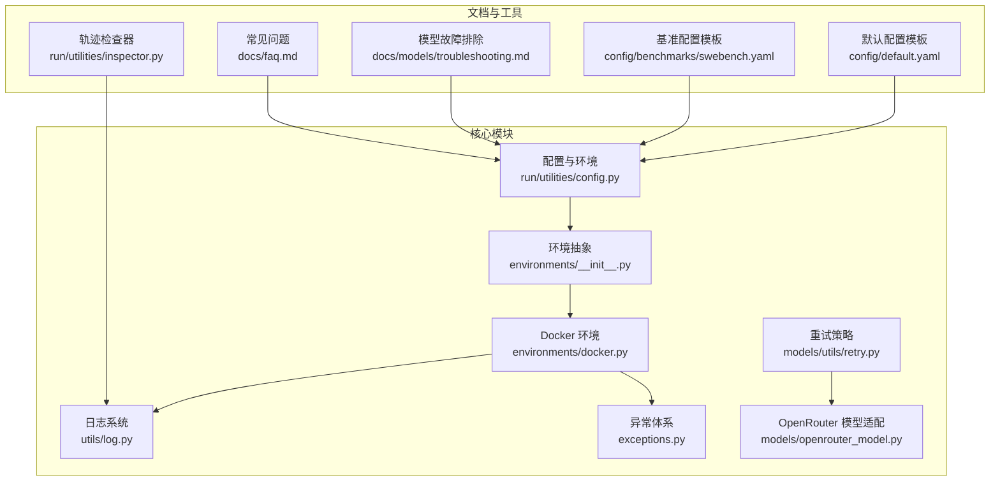
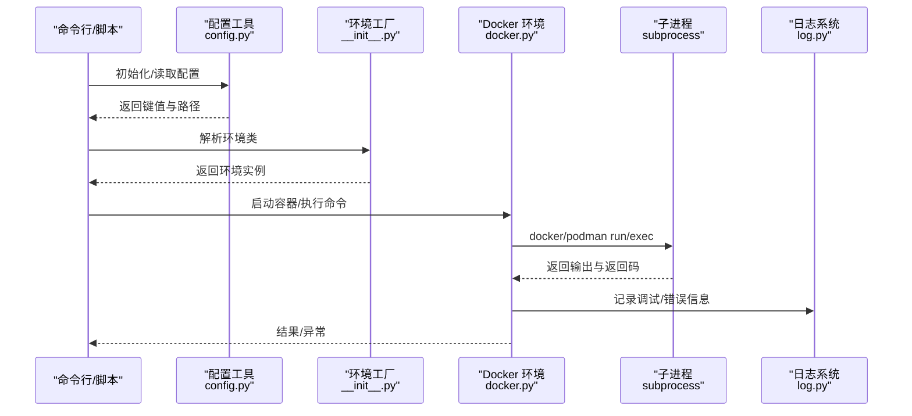
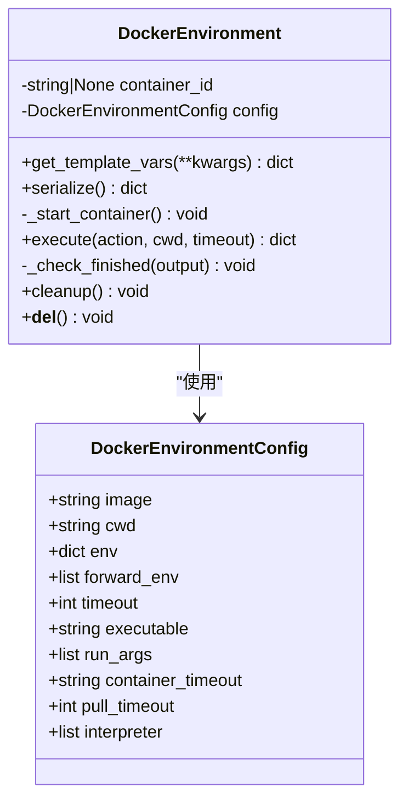
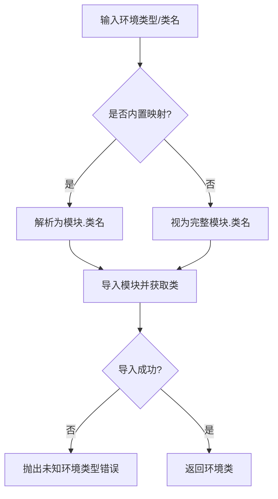
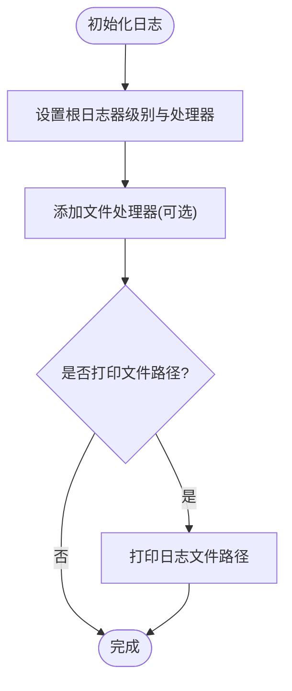
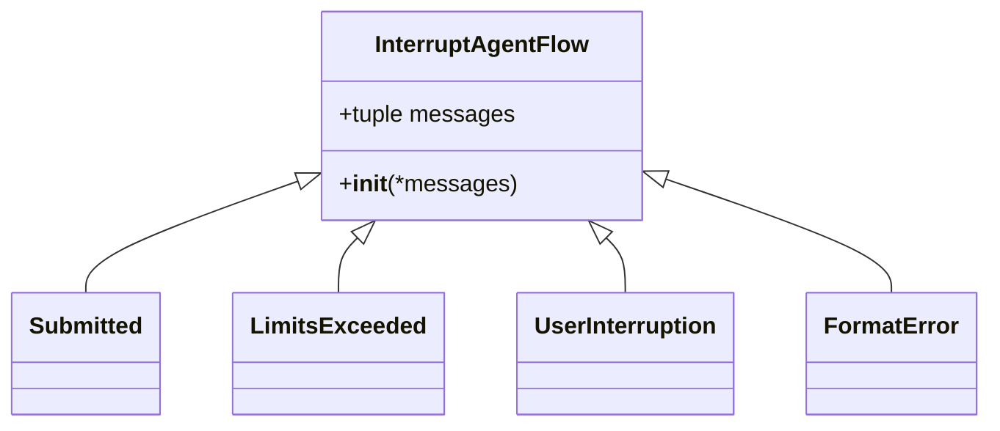
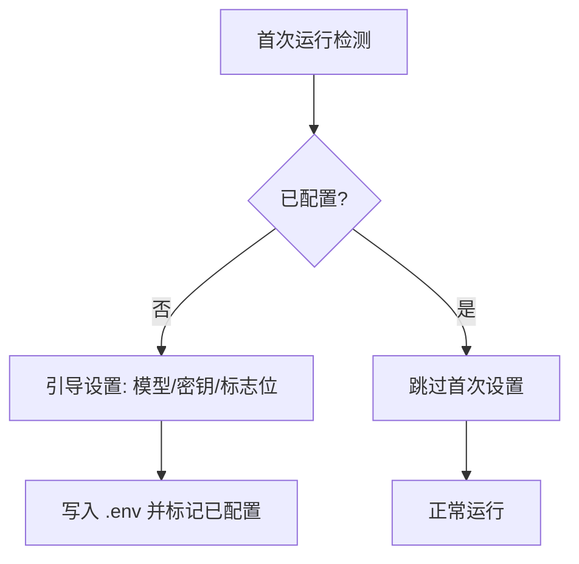
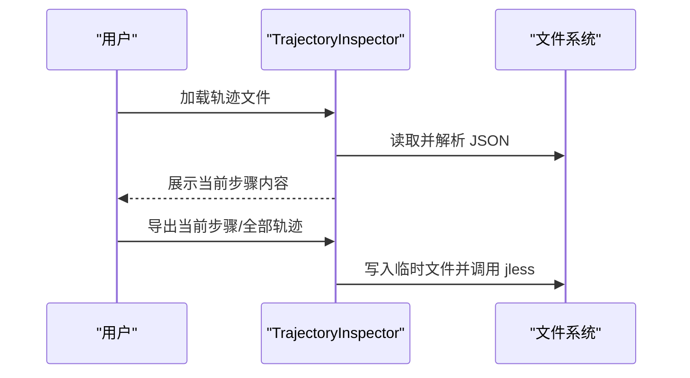
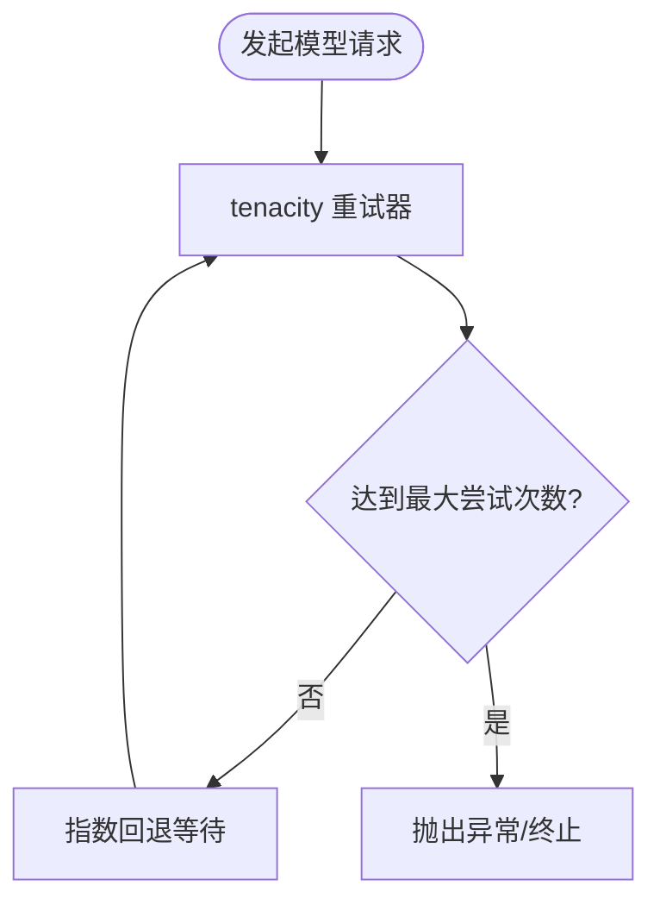
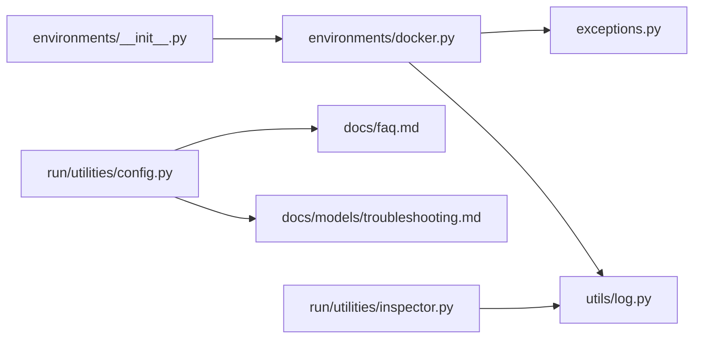

# 故障排除

<cite>
**本文引用的文件**
- [workplace/src/minisweagent/environments/docker.py](file://workplace/src/minisweagent/environments/docker.py)
- [workplace/src/minisweagent/environments/__init__.py](file://workplace/src/minisweagent/environments/__init__.py)
- [workplace/src/minisweagent/utils/log.py](file://workplace/src/minisweagent/utils/log.py)
- [workplace/src/minisweagent/exceptions.py](file://workplace/src/minisweagent/exceptions.py)
- [workplace/src/minisweagent/run/utilities/config.py](file://workplace/src/minisweagent/run/utilities/config.py)
- [workplace/src/minisweagent/run/utilities/inspector.py](file://workplace/src/minisweagent/run/utilities/inspector.py)
- [workplace/src/minisweagent/config/default.yaml](file://workplace/src/minisweagent/config/default.yaml)
- [workplace/src/minisweagent/config/benchmarks/swebench.yaml](file://workplace/src/minisweagent/config/benchmarks/swebench.yaml)
- [workplace/src/minisweagent/models/utils/retry.py](file://workplace/src/minisweagent/models/utils/retry.py)
- [workplace/src/minisweagent/models/openrouter_model.py](file://workplace/src/minisweagent/models/openrouter_model.py)
- [workplace/docs/models/troubleshooting.md](file://workplace/docs/models/troubleshooting.md)
- [workplace/docs/faq.md](file://workplace/docs/faq.md)
- [workplace/docs/contributing.md](file://workplace/docs/contributing.md)
- [workplace/.github/ISSUE_TEMPLATE/bug.yml](file://workplace/.github/ISSUE_TEMPLATE/bug.yml)
- [workplace/.github/ISSUE_TEMPLATE/question.yml](file://workplace/.github/ISSUE_TEMPLATE/question.yml)
- [src/sandbox.py](file://src/sandbox.py)
- [agent.py](file://agent.py)
- [workplace/tests/environments/test_docker.py](file://workplace/tests/environments/test_docker.py)
</cite>

## 目录
1. [简介](#简介)
2. [项目结构](#项目结构)
3. [核心组件](#核心组件)
4. [架构总览](#架构总览)
5. [详细组件分析](#详细组件分析)
6. [依赖关系分析](#依赖关系分析)
7. [性能考虑](#性能考虑)
8. [故障排除指南](#故障排除指南)
9. [结论](#结论)
10. [附录](#附录)

## 简介
本指南面向 Repo Dockerizer Agent 的使用者与维护者，系统化地梳理安装、运行时错误与性能问题的排查路径，覆盖日志分析、错误码解读、调试技巧，并给出跨操作系统与容器运行时（Docker/Podman）的针对性解决方案。同时提供性能调优建议与社区支持渠道，帮助快速定位与解决问题。

## 项目结构
- 核心运行时位于 workplace/src/minisweagent 下，包含环境抽象、日志、异常、模型与配置等模块。
- Docker 环境执行逻辑集中在 environments/docker.py，支持通过环境变量或配置自定义可执行程序（默认 docker，也兼容 podman）。
- 配置与全局设置由 run/utilities/config.py 提供命令行工具，便于首次配置与键值管理。
- 日志系统通过 utils/log.py 统一输出，既可在控制台高亮显示，也可写入文件以便离线分析。
- 模型层提供重试策略与错误类型，便于在不稳定网络或限流场景下稳健运行。
- 文档目录 docs/models/troubleshooting.md 与 docs/faq.md 提供常见问题与解答，是本指南的重要参考。

**图表来源**
- [workplace/src/minisweagent/environments/docker.py](file://workplace/src/minisweagent/environments/docker.py#L1-L162)
- [workplace/src/minisweagent/environments/__init__.py](file://workplace/src/minisweagent/environments/__init__.py#L1-L33)
- [workplace/src/minisweagent/utils/log.py](file://workplace/src/minisweagent/utils/log.py#L1-L37)
- [workplace/src/minisweagent/exceptions.py](file://workplace/src/minisweagent/exceptions.py#L1-L23)
- [workplace/src/minisweagent/run/utilities/config.py](file://workplace/src/minisweagent/run/utilities/config.py#L1-L117)
- [workplace/src/minisweagent/run/utilities/inspector.py](file://workplace/src/minisweagent/run/utilities/inspector.py#L1-L290)
- [workplace/src/minisweagent/config/default.yaml](file://workplace/src/minisweagent/config/default.yaml#L1-L167)
- [workplace/src/minisweagent/config/benchmarks/swebench.yaml](file://workplace/src/minisweagent/config/benchmarks/swebench.yaml#L127-L169)
- [workplace/src/minisweagent/models/utils/retry.py](file://workplace/src/minisweagent/models/utils/retry.py#L1-L25)
- [workplace/src/minisweagent/models/openrouter_model.py](file://workplace/src/minisweagent/models/openrouter_model.py#L21-L51)
- [workplace/docs/models/troubleshooting.md](file://workplace/docs/models/troubleshooting.md#L1-L115)
- [workplace/docs/faq.md](file://workplace/docs/faq.md#L1-L122)

**章节来源**
- [workplace/src/minisweagent/environments/docker.py](file://workplace/src/minisweagent/environments/docker.py#L1-L162)
- [workplace/src/minisweagent/environments/__init__.py](file://workplace/src/minisweagent/environments/__init__.py#L1-L33)
- [workplace/src/minisweagent/utils/log.py](file://workplace/src/minisweagent/utils/log.py#L1-L37)
- [workplace/src/minisweagent/exceptions.py](file://workplace/src/minisweagent/exceptions.py#L1-L23)
- [workplace/src/minisweagent/run/utilities/config.py](file://workplace/src/minisweagent/run/utilities/config.py#L1-L117)
- [workplace/src/minisweagent/run/utilities/inspector.py](file://workplace/src/minisweagent/run/utilities/inspector.py#L1-L290)
- [workplace/src/minisweagent/config/default.yaml](file://workplace/src/minisweagent/config/default.yaml#L1-L167)
- [workplace/src/minisweagent/config/benchmarks/swebench.yaml](file://workplace/src/minisweagent/config/benchmarks/swebench.yaml#L127-L169)
- [workplace/src/minisweagent/models/utils/retry.py](file://workplace/src/minisweagent/models/utils/retry.py#L1-L25)
- [workplace/src/minisweagent/models/openrouter_model.py](file://workplace/src/minisweagent/models/openrouter_model.py#L21-L51)
- [workplace/docs/models/troubleshooting.md](file://workplace/docs/models/troubleshooting.md#L1-L115)
- [workplace/docs/faq.md](file://workplace/docs/faq.md#L1-L122)

## 核心组件
- Docker 环境执行器：负责拉起容器、转发环境变量、执行命令、超时控制与任务完成检测。
- 环境工厂：根据配置解析环境类，支持 docker、singularity、local、以及扩展环境类型。
- 日志系统：统一根日志器、控制台高亮输出与文件落盘，便于问题复现与审计。
- 异常体系：定义中断与提交、限流、用户中断、格式错误等异常，用于流程控制与状态上报。
- 配置工具：提供首次配置、键值设置/取消、编辑全局 .env 文件的能力。
- 轨迹检查器：可视化浏览与检索对话轨迹，辅助定位模型输出与动作执行问题。
- 模型重试与错误类型：为不稳定网络与限流场景提供指数回退与可配置重试次数。

**章节来源**
- [workplace/src/minisweagent/environments/docker.py](file://workplace/src/minisweagent/environments/docker.py#L45-L162)
- [workplace/src/minisweagent/environments/__init__.py](file://workplace/src/minisweagent/environments/__init__.py#L18-L33)
- [workplace/src/minisweagent/utils/log.py](file://workplace/src/minisweagent/utils/log.py#L7-L37)
- [workplace/src/minisweagent/exceptions.py](file://workplace/src/minisweagent/exceptions.py#L1-L23)
- [workplace/src/minisweagent/run/utilities/config.py](file://workplace/src/minisweagent/run/utilities/config.py#L51-L117)
- [workplace/src/minisweagent/run/utilities/inspector.py](file://workplace/src/minisweagent/run/utilities/inspector.py#L1-L290)
- [workplace/src/minisweagent/models/utils/retry.py](file://workplace/src/minisweagent/models/utils/retry.py#L9-L25)

## 架构总览
下图展示从命令到容器执行的关键链路，以及日志与异常如何贯穿其中：

**图表来源**
- [workplace/src/minisweagent/run/utilities/config.py](file://workplace/src/minisweagent/run/utilities/config.py#L51-L117)
- [workplace/src/minisweagent/environments/__init__.py](file://workplace/src/minisweagent/environments/__init__.py#L18-L33)
- [workplace/src/minisweagent/environments/docker.py](file://workplace/src/minisweagent/environments/docker.py#L74-L138)
- [workplace/src/minisweagent/utils/log.py](file://workplace/src/minisweagent/utils/log.py#L7-L37)

## 详细组件分析

### Docker 环境执行器（DockerEnvironment）
- 关键职责：启动容器、转发环境变量、执行命令、超时控制、任务完成检测、清理容器。
- 可配置项：镜像、工作目录、环境变量、超时、可执行程序（docker/podman）、运行参数、容器存活时长、解释器等。
- 执行流程：构造 docker/podman 命令，执行并捕获输出；异常时记录异常类型与信息；若输出以特定标记开头且返回码为 0，则触发提交流程。

**图表来源**
- [workplace/src/minisweagent/environments/docker.py](file://workplace/src/minisweagent/environments/docker.py#L15-L43)
- [workplace/src/minisweagent/environments/docker.py](file://workplace/src/minisweagent/environments/docker.py#L45-L162)

**章节来源**
- [workplace/src/minisweagent/environments/docker.py](file://workplace/src/minisweagent/environments/docker.py#L74-L138)

### 环境工厂与映射
- 支持多种环境类型（docker、singularity、local、以及扩展 swerex_*、bubblewrap），通过字符串映射到具体类。
- 若传入完整模块路径则直接导入，否则按映射解析。

**图表来源**
- [workplace/src/minisweagent/environments/__init__.py](file://workplace/src/minisweagent/environments/__init__.py#L18-L27)

**章节来源**
- [workplace/src/minisweagent/environments/__init__.py](file://workplace/src/minisweagent/environments/__init__.py#L18-L33)

### 日志系统与文件落盘
- 根日志器设置、控制台高亮输出与文件处理器添加。
- 支持将日志写入文件，便于离线分析与问题回溯。

**图表来源**
- [workplace/src/minisweagent/utils/log.py](file://workplace/src/minisweagent/utils/log.py#L7-L30)

**章节来源**
- [workplace/src/minisweagent/utils/log.py](file://workplace/src/minisweagent/utils/log.py#L7-L37)

### 异常体系与提交检测
- 自定义异常用于中断流程、提交结果、超出限制、用户中断与格式错误。
- Docker 执行器在输出首行匹配特定标记且返回码为 0 时触发提交。

**图表来源**
- [workplace/src/minisweagent/exceptions.py](file://workplace/src/minisweagent/exceptions.py#L1-L23)
- [workplace/src/minisweagent/environments/docker.py](file://workplace/src/minisweagent/environments/docker.py#L140-L151)

**章节来源**
- [workplace/src/minisweagent/exceptions.py](file://workplace/src/minisweagent/exceptions.py#L1-L23)
- [workplace/src/minisweagent/environments/docker.py](file://workplace/src/minisweagent/environments/docker.py#L140-L151)

### 配置工具与全局 .env 管理
- 首次运行可引导设置默认模型、API 密钥与配置标志位。
- 支持设置/取消键值、直接编辑 .env 文件。
- FAQ 中说明了全局配置位置与存储方式。

**图表来源**
- [workplace/src/minisweagent/run/utilities/config.py](file://workplace/src/minisweagent/run/utilities/config.py#L51-L84)
- [workplace/docs/faq.md](file://workplace/docs/faq.md#L52-L58)

**章节来源**
- [workplace/src/minisweagent/run/utilities/config.py](file://workplace/src/minisweagent/run/utilities/config.py#L51-L117)
- [workplace/docs/faq.md](file://workplace/docs/faq.md#L52-L58)

### 轨迹检查器（Trajectory Inspector）
- 将消息分组为“步骤”，支持左右翻页、轨迹切换、滚动导航。
- 可将当前步骤或整段轨迹导出至临时 JSON 并用 jless 打开，便于深入分析。

**图表来源**
- [workplace/src/minisweagent/run/utilities/inspector.py](file://workplace/src/minisweagent/run/utilities/inspector.py#L148-L267)

**章节来源**
- [workplace/src/minisweagent/run/utilities/inspector.py](file://workplace/src/minisweagent/run/utilities/inspector.py#L1-L290)

### 模型重试与错误类型
- 重试策略基于指数回退，支持通过环境变量调整最大尝试次数。
- OpenRouter 模型定义了 API/认证/限流等自定义异常类型，便于区分处理。

**图表来源**
- [workplace/src/minisweagent/models/utils/retry.py](file://workplace/src/minisweagent/models/utils/retry.py#L9-L25)
- [workplace/src/minisweagent/models/openrouter_model.py](file://workplace/src/minisweagent/models/openrouter_model.py#L42-L51)

**章节来源**
- [workplace/src/minisweagent/models/utils/retry.py](file://workplace/src/minisweagent/models/utils/retry.py#L1-L25)
- [workplace/src/minisweagent/models/openrouter_model.py](file://workplace/src/minisweagent/models/openrouter_model.py#L21-L51)

## 依赖关系分析
- 环境工厂依赖环境映射表，动态导入对应实现。
- Docker 环境依赖异常体系进行流程控制，依赖日志系统记录调试信息。
- 配置工具与文档 FAQ 共同指导用户正确设置模型与密钥。
- 轨迹检查器依赖消息渲染工具，便于可视化分析。

**图表来源**
- [workplace/src/minisweagent/environments/__init__.py](file://workplace/src/minisweagent/environments/__init__.py#L18-L33)
- [workplace/src/minisweagent/environments/docker.py](file://workplace/src/minisweagent/environments/docker.py#L1-L162)
- [workplace/src/minisweagent/exceptions.py](file://workplace/src/minisweagent/exceptions.py#L1-L23)
- [workplace/src/minisweagent/utils/log.py](file://workplace/src/minisweagent/utils/log.py#L1-L37)
- [workplace/src/minisweagent/run/utilities/config.py](file://workplace/src/minisweagent/run/utilities/config.py#L1-L117)
- [workplace/docs/faq.md](file://workplace/docs/faq.md#L1-L122)
- [workplace/docs/models/troubleshooting.md](file://workplace/docs/models/troubleshooting.md#L1-L115)
- [workplace/src/minisweagent/run/utilities/inspector.py](file://workplace/src/minisweagent/run/utilities/inspector.py#L1-L290)

**章节来源**
- [workplace/src/minisweagent/environments/__init__.py](file://workplace/src/minisweagent/environments/__init__.py#L18-L33)
- [workplace/src/minisweagent/environments/docker.py](file://workplace/src/minisweagent/environments/docker.py#L1-L162)
- [workplace/src/minisweagent/exceptions.py](file://workplace/src/minisweagent/exceptions.py#L1-L23)
- [workplace/src/minisweagent/utils/log.py](file://workplace/src/minisweagent/utils/log.py#L1-L37)
- [workplace/src/minisweagent/run/utilities/config.py](file://workplace/src/minisweagent/run/utilities/config.py#L1-L117)
- [workplace/docs/faq.md](file://workplace/docs/faq.md#L1-L122)
- [workplace/docs/models/troubleshooting.md](file://workplace/docs/models/troubleshooting.md#L1-L115)
- [workplace/src/minisweagent/run/utilities/inspector.py](file://workplace/src/minisweagent/run/utilities/inspector.py#L1-L290)

## 性能考虑
- 超时与资源占用
  - Docker 环境提供命令超时与容器存活时长配置，避免长时间占用资源。
  - 建议根据任务复杂度调整 timeout 与 container_timeout，防止资源泄漏。
- 输出截断与内存
  - 观察模板对大输出进行截断与提示，避免内存峰值过高。
  - 建议优先使用 head/tail/sed 等命令减少一次性输出量。
- 网络与重试
  - 指数回退重试可缓解瞬时网络波动，但需合理设置最大尝试次数，避免无限等待。
- 容器运行时选择
  - 默认使用 docker，也可通过环境变量指定 podman；两者行为差异需在配置中显式声明。

**章节来源**
- [workplace/src/minisweagent/environments/docker.py](file://workplace/src/minisweagent/environments/docker.py#L26-L42)
- [workplace/src/minisweagent/config/default.yaml](file://workplace/src/minisweagent/config/default.yaml#L114-L141)
- [workplace/src/minisweagent/models/utils/retry.py](file://workplace/src/minisweagent/models/utils/retry.py#L19-L25)

## 故障排除指南

### 通用诊断方法
- 启用文件日志
  - 使用日志工具添加文件处理器，将调试信息写入文件，便于离线分析。
- 查看全局配置位置
  - FAQ 指明全局配置文件位置与读取方式，确保密钥与模型设置正确。
- 使用轨迹检查器
  - 将最近一次运行的轨迹导出为 JSON，借助 jless 快速定位问题步骤。

**章节来源**
- [workplace/src/minisweagent/utils/log.py](file://workplace/src/minisweagent/utils/log.py#L21-L30)
- [workplace/docs/faq.md](file://workplace/docs/faq.md#L52-L58)
- [workplace/src/minisweagent/run/utilities/inspector.py](file://workplace/src/minisweagent/run/utilities/inspector.py#L242-L267)

### 安装与环境准备
- Docker/Podman 可用性
  - 在测试中可见对 docker/podman 的可用性检测逻辑，确保可执行程序存在且可运行。
- 镜像拉取超时
  - Docker 环境在启动容器时使用拉取超时参数，避免长时间阻塞。
- 首次配置
  - 使用配置工具引导设置模型与密钥，或直接编辑 .env 文件。

**章节来源**
- [workplace/tests/environments/test_docker.py](file://workplace/tests/environments/test_docker.py#L10-L40)
- [workplace/src/minisweagent/environments/docker.py](file://workplace/src/minisweagent/environments/docker.py#L91-L97)
- [workplace/src/minisweagent/run/utilities/config.py](file://workplace/src/minisweagent/run/utilities/config.py#L51-L84)

### 运行时错误与调试
- 命令执行失败
  - Docker 环境会捕获返回码与异常信息，便于判断命令失败原因。
- 超时与部分输出
  - 即使超时，仍可从观察模板中看到部分输出，有助于定位问题点。
- 提交检测
  - 当输出以特定标记开头且返回码为 0 时，将触发提交流程，检查该标记是否被正确生成。

**章节来源**
- [workplace/src/minisweagent/environments/docker.py](file://workplace/src/minisweagent/environments/docker.py#L115-L138)
- [workplace/src/minisweagent/config/default.yaml](file://workplace/src/minisweagent/config/default.yaml#L22-L33)
- [workplace/src/minisweagent/environments/docker.py](file://workplace/src/minisweagent/environments/docker.py#L140-L151)

### 模型与 API 相关问题
- API 密钥无效
  - 文档提供了典型错误与修复建议，包括永久设置密钥与检查密钥有效性。
- 缺少提供商前缀
  - 未包含提供商前缀可能导致认证错误，应确保模型名称包含提供商前缀。
- 成本计算错误
  - 对于某些模型，成本计算需要正确的提供商与模型名称匹配，必要时通过覆盖字段解决。
- 温度参数不支持
  - 某些模型不支持温度参数，配置中默认不再指定温度即可。

**章节来源**
- [workplace/docs/models/troubleshooting.md](file://workplace/docs/models/troubleshooting.md#L9-L67)
- [workplace/docs/models/troubleshooting.md](file://workplace/docs/models/troubleshooting.md#L68-L71)

### 网络连接与重试
- 指数回退重试
  - 通过环境变量控制最大尝试次数，结合指数回退降低瞬时失败影响。
- 限流与速率限制
  - OpenRouter 模型定义了专用异常类型，便于在上层进行差异化处理。

**章节来源**
- [workplace/src/minisweagent/models/utils/retry.py](file://workplace/src/minisweagent/models/utils/retry.py#L19-L25)
- [workplace/src/minisweagent/models/openrouter_model.py](file://workplace/src/minisweagent/models/openrouter_model.py#L42-L51)

### 容器与镜像问题
- 容器生命周期
  - 容器超时后自动停止，执行器会清理容器；如需保留容器进行调试，可使用相应选项。
- 镜像清理
  - 运行结束后清理中间镜像，避免磁盘空间增长。

**章节来源**
- [workplace/src/minisweagent/environments/docker.py](file://workplace/src/minisweagent/environments/docker.py#L153-L162)
- [src/sandbox.py](file://src/sandbox.py#L147-L177)

### 不同操作系统与环境的特定问题
- macOS
  - 模板中对 sed 命令的差异进行了提示，注意使用带空字符的参数形式。
- Linux/Windows
  - Docker/Podman 可作为容器运行时；若使用 Podman，需确保可执行程序可用。
- 环境变量转发
  - Docker 环境支持转发宿主机环境变量，冲突时本地 env 优先。

**章节来源**
- [workplace/src/minisweagent/config/default.yaml](file://workplace/src/minisweagent/config/default.yaml#L72-L76)
- [workplace/src/minisweagent/environments/docker.py](file://workplace/src/minisweagent/environments/docker.py#L107-L113)

### 社区支持与问题反馈
- 问题反馈
  - 提供 Bug 报告与提问模板，描述问题、复现步骤与系统信息，便于维护者快速定位。
- 社区讨论
  - 提供 Slack/Discord 等渠道，适合开放性讨论与寻求帮助。

**章节来源**
- [workplace/.github/ISSUE_TEMPLATE/bug.yml](file://workplace/.github/ISSUE_TEMPLATE/bug.yml#L1-L23)
- [workplace/.github/ISSUE_TEMPLATE/question.yml](file://workplace/.github/ISSUE_TEMPLATE/question.yml#L1-L11)
- [workplace/docs/contributing.md](file://workplace/docs/contributing.md#L1-L32)

## 结论
通过统一的日志、完善的异常体系、可配置的 Docker 环境与重试机制，Repo Dockerizer Agent 在多平台与多容器运行时环境下具备良好的稳定性与可观测性。遵循本指南的诊断流程与最佳实践，可显著提升问题定位效率与系统整体性能。

## 附录
- 快速检查清单
  - 是否正确设置了模型与密钥？
  - 是否启用了文件日志并保存了最近一次运行轨迹？
  - 容器运行时是否可用？镜像是否可拉取？
  - 超时与容器存活时长是否合理？
  - 是否使用了正确的提供商前缀与模型名称？