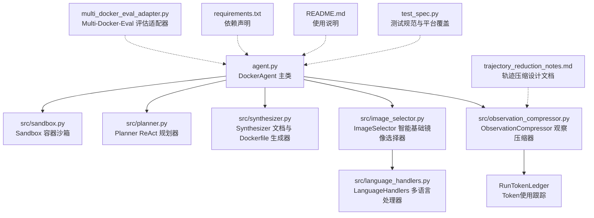
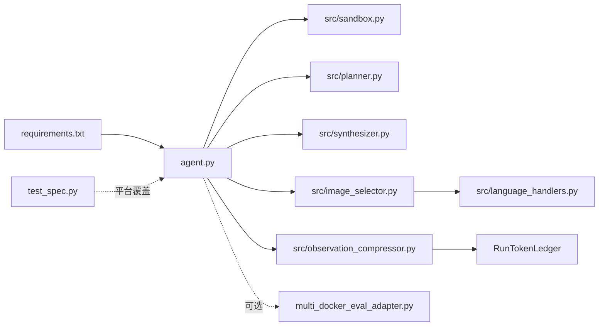

# DockerAgent 主类

<cite>
**本文引用的文件**
- [agent.py](file://agent.py)
- [sandbox.py](file://src/sandbox.py)
- [planner.py](file://src/planner.py)
- [synthesizer.py](file://src/synthesizer.py)
- [image_selector.py](file://src/image_selector.py)
- [language_handlers.py](file://src/language_handlers.py)
- [observation_compressor.py](file://src/observation_compressor.py)
- [multi_docker_eval_adapter.py](file://multi_docker_eval_adapter.py)
- [requirements.txt](file://requirements.txt)
- [README.md](file://README.md)
- [test_spec.py](file://Multi-Docker-Eval/evaluation/test_spec.py)
- [test_observation_compressor.py](file://tests/test_observation_compressor.py)
- [test_planner_history.py](file://tests/test_planner_history.py)
- [trajectory_reduction_notes.md](file://doc/trajectory_reduction_notes.md)
</cite>

## 更新摘要
**变更内容**
- 新增观察压缩系统：集成 AgentDiet 式轨迹压缩，支持可选的观察压缩功能，显著减少 token 使用量
- 改进的 token 使用跟踪：新增 RunTokenLedger 类，提供详细的 token 使用统计和成本追踪
- 增强的 ReAct 循环协调：支持托管历史管理，实现更高效的上下文维护
- 新增配置选项：`enable_observation_compression` 参数控制压缩功能的启用
- 改进的运行摘要：新增压缩统计和 token 使用详情的持久化存储

## 目录
1. [简介](#简介)
2. [项目结构](#项目结构)
3. [核心组件](#核心组件)
4. [架构总览](#架构总览)
5. [详细组件分析](#详细组件分析)
6. [依赖关系分析](#依赖关系分析)
7. [性能考量](#性能考量)
8. [故障排查指南](#故障排查指南)
9. [结论](#结论)
10. [附录](#附录)

## 简介
本文件面向 DockerAgent 主类，系统化阐述其设计架构与核心职责，覆盖以下关键主题：
- 工作区准备：克隆目标仓库至本地工作目录
- commit 检出：支持检出指定 Git 提交，确保分析环境与 PR 基础提交一致
- 智能基础镜像选择：通过 ImageSelector 分析仓库结构和文件内容，自动检测编程语言并选择最优的基础镜像，支持 ARM64 兼容性检测
- 多语言支持：支持 16 种主流编程语言的上下文感知环境配置，包括 Python、JavaScript、TypeScript、Rust、Go、Java、C#、C++、Ruby、PHP、Kotlin、Scala、R、Dart 等
- 容器初始化：通过 Docker SDK 在沙箱中启动容器并挂载工作区，支持平台覆盖配置
- ReAct 循环协调：由 Planner 生成"思考-行动-观察"序列，Sandbox 执行命令并回滚，Synthesizer 记录与总结，支持托管历史管理
- 观察压缩系统：可选的 AgentDiet 式轨迹压缩，减少 token 使用量，提升推理效率
- 最终输出生成：在配置成功后生成 Dockerfile 与 QuickStart 文档
- 构造函数参数详解：repo_url、base_image（支持 "auto" 自动检测）、model、workplace、base_commit、enable_observation_compression 的作用与配置选项
- run 方法执行流程：步骤循环、成本监控、观察结果处理、配置成功判断
- API Key 检测机制：_detect_api_key_issues 的检测策略与错误处理
- 使用示例与最佳实践：命令行参数、调试技巧与注意事项

## 项目结构
该仓库采用按功能分层的组织方式，DockerAgent 位于根目录，核心子模块分别位于 src/ 下，同时包含一个独立的 Multi-Docker-Eval 评估适配器用于批量处理和评估。



**图表来源**
- [agent.py:1-911](file://agent.py#L1-L911)
- [sandbox.py:1-178](file://src/sandbox.py#L1-L178)
- [planner.py:1-281](file://src/planner.py#L1-L281)
- [synthesizer.py:1-192](file://src/synthesizer.py#L1-L192)
- [image_selector.py:1-565](file://src/image_selector.py#L1-L565)
- [observation_compressor.py:1-326](file://src/observation_compressor.py#L1-L326)
- [language_handlers.py:1-715](file://src/language_handlers.py#L1-L715)
- [multi_docker_eval_adapter.py:1-440](file://multi_docker_eval_adapter.py#L1-L440)
- [requirements.txt:1-4](file://requirements.txt#L1-L4)
- [README.md:1-71](file://README.md#L1-L71)
- [test_spec.py:1-77](file://Multi-Docker-Eval/evaluation/test_spec.py#L1-L77)
- [trajectory_reduction_notes.md:1-444](file://doc/trajectory_reduction_notes.md#L1-L444)

**章节来源**
- [agent.py:1-911](file://agent.py#L1-L911)
- [README.md:1-71](file://README.md#L1-L71)

## 核心组件
- DockerAgent：主控制器，负责工作区准备、commit 检出、智能基础镜像选择、容器初始化、ReAct 循环、观察压缩、成本统计、API Key 检测与最终输出生成
- ImageSelector：智能基础镜像选择器，分析仓库结构和文件内容，自动检测编程语言并推荐最优基础镜像，支持 ARM64 兼容性检测
- LanguageHandlers：多语言处理器注册表，支持 16 种编程语言的基础镜像候选选择和语言检测
- Sandbox：基于 Docker SDK 的容器沙箱，支持命令执行与基于 commit 的回滚机制
- Planner：基于 ReAct 思维链的规划器，负责生成"思考-行动-观察"序列并计算成本，支持托管历史管理
- Synthesizer：记录成功指令、生成 Dockerfile 与 QuickStart 文档
- ObservationCompressor：观察压缩器，实现 AgentDiet 式轨迹压缩，减少 token 使用量
- RunTokenLedger：运行时 token 使用跟踪器，提供详细的 token 统计和成本追踪
- Multi-Docker-Eval 适配器：批量处理和评估 DockerAgent 的输出结果
- TestSpec：测试规范类，支持平台覆盖配置（如 linux/amd64）

**章节来源**
- [agent.py:25-55](file://agent.py#L25-L55)
- [image_selector.py:117-131](file://src/image_selector.py#L117-L131)
- [language_handlers.py:10-42](file://src/language_handlers.py#L10-L42)
- [sandbox.py:4-13](file://src/sandbox.py#L4-L13)
- [planner.py:7-20](file://src/planner.py#L7-L20)
- [synthesizer.py:1-7](file://src/synthesizer.py#L1-L7)
- [observation_compressor.py:151-224](file://src/observation_compressor.py#L151-L224)
- [multi_docker_eval_adapter.py:39-440](file://multi_docker_eval_adapter.py#L39-L440)
- [test_spec.py:12-40](file://Multi-Docker-Eval/evaluation/test_spec.py#L12-L40)

## 架构总览
DockerAgent 将"计划-执行-合成"的闭环贯穿到容器环境中，形成如下交互图：

```mermaid
sequenceDiagram
participant U as "用户"
participant A as "DockerAgent"
participant IS as "ImageSelector"
participanth as "LanguageHandlers"
participant P as "Planner"
participant S as "Sandbox"
participant SY as "Synthesizer"
participant OC as "ObservationCompressor"
U->>A : 初始化(repo_url, base_image="auto", model, workplace, base_commit, enable_observation_compression)
A->>A : 准备工作区(克隆仓库)
alt 指定了 base_commit
A->>A : 检出指定提交
end
A->>IS : 分析仓库结构和文件内容
IS->>LH : 检测编程语言并获取候选镜像
LH-->>IS : 返回语言处理器和候选基础镜像
IS-->>A : 返回最优基础镜像(可能包含平台覆盖)
A->>S : 初始化容器(映射工作区, 设置平台)
A->>P : 初始化 LLM 客户端与模型
alt 启用了观察压缩
A->>OC : 初始化观察压缩器
A->>P : 初始化托管历史管理
end
loop ReAct 步骤循环
A->>P : plan(repo_url, last_observation/manage_history=False)
P-->>A : thought, action, cost_info
A->>S : execute(action)
S-->>A : success, observation
A->>A : _detect_api_key_issues(observation)
alt 成功
A->>SY : record_success(action)
else 失败
A->>A : 回滚到上次成功镜像
end
alt 启用了观察压缩
A->>A : _record_agent_step(收集步骤信息)
A->>A : _maybe_compress_old_observation(压缩旧观察)
end
end
alt 配置成功
A->>SY : generate_dockerfile()
A->>SY : generate_quickstart_with_llm()
else 配置失败
A->>A : 输出失败提示
end
A->>S : 关闭容器(可选保留)
```

**图表来源**
- [agent.py:25-55](file://agent.py#L25-L55)
- [image_selector.py:214-285](file://src/image_selector.py#L214-L285)
- [language_handlers.py:638-667](file://src/language_handlers.py#L638-L667)
- [planner.py:92-154](file://src/planner.py#L92-L154)
- [sandbox.py:29-91](file://src/sandbox.py#L29-L91)
- [synthesizer.py:9-21](file://src/synthesizer.py#L9-L21)
- [observation_compressor.py:257-326](file://src/observation_compressor.py#L257-L326)

## 详细组件分析

### DockerAgent 主类
- 设计职责
  - 工作区准备：克隆指定仓库到本地工作目录，确保后续容器内路径一致
  - commit 检出：如果提供了 `base_commit` 参数，在镜像选择之前检出指定的 Git 提交，确保 LLM 分析的是实际的基提交状态
  - 智能基础镜像选择：通过 ImageSelector 分析仓库结构和文件内容，自动检测编程语言并选择最优的基础镜像，支持 ARM64 兼容性检测
  - 多语言支持：集成 16 种编程语言的上下文感知环境配置，包括 Python、JavaScript、TypeScript、Rust、Go、Java、C#、C++、Ruby、PHP、Kotlin、Scala、R、Dart 等
  - 容器初始化：通过 Sandbox 在宿主机 Docker 引擎上启动容器，映射工作目录为 /app，支持平台覆盖配置
  - ReAct 协调：循环调用 Planner 生成下一步动作，交由 Sandbox 执行，根据结果记录与回滚
  - 观察压缩：可选的 AgentDiet 式轨迹压缩，减少 token 使用量，提升推理效率
  - 成本监控：打印每步输入/输出 token 与累计花费，便于成本控制
  - API Key 检测：识别输出中的 API Key 缺失提示，记录并提示后续配置
  - 最终输出：若配置成功，生成 Dockerfile 与 QuickStart 文档

- 构造函数参数
  - repo_url：目标 GitHub 仓库地址，用于克隆到工作区
  - base_image：容器基础镜像，默认值为 "auto"（自动检测），可指定具体镜像如 "python:3.10"、"node:18"
  - model：LLM 模型名称，默认值为 "qwen3-max-2026-01-23"
  - workplace：本地工作目录路径，绝对路径，作为容器卷挂载点（/app）
  - base_commit：Git 提交 SHA，可选参数，用于检出特定提交状态进行分析
  - enable_observation_compression：布尔值，是否启用观察压缩功能，默认 False

- 观察压缩配置参数
  - compression_delay：压缩延迟步数，默认 2，用于避免压缩最新步骤
  - compression_context_before：压缩上下文步数，默认 1，用于提供压缩所需的上下文
  - compression_threshold_chars：字符阈值，超过此长度才考虑压缩，默认 1500
  - compression_benefit_tokens：压缩收益阈值，节省的 token 数超过此值才应用压缩，默认 300
  - compression_stats：压缩统计信息，包括候选步骤数、压缩步骤数、节省的 token 数

- run 方法执行流程
  - 初始化：打印开始信息，进入循环
  - 步骤循环：调用 Planner.plan 获取 thought 与 action；打印成本信息；若 is_finished 且包含"Final Answer: Success"，标记配置成功并结束
  - 动作执行：调用 Sandbox.execute 执行命令；若成功则记录；否则回滚到上次成功镜像
  - API Key 检测：对观察结果进行关键词匹配，记录缺失的密钥类型
  - 观察压缩：收集步骤信息，检查是否需要压缩旧的观察结果
  - 结束处理：若配置成功，生成 Dockerfile 与 QuickStart 文档；否则输出失败提示
  - 资源清理：无论成功与否，最终关闭容器（可通过 keep_container 参数保留）

- _detect_api_key_issues 方法
  - 作用：从命令输出中识别常见的 API Key 缺失或无效提示，记录到 Synthesizer 的 api_key_hints 中
  - 检测策略：将输出转为小写，匹配预定义的关键字集合（如 openai_api_key、anthropic_api_key、api_key、access_token 等）
  - 影响：在生成 QuickStart 文档时，Synthesizer 可据此补充 API Key 配置说明

- _record_agent_step 方法
  - 作用：记录 Agent 步骤信息，包括思考、行动、观察、环境状态等
  - 功能：创建 AgentStep 对象，构建观察元数据，记录 token 使用情况
  - 集成：将步骤添加到托管历史中，准备进行压缩

- _maybe_compress_old_observation 方法
  - 作用：检查并压缩旧的观察结果，减少 token 使用量
  - 机制：基于延迟策略和阈值检查，使用 ObservationCompressor 进行压缩
  - 条件：只有当观察结果长度超过阈值且节省的 token 数超过收益阈值时才应用压缩
  - 更新：更新托管历史中的观察内容，记录压缩统计信息

- 使用示例与命令行参数
  - 命令行参数
    - repo_url：必填，GitHub 仓库 URL
    - --image：可选，基础镜像，默认 "auto"（自动检测）或指定镜像如 "python:3.10"、"node:18"
    - --model：可选，LLM 模型，默认 "qwen3-max-2026-01-23"
    - --steps：可选，最大步数，默认 30
    - --keep-container：可选，完成后保留容器以便检查
    - --base-commit：可选，Git 提交 SHA，用于检出特定提交状态
    - --enable-observation-compression：可选，启用观察压缩功能
  - 示例
    - python agent.py https://github.com/psf/requests
    - python agent.py https://github.com/psf/requests --image auto
    - python agent.py https://github.com/psf/requests --image python:3.10
    - python agent.py https://github.com/psf/requests --image node:18 --steps 50 --keep-container
    - python agent.py https://github.com/psf/requests --base-commit abc123def456
    - python agent.py https://github.com/psf/requests --enable-observation-compression

- 最佳实践
  - 环境变量：确保 OPENAI_API_KEY（或兼容的 API Key）已设置；如需自定义 base_url，可设置 OPENAI_API_BASE
  - 容器资源：每步 commit 会生成镜像快照，建议在完成后清理无用镜像
  - 调试技巧：使用 --keep-container 查看容器内部状态；通过打印的日志定位问题
  - 模型选择：根据任务复杂度与预算选择合适模型；关注成本统计
  - 基础镜像选择：推荐使用 "auto" 模式让系统自动检测编程语言；如需特定镜像可手动指定
  - commit 检出：在处理 PR 时使用 --base-commit 指定 PR 的基础提交，确保分析环境与 PR 一致
  - 观察压缩：对于长输出的项目（如测试日志、安装日志），建议启用 --enable-observation-compression 以减少 token 使用

**章节来源**
- [agent.py:25-55](file://agent.py#L25-L55)
- [agent.py:328-449](file://agent.py#L328-L449)
- [agent.py:450-540](file://agent.py#L450-L540)
- [agent.py:541-823](file://agent.py#L541-L823)
- [agent.py:824-887](file://agent.py#L824-L887)
- [agent.py:889-911](file://agent.py#L889-L911)

### ObservationCompressor 观察压缩器
- 设计要点
  - AgentDiet 式压缩：实现 Codex 最终确定的压缩方案，支持统一的压缩规则
  - XML 序列化：将 Agent 步骤序列化为 XML 格式，便于压缩器理解和处理
  - 统一压缩规则：测试日志、安装日志、一般命令日志的统一压缩策略
  - 元数据提取：从观察结果中提取测试标记、安装标记、错误标记等元信息
  - 压缩效果评估：计算原始字符数、压缩后字符数、节省的 token 数等指标

- 关键数据结构
  - AgentStep：包含步骤 ID、思考、行动、成功状态、环境状态、观察结果等信息
  - CompressionRecord：记录压缩决策、效果和 token 使用情况
  - StepTokenUsage：记录 Planner 和反射阶段的 token 使用
  - RunTokenLedger：提供全局 token 使用统计和成本追踪

- 压缩规则
  - 测试日志：保留测试会话头、平台/版本信息、收集的测试数量、简短测试摘要、失败/错误/XFAIL 用例、关键 traceback、最终统计行
  - 安装日志：保留包管理器类型、成功安装的包名列表、已存在/已满足依赖列表、关键版本信息、warning、第一处真实错误
  - 一般命令日志：保留命令成功/失败状态、关键发现的文件/路径、关键构建产物、第一个真实错误及其附近上下文

- 关键方法
  - compress：执行压缩操作，返回压缩后的结果和压缩记录
  - should_apply_compression：评估是否应该应用压缩，基于长度阈值和收益阈值
  - serialize_window_for_reflection：序列化步骤窗口供压缩器使用

**章节来源**
- [observation_compressor.py:7-84](file://src/observation_compressor.py#L7-L84)
- [observation_compressor.py:151-224](file://src/observation_compressor.py#L151-L224)
- [observation_compressor.py:257-326](file://src/observation_compressor.py#L257-L326)

### RunTokenLedger 运行时 Token 使用跟踪
- 设计要点
  - 分桶统计：为不同的组件（image_selector、planner、reflection）提供独立的 token 使用统计
  - 累计追踪：自动累加各个组件的输入、输出和总 token 使用量
  - 成本计算：支持基于 token 数量的成本估算
  - 持久化存储：在运行摘要中保存详细的 token 使用信息

- 关键属性
  - image_selector：镜像选择阶段的 token 使用
  - planner：规划器阶段的 token 使用
  - reflection：反射压缩阶段的 token 使用
  - total：所有阶段的总 token 使用

- 关键方法
  - add：向指定桶添加 token 使用量
  - 提供全局统计：支持查询各阶段的详细使用情况

**章节来源**
- [observation_compressor.py:209-224](file://src/observation_compressor.py#L209-L224)
- [agent.py:522-526](file://agent.py#L522-L526)
- [agent.py:853-858](file://agent.py#L853-L858)

### Planner 托管历史管理
- 设计要点
  - 托管历史：维护结构化的步骤历史，支持按步骤 ID 索引
  - 滑动窗口：实现历史修剪，保持最近的步骤以控制上下文大小
  - 索引重建：在历史修剪后自动重建步骤索引
  - 观察替换：支持动态替换特定步骤的观察内容

- 关键方法
  - init_managed_history：初始化托管历史
  - append_step：添加新的步骤到托管历史
  - replace_observation：替换指定步骤的观察内容
  - _trim_managed_history：修剪历史以保持窗口大小
  - _rebuild_managed_step_index：重建步骤索引

**章节来源**
- [planner.py:156-192](file://src/planner.py#L156-L192)
- [planner.py:237-258](file://src/planner.py#L237-L258)

### ImageSelector 智能基础镜像选择器
- 设计要点
  - 仓库分析：生成仓库结构文本表示，跳过无关目录（如 .git、node_modules、target 等）
  - 文件定位：使用 LLM 识别潜在相关文件，包括依赖配置文件、版本规范文件、CI/CD 配置等
  - 相关性过滤：逐个文件检查相关性，排除过大文件和无关文件
  - 语言检测：优先使用 LLM 进行语言检测，失败时回退到规则基检测
  - 镜像选择：根据检测到的语言获取候选镜像，再通过 LLM 选择最优镜像
  - 架构兼容性检测：检测 ARM64 兼容性问题，如发现架构不兼容的测试依赖，建议使用 `linux/amd64` 平台
  - 日志记录：保存详细的 LLM 调用日志和分析过程到 image_selector_logs 目录

- 关键方法
  - select_base_image：主入口方法，执行完整的镜像选择流程
  - _llm_detect_language：使用 LLM 检测主要编程语言
  - _llm_select_base_image：使用 LLM 从候选镜像中选择最优基础镜像
  - _locate_potential_files：定位潜在相关文件
  - _filter_relevant_files：过滤相关文件
  - _build_docs_content：构建文件内容摘要
  - _generate_repo_structure：生成仓库结构文本表示

- 输出规范
  - 返回选定的基础镜像名称、对应的语言处理器、文件内容摘要和平台覆盖信息
  - 保存分析过程到 image_selector_logs 目录，包含结构文件、LLM 调用日志和摘要信息

**章节来源**
- [image_selector.py:117-131](file://src/image_selector.py#L117-L131)
- [image_selector.py:214-285](file://src/image_selector.py#L214-L285)
- [image_selector.py:312-399](file://src/image_selector.py#L312-L399)
- [image_selector.py:321-344](file://src/image_selector.py#L321-L344)
- [image_selector.py:520-525](file://src/image_selector.py#L520-L525)

### LanguageHandlers 多语言处理器
- 设计要点
  - 抽象基类：LanguageHandler 定义统一的接口，包括语言名称、候选镜像、语言检测和设置指令
  - 注册表：LANGUAGE_HANDLERS 字典注册所有支持的语言处理器
  - 冲突解决：detect_language 函数处理多语言项目的冲突，按优先级顺序解决
  - 平台支持：支持 Linux 和 Windows 平台的基础镜像选择

- 支持的编程语言
  - Python：支持 Python 3.6-3.14，包含编辑模式安装、依赖管理等指令
  - JavaScript/TypeScript：支持 Node.js 18/20/22/24/25，TypeScript 项目优先级高于 JavaScript
  - Rust：支持 Rust 1.70-1.90，包含 cargo 命令和工具链配置
  - Go：支持 Go 1.19-1.25，包含 go mod 管理
  - Java：支持 Java 11/17/21，使用 Eclipse Temurin JDK
  - C#：支持 .NET 6.0-10.0，使用 Microsoft 官方 SDK
  - C/C++：支持 GCC 11-14，Windows 使用 Nano Server/Server Core
  - 其他：Ruby、PHP、Kotlin、Scala、R、Dart 等

- 关键方法
  - base_images：返回特定平台的候选基础镜像列表
  - detect_language：基于仓库结构和文件内容检测语言
  - get_setup_instructions：返回语言特定的环境设置指令

**章节来源**
- [language_handlers.py:10-42](file://src/language_handlers.py#L10-L42)
- [language_handlers.py:638-667](file://src/language_handlers.py#L638-L667)
- [language_handlers.py:670-700](file://src/language_handlers.py#L670-L700)

### Sandbox 容器沙箱
- 设计要点
  - 初始化：从 base_image 启动容器，设置工作目录与卷挂载，支持平台覆盖配置
  - 执行：执行 bash 命令，区分"信息性退出"与"真正失败"
  - 回滚：仅对会产生持久影响的命令进行 commit；失败时从上次成功镜像重启容器
  - 信息性退出判定：当退出码为 1 或 2 且输出包含帮助关键字时视为信息性退出
  - 只读命令过滤：ls、cat、pwd、echo、env、grep、find、head、tail 等不产生副作用的命令不会触发 commit

- 关键方法
  - execute：返回 (success, output)，并根据结果决定 commit 或回滚
  - close：可选择保留容器或清理；清理最后成功镜像与悬空镜像

- 性能与安全
  - commit 频繁会占用磁盘空间，建议在长流程后清理
  - 仅对有副作用的命令 commit，减少镜像膨胀

**章节来源**
- [sandbox.py:4-13](file://src/sandbox.py#L4-L13)
- [sandbox.py:29-91](file://src/sandbox.py#L29-L91)
- [sandbox.py:114-178](file://src/sandbox.py#L114-L178)

### Planner ReAct 规划器
- 设计要点
  - 系统提示：明确任务边界（不可使用 docker build/run/compose 等）、环境限制与输出格式要求
  - 历史记录：维护对话历史，逐步构建上下文
  - 成本计算：基于模型定价表计算单步输入/输出 token 成本与累计成本
  - 输出解析：提取 Thought 与 Action，识别 Final Answer 标记
  - 托管历史：支持托管历史管理，实现更高效的上下文维护

- 关键方法
  - plan：构造消息列表，调用 LLM，解析输出，返回 thought、action、is_finished 与 cost_info
  - init_managed_history：初始化托管历史
  - append_step：添加步骤到托管历史
  - replace_observation：替换托管历史中的观察内容
  - _calculate_cost：按模型价格表计算美元成本
  - _extract_tag：正则提取 Thought/Action/内容块

- 模型与价格
  - 支持多模型价格表，若未找到对应模型则回退到 gpt-4o 的价格

**章节来源**
- [planner.py:7-20](file://src/planner.py#L7-L20)
- [planner.py:92-154](file://src/planner.py#L92-L154)
- [planner.py:156-192](file://src/planner.py#L156-L192)
- [planner.py:229-258](file://src/planner.py#L229-L258)

### Synthesizer 文档与 Dockerfile 生成器
- 设计要点
  - 记录成功指令：将成功的 bash 命令转换为 Dockerfile 的 RUN 指令
  - 快速开始文档：基于 README 与真实安装命令生成 QuickStart.md，包含"如何安装""如何运行""API Key 配置"等段落
  - API Key 提示：记录检测到的密钥需求，辅助生成配置说明

- 关键方法
  - record_success：记录 RUN 指令与用于 QuickStart 的安装命令
  - record_api_key_hint：记录 API Key 类型与上下文
  - generate_dockerfile：生成最终 Dockerfile
  - generate_quickstart_with_llm：调用 LLM 生成 QuickStart.md

- 输出规范
  - Dockerfile：FROM base_image + WORKDIR + RUN 指令序列
  - QuickStart.md：结构化内容，避免包含终端输出与日志

**章节来源**
- [synthesizer.py:1-7](file://src/synthesizer.py#L1-L7)
- [synthesizer.py:9-21](file://src/synthesizer.py#L9-L21)
- [synthesizer.py:140-192](file://src/synthesizer.py#L140-L192)

### Multi-Docker-Eval 评估适配器
- 设计要点
  - 批量处理：支持 JSONL 格式的数据集批量处理
  - 语言特定镜像选择：根据编程语言选择基础镜像，Python 项目由 DockerAgent 自动检测版本
  - Dockerfile 转换：将 DockerAgent 生成的 Dockerfile 转换为 Multi-Docker-Eval 评估框架所需的格式
  - 测试脚本生成：为不同语言生成相应的测试命令和脚本
  - 结果汇总：将处理结果保存为评估框架期望的 docker_res.json 格式

- 关键方法
  - process_single_instance：处理单个评估实例
  - process_dataset：批量处理数据集
  - _select_base_image：根据语言选择基础镜像
  - _generate_test_script：生成测试脚本

**章节来源**
- [multi_docker_eval_adapter.py:39-440](file://multi_docker_eval_adapter.py#L39-L440)

### TestSpec 测试规范与平台覆盖
- 设计要点
  - 平台覆盖：支持 `platform_override` 参数，允许指定特定平台（如 `linux/amd64`）
  - 自动平台检测：根据 `platform_override` 决定使用覆盖平台还是让 Docker 自动选择
  - 评估脚本：支持平台相关的评估脚本配置

- 关键属性
  - platform：返回平台覆盖值或 None（让 Docker 自动选择）

**章节来源**
- [test_spec.py:12-40](file://Multi-Docker-Eval/evaluation/test_spec.py#L12-L40)

## 依赖关系分析
- 运行时依赖
  - docker：Docker SDK，用于容器生命周期管理
  - openai：OpenAI 客户端，用于调用 LLM
  - python-dotenv：加载 .env 文件中的环境变量

- 组件耦合
  - DockerAgent 与 Sandbox：强耦合（直接调用 execute/close）
  - DockerAgent 与 Planner/Synthesizer：弱耦合（通过方法调用传递数据）
  - DockerAgent 与 ImageSelector：中等耦合（通过 select_base_image 接口）
  - DockerAgent 与 ObservationCompressor：中等耦合（通过压缩接口）
  - ObservationCompressor 与 RunTokenLedger：紧密耦合（直接使用 token 统计）
  - ImageSelector 与 LanguageHandlers：紧密耦合（直接调用处理器接口）
  - DockerAgent 与 Multi-Docker-Eval 适配器：松耦合（通过接口调用）
  - DockerAgent 与 TestSpec：通过平台覆盖机制间接耦合



**图表来源**
- [requirements.txt:1-4](file://requirements.txt#L1-L4)
- [agent.py:1-18](file://agent.py#L1-L18)
- [image_selector.py:12-17](file://src/image_selector.py#L12-L17)
- [language_handlers.py:6-8](file://src/language_handlers.py#L6-L8)
- [test_spec.py:24-39](file://Multi-Docker-Eval/evaluation/test_spec.py#L24-L39)

**章节来源**
- [requirements.txt:1-4](file://requirements.txt#L1-L4)
- [agent.py:1-18](file://agent.py#L1-L18)

## 性能考量
- 成本控制
  - Planner 提供每步 token 用量与累计成本，便于预算控制
  - 新增的 RunTokenLedger 提供更详细的 token 使用统计，包括镜像选择、规划器、反射压缩等各阶段的成本
  - 建议在复杂任务中选择合适的模型与温度参数，减少不必要的 token 消耗
- 观察压缩性能
  - AgentDiet 式压缩显著减少 token 使用量，特别是在测试日志、安装日志等长输出场景
  - 压缩延迟策略避免压缩最新步骤，确保实时反馈
  - 上下文窗口大小控制在合理范围内，避免过度压缩影响推理质量
  - 压缩收益阈值确保只有当节省的 token 数超过一定数量时才应用压缩
- 智能镜像选择性能
  - ImageSelector 通过 LLM 分析仓库结构和文件内容，可能产生多次 LLM 调用
  - 文件大小限制（256KB）避免处理过大的文件，提高处理效率
  - 仓库结构跳过无关目录，减少遍历时间
  - 架构兼容性检测增加额外的 LLM 调用，但提供重要的平台兼容性保障
- 容器镜像管理
  - Sandbox 每步 commit 会产生镜像快照，建议在流程结束后清理无用镜像
  - 对只读命令不 commit，降低镜像体积增长
- I/O 与网络
  - 仓库克隆与 LLM 调用为主要开销，建议在网络稳定环境下运行
  - 可通过缓存与重试策略提升稳定性（当前实现未内置）
- 多语言处理器性能
  - 语言检测采用规则基和 LLM 相结合的方式，平衡准确性与性能
  - 冲突解决机制避免多语言项目的误判
- commit 检出性能
  - Git 检出操作相对快速，但在大型仓库中可能需要较长时间
  - 建议在需要精确分析特定提交状态时使用 base_commit 参数

## 故障排查指南
- 环境变量缺失
  - 症状：构造函数抛出异常，提示未找到 OPENAI_API_KEY
  - 处理：在 .env 中设置 OPENAI_API_KEY；如需自定义 base_url，设置 OPENAI_API_BASE
- commit 检出失败
  - 症状：_checkout_commit 报告警告，提示检出失败
  - 处理：确认提供的 commit SHA 是否有效；检查网络连接；验证仓库访问权限
- 智能镜像选择失败
  - 症状：ImageSelector 无法检测编程语言或选择基础镜像
  - 处理：检查仓库结构是否完整；尝试手动指定基础镜像；查看 image_selector_logs 目录中的详细日志
- 平台兼容性问题
  - 症状：检测到 ARM64 兼容性问题但未正确设置平台覆盖
  - 处理：检查 ImageSelector 的架构笔记输出；确认 Sandbox 初始化时传入了正确的 platform 参数
- 容器无法启动
  - 症状：Sandbox 初始化失败或执行报错
  - 处理：确认 Docker Engine 已安装并运行；检查 base_image 是否可用；必要时使用 --keep-container 保留容器进行调试
- 命令失败但未回滚
  - 症状：命令返回非零退出码，但未触发回滚
  - 处理：确认命令是否被识别为"信息性退出"；检查只读命令过滤逻辑
- API Key 缺失
  - 症状：_detect_api_key_issues 未检测到缺失
  - 处理：检查输出关键词是否匹配；必要时扩展检测模式
- 输出未生成
  - 症状：配置成功但未生成 Dockerfile/QuickStart.md
  - 处理：确认 Planner 的 Final Answer 是否包含"Success"；检查 Synthesizer 的记录是否为空
- 多语言检测错误
  - 症状：TypeScript 项目被错误识别为 JavaScript 或 Rust 项目被识别为 Go
  - 处理：检查项目文件是否包含明确的语言标识；查看语言处理器的检测逻辑；必要时手动指定语言
- 观察压缩问题
  - 症状：启用观察压缩后性能下降或推理质量变差
  - 处理：调整压缩延迟、上下文大小、阈值等参数；检查压缩统计信息；必要时禁用观察压缩
- Token 使用过高
  - 症状：运行成本过高，token 使用量超出预期
  - 处理：启用观察压缩功能；检查 RunTokenLedger 的统计信息；优化模型选择和温度参数

**章节来源**
- [agent.py:26-34](file://agent.py#L26-L34)
- [agent.py:270-281](file://agent.py#L270-L281)
- [agent.py:284-304](file://agent.py#L284-L304)
- [image_selector.py:261-270](file://src/image_selector.py#L261-L270)
- [sandbox.py:114-178](file://src/sandbox.py#L114-L178)
- [synthesizer.py:9-21](file://src/synthesizer.py#L9-L21)
- [observation_compressor.py:312-326](file://src/observation_compressor.py#L312-L326)

## 结论
DockerAgent 通过"计划-执行-合成"的闭环，将 LLM 的智能决策与容器化的可重复环境结合，实现了对任意 GitHub 仓库的自动化环境配置与文档生成。其核心优势在于：
- 明确的职责划分：Planner 负责规划，Sandbox 负责执行与回滚，Synthesizer 负责产出
- 成本透明：每步 token 用量与累计成本清晰可见，新增 RunTokenLedger 提供详细统计
- 可观测性强：支持保留容器、打印日志、记录 API Key 提示
- 智能基础镜像选择：通过 ImageSelector 自动分析仓库内容，检测编程语言并选择最优基础镜像，支持 ARM64 兼容性检测
- 多语言支持：支持 16 种主流编程语言的上下文感知环境配置
- commit 检出功能：支持检出特定提交状态，确保分析环境与 PR 基础提交一致
- 观察压缩系统：可选的 AgentDiet 式轨迹压缩，显著减少 token 使用量，提升推理效率
- 扩展性：可替换为其他执行后端，支持批量评估和多语言项目

## 附录
- 命令行示例
  - python agent.py https://github.com/psf/requests
  - python agent.py https://github.com/psf/requests --image auto
  - python agent.py https://github.com/psf/requests --image python:3.10
  - python agent.py https://github.com/psf/requests --image node:18 --steps 50 --keep-container
  - python agent.py https://github.com/psf/requests --base-commit abc123def456
  - python agent.py https://github.com/psf/requests --enable-observation-compression
- 环境变量
  - OPENAI_API_KEY：必需
  - OPENAI_API_BASE：可选，自定义 LLM 基础 URL
- 依赖安装
  - 使用 uv 或 pip 安装 requirements.txt 中的依赖
- 支持的编程语言
  - Python、JavaScript、TypeScript、Rust、Go、Java、C#、C++、Ruby、PHP、Kotlin、Scala、R、Dart 等 16 种
- 智能镜像选择流程
  - 仓库结构分析 → 潜在文件定位 → 相关性过滤 → 语言检测 → 候选镜像选择 → 最终镜像确定
- 平台覆盖机制
  - 自动检测 ARM64 兼容性问题 → 建议使用 linux/amd64 平台 → 在容器初始化时应用平台覆盖
- commit 检出流程
  - 指定 base_commit 参数 → 在镜像选择前检出指定提交 → 确保 LLM 分析的是基提交状态
- 观察压缩配置
  - compression_delay：压缩延迟步数，默认 2
  - compression_context_before：压缩上下文步数，默认 1
  - compression_threshold_chars：字符阈值，默认 1500
  - compression_benefit_tokens：压缩收益阈值，默认 300
- Token 使用跟踪
  - RunTokenLedger 提供镜像选择、规划器、反射压缩、总计的详细统计
  - 支持成本估算和性能分析

**章节来源**
- [README.md:11-71](file://README.md#L11-L71)
- [requirements.txt:1-4](file://requirements.txt#L1-L4)
- [agent.py:889-911](file://agent.py#L889-L911)
- [image_selector.py:214-285](file://src/image_selector.py#L214-L285)
- [language_handlers.py:638-667](file://src/language_handlers.py#L638-L667)
- [test_spec.py:35-39](file://Multi-Docker-Eval/evaluation/test_spec.py#L35-L39)
- [observation_compressor.py:209-224](file://src/observation_compressor.py#L209-L224)
- [trajectory_reduction_notes.md:1-444](file://doc/trajectory_reduction_notes.md#L1-L444)