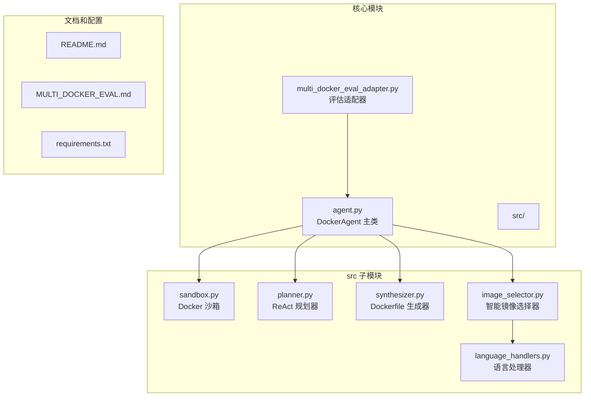
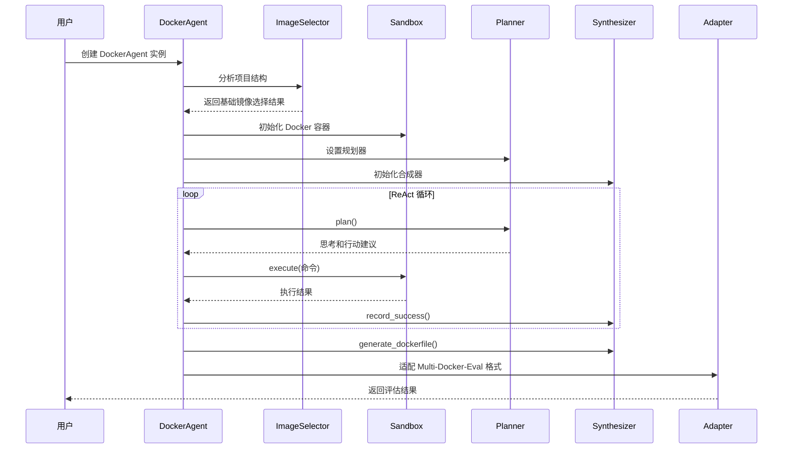
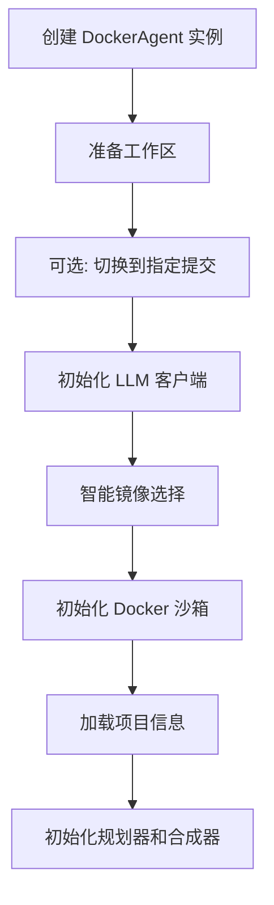
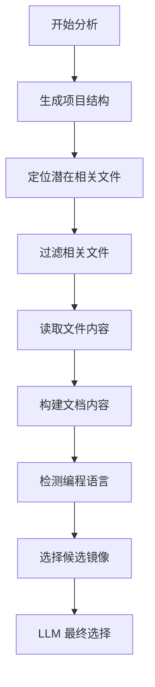
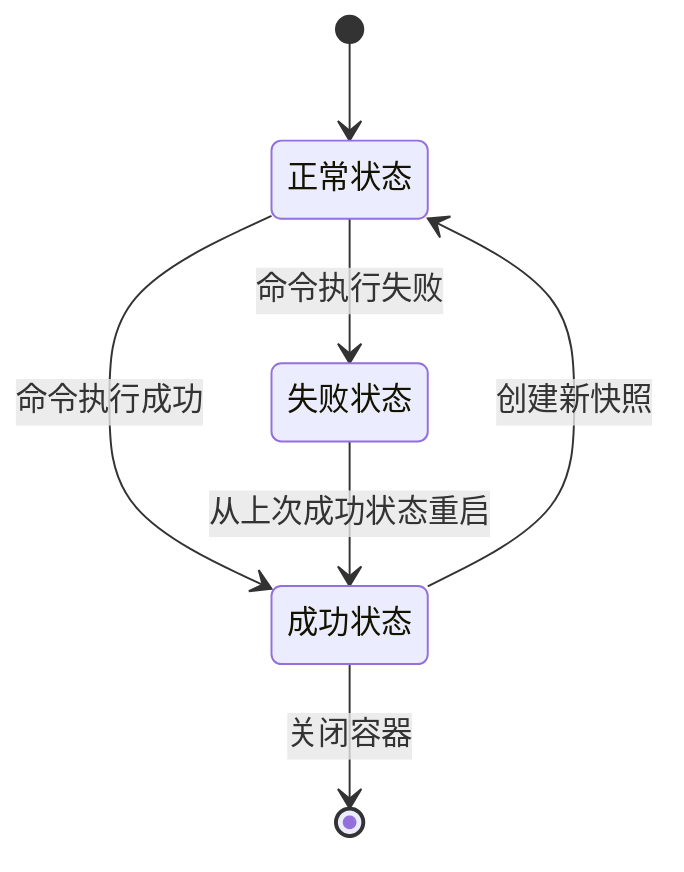
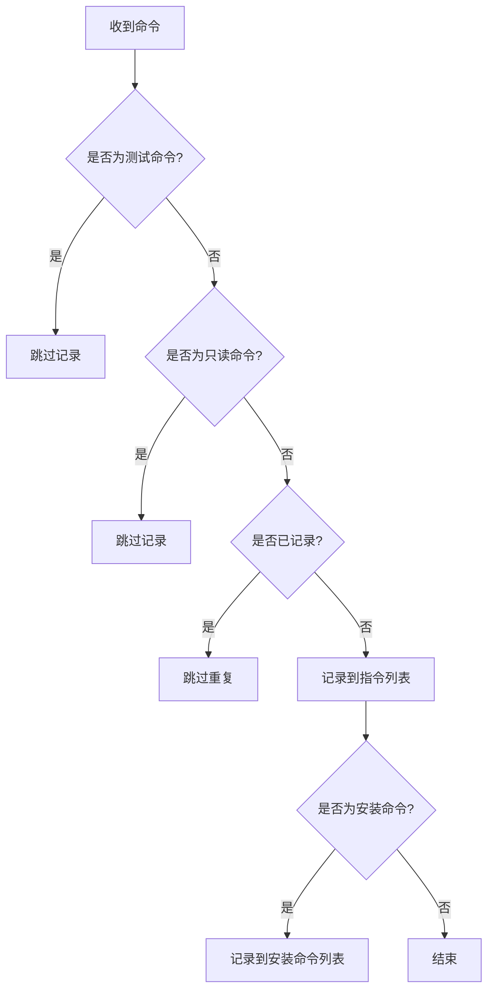
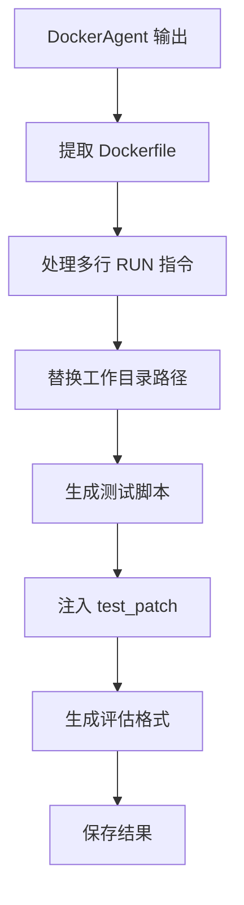
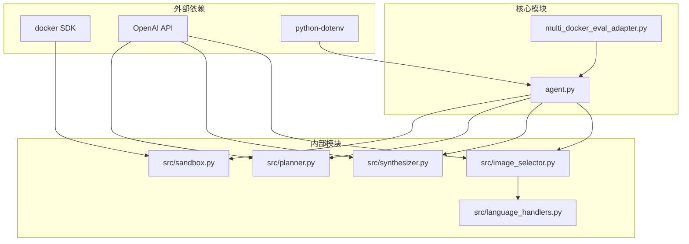

# DockerAgent 主类

<cite>
**本文档引用的文件**
- [agent.py](file://agent.py)
- [multi_docker_eval_adapter.py](file://multi_docker_eval_adapter.py)
- [src/sandbox.py](file://src/sandbox.py)
- [src/planner.py](file://src/planner.py)
- [src/synthesizer.py](file://src/synthesizer.py)
- [src/image_selector.py](file://src/image_selector.py)
- [src/language_handlers.py](file://src/language_handlers.py)
- [README.md](file://README.md)
- [doc/MULTI_DOCKER_EVAL.md](file://doc/MULTI_DOCKER_EVAL.md)
- [requirements.txt](file://requirements.txt)
</cite>

## 目录
1. [简介](#简介)
2. [项目结构](#项目结构)
3. [核心组件](#核心组件)
4. [架构概览](#架构概览)
5. [详细组件分析](#详细组件分析)
6. [依赖关系分析](#依赖关系分析)
7. [性能考虑](#性能考虑)
8. [故障排除指南](#故障排除指南)
9. [结论](#结论)

## 简介

DockerAgent 是一个基于大型语言模型（LLM）的智能代理系统，专门设计用于自动为 GitHub 仓库配置可执行的 Docker 环境。该系统通过 ReAct（思考-行动-观察）范式，结合 Docker 容器沙箱和智能图像选择机制，能够自动分析项目结构、识别依赖关系、安装必要工具，并生成完整的 Dockerfile。

该系统特别针对 Multi-Docker-Eval 评估基准进行了优化，能够处理 15 种主流编程语言，包括 Python、JavaScript、TypeScript、Java、Go、Rust、C++、Ruby、PHP 等，为软件工程中的环境配置自动化提供了强大的解决方案。

## 项目结构

该项目采用模块化设计，主要包含以下核心目录和文件：



**图表来源**
- [agent.py](file://agent.py#L1-L396)
- [multi_docker_eval_adapter.py](file://multi_docker_eval_adapter.py#L1-L750)

**章节来源**
- [README.md](file://README.md#L1-L71)
- [doc/MULTI_DOCKER_EVAL.md](file://doc/MULTI_DOCKER_EVAL.md#L1-L372)

## 核心组件

DockerAgent 主类是整个系统的核心，负责协调各个子组件的工作流程。其主要职责包括：

### 初始化流程
1. **工作区准备**：克隆目标仓库到本地工作目录
2. **基础镜像选择**：使用智能算法分析项目并选择最优的基础 Docker 镜像
3. **环境初始化**：设置 Docker 沙箱、规划器和合成器
4. **配置加载**：加载项目结构和相关配置文件

### 执行流程
1. **ReAct 循环**：重复执行思考-行动-观察循环
2. **命令执行**：在 Docker 容器中安全执行命令
3. **状态管理**：使用 commit 回滚机制确保环境一致性
4. **结果合成**：生成最终的 Dockerfile 和快速启动文档

**章节来源**
- [agent.py](file://agent.py#L18-L136)

## 架构概览

DockerAgent 采用了高度模块化的架构设计，通过清晰的职责分离实现了强大的功能：



**图表来源**
- [agent.py](file://agent.py#L283-L362)
- [multi_docker_eval_adapter.py](file://multi_docker_eval_adapter.py#L100-L270)

## 详细组件分析

### DockerAgent 主类

DockerAgent 是系统的核心控制器，负责协调所有子组件的工作。其设计体现了以下关键特性：

#### 初始化阶段


**图表来源**
- [agent.py](file://agent.py#L19-L136)

#### 核心方法分析

**run() 方法**：这是 DockerAgent 的主要执行入口，实现了完整的 ReAct 循环：

```mermaid
flowchart TD
A[开始 run() 方法] --> B[初始化观察值]
B --> C[循环执行步骤]
C --> D[规划下一步行动]
D --> E[执行命令]
E --> F{执行成功?}
F --> |是| G[记录成功指令]
F --> |否| H[回滚到上次成功状态]
G --> I{达到成功条件?}
H --> C
I --> |是| J[生成 Dockerfile]
I --> |否| C
J --> K[生成快速启动文档]
K --> L[清理容器]
```

**图表来源**
- [agent.py](file://agent.py#L283-L362)

**章节来源**
- [agent.py](file://agent.py#L18-L396)

### ImageSelector 智能镜像选择器

ImageSelector 是一个强大的组件，专门负责根据项目特征自动选择最优的基础 Docker 镜像：

#### 文件分析流程


**图表来源**
- [src/image_selector.py](file://src/image_selector.py#L247-L320)

#### 语言检测机制
系统支持 15 种主流编程语言，每种语言都有专门的检测逻辑：

| 语言 | 检测特征 | 候选镜像范围 |
|------|----------|-------------|
| Python | requirements.txt, setup.py, pyproject.toml | python:3.6-3.14 |
| JavaScript | package.json, package-lock.json | node:18-25 |
| TypeScript | tsconfig.json, .ts 文件 | node:18-25 |
| Java | pom.xml, build.gradle | eclipse-temurin:11/17/21 |
| Go | go.mod, go.sum | golang:1.19-1.25 |
| Rust | Cargo.toml, rust-toolchain | rust:1.70-1.90 |
| C++ | CMakeLists.txt, .cpp 文件 | gcc:11-14 |
| Ruby | Gemfile, Gemfile.lock | ruby:3.0-3.4 |
| PHP | composer.json, .php 文件 | php:7.4-8.4 |

**章节来源**
- [src/image_selector.py](file://src/image_selector.py#L1-L565)
- [src/language_handlers.py](file://src/language_handlers.py#L1-L714)

### Sandbox Docker 沙箱

Sandbox 提供了安全的命令执行环境，具有以下关键特性：

#### 容器管理
- **自动初始化**：基于指定的基础镜像创建容器
- **平台兼容**：支持 Linux 和 Windows 平台
- **卷挂载**：将本地工作目录映射到容器内的 /app 路径

#### 回滚机制


**图表来源**
- [src/sandbox.py](file://src/sandbox.py#L40-L110)

#### 命令分类
系统能够智能区分不同类型的命令：

| 命令类型 | 示例 | 处理方式 |
|----------|------|----------|
| 读取命令 | ls, cat, pwd, env | 不创建快照 |
| 信息命令 | --help, --version | 不创建快照 |
| 安装命令 | pip install, apt install, npm install | 创建快照 |
| 测试命令 | pytest, npm test, cargo test | 不记录到 Dockerfile |
| 构建命令 | make, cmake, cargo build | 创建快照 |

**章节来源**
- [src/sandbox.py](file://src/sandbox.py#L1-L263)

### Planner ReAct 规划器

Planner 实现了 ReAct（思考-行动-观察）范式，是智能决策的核心：

#### 系统提示设计
Planner 的系统提示包含了严格的行为约束：

**核心指导原则**：
1. **分析与设置**：识别依赖文件并安装所有必要的包/工具
2. **阅读文档**：安装后阅读 README.md 了解快速启动说明
3. **强制验证**：必须运行项目的测试套件验证环境正确性
4. **无借口规则**：测试失败时绝对不能输出 "Final Answer: Success"
5. **环境限制**：禁止使用 docker build、docker run、sudo 等命令

#### 成本计算
系统内置了详细的 API 调用成本计算机制：

| 模型系列 | 输入价格 ($/1M tokens) | 输出价格 ($/1M tokens) |
|----------|----------------------|-----------------------|
| GPT-5 系列 | $1.25 - $21.00 | $10.00 - $168.00 |
| GPT-4 系列 | $2.00 - $30.00 | $8.00 - $60.00 |
| GPT-3.5 系列 | $0.50 | $1.50 |
| o 系列 | $1.10 - $150.00 | $4.40 - $600.00 |

**章节来源**
- [src/planner.py](file://src/planner.py#L1-L232)

### Synthesizer Dockerfile 生成器

Synthesizer 负责将成功的命令序列转换为最终的 Dockerfile：

#### 指令记录策略


**图表来源**
- [src/synthesizer.py](file://src/synthesizer.py#L9-L29)

#### 快速启动文档生成
系统能够自动生成简洁的快速启动文档，包含：

1. **安装步骤**：基于实际成功的安装命令
2. **运行说明**：从 README.md 中提取启动命令
3. **API 密钥配置**：检测并提供 API 密钥设置指导
4. **注意事项**：其他必要的配置说明

**章节来源**
- [src/synthesizer.py](file://src/synthesizer.py#L1-L209)

### Multi-Docker-Eval 适配器

Multi-Docker-Eval 适配器将 DockerAgent 的输出转换为评估框架所需的格式：

#### 结果转换流程


**图表来源**
- [multi_docker_eval_adapter.py](file://multi_docker_eval_adapter.py#L122-L270)

#### 评估指标
适配器支持以下评估指标：

| 指标名称 | 描述 | 计算方式 |
|----------|------|----------|
| Build Success Rate | Docker 镜像构建成功率 | 成功构建的实例数 / 总实例数 |
| F2P (Fail-to-Pass) | 从失败到通过的成功率 | (成功构建且测试通过) / (成功构建) |
| Commit Rate | 平均每个任务的 commit 次数 | 总 commit 次数 / 总实例数 |
| Time Efficiency | 平均完成时间 | 总时间 / 总实例数 |

**章节来源**
- [multi_docker_eval_adapter.py](file://multi_docker_eval_adapter.py#L639-L698)

## 依赖关系分析

系统的依赖关系体现了清晰的分层架构：



**图表来源**
- [requirements.txt](file://requirements.txt#L1-L4)
- [agent.py](file://agent.py#L1-L12)

### 关键依赖特性

**Docker SDK 依赖**：
- 提供容器生命周期管理
- 支持卷挂载和网络配置
- 实现容器状态监控

**OpenAI API 依赖**：
- 用于智能镜像选择
- 支持 ReAct 规划
- 生成快速启动文档

**dotenv 依赖**：
- 管理环境变量配置
- 支持 API 密钥安全存储

**章节来源**
- [requirements.txt](file://requirements.txt#L1-L4)

## 性能考虑

### 内存和存储优化
1. **镜像清理**：系统会自动清理中间镜像和未使用的资源
2. **文件大小限制**：对配置文件大小进行限制，避免内存溢出
3. **缓存策略**：智能缓存项目结构和相关文件内容

### 执行效率优化
1. **并行处理**：Multi-Docker-Eval 适配器支持批量处理
2. **增量更新**：只记录有效的环境配置命令
3. **智能回滚**：最小化回滚操作的开销

### 成本控制
1. **API 调用限制**：通过成本计算机制控制 LLM 使用
2. **步骤限制**：默认最大 30 步，可根据需要调整
3. **资源监控**：实时监控磁盘和内存使用情况

## 故障排除指南

### 常见问题及解决方案

**Docker 连接问题**
- **症状**：`Cannot connect to the Docker daemon`
- **原因**：Docker Engine 未启动
- **解决方案**：启动 Docker Desktop 或 Docker Engine

**API 密钥问题**
- **症状**：`OPENAI_API_KEY not found`
- **原因**：环境变量配置错误
- **解决方案**：检查 .env 文件配置

**镜像选择问题**
- **症状**：基础镜像选择不当
- **原因**：项目特征识别错误
- **解决方案**：手动指定基础镜像或调整语言检测逻辑

**容器构建超时**
- **症状**：命令执行失败 (exit 124)
- **原因**：依赖安装时间过长
- **解决方案**：增加 `--max-steps` 参数或优化依赖安装

**章节来源**
- [doc/MULTI_DOCKER_EVAL.md](file://doc/MULTI_DOCKER_EVAL.md#L319-L344)

## 结论

DockerAgent 主类代表了自动化环境配置领域的先进实践，通过以下关键创新实现了卓越的性能：

### 技术优势
1. **智能镜像选择**：基于项目特征的自动基础镜像选择
2. **安全执行环境**：Docker 容器沙箱确保命令执行安全
3. **智能回滚机制**：基于 commit 的状态管理
4. **多语言支持**：覆盖 15 种主流编程语言
5. **成本控制**：内置 API 调用成本计算和限制

### 应用价值
1. **评估基准**：完美适配 Multi-Docker-Eval 评估框架
2. **开发效率**：显著减少手动环境配置时间
3. **一致性保证**：确保不同环境下的配置一致性
4. **可扩展性**：模块化设计支持功能扩展

### 未来发展方向
1. **性能优化**：进一步减少 API 调用次数
2. **准确性提升**：改进语言检测和依赖识别算法
3. **用户体验**：提供更丰富的配置选项和可视化界面
4. **生态集成**：与更多 CI/CD 平台和服务集成

DockerAgent 不仅是一个强大的技术工具，更是推动软件工程自动化发展的重要里程碑。