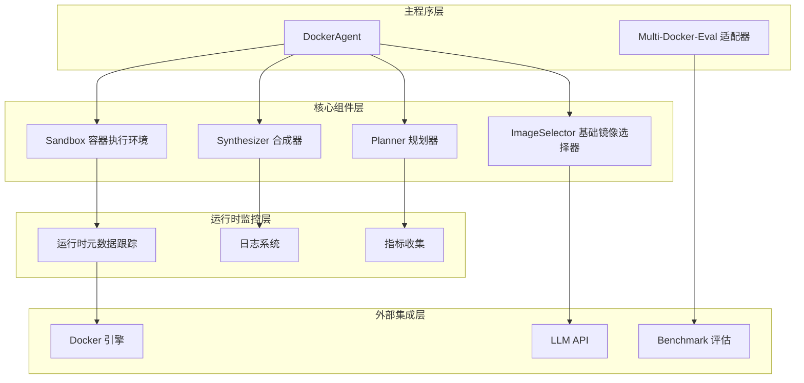
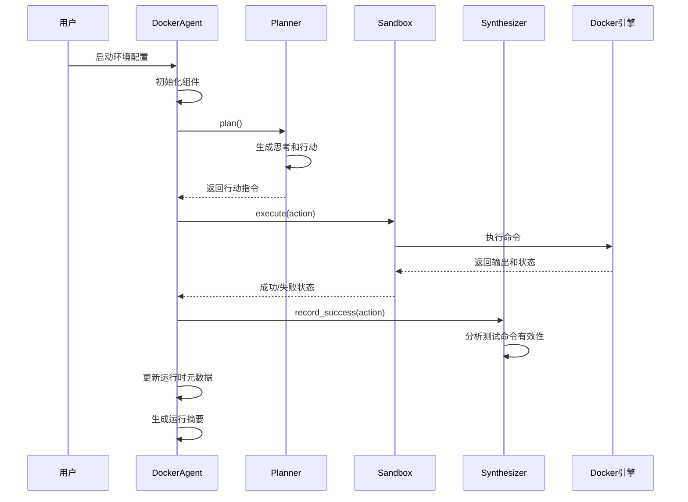
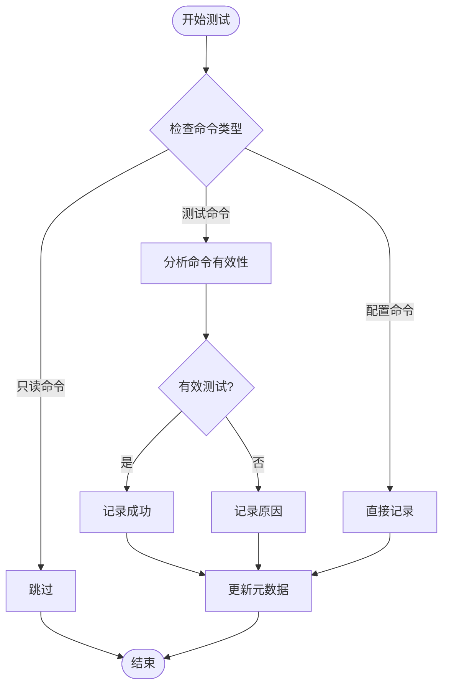
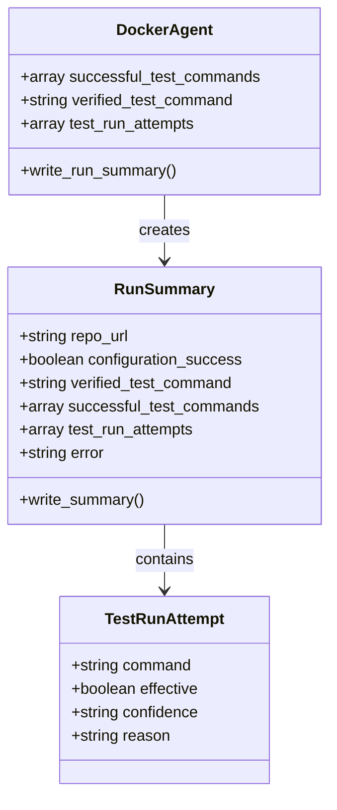
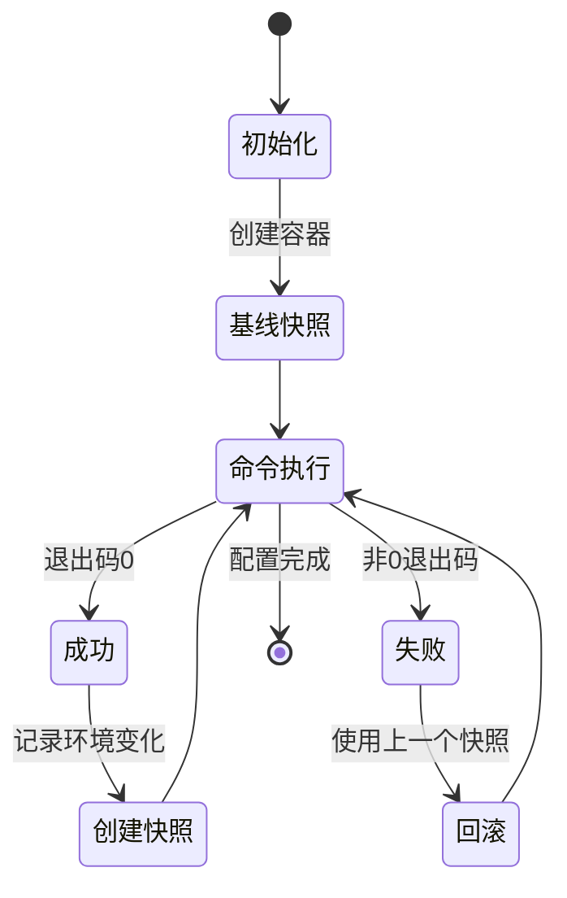
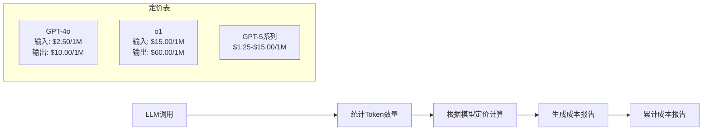
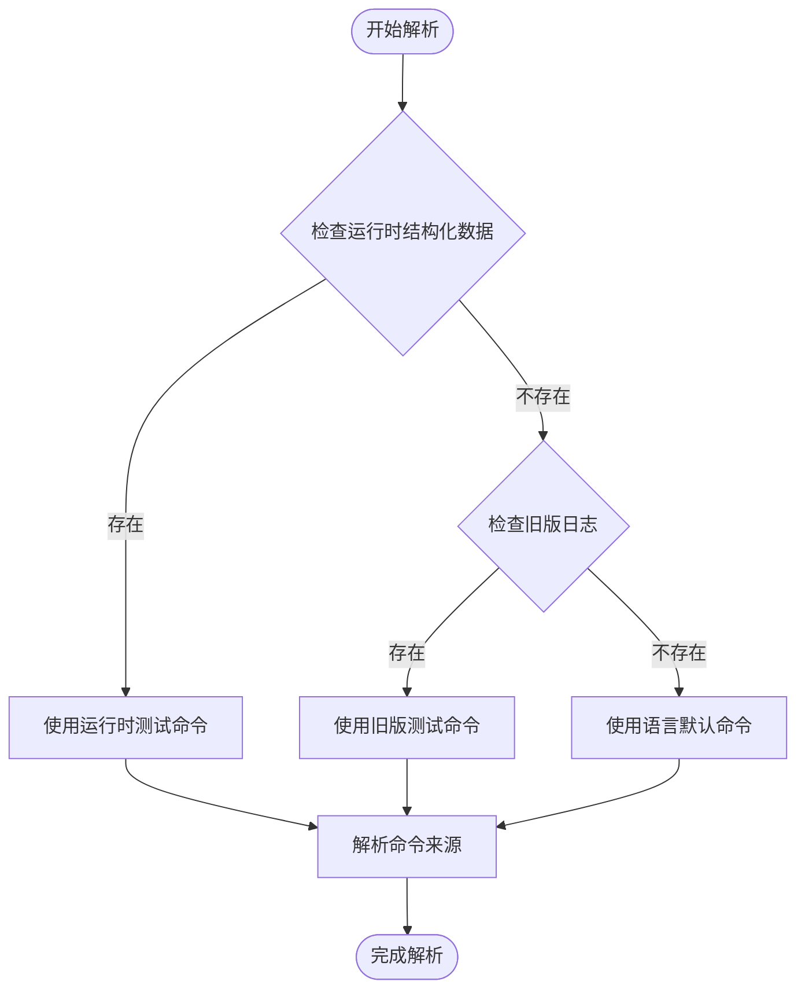
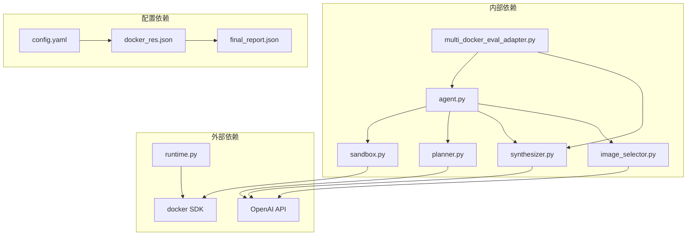

# 运行时元数据跟踪

<cite>
**本文档引用的文件**
- [agent.py](file://agent.py)
- [sandbox.py](file://src/sandbox.py)
- [planner.py](file://src/planner.py)
- [synthesizer.py](file://src/synthesizer.py)
- [image_selector.py](file://src/image_selector.py)
- [multi_docker_eval_adapter.py](file://multi_docker_eval_adapter.py)
- [runtime.py](file://others_work/RepoLaunch/launch/core/runtime.py)
- [final_report.json](file://eval_output/DockerAgent/final_report.json)
- [docker_res.json](file://multi_docker_eval_output/docker_res.json)
- [config.yaml](file://outputs/2026-03-09/17-25-30/.hydra/config.yaml)
</cite>

## 目录
1. [简介](#简介)
2. [项目结构](#项目结构)
3. [核心组件](#核心组件)
4. [架构概览](#架构概览)
5. [详细组件分析](#详细组件分析)
6. [依赖关系分析](#依赖关系分析)
7. [性能考虑](#性能考虑)
8. [故障排除指南](#故障排除指南)
9. [结论](#结论)

## 简介

本文档深入分析了该代码库中的"运行时元数据跟踪"系统。该系统通过四个核心组件实现了完整的运行时监控、数据收集和状态管理机制：

- **DockerAgent**: 主控制器，负责协调整个运行时流程
- **Sandbox**: 容器执行环境，提供基于提交的回滚机制
- **Planner**: 规划器，使用ReAct模式进行环境配置规划
- **Synthesizer**: 合成器，记录成功指令并生成最终的Dockerfile

该系统的核心创新在于其结构化的运行时元数据收集机制，能够精确追踪每个测试命令的有效性、成功率和执行上下文。

## 项目结构

**图表来源**
- [agent.py:18-138](file://agent.py#L18-L138)
- [sandbox.py:8-331](file://src/sandbox.py#L8-L331)
- [planner.py:6-231](file://src/planner.py#L6-L231)
- [synthesizer.py:4-499](file://src/synthesizer.py#L4-L499)

**章节来源**
- [agent.py:1-433](file://agent.py#L1-L433)
- [README.md:1-71](file://README.md#L1-L71)

## 核心组件

### DockerAgent - 主控制器

DockerAgent是整个系统的中枢，负责协调各个组件并维护运行时状态。其核心职责包括：

- **工作区管理**: 准备本地工作区并克隆仓库
- **基础镜像选择**: 自动检测最优的基础Docker镜像
- **组件初始化**: 设置Sandbox、Planner和Synthesizer
- **运行时元数据跟踪**: 记录测试命令的有效性和执行结果

### Sandbox - 容器执行环境

Sandbox提供了强大的容器执行和回滚机制：

- **提交快照**: 每次成功命令都会创建新的镜像快照
- **回滚机制**: 失败时自动回滚到上一个成功状态
- **超时控制**: 支持命令级别的超时设置
- **环境隔离**: 确保每次执行都在隔离的容器环境中进行

### Planner - 智能规划器

Planner使用ReAct（思考-行动-观察）模式进行智能规划：

- **成本计算**: 实时计算LLM调用成本
- **约束管理**: 强制执行环境限制和规则
- **历史记录**: 维护完整的对话历史
- **测试验证**: 确保测试命令的正确执行

### Synthesizer - 元数据收集器

Synthesizer专门负责运行时元数据的收集和分析：

- **测试命令识别**: 区分测试命令和配置命令
- **有效性分析**: 判断测试命令是否真正执行
- **结构化存储**: 将元数据保存为JSON格式
- **API密钥检测**: 跟踪项目所需的API密钥

**章节来源**
- [agent.py:18-138](file://agent.py#L18-L138)
- [sandbox.py:8-331](file://src/sandbox.py#L8-L331)
- [planner.py:6-231](file://src/planner.py#L6-L231)
- [synthesizer.py:4-499](file://src/synthesizer.py#L4-L499)

## 架构概览

**图表来源**
- [agent.py:285-361](file://agent.py#L285-L361)
- [sandbox.py:81-152](file://src/sandbox.py#L81-L152)
- [synthesizer.py:12-44](file://src/synthesizer.py#L12-L44)

## 详细组件分析

### 运行时元数据收集机制

系统实现了多层次的元数据收集机制：

#### 1. 测试命令跟踪

**图表来源**
- [synthesizer.py:106-148](file://src/synthesizer.py#L106-L148)
- [agent.py:362-381](file://agent.py#L362-L381)

#### 2. 成功测试命令记录

系统维护三个关键的数据结构来跟踪测试命令：

| 数据结构 | 字段 | 描述 |
|---------|------|------|
| `successful_test_commands` | `action` | 最终验证通过的测试命令列表 |
| `verified_test_command` | `action` | 最近一次验证通过的测试命令 |
| `test_run_attempts` | `command, effective, confidence, reason` | 所有测试运行尝试的详细记录 |

#### 3. 运行摘要生成

**图表来源**
- [agent.py:383-398](file://agent.py#L383-L398)
- [multi_docker_eval_adapter.py:509-538](file://multi_docker_eval_adapter.py#L509-L538)

**章节来源**
- [agent.py:362-398](file://agent.py#L362-L398)
- [synthesizer.py:106-148](file://src/synthesizer.py#L106-L148)

### 容器执行和回滚机制

Sandbox组件提供了完整的容器生命周期管理：

#### 1. 快照管理系统

**图表来源**
- [sandbox.py:110-152](file://src/sandbox.py#L110-L152)
- [sandbox.py:154-167](file://src/sandbox.py#L154-L167)

#### 2. 命令分类和处理

系统智能区分不同类型的命令：

| 命令类型 | 示例 | 处理方式 |
|---------|------|----------|
| 环境配置命令 | `pip install`, `apt-get install` | 记录为RUN指令 |
| 测试命令 | `pytest`, `npm test` | 分析有效性并记录 |
| 只读命令 | `ls`, `cat`, `pwd` | 跳过不记录 |
| 信息查询命令 | `--help`, `--version` | 跳过但分析输出 |

**章节来源**
- [sandbox.py:81-152](file://src/sandbox.py#L81-L152)
- [synthesizer.py:46-52](file://src/synthesizer.py#L46-L52)

### LLM集成和成本跟踪

Planner组件集成了LLM调用管理和成本跟踪：

#### 1. 成本计算机制

**图表来源**
- [planner.py:20-51](file://src/planner.py#L20-L51)
- [planner.py:193-215](file://src/planner.py#L193-L215)

#### 2. 对话历史管理

Planner维护完整的对话历史，支持：

- **系统提示词**: 包含详细的环境限制和指导原则
- **用户消息**: 上次观察结果
- **助手回复**: LLM的思考和行动
- **元数据**: Token使用量和成本信息

**章节来源**
- [planner.py:107-156](file://src/planner.py#L107-L156)
- [planner.py:158-191](file://src/planner.py#L158-L191)

### Multi-Docker-Eval适配器集成

适配器负责将DockerAgent的输出转换为Multi-Docker-Eval评估格式：

#### 1. 测试命令解析策略

**图表来源**
- [multi_docker_eval_adapter.py:521-553](file://multi_docker_eval_adapter.py#L521-L553)
- [multi_docker_eval_adapter.py:442-507](file://multi_docker_eval_adapter.py#L442-L507)

#### 2. 数据源优先级

适配器采用以下优先级解析测试命令：

1. **运行时结构化数据** (`agent_run_summary.json`)
2. **旧版日志数据** (`setup_logs/*.md`)
3. **语言默认命令** (基于项目类型推断)

**章节来源**
- [multi_docker_eval_adapter.py:521-553](file://multi_docker_eval_adapter.py#L521-L553)
- [multi_docker_eval_adapter.py:509-538](file://multi_docker_eval_adapter.py#L509-L538)

## 依赖关系分析

**图表来源**
- [agent.py:1-12](file://agent.py#L1-L12)
- [multi_docker_eval_adapter.py:34](file://multi_docker_eval_adapter.py#L34)
- [runtime.py:23-25](file://others_work/RepoLaunch/launch/core/runtime.py#L23-L25)

**章节来源**
- [agent.py:1-12](file://agent.py#L1-L12)
- [multi_docker_eval_adapter.py:34](file://multi_docker_eval_adapter.py#L34)

## 性能考虑

### 1. 内存和存储优化

系统采用了多项性能优化策略：

- **增量快照**: 仅对有环境变化的命令创建快照
- **文件大小限制**: 过滤大于阈值的文件，避免内存溢出
- **输出截断**: 长输出自动截断，减少存储开销
- **智能清理**: 自动清理不再使用的镜像和容器

### 2. LLM调用优化

- **成本控制**: 实时计算和累计LLM调用成本
- **提示词缓存**: 重复使用的提示词进行缓存
- **批量处理**: 相关操作进行批量化处理

### 3. 并发处理

- **异步执行**: 支持多个容器并发执行
- **资源限制**: 通过配置文件控制最大并发数
- **超时管理**: 防止长时间阻塞的操作

## 故障排除指南

### 1. 常见问题诊断

#### Docker相关问题
- **Docker守护进程未运行**: 检查Docker服务状态
- **权限不足**: 确保用户在docker组中
- **镜像拉取失败**: 检查网络连接和镜像名称

#### LLM API问题
- **API密钥无效**: 验证OPENAI_API_KEY环境变量
- **配额限制**: 检查账户余额和使用限额
- **请求超时**: 调整超时设置或重试机制

#### 运行时元数据问题
- **JSON解析错误**: 检查agent_run_summary.json格式
- **文件权限问题**: 确保工作区目录可写
- **磁盘空间不足**: 清理不必要的镜像和容器

### 2. 调试工具

系统提供了多种调试和监控工具：

- **详细日志**: 每个步骤都有详细的执行日志
- **运行摘要**: 结构化的运行时元数据
- **成本报告**: 实时的LLM调用成本统计
- **容器状态**: 容器的实时状态监控

**章节来源**
- [agent.py:400-420](file://agent.py#L400-L420)
- [sandbox.py:310-331](file://src/sandbox.py#L310-L331)

## 结论

该运行时元数据跟踪系统展现了高度的工程化设计和实用性：

### 主要成就

1. **完整的生命周期管理**: 从环境配置到测试验证的全流程跟踪
2. **智能的元数据收集**: 精确区分不同类型的操作并记录有效信息
3. **强大的回滚机制**: 基于容器快照的可靠状态恢复
4. **成本透明化**: 实时的成本计算和监控
5. **标准化输出**: 为评估框架提供标准化的数据接口

### 技术亮点

- **结构化元数据**: 通过JSON格式提供机器可读的运行时信息
- **多源数据融合**: 结合运行时数据和历史日志进行综合分析
- **智能决策支持**: 为评估和优化提供可靠的数据基础
- **可扩展架构**: 模块化设计便于功能扩展和维护

### 应用价值

该系统不仅提高了自动化环境配置的可靠性，还为后续的性能优化、质量保证和成本控制提供了坚实的数据基础。通过精确的运行时元数据跟踪，开发者可以更好地理解配置过程中的关键决策点和潜在问题，从而做出更明智的技术选择。