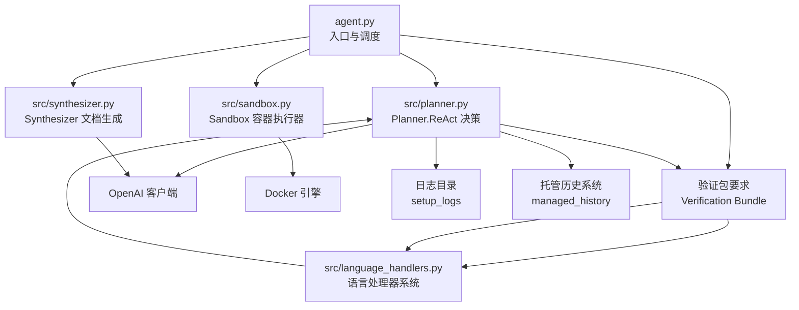
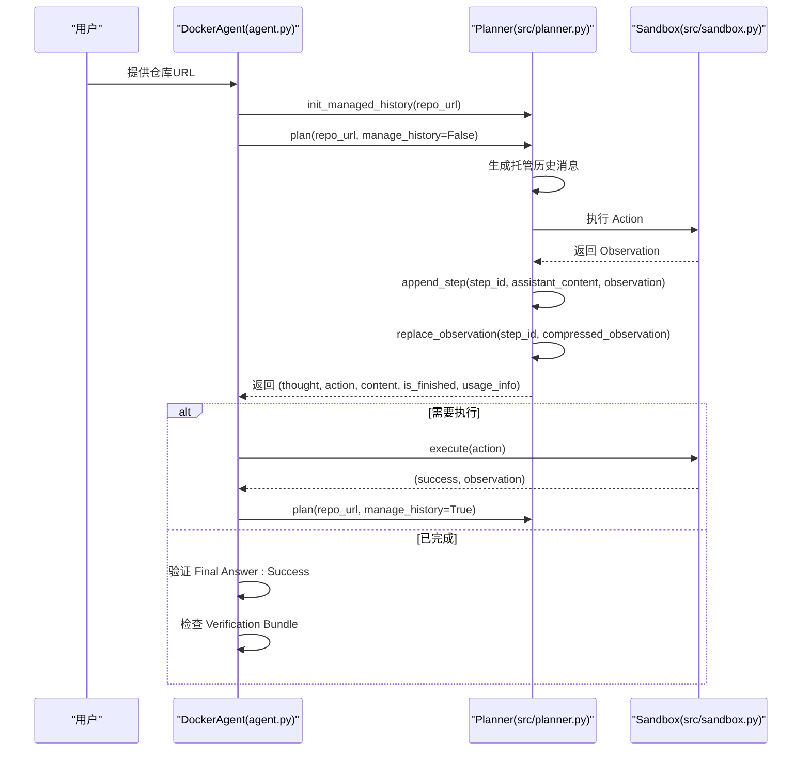
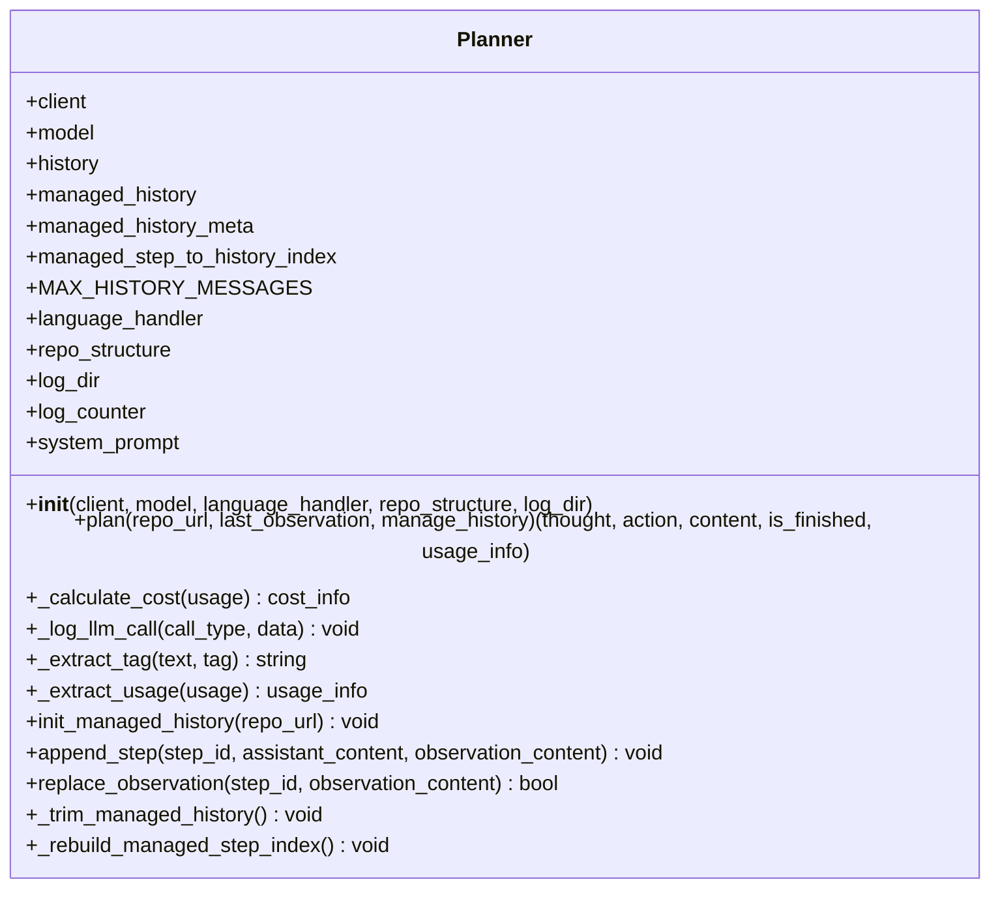
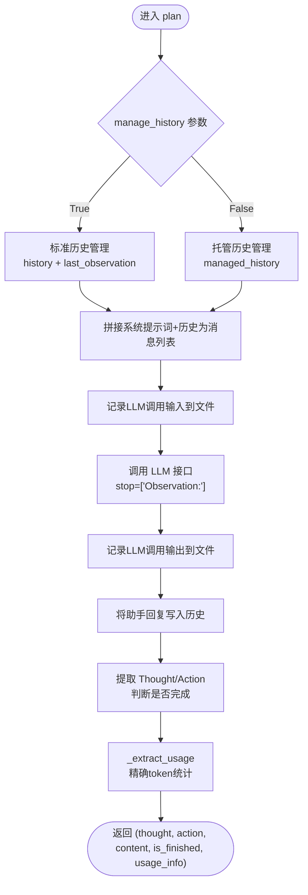
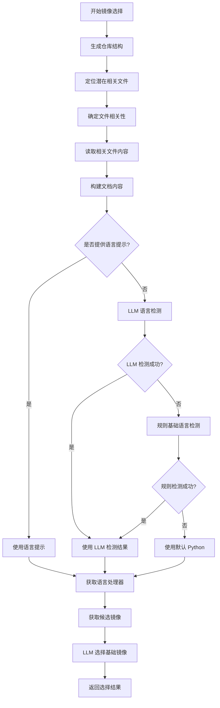
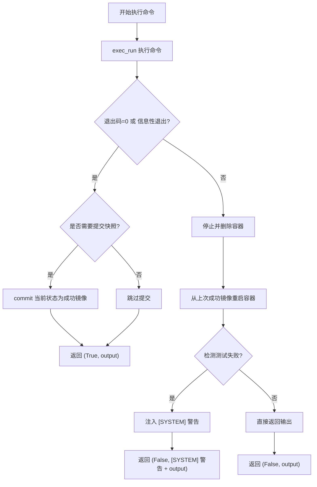
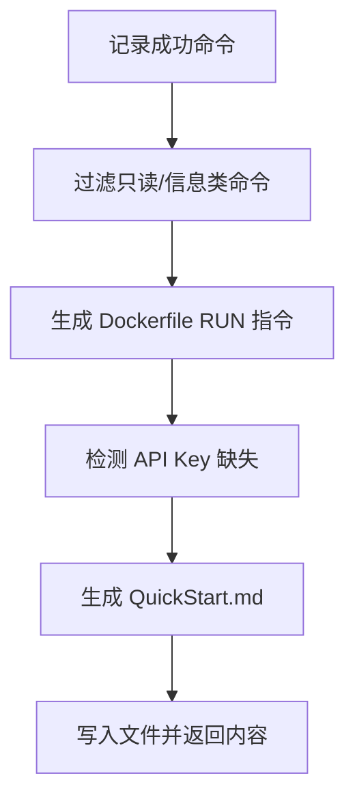
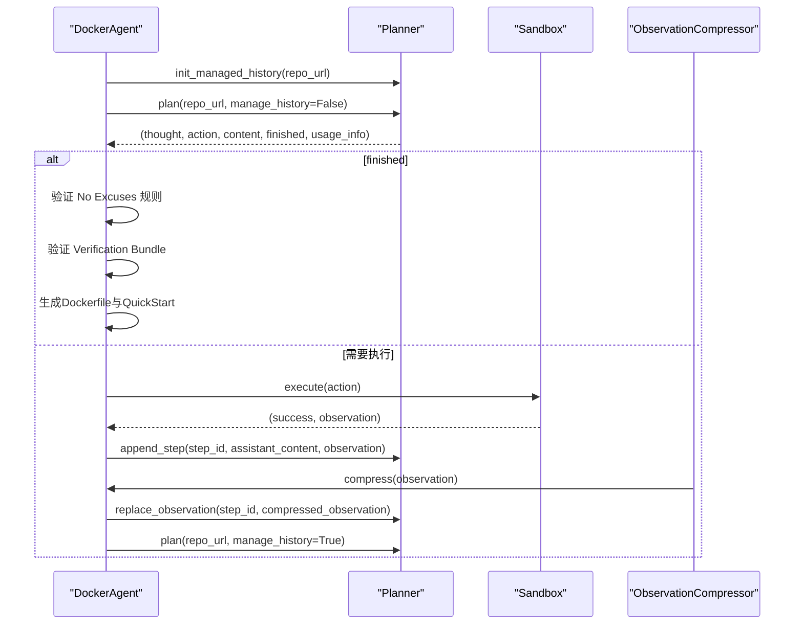
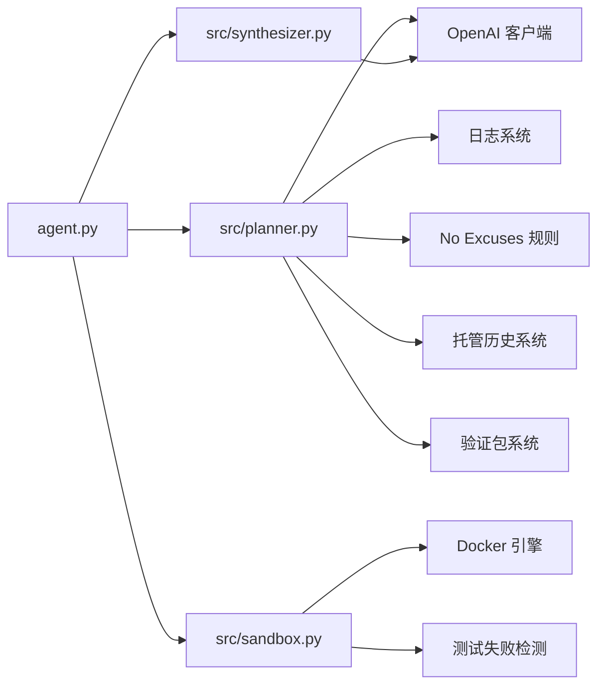

# Planner 模块

<cite>
**本文引用的文件**
- [src/planner.py](file://src/planner.py)
- [src/language_handlers.py](file://src/language_handlers.py)
- [src/image_selector.py](file://src/image_selector.py)
- [src/sandbox.py](file://src/sandbox.py)
- [src/synthesizer.py](file://src/synthesizer.py)
- [agent.py](file://agent.py)
- [tests/test_planner_history.py](file://tests/test_planner_history.py)
- [README.md](file://README.md)
- [workplace/QuickStart.md](file://workplace/QuickStart.md)
- [requirements.txt](file://requirements.txt)
</cite>

## 更新摘要
**变更内容**
- 新增托管历史跟踪功能：引入 `managed_history` 系统，支持结构化的历史记录管理
- 结构化验证包要求：在 Final Answer 中强制要求 Verification Bundle JSON 对象
- 改进的 token 使用跟踪：新增 `_extract_usage` 方法，提供更精确的 token 统计
- 107行代码增强：大幅增强了历史管理、日志记录和验证机制
- 观察值压缩集成：与 ObservationCompressor 系统无缝集成，支持动态替换观察值

## 目录
1. [简介](#简介)
2. [项目结构](#项目结构)
3. [核心组件](#核心组件)
4. [架构总览](#架构总览)
5. [详细组件分析](#详细组件分析)
6. [依赖关系分析](#依赖关系分析)
7. [性能考量](#性能考量)
8. [故障排查指南](#故障排查指南)
9. [结论](#结论)
10. [附录](#附录)

## 简介
本技术文档围绕 Planner 模块展开，系统性阐述其在 ReAct（思考-行动-观察）对话管理中的实现原理与工作机制。文档重点覆盖以下方面：
- ReAct 工作流：思考生成、行动规划、观察获取与完成条件判断
- LLM 对话管理：消息历史维护、系统提示词模板、响应解析
- **新增**：托管历史跟踪系统：结构化的历史记录管理，支持动态观察值压缩
- **新增**：结构化验证包要求：强制要求 Verification Bundle JSON 对象，确保可验证的成功声明
- **新增**：改进的 token 使用跟踪：精确的输入/输出令牌统计与累计跟踪
- **新增**：观察值压缩集成：与 ObservationCompressor 系统协同工作，动态替换历史中的观察值
- 历史记录管理：消息队列与上下文构建策略
- 语言处理器系统：多语言环境规划与上下文感知设置指导
- 智能基础镜像选择：基于语言处理器的最优镜像推荐
- 实战示例：如何使用 Planner 进行智能决策，含错误处理与性能优化建议

## 项目结构
该仓库采用"按职责分层"的组织方式，Planner 作为核心决策模块，配合语言处理器系统、智能镜像选择器、Sandbox 执行器与 Synthesizer 文档生成器，形成完整的 ReAct 循环。

**图表来源**
- [agent.py:170-181](file://agent.py#L170-L181)
- [src/planner.py:5-281](file://src/planner.py#L5-L281)
- [src/sandbox.py:4-178](file://src/sandbox.py#L4-L178)
- [src/synthesizer.py:1-144](file://src/synthesizer.py#L1-L144)
- [src/image_selector.py:117-506](file://src/image_selector.py#L117-L506)
- [src/language_handlers.py:10-700](file://src/language_handlers.py#L10-L700)

**章节来源**
- [README.md:1-71](file://README.md#L1-L71)
- [requirements.txt:1-4](file://requirements.txt#L1-L4)

## 核心组件
- **Planner**：负责根据系统提示词与历史消息生成下一步 ReAct 步骤（Thought/Action），并解析 LLM 输出，同时计算本次调用的成本。**新增**：支持托管历史跟踪系统，动态注入语言特定的设置指导；支持结构化验证包要求；增强的 token 使用跟踪；与观察值压缩系统的深度集成。
- **语言处理器系统**：提供多语言环境规划能力，支持 16 种编程语言，包含自动检测、基础镜像选择和语言特定的设置指导。
- **智能镜像选择器**：分析仓库结构和文件内容，使用 LLM 和规则基础方法选择最优的基础 Docker 镜像。
- **Sandbox**：在 Docker 容器内执行 Bash 命令，具备成功态提交与失败回滚能力，确保环境状态可控。**新增**：实现智能测试失败检测，自动注入 `[SYSTEM]` 警告。
- **Synthesizer**：记录成功执行的命令，生成最终 Dockerfile 与 QuickStart 文档，辅助用户快速复现环境。

**章节来源**
- [src/planner.py:5-281](file://src/planner.py#L5-L281)
- [src/language_handlers.py:10-700](file://src/language_handlers.py#L10-L700)
- [src/image_selector.py:117-506](file://src/image_selector.py#L117-L506)
- [src/sandbox.py:4-178](file://src/sandbox.py#L4-L178)
- [src/synthesizer.py:1-144](file://src/synthesizer.py#L1-L144)

## 架构总览
下图展示了 ReAct 循环在本项目中的端到端流程：Planner 生成 Action，Sandbox 执行 Action 并返回 Observation，Planner 将 Observation 追加到历史并继续迭代，直至满足"Final Answer"完成条件。**新增**：托管历史跟踪系统提供结构化的历史管理，观察值压缩系统动态优化历史空间，结构化验证包确保成功声明的可验证性。

**图表来源**
- [agent.py:179-181](file://agent.py#L179-L181)
- [agent.py:340-344](file://agent.py#L340-L344)
- [agent.py:480-484](file://agent.py#L480-L484)
- [agent.py:531](file://agent.py#L531)
- [src/planner.py:156-191](file://src/planner.py#L156-L191)

## 详细组件分析

### Planner 组件分析
Planner 是 ReAct 决策的核心，负责：
- 初始化系统提示词与历史记录
- **新增**：集成托管历史跟踪系统，支持结构化的历史管理
- **新增**：支持语言处理器参数，动态注入语言特定的设置指导
- **新增**：支持仓库结构信息，提供更丰富的上下文
- **新增**：支持 LLM 交互日志记录，便于调试和审计
- 构建消息列表并调用 LLM
- 解析 Thought 与 Action
- **新增**：计算单步与累计成本，支持多种模型定价
- 判断完成条件

**图表来源**
- [src/planner.py:5-281](file://src/planner.py#L5-L281)

#### ReAct 工作流详解
- 初始化阶段：首次调用时向历史记录追加仓库 URL；随后每次迭代将上一轮的 Observation 作为用户消息加入历史。
- **新增**：托管历史系统：当 `manage_history=False` 时，使用托管历史系统，支持动态观察值压缩和替换。
- **新增**：语言处理器集成：如果提供了语言处理器，将在系统提示词中注入语言特定的设置指导。
- **新增**：仓库结构集成：如果提供了仓库结构信息，将添加到系统提示词中，为 LLM 提供更丰富的上下文。
- **新增**：日志记录：在调用 LLM 前后分别记录输入和输出，便于调试和审计。
- 消息构建：将系统提示词与历史拼接为完整 messages，调用 LLM 接口，设置 stop 为"Observation:"，避免输出被截断。
- 输出解析：通过正则提取 Thought 与 Action，识别"Final Answer:"标记以判定完成。
- **新增**：成本计算：基于响应 usage 中的 prompt/completion/total tokens，结合定价表计算单步与累计成本。

**图表来源**
- [src/planner.py:92-154](file://src/planner.py#L92-L154)
- [src/planner.py:260-265](file://src/planner.py#L260-L265)

**章节来源**
- [src/planner.py:5-281](file://src/planner.py#L5-L281)

#### 托管历史跟踪系统
**新增**：托管历史跟踪系统提供结构化的历史记录管理

- **新增**：`managed_history` 系统：独立于标准历史的结构化历史管理系统
- **新增**：`managed_history_meta`：历史条目的元数据，包含 step_id 和 kind（assistant/observation）
- **新增**：`managed_step_to_history_index`：步 ID 到历史索引的映射，支持快速查找和更新
- **新增**：`init_managed_history`：初始化托管历史，包含种子消息
- **新增**：`append_step`：添加完整的步骤（助手回复 + 观察值）
- **新增**：`replace_observation`：动态替换特定步的观察值，支持观察值压缩
- **新增**：`_trim_managed_history`：维护托管历史的滑动窗口大小
- **新增**：`_rebuild_managed_step_index`：重建步 ID 索引，支持历史修剪后的重新映射

**章节来源**
- [src/planner.py:156-191](file://src/planner.py#L156-L191)
- [src/planner.py:237-258](file://src/planner.py#L237-L258)

#### 结构化验证包要求
**新增**：结构化验证包要求确保成功声明的可验证性

- **新增**：Final Answer 必须包含 Verification Bundle JSON 对象
- **新增**：Verification Bundle 必须包含以下键：
  - `runtime_preparation_commands`：运行时准备命令列表
  - `test_commands`：验证测试命令列表
- **新增**：所有命令必须精确匹配之前成功执行的命令
- **新增**：排除只读检查命令（如 `redis-cli ping`）
- **新增**：运行时准备命令通常很短，主要用于临时运行时操作

**章节来源**
- [src/planner.py:70-81](file://src/planner.py#L70-L81)

#### 提示词模板与约束
- 系统提示词明确角色定位、当前状态、ReAct 格式要求与任务指导（分析与安装、阅读 README、验证、最终化等）。
- **新增**：语言特定设置指导：根据检测到的编程语言动态注入相应的环境配置建议。
- **新增**：仓库结构信息：如果提供了仓库结构，将添加到系统提示词中，为 LLM 提供更丰富的上下文。
- **新增**：No Excuses 规则约束：严格禁止在测试失败时声明成功，部分通过不算成功，系统警告绑定规则。
- **新增**：结构化验证包要求：强制要求 Verification Bundle JSON 对象。
- 关键约束：仅允许在容器内执行、禁止特定命令（如 docker build/run/compose/systemctl/service 等）、禁止 sudo、若存在 Dockerfile 则需分析依赖并通过包管理器安装。

**章节来源**
- [src/planner.py:35-90](file://src/planner.py#L35-L90)

#### 响应解析与正则提取
- 使用正则按标签提取 Thought 与 Action，支持去除代码块与单引号包裹的命令格式，保证后续执行的安全性与正确性。
- 若未检测到 Action，Planner 将提示澄清并等待修正。

**章节来源**
- [src/planner.py:267-280](file://src/planner.py#L267-L280)

#### 改进的 token 使用跟踪
**新增**：改进的 token 使用跟踪提供精确的统计信息

- **新增**：`_extract_usage` 方法：提供精确的输入/输出/总 token 统计
- **新增**：返回结构化的 usage 信息，包含：
  - `input_tokens`：输入令牌数
  - `output_tokens`：输出令牌数  
  - `total_tokens`：总令牌数
- **新增**：与 Agent 系统的 token 账本集成，支持运行时成本监控
- **新增**：支持不同模型的精确成本计算

**章节来源**
- [src/planner.py:260-265](file://src/planner.py#L260-L265)

#### LLM 交互日志记录
**新增**：改进的 LLM 交互日志记录机制

- **新增**：`_log_llm_call` 方法，支持将 LLM 调用的输入和输出保存到文件中。
- **新增**：支持 `log_dir` 参数，用于指定日志目录。
- **新增**：日志文件命名格式：`{counter}.md`，其中 counter 从 0 开始递增。
- **新增**：日志格式与 image_selector_logs 保持一致，便于统一管理。
- **新增**：输入日志包含完整的消息列表，输出日志包含内容和使用元数据。
- **新增**：自动创建日志目录，支持重复运行而不覆盖之前的日志。

**章节来源**
- [src/planner.py:193-226](file://src/planner.py#L193-L226)

### 语言处理器系统分析
**新增**：语言处理器系统提供多语言环境规划能力，支持 16 种编程语言，包含自动检测、基础镜像选择和语言特定的设置指导。

```mermaid
classDiagram
class LanguageHandler {
<<abstract>>
+language : str
+base_images(platform) List[str]
+detect_language(repo_structure, files_content) bool
+get_setup_instructions() str
}
class PythonHandler {
+language : str
+base_images(platform) List[str]
+detect_language(repo_structure, files_content) bool
+get_setup_instructions() str
}
class JavaScriptHandler {
+language : str
+base_images(platform) List[str]
+detect_language(repo_structure, files_content) bool
+get_setup_instructions() str
}
class TypeScriptHandler {
+language : str
+detect_language(repo_structure, files_content) bool
}
class RustHandler {
+language : str
+base_images(platform) List[str]
+detect_language(repo_structure, files_content) bool
+get_setup_instructions() str
}
class GoHandler {
+language : str
+base_images(platform) List[str]
+detect_language(repo_structure, files_content) bool
+get_setup_instructions() str
}
class JavaHandler {
+language : str
+base_images(platform) List[str]
+detect_language(repo_structure, files_content) bool
+get_setup_instructions() str
}
class CSharpHandler {
+language : str
+base_images(platform) List[str]
+detect_language(repo_structure, files_content) bool
+get_setup_instructions() str
}
class CppHandler {
+language : str
+base_images(platform) List[str]
+detect_language(repo_structure, files_content) bool
+get_setup_instructions() str
}
class RubyHandler {
+language : str
+base_images(platform) List[str]
+detect_language(repo_structure, files_content) bool
+get_setup_instructions() str
}
class PHPHandler {
+language : str
+base_images(platform) List[str]
+detect_language(repo_structure, files_content) bool
+get_setup_instructions() str
}
class KotlinHandler {
+language : str
+base_images(platform) List[str]
+detect_language(repo_structure, files_content) bool
+get_setup_instructions() str
}
class ScalaHandler {
+language : str
+base_images(platform) List[str]
+detect_language(repo_structure, files_content) bool
+get_setup_instructions() str
}
class RHandler {
+language : str
+base_images(platform) List[str]
+detect_language(repo_structure, files_content) bool
+get_setup_instructions() str
}
class DartHandler {
+language : str
+base_images(platform) List[str]
+detect_language(repo_structure, files_content) bool
+get_setup_instructions() str
}
LanguageHandler <|-- PythonHandler
LanguageHandler <|-- JavaScriptHandler
LanguageHandler <|-- TypeScriptHandler
LanguageHandler <|-- RustHandler
LanguageHandler <|-- GoHandler
LanguageHandler <|-- JavaHandler
LanguageHandler <|-- CSharpHandler
LanguageHandler <|-- CppHandler
LanguageHandler <|-- RubyHandler
LanguageHandler <|-- PHPHandler
LanguageHandler <|-- KotlinHandler
LanguageHandler <|-- ScalaHandler
LanguageHandler <|-- RHandler
LanguageHandler <|-- DartHandler
```

**图表来源**
- [src/language_handlers.py:10-700](file://src/language_handlers.py#L10-L700)

#### 语言检测机制
- **LLM 检测**：使用专门的提示词分析仓库文件内容，识别主要编程语言。
- **规则基础检测**：基于文件扩展名、配置文件和项目结构进行语言识别。
- **冲突解决**：定义优先级顺序，避免 TypeScript/JavaScript 等相似语言的误判。

**章节来源**
- [src/language_handlers.py:670-700](file://src/language_handlers.py#L670-L700)

#### 支持的编程语言
系统支持 16 种主流编程语言：
- **Python**：支持 requirements.txt、setup.py、pyproject.toml 等多种包管理器
- **JavaScript/TypeScript**：支持 npm、yarn、pnpm 包管理器和版本管理
- **Rust**：支持 cargo 工具链和版本管理
- **Go**：支持 go mod 依赖管理
- **Java**：支持 Maven 和 Gradle 构建系统
- **C#**：支持 .NET SDK 和包管理
- **C/C++**：支持 CMake、Makefile 等构建系统
- **Ruby**：支持 Gemfile 和 Bundler
- **PHP**：支持 Composer 依赖管理
- **Kotlin/Scala**：支持 JVM 生态系统
- **R**：支持 R 包管理和 renv 项目
- **Dart**：支持 Flutter 和 Dart SDK

**章节来源**
- [src/language_handlers.py:637-667](file://src/language_handlers.py#L637-L667)

### 智能镜像选择器分析
**新增**：智能镜像选择器分析仓库结构和文件内容，使用 LLM 和规则基础方法选择最优的基础 Docker 镜像。

**图表来源**
- [src/image_selector.py:214-286](file://src/image_selector.py#L214-L286)

#### 语言检测流程
- **LLM 检测**：使用专门的提示词分析仓库文件，识别主要编程语言。
- **规则基础检测**：基于文件扩展名、配置文件和项目结构进行语言识别。
- **默认回退**：如果所有检测方法都失败，回退到 Python。

**章节来源**
- [src/image_selector.py:167-194](file://src/image_selector.py#L167-L194)

#### 基础镜像选择策略
- **语言特定版本**：根据项目文件中的版本要求选择合适的语言版本。
- **CI/CD 配置参考**：参考 CI/CD 配置文件中的测试版本。
- **稳定性优先**：优先选择稳定且较新的版本，避免隐藏的兼容性问题。

**章节来源**
- [src/image_selector.py:91-114](file://src/image_selector.py#L91-L114)

### Sandbox 组件分析
- 容器初始化：基于 base_image 启动交互式 bash 容器，挂载本地工作区至 /app。
- 命令执行：执行 bash 命令，区分"信息性退出"与"真正失败"，对成功且有副作用的命令进行 commit 快照，失败则回滚至上一成功镜像。
- **新增**：智能测试失败检测：自动检测测试失败信号，注入 `[SYSTEM]` 警告，防止绕过 No Excuses 规则。
- 快照策略：仅对会产生持久状态变化的命令进行 commit，避免镜像膨胀；清理旧快照与悬空镜像，降低存储压力。

**图表来源**
- [src/sandbox.py:29-91](file://src/sandbox.py#L29-L91)
- [src/sandbox.py:93-112](file://src/sandbox.py#L93-L112)
- [src/sandbox.py:114-134](file://src/sandbox.py#L114-L134)
- [src/sandbox.py:181-219](file://src/sandbox.py#L181-L219)

**章节来源**
- [src/sandbox.py:4-178](file://src/sandbox.py#L4-L178)

#### 测试失败检测机制
**新增**：智能测试失败检测机制

- **TAP 格式检测**：检测 `Failed: N` 格式，其中 N≥1 表示测试失败
- **pytest/unittest 检测**：检测 `N failed` 格式，其中 N≥1 表示测试失败
- **通用关键字检测**：检测 `FAILED` 或 `not ok` 关键字
- **警告注入**：当检测到测试失败时，自动在输出前注入 `[SYSTEM]` 警告，强制阻止成功声明
- **No Excuses 规则执行**：严格遵守"部分通过不算成功"原则

**章节来源**
- [src/sandbox.py:181-219](file://src/sandbox.py#L181-L219)

### Synthesizer 组件分析
- 记录成功命令：将执行成功的指令转换为 Dockerfile 的 RUN 指令，并保留用于 QuickStart 的安装类命令。
- API Key 检测：从命令输出中识别常见 API Key 缺失模式，记录所需密钥名称与上下文。
- QuickStart 生成：基于 README 与真实安装命令，调用 LLM 生成简洁的 QuickStart.md，包含 Setup Steps、How to Run、API Key 配置与 Notes。
- Dockerfile 生成：汇总所有 RUN 指令输出最终 Dockerfile。

**图表来源**
- [src/synthesizer.py:9-31](file://src/synthesizer.py#L9-L31)
- [src/synthesizer.py:32-122](file://src/synthesizer.py#L32-L122)
- [src/synthesizer.py:130-144](file://src/synthesizer.py#L130-L144)

**章节来源**
- [src/synthesizer.py:1-192](file://src/synthesizer.py#L1-L192)

### DockerAgent 调度与 ReAct 循环
- 初始化：准备本地工作区、挂载目录、创建 LLM 客户端、实例化 Planner 与 Synthesizer。**新增**：集成智能镜像选择器，自动选择最优基础镜像，支持日志目录参数，初始化托管历史系统。
- 循环执行：每步调用 Planner.plan 获取 Thought 与 Action，打印成本信息；若无 Action 则提示澄清；执行 Action 并记录观察；检测 API Key 缺失；成功则记录；循环直到完成或达到最大步数。
- **新增**：托管历史系统：使用 `manage_history=False` 参数启用托管历史，支持动态观察值压缩和替换。
- **新增**：观察值压缩集成：通过 `append_step` 和 `replace_observation` 方法与 ObservationCompressor 系统协同工作。
- **新增**：No Excuses 规则验证：严格检查 Final Answer: Success 的有效性，确保测试完全通过且有实质性构建指令。
- **新增**：结构化验证包验证：检查 Verification Bundle JSON 对象的完整性和有效性。
- 结束：若成功则生成 Dockerfile 与 QuickStart.md；否则输出失败提示；最终关闭容器并清理资源。

**图表来源**
- [agent.py:179-181](file://agent.py#L179-L181)
- [agent.py:340-344](file://agent.py#L340-L344)
- [agent.py:480-484](file://agent.py#L480-L484)
- [agent.py:531](file://agent.py#L531)

**章节来源**
- [agent.py:170-539](file://agent.py#L170-L539)
- [agent.py:340-344](file://agent.py#L340-L344)

## 依赖关系分析
- Planner 依赖 LLM 客户端（OpenAI）进行对话生成，并依赖定价表进行成本计算。**新增**：依赖日志系统记录 LLM 交互；依赖语言处理器系统提供上下文感知的设置指导；依赖 No Excuses 规则约束；依赖托管历史系统进行结构化历史管理。
- **新增**：智能镜像选择器依赖语言处理器系统进行语言检测和基础镜像选择。
- DockerAgent 依赖 Planner 与 Sandbox 协同完成 ReAct 循环，依赖 Synthesizer 生成最终产物。
- Sandbox 依赖 Docker SDK 与容器引擎，负责命令执行与状态回滚，**新增**：实现智能测试失败检测。
- Synthesizer 依赖 LLM 客户端生成 QuickStart 文档。

**图表来源**
- [agent.py:1-539](file://agent.py#L1-L539)
- [src/planner.py:1-281](file://src/planner.py#L1-L281)
- [src/sandbox.py:1-178](file://src/sandbox.py#L1-L178)
- [src/synthesizer.py:1-144](file://src/synthesizer.py#L1-L144)

**章节来源**
- [agent.py:1-539](file://agent.py#L1-L539)
- [requirements.txt:1-4](file://requirements.txt#L1-L4)

## 性能考量
- 令牌成本控制
  - 使用 stop 参数避免多余输出，减少总 token 数量。
  - **新增**：通过精确的 `_extract_usage` 方法提供准确的 token 统计；建议在高成本模型上谨慎使用温度与长上下文。
- 历史长度优化
  - 仅保留必要的用户/助手消息，避免无限增长；必要时可裁剪早期历史。
  - **新增**：托管历史系统支持滑动窗口优化，维护 `MAX_HISTORY_MESSAGES` 限制。
- 执行效率
  - Sandbox 仅对有副作用的命令提交快照，减少镜像层数量与存储占用。
  - 失败回滚后从最近成功镜像重启，缩短恢复时间。
  - **新增**：观察值压缩系统减少历史空间占用，提高系统性能。
- 生成质量
  - Synthesizer 在生成 QuickStart 时限制 README 截断长度，避免 token 溢出。
- **新增**：日志管理优化
  - **新增**：支持日志目录参数，便于组织和管理 LLM 交互日志。
  - **新增**：自动创建日志目录，避免手动管理。
  - **新增**：日志文件命名规范，便于排序和查找。
- **新增**：No Excuses 规则优化
  - **新增**：智能测试失败检测减少无效尝试，提高整体效率。
  - **新增**：严格的规则执行确保质量，避免短期行为影响长期效果。
- **新增**：语言检测优化
  - LLM 语言检测限制输入长度，避免不必要的 token 消耗。
  - 规则基础检测提供快速回退，提高整体响应速度。
- **新增**：托管历史系统优化
  - **新增**：滑动窗口算法确保历史大小可控，避免内存泄漏。
  - **新增**：步 ID 索引系统支持快速查找和更新。
  - **新增**：元数据系统提供历史条目的完整上下文信息。

**章节来源**
- [src/planner.py:229-258](file://src/planner.py#L229-L258)
- [src/sandbox.py:56-74](file://src/sandbox.py#L56-L74)
- [src/synthesizer.py:47-57](file://src/synthesizer.py#L47-L57)
- [src/planner.py:193-226](file://src/planner.py#L193-L226)

## 故障排查指南
- 无 Action 输出
  - 现象：Planner 返回的 Action 为空。
  - 处理：Agent 会提示澄清并等待修正；确认系统提示词中 ReAct 格式要求被严格遵循。
  - 参考路径：[agent.py:380-396](file://agent.py#L380-L396)
- API Key 缺失
  - 现象：命令执行失败且输出包含 API Key 相关关键词。
  - 处理：Synthesizer 检测到后记录所需密钥名称与上下文；可在 QuickStart.md 中提供两种配置方法（环境变量与 .env 文件）。
  - 参考路径：[agent.py:406](file://agent.py#L406)，[src/synthesizer.py:17-21](file://src/synthesizer.py#L17-L21)
- 容器执行失败
  - 现象：Sandbox 返回失败并触发回滚。
  - 处理：检查 Action 是否符合容器内可用工具与权限；确认禁用命令未被使用；必要时增加依赖安装步骤。
  - **新增**：检查是否出现测试失败警告，严格遵守 No Excuses 规则。
  - 参考路径：[src/sandbox.py:76-91](file://src/sandbox.py#L76-L91)
- 成本异常
  - 现象：累计成本远高于预期。
  - 处理：检查模型选择与定价表；确认 stop 参数生效；避免冗余历史消息。
  - **新增**：检查是否使用了高成本模型（如 gpt-5-pro、o1-pro 等）。
  - 参考路径：[src/planner.py:260-265](file://src/planner.py#L260-L265)
- **新增**：托管历史系统故障
  - 现象：`replace_observation` 返回 False 或历史索引错误。
  - 处理：检查托管历史是否已初始化；确认 step_id 存在于历史中；验证 `_rebuild_managed_step_index` 是否正确执行。
  - 参考路径：[src/planner.py:181-191](file://src/planner.py#L181-L191)，[src/planner.py:250-258](file://src/planner.py#L250-L258)
- **新增**：验证包验证失败
  - 现象：Final Answer: Success 但 Verification Bundle 无效。
  - 处理：检查 JSON 对象格式；确认命令列表非空；验证所有命令都存在于成功动作列表中。
  - 参考路径：[agent.py:593-634](file://agent.py#L593-L634)
- **新增**：观察值压缩问题
  - 现象：观察值压缩后无法找到对应的步 ID。
  - 处理：检查压缩阈值设置；确认 `compression_delay` 和 `compression_context_before` 参数；验证压缩后的文本长度。
  - 参考路径：[agent.py:487-539](file://agent.py#L487-L539)
- **新增**：No Excuses 规则违规
  - 现象：尝试在测试失败时声明成功。
  - 处理：Sandbox 会自动检测测试失败并注入 `[SYSTEM]` 警告，阻止成功声明；必须修复所有测试失败。
  - 参考路径：[src/sandbox.py:181-219](file://src/sandbox.py#L181-L219)，[src/planner.py:54-57](file://src/planner.py#L54-L57)
- **新增**：部分通过不算成功
  - 现象：测试中有少量失败但尝试声明成功。
  - 处理：严格遵守"部分通过不算成功"原则，必须所有测试通过才能声明成功。
  - 参考路径：[src/planner.py:55-57](file://src/planner.py#L55-L57)
- **新增**：系统警告绑定规则失效
  - 现象：观察结果以 `[SYSTEM]` 警告开头但仍声明成功。
  - 处理：Agent 会严格检查 Final Answer: Success 的有效性，拒绝任何带有系统警告的成功声明。
  - 参考路径：[agent.py:366-375](file://agent.py#L366-L375)
- **新增**：日志记录问题
  - 现象：LLM 交互日志未生成或格式不正确。
  - 处理：确认 `log_dir` 参数设置正确；检查日志目录权限；确认 Planner 初始化时传入了正确的日志目录。
  - 参考路径：[src/planner.py:193-226](file://src/planner.py#L193-L226)
- **新增**：语言检测失败
  - 现象：智能镜像选择器无法确定项目语言。
  - 处理：检查仓库文件结构；确认关键配置文件是否存在；系统会自动回退到 Python。
  - 参考路径：[src/image_selector.py:263-269](file://src/image_selector.py#L263-L269)
- **新增**：基础镜像选择不当
  - 现象：选择的基础镜像版本过旧或过新。
  - 处理：检查项目中的版本要求文件；确认 CI/CD 配置；重新运行镜像选择流程。
  - 参考路径：[src/image_selector.py:105-108](file://src/image_selector.py#L105-L108)

**章节来源**
- [agent.py:380-396](file://agent.py#L380-L396)
- [agent.py:406](file://agent.py#L406)
- [src/sandbox.py:76-91](file://src/sandbox.py#L76-L91)
- [src/planner.py:260-265](file://src/planner.py#L260-L265)
- [src/planner.py:181-191](file://src/planner.py#L181-L191)
- [src/planner.py:250-258](file://src/planner.py#L250-L258)
- [agent.py:593-634](file://agent.py#L593-L634)
- [agent.py:487-539](file://agent.py#L487-L539)

## 结论
Planner 模块通过 ReAct 框架实现了可控、可观测的 LLM 决策循环：清晰的消息历史管理、严格的输出解析与成本计算，辅以 Sandbox 的安全执行与 Synthesizer 的产物生成，形成了从"环境配置到可复现文档"的完整闭环。**新增**：强化的托管历史跟踪系统提供了结构化的历史管理能力，支持动态观察值压缩和替换；结构化验证包要求确保成功声明的可验证性；改进的 token 使用跟踪提供精确的成本统计；No Excuses 规则确保测试质量，智能测试失败检测防止绕过，显著提升了自动化环境配置的可靠性和准确性。增强的成本跟踪和定价模型支持多种模型选择，改进的 LLM 交互日志便于调试和审计，语言处理器系统提供了多语言环境规划能力，智能镜像选择器能够根据项目特点推荐最优的基础镜像，大大提升了自动化环境配置的准确性和效率。在实际使用中，建议优先采用低 token 的模型与 stop 控制，合理裁剪历史，关注 API Key 配置与容器权限，充分利用语言特定的设置指导、日志记录功能、托管历史系统和 No Excuses 规则，以获得更稳定与经济的运行效果。

## 附录

### 使用示例与最佳实践
- 基本用法
  - 准备 OPENAI_API_KEY 环境变量，克隆目标仓库到本地工作区，启动 Agent。
  - 参考路径：[README.md:28-47](file://README.md#L28-L47)，[agent.py:328-448](file://agent.py#L328-L448)
- 错误处理
  - 若 Action 为空，Agent 会提示澄清；若命令失败，Sandbox 回滚至上一成功状态。
  - **新增**：严格遵守 No Excuses 规则，测试失败时必须修复问题。
  - 参考路径：[agent.py:380-396](file://agent.py#L380-L396)，[src/sandbox.py:76-91](file://src/sandbox.py#L76-L91)
- 性能优化
  - 选择合适模型与 stop 参数；仅记录有副作用的命令；及时清理镜像与快照。
  - **新增**：合理使用日志功能，避免产生过多日志文件；根据需要选择合适的模型以平衡成本和性能。
  - **新增**：利用观察值压缩系统减少历史空间占用；使用托管历史系统优化历史管理。
  - **新增**：利用智能测试失败检测减少无效尝试，提高整体效率。
  - 参考路径：[src/planner.py:229-258](file://src/planner.py#L229-L258)，[src/sandbox.py:56-74](file://src/sandbox.py#L56-L74)，[src/sandbox.py:181-219](file://src/sandbox.py#L181-L219)
- 产物参考
  - 成功后生成的 QuickStart.md 示例可参考项目中的 workplace/QuickStart.md。
  - 参考路径：[workplace/QuickStart.md:1-46](file://workplace/QuickStart.md#L1-L46)
- **新增**：多语言支持
  - 系统支持 16 种编程语言的自动环境配置，包括 Python、JavaScript、TypeScript、Rust、Go、Java、C#、C++、Ruby、PHP、Kotlin、Scala、R、Dart 等。
  - 参考路径：[src/language_handlers.py:637-667](file://src/language_handlers.py#L637-L667)
- **新增**：智能镜像选择
  - 使用智能镜像选择器自动分析项目并推荐最优的基础 Docker 镜像，提升环境配置准确性。
  - 参考路径：[src/image_selector.py:214-286](file://src/image_selector.py#L214-L286)
- **新增**：托管历史系统应用
  - 使用托管历史系统管理复杂的 ReAct 循环历史，支持动态观察值压缩和替换。
  - 参考路径：[src/planner.py:156-191](file://src/planner.py#L156-L191)，[src/planner.py:237-258](file://src/planner.py#L237-L258)
- **新增**：No Excuses 规则应用
  - 严格遵守"测试必须全部通过才能声明成功"的原则，部分通过不算成功。
  - 参考路径：[src/planner.py:54-57](file://src/planner.py#L54-L57)
- **新增**：系统警告处理
  - 当观察结果以 `[SYSTEM]` 警告开头时，必须修复问题后再继续，不能声明成功。
  - 参考路径：[src/planner.py:57](file://src/planner.py#L57)
- **新增**：验证包要求应用
  - Final Answer 必须包含有效的 Verification Bundle JSON 对象，确保成功声明的可验证性。
  - 参考路径：[src/planner.py:70-81](file://src/planner.py#L70-L81)，[agent.py:593-634](file://agent.py#L593-L634)
- **新增**：成本控制
  - 根据项目需求选择合适的模型，GPT-4o 适合大多数场景，gpt-5 系列适合复杂任务，o 系列适合推理任务。
  - 参考路径：[src/planner.py:260-265](file://src/planner.py#L260-L265)
- **新增**：日志管理
  - 使用 `log_dir` 参数指定日志目录，便于组织和管理 LLM 交互日志。
  - 参考路径：[src/planner.py:10-18](file://src/planner.py#L10-L18)，[src/planner.py:193-226](file://src/planner.py#L193-L226)
- **新增**：观察值压缩集成
  - 与 ObservationCompressor 系统协同工作，动态压缩和替换历史中的观察值。
  - 参考路径：[agent.py:487-539](file://agent.py#L487-L539)，[agent.py:531](file://agent.py#L531)