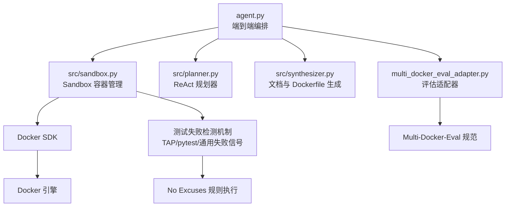
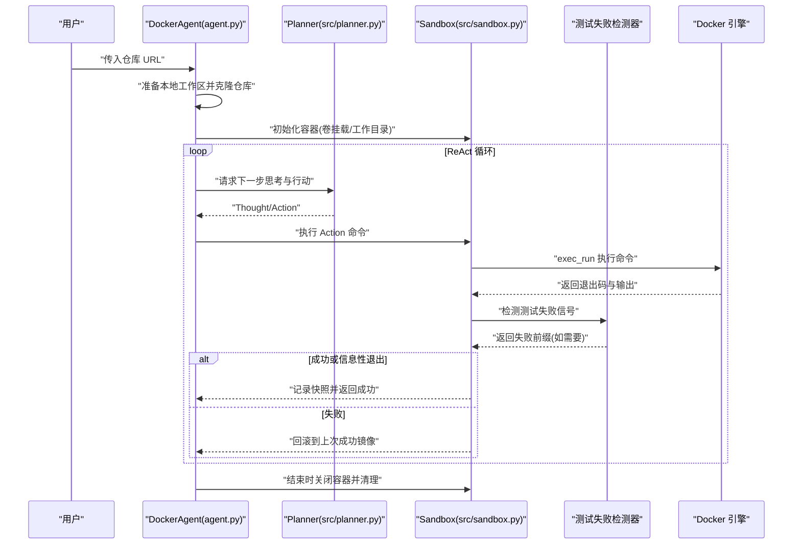
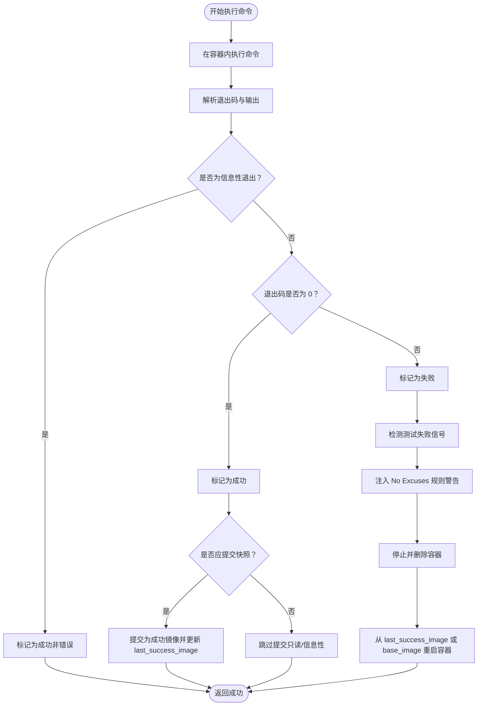
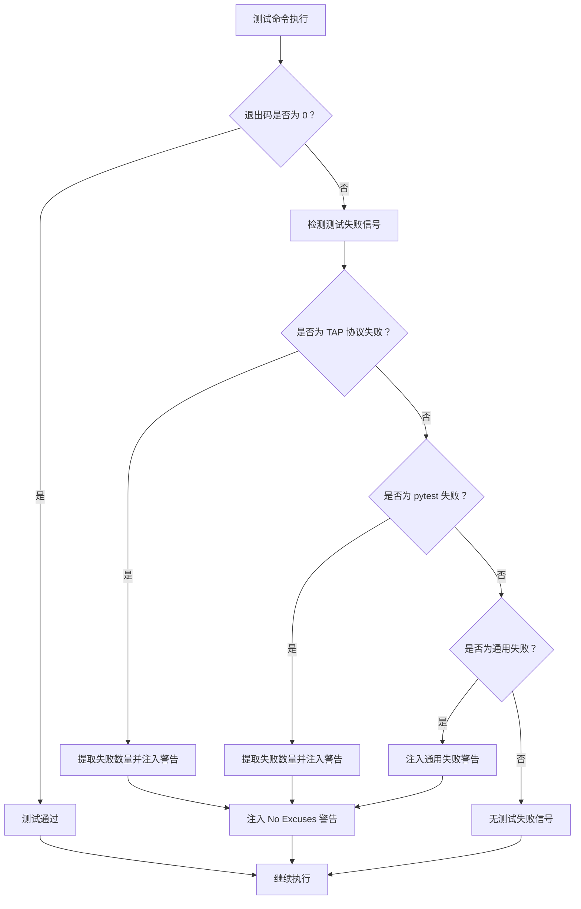
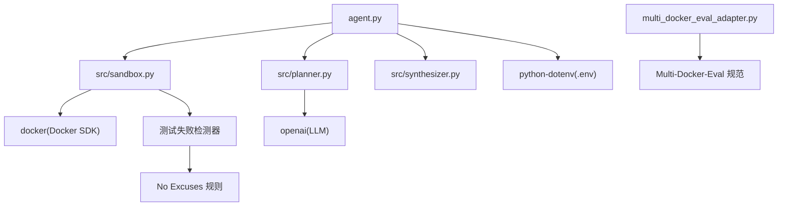

# Sandbox 模块

<cite>
**本文引用的文件**
- [src/sandbox.py](file://src/sandbox.py)
- [agent.py](file://agent.py)
- [src/planner.py](file://src/planner.py)
- [src/synthesizer.py](file://src/synthesizer.py)
- [multi_docker_eval_adapter.py](file://multi_docker_eval_adapter.py)
- [Multi-Docker-Eval/evaluation/test_spec.py](file://Multi-Docker-Eval/evaluation/test_spec.py)
- [tests/test_adapter_logic.py](file://tests/test_adapter_logic.py)
- [tests/test_agent_verification.py](file://tests/test_agent_verification.py)
- [tests/test_synthesizer.py](file://tests/test_synthesizer.py)
- [README.md](file://README.md)
- [requirements.txt](file://requirements.txt)
</cite>

## 更新摘要
**变更内容**
- 新增环境隔离和回滚机制的详细说明
- 增强测试失败检测机制的实现细节
- 完善卷挂载、工作目录和权限管理的配置说明
- 更新故障排除指南，包含新的检测机制
- 补充使用示例和性能监控技巧

## 目录
1. [简介](#简介)
2. [项目结构](#项目结构)
3. [核心组件](#核心组件)
4. [架构总览](#架构总览)
5. [详细组件分析](#详细组件分析)
6. [依赖关系分析](#依赖关系分析)
7. [性能考量](#性能考量)
8. [故障排除指南](#故障排除指南)
9. [结论](#结论)
10. [附录](#附录)

## 简介
本文件面向 Sandbox 模块，系统化阐述其容器管理能力与命令执行机制，重点覆盖以下方面：
- 容器生命周期：创建、启动、停止与清理
- 命令执行：shell 命令执行、输出捕获与错误处理
- 回滚保护：快照创建、状态保存与自动恢复
- 测试失败检测：TAP 协议失败检测、pytest 格式失败检测和通用失败信号检测
- 卷挂载、工作目录与权限管理
- 使用示例：容器生命周期管理、故障排除与性能监控

Sandbox 模块基于 Docker SDK 实现，提供"仅在对环境产生影响的命令成功后才提交快照"的策略，配合失败自动回滚，确保实验过程可重复且可恢复。**新增的 No Excuses 规则执行机制**通过智能检测测试失败信号，防止 LLM 以"核心功能通过"为由绕过测试要求。

## 项目结构
围绕 Sandbox 的关键文件与职责如下：
- src/sandbox.py：Sandbox 类，封装容器初始化、命令执行、回滚与清理，**新增测试失败检测机制**
- agent.py：端到端流程编排，负责克隆仓库、挂载工作区、驱动 Planner/Synthesizer 与 Sandbox
- src/planner.py：ReAct 思考-行动-观察循环的规划器，输出可执行命令，**集成 No Excuses 规则**
- src/synthesizer.py：记录成功命令并生成 Dockerfile 与 QuickStart 文档
- multi_docker_eval_adapter.py：Multi-Docker-Eval 评估适配器，**支持测试失败检测机制**
- Multi-Docker-Eval/evaluation/test_spec.py：测试规范定义，**支持 No Excuses 规则**

**图表来源**
- [agent.py:18-141](file://agent.py#L18-L141)
- [src/sandbox.py:8-29](file://src/sandbox.py#L8-L29)
- [multi_docker_eval_adapter.py:37-97](file://multi_docker_eval_adapter.py#L37-L97)

## 核心组件
- Sandbox：负责容器初始化、命令执行、回滚保护与资源清理，**新增智能测试失败检测**
- Planner：基于 ReAct 的规划器，输出下一步可执行命令，**集成 No Excuses 规则约束**
- Synthesizer：记录成功命令，生成 Dockerfile 与 QuickStart 文档
- **测试失败检测器**：智能识别 TAP 协议、pytest 和通用测试失败信号
- **评估适配器**：支持 Multi-Docker-Eval 评估框架，集成测试失败检测机制

**章节来源**
- [src/sandbox.py:8-29](file://src/sandbox.py#L8-L29)
- [src/planner.py:65-108](file://src/planner.py#L65-L108)
- [src/synthesizer.py:4-11](file://src/synthesizer.py#L4-L11)
- [multi_docker_eval_adapter.py:37-44](file://multi_docker_eval_adapter.py#L37-L44)

## 架构总览
Sandbox 在端到端流程中的位置与交互如下：

**图表来源**
- [agent.py:288-363](file://agent.py#L288-L363)
- [src/planner.py:110-162](file://src/planner.py#L110-L162)
- [src/sandbox.py:81-152](file://src/sandbox.py#L81-L152)

## 详细组件分析

### Sandbox 容器管理与命令执行
- 初始化容器
  - 使用提供的基础镜像启动容器，设置工作目录与卷映射
  - 确保工作目录存在
  - **新增**：支持平台指定（如 linux/amd64），用于 ARM64 主机的兼容性
- 命令执行
  - 通过 exec_run 在容器内执行 Bash 命令
  - 解析退出码与输出；区分"信息性退出"与"真正失败"
  - **新增**：执行测试失败检测，注入 No Excuses 规则警告
- 回滚保护
  - 成功时：仅对会产生环境变更的命令进行 commit，形成"上一次成功镜像"
  - 失败时：停止并移除当前容器，从"上一次成功镜像"重启新容器
- 资源清理
  - 关闭时可选择保留容器以便调试，或清理容器与中间镜像

**图表来源**
- [src/sandbox.py:81-152](file://src/sandbox.py#L81-L152)
- [src/sandbox.py:154-167](file://src/sandbox.py#L154-L167)
- [src/sandbox.py:310-331](file://src/sandbox.py#L310-L331)

**章节来源**
- [src/sandbox.py:9-29](file://src/sandbox.py#L9-L29)
- [src/sandbox.py:81-152](file://src/sandbox.py#L81-L152)
- [src/sandbox.py:154-167](file://src/sandbox.py#L154-L167)
- [src/sandbox.py:310-331](file://src/sandbox.py#L310-L331)

### 测试失败检测机制与 No Excuses 规则执行
**新增功能**：Sandbox 模块现在集成了智能测试失败检测机制，确保 No Excuses 规则得到严格执行。

- **TAP 协议失败检测**
  - 检测 `Failed: N` 格式的 TAP 输出
  - 提取失败测试数量并生成相应的警告消息
- **pytest 格式失败检测**
  - 检测 `N failed` 格式的 pytest 输出
  - 提取失败测试数量并生成警告消息
- **通用失败信号检测**
  - 检测 `FAILED`、`not ok` 等通用失败标识
  - 生成通用失败警告
- **No Excuses 规则执行**
  - 阻止 LLM 以"核心功能通过"为由绕过测试要求
  - 强制要求所有测试通过才能输出"Final Answer: Success"

**图表来源**
- [src/sandbox.py:259-297](file://src/sandbox.py#L259-L297)

**章节来源**
- [src/sandbox.py:259-297](file://src/sandbox.py#L259-L297)

### 命令执行机制与错误处理
- 执行流程
  - 通过容器 exec 接口执行 Bash 命令，指定工作目录
  - 统一解码输出，替换不可识别字符
  - **新增**：支持命令超时控制，使用 GNU timeout 命令
- 退出码与输出判定
  - 0 表示成功
  - 1/2 且输出包含帮助关键字时视为"信息性退出"，不作为错误
  - **新增**：支持超时退出码（124、137）的特殊处理
- 成功分支
  - 对会产生环境变更的命令进行 commit，形成快照
  - 清理旧的"上一次成功镜像"，避免镜像堆积
- 失败分支
  - 停止并删除当前容器
  - 从"上一次成功镜像"重启；若无则回退到基础镜像
  - **新增**：执行测试失败检测，注入 No Excuses 规则警告

**章节来源**
- [src/sandbox.py:81-152](file://src/sandbox.py#L81-L152)
- [src/sandbox.py:169-182](file://src/sandbox.py#L169-L182)
- [src/sandbox.py:210-257](file://src/sandbox.py#L210-L257)

### 回滚保护实现原理
- 快照创建
  - 仅对"会产生环境变更"的命令进行 commit
  - 成功后更新 last_success_image，并清理旧快照
  - **新增**：自动创建基线快照，确保首次失败也能回滚
- 状态保存
  - last_success_image 记录最近一次成功状态的镜像 ID
  - **新增**：snapshot_image_ids 集合跟踪所有快照镜像
- 自动恢复
  - 失败时停止并删除当前容器
  - 从 last_success_image 或 base_image 重新启动容器，恢复到上一个稳定状态
  - **新增**：支持平台特定镜像拉取，提高兼容性

**章节来源**
- [src/sandbox.py:31-59](file://src/sandbox.py#L31-L59)
- [src/sandbox.py:154-167](file://src/sandbox.py#L154-L167)
- [src/sandbox.py:132-147](file://src/sandbox.py#L132-L147)

### 卷挂载、工作目录与权限管理
- 卷挂载
  - 初始化时通过 volumes 参数将本地工作区映射到容器内的工作目录
  - 支持读写模式
  - **新增**：支持种子目录（seed_dir）预拷贝，确保回滚包含仓库状态
- 工作目录
  - 通过 working_dir 设置容器内默认工作目录
  - **新增**：支持平台指定（platform），用于 ARM64 主机的兼容性
- 权限管理
  - 容器以默认用户运行（通常为 root），具备完整权限
  - 若需非 root 用户，可在自定义镜像中配置

**章节来源**
- [src/sandbox.py:9-29](file://src/sandbox.py#L9-L29)
- [agent.py:79-86](file://agent.py#L79-L86)

### 与评估适配器的集成
- **Multi-Docker-Eval 适配器**
  - 支持测试失败检测机制，确保 No Excuses 规则得到严格执行
  - 提供结构化运行摘要，便于评估框架使用
  - **新增**：支持平台检测和兼容性处理
- **测试规范支持**
  - 符合 Multi-Docker-Eval 的测试规范要求
  - 支持测试命令来源追踪和验证

**章节来源**
- [multi_docker_eval_adapter.py:37-97](file://multi_docker_eval_adapter.py#L37-L97)
- [Multi-Docker-Eval/evaluation/test_spec.py:12-39](file://Multi-Docker-Eval/evaluation/test_spec.py#L12-L39)

## 依赖关系分析
- 外部依赖
  - docker：Docker SDK，用于容器生命周期与命令执行
  - openai：用于 Planner 的 LLM 能力
  - python-dotenv：加载环境变量
- 内部模块
  - agent.py 依赖 Sandbox、Planner、Synthesizer
  - Sandbox 依赖 Docker SDK，**新增测试失败检测依赖**
  - **新增**：multi_docker_eval_adapter.py 支持测试失败检测机制

**图表来源**
- [agent.py:1-16](file://agent.py#L1-L16)
- [requirements.txt:1-4](file://requirements.txt#L1-L4)
- [src/sandbox.py:1-7](file://src/sandbox.py#L1-L7)

**章节来源**
- [requirements.txt:1-4](file://requirements.txt#L1-L4)
- [agent.py:1-16](file://agent.py#L1-L16)

## 性能考量
- 快照开销
  - 对每次成功且会产生环境变更的命令都进行 commit，可能导致镜像数量增长
  - 建议在流程结束后清理中间镜像，减少磁盘占用
  - **新增**：snapshot_image_ids 集合管理快照镜像，避免内存泄漏
- I/O 与网络
  - 容器内包管理器与网络访问可能成为瓶颈，建议在本地缓存镜像源
  - **新增**：平台特定镜像拉取可能增加网络开销
- 超时与稳定性
  - 建议为长任务设置合理超时，避免长时间占用资源
  - **新增**：GNU timeout 命令提供精确的超时控制
- **新增**：测试失败检测开销
  - 正则表达式匹配和字符串处理会增加少量 CPU 开销
  - 检测机制经过优化，对整体性能影响最小

**章节来源**
- [src/sandbox.py:169-182](file://src/sandbox.py#L169-L182)
- [src/sandbox.py:184-187](file://src/sandbox.py#L184-L187)
- [README.md:67-71](file://README.md#L67-L71)

## 故障排除指南
- Docker 不可用
  - 确认 Docker Engine 已安装并运行
  - 检查 Docker SDK 权限（用户组加入 docker）
- 命令失败但无输出
  - 检查命令是否正确、工作目录是否设置正确
  - 使用 get_container_info 查看容器状态
- 镜像堆积导致磁盘不足
  - 手动清理未使用的镜像或在流程结束时调用清理逻辑
  - **新增**：检查 snapshot_image_ids 集合是否正确清理
- 回滚未生效
  - 确认命令是否被判定为"只读/信息性"，此类命令不会创建快照
  - 检查 last_success_image 是否存在
  - **新增**：验证平台指定是否正确，ARM64 主机需要 linux/amd64 平台
- **新增**：测试失败检测异常
  - 检查正则表达式匹配是否正确
  - 确认输出编码格式是否为 UTF-8
  - 验证 No Excuses 规则警告是否正确注入
- **新增**：平台兼容性问题
  - 检查 platform 参数是否正确设置
  - 验证镜像拉取是否成功
  - 确认容器启动是否正常

**章节来源**
- [src/sandbox.py:299-308](file://src/sandbox.py#L299-L308)
- [src/sandbox.py:310-331](file://src/sandbox.py#L310-L331)
- [src/sandbox.py:34-50](file://src/sandbox.py#L34-L50)

## 结论
Sandbox 模块通过"成功即快照、失败即回滚"的策略，在保证实验安全性的同时，提供了可控的容器执行环境。**新增的测试失败检测机制**进一步强化了 No Excuses 规则的执行，确保所有测试必须完全通过才能认定项目修复成功。结合 Planner 的 ReAct 规划与 Synthesizer 的文档生成，可实现从环境配置到可复现实验的闭环。

**新增的环境隔离和回滚机制**显著提升了系统的稳定性和可靠性，特别是在处理复杂项目和多平台兼容性方面。建议在生产环境中关注镜像清理与超时控制，以维持良好的性能与稳定性。

## 附录

### 使用示例

- 容器生命周期管理
  - 初始化：传入基础镜像、工作目录与卷映射
  - 执行命令：调用 execute，返回成功与否与输出
  - 关闭：根据需要保留容器或清理资源
  - **新增**：支持平台指定和种子目录预拷贝
- 故障排除
  - 使用 get_container_info 获取容器短 ID、名称与状态
  - 在失败时检查 last_success_image 是否存在，确认回滚是否按预期发生
  - **新增**：检查测试失败检测是否正确识别失败信号
  - **新增**：验证平台兼容性设置
- 性能监控技巧
  - 关注快照数量与镜像体积，定期清理未使用镜像
  - 为长任务设置超时，避免长时间占用资源
  - **新增**：监控测试失败检测的性能影响，确保检测效率
  - **新增**：跟踪 snapshot_image_ids 集合大小，避免内存泄漏

**章节来源**
- [src/sandbox.py:9-29](file://src/sandbox.py#L9-L29)
- [src/sandbox.py:81-152](file://src/sandbox.py#L81-L152)
- [src/sandbox.py:299-331](file://src/sandbox.py#L299-L331)

### 测试失败检测机制详解

**新增功能**：Sandbox 模块现在提供多层次的测试失败检测，确保 No Excuses 规则得到严格执行。

#### TAP 协议失败检测
- 检测模式：`Failed: N`（其中 N 为失败测试数量）
- 应用场景：run_all 等工具的 TAP 输出格式
- 警告内容：明确指出具体失败数量，强制要求修复所有测试

#### pytest 格式失败检测  
- 检测模式：`N failed`（大小写不敏感）
- 应用场景：标准 pytest 输出格式
- 警告内容：指示存在测试失败，必须全部修复

#### 通用失败信号检测
- 检测模式：`FAILED`、`not ok` 等通用标识
- 应用场景：各种测试框架的失败输出
- 警告内容：通用失败警告，提醒必须解决所有测试问题

**章节来源**
- [src/sandbox.py:259-297](file://src/sandbox.py#L259-L297)

### 环境隔离增强功能

**新增功能**：Sandbox 模块增强了环境隔离能力，确保测试失败检测的准确性。

#### 种子目录支持
- 支持 seed_dir 参数，预拷贝主机工作区到容器
- 确保回滚时包含完整的仓库状态
- 防止测试失败检测误判

#### 平台兼容性
- 支持 platform 参数，指定 Docker 平台（如 linux/amd64）
- ARM64 主机自动使用 linux/amd64 平台
- 提高跨平台兼容性

**章节来源**
- [src/sandbox.py:23-24](file://src/sandbox.py#L23-L24)
- [src/sandbox.py:34-50](file://src/sandbox.py#L34-L50)
- [agent.py:66-67](file://agent.py#L66-L67)

### 评估适配器集成

**新增功能**：Sandbox 模块与 Multi-Docker-Eval 评估框架深度集成。

#### 结构化运行摘要
- 自动生成 agent_run_summary.json
- 包含验证的测试命令和运行统计
- 支持评估框架直接使用

#### 测试命令来源追踪
- 支持多种测试命令来源
- 优先使用 Agent 运行时记录的结构化命令
- 回退到历史记录和默认语言检测

**章节来源**
- [multi_docker_eval_adapter.py:413-429](file://multi_docker_eval_adapter.py#L413-L429)
- [multi_docker_eval_adapter.py:539-561](file://multi_docker_eval_adapter.py#L539-L561)