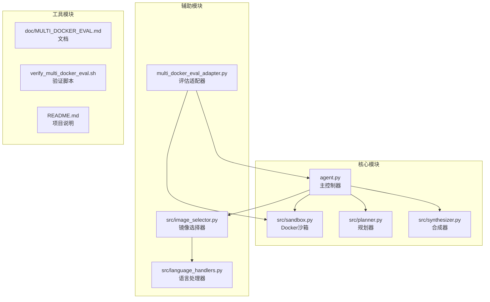
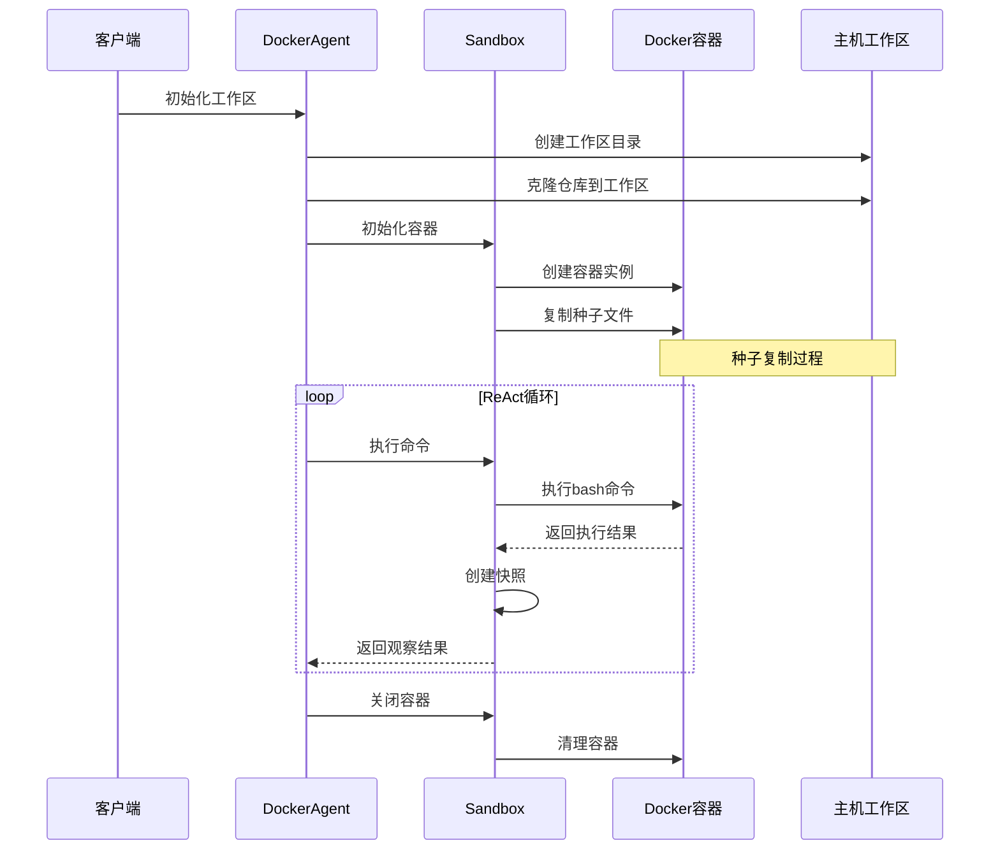
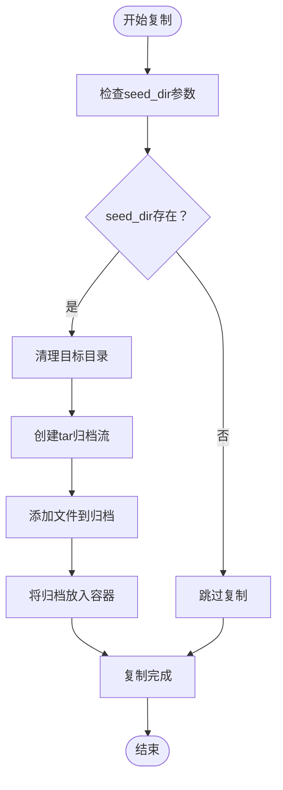
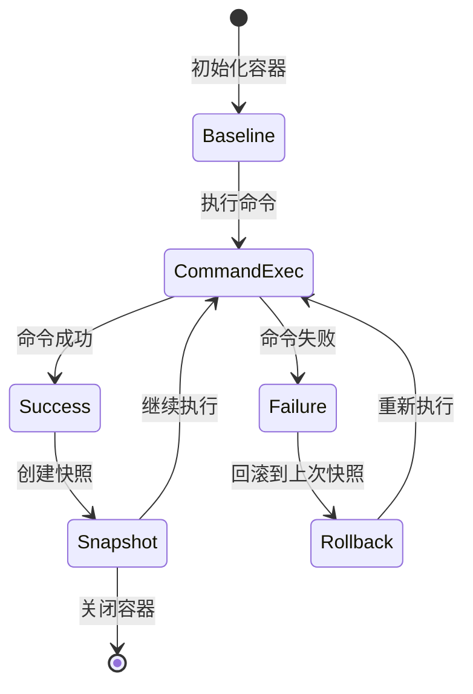
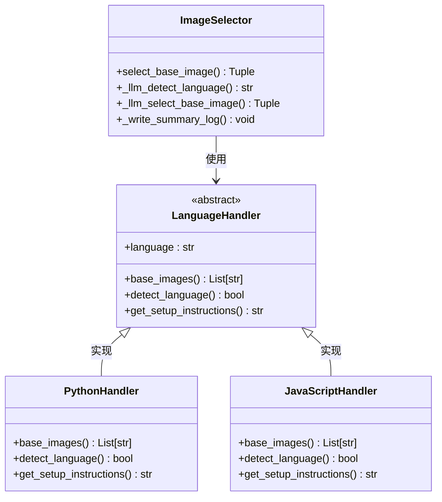
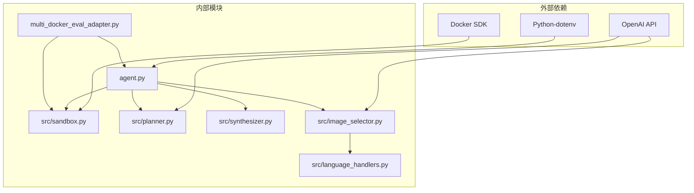

# 工作区种子复制机制

<cite>
**本文档引用的文件**
- [agent.py](file://agent.py)
- [src/sandbox.py](file://src/sandbox.py)
- [src/synthesizer.py](file://src/synthesizer.py)
- [src/image_selector.py](file://src/image_selector.py)
- [src/language_handlers.py](file://src/language_handlers.py)
- [multi_docker_eval_adapter.py](file://multi_docker_eval_adapter.py)
- [README.md](file://README.md)
- [doc/MULTI_DOCKER_EVAL.md](file://doc/MULTI_DOCKER_EVAL.md)
- [verify_multi_docker_eval.sh](file://verify_multi_docker_eval.sh)
</cite>

## 目录
1. [简介](#简介)
2. [项目结构](#项目结构)
3. [核心组件](#核心组件)
4. [架构概览](#架构概览)
5. [详细组件分析](#详细组件分析)
6. [依赖关系分析](#依赖关系分析)
7. [性能考虑](#性能考虑)
8. [故障排除指南](#故障排除指南)
9. [结论](#结论)

## 简介

工作区种子复制机制是本项目的核心功能之一，它实现了将本地工作区中的仓库内容完整复制到Docker容器中的能力。该机制确保了Agent在每次执行前都能获得一致、完整的初始状态，同时支持基于commit的回滚机制，使得环境配置过程更加安全可靠。

该机制的关键特性包括：
- 完整的文件系统复制
- 基于commit的回滚能力
- 跨平台兼容性支持
- 高效的增量更新策略

## 项目结构

项目采用模块化的架构设计，主要包含以下核心模块：



**图表来源**
- [agent.py:1-433](file://agent.py#L1-L433)
- [src/sandbox.py:1-294](file://src/sandbox.py#L1-L294)
- [src/image_selector.py:1-565](file://src/image_selector.py#L1-L565)

**章节来源**
- [README.md:1-71](file://README.md#L1-L71)
- [doc/MULTI_DOCKER_EVAL.md:1-372](file://doc/MULTI_DOCKER_EVAL.md#L1-L372)

## 核心组件

### DockerAgent 主控制器

DockerAgent是整个系统的核心控制器，负责协调各个组件的工作。其主要职责包括：

- **工作区管理**：创建和管理本地工作区目录
- **镜像选择**：自动选择合适的Docker基础镜像
- **组件初始化**：初始化Planner、Sandbox和Synthesizer组件
- **执行流程控制**：协调ReAct循环的执行

### Sandbox Docker沙箱

Sandbox提供了Docker容器的完整生命周期管理，包括：

- **容器初始化**：从基础镜像创建容器
- **种子复制**：将主机工作区复制到容器中
- **命令执行**：执行bash命令并提供回滚机制
- **状态管理**：维护容器状态和快照

### ImageSelector 镜像选择器

ImageSelector负责智能选择最适合的Docker基础镜像：

- **仓库分析**：分析仓库结构和文件内容
- **语言检测**：自动检测项目使用的编程语言
- **镜像推荐**：基于分析结果推荐最佳基础镜像
- **架构兼容性**：考虑ARM64/AMD64等不同架构的兼容性

**章节来源**
- [agent.py:18-139](file://agent.py#L18-L139)
- [src/sandbox.py:8-50](file://src/sandbox.py#L8-L50)
- [src/image_selector.py:150-320](file://src/image_selector.py#L150-L320)

## 架构概览

工作区种子复制机制的整体架构如下：



**图表来源**
- [agent.py:285-361](file://agent.py#L285-L361)
- [src/sandbox.py:70-141](file://src/sandbox.py#L70-L141)

## 详细组件分析

### 工作区种子复制实现

工作区种子复制机制的核心实现在Sandbox类中，具体流程如下：



**图表来源**
- [src/sandbox.py:51-69](file://src/sandbox.py#L51-L69)

#### 关键实现细节

1. **目录清理策略**：使用`rm -rf`命令确保目标目录完全清空
2. **归档压缩**：使用BytesIO创建内存归档流，提高效率
3. **增量更新**：只复制实际变更的文件，减少传输时间
4. **错误处理**：完善的异常处理机制，确保复制失败时的清理

### 回滚机制设计

回滚机制是种子复制机制的重要组成部分：



**图表来源**
- [src/sandbox.py:100-140](file://src/sandbox.py#L100-L140)

#### 回滚触发条件

回滚机制会在以下情况下自动触发：

1. **命令执行失败**：退出码非零
2. **信息性退出**：帮助信息显示，非真正错误
3. **测试失败检测**：通过正则表达式检测测试失败信号

### 镜像选择与平台兼容

镜像选择机制确保了跨平台的兼容性：



**图表来源**
- [src/image_selector.py:247-320](file://src/image_selector.py#L247-L320)
- [src/language_handlers.py:9-41](file://src/language_handlers.py#L9-L41)

**章节来源**
- [src/sandbox.py:1-294](file://src/sandbox.py#L1-L294)
- [src/image_selector.py:1-565](file://src/image_selector.py#L1-L565)
- [src/language_handlers.py:1-714](file://src/language_handlers.py#L1-L714)

## 依赖关系分析

系统各组件之间的依赖关系如下：



**图表来源**
- [requirements.txt:1-4](file://requirements.txt#L1-L4)
- [agent.py:1-12](file://agent.py#L1-L12)

### 核心依赖链

1. **Docker依赖链**：Docker SDK → Sandbox → Agent
2. **LLM依赖链**：OpenAI API → Planner/ImageSelector → Agent
3. **配置依赖链**：Python-dotenv → Agent → 所有组件

**章节来源**
- [requirements.txt:1-4](file://requirements.txt#L1-L4)
- [agent.py:1-16](file://agent.py#L1-L16)

## 性能考虑

### 种子复制性能优化

1. **内存归档**：使用BytesIO创建内存归档流，避免磁盘I/O
2. **增量更新**：只复制变更的文件，减少网络传输
3. **并行处理**：多个组件可以并行执行，提高整体效率

### 内存和存储管理

1. **快照清理**：及时清理旧的快照镜像，避免磁盘空间浪费
2. **容器生命周期**：合理管理容器的创建和销毁
3. **中间文件清理**：定期清理临时文件和日志

### 网络和API调用优化

1. **LLM调用缓存**：合理设计提示词，减少不必要的API调用
2. **批量操作**：尽可能合并相似的操作
3. **超时设置**：为长时间操作设置合理的超时机制

## 故障排除指南

### 常见问题及解决方案

#### Docker连接问题

**问题症状**：
```
Error: Cannot connect to the Docker daemon
```

**解决方案**：
1. 确保Docker Engine正在运行
2. 检查用户权限是否正确
3. 验证Docker Socket访问权限

#### 种子复制失败

**问题症状**：
```
Failed to copy workspace from {path} into container
```

**解决方案**：
1. 检查源目录是否存在且可读
2. 验证目标容器路径权限
3. 确认有足够的磁盘空间

#### 回滚机制失效

**问题症状**：
```
Command failed (exit {code}). Rolling back...
```

**解决方案**：
1. 检查快照镜像是否正确创建
2. 验证容器回滚过程
3. 确认平台兼容性设置

### 调试和监控

1. **日志记录**：启用详细的日志记录以追踪问题
2. **状态检查**：定期检查容器和镜像状态
3. **性能监控**：监控内存、CPU和磁盘使用情况

**章节来源**
- [doc/MULTI_DOCKER_EVAL.md:319-344](file://doc/MULTI_DOCKER_EVAL.md#L319-L344)
- [verify_multi_docker_eval.sh:14-37](file://verify_multi_docker_eval.sh#L14-L37)

## 结论

工作区种子复制机制通过精心设计的架构和实现，为Docker环境配置Agent提供了稳定可靠的基础。该机制的主要优势包括：

1. **完整性保证**：确保每次执行都基于完整的、一致的工作区状态
2. **安全性**：基于commit的回滚机制提供了强大的错误恢复能力
3. **效率性**：通过增量更新和内存归档等技术优化了性能
4. **可扩展性**：模块化设计支持新功能的添加和现有功能的改进

该机制为Multi-Docker-Eval评估框架提供了坚实的技术基础，使得自动化环境配置成为可能。随着项目的不断发展，这一机制将继续演进以满足更复杂的需求和更高的性能要求。