# Synthesizer 模块

<cite>
**本文引用的文件**
- [synthesizer.py](file://src/synthesizer.py)
- [agent.py](file://agent.py)
- [language_handlers.py](file://src/language_handlers.py)
- [language_handlers.py](file://others_work/RepoLaunch/launch/utilities/language_handlers.py)
- [testall.py](file://others_work/RepoLaunch/launch/agent/organize/testall.py)
- [diff_classify_jsonl.py](file://Multi-Docker-Eval/data_collection/diff_classify_jsonl.py)
- [docker.py](file://workplace/src/minisweagent/environments/docker.py)
- [litellm_model.py](file://workplace/src/minisweagent/models/litellm_model.py)
- [config.py](file://workplace/src/minisweagent/run/utilities/config.py)
- [QuickStart.md](file://workplace/multi_docker_eval_cpputest__cpputest-1842/QuickStart.md)
- [README.md](file://workplace/README.md)
- [default.yaml](file://workplace/src/minisweagent/config/default.yaml)
- [mini.py](file://workplace/src/minisweagent/run/mini.py)
- [requirements.txt](file://requirements.txt)
- [multi_docker_eval_adapter.py](file://multi_docker_eval_adapter.py)
- [test_synthesizer.py](file://tests/test_synthesizer.py)
</cite>

## 更新摘要
**所做更改**
- 新增命令分析和测试运行效果评估功能，增强了273行新代码
- 引入 `analyze_test_run` 方法，提供测试命令有效性评估和置信度分析
- 新增 `command_mutates_environment` 方法，检测命令对运行时环境的影响
- 增强只读命令过滤机制，支持更精确的命令分类
- 新增测试运行信号检测，包括空测试运行和有效测试执行信号
- 完善命令段解析和重建逻辑，支持复杂的shell命令链
- 增强API键检测功能，支持多种API键类型的自动识别

## 目录
1. [简介](#简介)
2. [项目结构](#项目结构)
3. [核心组件](#核心组件)
4. [架构总览](#架构总览)
5. [详细组件分析](#详细组件分析)
6. [依赖关系分析](#依赖关系分析)
7. [性能考虑](#性能考虑)
8. [故障排除指南](#故障排除指南)
9. [结论](#结论)
10. [附录](#附录)

## 简介
本文件面向 Synthesizer 模块的技术文档，系统化阐述文档生成系统的实现，包括：
- Dockerfile 生成算法与构建逻辑
- QuickStart 文档创建流程与 LLM 集成
- API Key 检测与提示机制
- **新增** 命令分析和测试运行效果评估功能
- **新增** 环境变化检测和命令有效性分析
- record_success 方法如何记录成功的配置命令与 setup_commands
- generate_dockerfile 方法的 Dockerfile 构建逻辑（基础镜像选择、依赖安装、环境配置）
- generate_quickstart_with_llm 的文档生成流程（Prompt 设计、内容优化、输出格式）
- 使用示例与配置选项（自定义模板与输出格式调整）

## 项目结构
该模块位于 src/synthesizer.py，围绕以下职责组织：
- 记录成功执行的命令并生成 Dockerfile
- 基于 README 与真实安装命令生成 QuickStart 文档
- 检测并记录 API Key 需求，辅助用户配置
- **新增** 分析测试命令的有效性并评估置信度
- **新增** 检测命令对运行时环境的影响
- **增强** 只读命令过滤，避免在Dockerfile中添加ls、cat、echo等信息查询命令

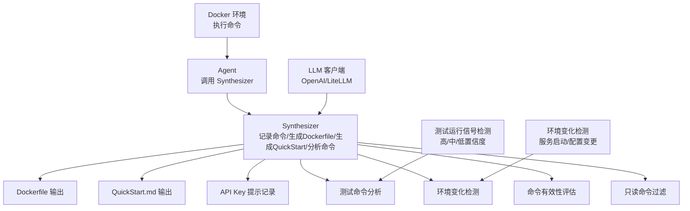

**图表来源**
- [synthesizer.py:1-625](file://src/synthesizer.py#L1-L625)
- [agent.py:362-381](file://agent.py#L362-L381)
- [language_handlers.py:1-715](file://src/language_handlers.py#L1-L715)
- [language_handlers.py:578-601](file://others_work/RepoLaunch/launch/utilities/language_handlers.py#L578-L601)

**章节来源**
- [synthesizer.py:1-625](file://src/synthesizer.py#L1-L625)
- [agent.py:1-159](file://agent.py#L1-L159)

## 核心组件
- Synthesizer 类：负责记录命令、生成 Dockerfile、生成 QuickStart 文档、记录 API Key 提示、**新增** 分析测试命令有效性、**新增** 检测环境变化、**增强** 只读命令过滤
- Docker 环境：在容器中执行命令并返回结果，供 Synthesizer 记录成功命令
- LLM 客户端：通过 OpenAI 或 LiteLLM 生成 QuickStart 文档
- 全局配置工具：提供 API Key 设置与管理能力
- **新增** 测试运行信号检测器：识别有效的测试执行信号和空测试运行信号
- **新增** 命令段解析器：处理复杂的shell命令链和参数

**章节来源**
- [synthesizer.py:1-625](file://src/synthesizer.py#L1-L625)
- [docker.py:1-162](file://workplace/src/minisweagent/environments/docker.py#L1-L162)
- [litellm_model.py:1-148](file://workplace/src/minisweagent/models/litellm_model.py#L1-L148)
- [config.py:1-117](file://workplace/src/minisweagent/run/utilities/config.py#L1-L117)
- [language_handlers.py:1-715](file://src/language_handlers.py#L1-L715)

## 架构总览
下图展示从 Agent 到 Docker 环境、再到 LLM 的完整调用链路，以及 Synthesizer 在其中的角色，**新增** 命令分析和测试运行效果评估流程。

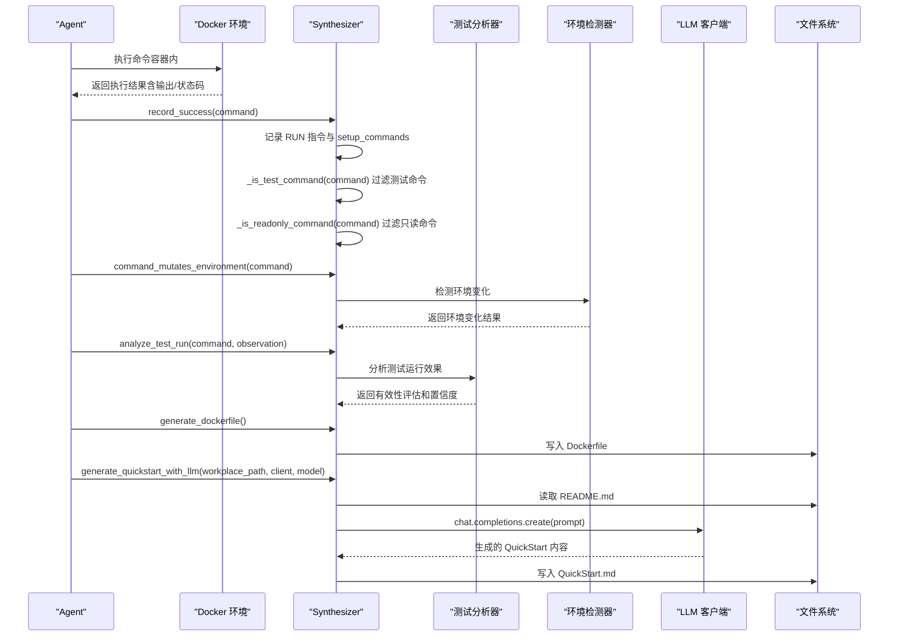

**图表来源**
- [agent.py:1-159](file://agent.py#L1-L159)
- [synthesizer.py:1-625](file://src/synthesizer.py#L1-L625)
- [language_handlers.py:330-343](file://others_work/RepoLaunch/launch/utilities/language_handlers.py#L330-L343)

## 详细组件分析

### Synthesizer 类设计
Synthesizer 负责：
- 记录成功命令为 Docker RUN 指令，并维护用于 QuickStart 的 setup_commands
- **新增** 分析测试命令的有效性，提供置信度评估
- **新增** 检测命令对运行时环境的影响，区分配置变更和服务启动
- **增强** 过滤只读命令，避免在 Dockerfile 中添加ls、cat、echo等信息查询命令
- 生成最终 Dockerfile
- 基于 README 与真实安装命令生成 QuickStart 文档
- 记录 API Key 需求提示

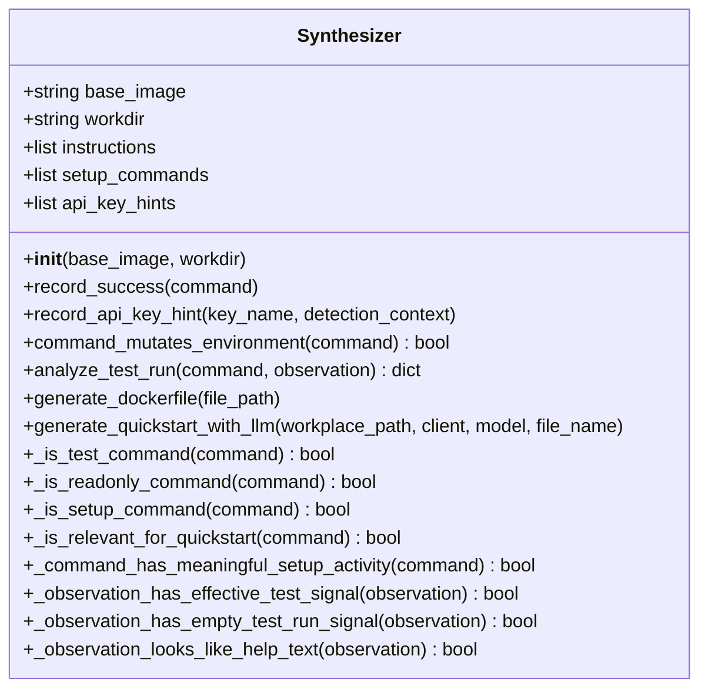

**图表来源**
- [synthesizer.py:1-625](file://src/synthesizer.py#L1-L625)

**章节来源**
- [synthesizer.py:1-625](file://src/synthesizer.py#L1-L625)

### record_success 方法：记录成功的配置命令与 setup_commands
- 将成功执行的命令以 RUN 指令形式追加到 instructions
- **新增** 调用 `_extract_recordable_setup_commands` 提取可记录的设置命令前缀
- **新增** 调用 `_record_setup_instruction` 持久化设置/构建命令
- **新增** 支持复杂shell命令链的解析和重建
- **增强** 调用 `_is_test_command` 过滤测试命令，避免在 Dockerfile 中执行测试
- **增强** 调用 `_is_readonly_command` 过滤只读命令，避免在 Dockerfile 中添加ls、cat、echo等信息查询命令
- 去重处理：避免重复记录相同的命令
- 若命令属于"环境配置相关"（setup_command），同时追加到 setup_commands，用于后续生成 QuickStart
- 关键判断逻辑基于关键字集合，覆盖各种编程语言的测试框架

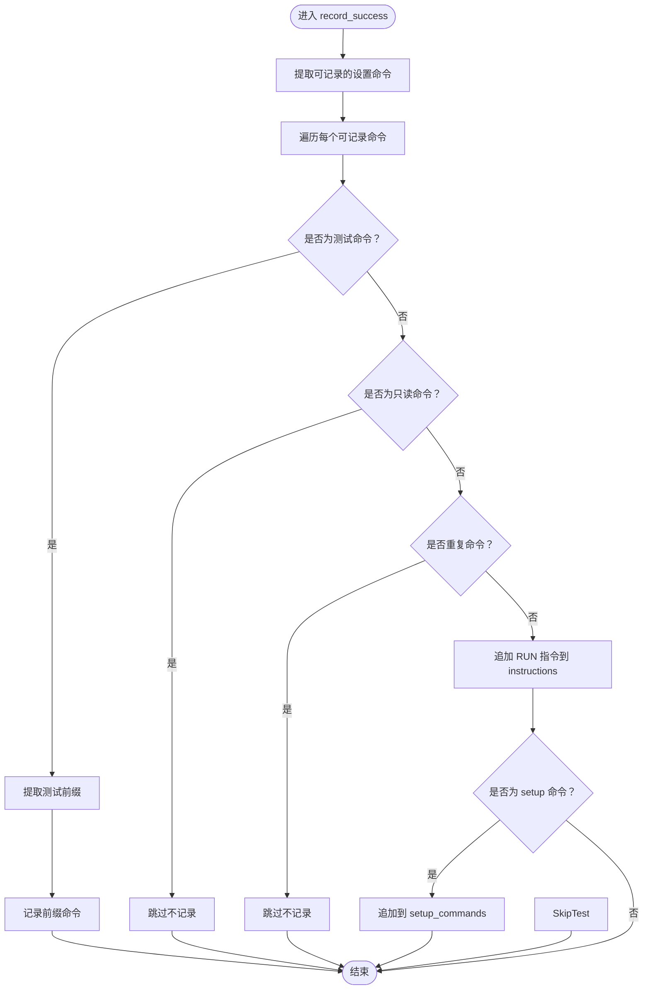

**图表来源**
- [synthesizer.py:12-53](file://src/synthesizer.py#L12-L53)

**章节来源**
- [synthesizer.py:12-53](file://src/synthesizer.py#L12-L53)

### command_mutates_environment 方法：环境变化检测
**新增功能** 检测成功的命令是否改变了有效的运行时环境：

- **检测逻辑**：分析命令的标准化版本，判断是否包含有意义的设置活动
- **检测范围**：
  - 运行时服务段（如 `service redis-server start`）
  - 设置命令（如 `pip install`、`npm install`）
  - 有意义的文件操作（如 `./configure`、`meson`、`mkdir`、`cp`、`mv`、`ln`、`chmod`、`chown`、`sed`、`patch`、`git apply`、`git checkout`、`python setup.py`）
- **返回值**：True 表示命令改变了运行时环境，False 表示只读或无意义的操作
- **用途**：帮助 Agent 判断命令是否真正改变了环境状态

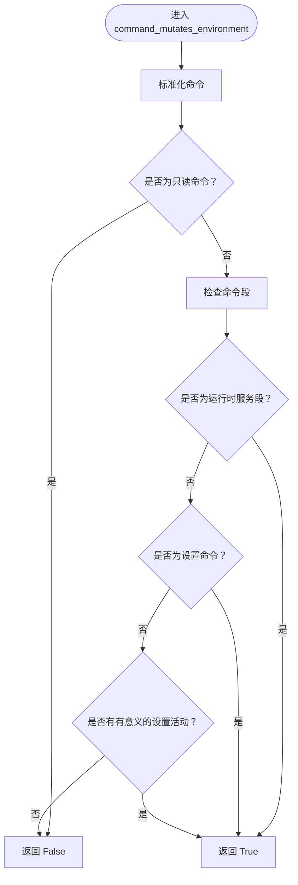

**图表来源**
- [synthesizer.py:22-374](file://src/synthesizer.py#L22-L374)

**章节来源**
- [synthesizer.py:22-374](file://src/synthesizer.py#L22-L374)

### analyze_test_run 方法：测试运行效果评估
**新增功能** 判断成功的命令是否实际执行了有意义的测试，并提供置信度分析：

- **输入**：命令和观察结果（命令输出）
- **输出**：包含以下字段的字典
  - `is_test_command`: 是否为测试命令
  - `is_effective_test_run`: 是否为有效的测试运行
  - `confidence`: 置信度（"none"、"low"、"medium"、"high"）
  - `reason`: 判定原因
- **判定逻辑**：
  1. 如果不是测试命令：返回 `is_test_command=False`
  2. 如果是只读命令：返回 `is_test_command=True`，`is_effective_test_run=False`
  3. 如果观察结果看起来像帮助文本：返回 `is_test_command=True`，`is_effective_test_run=False`
  4. 如果观察结果包含有效的测试执行信号：返回 `is_test_command=True`，`is_effective_test_run=True`，置信度"high"
  5. 如果观察结果显示没有测试被执行：返回 `is_test_command=True`，`is_effective_test_run=False`
  6. 如果直接执行测试可执行文件且有输出：返回 `is_test_command=True`，`is_effective_test_run=True`，置信度"medium"
  7. 否则：返回 `is_test_command=True`，`is_effective_test_run=False`，置信度"none"

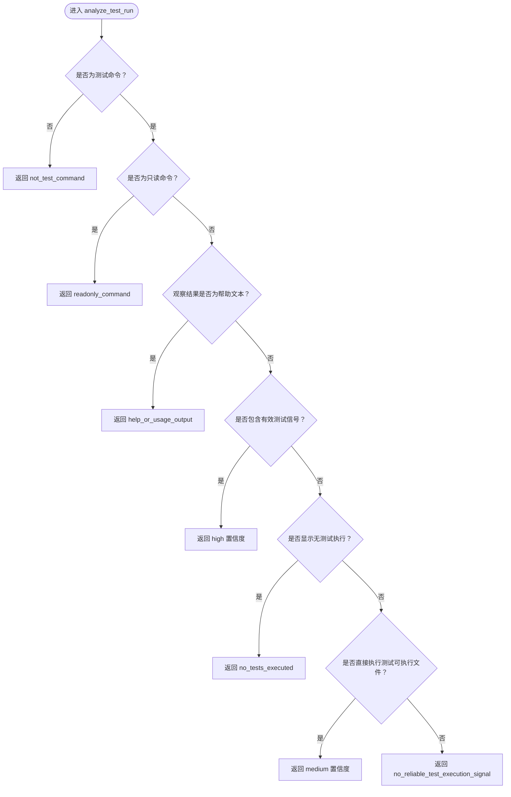

**图表来源**
- [synthesizer.py:115-160](file://src/synthesizer.py#L115-L160)

**章节来源**
- [synthesizer.py:115-160](file://src/synthesizer.py#L115-L160)

### _observation_has_effective_test_signal 方法：有效测试信号检测
**新增功能** 检测观察结果文本中是否包含真实的测试执行信号：

- **检测模式**：
  - 收集到的测试项目数量（如 "collected 10 items"）
  - 运行的测试数量（如 "ran 5 tests"）
  - 通过/失败/跳过的测试数量
  - TAP格式的测试结果
  - 其他测试框架的标准输出格式
- **正则表达式匹配**：使用多行模式和忽略大小写标志
- **用途**：作为 `analyze_test_run` 的重要判断依据

**章节来源**
- [synthesizer.py:428-457](file://src/synthesizer.py#L428-L457)

### _observation_has_empty_test_run_signal 方法：空测试运行信号检测
**新增功能** 检测成功的命令是否明显没有运行任何测试：

- **检测模式**：
  - "no tests were found"、"no tests found"
  - "collected 0 items"、"ran 0 tests"
  - "[no test files]"、"no test cases matched"
  - "no tests to run"、"0 examples, 0 failures"
- **用途**：帮助区分真正的测试执行和空测试运行

**章节来源**
- [synthesizer.py:409-426](file://src/synthesizer.py#L409-L426)

### _observation_looks_like_help_text 方法：帮助文本检测
**新增功能** 排除 `--help` 或使用说明屏幕：

- **检测标记**：
  - "usage:"、"optional arguments:"
  - "positional arguments:"、"show this help"
- **用途**：避免将帮助输出误认为测试执行结果

**章节来源**
- [synthesizer.py:459-471](file://src/synthesizer.py#L459-L471)

### _normalize_observation_text 方法：观察文本标准化
**新增功能** 清理ANSI控制码和零宽格式化字符：

- **清理内容**：
  - ANSI控制码（如颜色代码）
  - 零宽字符（如 `\u200b`、`\ufeff`）
- **用途**：确保测试信号检测的准确性

**章节来源**
- [synthesizer.py:473-478](file://src/synthesizer.py#L473-L478)

### _extract_recordable_setup_commands 方法：可记录设置命令提取
**新增功能** 从复杂shell命令链中提取可记录的设置命令前缀：

- **处理逻辑**：
  1. 分割shell命令链（支持 `&&`、`||`、`;`、换行符）
  2. 标准化每个命令段
  3. 跳过运行时健康检查段
  4. 跳过导航-only段（如 `cd`、`pushd`、`popd`）
  5. 保留有意义的设置活动段
  6. 重建可记录的命令
- **应用场景**：当命令包含测试执行时，只提取测试之前的设置步骤

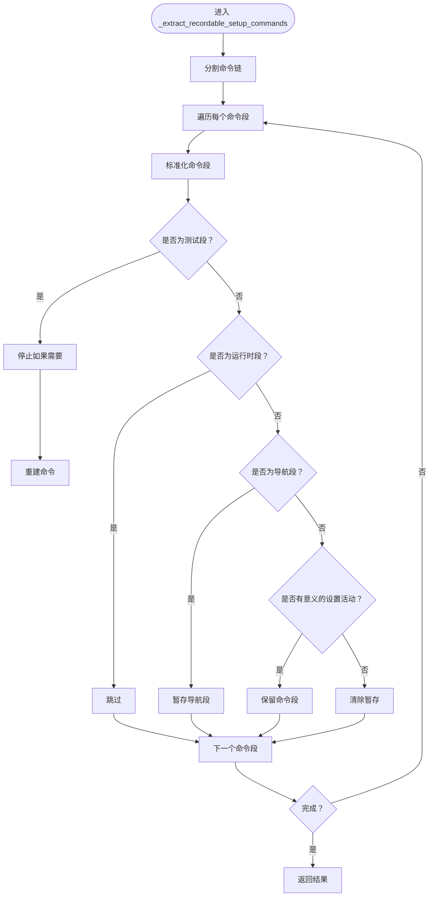

**图表来源**
- [synthesizer.py:41-53](file://src/synthesizer.py#L41-L53)

**章节来源**
- [synthesizer.py:41-53](file://src/synthesizer.py#L41-L53)

### _record_setup_instruction 方法：设置指令持久化
**新增功能** 将设置/构建命令持久化到Dockerfile和QuickStart集合：

- **处理逻辑**：
  1. 检查命令是否为空
  2. 跳过只读命令
  3. 创建RUN指令
  4. 去重检查
  5. 添加到instructions
  6. 如果是设置命令且不在setup_commands中，添加到setup_commands
- **用途**：确保Dockerfile只包含有意义的设置命令

**章节来源**
- [synthesizer.py:26-39](file://src/synthesizer.py#L26-L39)

### _is_readonly_command 方法：只读命令过滤
**增强功能** 专门用于过滤只读/信息查询命令，避免在 Dockerfile 中添加无意义的命令：

- **过滤的命令类型**：ls、cat、echo、pwd、env、grep、find、head、tail、which、type、file、du、df、ps、top、hostname、whoami、date、id
- **过滤逻辑**：检查命令的第一个单词是否在预定义的只读命令列表中
- **目的**：保持 Dockerfile 的简洁性和构建效率

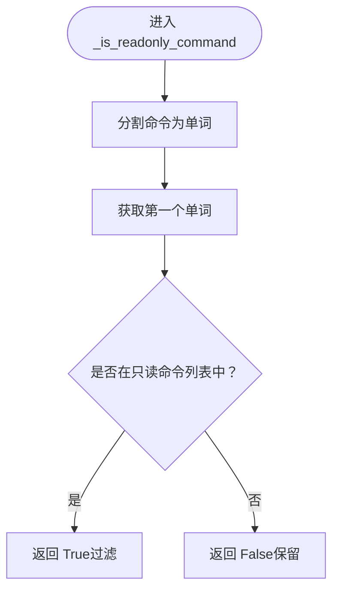

**图表来源**
- [synthesizer.py:55-61](file://src/synthesizer.py#L55-L61)

**章节来源**
- [synthesizer.py:55-61](file://src/synthesizer.py#L55-L61)

### _is_test_command 方法：测试命令识别
**增强功能** 支持多种编程语言的测试命令识别：

- **Python 测试框架**：pytest、py.test、python -m pytest、python -m unittest、tox、nox、nosetests、nose
- **JavaScript/TypeScript 测试框架**：npm test、yarn test、pnpm test、jest、mocha、karma、vitest、cypress
- **Rust 测试框架**：cargo test
- **Go 测试框架**：go test
- **Java 测试框架**：mvn test、mvnw test、gradle test、gradlew test
- **Ruby 测试框架**：bundle exec rspec、bundle exec rake、rake test、rspec
- **PHP 测试框架**：phpunit、vendor/bin/phpunit、pest、vendor/bin/pest
- **C/C++ 测试框架**：ctest、cmake --target test、make test、gmake test、mingw32-make test、ninja test、ninja -t test

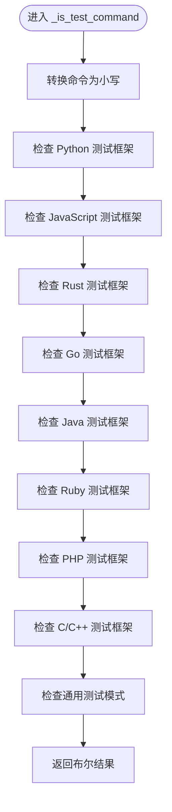

**图表来源**
- [synthesizer.py:63-113](file://src/synthesizer.py#L63-L113)

**章节来源**
- [synthesizer.py:63-113](file://src/synthesizer.py#L63-L113)

### generate_dockerfile 方法：Dockerfile 构建逻辑
- 以 base_image 作为 FROM，以 workdir 作为 WORKDIR
- 将已记录的 instructions 顺序拼接为最终 Dockerfile
- 支持自定义输出路径，默认写入当前目录的 Dockerfile
- 返回生成的 Dockerfile 内容字符串

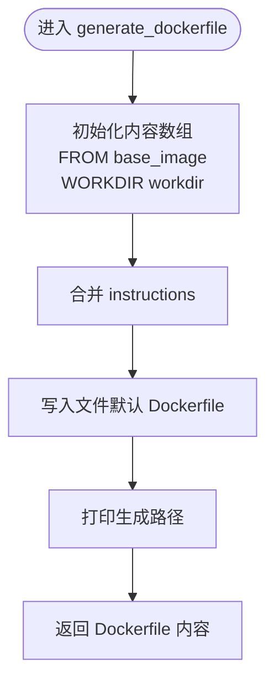

**图表来源**
- [synthesizer.py:611-625](file://src/synthesizer.py#L611-L625)

**章节来源**
- [synthesizer.py:611-625](file://src/synthesizer.py#L611-L625)

### generate_quickstart_with_llm 方法：文档生成流程
**改进功能** 基于 README 与真实安装命令生成 QuickStart 文档：

- 输入：工作目录路径、LLM 客户端实例、模型名、输出文件名
- 步骤：
  1) 过滤 setup_commands，剔除纯信息查询类命令（如 ls、cat、echo 等）
  2) 读取 README.md（若不存在则使用占位文本）
  3) 构造 Prompt，包含：
     - 成功执行的安装/配置命令（在容器中验证有效）
     - README 内容（限制长度避免 token 溢出）
  4) 调用 client.chat.completions.create 生成内容
  5) 写入 QuickStart.md 并返回内容
- 输出格式：Markdown，包含 Setup Steps、How to Run、API Key Configuration、Notes 四部分

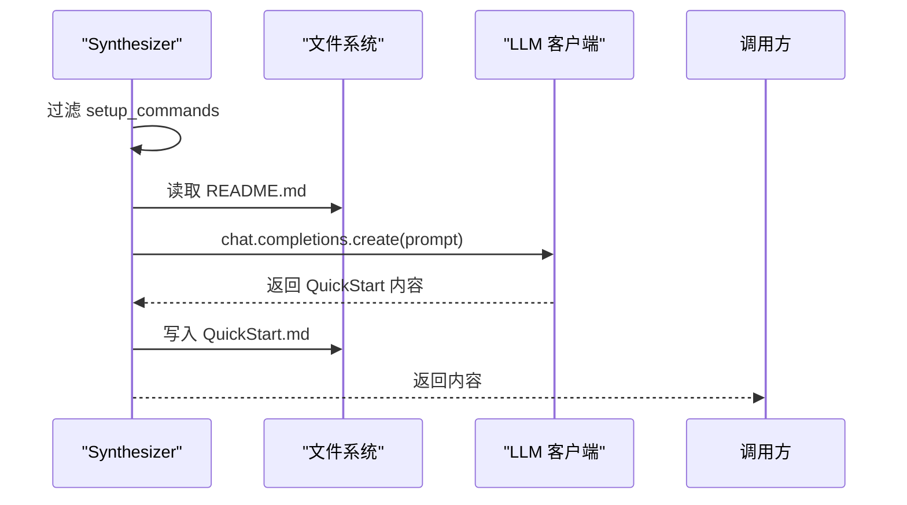

**图表来源**
- [synthesizer.py:513-602](file://src/synthesizer.py#L513-L602)

**章节来源**
- [synthesizer.py:513-602](file://src/synthesizer.py#L513-L602)

### API Key 检测功能：record_api_key_hint
**增强功能** 在 Agent 执行过程中，根据命令输出中的关键词识别 API Key 缺失或无效的情况：

- **检测的API键类型**：openai_api_key、anthropic_api_key、api_key、access_token
- **检测逻辑**：检查观察结果中是否包含预定义的API键错误模式
- **调用 record_api_key_hint 记录** key_name 与 detection_context
- **生成 QuickStart 时** 会基于 README 分析是否需要 API Key，并给出两种配置方式（环境变量与 .env 文件）

**章节来源**
- [agent.py:431-450](file://agent.py#L431-L450)
- [synthesizer.py:480-484](file://src/synthesizer.py#L480-L484)

## 依赖关系分析
- Synthesizer 依赖 Docker 环境执行命令并返回结果，从而触发 record_success
- Synthesizer 依赖 LLM 客户端生成 QuickStart 文档
- **新增** Synthesizer 依赖测试运行信号检测器进行测试有效性评估
- **新增** Synthesizer 依赖环境变化检测器判断命令对运行时环境的影响
- 全局配置工具提供 API Key 设置与管理，便于用户在本地环境中配置密钥
- **增强** Agent 依赖增强的 API Key 检测机制和测试运行分析

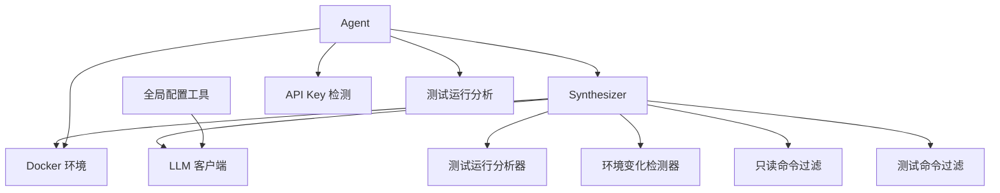

**图表来源**
- [synthesizer.py:1-625](file://src/synthesizer.py#L1-L625)
- [docker.py:1-162](file://workplace/src/minisweagent/environments/docker.py#L1-L162)
- [config.py:1-117](file://workplace/src/minisweagent/run/utilities/config.py#L1-L117)
- [language_handlers.py:1-715](file://others_work/RepoLaunch/launch/utilities/language_handlers.py#L1-L715)
- [agent.py:362-381](file://agent.py#L362-L381)

**章节来源**
- [synthesizer.py:1-625](file://src/synthesizer.py#L1-L625)
- [docker.py:1-162](file://workplace/src/minisweagent/environments/docker.py#L1-L162)
- [config.py:1-117](file://workplace/src/minisweagent/run/utilities/config.py#L1-L117)

## 性能考虑
- Dockerfile 生成：线性拼接 instructions，时间复杂度 O(n)，n 为记录的命令数
- **新增** 测试命令过滤：多语言关键词匹配，时间复杂度 O(k*m)，k 为测试框架数量，m 为命令长度
- **新增** 测试运行分析：正则表达式匹配和字符串处理，时间复杂度取决于观察结果长度
- **新增** 环境变化检测：命令段解析和模式匹配，时间复杂度 O(p*q)，p为命令段数量，q为模式数量
- **增强** 只读命令过滤：单次字符串匹配，时间复杂度 O(p)，p 为命令长度
- QuickStart 生成：读取 README 与调用 LLM，受网络与模型响应时间影响；建议控制 README 截断长度以避免 token 溢出
- API Key 检测：基于字符串匹配，时间复杂度近似 O(q*r)，q 为模式数量，r 为输出字符数

## 故障排除指南
- 未生成 QuickStart.md
  - 可能原因：setup_commands 为空或过滤后为空
  - 处理：确认已执行安装/配置命令并被正确记录
- **新增** 测试命令仍出现在 Dockerfile 中
  - 可能原因：测试命令未被正确识别或关键字不匹配
  - 处理：检查命令格式是否符合预定义的测试框架关键字
- **新增** 测试运行分析不准确
  - 可能原因：观察结果格式不符合预期模式
  - 处理：检查命令输出格式，必要时扩展正则表达式模式
- **新增** 环境变化检测不准确
  - 可能原因：命令格式不符合预期的服务启动或设置模式
  - 处理：检查命令格式，必要时扩展检测模式
- **增强** 只读命令过滤逻辑失效
  - 可能原因：只读命令过滤逻辑未生效或命令格式不符合预期
  - 处理：检查命令是否以标准格式开头（如 ls、cat、echo 等）
- LLM 生成失败
  - 可能原因：API Key 未配置、网络异常、模型不可用
  - 处理：检查全局配置与网络连接，参考全局配置工具进行设置
- Dockerfile 生成异常
  - 可能原因：权限问题、路径错误
  - 处理：确认输出路径可写，必要时指定自定义文件路径
- **增强** API Key 检测不准确
  - 可能原因：命令输出中未包含预定义的关键字模式
  - 处理：检查命令输出格式，必要时扩展关键字模式

**章节来源**
- [synthesizer.py:517-519](file://src/synthesizer.py#L517-L519)
- [config.py:51-84](file://workplace/src/minisweagent/run/utilities/config.py#L51-L84)

## 结论
Synthesizer 模块通过"记录—分析—生成—优化"的闭环，实现了从容器内真实执行命令到可复用文档与镜像的自动化流程。其设计强调：
- **新增** 智能分析能力：能够分析测试命令的有效性并提供置信度评估
- **新增** 环境感知能力：检测命令对运行时环境的影响，区分配置变更和服务启动
- **新增** 命令理解能力：解析复杂的shell命令链，提取有意义的设置步骤
- 可靠性：仅记录经容器验证成功的命令，**新增** 自动过滤测试命令和只读命令
- 可解释性：生成的 Dockerfile 与 QuickStart 文档结构清晰
- **增强** 命令过滤：智能过滤无意义的只读命令，保持 Dockerfile 的简洁性
- 可扩展性：支持自定义基础镜像、工作目录、输出路径与模型

## 附录

### 使用示例与配置选项
- 基础镜像与工作目录
  - 通过构造函数传入 base_image 与 workdir，影响生成的 Dockerfile
  - 示例：Synthesizer(base_image="python:3.10", workdir="/app")
- 输出路径
  - generate_dockerfile(file_path="Dockerfile") 支持自定义输出路径
- LLM 模型与温度
  - generate_quickstart_with_llm 支持指定 model 与 temperature=0（稳定输出）
- **新增** 测试运行分析
  - 使用 analyze_test_run(command, observation) 获取测试有效性评估
  - 支持高/中/低置信度判断
- **新增** 环境变化检测
  - 使用 command_mutates_environment(command) 判断命令是否改变环境
  - 区分服务启动和配置变更
- **新增** 命令段解析
  - 支持复杂的shell命令链解析和重建
  - 自动过滤导航-only段和运行时健康检查段
- **增强** 只读命令过滤
  - 自动过滤 ls、cat、echo、pwd、env 等只读命令
  - 避免在 Dockerfile 中添加无意义的命令
- API Key 配置
  - 使用全局配置工具设置 API Key，或在运行时导出环境变量
  - 生成 QuickStart 时会自动识别 README 中的 API Key 需求并提供两种配置方法

**章节来源**
- [synthesizer.py:2-625](file://src/synthesizer.py#L2-L625)
- [config.py:51-84](file://workplace/src/minisweagent/run/utilities/config.py#L51-L84)
- [QuickStart.md:1-40](file://workplace/multi_docker_eval_cpputest__cpputest-1842/QuickStart.md#L1-L40)
- [README.md:1-222](file://workplace/README.md#L1-L222)

### 与 Docker 环境的集成
- Docker 环境负责在容器中执行命令并返回结果，Agent 根据返回值调用 Synthesizer.record_success
- Docker 环境配置项（如镜像、超时、解释器等）影响命令执行稳定性
- **新增** 测试运行分析确保不会在 Dockerfile 构建时执行无效的测试
- **新增** 环境变化检测确保只记录真正改变环境状态的命令
- **增强** 只读命令过滤确保不会在 Dockerfile 中添加无意义的命令

**章节来源**
- [docker.py:1-162](file://workplace/src/minisweagent/environments/docker.py#L1-L162)
- [agent.py:1-159](file://agent.py#L1-L159)

### 与 LLM 的集成
- LiteLLM 模型封装了 API 调用、重试、成本统计等功能
- Agent 初始化时创建 LLM 客户端（如 OpenAI），传递给 Synthesizer 生成 QuickStart
- **新增** 测试运行分析提供更准确的命令有效性信息，提升文档质量

**章节来源**
- [litellm_model.py:1-148](file://workplace/src/minisweagent/models/litellm_model.py#L1-L148)
- [agent.py:27-36](file://agent.py#L27-L36)

### CLI 与配置文件
- mini CLI 提供一键运行与配置能力，结合全局配置工具完成 API Key 管理
- 默认配置文件包含系统模板、实例模板、观察模板等，影响交互与输出

**章节来源**
- [mini.py:1-110](file://workplace/src/minisweagent/run/mini.py#L1-L110)
- [default.yaml:1-167](file://workplace/src/minisweagent/config/default.yaml#L1-L167)
- [config.py:1-117](file://workplace/src/minisweagent/run/utilities/config.py#L1-L117)

### 测试运行分析详细说明
**新增功能详情**：

#### 测试命令有效性评估
- **高置信度**：观察结果包含明确的测试执行信号（如 collected X items、ran Y tests、OK (X tests)）
- **中置信度**：直接执行测试可执行文件且有输出（如 ./FooTests）
- **低置信度**：测试命令但无明确执行信号
- **无置信度**：非测试命令或只读命令

#### 空测试运行检测
- **检测场景**：测试命令成功执行但没有实际测试被运行
- **常见模式**：no tests found、collected 0 items、[no test files]
- **处理策略**：标记为无效测试运行，不计入最终验证块

#### 帮助文本排除
- **检测场景**：命令输出显示帮助信息而非测试结果
- **检测标记**：usage:、optional arguments:、show this help
- **处理策略**：排除此类输出作为测试执行证据

#### 环境变化检测
- **服务启动**：service redis-server start、redis-server --daemonize yes
- **配置安装**：apt-get install、pip install、npm install、cargo build
- **文件操作**：mkdir、cp、mv、sed、patch、git checkout
- **编译构建**：./configure、meson、make、cmake、ninja

**章节来源**
- [synthesizer.py:115-160](file://src/synthesizer.py#L115-L160)
- [synthesizer.py:409-478](file://src/synthesizer.py#L409-L478)
- [synthesizer.py:333-374](file://src/synthesizer.py#L333-L374)
- [test_synthesizer.py:55-130](file://tests/test_synthesizer.py#L55-L130)