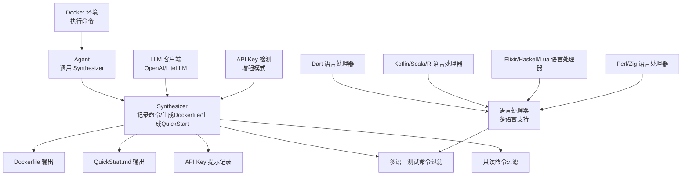
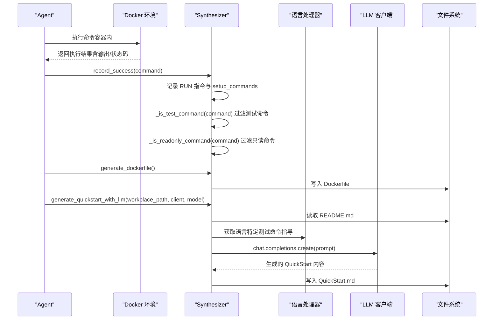
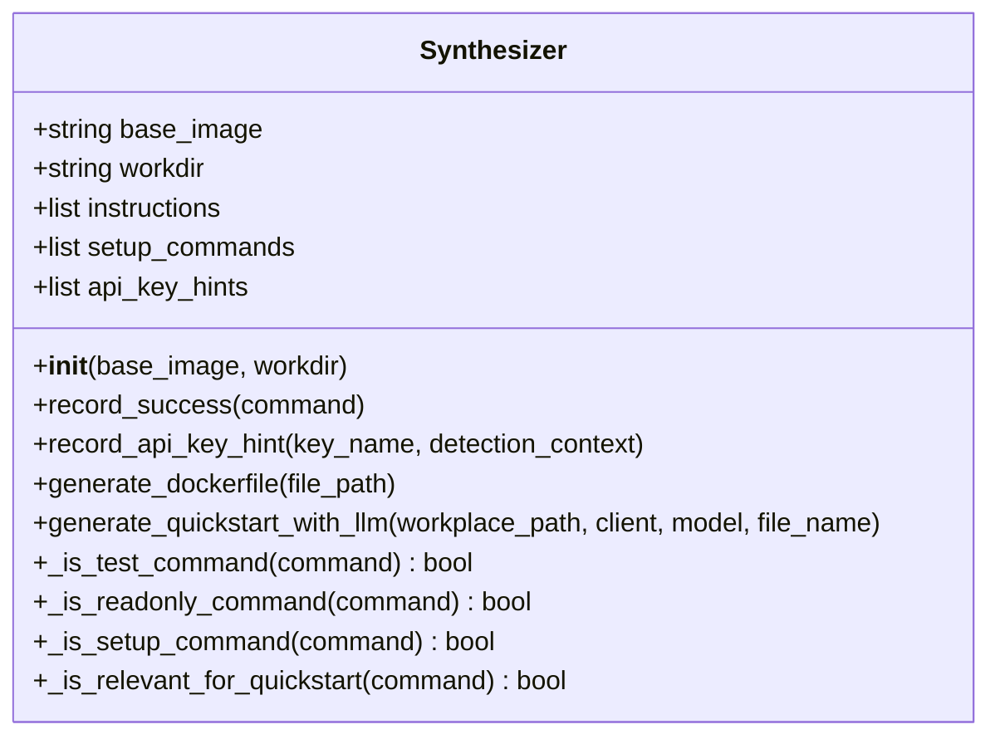
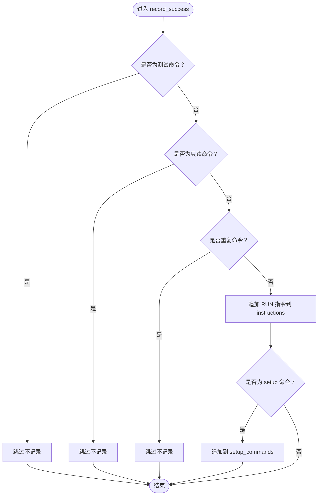
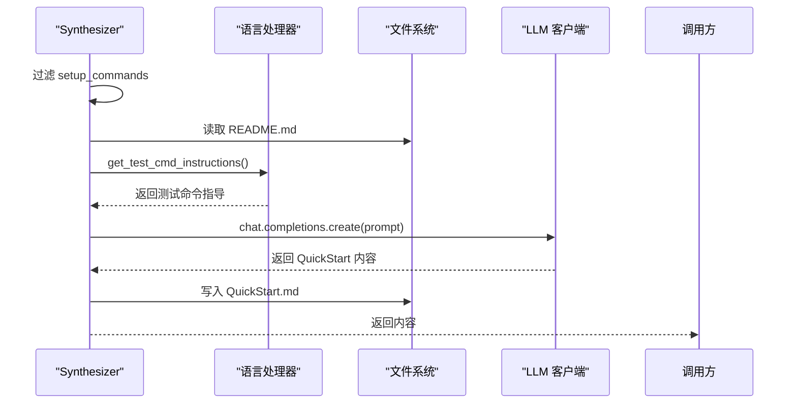
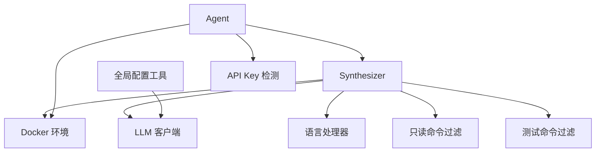

# Synthesizer 模块

<cite>
**本文引用的文件**
- [synthesizer.py](file://src/synthesizer.py)
- [agent.py](file://agent.py)
- [language_handlers.py](file://src/language_handlers.py)
- [language_handlers.py](file://others_work/RepoLaunch/launch/utilities/language_handlers.py)
- [testall.py](file://others_work/RepoLaunch/launch/agent/organize/testall.py)
- [diff_classify_jsonl.py](file://Multi-Docker-Eval/data_collection/diff_classify_jsonl.py)
- [docker.py](file://workplace/src/minisweagent/environments/docker.py)
- [litellm_model.py](file://workplace/src/minisweagent/models/litellm_model.py)
- [config.py](file://workplace/src/minisweagent/run/utilities/config.py)
- [QuickStart.md](file://workplace/multi_docker_eval_cpputest__cpputest-1842/QuickStart.md)
- [README.md](file://workplace/README.md)
- [default.yaml](file://workplace/src/minisweagent/config/default.yaml)
- [mini.py](file://workplace/src/minisweagent/run/mini.py)
- [requirements.txt](file://requirements.txt)
- [multi_docker_eval_adapter.py](file://multi_docker_eval_adapter.py)
</cite>

## 更新摘要
**所做更改**
- 新增多语言测试命令识别功能，扩展了原有的Python-only测试提取能力
- 增强API键提示跟踪机制，支持多种API键类型的自动检测
- 更新测试命令过滤逻辑，支持Python、JavaScript、Go、Rust、Java、Ruby、PHP、C/C++等多语言测试框架
- 完善语言处理器架构，提供每种编程语言的专用测试命令指导
- **新增** 支持Dart语言的测试命令识别与处理
- **新增** 支持Kotlin、Scala、R、Elixir、Haskell、Lua、Perl、Zig等语言的测试命令识别与处理
- **增强** 只读命令过滤机制，避免在Dockerfile中添加ls、cat、echo等信息查询命令
- **改进** QuickStart文档生成流程，更好地过滤无关命令并生成结构化文档

## 目录
1. [简介](#简介)
2. [项目结构](#项目结构)
3. [核心组件](#核心组件)
4. [架构总览](#架构总览)
5. [详细组件分析](#详细组件分析)
6. [依赖关系分析](#依赖关系分析)
7. [性能考虑](#性能考虑)
8. [故障排除指南](#故障排除指南)
9. [结论](#结论)
10. [附录](#附录)

## 简介
本文件面向 Synthesizer 模块的技术文档，系统化阐述文档生成系统的实现，包括：
- Dockerfile 生成算法与构建逻辑
- QuickStart 文档创建流程与 LLM 集成
- API Key 检测与提示机制
- **新增** 多语言测试命令识别与过滤功能
- record_success 方法如何记录成功的配置命令与 setup_commands
- generate_dockerfile 方法的 Dockerfile 构建逻辑（基础镜像选择、依赖安装、环境配置）
- generate_quickstart_with_llm 的文档生成流程（Prompt 设计、内容优化、输出格式）
- 使用示例与配置选项（自定义模板与输出格式调整）

## 项目结构
该模块位于 src/synthesizer.py，围绕以下职责组织：
- 记录成功执行的命令并生成 Dockerfile
- 基于 README 与真实安装命令生成 QuickStart 文档
- 检测并记录 API Key 需求，辅助用户配置
- **新增** 多语言测试命令识别与过滤，支持Python、JavaScript、Go、Rust、Java、Ruby、PHP、C/C++、Dart、Kotlin、Scala、R、Elixir、Haskell、Lua、Perl、Zig等多语言测试框架
- **增强** 只读命令过滤，避免在Dockerfile中添加ls、cat、echo等信息查询命令

**图表来源**
- [synthesizer.py](file://src/synthesizer.py#L1-L209)
- [agent.py](file://agent.py#L362-L381)
- [language_handlers.py](file://src/language_handlers.py#L1-L715)
- [language_handlers.py](file://others_work/RepoLaunch/launch/utilities/language_handlers.py#L578-L601)

**章节来源**
- [synthesizer.py](file://src/synthesizer.py#L1-L209)
- [agent.py](file://agent.py#L1-L159)

## 核心组件
- Synthesizer 类：负责记录命令、生成 Dockerfile、生成 QuickStart 文档、记录 API Key 提示、**新增** 多语言测试命令过滤、**增强** 只读命令过滤
- Docker 环境：在容器中执行命令并返回结果，供 Synthesizer 记录成功命令
- LLM 客户端：通过 OpenAI 或 LiteLLM 生成 QuickStart 文档
- 全局配置工具：提供 API Key 设置与管理能力
- **新增** 语言处理器：支持Python、JavaScript、Go、Rust、Java、Ruby、PHP、C/C++、Dart、Kotlin、Scala、R、Elixir、Haskell、Lua、Perl、Zig等多语言的测试命令识别

**章节来源**
- [synthesizer.py](file://src/synthesizer.py#L1-L209)
- [docker.py](file://workplace/src/minisweagent/environments/docker.py#L1-L162)
- [litellm_model.py](file://workplace/src/minisweagent/models/litellm_model.py#L1-L148)
- [config.py](file://workplace/src/minisweagent/run/utilities/config.py#L1-L117)
- [language_handlers.py](file://src/language_handlers.py#L1-L715)

## 架构总览
下图展示从 Agent 到 Docker 环境、再到 LLM 的完整调用链路，以及 Synthesizer 在其中的角色，**新增** 多语言测试命令识别和只读命令过滤流程。

**图表来源**
- [agent.py](file://agent.py#L1-L159)
- [synthesizer.py](file://src/synthesizer.py#L1-L209)
- [language_handlers.py](file://others_work/RepoLaunch/launch/utilities/language_handlers.py#L330-L343)

## 详细组件分析

### Synthesizer 类设计
Synthesizer 负责：
- 记录成功命令为 Docker RUN 指令，并维护用于 QuickStart 的 setup_commands
- **新增** 过滤测试命令，避免在 Dockerfile 构建时运行测试
- **增强** 过滤只读命令，避免在 Dockerfile 中添加ls、cat、echo等信息查询命令
- 生成最终 Dockerfile
- 基于 README 与真实安装命令生成 QuickStart 文档
- 记录 API Key 需求提示

**图表来源**
- [synthesizer.py](file://src/synthesizer.py#L1-L209)

**章节来源**
- [synthesizer.py](file://src/synthesizer.py#L1-L209)

### record_success 方法：记录成功的配置命令与 setup_commands
- 将成功执行的命令以 RUN 指令形式追加到 instructions
- **新增** 调用 `_is_test_command` 过滤测试命令，避免在 Dockerfile 中执行测试
- **增强** 调用 `_is_readonly_command` 过滤只读命令，避免在 Dockerfile 中添加ls、cat、echo等信息查询命令
- 去重处理：避免重复记录相同的命令
- 若命令属于"环境配置相关"（setup_command），同时追加到 setup_commands，用于后续生成 QuickStart
- 关键判断逻辑基于关键字集合，覆盖各种编程语言的测试框架

**图表来源**
- [synthesizer.py](file://src/synthesizer.py#L9-L28)

**章节来源**
- [synthesizer.py](file://src/synthesizer.py#L9-L28)

### _is_readonly_command 方法：只读命令过滤
**增强功能** 专门用于过滤只读/信息查询命令，避免在 Dockerfile 中添加无意义的命令：

- **过滤的命令类型**：ls、cat、echo、pwd、env、grep、find、head、tail、which、type、file、du、df、ps、top、hostname、whoami、date、id
- **过滤逻辑**：检查命令的第一个单词是否在预定义的只读命令列表中
- **目的**：保持 Dockerfile 的简洁性和构建效率

**图表来源**
- [synthesizer.py](file://src/synthesizer.py#L30-L36)

**章节来源**
- [synthesizer.py](file://src/synthesizer.py#L30-L36)

### _is_test_command 方法：多语言测试命令识别
**新增功能** 支持多种编程语言的测试命令识别：

- **Python 测试框架**：pytest、py.test、unittest、tox、nose、nosetests
- **JavaScript/TypeScript 测试框架**：jest、mocha、karma、vitest、cypress
- **Rust 测试框架**：cargo test
- **Go 测试框架**：go test
- **Java 测试框架**：mvn test、gradle test、gradlew test
- **Ruby 测试框架**：rspec、ruby test、rake test
- **PHP 测试框架**：phpunit、pest
- **C/C++ 测试框架**：ctest、googletest
- **通用测试模式**：包含空格的 " test" 关键词

**图表来源**
- [synthesizer.py](file://src/synthesizer.py#L38-L62)

**章节来源**
- [synthesizer.py](file://src/synthesizer.py#L38-L62)

### generate_dockerfile 方法：Dockerfile 构建逻辑
- 以 base_image 作为 FROM，以 workdir 作为 WORKDIR
- 将已记录的 instructions 顺序拼接为最终 Dockerfile
- 支持自定义输出路径，默认写入当前目录的 Dockerfile
- 返回生成的 Dockerfile 内容字符串

**图表来源**
- [synthesizer.py](file://src/synthesizer.py#L195-L209)

**章节来源**
- [synthesizer.py](file://src/synthesizer.py#L195-L209)

### generate_quickstart_with_llm 方法：文档生成流程
**改进功能** 基于 README 与真实安装命令生成 QuickStart 文档：

- 输入：工作目录路径、LLM 客户端实例、模型名、输出文件名
- 步骤：
  1) 过滤 setup_commands，剔除纯信息查询类命令（如 ls、cat、echo 等）
  2) 读取 README.md（若不存在则使用占位文本）
  3) **新增** 获取语言处理器提供的测试命令指导
  4) 构造 Prompt，包含：
     - 成功执行的安装/配置命令（在容器中验证有效）
     - README 内容（限制长度避免 token 溢出）
     - 语言特定的测试命令指导
  5) 调用 client.chat.completions.create 生成内容
  6) 写入 QuickStart.md 并返回内容
- 输出格式：Markdown，包含 Setup Steps、How to Run、API Key Configuration、Notes 四部分

**图表来源**
- [synthesizer.py](file://src/synthesizer.py#L97-L186)
- [language_handlers.py](file://others_work/RepoLaunch/launch/utilities/language_handlers.py#L330-L343)

**章节来源**
- [synthesizer.py](file://src/synthesizer.py#L97-L186)

### API Key 检测功能：record_api_key_hint
**增强功能** 在 Agent 执行过程中，根据命令输出中的关键词识别 API Key 缺失或无效的情况：

- **检测的API键类型**：openai_api_key、anthropic_api_key、api_key、access_token
- **检测逻辑**：检查观察结果中是否包含预定义的API键错误模式
- **调用 record_api_key_hint 记录** key_name 与 detection_context
- **生成 QuickStart 时** 会基于 README 分析是否需要 API Key，并给出两种配置方式（环境变量与 .env 文件）

**章节来源**
- [agent.py](file://agent.py#L362-L381)
- [synthesizer.py](file://src/synthesizer.py#L64-L68)

### 语言处理器集成
**新增功能** 与语言处理器架构集成，提供每种编程语言的专用测试命令指导：

- **Python**：pytest、unittest、nose2、behave、robotframework
- **JavaScript/TypeScript**：Jest、Mocha、Vitest、AVA、Playwright、Cypress
- **Go**：标准 go test、gotestsum、richgo、ginkgo、go-convey
- **Rust**：cargo test、cargo nextest、libtest、Cucumber-rs
- **Java**：JUnit（Maven/Gradle）、TestNG、Cucumber、Spock
- **C/C++**：GoogleTest、Catch2、doctest、CppUTest、CTest、Boost.Test
- **Dart**：dart test、flutter test
- **Kotlin**：KotlinTest、Spek、Kotest
- **Scala**：ScalaTest、Minitest、ScalaCheck
- **R**：testthat、R CMD check、devtools::test()
- **Ruby**：RSpec、minitest、Cucumber
- **PHP**：PHPUnit、Codeception、Atoum
- **Elixir**：ExUnit、StreamData、Sobelow
- **Haskell**：Hspec、QuickCheck、SmallCheck
- **Lua**：Busted、Tap
- **Perl**：prove、Test2
- **Zig**：zig test

**章节来源**
- [language_handlers.py](file://others_work/RepoLaunch/launch/utilities/language_handlers.py#L578-L601)
- [language_handlers.py](file://others_work/RepoLaunch/launch/utilities/language_handlers.py#L330-L343)
- [language_handlers.py](file://src/language_handlers.py#L652-L715)

## 依赖关系分析
- Synthesizer 依赖 Docker 环境执行命令并返回结果，从而触发 record_success
- Synthesizer 依赖 LLM 客户端生成 QuickStart 文档
- **新增** Synthesizer 依赖语言处理器获取多语言测试命令指导
- 全局配置工具提供 API Key 设置与管理，便于用户在本地环境中配置密钥
- **增强** Agent 依赖增强的 API Key 检测机制

**图表来源**
- [synthesizer.py](file://src/synthesizer.py#L1-L209)
- [docker.py](file://workplace/src/minisweagent/environments/docker.py#L1-L162)
- [config.py](file://workplace/src/minisweagent/run/utilities/config.py#L1-L117)
- [language_handlers.py](file://others_work/RepoLaunch/launch/utilities/language_handlers.py#L1-L715)
- [agent.py](file://agent.py#L362-L381)

**章节来源**
- [synthesizer.py](file://src/synthesizer.py#L1-L209)
- [docker.py](file://workplace/src/minisweagent/environments/docker.py#L1-L162)
- [config.py](file://workplace/src/minisweagent/run/utilities/config.py#L1-L117)

## 性能考虑
- Dockerfile 生成：线性拼接 instructions，时间复杂度 O(n)，n 为记录的命令数
- **新增** 测试命令过滤：多语言关键词匹配，时间复杂度 O(k*m)，k 为测试框架数量，m 为命令长度
- **增强** 只读命令过滤：单次字符串匹配，时间复杂度 O(p)，p 为命令长度
- QuickStart 生成：读取 README 与调用 LLM，受网络与模型响应时间影响；建议控制 README 截断长度以避免 token 溢出
- API Key 检测：基于字符串匹配，时间复杂度近似 O(q*r)，q 为模式数量，r 为输出字符数
- **新增** 语言处理器调用：按需加载，无额外性能开销

## 故障排除指南
- 未生成 QuickStart.md
  - 可能原因：setup_commands 为空或过滤后为空
  - 处理：确认已执行安装/配置命令并被正确记录
- **新增** 测试命令仍出现在 Dockerfile 中
  - 可能原因：测试命令未被正确识别或关键字不匹配
  - 处理：检查命令格式是否符合预定义的测试框架关键字
- **增强** 只读命令仍出现在 Dockerfile 中
  - 可能原因：只读命令过滤逻辑未生效或命令格式不符合预期
  - 处理：检查命令是否以标准格式开头（如 ls、cat、echo 等）
- LLM 生成失败
  - 可能原因：API Key 未配置、网络异常、模型不可用
  - 处理：检查全局配置与网络连接，参考全局配置工具进行设置
- Dockerfile 生成异常
  - 可能原因：权限问题、路径错误
  - 处理：确认输出路径可写，必要时指定自定义文件路径
- **增强** API Key 检测不准确
  - 可能原因：命令输出中未包含预定义的关键字模式
  - 处理：检查命令输出格式，必要时扩展关键字模式
- **新增** 多语言测试命令识别不准确
  - 可能原因：新语言或新测试框架未被识别
  - 处理：扩展 _is_test_command 方法中的测试框架关键字列表

**章节来源**
- [synthesizer.py](file://src/synthesizer.py#L101-L110)
- [config.py](file://workplace/src/minisweagent/run/utilities/config.py#L51-L84)

## 结论
Synthesizer 模块通过"记录—生成—优化"的闭环，实现了从容器内真实执行命令到可复用文档与镜像的自动化流程。其设计强调：
- 可靠性：仅记录经容器验证成功的命令，**新增** 自动过滤测试命令和只读命令
- 可解释性：生成的 Dockerfile 与 QuickStart 文档结构清晰
- **新增** 多语言支持：全面支持Python、JavaScript、Go、Rust、Java、Ruby、PHP、C/C++、Dart、Kotlin、Scala、R、Elixir、Haskell、Lua、Perl、Zig等多语言测试框架
- **增强** 命令过滤：智能过滤无意义的只读命令，保持 Dockerfile 的简洁性
- 可扩展性：支持自定义基础镜像、工作目录、输出路径与模型

## 附录

### 使用示例与配置选项
- 基础镜像与工作目录
  - 通过构造函数传入 base_image 与 workdir，影响生成的 Dockerfile
  - 示例：Synthesizer(base_image="python:3.10", workdir="/app")
- 输出路径
  - generate_dockerfile(file_path="Dockerfile") 支持自定义输出路径
- LLM 模型与温度
  - generate_quickstart_with_llm 支持指定 model 与 temperature=0（稳定输出）
- **新增** 多语言测试命令过滤
  - 自动识别并过滤各种编程语言的测试命令
  - 支持的测试框架：pytest、jest、cargo test、go test、mvn test、rspec、phpunit、ctest、dart test、kotlintest、scalatest、testthat等
- **增强** 只读命令过滤
  - 自动过滤 ls、cat、echo、pwd、env 等只读命令
  - 避免在 Dockerfile 中添加无意义的命令
- API Key 配置
  - 使用全局配置工具设置 API Key，或在运行时导出环境变量
  - 生成 QuickStart 时会自动识别 README 中的 API Key 需求并提供两种配置方法

**章节来源**
- [synthesizer.py](file://src/synthesizer.py#L2-L209)
- [config.py](file://workplace/src/minisweagent/run/utilities/config.py#L51-L84)
- [QuickStart.md](file://workplace/multi_docker_eval_cpputest__cpputest-1842/QuickStart.md#L1-L40)
- [README.md](file://workplace/README.md#L1-L222)

### 与 Docker 环境的集成
- Docker 环境负责在容器中执行命令并返回结果，Agent 根据返回值调用 Synthesizer.record_success
- Docker 环境配置项（如镜像、超时、解释器等）影响命令执行稳定性
- **新增** 测试命令过滤确保不会在 Dockerfile 构建时执行测试
- **增强** 只读命令过滤确保不会在 Dockerfile 中添加无意义的命令

**章节来源**
- [docker.py](file://workplace/src/minisweagent/environments/docker.py#L1-L162)
- [agent.py](file://agent.py#L1-L159)

### 与 LLM 的集成
- LiteLLM 模型封装了 API 调用、重试、成本统计等功能
- Agent 初始化时创建 LLM 客户端（如 OpenAI），传递给 Synthesizer 生成 QuickStart
- **新增** 语言处理器提供每种编程语言的测试命令指导，提升 QuickStart 文档质量

**章节来源**
- [litellm_model.py](file://workplace/src/minisweagent/models/litellm_model.py#L1-L148)
- [agent.py](file://agent.py#L27-L36)

### CLI 与配置文件
- mini CLI 提供一键运行与配置能力，结合全局配置工具完成 API Key 管理
- 默认配置文件包含系统模板、实例模板、观察模板等，影响交互与输出

**章节来源**
- [mini.py](file://workplace/src/minisweagent/run/mini.py#L1-L110)
- [default.yaml](file://workplace/src/minisweagent/config/default.yaml#L1-L167)
- [config.py](file://workplace/src/minisweagent/run/utilities/config.py#L1-L117)

### 多语言测试命令识别详细说明
**新增功能详情**：

#### Python 项目测试命令
- 标准测试：`pytest --json-report --json-report-file=reports/pytest-results.json`
- 单元测试：`python -m unittest discover -v`
- Nose2 测试：`nose2 --plugin nose2.plugins.json --json-report-file reports/nose2-results.json`
- BDD 测试：`behave --format json.pretty --outfile reports/behave-results.json`

#### JavaScript/TypeScript 项目测试命令
- Jest 测试：`npx jest --json --outputFile=reports/jest-results.json`
- Mocha 测试：`npx mocha --reporter json > reports/mocha-results.json`
- Vitest 测试：`npx vitest run --reporter=json > reports/vitest-results.json`
- Playwright 测试：`npx playwright test --reporter=json > reports/playwright-results.json`

#### Go 项目测试命令
- 标准测试：`go test -v ./... -json > reports/go-test-results.json`
- Gotestsum 工具：`gotestsum --format=json --jsonfile=reports/gotestsum-results.json`
- Richgo 工具：`richgo test -v ./... | tee reports/richgo-results.json`
- Ginkgo BDD：`ginkgo -r --json-report=reports/ginkgo-results.json`

#### Rust 项目测试命令
- 标准测试：`cargo test -- --format json > reports/cargo-test-results.json`
- Nextest 并行测试：`cargo nextest run --message-format json > reports/nextest-results.json`
- Libtest 测试：`cargo test -- --format json --report-time > reports/libtest-results.json`

#### Java 项目测试命令
- Maven 测试：`mvn test -DtrimStackTrace=false -DoutputFormat=json -DjsonReport=reports/junit-results.json`
- Gradle 测试：`gradle test --tests "*" --info --test-output-json > reports/gradle-junit-results.json`
- TestNG 测试：`mvn test -DsuiteXmlFile=testng.xml -Dlistener=org.uncommons.reportng.HTMLReporter,org.uncommons.reportng.JUnitXMLReporter`
- Cucumber BDD：`mvn test -Dcucumber.plugin="json:reports/cucumber-results.json"`

#### C/C++ 项目测试命令
- GoogleTest：`./your_test_binary --gtest_output=json:reports/gtest-results.json`
- Catch2：`./your_test_binary --reporter json > reports/catch2-results.json`
- Doctest：`./your_test_binary --reporters=json > reports/doctest-results.json`
- CppUTest：`./your_test_binary -oj > reports/cpputest-results.json`
- CTest：`ctest --output-log reports/ctest-results.json --output-junit reports/ctest-junit.xml`
- Boost.Test：`./your_test_binary --report_level=detailed --log_format=JSON --log_sink=reports/boost-results.json`

#### Dart 项目测试命令
- Dart 测试：`dart test`
- Flutter 测试：`flutter test`
- 包装器测试：`dart test --reporter json > reports/dart-test-results.json`

#### Kotlin 项目测试命令
- KotlinTest：`./gradlew test`
- Spek：`./gradlew test`
- Kotest：`./gradlew test --tests "*" --info --test-output-json > reports/kotest-results.json`

#### Scala 项目测试命令
- ScalaTest：`./gradlew test`
- Minitest：`./gradlew test`
- ScalaCheck：`./gradlew test`

#### R 语言项目测试命令
- testthat：`Rscript -e 'testthat::test_dir("tests")'`
- R CMD check：`R CMD check .`
- devtools 测试：`Rscript -e 'devtools::test()'`

#### 其他语言项目测试命令
- **Elixir**：`mix test`
- **Haskell**：`hspec`
- **Lua**：`busted`
- **Perl**：`prove`
- **Zig**：`zig test`

**章节来源**
- [language_handlers.py](file://others_work/RepoLaunch/launch/utilities/language_handlers.py#L578-L601)
- [language_handlers.py](file://others_work/RepoLaunch/launch/utilities/language_handlers.py#L330-L343)
- [language_handlers.py](file://src/language_handlers.py#L652-L715)