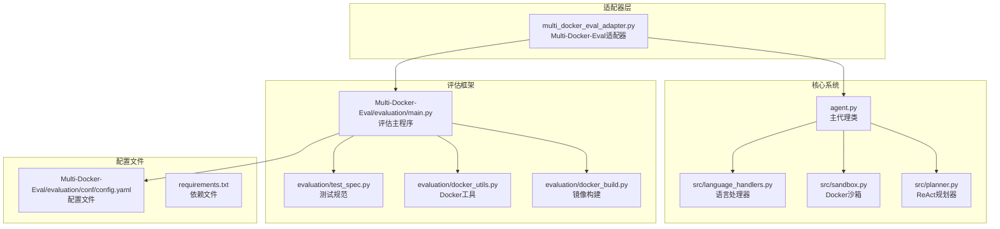
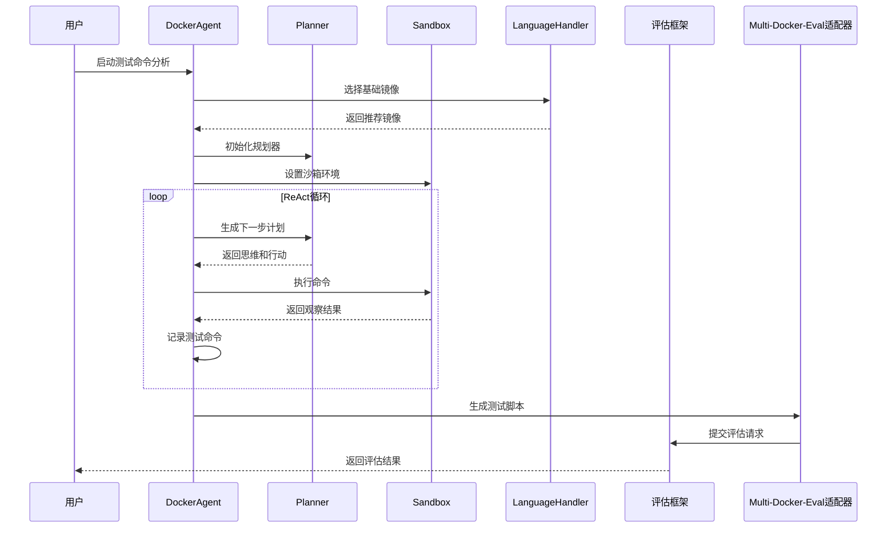
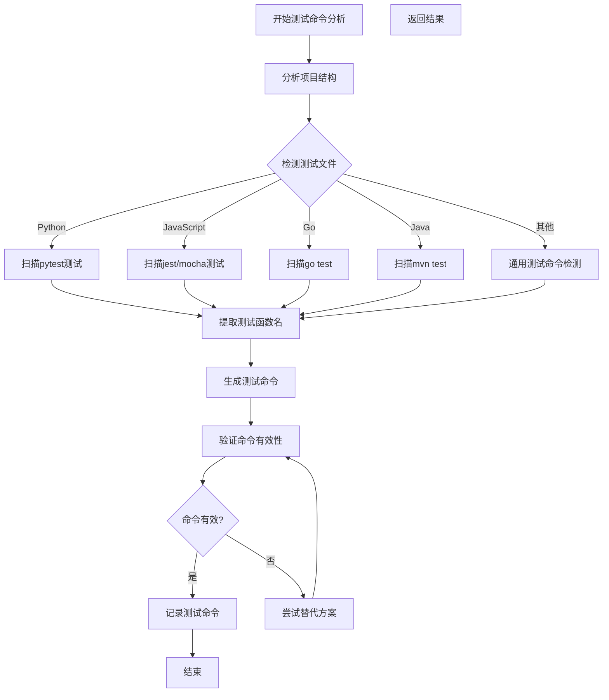
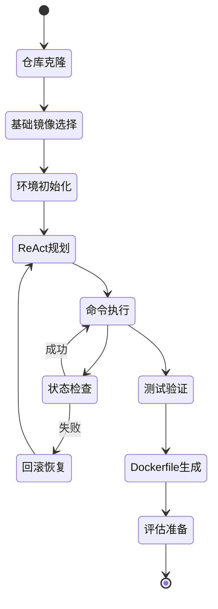
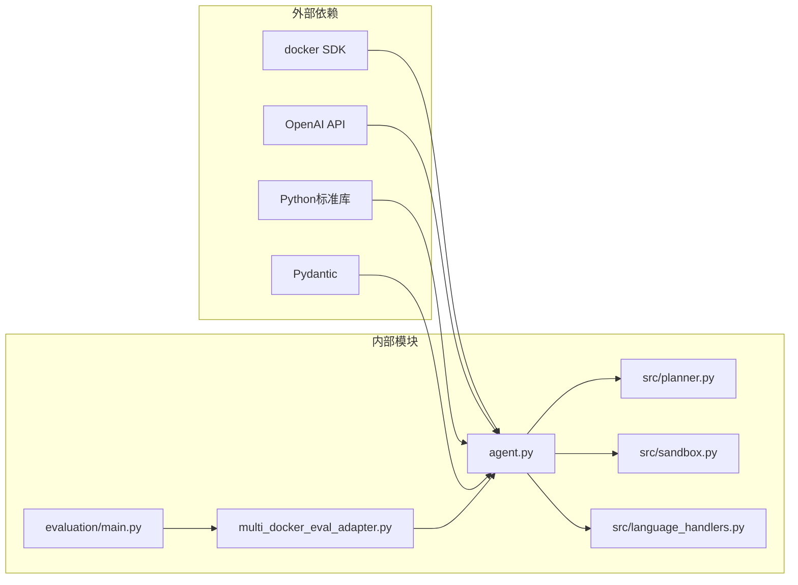

# 测试命令分析系统

<cite>
**本文档引用的文件**
- [README.md](file://README.md)
- [Multi-Docker-Eval/README.md](file://Multi-Docker-Eval/README.md)
- [multi_docker_eval_adapter.py](file://multi_docker_eval_adapter.py)
- [agent.py](file://agent.py)
- [src/planner.py](file://src/planner.py)
- [src/sandbox.py](file://src/sandbox.py)
- [src/language_handlers.py](file://src/language_handlers.py)
- [Multi-Docker-Eval/evaluation/main.py](file://Multi-Docker-Eval/evaluation/main.py)
- [Multi-Docker-Eval/evaluation/docker_build.py](file://Multi-Docker-Eval/evaluation/docker_build.py)
- [Multi-Docker-Eval/evaluation/docker_utils.py](file://Multi-Docker-Eval/evaluation/docker_utils.py)
- [Multi-Docker-Eval/evaluation/test_spec.py](file://Multi-Docker-Eval/evaluation/test_spec.py)
- [Multi-Docker-Eval/evaluation/conf/config.yaml](file://Multi-Docker-Eval/evaluation/conf/config.yaml)
- [verify_multi_docker_eval.sh](file://verify_multi_docker_eval.sh)
- [doc/MULTI_DOCKER_EVAL.md](file://doc/MULTI_DOCKER_EVAL.md)
- [single.jsonl](file://single.jsonl)
- [requirements.txt](file://requirements.txt)
</cite>

## 目录
1. [简介](#简介)
2. [项目结构](#项目结构)
3. [核心组件](#核心组件)
4. [架构概览](#架构概览)
5. [详细组件分析](#详细组件分析)
6. [依赖关系分析](#依赖关系分析)
7. [性能考虑](#性能考虑)
8. [故障排除指南](#故障排除指南)
9. [结论](#结论)

## 简介

测试命令分析系统是一个基于大型语言模型（LLM）的智能代理系统，专门设计用于自动分析和优化软件项目的测试命令。该系统能够：

- **自动识别项目类型**：通过分析代码结构和配置文件自动识别编程语言和项目类型
- **智能测试命令提取**：从项目中提取有效的测试命令，包括单元测试、集成测试等
- **测试环境配置**：为不同语言和框架提供最优的测试环境配置
- **多语言支持**：支持Python、JavaScript、Go、Java、Rust等多种主流编程语言
- **自动化评估**：与Multi-Docker-Eval基准测试框架集成，提供全面的测试命令分析能力

该系统的核心价值在于解决软件开发中的测试命令分析难题，通过智能化的方法自动发现和优化测试执行命令，提高测试效率和准确性。

## 项目结构



**图表来源**
- [agent.py:1-440](file://agent.py#L1-L440)
- [multi_docker_eval_adapter.py:1-837](file://multi_docker_eval_adapter.py#L1-L837)
- [Multi-Docker-Eval/evaluation/main.py:1-577](file://Multi-Docker-Eval/evaluation/main.py#L1-L577)

**章节来源**
- [README.md:1-71](file://README.md#L1-L71)
- [Multi-Docker-Eval/README.md:1-97](file://Multi-Docker-Eval/README.md#L1-L97)

## 核心组件

### DockerAgent 主代理类

DockerAgent是整个系统的核心控制器，负责协调各个组件完成测试命令分析任务。

**主要功能**：
- 仓库克隆和初始化
- 基础镜像自动选择
- ReAct规划循环执行
- Dockerfile生成
- 测试命令记录和验证

**关键特性**：
- 支持多种编程语言的基础镜像选择
- 智能的仓库结构分析
- 成本控制和令牌管理
- 失败回滚机制

### ReAct规划器

基于思维-行动-观察（ReAct）范式的智能规划系统。

**核心机制**：
- 思维阶段：分析当前状态和目标
- 行动阶段：生成具体的shell命令
- 观察阶段：执行命令并记录结果

**约束规则**：
- 严格的测试验证要求
- 禁止使用Docker相关命令
- 必须使用包管理器进行依赖安装

### Docker沙箱

安全的命令执行环境，提供自动化的回滚机制。

**安全特性**：
- 每次命令执行前后创建快照
- 智能的回滚策略
- 信息性退出码处理
- 测试失败信号检测

### 语言处理器

针对不同编程语言的专用处理器集合。

**支持的语言**：
- Python、JavaScript/TypeScript
- Go、Java、Rust
- C/C++、Ruby、PHP
- Kotlin、Scala、Dart等

**语言特定功能**：
- 基础镜像推荐
- 依赖管理指导
- 测试框架支持

**章节来源**
- [agent.py:18-440](file://agent.py#L18-L440)
- [src/planner.py:7-232](file://src/planner.py#L7-L232)
- [src/sandbox.py:8-294](file://src/sandbox.py#L8-L294)
- [src/language_handlers.py:9-714](file://src/language_handlers.py#L9-L714)

## 架构概览



**图表来源**
- [agent.py:285-368](file://agent.py#L285-L368)
- [multi_docker_eval_adapter.py:47-277](file://multi_docker_eval_adapter.py#L47-L277)
- [Multi-Docker-Eval/evaluation/main.py:538-577](file://Multi-Docker-Eval/evaluation/main.py#L538-L577)

系统采用分层架构设计，确保各组件职责清晰、耦合度低、可扩展性强。

## 详细组件分析

### 测试命令提取算法



**图表来源**
- [multi_docker_eval_adapter.py:295-337](file://multi_docker_eval_adapter.py#L295-L337)
- [multi_docker_eval_adapter.py:484-511](file://multi_docker_eval_adapter.py#L484-L511)

### 语言特定测试命令识别

系统为不同编程语言提供了专门的测试命令识别机制：

**Python项目**：
- 优先识别pytest测试函数
- 支持unittest测试框架
- 自动解析测试文件路径

**JavaScript/TypeScript项目**：
- 检测jest测试框架
- 支持mocha测试框架
- 分析package.json中的测试脚本

**Go项目**：
- 使用go test命令
- 支持测试文件命名约定
- 自动检测测试函数

**Java项目**：
- Maven项目：mvn test
- Gradle项目：gradle test
- 支持JUnit测试框架

**章节来源**
- [multi_docker_eval_adapter.py:484-511](file://multi_docker_eval_adapter.py#L484-L511)
- [src/language_handlers.py:43-86](file://src/language_handlers.py#L43-L86)

### Docker环境配置流程



**图表来源**
- [agent.py:285-368](file://agent.py#L285-L368)
- [src/sandbox.py:70-141](file://src/sandbox.py#L70-L141)

### Multi-Docker-Eval评估集成

系统与Multi-Docker-Eval基准测试框架深度集成，提供完整的评估能力：

**评估指标**：
- F2P（从失败到通过）成功率
- 构建成功率
- 稳定性测试结果
- 环境配置效率

**评估流程**：
1. 生成docker_res格式的评估数据
2. 执行多轮稳定性测试
3. 分析patch应用效果
4. 生成综合评估报告

**章节来源**
- [Multi-Docker-Eval/evaluation/main.py:264-326](file://Multi-Docker-Eval/evaluation/main.py#L264-L326)
- [multi_docker_eval_adapter.py:726-785](file://multi_docker_eval_adapter.py#L726-L785)

## 依赖关系分析



**图表来源**
- [requirements.txt:1-4](file://requirements.txt#L1-L4)
- [agent.py:1-17](file://agent.py#L1-L17)

**依赖特点**：
- **轻量级依赖**：仅依赖必要的第三方库
- **模块化设计**：各组件独立，可单独测试
- **向后兼容**：支持多种Python版本
- **云服务集成**：无缝对接OpenAI API

**章节来源**
- [requirements.txt:1-4](file://requirements.txt#L1-L4)
- [agent.py:14-16](file://agent.py#L14-L16)

## 性能考虑

### 内存优化策略

系统采用了多项内存优化技术：

- **增量处理**：批量处理数据，避免一次性加载大量数据
- **流式处理**：使用生成器和迭代器减少内存占用
- **缓存机制**：智能缓存常用结果，避免重复计算
- **垃圾回收**：及时释放不再使用的对象和资源

### 并发处理能力

系统支持多线程并发处理：

- **线程池管理**：动态调整并发数量
- **资源限制**：防止过度消耗系统资源
- **任务队列**：有序处理大量任务
- **进度监控**：实时跟踪处理进度

### 存储优化

- **临时文件管理**：自动清理中间文件
- **日志压缩**：减少磁盘空间占用
- **增量备份**：只备份必要的数据变化

## 故障排除指南

### 常见问题及解决方案

**Docker连接问题**：
```
Error: Cannot connect to the Docker daemon
```
- 确保Docker服务正在运行
- 检查用户权限
- 验证Docker Socket访问权限

**API密钥配置错误**：
```
ValueError: OPENAI_API_KEY not found
```
- 检查.env文件配置
- 验证API密钥格式
- 确认网络连接正常

**内存不足问题**：
```
MemoryError: Unable to allocate array
```
- 减少并发处理数量
- 增加系统内存
- 优化数据处理流程

**网络超时问题**：
```
requests.exceptions.Timeout
```
- 增加超时时间设置
- 检查网络连接稳定性
- 使用代理服务器

### 调试技巧

**启用详细日志**：
```bash
export DEBUG=1
python agent.py <repository_url>
```

**检查Docker状态**：
```bash
docker info
docker images
docker ps -a
```

**验证API连接**：
```bash
curl -H "Authorization: Bearer $OPENAI_API_KEY" \
     https://api.openai.com/v1/models
```

**章节来源**
- [doc/MULTI_DOCKER_EVAL.md:178-200](file://doc/MULTI_DOCKER_EVAL.md#L178-L200)
- [verify_multi_docker_eval.sh:14-37](file://verify_multi_docker_eval.sh#L14-L37)

## 结论

测试命令分析系统是一个功能强大、架构清晰的智能代理系统。通过结合ReAct规划范式、Docker沙箱环境和多语言支持，该系统能够：

**技术创新点**：
- **智能化测试命令提取**：自动识别和优化测试执行命令
- **多语言统一支持**：提供一致的测试命令分析体验
- **自动化评估集成**：无缝对接专业的评估框架
- **安全可靠的执行环境**：确保命令执行的安全性和可恢复性

**应用价值**：
- **提高测试效率**：自动化测试命令分析和优化
- **降低维护成本**：减少手动配置和调试工作
- **提升测试质量**：确保测试命令的准确性和完整性
- **支持持续集成**：为CI/CD流程提供可靠的技术支持

该系统为软件测试领域提供了一个全新的解决方案，具有广泛的应用前景和发展潜力。通过持续优化和扩展，该系统将在软件工程实践中发挥越来越重要的作用。