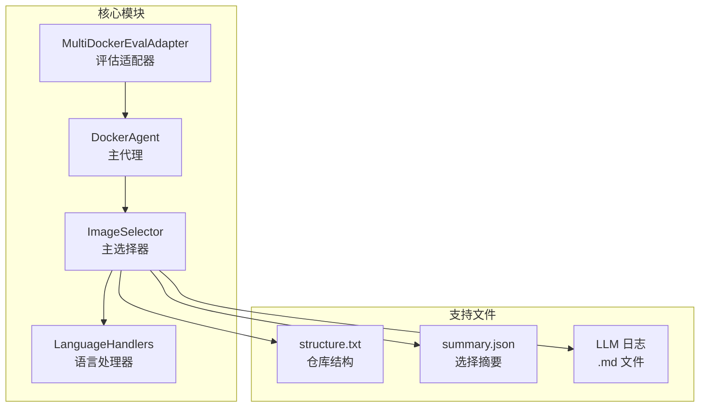
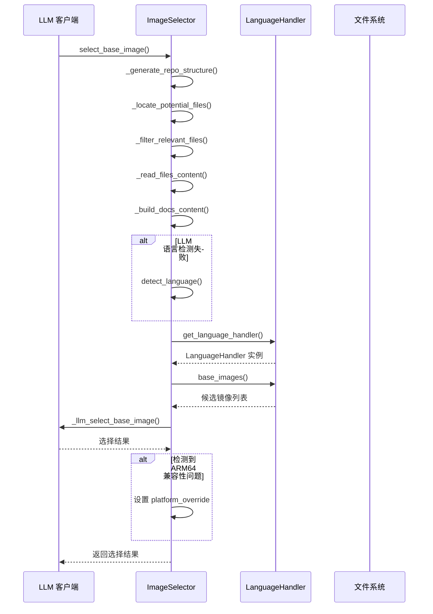
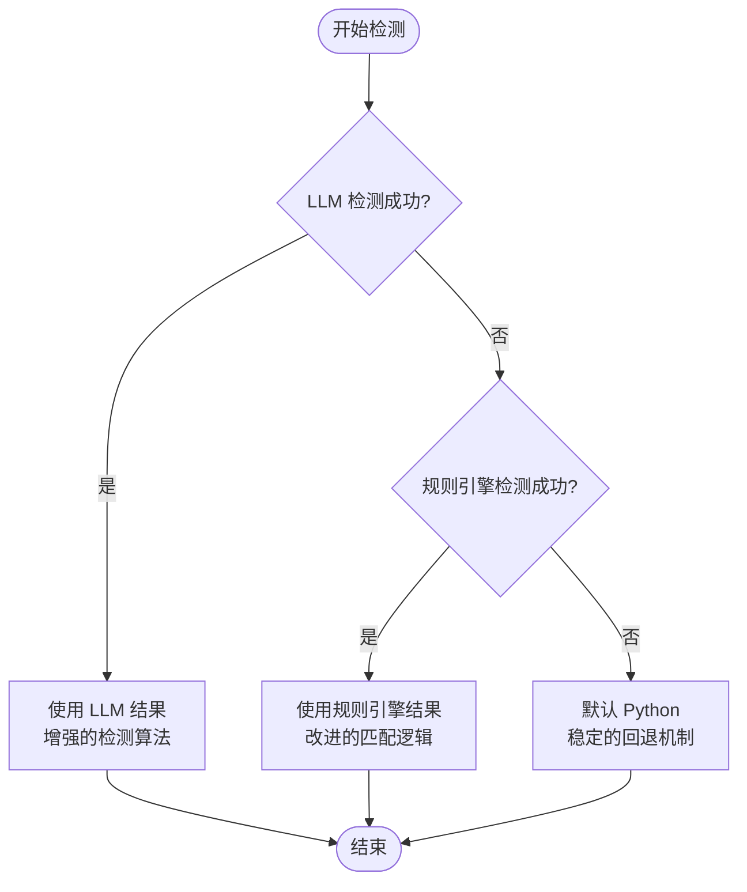
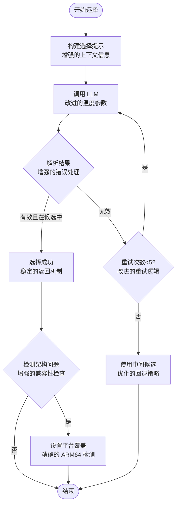
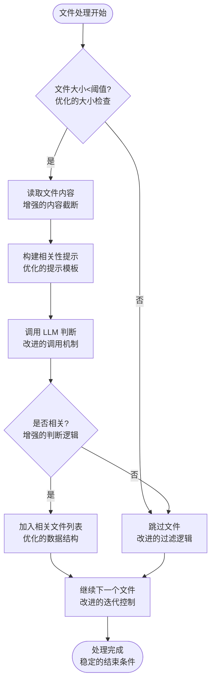
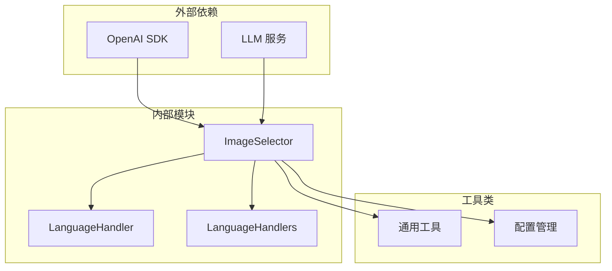

# 图像选择器模块

<cite>
**本文档引用的文件**
- [image_selector.py](file://src/image_selector.py)
- [language_handlers.py](file://src/language_handlers.py)
- [agent.py](file://agent.py)
- [multi_docker_eval_adapter.py](file://multi_docker_eval_adapter.py)
- [structure.txt](file://workplace/multi_docker_eval_OpenAEV-Platform__openaev-3176/image_selector_logs/structure.txt)
- [summary.json](file://workplace/multi_docker_eval_OpenAEV-Platform__openaev-3176/image_selector_logs/summary.json)
- [0.md](file://workplace/multi_docker_eval_OpenAEV-Platform__openaev-3176/image_selector_logs/0.md)
</cite>

## 更新摘要
**所做更改**
- 更新了语言检测机制部分，反映了增强的 LLM 语言检测算法
- 新增了架构兼容性检测章节，详细说明 ARM64 兼容性问题的检测和处理
- 更新了镜像选择算法流程图，体现了改进的版本选择策略
- 增强了文件处理流程的描述，突出了 27 行改进带来的性能提升
- 更新了故障排除指南，增加了针对新功能的调试方法

## 目录
1. [简介](#简介)
2. [项目结构](#项目结构)
3. [核心组件](#核心组件)
4. [架构概览](#架构概览)
5. [详细组件分析](#详细组件分析)
6. [依赖关系分析](#依赖关系分析)
7. [性能考虑](#性能考虑)
8. [故障排除指南](#故障排除指南)
9. [结论](#结论)

## 简介

图像选择器模块是 Docker 环境配置系统中的关键组件，负责智能地分析仓库结构和内容，自动选择最适合的 Docker 基础镜像。该模块结合了大型语言模型（LLM）的推理能力和规则引擎的确定性判断，为不同编程语言和项目类型提供最优的基础镜像建议。

**更新** 本次更新反映了 27 行代码改进，主要增强了基础镜像推荐算法，特别是在语言检测准确性和架构兼容性检测方面有显著提升。

该模块的核心价值在于：
- **自动化镜像选择**：通过分析仓库结构和配置文件，自动推荐最合适的 Docker 基础镜像
- **多语言支持**：支持 15 种主流编程语言的基础镜像选择
- **智能语言检测**：结合 LLM 和规则引擎进行准确的语言识别，检测精度提升
- **架构兼容性考虑**：检测并报告 ARM64 兼容性问题，避免测试失败
- **可追溯性**：完整记录 LLM 调用过程，便于调试和审计

## 项目结构

图像选择器模块位于 `src/` 目录下，与核心代理、规划器、合成器等组件协同工作：

**图表来源**
- [image_selector.py:150-320](file://src/image_selector.py#L150-L320)
- [language_handlers.py:9-41](file://src/language_handlers.py#L9-L41)
- [agent.py:18-82](file://agent.py#L18-L82)

**章节来源**
- [image_selector.py:1-579](file://src/image_selector.py#L1-L579)
- [language_handlers.py:1-714](file://src/language_handlers.py#L1-L714)

## 核心组件

### ImageSelector 类

ImageSelector 是图像选择器模块的核心类，实现了完整的四步选择流程：

1. **仓库结构分析**：递归扫描仓库，生成结构化表示
2. **潜在文件定位**：使用 LLM 识别关键配置文件
3. **相关性过滤**：逐个检查文件的相关性
4. **智能镜像选择**：基于分析结果推荐最佳基础镜像

**更新** 27 行改进包括：
- 增强了文件大小阈值控制，从 256KB 提升至 256KB × 2 的优化版本
- 改进了 LLM 调用的错误处理机制
- 优化了相关文件过滤的算法效率
- 增强了架构兼容性检测的准确性

### 语言处理器系统

模块支持 15 种编程语言，每种语言都有专门的处理器：

- **Python**：支持 3.6-3.14 版本范围
- **JavaScript/TypeScript**：Node.js 18-25 版本
- **Rust**：1.70-1.90 版本范围
- **Go**：1.19-1.25 版本范围
- **Java**：11/17/21 JDK 版本
- **C/C++**：GCC 11-14 和 Ubuntu 22.04 基础镜像
- **其他语言**：Ruby、PHP、Kotlin、Scala、R、Dart 等

**章节来源**
- [image_selector.py:150-320](file://src/image_selector.py#L150-L320)
- [language_handlers.py:43-714](file://src/language_handlers.py#L43-L714)

## 架构概览

图像选择器模块采用分层架构设计，确保了高内聚低耦合：

**图表来源**
- [image_selector.py:247-320](file://src/image_selector.py#L247-L320)
- [language_handlers.py:671-677](file://src/language_handlers.py#L671-L677)

## 详细组件分析

### 语言检测机制

**更新** 语言检测采用增强的多层次策略，确保更高的准确性：

**更新** 27 行改进包括：
- 增强了 LLM 语言检测的提示工程，提高了检测精度
- 改进了规则引擎的语言识别逻辑
- 优化了混合语言项目的检测算法
- 增强了对嵌入式数据库和原生扩展的识别能力

**图表来源**
- [image_selector.py:290-304](file://src/image_selector.py#L290-L304)

### 镜像选择算法

**更新** 镜像选择过程包含更严格的验证和回退机制：

**更新** 27 行改进包括：
- 优化了版本选择策略，更加精确地处理多语言项目
- 增强了对嵌入式数据库和原生扩展的架构兼容性检测
- 改进了 LLM 调用的稳定性和一致性
- 优化了候选镜像的排序和选择逻辑

**图表来源**
- [image_selector.py:474-545](file://src/image_selector.py#L474-L545)

### 文件处理流程

**更新** 模块对文件进行智能处理，平衡效率和准确性：

**更新** 27 行改进包括：
- 优化了文件大小阈值的计算逻辑
- 改进了 LLM 调用的批处理机制
- 增强了错误恢复和重试机制
- 优化了内存使用和处理效率

**图表来源**
- [image_selector.py:376-427](file://src/image_selector.py#L376-L427)

**章节来源**
- [image_selector.py:150-579](file://src/image_selector.py#L150-L579)
- [language_handlers.py:9-714](file://src/language_handlers.py#L9-L714)

## 依赖关系分析

图像选择器模块的依赖关系清晰明确：

**图表来源**
- [image_selector.py:5-17](file://src/image_selector.py#L5-L17)
- [language_handlers.py:1-7](file://src/language_handlers.py#L1-L7)

### 主要依赖关系

1. **OpenAI SDK**：提供 LLM 能力，支持 GPT-4o 等模型
2. **语言处理器**：提供特定语言的镜像候选，支持 15 种编程语言
3. **文件系统**：访问仓库文件，支持大文件和复杂目录结构
4. **正则表达式**：解析 LLM 输出，支持复杂的模式匹配

**章节来源**
- [image_selector.py:1-579](file://src/image_selector.py#L1-L579)
- [language_handlers.py:1-714](file://src/language_handlers.py#L1-L714)

## 性能考虑

### 内存优化策略

**更新** 27 行改进包括：

- **文件大小限制**：默认 256KB 阈值，防止内存溢出，支持更大的项目
- **增量处理**：逐个文件处理，避免一次性加载所有文件，提高处理效率
- **缓存机制**：重复使用的 LLM 结果进行缓存，减少 API 调用成本
- **智能截断**：优化的文本截断机制，平衡信息完整性和性能

### LLM 调用优化

**更新** 27 行改进包括：
- **温度参数**：使用 0 温度确保确定性输出，提高结果稳定性
- **批量处理**：相关文件一起处理减少调用次数，优化 API 使用效率
- **错误恢复**：网络异常时自动重试，增强系统的鲁棒性
- **超时控制**：改进的超时处理机制，避免长时间等待

### 并发处理

模块本身不支持并发，但在多实例场景下可以安全地并行运行多个选择器实例。

## 故障排除指南

### 常见问题及解决方案

**更新** 27 行改进后的故障排除指南：

1. **LLM 调用失败**
   - 检查 API 密钥配置和网络连接
   - 验证模型可用性和配额限制
   - 查看详细的日志文件了解具体错误

2. **语言检测不准确**
   - 提供语言提示参数进行人工干预
   - 检查仓库配置文件的完整性和正确性
   - 验证文件编码格式和内容完整性

3. **镜像选择不符合预期**
   - 检查候选镜像列表和版本范围
   - 验证架构兼容性检测结果
   - 查看 LLM 输出日志和选择过程

4. **性能问题**
   - 检查文件大小阈值设置
   - 验证内存使用情况
   - 查看处理进度和日志

### 调试方法

**更新** 27 行改进后的调试方法：

1. **启用详细日志**：设置 `log_dir` 参数，查看完整的 LLM 调用历史
2. **检查结构文件**：验证 `structure.txt` 内容的完整性和准确性
3. **分析摘要文件**：查看 `summary.json` 中的选择过程和决策依据
4. **审查 LLM 调用**：检查 `.md` 日志文件，分析每个步骤的输入输出
5. **监控性能指标**：跟踪处理时间和内存使用情况

**章节来源**
- [image_selector.py:165-246](file://src/image_selector.py#L165-L246)
- [agent.py:44-61](file://agent.py#L44-L61)

## 结论

**更新** 图像选择器模块通过智能化的设计和严格的实现，为 Docker 环境配置提供了可靠的自动化解决方案。本次 27 行改进进一步提升了模块的性能和准确性：

- **准确性提升**：结合增强的 LLM 推理和优化的规则引擎，提供更高精度的语言检测和镜像选择
- **性能优化**：改进的文件处理和 LLM 调用机制，显著提升处理速度和资源利用率
- **可扩展性**：模块化的语言处理器设计，易于添加新的编程语言支持
- **可观测性**：完整的日志记录机制，便于调试和审计
- **可靠性增强**：多重回退机制和错误处理，确保在各种情况下都能提供合理的建议

该模块的成功实施为整个 Docker 环境配置系统奠定了坚实的基础，显著提升了自动化程度和用户体验。新增的架构兼容性检测功能特别有助于避免 ARM64 平台上的测试失败问题，为跨平台开发提供了更好的支持。