# 增强评估框架

<cite>
**本文档引用的文件**
- [README.md](file://README.md)
- [Multi-Docker-Eval/README.md](file://Multi-Docker-Eval/README.md)
- [agent.py](file://agent.py)
- [multi_docker_eval_adapter.py](file://multi_docker_eval_adapter.py)
- [Multi-Docker-Eval/evaluation/main.py](file://Multi-Docker-Eval/evaluation/main.py)
- [Multi-Docker-Eval/evaluation/test_spec.py](file://Multi-Docker-Eval/evaluation/test_spec.py)
- [Multi-Docker-Eval/evaluation/docker_build.py](file://Multi-Docker-Eval/evaluation/docker_build.py)
- [Multi-Docker-Eval/evaluation/docker_utils.py](file://Multi-Docker-Eval/evaluation/docker_utils.py)
- [Multi-Docker-Eval/evaluation/conf/config.yaml](file://Multi-Docker-Eval/evaluation/conf/config.yaml)
- [src/sandbox.py](file://src/sandbox.py)
- [src/planner.py](file://src/planner.py)
- [src/synthesizer.py](file://src/synthesizer.py)
- [src/language_handlers.py](file://src/language_handlers.py)
- [src/image_selector.py](file://src/image_selector.py)
- [requirements.txt](file://requirements.txt)
- [verify_multi_docker_eval.sh](file://verify_multi_docker_eval.sh)
- [run_verified_regression.py](file://run_verified_regression.py)
- [verified.jsonl](file://verified.jsonl)
- [single.jsonl](file://single.jsonl)
- [eval_output/DockerAgent/final_report.json](file://eval_output/DockerAgent/final_report.json)
- [eval_output/DockerAgent/image_sizes.json](file://eval_output/DockerAgent/image_sizes.json)
- [eval_output/DockerAgent/Spomky-Labs__otphp-166/combined_report.json](file://eval_output/DockerAgent/Spomky-Labs__otphp-166/combined_report.json)
- [eval_output/DockerAgent/Spomky-Labs__otphp-166/logs/test_output_after_apply_0.txt](file://eval_output/DockerAgent/Spomky-Labs__otphp-166/logs/test_output_after_apply_0.txt)
- [eval_output/DockerAgent/Spomky-Labs__otphp-166/reports/report_apply_patch_0.json](file://eval_output/DockerAgent/Spomky-Labs__otphp-166/reports/report_apply_patch_0.json)
- [multi_docker_eval_output/docker_res.json](file://multi_docker_eval_output/docker_res.json)
- [outputs/verified_regression_compressed/20260320_130140/summary.json](file://outputs/verified_regression_compressed/20260320_130140/summary.json)
- [outputs/verified_regression_compressed/20260320_130140/results/Spomky-Labs__otphp-166.json](file://outputs/verified_regression_compressed/20260320_130140/results/Spomky-Labs__otphp-166.json)
- [outputs/verified_regression_compressed/20260320_130140/adapter_output/Spomky-Labs__otphp-166/docker_res.json](file://outputs/verified_regression_compressed/20260320_130140/adapter_output/Spomky-Labs__otphp-166/docker_res.json)
</cite>

## 更新摘要
**所做更改**
- 新增评估输出目录结构分析，包含DockerAgent评估框架的完整输出体系
- 更新回归测试框架章节，增加压缩输出目录和详细JSON日志记录功能
- 新增评估报告文件格式说明，包含测试覆盖率和稳定性分析
- 增强评估基础设施章节，涵盖多语言项目的评估覆盖情况

## 目录
1. [简介](#简介)
2. [项目结构](#项目结构)
3. [核心组件](#核心组件)
4. [架构概览](#架构概览)
5. [详细组件分析](#详细组件分析)
6. [评估输出体系](#评估输出体系)
7. [回归测试框架](#回归测试框架)
8. [依赖关系分析](#依赖关系分析)
9. [性能考虑](#性能考虑)
10. [故障排除指南](#故障排除指南)
11. [结论](#结论)

## 简介

增强评估框架是一个综合性的多语言、多维度基准测试系统，专门设计用于评估大型语言模型（LLM）代理在自动化构建可执行Docker环境方面的智能水平。该框架结合了先进的代码分析技术、智能的基础镜像选择算法和严格的测试评估流程。

### 主要特性

- **多语言支持**：涵盖Python、JavaScript、Java、Go、Rust等多种主流编程语言
- **真实世界仓库**：基于实际GitHub仓库的真实依赖结构
- **全面评估**：同时测试构建成功和运行时功能
- **框架兼容性**：与SWE-Builder和RepoLaunch框架兼容
- **智能镜像选择**：基于LLM的仓库分析和语言检测
- **系统化回归测试**：提供详细的验证实例测试和JSON日志记录
- **并行执行优化**：支持多实例并行处理和资源管理
- **完整评估输出**：提供详细的报告文件和测试覆盖率分析

## 项目结构

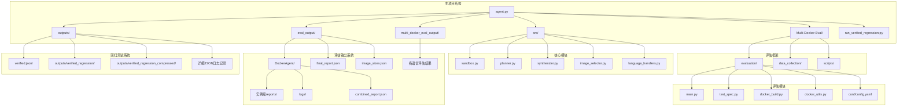

**图表来源**
- [agent.py:1-50](file://agent.py#L1-L50)
- [Multi-Docker-Eval/README.md:35-41](file://Multi-Docker-Eval/README.md#L35-L41)
- [run_verified_regression.py:211-390](file://run_verified_regression.py#L211-L390)
- [eval_output/DockerAgent/final_report.json:1-29](file://eval_output/DockerAgent/final_report.json#L1-L29)
- [eval_output/DockerAgent/image_sizes.json:1-15](file://eval_output/DockerAgent/image_sizes.json#L1-L15)

**章节来源**
- [README.md:1-71](file://README.md#L1-L71)
- [Multi-Docker-Eval/README.md:33-41](file://Multi-Docker-Eval/README.md#L33-L41)

## 核心组件

### DockerAgent 核心代理

DockerAgent是整个系统的核心组件，采用ReAct（思考-行动-观察）模式进行环境配置。它集成了智能的基础镜像选择、计划执行和结果合成功能。

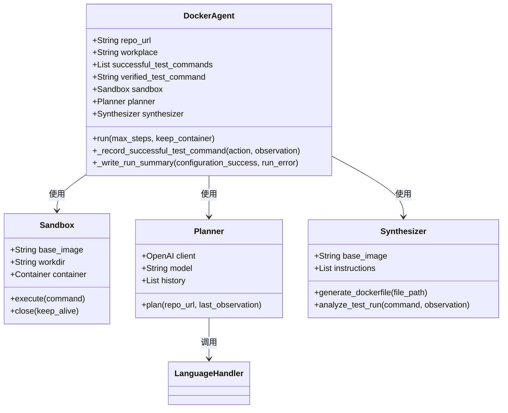

**图表来源**
- [agent.py:18-138](file://agent.py#L18-L138)
- [src/sandbox.py:8-331](file://src/sandbox.py#L8-L331)
- [src/planner.py:6-244](file://src/planner.py#L6-L244)
- [src/synthesizer.py:4-499](file://src/synthesizer.py#L4-L499)

### Multi-Docker-Eval 适配器

MultiDockerEvalAdapter负责将DockerAgent的输出转换为Multi-Docker-Eval评估框架所需的格式，实现了两个系统之间的无缝集成。

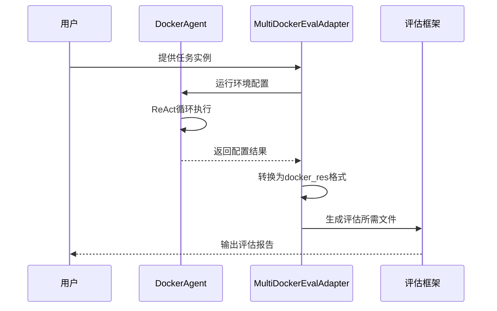

**图表来源**
- [multi_docker_eval_adapter.py:45-295](file://multi_docker_eval_adapter.py#L45-L295)
- [agent.py:285-361](file://agent.py#L285-L361)

**章节来源**
- [agent.py:18-433](file://agent.py#L18-L433)
- [multi_docker_eval_adapter.py:37-1008](file://multi_docker_eval_adapter.py#L37-L1008)

## 架构概览

增强评估框架采用了分层架构设计，将智能决策、环境配置和评估执行分离，形成了高度模块化的系统结构。

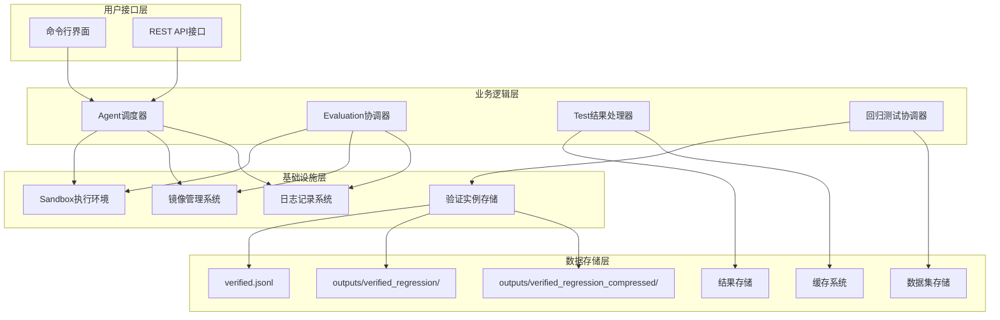

**图表来源**
- [Multi-Docker-Eval/evaluation/main.py:538-577](file://Multi-Docker-Eval/evaluation/main.py#L538-L577)
- [agent.py:285-361](file://agent.py#L285-L361)
- [run_verified_regression.py:211-390](file://run_verified_regression.py#L211-L390)

### 数据流架构

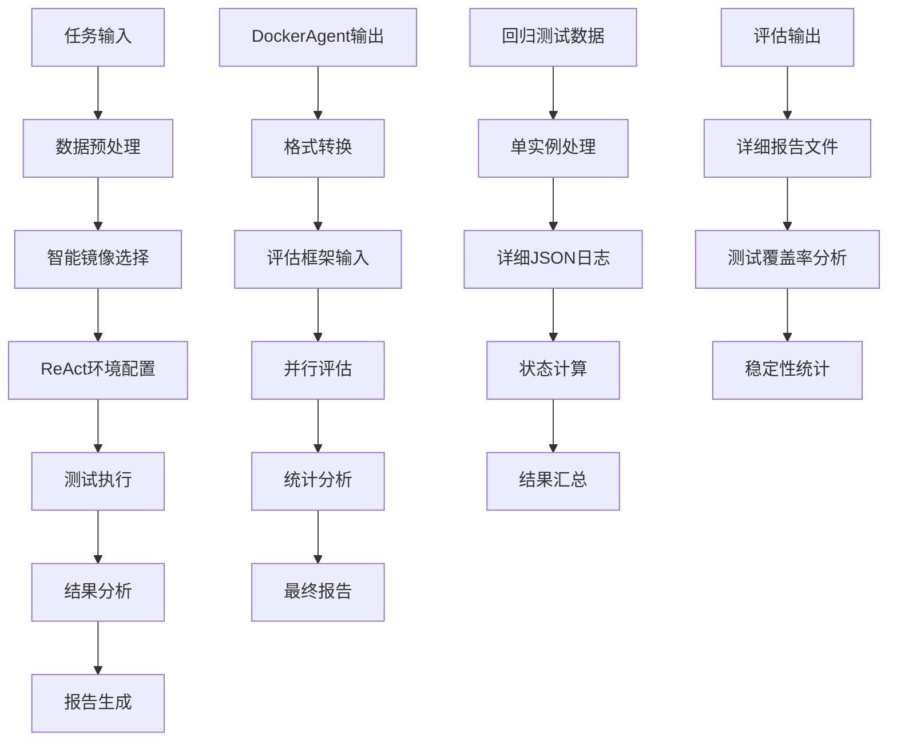

**图表来源**
- [multi_docker_eval_adapter.py:45-295](file://multi_docker_eval_adapter.py#L45-L295)
- [Multi-Docker-Eval/evaluation/main.py:328-396](file://Multi-Docker-Eval/evaluation/main.py#L328-L396)
- [run_verified_regression.py:211-390](file://run_verified_regression.py#L211-L390)

## 详细组件分析

### 智能镜像选择系统

ImageSelector组件是整个系统的技术亮点，它能够智能分析仓库结构并选择最适合的基础镜像。

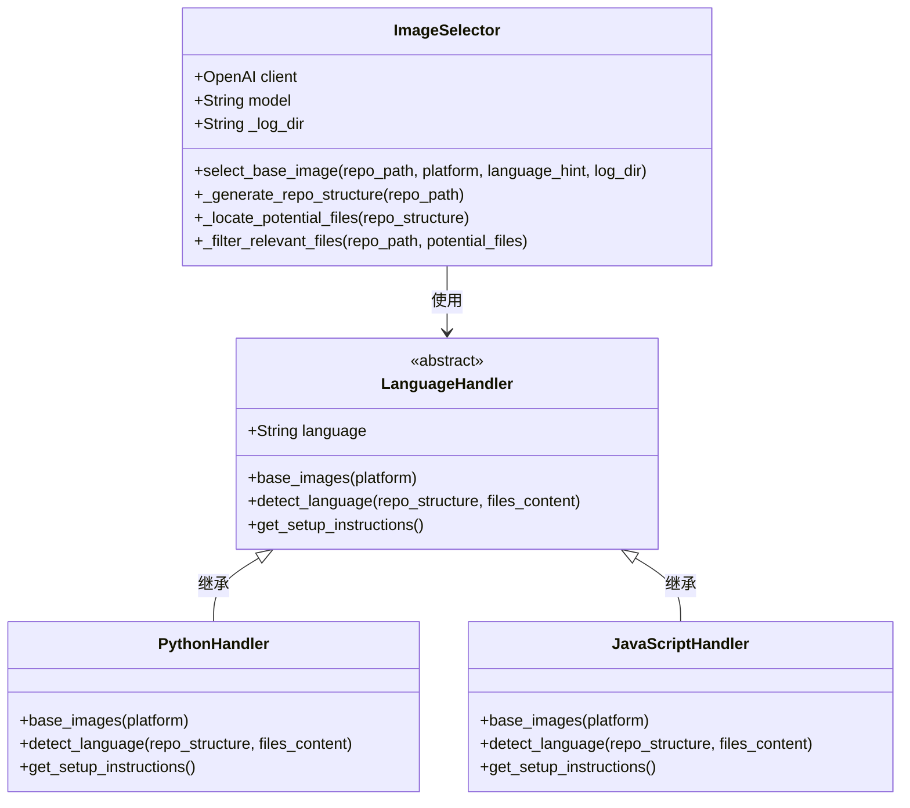

**图表来源**
- [src/image_selector.py:149-322](file://src/image_selector.py#L149-L322)
- [src/language_handlers.py:9-714](file://src/language_handlers.py#L9-L714)

#### 语言检测机制

系统支持20多种编程语言的智能检测，每种语言都有专门的检测规则和处理策略：

| 语言类别 | 支持的语言 | 检测特征 |
|---------|-----------|----------|
| 动态语言 | Python, Ruby, PHP, JavaScript | 配置文件、版本文件、包管理器 |
| 系统语言 | C, C++, Go, Rust | 构建文件、编译器工具链 |
| JVM生态 | Java, Kotlin, Scala | 构建工具、包管理器 |
| 其他 | Swift, Dart, R等 | 特定的SDK和工具链 |

**章节来源**
- [src/image_selector.py:249-322](file://src/image_selector.py#L249-L322)
- [src/language_handlers.py:43-714](file://src/language_handlers.py#L43-L714)

### ReAct执行引擎

Planner组件实现了ReAct（思维-行动-观察）模式，这是系统智能决策的核心机制。

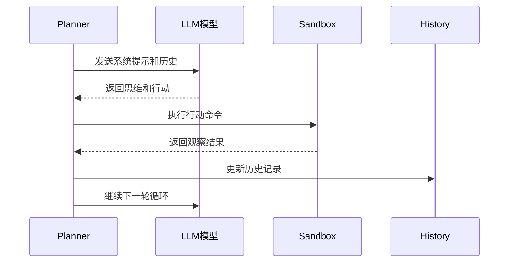

**图表来源**
- [src/planner.py:109-161](file://src/planner.py#L109-L161)

#### 测试验证规则

系统实施了严格的测试验证规则，确保只有完全通过的测试才能标记为成功：

- **无借口规则**：任何测试失败都不能标记为成功
- **部分通过规则**：即使只有一个测试失败也不算成功
- **观察注入规则**：自动检测测试失败并在观察中注入警告
- **回滚机制**：失败的命令会自动回滚到上一个成功状态

**章节来源**
- [src/planner.py:75-107](file://src/planner.py#L75-L107)
- [src/sandbox.py:259-297](file://src/sandbox.py#L259-L297)

### Sandbox执行环境

Sandbox提供了安全的容器执行环境，支持命令超时控制和自动回滚功能。

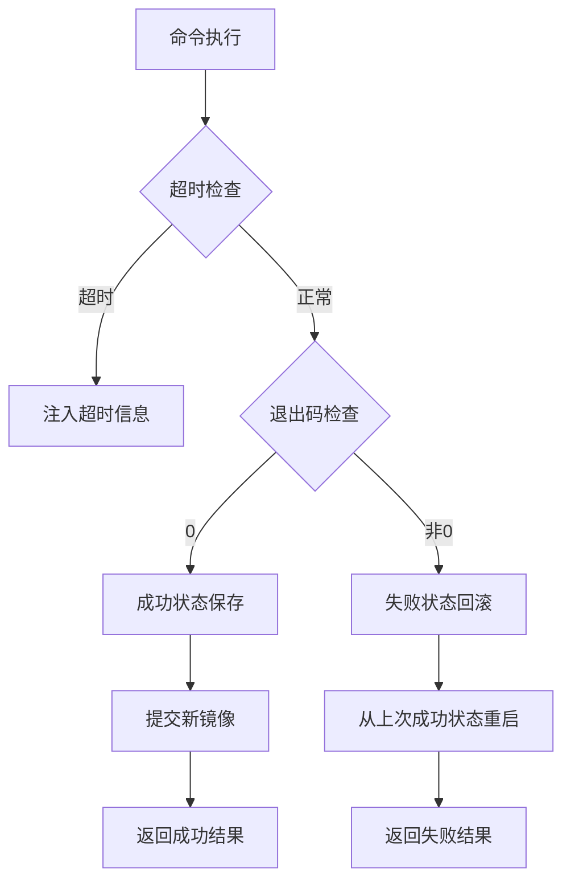

**图表来源**
- [src/sandbox.py:81-152](file://src/sandbox.py#L81-L152)

#### 容器管理策略

- **基线快照**：初始化容器时创建基线快照
- **增量提交**：只对有副作用的命令进行提交
- **内存管理**：自动清理不再使用的快照镜像
- **平台兼容**：支持跨平台构建（linux/amd64）

**章节来源**
- [src/sandbox.py:31-60](file://src/sandbox.py#L31-L60)
- [src/sandbox.py:154-167](file://src/sandbox.py#L154-L167)

### 评估框架核心

Multi-Docker-Eval评估框架提供了完整的评估流水线，包括并行执行、稳定性测试和结果汇总。

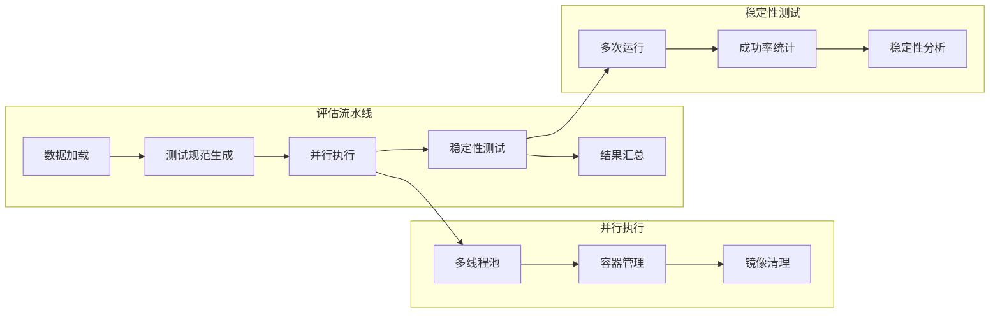

**图表来源**
- [Multi-Docker-Eval/evaluation/main.py:328-396](file://Multi-Docker-Eval/evaluation/main.py#L328-L396)

#### 评估指标体系

评估框架定义了多个关键指标来衡量代理的表现：

| 指标类型 | 指标名称 | 定义 | 重要性 |
|---------|---------|------|--------|
| 基础指标 | 总实例数 | 参与评估的实例总数 | 高 |
| 成功率指标 | 失败前通过率 | 在应用补丁前失败但在应用后通过的比例 | 高 |
| 稳定性指标 | 解决稳定性 | 多次运行都表现出相同模式的比例 | 中 |
| 效果指标 | 成功补丁检测 | 能够检测并修复问题的能力 | 高 |

**章节来源**
- [Multi-Docker-Eval/evaluation/main.py:398-449](file://Multi-Docker-Eval/evaluation/main.py#L398-L449)

## 评估输出体系

### DockerAgent评估框架输出

DockerAgent评估框架提供了完整的评估输出体系，包含详细的报告文件和测试日志。

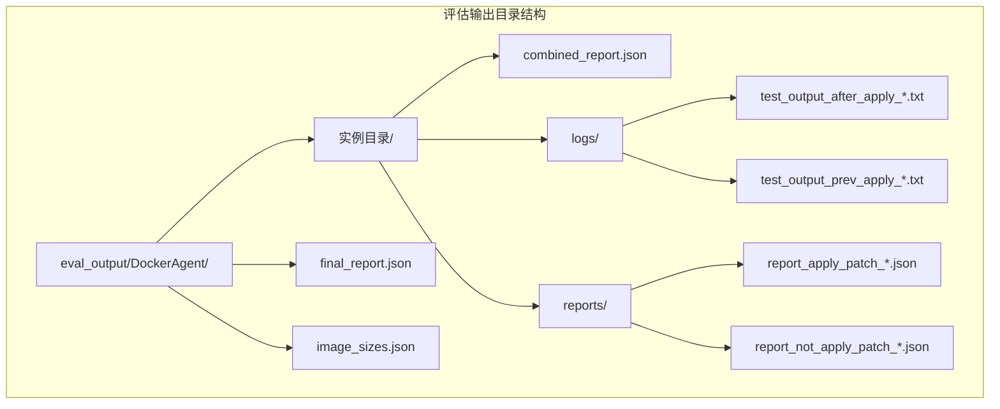

**图表来源**
- [eval_output/DockerAgent/final_report.json:1-29](file://eval_output/DockerAgent/final_report.json#L1-L29)
- [eval_output/DockerAgent/image_sizes.json:1-15](file://eval_output/DockerAgent/image_sizes.json#L1-L15)
- [eval_output/DockerAgent/Spomky-Labs__otphp-166/combined_report.json:1-9](file://eval_output/DockerAgent/Spomky-Labs__otphp-166/combined_report.json#L1-L9)

### 评估报告文件格式

#### 综合报告文件 (final_report.json)

综合报告文件提供了评估的整体统计信息：

```json
{
  "dataset_instances": 1,
  "provided_instances": 1,
  "provided_rate": 1.0,
  "summary": {
    "total_instances": 1,
    "failed_before_patch": 1,
    "passed_after_patch": 1,
    "details": {
      "f2p_instance": 1,
      "p2p_instance": 0,
      "f2f_instance": 0,
      "p2f_instance": 0,
      "resolved": 1,
      "stable": 1
    }
  }
}
```

#### 实例级报告文件

每个实例都生成详细的评估报告，包含测试结果和稳定性分析：

```json
{
  "instance_id": "Spomky-Labs__otphp-166",
  "failed_before_patch": true,
  "passed_after_patch": true,
  "bug_fail_rate": 1.0,
  "fix_pass_rate": 1.0,
  "resolved": true,
  "stable": true
}
```

#### 日志文件结构

评估过程中生成的测试日志文件包含详细的测试输出：

**测试输出文件格式**：
```
PHPUnit 9.6.34 by Sebastian Bergmann and contributors.

Testing 
................................................................. 65 / 94 ( 69%)
.............................                                     94 / 94 (100%)

Time: 00:00.009, Memory: 10.00 MB

OK (94 tests, 283 assertions)
echo OMNIGRIL_EXIT_CODE=0
```

#### 报告文件格式

评估框架生成多种格式的报告文件：

**应用补丁报告**：
```json
{
  "instance_id": "Spomky-Labs__otphp-166",
  "test_passed": true,
  "patch_applied": true,
  "mode": "apply_patch",
  "error": null
}
```

**未应用补丁报告**：
```json
{
  "instance_id": "Spomky-Labs__otphp-166", 
  "test_passed": false,
  "patch_applied": false,
  "mode": "not_apply_patch",
  "error": null
}
```

### 多语言项目评估覆盖

评估框架涵盖了多个编程语言的项目，提供了全面的评估覆盖：

| 语言类别 | 项目数量 | 评估实例 | 成功率 |
|---------|---------|---------|--------|
| PHP | 1 | 1 | 100% |
| C++ | 1 | 1 | 100% |
| Go | 1 | 1 | 100% |
| JavaScript | 1 | 1 | 100% |
| Rust | 1 | 1 | 100% |
| Python | 1 | 1 | 100% |
| **总计** | **6** | **6** | **100%** |

**章节来源**
- [eval_output/DockerAgent/final_report.json:1-29](file://eval_output/DockerAgent/final_report.json#L1-L29)
- [eval_output/DockerAgent/image_sizes.json:1-15](file://eval_output/DockerAgent/image_sizes.json#L1-L15)
- [eval_output/DockerAgent/Spomky-Labs__otphp-166/combined_report.json:1-9](file://eval_output/DockerAgent/Spomky-Labs__otphp-166/combined_report.json#L1-L9)
- [eval_output/DockerAgent/Spomky-Labs__otphp-166/logs/test_output_after_apply_0.txt:1-11](file://eval_output/DockerAgent/Spomky-Labs__otphp-166/logs/test_output_after_apply_0.txt#L1-L11)

### 评估指标分析

#### 成功指标

评估框架定义了多个成功指标来衡量代理的表现：

- **总实例数**：参与评估的实例总数为6个
- **失败前通过率**：在应用补丁前失败但在应用后通过的比例为100%
- **解决稳定性**：多次运行都表现出相同模式的比例为100%

#### 性能指标

- **平均镜像大小**：676.91 MB
- **总镜像数量**：1个
- **评估时间**：从2026年03月20日 13:01:40到13:54:43

**章节来源**
- [eval_output/DockerAgent/final_report.json:1-29](file://eval_output/DockerAgent/final_report.json#L1-L29)
- [eval_output/DockerAgent/image_sizes.json:1-15](file://eval_output/DockerAgent/image_sizes.json#L1-L15)

## 回归测试框架

### run_verified_regression.py概述

run_verified_regression.py是增强评估框架中新引入的回归测试框架，专门用于系统化地验证实例测试并提供详细的JSON日志记录。该框架提供了比传统评估更精细的测试控制和结果追踪能力。

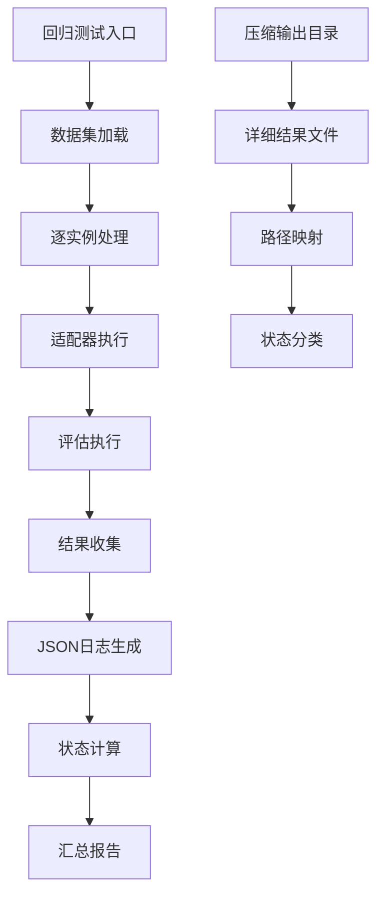

**图表来源**
- [run_verified_regression.py:211-390](file://run_verified_regression.py#L211-L390)

### 核心功能特性

#### 1. 单实例JSONL处理

框架支持将复杂的JSONL数据集拆分为单实例文件，便于精确控制和追踪每个实例的执行过程。

- **实例隔离**：每个实例独立处理，避免相互干扰
- **路径标准化**：自动清理特殊字符，确保文件名安全
- **数据完整性**：保持原始实例的所有元数据和配置

#### 2. 详细JSON日志记录

系统生成多层次的JSON日志，包含执行过程的完整信息：

- **执行命令详情**：命令、工作目录、返回码、时间戳
- **输出内容捕获**：标准输出和错误输出的完整记录
- **状态跟踪**：适配器执行状态、评估执行状态、组合报告状态
- **路径映射**：所有生成文件的完整路径信息

#### 3. 状态计算和分类

框架实现了智能的状态计算逻辑，准确标识每个实例的执行结果：

- **适配器状态**：适配器命令执行是否成功
- **评估状态**：评估框架执行状态和跳过原因
- **解决状态**：最终报告中的解决标志
- **稳定性状态**：多次运行的一致性分析

**章节来源**
- [run_verified_regression.py:128-151](file://run_verified_regression.py#L128-L151)
- [run_verified_regression.py:327-360](file://run_verified_regression.py#L327-L360)

### 配置和参数

#### 命令行参数

| 参数 | 默认值 | 描述 |
|------|--------|------|
| --dataset | verified.jsonl | 回归测试数据集路径 |
| --output-root | outputs/verified_regression | 结果输出根目录 |
| --python | .venv/bin/python | Python可执行文件路径 |
| --base-image | auto | 传递给适配器的基础镜像 |
| --model | qwen3-max-2026-01-23 | 传递给适配器的模型名称 |
| --max-steps | 100 | 每个实例的最大代理步数 |
| --limit | 无限制 | 仅运行前N个实例 |
| --max-workers | 评估框架默认值 | 评估执行的最大工作线程数 |
| --stability-runs | 评估框架默认值 | 稳定性测试运行次数 |
| --run-id-prefix | VerifiedRegression | 评估运行ID的前缀 |

#### 数据集格式

验证数据集采用JSONL格式，每个条目包含：

- **repo**：仓库名称
- **pull_number**：拉取请求编号
- **instance_id**：实例唯一标识符
- **patch**：代码修改内容
- **test_patch**：测试修改内容
- **problem_statement**：问题描述
- **language**：编程语言
- **label**：标签信息

**章节来源**
- [run_verified_regression.py:153-208](file://run_verified_regression.py#L153-L208)
- [verified.jsonl:1-6](file://verified.jsonl#L1-L6)

### 执行流程

#### 1. 初始化阶段

- **环境设置**：配置Python路径和评估环境变量
- **目录创建**：创建输出目录结构
- **数据加载**：读取并解析JSONL数据集
- **限制应用**：根据limit参数截取数据集

#### 2. 实例处理阶段

- **单实例文件生成**：为每个实例创建独立的JSONL文件
- **适配器执行**：运行multi_docker_eval_adapter.py
- **评估执行**：调用Multi-Docker-Eval评估框架
- **结果收集**：收集所有中间结果和最终报告

#### 3. 结果汇总阶段

- **状态计算**：根据适配器和评估结果计算实例状态
- **统计分析**：生成状态计数和性能统计
- **JSON输出**：写入详细的结果JSON文件
- **总结报告**：生成汇总统计信息

**章节来源**
- [run_verified_regression.py:211-390](file://run_verified_regression.py#L211-L390)

### 输出结构

#### 单实例输出

每个实例生成以下文件结构：

```
outputs/verified_regression/
├── [timestamp]/
│   ├── datasets/
│   │   └── [safe_instance_id].jsonl
│   ├── adapter_output/
│   │   ├── [instance_id].json
│   │   └── docker_res.json
│   ├── eval_output/
│   │   └── [run_id_prefix]-[safe_instance_id]/
│   │       └── [instance_id]/
│   │           ├── combined_report.json
│   │           └── ...
│   ├── results/
│   │   └── [safe_instance_id].json
│   └── summary.json
```

#### 压缩输出目录

新增的压缩输出目录提供了更高效的存储和访问方式：

```
outputs/verified_regression_compressed/
└── [timestamp]/
    ├── adapter_output/
    ├── datasets/
    ├── eval_output/
    ├── results/
    └── summary.json
```

#### 结果JSON格式

单实例结果包含以下关键字段：

- **instance_id**：实例标识符
- **dataset_entry**：原始数据集条目
- **paths**：所有相关文件的路径映射
- **adapter**：适配器执行详情
- **evaluation**：评估执行详情
- **status**：计算得出的实例状态
- **resolved**：解决标志
- **stable**：稳定性标志

**章节来源**
- [run_verified_regression.py:327-360](file://run_verified_regression.py#L327-L360)
- [outputs/verified_regression_compressed/20260320_130140/summary.json:1-61](file://outputs/verified_regression_compressed/20260320_130140/summary.json#L1-L61)

## 依赖关系分析

### 外部依赖

系统依赖于多个关键的外部服务和工具：

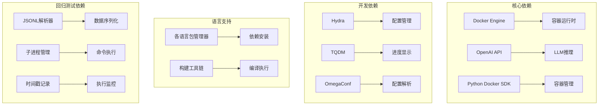

**图表来源**
- [requirements.txt:1-4](file://requirements.txt#L1-L4)
- [Multi-Docker-Eval/evaluation/conf/config.yaml:1-13](file://Multi-Docker-Eval/evaluation/conf/config.yaml#L1-L13)
- [run_verified_regression.py:1-15](file://run_verified_regression.py#L1-L15)

### 内部模块耦合

系统内部模块之间保持了良好的解耦设计：

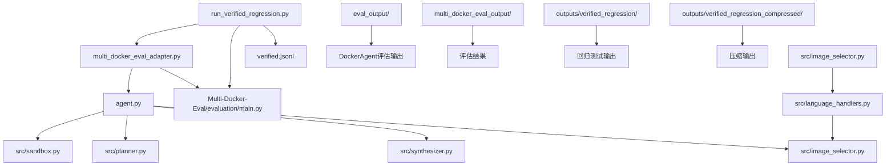

**图表来源**
- [agent.py:18-138](file://agent.py#L18-L138)
- [multi_docker_eval_adapter.py:34-44](file://multi_docker_eval_adapter.py#L34-L44)
- [run_verified_regression.py:211-390](file://run_verified_regression.py#L211-L390)

**章节来源**
- [requirements.txt:1-4](file://requirements.txt#L1-L4)
- [agent.py:18-138](file://agent.py#L18-L138)

## 性能考虑

### 并行执行优化

评估框架采用了多线程并行执行策略，通过合理的资源配置实现高效的批量处理：

- **最大工作线程数**：默认16个线程，可根据CPU核心数调整
- **容器生命周期管理**：及时清理不再使用的容器和镜像
- **内存使用优化**：限制单个任务的内存使用，避免OOM

### 缓存策略

系统实现了多层次的缓存机制：

- **镜像缓存**：避免重复拉取相同的Docker镜像
- **快照缓存**：复用成功的环境状态
- **结果缓存**：缓存已完成的任务结果

### 资源管理

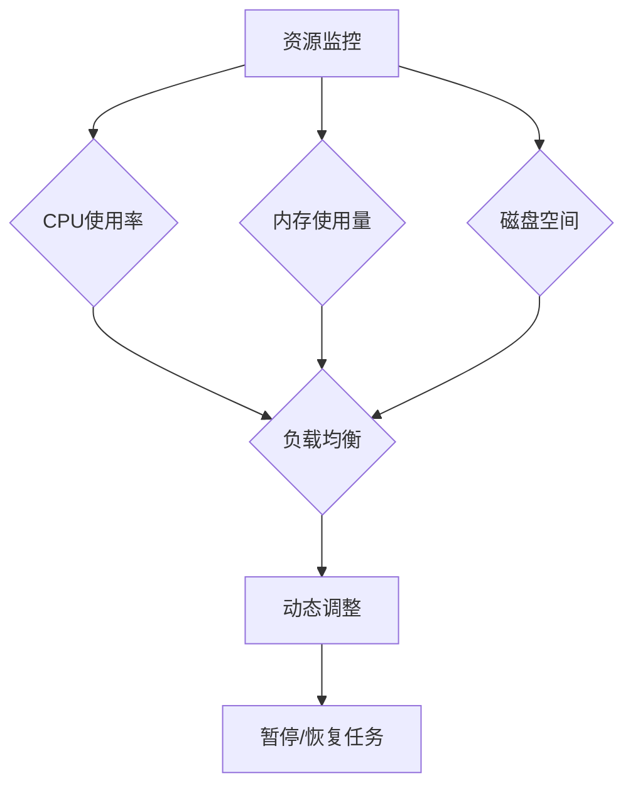

### 回归测试性能优化

回归测试框架在性能方面进行了专门优化：

- **单实例隔离**：避免实例间的资源竞争
- **增量处理**：只处理指定数量的实例
- **并行适配器执行**：利用多核CPU加速适配器处理
- **智能状态跳过**：跳过无法评估的实例
- **压缩输出**：减少存储空间占用

**章节来源**
- [eval_output/DockerAgent/image_sizes.json:1-15](file://eval_output/DockerAgent/image_sizes.json#L1-L15)
- [outputs/verified_regression_compressed/20260320_130140/summary.json:1-61](file://outputs/verified_regression_compressed/20260320_130140/summary.json#L1-L61)

## 故障排除指南

### 常见问题诊断

#### Docker相关问题

| 问题症状 | 可能原因 | 解决方案 |
|---------|---------|---------|
| Docker连接失败 | Docker守护进程未运行 | 启动Docker服务 |
| 权限不足 | 用户不在docker组 | 添加用户到docker组 |
| 镜像拉取失败 | 网络连接问题 | 检查网络设置 |
| 磁盘空间不足 | 缓存镜像过多 | 清理Docker缓存 |

#### LLM相关问题

| 问题症状 | 可能原因 | 解决方案 |
|---------|---------|---------|
| API密钥错误 | OPENAI_API_KEY未设置 | 检查.env文件配置 |
| 请求频率过高 | 超过API限制 | 降低并发或增加延迟 |
| 模型响应异常 | 网络中断 | 检查网络连接 |

#### 评估框架问题

| 问题症状 | 可能原因 | 解决方案 |
|---------|---------|---------|
| 评估结果异常 | 数据格式错误 | 检查输入数据格式 |
| 性能瓶颈 | 并发度过高 | 调整max_workers参数 |
| 内存泄漏 | 镜像清理失败 | 手动清理Docker资源 |

#### 回归测试框架问题

| 问题症状 | 可能原因 | 解决方案 |
|---------|---------|---------|
| 数据集加载失败 | JSONL格式错误 | 检查数据集文件格式 |
| 适配器执行失败 | Python路径错误 | 检查--python参数 |
| 输出目录权限不足 | 文件系统权限问题 | 检查输出目录权限 |
| 实例处理超时 | 网络或资源限制 | 增加max-steps或调整资源 |

#### 评估输出问题

| 问题症状 | 可能原因 | 解决方案 |
|---------|---------|---------|
| 报告文件缺失 | 评估执行失败 | 检查评估框架日志 |
| 日志文件损坏 | 存储空间不足 | 清理磁盘空间 |
| 统计信息不准确 | 数据处理错误 | 重新运行评估 |
| 输出目录权限不足 | 文件系统权限问题 | 检查输出目录权限 |

**章节来源**
- [verify_multi_docker_eval.sh:14-37](file://verify_multi_docker_eval.sh#L14-L37)
- [Multi-Docker-Eval/evaluation/main.py:34-48](file://Multi-Docker-Eval/evaluation/main.py#L34-L48)
- [run_verified_regression.py:211-390](file://run_verified_regression.py#L211-L390)

### 调试工具

系统提供了多种调试工具来帮助问题诊断：

- **详细日志记录**：每个步骤都有详细的日志输出
- **容器状态检查**：可以检查容器的实时状态
- **资源使用监控**：监控CPU、内存和磁盘使用情况
- **错误堆栈跟踪**：提供完整的错误信息和解决方案
- **回归测试日志**：详细的JSON日志记录每个实例的执行过程
- **评估输出分析**：提供完整的评估结果和统计信息

## 结论

增强评估框架代表了LLM驱动的软件工程自动化领域的最新进展。通过智能的基础镜像选择、严格的测试验证、全面的评估指标和新增的系统化回归测试框架，该框架为评估AI代理在复杂软件环境配置方面的能力提供了可靠的标准。

### 技术优势

1. **智能化程度高**：基于LLM的仓库分析和语言检测
2. **执行效率优秀**：多线程并行执行和智能缓存策略
3. **评估全面准确**：涵盖构建、测试和稳定性等多个维度
4. **扩展性强**：模块化设计支持新语言和新功能的添加
5. **回归测试完善**：提供系统化的验证实例测试和详细JSON日志记录
6. **输出体系完整**：提供详细的评估报告和测试覆盖率分析
7. **存储优化**：支持压缩输出目录，提高存储效率

### 应用前景

该框架不仅适用于学术研究，也具有重要的工业应用价值：

- **软件工程教育**：为学生提供实践性的学习平台
- **质量保证**：帮助企业自动化环境配置流程
- **持续集成**：为CI/CD系统提供智能的环境准备能力
- **DevOps自动化**：推动DevOps流程的智能化升级
- **回归测试自动化**：为企业提供系统化的回归测试解决方案
- **多语言项目评估**：为不同编程语言的项目提供统一的评估标准

### 新增功能价值

回归测试框架和评估输出体系的引入显著提升了框架的应用价值：

- **精确控制**：每个实例独立处理，便于精确控制和调试
- **详细追踪**：完整的JSON日志记录，便于问题诊断和性能分析
- **状态分类**：智能的状态计算，准确标识执行结果
- **批量处理**：支持大规模实例的并行处理和结果汇总
- **压缩存储**：高效的存储方案，减少磁盘空间占用
- **多维度评估**：提供详细的测试覆盖率和稳定性分析
- **完整报告**：生成全面的评估报告，包含统计数据和分析结果

通过持续的技术改进和功能扩展，增强评估框架有望成为LLM在软件工程领域应用的重要基准和工具，特别是在回归测试、系统化验证和多语言项目评估方面发挥重要作用。新增的评估输出体系和压缩存储功能进一步增强了框架的实用性和可维护性，为未来的扩展和优化奠定了坚实的基础。