# 增强评估框架

<cite>
**本文档引用的文件**
- [README.md](file://README.md)
- [Multi-Docker-Eval/README.md](file://Multi-Docker-Eval/README.md)
- [agent.py](file://agent.py)
- [multi_docker_eval_adapter.py](file://multi_docker_eval_adapter.py)
- [Multi-Docker-Eval/evaluation/main.py](file://Multi-Docker-Eval/evaluation/main.py)
- [Multi-Docker-Eval/evaluation/test_spec.py](file://Multi-Docker-Eval/evaluation/test_spec.py)
- [Multi-Docker-Eval/evaluation/docker_build.py](file://Multi-Docker-Eval/evaluation/docker_build.py)
- [Multi-Docker-Eval/evaluation/docker_utils.py](file://Multi-Docker-Eval/evaluation/docker_utils.py)
- [Multi-Docker-Eval/evaluation/conf/config.yaml](file://Multi-Docker-Eval/evaluation/conf/config.yaml)
- [src/sandbox.py](file://src/sandbox.py)
- [src/planner.py](file://src/planner.py)
- [src/synthesizer.py](file://src/synthesizer.py)
- [src/language_handlers.py](file://src/language_handlers.py)
- [src/image_selector.py](file://src/image_selector.py)
- [requirements.txt](file://requirements.txt)
- [verify_multi_docker_eval.sh](file://verify_multi_docker_eval.sh)
</cite>

## 目录
1. [简介](#简介)
2. [项目结构](#项目结构)
3. [核心组件](#核心组件)
4. [架构概览](#架构概览)
5. [详细组件分析](#详细组件分析)
6. [依赖关系分析](#依赖关系分析)
7. [性能考虑](#性能考虑)
8. [故障排除指南](#故障排除指南)
9. [结论](#结论)

## 简介

增强评估框架是一个综合性的多语言、多维度基准测试系统，专门设计用于评估大型语言模型（LLM）代理在自动化构建可执行Docker环境方面的智能水平。该框架结合了先进的代码分析技术、智能的基础镜像选择算法和严格的测试评估流程。

### 主要特性

- **多语言支持**：涵盖Python、JavaScript、Java、Go、Rust等多种主流编程语言
- **真实世界仓库**：基于实际GitHub仓库的真实依赖结构
- **全面评估**：同时测试构建成功和运行时功能
- **框架兼容性**：与SWE-Builder和RepoLaunch框架兼容
- **智能镜像选择**：基于LLM的仓库分析和语言检测

## 项目结构

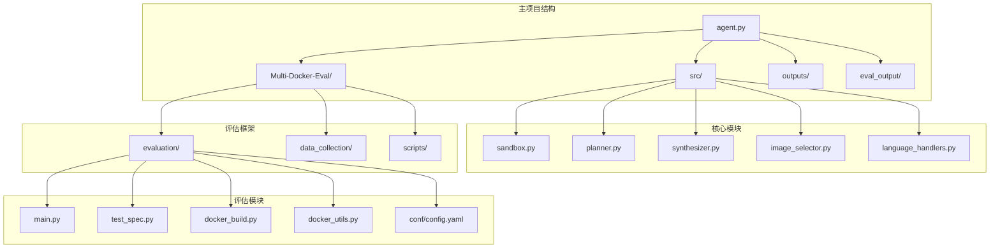

**图表来源**
- [agent.py:1-50](file://agent.py#L1-L50)
- [Multi-Docker-Eval/README.md:35-41](file://Multi-Docker-Eval/README.md#L35-L41)

**章节来源**
- [README.md:1-71](file://README.md#L1-L71)
- [Multi-Docker-Eval/README.md:33-41](file://Multi-Docker-Eval/README.md#L33-L41)

## 核心组件

### DockerAgent 核心代理

DockerAgent是整个系统的核心组件，采用ReAct（思考-行动-观察）模式进行环境配置。它集成了智能的基础镜像选择、计划执行和结果合成功能。

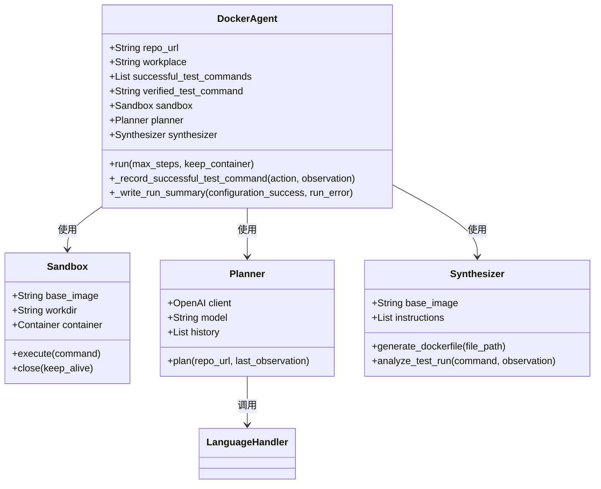

**图表来源**
- [agent.py:18-138](file://agent.py#L18-L138)
- [src/sandbox.py:8-331](file://src/sandbox.py#L8-L331)
- [src/planner.py:6-244](file://src/planner.py#L6-L244)
- [src/synthesizer.py:4-499](file://src/synthesizer.py#L4-L499)

### Multi-Docker-Eval 适配器

MultiDockerEvalAdapter负责将DockerAgent的输出转换为Multi-Docker-Eval评估框架所需的格式，实现了两个系统之间的无缝集成。

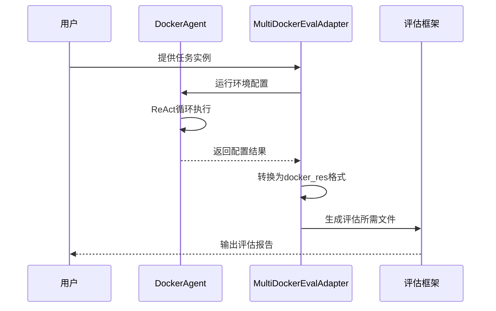

**图表来源**
- [multi_docker_eval_adapter.py:45-295](file://multi_docker_eval_adapter.py#L45-L295)
- [agent.py:285-361](file://agent.py#L285-L361)

**章节来源**
- [agent.py:18-433](file://agent.py#L18-L433)
- [multi_docker_eval_adapter.py:37-1008](file://multi_docker_eval_adapter.py#L37-L1008)

## 架构概览

增强评估框架采用了分层架构设计，将智能决策、环境配置和评估执行分离，形成了高度模块化的系统结构。

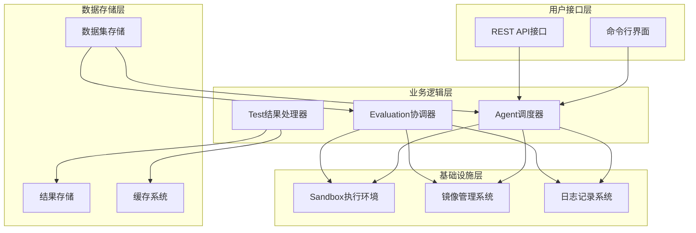

**图表来源**
- [Multi-Docker-Eval/evaluation/main.py:538-577](file://Multi-Docker-Eval/evaluation/main.py#L538-L577)
- [agent.py:285-361](file://agent.py#L285-L361)

### 数据流架构

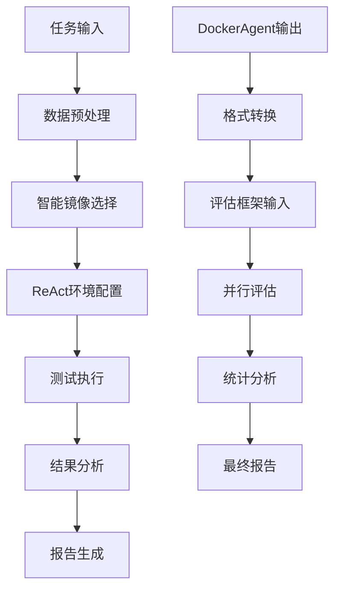

**图表来源**
- [multi_docker_eval_adapter.py:45-295](file://multi_docker_eval_adapter.py#L45-L295)
- [Multi-Docker-Eval/evaluation/main.py:328-396](file://Multi-Docker-Eval/evaluation/main.py#L328-L396)

## 详细组件分析

### 智能镜像选择系统

ImageSelector组件是整个系统的技术亮点，它能够智能分析仓库结构并选择最适合的基础镜像。

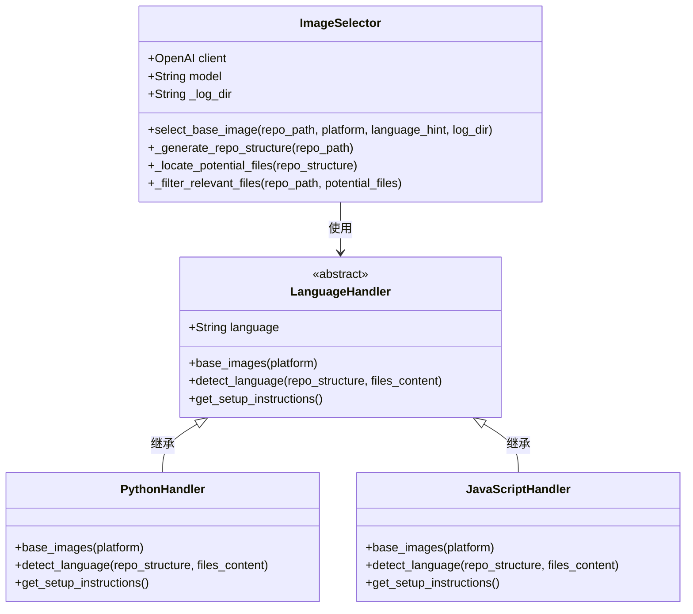

**图表来源**
- [src/image_selector.py:149-322](file://src/image_selector.py#L149-L322)
- [src/language_handlers.py:9-714](file://src/language_handlers.py#L9-L714)

#### 语言检测机制

系统支持20多种编程语言的智能检测，每种语言都有专门的检测规则和处理策略：

| 语言类别 | 支持的语言 | 检测特征 |
|---------|-----------|----------|
| 动态语言 | Python, Ruby, PHP, JavaScript | 配置文件、版本文件、包管理器 |
| 系统语言 | C, C++, Go, Rust | 构建文件、编译器工具链 |
| JVM生态 | Java, Kotlin, Scala | 构建工具、包管理器 |
| 其他 | Swift, Dart, R等 | 特定的SDK和工具链 |

**章节来源**
- [src/image_selector.py:249-322](file://src/image_selector.py#L249-L322)
- [src/language_handlers.py:43-714](file://src/language_handlers.py#L43-L714)

### ReAct执行引擎

Planner组件实现了ReAct（思维-行动-观察）模式，这是系统智能决策的核心机制。

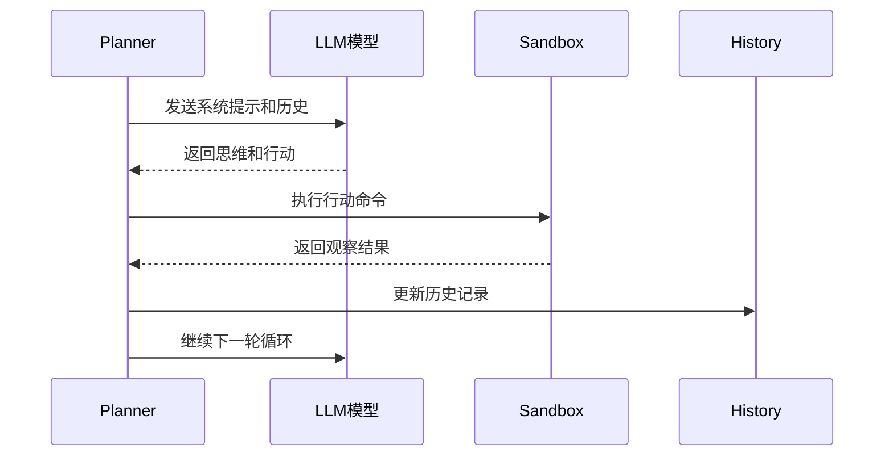

**图表来源**
- [src/planner.py:109-161](file://src/planner.py#L109-L161)

#### 测试验证规则

系统实施了严格的测试验证规则，确保只有完全通过的测试才能标记为成功：

- **无借口规则**：任何测试失败都不能标记为成功
- **部分通过规则**：即使只有一个测试失败也不算成功
- **观察注入规则**：自动检测测试失败并在观察中注入警告
- **回滚机制**：失败的命令会自动回滚到上一个成功状态

**章节来源**
- [src/planner.py:75-107](file://src/planner.py#L75-L107)
- [src/sandbox.py:259-297](file://src/sandbox.py#L259-L297)

### Sandbox执行环境

Sandbox提供了安全的容器执行环境，支持命令超时控制和自动回滚功能。

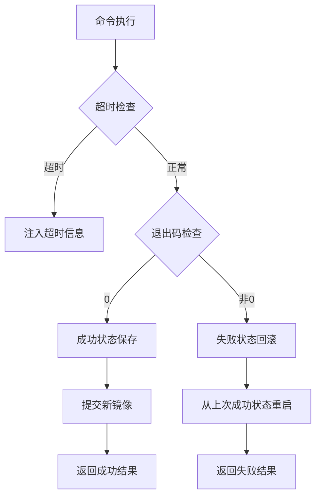

**图表来源**
- [src/sandbox.py:81-152](file://src/sandbox.py#L81-L152)

#### 容器管理策略

- **基线快照**：初始化容器时创建基线快照
- **增量提交**：只对有副作用的命令进行提交
- **内存管理**：自动清理不再使用的快照镜像
- **平台兼容**：支持跨平台构建（linux/amd64）

**章节来源**
- [src/sandbox.py:31-60](file://src/sandbox.py#L31-L60)
- [src/sandbox.py:154-167](file://src/sandbox.py#L154-L167)

### 评估框架核心

Multi-Docker-Eval评估框架提供了完整的评估流水线，包括并行执行、稳定性测试和结果汇总。

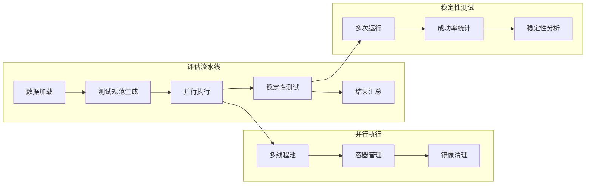

**图表来源**
- [Multi-Docker-Eval/evaluation/main.py:328-396](file://Multi-Docker-Eval/evaluation/main.py#L328-L396)

#### 评估指标体系

评估框架定义了多个关键指标来衡量代理的表现：

| 指标类型 | 指标名称 | 定义 | 重要性 |
|---------|---------|------|--------|
| 基础指标 | 总实例数 | 参与评估的实例总数 | 高 |
| 成功率指标 | 失败前通过率 | 在应用补丁前失败但在应用后通过的比例 | 高 |
| 稳定性指标 | 解决稳定性 | 多次运行都表现出相同模式的比例 | 中 |
| 效果指标 | 成功补丁检测 | 能够检测并修复问题的能力 | 高 |

**章节来源**
- [Multi-Docker-Eval/evaluation/main.py:398-449](file://Multi-Docker-Eval/evaluation/main.py#L398-L449)

## 依赖关系分析

### 外部依赖

系统依赖于多个关键的外部服务和工具：

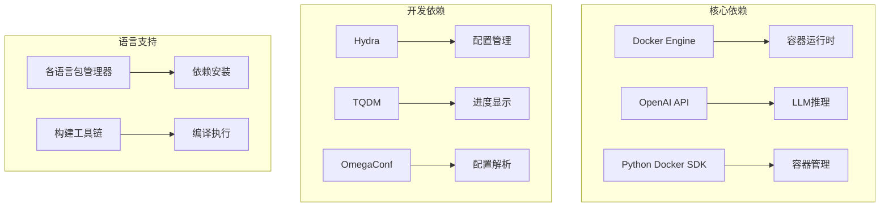

**图表来源**
- [requirements.txt:1-4](file://requirements.txt#L1-L4)
- [Multi-Docker-Eval/evaluation/conf/config.yaml:1-13](file://Multi-Docker-Eval/evaluation/conf/config.yaml#L1-L13)

### 内部模块耦合

系统内部模块之间保持了良好的解耦设计：

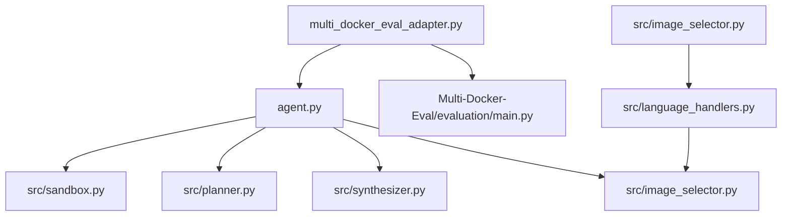

**图表来源**
- [agent.py:18-138](file://agent.py#L18-L138)
- [multi_docker_eval_adapter.py:34-44](file://multi_docker_eval_adapter.py#L34-L44)

**章节来源**
- [requirements.txt:1-4](file://requirements.txt#L1-L4)
- [agent.py:18-138](file://agent.py#L18-L138)

## 性能考虑

### 并行执行优化

评估框架采用了多线程并行执行策略，通过合理的资源配置实现高效的批量处理：

- **最大工作线程数**：默认16个线程，可根据CPU核心数调整
- **容器生命周期管理**：及时清理不再使用的容器和镜像
- **内存使用优化**：限制单个任务的内存使用，避免OOM

### 缓存策略

系统实现了多层次的缓存机制：

- **镜像缓存**：避免重复拉取相同的Docker镜像
- **快照缓存**：复用成功的环境状态
- **结果缓存**：缓存已完成的任务结果

### 资源管理

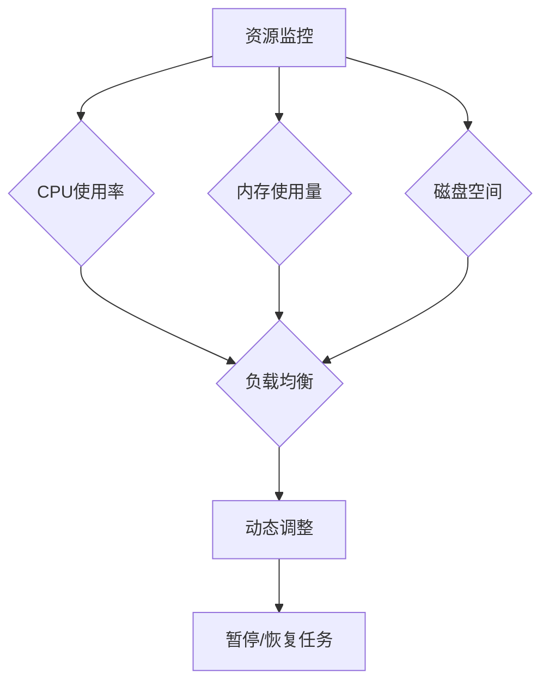

## 故障排除指南

### 常见问题诊断

#### Docker相关问题

| 问题症状 | 可能原因 | 解决方案 |
|---------|---------|---------|
| Docker连接失败 | Docker守护进程未运行 | 启动Docker服务 |
| 权限不足 | 用户不在docker组 | 添加用户到docker组 |
| 镜像拉取失败 | 网络连接问题 | 检查网络设置 |
| 磁盘空间不足 | 缓存镜像过多 | 清理Docker缓存 |

#### LLM相关问题

| 问题症状 | 可能原因 | 解决方案 |
|---------|---------|---------|
| API密钥错误 | OPENAI_API_KEY未设置 | 检查.env文件配置 |
| 请求频率过高 | 超过API限制 | 降低并发或增加延迟 |
| 模型响应异常 | 网络中断 | 检查网络连接 |

#### 评估框架问题

| 问题症状 | 可能原因 | 解决方案 |
|---------|---------|---------|
| 评估结果异常 | 数据格式错误 | 检查输入数据格式 |
| 性能瓶颈 | 并发度过高 | 调整max_workers参数 |
| 内存泄漏 | 镜像清理失败 | 手动清理Docker资源 |

**章节来源**
- [verify_multi_docker_eval.sh:14-37](file://verify_multi_docker_eval.sh#L14-L37)
- [Multi-Docker-Eval/evaluation/main.py:34-48](file://Multi-Docker-Eval/evaluation/main.py#L34-L48)

### 调试工具

系统提供了多种调试工具来帮助问题诊断：

- **详细日志记录**：每个步骤都有详细的日志输出
- **容器状态检查**：可以检查容器的实时状态
- **资源使用监控**：监控CPU、内存和磁盘使用情况
- **错误堆栈跟踪**：提供完整的错误信息和解决方案

## 结论

增强评估框架代表了LLM驱动的软件工程自动化领域的最新进展。通过智能的基础镜像选择、严格的测试验证和全面的评估指标，该框架为评估AI代理在复杂软件环境配置方面的能力提供了可靠的标准。

### 技术优势

1. **智能化程度高**：基于LLM的仓库分析和语言检测
2. **执行效率优秀**：多线程并行执行和智能缓存策略
3. **评估全面准确**：涵盖构建、测试和稳定性等多个维度
4. **扩展性强**：模块化设计支持新语言和新功能的添加

### 应用前景

该框架不仅适用于学术研究，也具有重要的工业应用价值：

- **软件工程教育**：为学生提供实践性的学习平台
- **质量保证**：帮助企业自动化环境配置流程
- **持续集成**：为CI/CD系统提供智能的环境准备能力
- **DevOps自动化**：推动DevOps流程的智能化升级

通过持续的技术改进和功能扩展，增强评估框架有望成为LLM在软件工程领域应用的重要基准和工具。