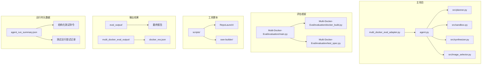
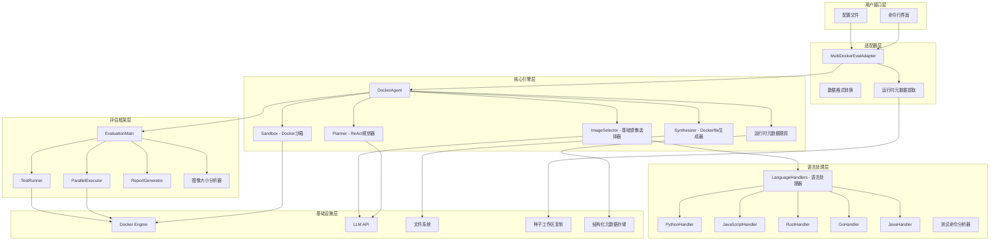
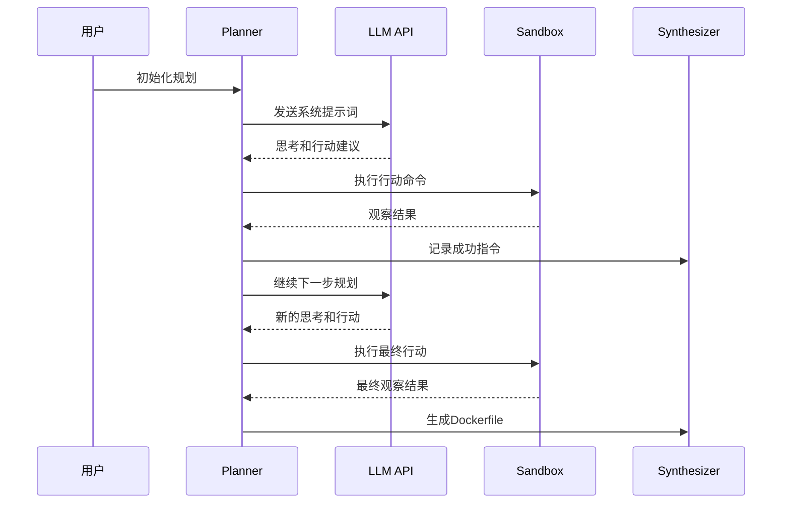
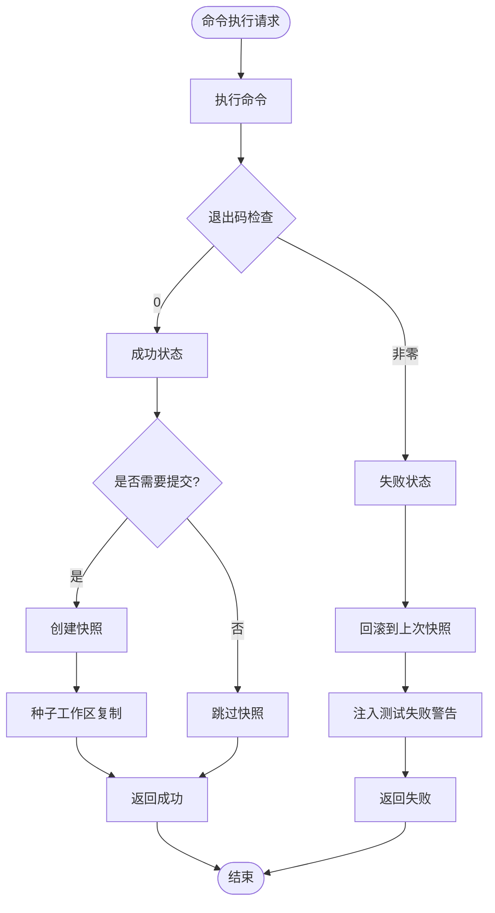
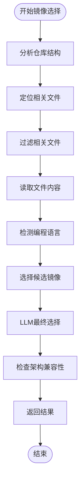
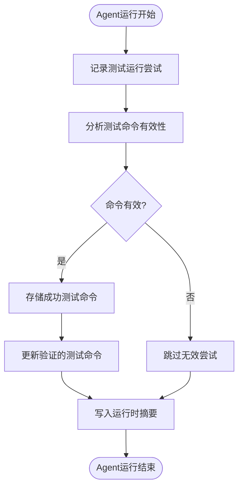
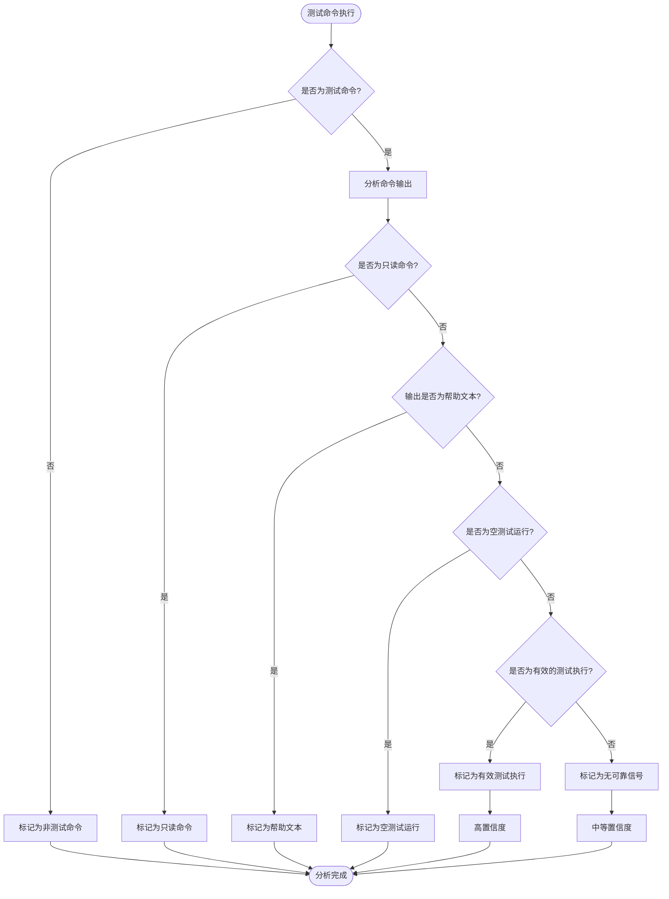
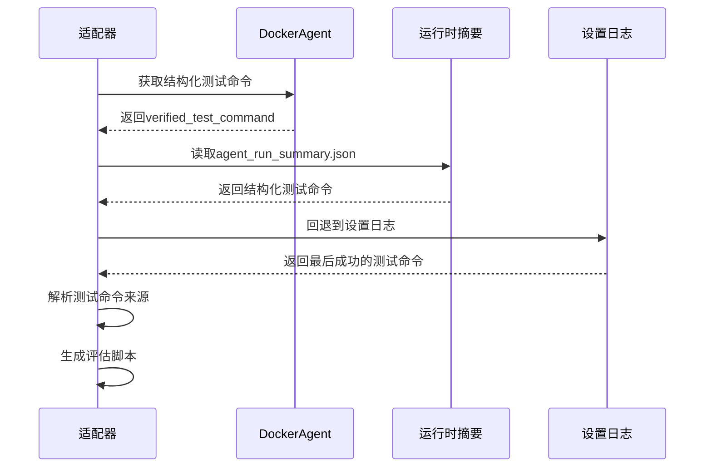
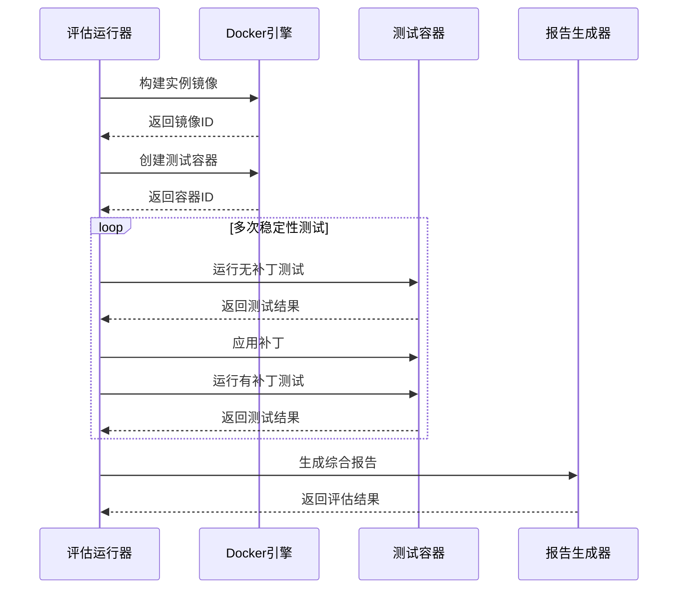
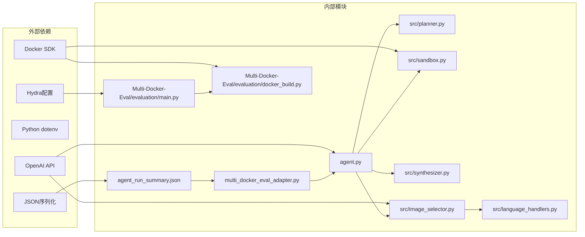

# 多Docker评估系统

<cite>
**本文档引用的文件**
- [README.md](file://README.md)
- [Multi-Docker-Eval/README.md](file://Multi-Docker-Eval/README.md)
- [doc/MULTI_DOCKER_EVAL.md](file://doc/MULTI_DOCKER_EVAL.md)
- [agent.py](file://agent.py)
- [multi_docker_eval_adapter.py](file://multi_docker_eval_adapter.py)
- [src/planner.py](file://src/planner.py)
- [src/sandbox.py](file://src/sandbox.py)
- [src/synthesizer.py](file://src/synthesizer.py)
- [src/image_selector.py](file://src/image_selector.py)
- [src/language_handlers.py](file://src/language_handlers.py)
- [requirements.txt](file://requirements.txt)
- [Multi-Docker-Eval/evaluation/main.py](file://Multi-Docker-Eval/evaluation/main.py)
- [Multi-Docker-Eval/evaluation/docker_build.py](file://Multi-Docker-Eval/evaluation/docker_build.py)
</cite>

## 更新摘要
**变更内容**
- 新增工作区种子复制机制，支持从主机工作区直接复制到容器
- 新增运行时元数据跟踪系统，生成结构化的agent_run_summary.json文件
- 新增结构化测试命令分析和验证功能
- 增强测试命令解析能力，支持更精确的测试执行控制
- 改进适配器系统，支持从运行时元数据中提取测试命令

## 目录
1. [简介](#简介)
2. [项目结构](#项目结构)
3. [核心组件](#核心组件)
4. [架构概览](#架构概览)
5. [详细组件分析](#详细组件分析)
6. [依赖关系分析](#依赖关系分析)
7. [性能考虑](#性能考虑)
8. [故障排除指南](#故障排除指南)
9. [结论](#结论)

## 简介

多Docker评估系统是一个综合性、多语言、多维度的基准测试框架，专门设计用于严格评估大型语言模型（LLM）代理在自动化生成可执行Docker环境方面的智能水平。该系统针对真实世界软件仓库的复杂依赖结构，提供全面的评估能力，包括构建成功率和运行时功能测试。

系统的核心目标是评估LLM代理在以下方面的能力：
- 自动化生成Docker配置文件
- 成功构建和运行复杂软件项目
- 跨多种编程语言的支持（Python、JavaScript、Java、Go、Rust等）
- 处理真实的GitHub仓库依赖关系
- **新增**：结构化测试命令分析和验证
- **新增**：工作区种子复制机制
- **新增**：运行时元数据跟踪系统

## 项目结构

该项目采用模块化架构设计，主要包含以下几个核心部分：



**图表来源**
- [agent.py:1-440](file://agent.py#L1-L440)
- [multi_docker_eval_adapter.py:1-837](file://multi_docker_eval_adapter.py#L1-L837)
- [Multi-Docker-Eval/README.md:33-41](file://Multi-Docker-Eval/README.md#L33-L41)

**章节来源**
- [README.md:1-71](file://README.md#L1-L71)
- [Multi-Docker-Eval/README.md:1-97](file://Multi-Docker-Eval/README.md#L1-L97)

## 核心组件

### DockerAgent 主类

DockerAgent是系统的核心组件，负责协调整个Docker环境配置过程。它集成了四个关键子系统：

1. **工作区管理**：自动克隆GitHub仓库到本地工作区
2. **基础镜像选择**：智能分析项目结构选择最优的基础Docker镜像
3. **ReAct规划器**：使用思维-行动-观察循环进行环境配置
4. **沙箱执行**：安全地在Docker容器中执行命令并支持回滚机制
5. **运行时元数据跟踪**：记录测试命令分析结果和配置状态

### 适配器系统

MultiDockerEvalAdapter专门负责将DockerAgent的输出转换为Multi-Docker-Eval评估框架所需的格式。它处理以下关键功能：
- 将Agent生成的配置指令转换为评估框架可用的Dockerfile
- 生成测试脚本并注入测试补丁
- 处理不同语言的测试命令差异
- 生成符合评估框架要求的输出格式
- **新增**：从agent_run_summary.json中提取结构化测试命令
- **新增**：支持测试命令来源追踪和验证

### 评估框架

评估框架提供了完整的测试环境，包括：
- **并行执行**：支持多线程并行测试多个实例
- **稳定性测试**：重复运行测试以确保结果可靠性
- **补丁效果检测**：比较应用补丁前后测试结果的变化
- **详细报告**：生成包含各种指标的综合评估报告
- **图像大小记录**：记录和分析构建的Docker镜像大小

**章节来源**
- [agent.py:18-136](file://agent.py#L18-L136)
- [multi_docker_eval_adapter.py:39-270](file://multi_docker_eval_adapter.py#L39-L270)
- [Multi-Docker-Eval/evaluation/main.py:328-396](file://Multi-Docker-Eval/evaluation/main.py#L328-L396)

## 架构概览

系统采用分层架构设计，从底层的Docker基础设施到顶层的评估报告生成：



**图表来源**
- [agent.py:18-136](file://agent.py#L18-L136)
- [multi_docker_eval_adapter.py:39-270](file://multi_docker_eval_adapter.py#L39-L270)
- [Multi-Docker-Eval/evaluation/main.py:538-577](file://Multi-Docker-Eval/evaluation/main.py#L538-L577)

## 详细组件分析

### ReAct规划器分析

Planner实现了先进的思维-行动-观察循环，这是系统智能决策的核心机制：



**图表来源**
- [src/planner.py:108-157](file://src/planner.py#L108-L157)
- [src/sandbox.py:40-110](file://src/sandbox.py#L40-L110)
- [src/synthesizer.py:9-29](file://src/synthesizer.py#L9-L29)

Planner的关键特性包括：
- **成本计算**：实时跟踪LLM调用成本
- **历史记录**：维护完整的交互历史
- **约束处理**：严格遵守环境限制规则
- **测试验证**：强制要求测试完全通过才能宣告成功

**章节来源**
- [src/planner.py:1-232](file://src/planner.py#L1-L232)

### Docker沙箱执行系统

Sandbox提供了安全的命令执行环境，支持自动回滚机制：



**图表来源**
- [src/sandbox.py:40-110](file://src/sandbox.py#L40-L110)

Sandbox的核心功能：
- **自动回滚**：失败时自动恢复到上一个成功状态
- **快照管理**：智能管理环境快照，避免镜像堆积
- **测试检测**：自动检测测试失败并注入强制警告
- **平台兼容**：支持不同架构的Docker平台
- **种子工作区复制**：支持从主机工作区复制到容器中

**章节来源**
- [src/sandbox.py:1-263](file://src/sandbox.py#L1-L263)

### 基础镜像选择器

ImageSelector采用多阶段分析策略，确保选择最适合的基础镜像：



**图表来源**
- [src/image_selector.py:247-320](file://src/image_selector.py#L247-L320)

语言处理器系统支持多种编程语言：

| 语言 | 基础镜像范围 | 特定处理 |
|------|-------------|----------|
| Python | python:3.6-3.14 | pip安装、可编辑安装 |
| JavaScript | node:18-25 | npm/yarn/pnpm包管理 |
| Rust | rust:1.70-1.90 | cargo构建系统 |
| Go | golang:1.19-1.25 | go mod依赖管理 |
| Java | eclipse-temurin:11/17/21 | Maven/Gradle构建 |

**章节来源**
- [src/image_selector.py:1-565](file://src/image_selector.py#L1-L565)
- [src/language_handlers.py:1-714](file://src/language_handlers.py#L1-L714)

### 运行时元数据跟踪系统

**新增** DockerAgent现在生成结构化的运行时元数据，存储在agent_run_summary.json文件中：



**图表来源**
- [agent.py:369-405](file://agent.py#L369-L405)

运行时元数据包含以下关键信息：
- **verified_test_command**：经过验证的测试命令
- **successful_test_commands**：所有成功的测试命令列表
- **test_run_attempts**：详细的测试运行尝试记录
- **configuration_success**：配置是否成功完成
- **error**：运行过程中遇到的错误信息

**章节来源**
- [agent.py:369-405](file://agent.py#L369-L405)

### 结构化测试命令分析器

**新增** Synthesizer现在具备高级的测试命令分析能力：



**图表来源**
- [src/synthesizer.py:93-132](file://src/synthesizer.py#L93-L132)

测试命令分析器的关键功能：
- **测试命令识别**：准确识别各种语言的测试命令
- **有效测试执行检测**：区分真正的测试执行和无效操作
- **置信度评估**：为分析结果提供置信度评分
- **原因记录**：详细记录分析过程和判断依据

**章节来源**
- [src/synthesizer.py:93-132](file://src/synthesizer.py#L93-L132)

### 适配器系统增强

**新增** MultiDockerEvalAdapter现在支持从运行时元数据中提取测试命令：



**图表来源**
- [multi_docker_eval_adapter.py:418-450](file://multi_docker_eval_adapter.py#L418-L450)

适配器增强功能：
- **结构化测试命令提取**：优先从agent_run_summary.json提取测试命令
- **测试命令来源追踪**：记录测试命令的来源（运行时、设置日志、语言默认）
- **智能回退机制**：当结构化数据不可用时，自动回退到传统方法
- **测试命令路径调整**：自动调整命令中的工作目录路径

**章节来源**
- [multi_docker_eval_adapter.py:418-450](file://multi_docker_eval_adapter.py#L418-L450)

### 评估框架组件

评估框架提供了完整的测试执行和报告生成功能：



**图表来源**
- [Multi-Docker-Eval/evaluation/main.py:264-326](file://Multi-Docker-Eval/evaluation/main.py#L264-L326)
- [Multi-Docker-Eval/evaluation/docker_build.py:202-236](file://Multi-Docker-Eval/evaluation/docker_build.py#L202-L236)

评估指标包括：
- **F2P (Fail-to-Pass)**: 测试从失败到通过的成功率
- **Build Success Rate**: Docker镜像构建成功率
- **Commit Rate**: 平均每个任务的commit次数
- **Time Efficiency**: 平均完成时间
- **图像大小分析**：记录和分析构建的Docker镜像大小

**章节来源**
- [Multi-Docker-Eval/evaluation/main.py:398-496](file://Multi-Docker-Eval/evaluation/main.py#L398-L496)

## 依赖关系分析

系统采用松耦合的设计，各组件间通过清晰的接口进行通信：



**图表来源**
- [requirements.txt:1-4](file://requirements.txt#L1-L4)
- [agent.py:1-12](file://agent.py#L1-L12)
- [multi_docker_eval_adapter.py:27-36](file://multi_docker_eval_adapter.py#L27-L36)

主要依赖关系：
- **Docker SDK**：提供容器管理和镜像构建功能
- **OpenAI API**：提供LLM推理能力
- **Python dotenv**：管理环境变量配置
- **Hydra**：提供配置管理功能
- **JSON序列化**：支持运行时元数据的持久化存储

**章节来源**
- [requirements.txt:1-4](file://requirements.txt#L1-L4)

## 性能考虑

系统在设计时充分考虑了性能优化：

### 并行处理
- **多线程执行**：评估框架支持多实例并行测试
- **智能缓存**：避免重复构建相同的Docker镜像
- **资源管理**：自动清理未使用的容器和镜像

### 内存优化
- **增量构建**：只在必要时创建环境快照
- **文件大小限制**：避免处理过大的文件内容
- **内存映射**：使用流式处理大文件
- **种子工作区复制**：优化工作区同步性能

### 网络优化
- **LLM调用优化**：智能计算成本，避免不必要的API调用
- **缓存策略**：缓存常用的文件内容和分析结果
- **元数据持久化**：减少重复解析和分析的开销

### 存储优化
- **结构化元数据**：避免复杂的日志解析
- **智能回退机制**：在元数据缺失时自动回退到传统方法
- **增量更新**：只更新必要的元数据字段

## 故障排除指南

### 常见问题及解决方案

**Docker连接失败**
```
错误: Cannot connect to the Docker daemon
解决: 启动Docker Desktop或Docker Engine
```

**API密钥配置错误**
```
错误: OPENAI_API_KEY not found
解决: 检查.env文件配置
```

**容器构建超时**
```
错误: Command failed (exit 124). Rolling back...
解决: 增加--max-steps参数或检查仓库依赖
```

**架构兼容性问题**
```
错误: ARM64架构不兼容
解决: 使用linux/amd64平台或选择兼容的基础镜像
```

**运行时元数据读取失败**
```
错误: Failed to read agent_run_summary.json
解决: 检查agent.py是否正常生成元数据文件
```

**测试命令提取失败**
```
错误: No structured or legacy test command found
解决: 检查设置日志中是否包含测试命令
```

### 调试技巧

1. **查看详细日志**：检查workplace目录中的日志文件
2. **检查容器状态**：使用docker ps查看容器运行状态
3. **验证Dockerfile**：手动测试生成的Dockerfile
4. **监控资源使用**：关注CPU和内存使用情况
5. **检查运行时元数据**：验证agent_run_summary.json文件内容
6. **调试测试命令分析**：查看Synthesizer的测试命令分析结果

**章节来源**
- [doc/MULTI_DOCKER_EVAL.md:319-372](file://doc/MULTI_DOCKER_EVAL.md#L319-L372)

## 结论

多Docker评估系统代表了自动化环境配置领域的最新进展。通过集成先进的LLM技术和严格的评估框架，该系统能够有效评估AI代理在复杂软件工程任务中的能力。

**主要改进包括**：
- **工作区种子复制**：通过seed_dir参数实现从主机工作区到容器的高效复制
- **运行时元数据跟踪**：生成结构化的agent_run_summary.json文件，包含详细的测试命令分析结果
- **结构化测试命令解析**：提供精确的测试命令识别和验证能力
- **智能适配器系统**：支持从多种来源提取和解析测试命令
- **增强的评估框架**：提供更全面的测试执行和报告生成功能

系统的主要优势包括：
- **全面的语言支持**：覆盖主流编程语言和开发环境
- **智能基础镜像选择**：基于项目分析自动选择最优环境
- **严格的测试验证**：确保生成的环境能够正确运行
- **可扩展的架构设计**：支持未来功能的扩展和改进
- **结构化的元数据管理**：提供详细的运行时信息追踪

该系统为软件工程自动化领域提供了重要的基准测试工具，有助于推动AI代理在实际开发场景中的应用和发展。