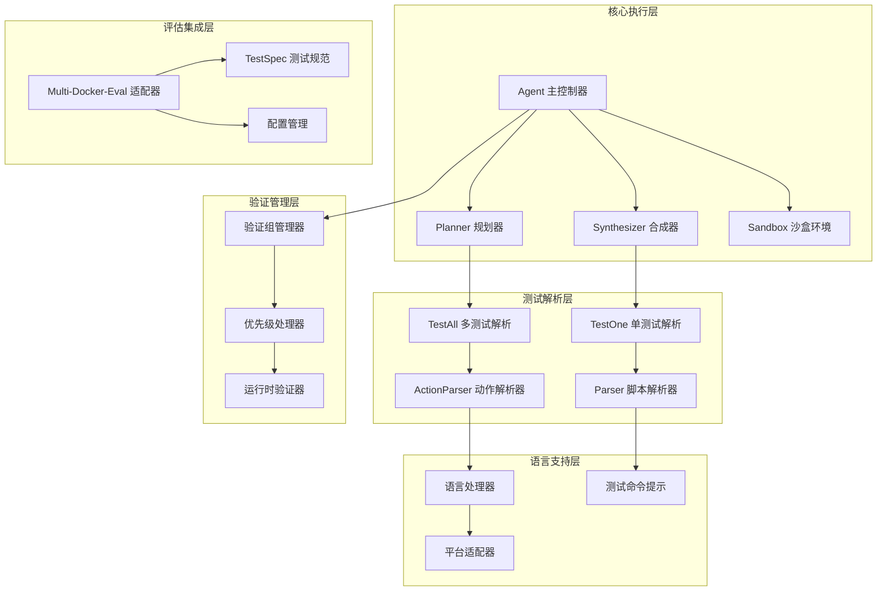
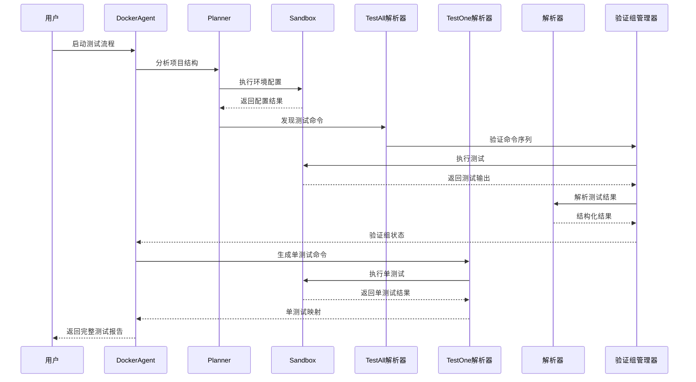
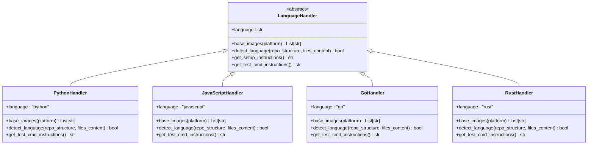
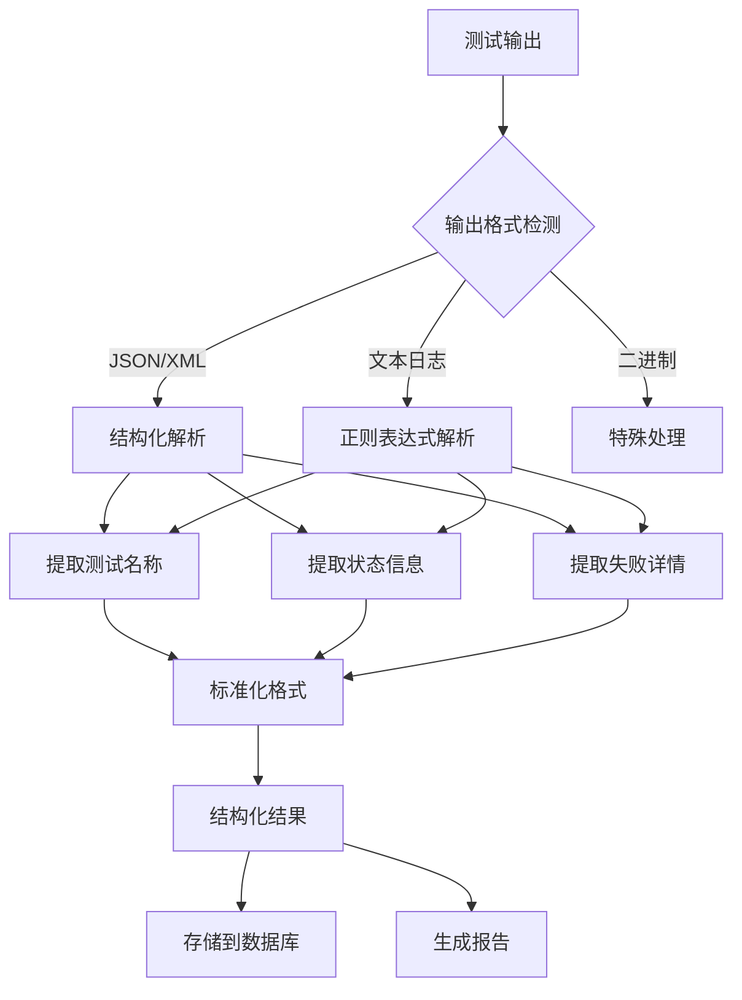
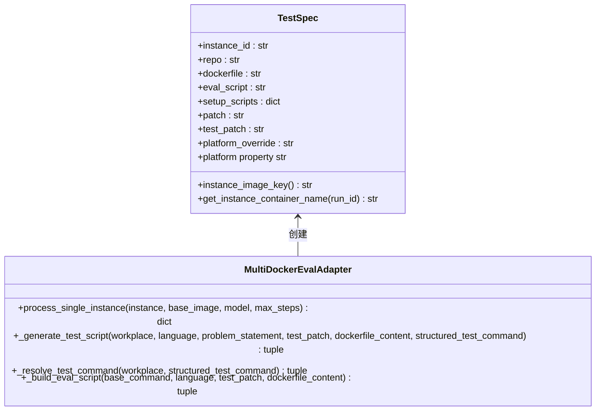
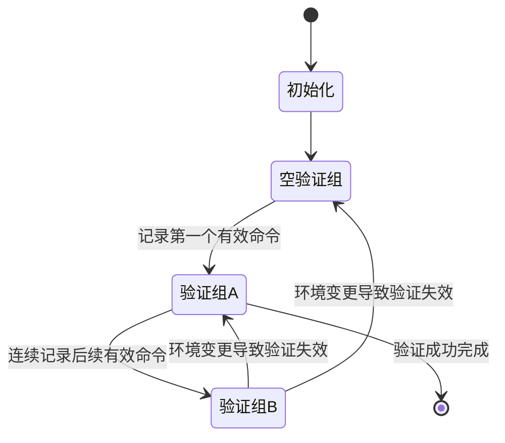
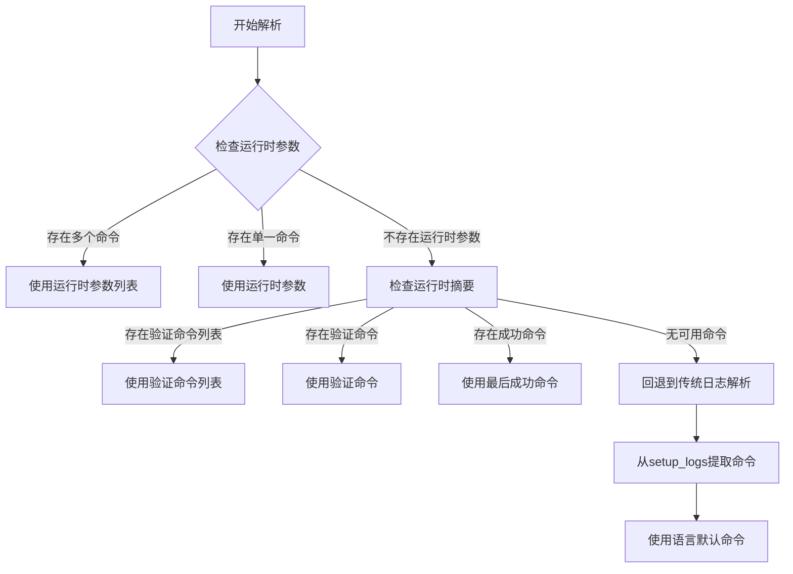
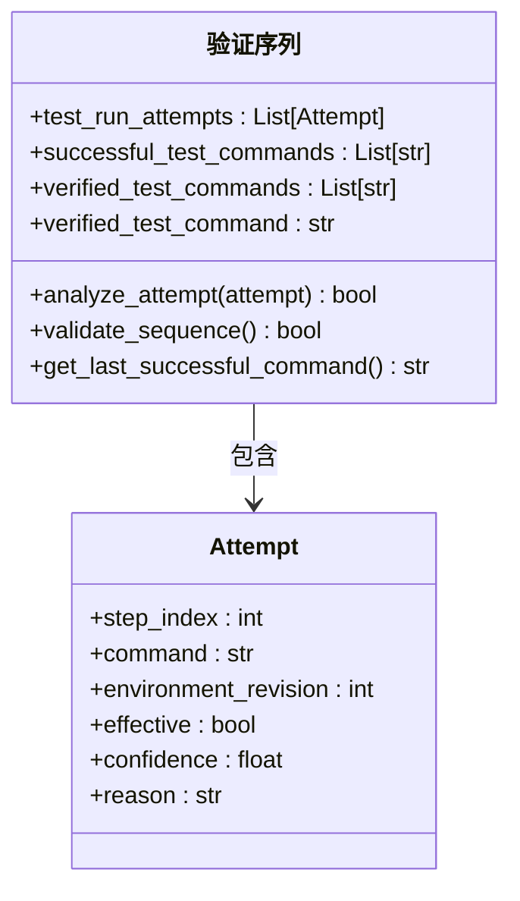
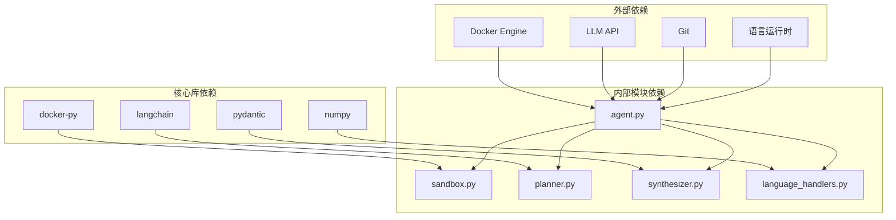

# 结构化测试命令解析

<cite>
**本文档引用的文件**
- [agent.py](file://agent.py)
- [multi_docker_eval_adapter.py](file://multi_docker_eval_adapter.py)
- [test_spec.py](file://Multi-Docker-Eval/evaluation/test_spec.py)
- [parser.py](file://others_work/RepoLaunch/launch/scripts/parser.py)
- [action_parser.py](file://others_work/RepoLaunch/launch/agent/action_parser.py)
- [testall.py](file://others_work/RepoLaunch/launch/agent/organize/testall.py)
- [testone.py](file://others_work/RepoLaunch/launch/agent/organize/testone.py)
- [language_handlers.py](file://src/language_handlers.py)
- [README.md](file://README.md)
- [test_agent_verification.py](file://tests/test_agent_verification.py)
- [test_adapter_logic.py](file://tests/test_adapter_logic.py)
</cite>

## 更新摘要
**变更内容**
- 新增验证组机制和连续验证块管理
- 增强测试命令优先级处理逻辑
- 改进运行时验证序列的处理策略
- 优化适配器的测试命令解析优先级

## 目录
1. [简介](#简介)
2. [项目结构](#项目结构)
3. [核心组件](#核心组件)
4. [架构概览](#架构概览)
5. [详细组件分析](#详细组件分析)
6. [验证组机制](#验证组机制)
7. [优先级处理系统](#优先级处理系统)
8. [运行时验证序列](#运行时验证序列)
9. [依赖关系分析](#依赖关系分析)
10. [性能考虑](#性能考虑)
11. [故障排除指南](#故障排除指南)
12. [结论](#结论)

## 简介

本文档深入分析了该代码库中的"结构化测试命令解析"系统，这是一个基于大型语言模型（LLM）的智能测试命令生成和解析框架。该系统能够自动识别不同编程语言的测试框架，生成精确的测试命令，并将测试结果结构化输出。

**更新** 系统现已显著增强，支持多个测试命令的优先级处理和运行时验证序列管理，提供了更强大和可靠的测试自动化能力。

系统的核心价值在于：
- **自动化测试命令生成**：根据项目类型自动推断最适合的测试框架和命令
- **结构化结果解析**：将测试输出转换为机器可读的结构化格式
- **多语言支持**：支持Python、JavaScript、Java、Go、Rust等多种主流编程语言
- **智能回退机制**：当首选方法不可用时提供备用方案
- **验证组管理**：维护连续的测试命令验证块，确保测试结果的可靠性
- **优先级处理**：智能选择最优的测试命令序列

## 项目结构

该项目采用模块化设计，主要分为以下几个核心部分：

**图表来源**
- [agent.py:18-139](file://agent.py#L18-L139)
- [testall.py:18-489](file://others_work/RepoLaunch/launch/agent/organize/testall.py#L18-L489)
- [testone.py:18-279](file://others_work/RepoLaunch/launch/agent/organize/testone.py#L18-L279)

**章节来源**
- [README.md:1-71](file://README.md#L1-L71)
- [agent.py:18-139](file://agent.py#L18-L139)

## 核心组件

### DockerAgent 主控制器

DockerAgent 是整个系统的中枢控制器，负责协调各个组件的协作。其核心职责包括：

- **仓库管理**：克隆和管理目标仓库的本地副本
- **图像选择**：自动选择最适合的基础Docker镜像
- **环境配置**：通过ReAct循环配置测试环境
- **测试命令记录**：跟踪和验证有效的测试命令
- **验证组管理**：维护连续的测试命令验证块

### 测试命令解析器

系统提供了两套互补的测试命令解析策略：

#### TestAll 解析器
专门用于发现和解析能够运行所有测试的命令：
- 分析项目结构和测试框架
- 生成最小化的测试命令集合
- 支持结构化输出格式（JSON/XML）

#### TestOne 解析器  
专注于单个测试用例的精确控制：
- 为每个测试用例生成独立的执行命令
- 支持复杂的过滤和选择机制
- 提供详细的测试状态追踪

**章节来源**
- [agent.py:18-433](file://agent.py#L18-L433)
- [testall.py:18-489](file://others_work/RepoLaunch/launch/agent/organize/testall.py#L18-L489)
- [testone.py:18-279](file://others_work/RepoLaunch/launch/agent/organize/testone.py#L18-L279)

## 架构概览

系统采用分层架构设计，确保各组件职责清晰分离：

**图表来源**
- [agent.py:285-361](file://agent.py#L285-L361)
- [testall.py:308-489](file://others_work/RepoLaunch/launch/agent/organize/testall.py#L308-L489)
- [testone.py:117-279](file://others_work/RepoLaunch/launch/agent/organize/testone.py#L117-L279)

## 详细组件分析

### 语言处理器系统

系统内置了完整的多语言支持体系，针对不同编程语言提供专门的测试命令指导：

**图表来源**
- [language_handlers.py:9-714](file://src/language_handlers.py#L9-L714)

#### Python 语言支持
- **测试框架支持**：pytest、unittest、nose2、behave、robotframework
- **结构化输出**：支持JSON报告格式
- **版本兼容性**：Python 3.6-3.14全面支持

#### JavaScript/TypeScript 支持
- **框架生态**：Jest、Mocha、Vitest、AVA、Playwright、Cypress
- **类型安全**：TypeScript项目自动检测
- **包管理器**：支持npm、yarn、pnpm

#### Go/Rust 生态
- **Go项目**：go test框架，支持并行测试
- **Rust项目**：cargo test，支持属性测试
- **编译器集成**：直接利用语言原生测试工具

**章节来源**
- [language_handlers.py:43-714](file://src/language_handlers.py#L43-L714)

### 测试命令生成策略

系统实现了多层次的测试命令生成策略：

#### 自动检测策略
1. **项目结构分析**：扫描仓库结构识别测试框架
2. **配置文件解析**：读取package.json、pyproject.toml等配置
3. **文件内容检测**：分析测试文件命名约定和代码模式

#### 语言特定策略
- **Python**：优先pytest，回退unittest
- **JavaScript**：优先Jest，回退Mocha/Vitest
- **Go**：go test ./...
- **Rust**：cargo test
- **Java**：mvn test或gradle test

#### 备份策略
当首选方法不可用时，系统会自动尝试其他测试方法：
- 检查Makefile中的test目标
- 查找自定义测试脚本
- 使用通用测试框架

**章节来源**
- [multi_docker_eval_adapter.py:587-630](file://multi_docker_eval_adapter.py#L587-L630)
- [testall.py:18-123](file://others_work/RepoLaunch/launch/agent/organize/testall.py#L18-L123)

### 结构化输出解析

系统提供了强大的测试结果解析能力：

**图表来源**
- [testall.py:139-198](file://others_work/RepoLaunch/launch/agent/organize/testall.py#L139-L198)
- [parser.py:28-52](file://others_work/RepoLaunch/launch/scripts/parser.py#L28-L52)

#### JSON/XML 解析
- **自动检测**：识别结构化输出格式
- **深度解析**：递归提取嵌套结构
- **错误恢复**：处理格式不规范的输出

#### 文本日志解析
- **正则匹配**：使用精确的正则表达式模式
- **上下文分析**：结合测试框架特性
- **容错处理**：忽略噪声和格式变体

**章节来源**
- [testall.py:139-198](file://others_work/RepoLaunch/launch/agent/organize/testall.py#L139-L198)
- [parser.py:28-52](file://others_work/RepoLaunch/launch/scripts/parser.py#L28-L52)

### Multi-Docker-Eval 集成

系统与Multi-Docker-Eval基准测试框架深度集成：

#### TestSpec 规范

**图表来源**
- [test_spec.py:12-77](file://Multi-Docker-Eval/evaluation/test_spec.py#L12-L77)
- [multi_docker_eval_adapter.py:37-296](file://multi_docker_eval_adapter.py#L37-L296)

#### 评估流程
1. **实例处理**：逐个处理Multi-Docker-Eval数据集中的实例
2. **测试命令提取**：从Agent运行日志中提取验证的测试命令
3. **脚本生成**：生成符合评估框架要求的测试脚本
4. **结果收集**：收集测试执行结果和元数据

**章节来源**
- [test_spec.py:12-77](file://Multi-Docker-Eval/evaluation/test_spec.py#L12-L77)
- [multi_docker_eval_adapter.py:37-296](file://multi_docker_eval_adapter.py#L37-L296)

## 验证组机制

**新增** 系统引入了验证组机制，用于维护连续的测试命令验证块：

### 验证组管理器

验证组机制通过以下核心属性实现：

- **`_current_verification_group`**：当前正在验证的命令序列
- **`verified_test_commands`**：最终确认的有效测试命令列表
- **`verified_test_command`**：最新确认的单一测试命令
- **`successful_test_commands`**：所有成功的测试命令历史

### 验证组生命周期

**图表来源**
- [agent.py:365-412](file://agent.py#L365-L412)

### 环境变更处理

验证组会响应以下环境变更事件：

- **环境突变**：任何改变环境状态的操作
- **非测试环境突变**：在验证后发生的非测试相关环境变更
- **无效测试命令**：测试命令有效性分析失败

**章节来源**
- [agent.py:365-412](file://agent.py#L365-L412)

## 优先级处理系统

**新增** 系统实现了智能的测试命令优先级处理机制：

### 优先级决策流程

**图表来源**
- [multi_docker_eval_adapter.py:563-585](file://multi_docker_eval_adapter.py#L563-L585)

### 优先级顺序

系统按照以下优先级顺序解析测试命令：

1. **运行时参数列表**：`structured_test_commands`
2. **运行时参数**：`structured_test_command`
3. **运行时摘要**：`verified_test_commands` > `verified_test_command`
4. **传统日志解析**：从`setup_logs`提取
5. **语言默认**：基于语言的默认测试命令

**章节来源**
- [multi_docker_eval_adapter.py:563-585](file://multi_docker_eval_adapter.py#L563-L585)

## 运行时验证序列

**新增** 系统提供了完整的运行时验证序列管理：

### 验证序列跟踪

系统通过以下机制跟踪验证序列：

- **`test_run_attempts`**：完整的测试运行尝试记录
- **`successful_test_commands`**：成功的测试命令历史
- **`verified_test_commands`**：最终验证的命令序列
- **`verified_test_command`**：最新验证的单一命令

### 验证序列分析

**图表来源**
- [agent.py:365-430](file://agent.py#L365-L430)

### 验证序列持久化

验证序列信息通过`agent_run_summary.json`文件持久化：

- **配置成功标志**：`configuration_success`
- **验证命令**：`verified_test_command`
- **验证命令列表**：`verified_test_commands`
- **成功命令历史**：`successful_test_commands`
- **测试运行尝试**：`test_run_attempts`

**章节来源**
- [agent.py:413-430](file://agent.py#L413-L430)

## 依赖关系分析

系统采用了清晰的依赖层次结构：

**图表来源**
- [agent.py:1-16](file://agent.py#L1-L16)
- [README.md:7-10](file://README.md#L7-L10)

### 内部模块耦合

系统内部模块之间保持低耦合高内聚的设计原则：

- **Agent 与 Planner/Synthesizer**：通过接口通信，支持插件化扩展
- **语言处理器**：独立于核心逻辑，便于添加新语言支持
- **测试解析器**：与具体测试框架解耦，支持动态适配
- **验证组管理器**：与Agent核心逻辑紧密集成，提供状态管理

**章节来源**
- [agent.py:18-139](file://agent.py#L18-L139)
- [language_handlers.py:652-682](file://src/language_handlers.py#L652-L682)

## 性能考虑

### 内存和CPU优化
- **容器资源限制**：设置8GB内存和4核CPU限制
- **输出截断**：长输出自动截断，避免内存溢出
- **并发控制**：合理控制同时执行的测试数量
- **验证组缓存**：缓存验证组状态，避免重复计算

### I/O 性能优化
- **增量解析**：只解析必要的测试结果
- **缓存机制**：缓存已解析的测试命令
- **流式处理**：支持大文件的流式解析
- **验证序列持久化**：避免重复验证相同命令

### 网络和API优化
- **请求重试**：LLM API调用具备重试机制
- **超时控制**：合理的超时设置避免长时间阻塞
- **成本控制**：监控和限制API调用成本
- **优先级缓存**：缓存优先级处理结果

## 故障排除指南

### 常见问题诊断

#### 测试命令无效
1. **检查测试框架检测**：确认系统正确识别了测试框架
2. **验证依赖安装**：确保所有测试依赖都已正确安装
3. **检查工作目录**：确认测试在正确的目录中执行
4. **验证组状态**：检查验证组是否被意外清空

#### 结果解析失败
1. **输出格式检查**：验证测试输出是否符合预期格式
2. **正则表达式调试**：检查解析正则表达式的准确性
3. **日志分析**：查看详细的执行日志定位问题
4. **验证序列检查**：确认验证序列的完整性

#### 环境配置问题
1. **Docker权限**：确保Docker服务正常运行
2. **网络连接**：检查LLM API的网络连通性
3. **资源限制**：确认有足够的系统资源
4. **验证组失效**：检查环境变更是否导致验证组失效

**章节来源**
- [agent.py:400-420](file://agent.py#L400-L420)
- [testall.py:326-391](file://others_work/RepoLaunch/launch/agent/organize/testall.py#L326-L391)

### 调试技巧

#### 日志分析
- **详细日志**：启用详细日志模式获取完整执行轨迹
- **时间戳分析**：通过时间戳定位性能瓶颈
- **错误堆栈**：仔细分析异常堆栈信息
- **验证组日志**：跟踪验证组状态变化

#### 性能监控
- **资源使用**：监控CPU、内存和磁盘使用情况
- **执行时间**：记录各阶段的执行时间
- **成功率统计**：统计不同测试类型的成功率
- **验证组效率**：监控验证组的维护开销

## 结论

该结构化测试命令解析系统展现了高度的工程化水平，通过以下关键特性实现了卓越的测试自动化能力：

### 技术优势
- **智能化程度高**：能够自动适应不同的项目结构和测试框架
- **扩展性强**：模块化设计支持轻松添加新的语言和测试框架
- **可靠性好**：完善的错误处理和回退机制确保系统稳定运行
- **性能优异**：优化的资源管理和并发控制提升执行效率
- **验证组机制**：提供连续的测试命令验证，确保结果可靠性
- **优先级处理**：智能选择最优测试命令序列，提高成功率

### 应用价值
- **开发效率提升**：大幅减少手动配置测试环境的时间
- **质量保证**：确保测试的一致性和可重复性
- **成本节约**：自动化测试减少了人工干预的需求
- **标准化**：提供统一的测试执行和报告标准
- **验证序列管理**：提供完整的测试命令验证和跟踪

### 未来发展方向
- **更多语言支持**：扩展对新兴编程语言的支持
- **智能优化**：引入机器学习算法优化测试选择策略
- **云原生集成**：更好地支持Kubernetes等云原生环境
- **实时协作**：增强团队协作和知识共享功能
- **验证组优化**：改进验证组算法，提高验证效率

该系统为软件测试自动化提供了坚实的技术基础，是现代DevOps实践中不可或缺的重要工具。其新增的验证组机制和优先级处理系统进一步提升了系统的可靠性和实用性，为大规模测试自动化场景提供了强有力的技术支撑。