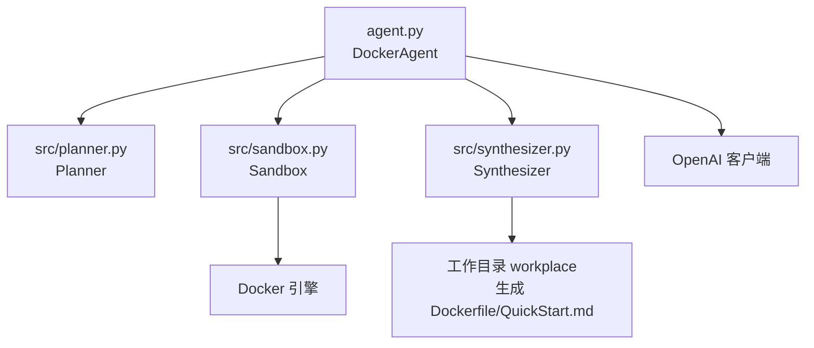
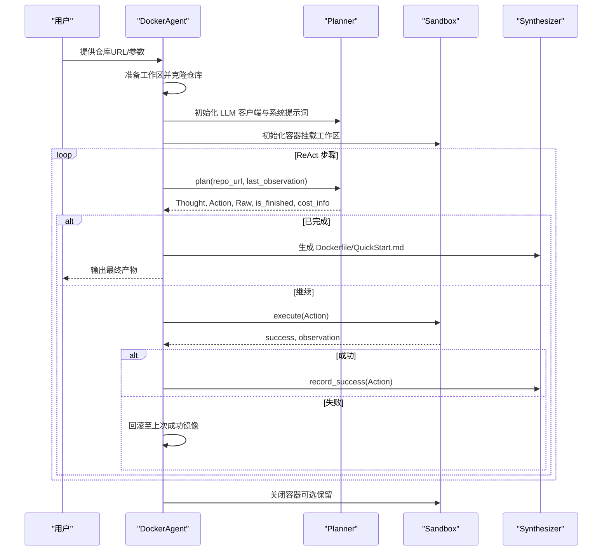
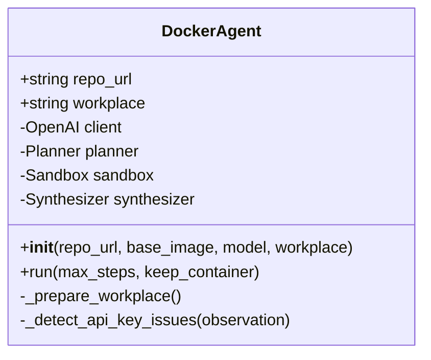
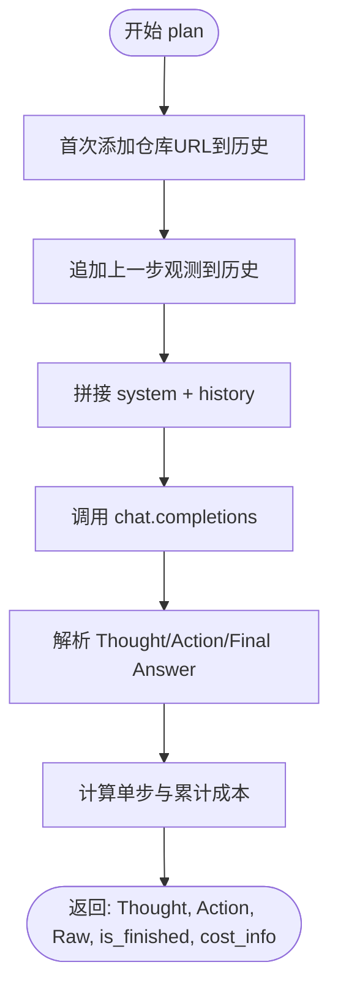
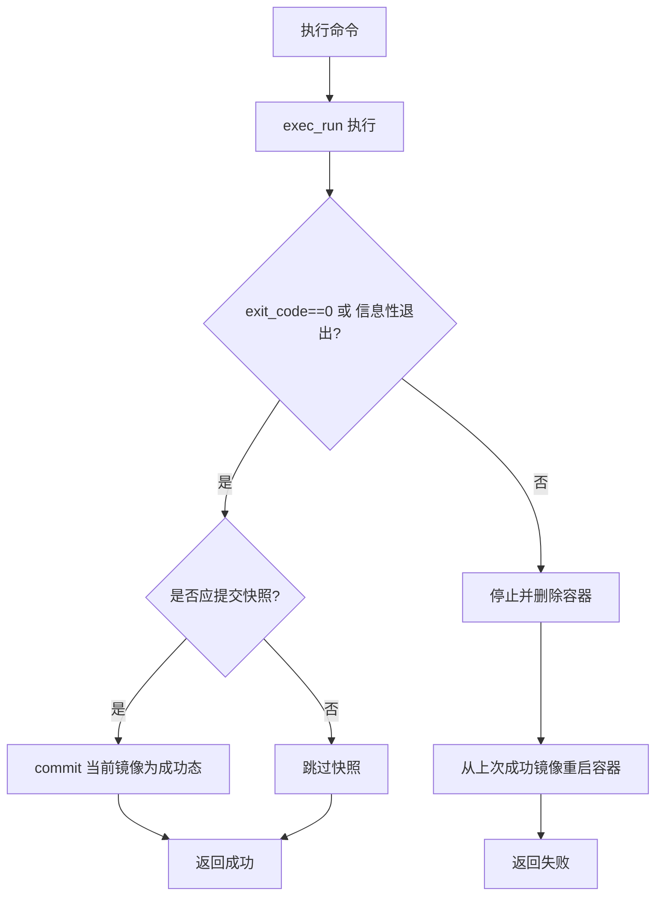
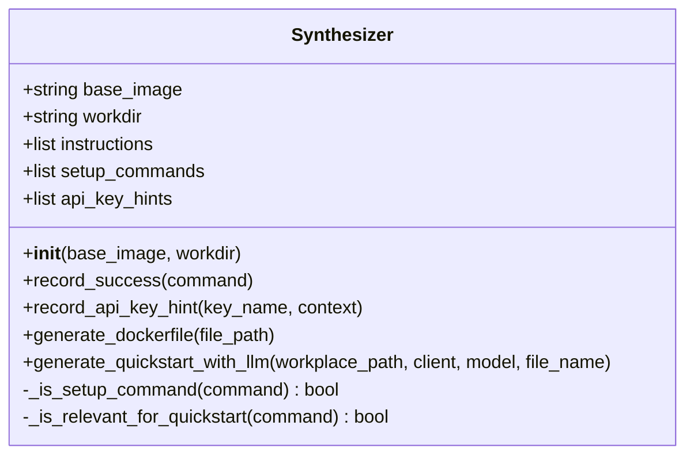
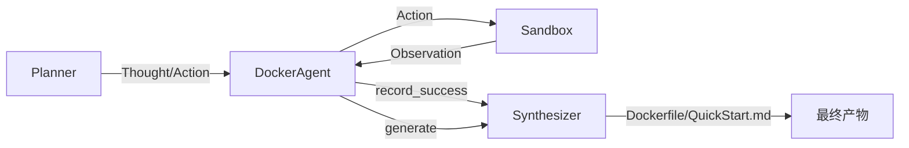
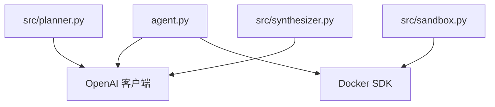

# 核心组件

<cite>
**本文引用的文件**
- [agent.py](file://agent.py)
- [src/planner.py](file://src/planner.py)
- [src/sandbox.py](file://src/sandbox.py)
- [src/synthesizer.py](file://src/synthesizer.py)
- [requirements.txt](file://requirements.txt)
- [README.md](file://README.md)
- [workplace/src/minisweagent/environments/docker.py](file://workplace/src/minisweagent/environments/docker.py)
</cite>

## 目录
1. [简介](#简介)
2. [项目结构](#项目结构)
3. [核心组件](#核心组件)
4. [架构总览](#架构总览)
5. [详细组件分析](#详细组件分析)
6. [依赖分析](#依赖分析)
7. [性能考虑](#性能考虑)
8. [故障排查指南](#故障排查指南)
9. [结论](#结论)
10. [附录](#附录)

## 简介
本文件面向 Repo Dockerizer Agent 的核心组件，系统性阐述以下内容：
- DockerAgent 主类的设计架构与职责边界：ReAct 循环协调、成本监控、最终输出生成
- Planner 模块的 ReAct 模式实现、对话历史管理、成本计算机制
- Sandbox 模块的容器生命周期管理、命令执行与回滚保护
- Synthesizer 模块的文档生成、Dockerfile 创建与 API Key 检测能力
- 组件间交互关系、数据流与集成模式
- 具体使用模式与最佳实践

## 项目结构
该项目采用“主控制器 + 三个核心子模块”的分层设计：
- 主入口与编排器：agent.py 中的 DockerAgent
- 规划与对话：src/planner.py
- 执行与隔离：src/sandbox.py
- 归纳与产出：src/synthesizer.py
- 依赖声明：requirements.txt
- 使用说明与注意事项：README.md
- 参考实现（对比学习）：workplace/src/minisweagent/environments/docker.py

图表来源
- [agent.py](file://agent.py#L14-L39)
- [src/planner.py](file://src/planner.py#L3-L10)
- [src/sandbox.py](file://src/sandbox.py#L4-L13)
- [src/synthesizer.py](file://src/synthesizer.py#L1-L8)
- [requirements.txt](file://requirements.txt#L1-L4)

章节来源
- [README.md](file://README.md#L1-L47)
- [requirements.txt](file://requirements.txt#L1-L4)

## 核心组件
- DockerAgent：负责克隆仓库、初始化 LLM 客户端、协调 Planner/Sandbox/Synthesizer 的 ReAct 循环，监控成本并生成最终产物。
- Planner：以 ReAct 思维链格式输出下一步动作，维护对话历史，计算并累计调用成本。
- Sandbox：基于 Docker SDK 在隔离环境中执行命令，具备“成功态镜像快照 + 失败回滚”的保护机制。
- Synthesizer：记录成功的安装/配置命令，生成 Dockerfile；基于 README 与真实安装步骤生成 QuickStart.md，并检测 API Key 需求。

章节来源
- [agent.py](file://agent.py#L14-L39)
- [src/planner.py](file://src/planner.py#L3-L10)
- [src/sandbox.py](file://src/sandbox.py#L4-L13)
- [src/synthesizer.py](file://src/synthesizer.py#L1-L8)

## 架构总览
下图展示了 DockerAgent 如何驱动 ReAct 循环：Planner 生成“思考 + 动作”，Sandbox 执行动作并返回观测，Synthesizer 记录成功路径，最终在成功条件下生成 Dockerfile 与 QuickStart.md。

图表来源
- [agent.py](file://agent.py#L60-L126)
- [src/planner.py](file://src/planner.py#L69-L105)
- [src/sandbox.py](file://src/sandbox.py#L29-L91)
- [src/synthesizer.py](file://src/synthesizer.py#L9-L21)

## 详细组件分析

### DockerAgent 设计与职责
- 职责边界
  - 工作区准备：克隆仓库到本地工作目录
  - LLM 客户端初始化：加载 OPENAI_API_KEY/OpenAI Base URL
  - ReAct 协调：循环调用 Planner 生成动作，Sandbox 执行动作，记录观测与成本
  - 成本监控：打印每步输入/输出 token 与累计花费
  - 最终输出：仅在配置成功后生成 Dockerfile 与 QuickStart.md
  - 容器生命周期：根据 keep_container 参数决定是否保留容器
- 关键流程
  - run(max_steps, keep_container)：主循环，处理 Thought/Action/Observation，失败回滚，成功生成文档
  - _detect_api_key_issues(observation)：从输出中识别缺失的 API Key 类型并记录
- 与外部依赖
  - OpenAI 客户端：用于 Planner 的 chat.completions 接口
  - Docker 引擎：通过 docker SDK 由 Sandbox 管理容器

图表来源
- [agent.py](file://agent.py#L14-L39)
- [agent.py](file://agent.py#L60-L126)

章节来源
- [agent.py](file://agent.py#L14-L39)
- [agent.py](file://agent.py#L60-L126)

### Planner：ReAct 模式与成本计算
- ReAct 实现要点
  - 系统提示词固定“Thought/Action/Observation”格式，约束输出结构
  - 历史管理：首步加入仓库 URL，后续步将上一步观测作为用户消息追加
  - 输出解析：提取 Thought 与 Action，识别 Final Answer 标志
- 对话与成本
  - 使用 stop=["Observation:"] 控制输出截断
  - 基于 usage.prompt_tokens/completion_tokens 计算单步成本与累计成本
  - 支持多模型定价表（含 gpt-5/gpt-4o/o 系列等）
- 交互细节
  - plan(repo_url, last_observation) 返回：thought, action, raw, is_finished, cost_info

图表来源
- [src/planner.py](file://src/planner.py#L69-L105)
- [src/planner.py](file://src/planner.py#L107-L129)

章节来源
- [src/planner.py](file://src/planner.py#L3-L10)
- [src/planner.py](file://src/planner.py#L43-L67)
- [src/planner.py](file://src/planner.py#L69-L105)
- [src/planner.py](file://src/planner.py#L107-L129)

### Sandbox：容器执行与回滚保护
- 容器生命周期
  - 初始化：从 base_image 启动容器，设置工作目录与卷映射
  - 执行：exec_run 执行 bash 命令，捕获 exit_code 与输出
  - 关闭：stop/remove 容器，清理成功快照镜像与悬空镜像
- 回滚保护机制
  - 成功条件：exit_code==0 或“信息性退出”（如 --help 显示）
  - 快照策略：仅对会产生持久影响的命令进行 commit，保留最近一次成功镜像
  - 失败回滚：失败时停止并删除当前容器，从上次成功镜像重新启动
- 辅助判断
  - _should_commit：基于命令首词判断是否需要 commit
  - _is_informational_exit：基于 exit_code 与输出关键词判断是否为“信息性退出”

图表来源
- [src/sandbox.py](file://src/sandbox.py#L29-L91)
- [src/sandbox.py](file://src/sandbox.py#L93-L112)
- [src/sandbox.py](file://src/sandbox.py#L114-L134)

章节来源
- [src/sandbox.py](file://src/sandbox.py#L4-L13)
- [src/sandbox.py](file://src/sandbox.py#L29-L91)
- [src/sandbox.py](file://src/sandbox.py#L93-L134)
- [src/sandbox.py](file://src/sandbox.py#L147-L178)

### Synthesizer：文档生成与 API Key 检测
- 指令记录与 Dockerfile 生成
  - record_success(command)：将成功命令转化为 Dockerfile 的 RUN 指令
  - generate_dockerfile(file_path)：写入 FROM/WORKDIR/instructions
- QuickStart 文档生成
  - generate_quickstart_with_llm(workplace_path, client, model, file_name)：基于 README 与真实安装步骤生成简洁文档
  - 过滤无关指令，仅保留安装/配置相关命令
- API Key 检测
  - record_api_key_hint(key_name, context)：记录缺失的密钥类型与上下文
  - _is_setup_command/_is_relevant_for_quickstart：辅助过滤与分类

图表来源
- [src/synthesizer.py](file://src/synthesizer.py#L1-L8)
- [src/synthesizer.py](file://src/synthesizer.py#L9-L21)
- [src/synthesizer.py](file://src/synthesizer.py#L130-L143)

章节来源
- [src/synthesizer.py](file://src/synthesizer.py#L1-L8)
- [src/synthesizer.py](file://src/synthesizer.py#L9-L21)
- [src/synthesizer.py](file://src/synthesizer.py#L32-L122)
- [src/synthesizer.py](file://src/synthesizer.py#L130-L143)

### 组件间交互与数据流
- 数据流
  - Planner 输出 Thought/Action → Sandbox 执行 → 返回 Observation
  - DockerAgent 解析输出，记录成本，必要时检测 API Key
  - 成功则 Synthesizer 记录指令，失败则回滚
  - 成功结束 → 生成 Dockerfile 与 QuickStart.md
- 控制流
  - DockerAgent.run 驱动循环，达到 Final Answer 或超过最大步数即终止
  - Sandbox.execute 返回布尔值与输出，驱动回滚/继续
  - Synthesizer 仅在配置成功后生成最终产物

图表来源
- [agent.py](file://agent.py#L60-L126)
- [src/planner.py](file://src/planner.py#L69-L105)
- [src/sandbox.py](file://src/sandbox.py#L29-L91)
- [src/synthesizer.py](file://src/synthesizer.py#L9-L21)
- [src/synthesizer.py](file://src/synthesizer.py#L130-L143)

## 依赖分析
- 运行时依赖
  - docker：Sandbox 通过 Docker SDK 管理容器
  - openai：Planner 与 Synthesizer 使用 chat.completions
  - python-dotenv：加载 OPENAI_API_KEY 等环境变量
- 外部接口契约
  - OpenAI 客户端需提供 api_key；支持自定义 base_url
  - Docker 引擎需本地可用，且容器可正常拉起与执行命令

图表来源
- [requirements.txt](file://requirements.txt#L1-L4)
- [agent.py](file://agent.py#L27-L36)
- [src/planner.py](file://src/planner.py#L85-L90)
- [src/synthesizer.py](file://src/synthesizer.py#L102-L107)

章节来源
- [requirements.txt](file://requirements.txt#L1-L4)
- [agent.py](file://agent.py#L27-L36)

## 性能考虑
- 成本控制
  - Planner 基于 token 数量与模型单价计算成本，建议在生产中记录并限制总预算
  - 可通过减少 max_steps、优化 prompt、选择更便宜的模型降低开销
- 容器快照与磁盘占用
  - Sandbox 每次成功都会 commit，可能导致镜像堆积；建议在完成后清理
  - 可通过 prune 清理悬空镜像，减少空间占用
- I/O 与网络
  - README.md 读取与 LLM 请求为 I/O 密集；建议缓存工作区内容与合理设置超时
  - 代理/网络不稳定时，建议增加重试与降级策略

## 故障排查指南
- 环境变量缺失
  - 现象：初始化时报错 OPENAI_API_KEY 不存在
  - 处理：确保 .env 文件存在并包含 OPENAI_API_KEY
- Docker 引擎不可用
  - 现象：Sandbox 初始化失败或执行命令报错
  - 处理：确认 Docker Engine 已安装并运行；检查权限与网络
- 命令失败导致回滚
  - 现象：Action 执行失败，容器回滚至上一成功镜像
  - 处理：检查 Action 是否符合容器内环境；必要时调整命令或依赖
- API Key 缺失
  - 现象：输出提示缺少特定密钥
  - 处理：Synthesizer 记录密钥需求，可在 QuickStart.md 中提供配置方法
- 生成文档为空
  - 现象：未生成 QuickStart.md 或 Dockerfile
  - 处理：确认配置成功（包含 Final Answer: Success）；检查 README.md 与 setup 命令

章节来源
- [agent.py](file://agent.py#L28-L36)
- [agent.py](file://agent.py#L127-L146)
- [src/sandbox.py](file://src/sandbox.py#L76-L91)
- [src/synthesizer.py](file://src/synthesizer.py#L36-L45)

## 结论
Repo Dockerizer Agent 将 LLM 的 ReAct 思维链与容器化执行相结合，形成“规划-执行-归纳-产出”的闭环。Planner 提供结构化的下一步动作与成本度量，Sandbox 提供安全可靠的执行与回滚保障，Synthesizer 将成功路径沉淀为可复用的 Dockerfile 与 QuickStart 文档。整体设计清晰、职责明确，适合在受限环境中自动配置复杂项目的运行环境。

## 附录
- 使用模式
  - 基本运行：提供仓库 URL，Agent 将克隆仓库并在容器中执行 ReAct 循环
  - 参数：--image 指定基础镜像，--model 指定 LLM，--steps 指定最大步数，--keep-container 保留容器便于调试
- 参考实现对比
  - workplace/src/minisweagent/environments/docker.py 展示了另一种基于 docker exec 的环境封装方式，可作为扩展参考

章节来源
- [README.md](file://README.md#L11-L47)
- [agent.py](file://agent.py#L148-L159)
- [workplace/src/minisweagent/environments/docker.py](file://workplace/src/minisweagent/environments/docker.py#L45-L162)