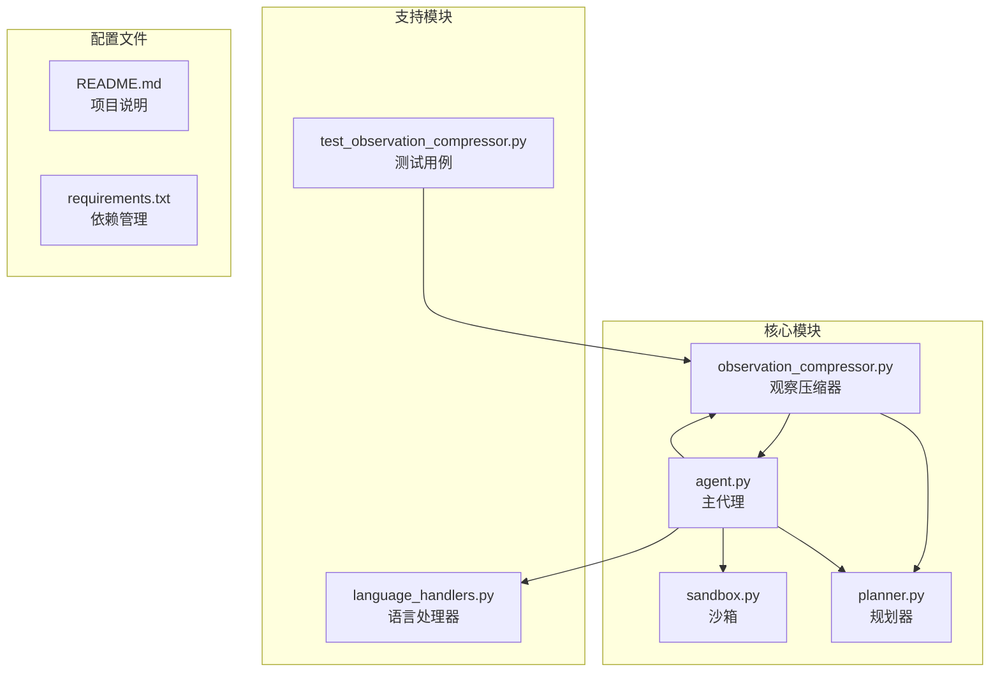
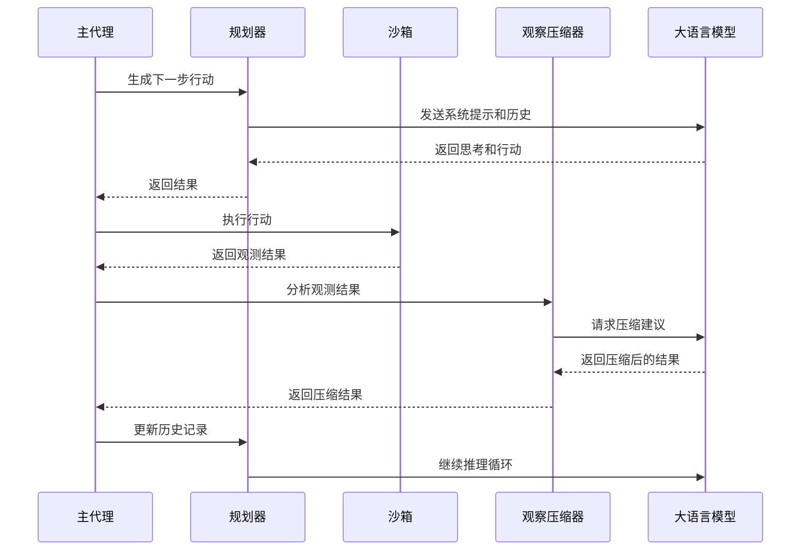
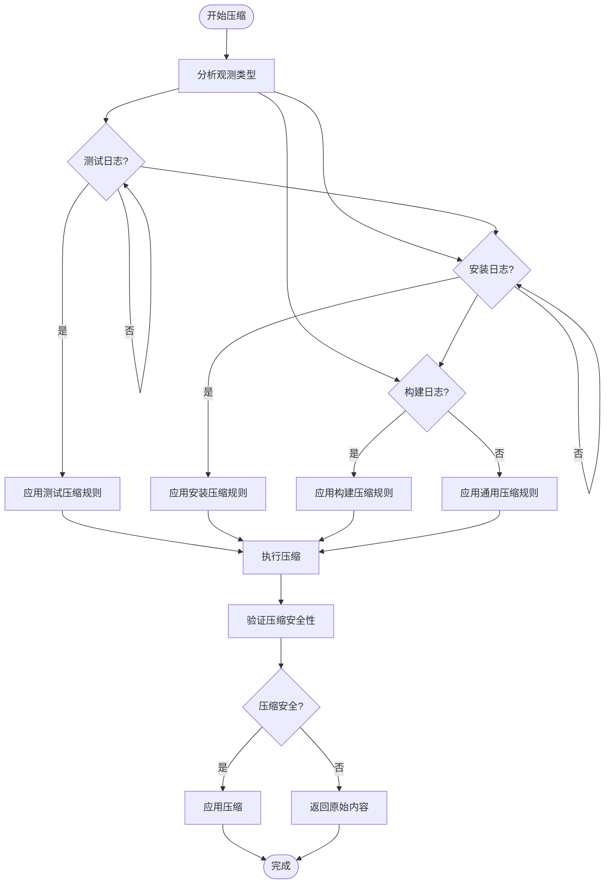
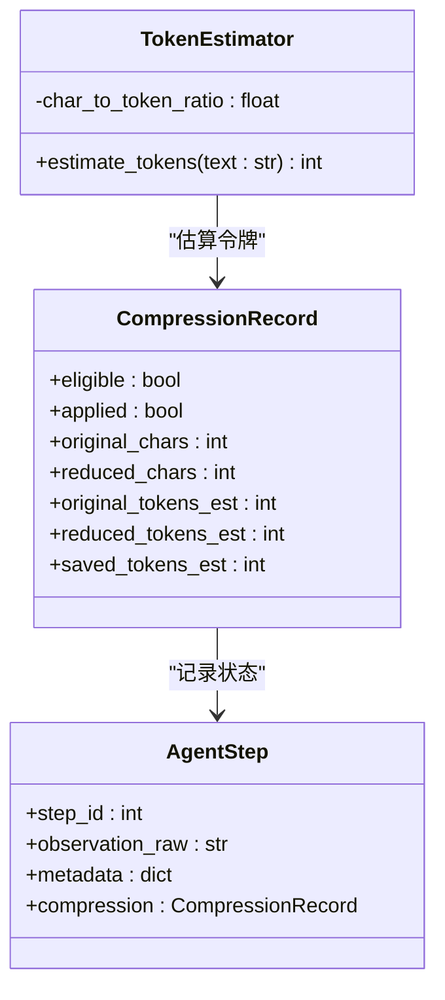
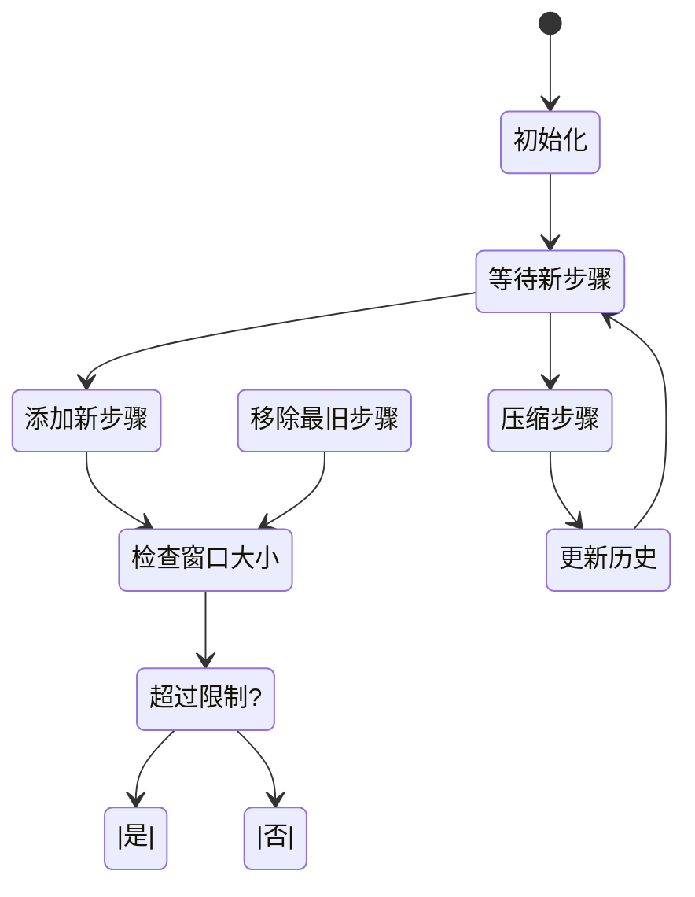
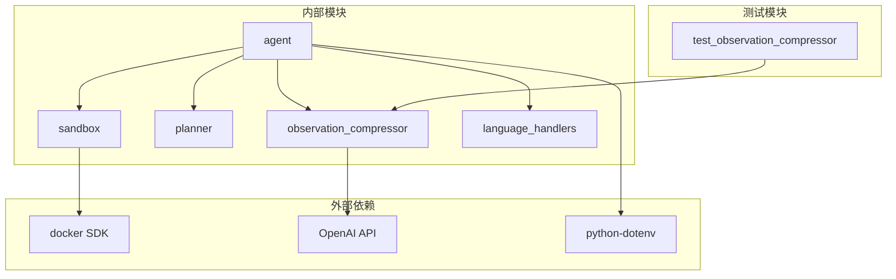

# 观察压缩系统

<cite>
**本文档引用的文件**
- [observation_compressor.py](file://src/observation_compressor.py)
- [agent.py](file://agent.py)
- [planner.py](file://src/planner.py)
- [sandbox.py](file://src/sandbox.py)
- [language_handlers.py](file://src/language_handlers.py)
- [test_observation_compressor.py](file://tests/test_observation_compressor.py)
- [README.md](file://README.md)
</cite>

## 目录
1. [简介](#简介)
2. [项目结构](#项目结构)
3. [核心组件](#核心组件)
4. [架构概览](#架构概览)
5. [详细组件分析](#详细组件分析)
6. [依赖关系分析](#依赖关系分析)
7. [性能考虑](#性能考虑)
8. [故障排除指南](#故障排除指南)
9. [结论](#结论)

## 简介

观察压缩系统是 Repo Dockerizer Agent 的一个关键组件，旨在通过智能压缩大型观测结果来优化 LLM 推理过程。该系统能够识别和压缩重复的、冗余的或过期的信息，同时保留对后续决策至关重要的上下文信息。

该系统特别针对软件环境配置场景进行了优化，能够处理测试日志、安装日志和构建命令输出等不同类型的观测结果。通过减少不必要的文本内容，系统显著降低了令牌使用量，提高了整体推理效率。

## 项目结构

**图表来源**
- [observation_compressor.py:1-326](file://src/observation_compressor.py#L1-L326)
- [agent.py:1-911](file://agent.py#L1-L911)

**章节来源**
- [README.md:1-71](file://README.md#L1-L71)
- [requirements.txt:1-4](file://requirements.txt#L1-L4)

## 核心组件

### 观察压缩器 (ObservationCompressor)

观察压缩器是系统的核心组件，负责识别和压缩大型观测结果。它实现了以下关键功能：

- **XML 结构维护**：保持原始 XML 结构不变，仅修改 `<result>` 标签内的内容
- **智能压缩策略**：根据观测类型应用不同的压缩规则
- **令牌估算**：提供准确的令牌使用量估算
- **安全检查**：确保压缩不会删除对后续决策重要的信息

### Agent 步骤管理

系统通过 `AgentStep` 类管理每个代理步骤的状态：

- **元数据跟踪**：记录观测结果的字符数和令牌估算
- **压缩记录**：跟踪压缩操作的成功与否
- **令牌使用统计**：记录每个步骤的令牌消耗

### 历史管理

系统维护两种历史记录：

- **规划历史**：用于 ReAct 推理的对话历史
- **压缩历史**：专门用于观察压缩的上下文窗口

**章节来源**
- [observation_compressor.py:151-224](file://src/observation_compressor.py#L151-L224)
- [observation_compressor.py:257-326](file://src/observation_compressor.py#L257-L326)

## 架构概览

**图表来源**
- [agent.py:328-449](file://agent.py#L328-L449)
- [observation_compressor.py:262-310](file://src/observation_compressor.py#L262-L310)

## 详细组件分析

### 观察压缩算法

观察压缩系统采用多阶段压缩策略：

**图表来源**
- [observation_compressor.py:7-84](file://src/observation_compressor.py#L7-L84)
- [observation_compressor.py:312-326](file://src/observation_compressor.py#L312-L326)

### 压缩规则详解

#### 测试日志压缩规则

测试日志压缩遵循严格的安全性原则：

- **必须保留**：测试会话头部、平台信息、测试计数、简短摘要、失败/错误/xfail 测试案例、解释失败的回溯或断言消息、最终摘要行
- **可压缩**：长串的 PASS 行，替换为占位符如 `... (individual test lines omitted; mostly PASSED)`

#### 安装日志压缩规则

安装日志压缩重点关注包管理器信息：

- **必须保留**：包管理器身份、成功安装的包名和版本、已满足/已安装的包名和版本、关键警告、第一个真实错误及其附近上下文
- **可压缩**：下载进度条、重复的获取/构建行、详细的轮子/构建噪声

#### 构建日志压缩规则

构建日志压缩平衡信息完整性和压缩效果：

- **必须保留**：命令成功或失败状态、相关发现的文件/路径、相关构建工件、第一个真实错误和最具信息量的附近行
- **可压缩**：重复的构建进度、重复的信息行、可以替换为简短总结的大型无关块

**章节来源**
- [observation_compressor.py:35-79](file://src/observation_compressor.py#L35-L79)

### 令牌估算系统

系统使用简单的字符到令牌估算方法：

**图表来源**
- [observation_compressor.py:99-102](file://src/observation_compressor.py#L99-L102)
- [observation_compressor.py:151-167](file://src/observation_compressor.py#L151-L167)

**章节来源**
- [observation_compressor.py:99-167](file://src/observation_compressor.py#L99-L167)

### 历史管理机制

系统实现了复杂的滑动窗口历史管理：

**图表来源**
- [planner.py:229-248](file://src/planner.py#L229-L248)
- [agent.py:487-540](file://agent.py#L487-L540)

**章节来源**
- [planner.py:229-281](file://src/planner.py#L229-L281)
- [agent.py:487-540](file://agent.py#L487-L540)

## 依赖关系分析

**图表来源**
- [requirements.txt:1-4](file://requirements.txt#L1-L4)
- [agent.py:1-24](file://agent.py#L1-L24)

**章节来源**
- [requirements.txt:1-4](file://requirements.txt#L1-L4)
- [agent.py:1-24](file://agent.py#L1-L24)

## 性能考虑

### 令牌使用优化

观察压缩系统通过以下方式优化令牌使用：

- **阈值控制**：只有当观测结果超过 1500 字符时才考虑压缩
- **收益评估**：只有当节省的令牌超过 300 个时才应用压缩
- **延迟压缩**：默认延迟 2 步骤后压缩，确保上下文完整性

### 内存管理

系统实现了有效的内存管理策略：

- **滑动窗口**：限制历史记录大小，防止内存泄漏
- **快照清理**：自动清理不再需要的容器快照
- **增量压缩**：只对需要压缩的步骤进行处理

### 并发处理

系统支持并发处理多个压缩任务：

- **异步压缩**：压缩操作不会阻塞主推理流程
- **批量处理**：可以同时处理多个历史步骤
- **资源隔离**：每个压缩操作都有独立的资源分配

## 故障排除指南

### 常见问题及解决方案

#### 压缩失败

**症状**：压缩请求返回原始内容

**可能原因**：
- 无法解析重写的结果
- 压缩收益不足
- 观测结果过短

**解决方法**：
- 检查 LLM 响应格式
- 调整压缩阈值
- 确保有足够的上下文信息

#### 令牌估算不准确

**症状**：压缩效果不如预期

**可能原因**：
- 字符到令牌比率估算过于简单
- 不同语言的令牌密度差异

**解决方法**：
- 使用更精确的令牌估算工具
- 为不同语言实现特定的估算规则

#### 内存使用过高

**症状**：长时间运行后内存占用增加

**可能原因**：
- 历史记录过大
- 快照未及时清理

**解决方法**：
- 调整滑动窗口大小
- 实现更积极的清理策略

**章节来源**
- [observation_compressor.py:296-326](file://src/observation_compressor.py#L296-L326)
- [agent.py:868-887](file://agent.py#L868-L887)

## 结论

观察压缩系统是一个精心设计的组件，它通过智能压缩大型观测结果来优化 LLM 推理过程。系统的主要优势包括：

1. **安全性优先**：严格的安全检查确保重要信息不会被删除
2. **多策略支持**：针对不同类型观测结果的专门压缩策略
3. **性能优化**：通过阈值控制和延迟压缩提高整体效率
4. **可扩展性**：模块化设计便于添加新的压缩策略和语言支持

该系统在 Repo Dockerizer Agent 中发挥着关键作用，显著减少了令牌使用量，提高了推理速度，同时保持了必要的上下文完整性。通过持续的优化和扩展，观察压缩系统将继续为自动化环境配置提供强有力的支持。