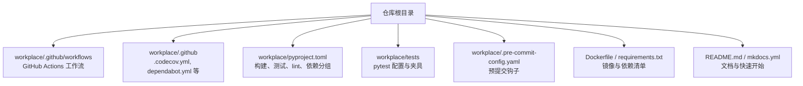
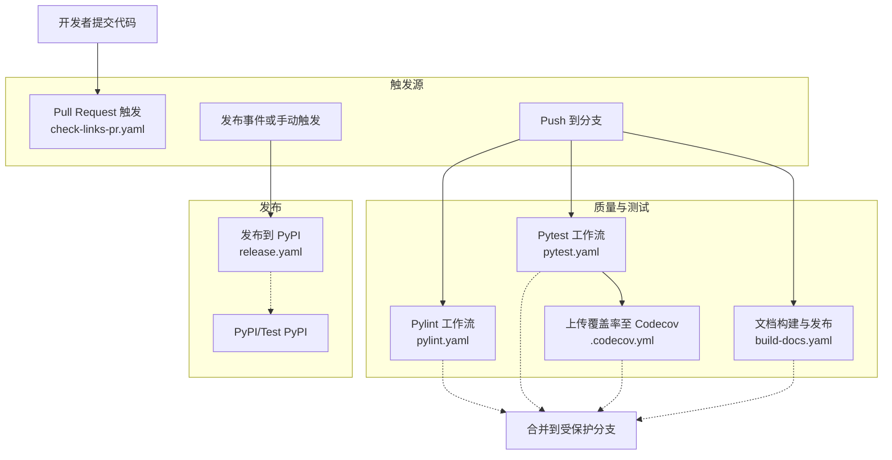
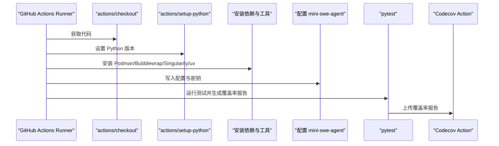
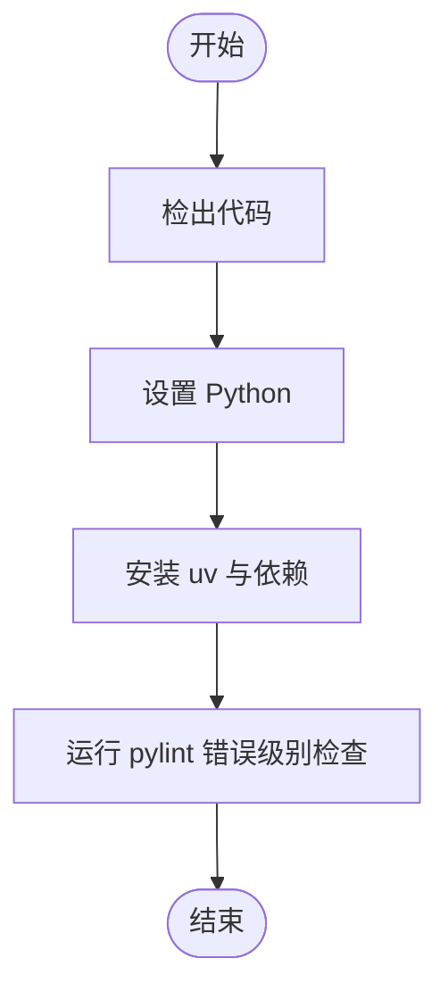
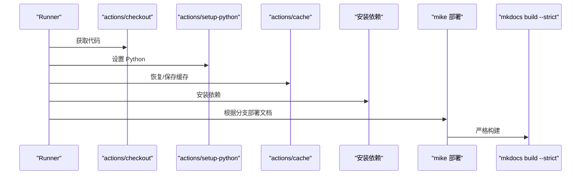
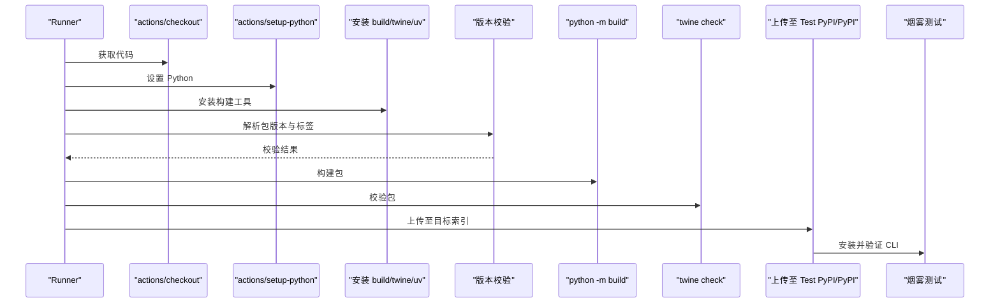
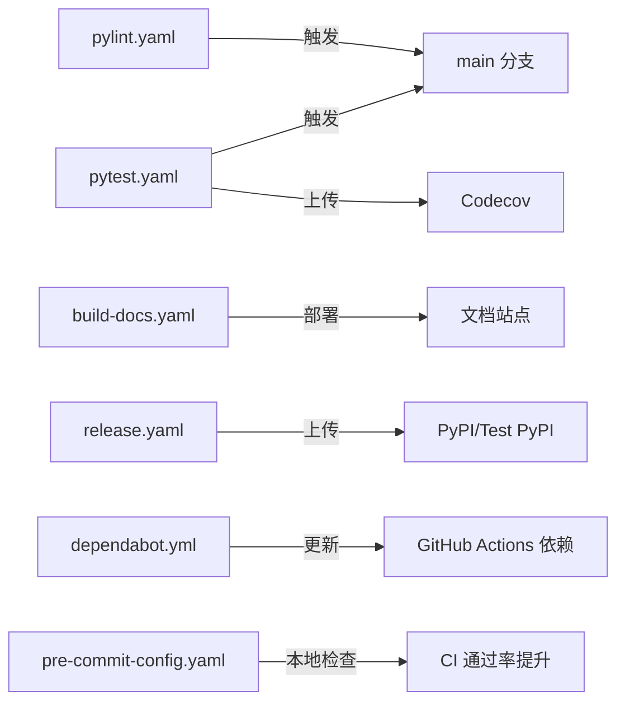

# CI/CD 集成

<cite>
**本文引用的文件**
- [workplace/.github/workflows/pytest.yaml](file://workplace/.github/workflows/pytest.yaml)
- [workplace/.github/workflows/pylint.yaml](file://workplace/.github/workflows/pylint.yaml)
- [workplace/.github/workflows/build-docs.yaml](file://workplace/.github/workflows/build-docs.yaml)
- [workplace/.github/workflows/release.yaml](file://workplace/.github/workflows/release.yaml)
- [workplace/.github/workflows/check-links-pr.yaml](file://workplace/.github/workflows/check-links-pr.yaml)
- [workplace/.github/.codecov.yml](file://workplace/.github/.codecov.yml)
- [workplace/.github/dependabot.yml](file://workplace/.github/dependabot.yml)
- [workplace/pyproject.toml](file://workplace/pyproject.toml)
- [workplace/tests/conftest.py](file://workplace/tests/conftest.py)
- [workplace/.pre-commit-config.yaml](file://workplace/.pre-commit-config.yaml)
- [Dockerfile](file://Dockerfile)
- [requirements.txt](file://requirements.txt)
- [README.md](file://README.md)
</cite>

## 目录
1. [简介](#简介)
2. [项目结构](#项目结构)
3. [核心组件](#核心组件)
4. [架构总览](#架构总览)
5. [详细组件分析](#详细组件分析)
6. [依赖关系分析](#依赖关系分析)
7. [性能考量](#性能考量)
8. [故障排查指南](#故障排查指南)
9. [结论](#结论)
10. [附录](#附录)

## 简介
本指南面向在 GitHub 上落地 CI/CD 的团队，结合仓库现有配置，系统化阐述以下内容：
- GitHub Actions 工作流：代码质量检查（Pylint）、单元测试与覆盖率（Pytest + Codecov）、文档构建与发布（MkDocs + mike）、发布到 PyPI 的流水线。
- 自动化部署与发布：版本校验、包构建与校验、上传至 Test PyPI 或正式 PyPI、烟雾测试（pipx/uvx/pip 安装后 CLI 可用性验证）。
- 代码审查自动化：依赖更新（Dependabot）、链接检查（PR 中仅检查变更文件）、预提交钩子（格式化、拼写、静态检查）。
- 持续监控：测试覆盖率阈值与注释策略、文档严格构建、发布前校验。
- 多环境部署策略：开发、预生产（Test PyPI）、生产（PyPI）三阶段。

## 项目结构
本项目采用“根目录 + workplace 子目录”的组织方式，CI/CD 相关配置集中在 workplace/.github 下，测试与构建工具通过 pyproject.toml 统一管理。

图表来源
- [workplace/.github/workflows/pytest.yaml](file://workplace/.github/workflows/pytest.yaml#L1-L80)
- [workplace/.github/workflows/build-docs.yaml](file://workplace/.github/workflows/build-docs.yaml#L1-L55)
- [workplace/.github/workflows/release.yaml](file://workplace/.github/workflows/release.yaml#L1-L129)
- [workplace/pyproject.toml](file://workplace/pyproject.toml#L1-L282)
- [workplace/tests/conftest.py](file://workplace/tests/conftest.py#L1-L112)
- [workplace/.pre-commit-config.yaml](file://workplace/.pre-commit-config.yaml#L1-L38)
- [Dockerfile](file://Dockerfile#L1-L7)
- [README.md](file://README.md#L1-L47)

章节来源
- [workplace/.github/workflows/pytest.yaml](file://workplace/.github/workflows/pytest.yaml#L1-L80)
- [workplace/.github/workflows/build-docs.yaml](file://workplace/.github/workflows/build-docs.yaml#L1-L55)
- [workplace/.github/workflows/release.yaml](file://workplace/.github/workflows/release.yaml#L1-L129)
- [workplace/pyproject.toml](file://workplace/pyproject.toml#L1-L282)

## 核心组件
- 测试与覆盖率：Pytest 工作流在 Ubuntu 环境中安装依赖、配置模型密钥、运行测试并生成覆盖率 XML 报告，随后上传至 Codecov。
- 代码质量：Pylint 工作流仅在主分支推送时运行，以错误级别失败，避免将警告阻塞合并。
- 文档构建与发布：MkDocs + mike 在主分支或指定分支上部署文档；严格模式确保构建失败能暴露问题。
- 发布到 PyPI：支持手动触发（workflow_dispatch）与发布事件（release），包含版本一致性校验、twine 校验、上传至 Test PyPI 或 PyPI，并进行烟雾测试。
- 依赖更新：Dependabot 自动维护 GitHub Actions 依赖。
- 链接检查：PR 中仅检查变更的 Markdown 文件链接有效性。
- 预提交：统一的 pre-commit 钩子，涵盖大文件检测、合并冲突、私钥、空白字符、拼写检查、Ruff 格式化与 Lint、Prettier 格式化等。

章节来源
- [workplace/.github/workflows/pytest.yaml](file://workplace/.github/workflows/pytest.yaml#L34-L80)
- [workplace/.github/workflows/pylint.yaml](file://workplace/.github/workflows/pylint.yaml#L30-L53)
- [workplace/.github/workflows/build-docs.yaml](file://workplace/.github/workflows/build-docs.yaml#L19-L55)
- [workplace/.github/workflows/release.yaml](file://workplace/.github/workflows/release.yaml#L14-L129)
- [workplace/.github/dependabot.yml](file://workplace/.github/dependabot.yml#L1-L8)
- [workplace/.github/workflows/check-links-pr.yaml](file://workplace/.github/workflows/check-links-pr.yaml#L1-L14)
- [workplace/.pre-commit-config.yaml](file://workplace/.pre-commit-config.yaml#L1-L38)

## 架构总览
下图展示了从代码提交到发布的端到端流水线，以及各工作流之间的触发与依赖关系。

图表来源
- [workplace/.github/workflows/pylint.yaml](file://workplace/.github/workflows/pylint.yaml#L6-L28)
- [workplace/.github/workflows/pytest.yaml](file://workplace/.github/workflows/pytest.yaml#L7-L31)
- [workplace/.github/.codecov.yml](file://workplace/.github/.codecov.yml#L1-L20)
- [workplace/.github/workflows/build-docs.yaml](file://workplace/.github/workflows/build-docs.yaml#L3-L17)
- [workplace/.github/workflows/release.yaml](file://workplace/.github/workflows/release.yaml#L3-L12)

## 详细组件分析

### 测试与覆盖率（Pytest + Codecov）
- 触发条件：推送至 main/v2.0 分支且忽略文档与配置文件改动；拉取请求同样适用。
- 环境准备：Ubuntu 最新 runners，安装 Podman、Bubblewrap、Singularity 等沙箱运行时，使用 uv 安装完整依赖。
- 配置与密钥：通过 mini-extra 命令设置配置项与 API 密钥。
- 执行与报告：pytest 带并行与覆盖率参数，生成 XML 报告并上传至 Codecov。
- 覆盖率策略：项目目标阈值与补丁信息策略由 .codecov.yml 控制，忽略 tests 目录。

图表来源
- [workplace/.github/workflows/pytest.yaml](file://workplace/.github/workflows/pytest.yaml#L34-L80)
- [workplace/.github/.codecov.yml](file://workplace/.github/.codecov.yml#L1-L20)

章节来源
- [workplace/.github/workflows/pytest.yaml](file://workplace/.github/workflows/pytest.yaml#L7-L31)
- [workplace/.github/.codecov.yml](file://workplace/.github/.codecov.yml#L1-L20)
- [workplace/tests/conftest.py](file://workplace/tests/conftest.py#L1-L112)

### 代码质量（Pylint）
- 触发条件：仅在推送至 main 分支时运行，避免频繁 PR 干扰。
- 执行策略：安装 pylint 后对 minisweagent 包执行错误级别检查，仅在真实错误时失败。

图表来源
- [workplace/.github/workflows/pylint.yaml](file://workplace/.github/workflows/pylint.yaml#L30-L53)

章节来源
- [workplace/.github/workflows/pylint.yaml](file://workplace/.github/workflows/pylint.yaml#L6-L28)

### 文档构建与发布（MkDocs + mike）
- 触发条件：推送至 main/v1 分支或匹配 build-docs-*；PR 同样触发。
- 并发控制：同一 ref 的并发任务互斥，避免 gh-pages 冲突。
- 步骤：配置 Git 凭据、缓存 MkDocs 依赖、安装依赖、按分支选择部署策略（main 推送最新别名，v1 仅 v1），最后严格构建以暴露错误。

图表来源
- [workplace/.github/workflows/build-docs.yaml](file://workplace/.github/workflows/build-docs.yaml#L14-L55)

章节来源
- [workplace/.github/workflows/build-docs.yaml](file://workplace/.github/workflows/build-docs.yaml#L3-L17)

### 发布到 PyPI（版本校验、构建、校验与上传）
- 触发方式：手动触发（workflow_dispatch）或发布事件（release）。
- 版本一致性：解析包内版本与发布标签，不一致则失败。
- 构建与校验：使用 build 与 twine 检查产物。
- 上传策略：根据输入选择 Test PyPI 或 PyPI；上传后进行烟雾测试（pipx/uvx/pip 安装后验证 CLI）。

图表来源
- [workplace/.github/workflows/release.yaml](file://workplace/.github/workflows/release.yaml#L14-L129)

章节来源
- [workplace/.github/workflows/release.yaml](file://workplace/.github/workflows/release.yaml#L3-L12)

### 依赖更新与安全扫描（Dependabot）
- Dependabot 配置：每周自动检查 GitHub Actions 生态系统的依赖更新。
- 与安全扫描的关系：当前未在工作流中直接集成安全扫描（如 SAST/SBOM），可在后续扩展。

章节来源
- [workplace/.github/dependabot.yml](file://workplace/.github/dependabot.yml#L1-L8)

### 链接检查（PR 中仅检查变更文件）
- 触发：PR 创建时运行。
- 策略：仅检查修改的 Markdown 文件，基于配置文件进行检查。

章节来源
- [workplace/.github/workflows/check-links-pr.yaml](file://workplace/.github/workflows/check-links-pr.yaml#L1-L14)

### 预提交钩子（pre-commit）
- 覆盖范围：大文件、大小写冲突、合并冲突、符号链接、换行符、私钥、尾随空白、拼写检查、Ruff Lint/Format、Prettier。
- 与 CI 的协同：本地通过 pre-commit 钩子减少 CI 失败概率，提升提交质量。

章节来源
- [workplace/.pre-commit-config.yaml](file://workplace/.pre-commit-config.yaml#L1-L38)

## 依赖关系分析
- 工作流耦合：pytest 与 release 无直接依赖；pylint 与 pytest 仅在触发时机上互补；release 依赖版本一致性校验。
- 外部依赖：PyPI/Twine、Codecov、MkDocs/mike、markdown-link-check。
- 依赖分组：pyproject.toml 将 dev、modal、full 等依赖分组，便于在 CI 中按需安装。

图表来源
- [workplace/.github/workflows/pylint.yaml](file://workplace/.github/workflows/pylint.yaml#L6-L28)
- [workplace/.github/workflows/pytest.yaml](file://workplace/.github/workflows/pytest.yaml#L7-L31)
- [workplace/.github/.codecov.yml](file://workplace/.github/.codecov.yml#L1-L20)
- [workplace/.github/workflows/build-docs.yaml](file://workplace/.github/workflows/build-docs.yaml#L3-L17)
- [workplace/.github/workflows/release.yaml](file://workplace/.github/workflows/release.yaml#L3-L12)
- [workplace/.github/dependabot.yml](file://workplace/.github/dependabot.yml#L1-L8)
- [workplace/.pre-commit-config.yaml](file://workplace/.pre-commit-config.yaml#L1-L38)

章节来源
- [workplace/pyproject.toml](file://workplace/pyproject.toml#L50-L77)

## 性能考量
- 并行测试：pytest 使用并行选项，缩短测试时间。
- 缓存策略：MkDocs 工作流使用缓存键，降低重复安装成本。
- 依赖安装：使用 uv 加速依赖解析与安装。
- 体积控制：Dockerfile 中包含列出与打印操作，便于审计但可能增加镜像层复杂度，建议在生产镜像中优化。

章节来源
- [workplace/.github/workflows/pytest.yaml](file://workplace/.github/workflows/pytest.yaml#L74-L75)
- [workplace/.github/workflows/build-docs.yaml](file://workplace/.github/workflows/build-docs.yaml#L35-L41)
- [Dockerfile](file://Dockerfile#L1-L7)

## 故障排查指南
- 覆盖率未达标：检查 .codecov.yml 的目标阈值与忽略规则，确认测试输出覆盖了关键路径。
- Pylint 失败：仅在错误级别失败，优先修复 E/F 级别问题；若为风格建议，可在本地修复后重试。
- 文档构建失败：启用严格模式会暴露构建错误；检查 mkdocs.yml 与页面内容。
- 发布失败：核对版本一致性校验、API 密钥与索引 URL；查看 twine 校验输出。
- 链接检查失败：根据 markdown-link-check 输出修正无效链接。
- 预提交失败：遵循 pre-commit 钩子提示，修复拼写、格式或导入顺序等问题。

章节来源
- [workplace/.github/.codecov.yml](file://workplace/.github/.codecov.yml#L1-L20)
- [workplace/.github/workflows/pylint.yaml](file://workplace/.github/workflows/pylint.yaml#L49-L53)
- [workplace/.github/workflows/build-docs.yaml](file://workplace/.github/workflows/build-docs.yaml#L52-L55)
- [workplace/.github/workflows/release.yaml](file://workplace/.github/workflows/release.yaml#L28-L49)
- [workplace/.github/workflows/check-links-pr.yaml](file://workplace/.github/workflows/check-links-pr.yaml#L4-L13)
- [workplace/.pre-commit-config.yaml](file://workplace/.pre-commit-config.yaml#L1-L38)

## 结论
该仓库已具备完善的 CI/CD 基础设施：质量门禁（Pylint）、测试与覆盖率（Pytest + Codecov）、文档发布（MkDocs + mike）、发布到 PyPI 的全链路。建议后续增强安全扫描（如 SAST/SBOM）与许可证合规检查，并在多环境部署中引入蓝绿/金丝雀策略与回滚脚本，以进一步提升交付稳定性与可观测性。

## 附录
- 快速开始与运行：参考 README 中的安装与运行说明，确保本地环境满足依赖与 Docker 要求。
- 依赖清单：requirements.txt 与 pyproject.toml 的依赖差异需在 CI 中统一处理，建议优先使用 pyproject.toml 的依赖分组。

章节来源
- [README.md](file://README.md#L11-L47)
- [requirements.txt](file://requirements.txt#L1-L4)
- [workplace/pyproject.toml](file://workplace/pyproject.toml#L33-L48)