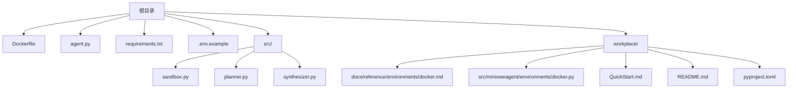
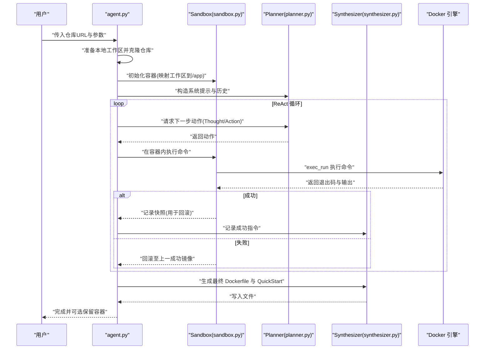
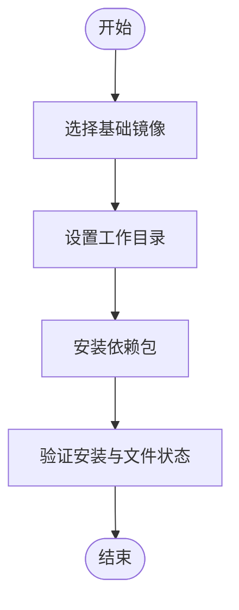
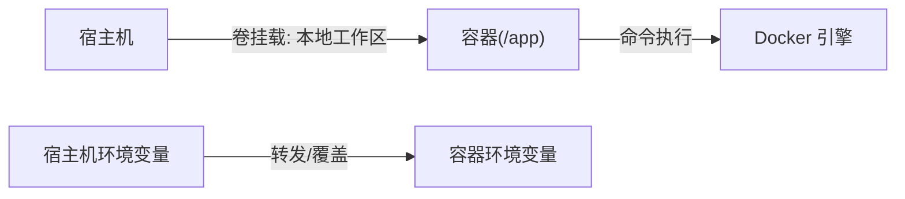
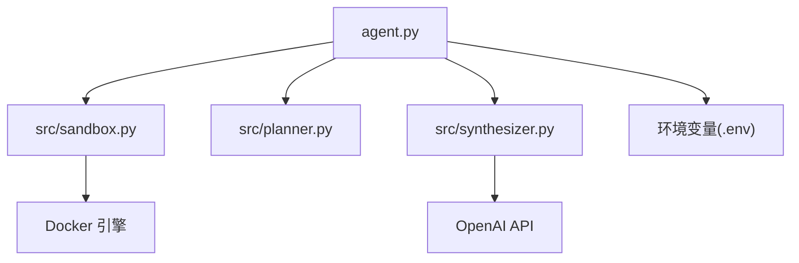

# Docker 部署

<cite>
**本文引用的文件**
- [Dockerfile](file://Dockerfile)
- [agent.py](file://agent.py)
- [src/sandbox.py](file://src/sandbox.py)
- [src/planner.py](file://src/planner.py)
- [src/synthesizer.py](file://src/synthesizer.py)
- [.env.example](file://.env.example)
- [requirements.txt](file://requirements.txt)
- [workplace/src/minisweagent/environments/docker.py](file://workplace/src/minisweagent/environments/docker.py)
- [workplace/docs/reference/environments/docker.md](file://workplace/docs/reference/environments/docker.md)
- [workplace/QuickStart.md](file://workplace/QuickStart.md)
- [workplace/README.md](file://workplace/README.md)
- [workplace/pyproject.toml](file://workplace/pyproject.toml)
</cite>

## 目录
1. [简介](#简介)
2. [项目结构](#项目结构)
3. [核心组件](#核心组件)
4. [架构总览](#架构总览)
5. [详细组件分析](#详细组件分析)
6. [依赖关系分析](#依赖关系分析)
7. [性能考虑](#性能考虑)
8. [故障排查指南](#故障排查指南)
9. [结论](#结论)
10. [附录](#附录)

## 简介
本指南面向希望使用 Docker 部署该仓库的用户，围绕以下目标展开：解释 Dockerfile 的构建过程（基础镜像、依赖安装、环境配置）、容器启动流程（环境变量、卷挂载、网络）、不同部署场景（开发/测试/生产）的配置示例、健康检查与资源限制、安全最佳实践、镜像体积与启动性能优化、日志与监控配置。  
同时，结合仓库中的自动化 Agent 与沙箱实现，给出可复用的部署策略与运维建议。

## 项目结构
仓库采用“根目录脚本 + 工作区 workplace”的组织方式：
- 根目录包含入口脚本、Dockerfile、依赖清单与示例环境变量文件
- workplace 存放由 Agent 生成的最终产物（如 Dockerfile、QuickStart.md、README）

图表来源
- [Dockerfile](file://Dockerfile#L1-L7)
- [agent.py](file://agent.py#L1-L160)
- [src/sandbox.py](file://src/sandbox.py#L1-L178)
- [src/planner.py](file://src/planner.py#L1-L145)
- [src/synthesizer.py](file://src/synthesizer.py#L1-L144)
- [workplace/src/minisweagent/environments/docker.py](file://workplace/src/minisweagent/environments/docker.py#L1-L162)
- [workplace/docs/reference/environments/docker.md](file://workplace/docs/reference/environments/docker.md#L1-L15)
- [workplace/QuickStart.md](file://workplace/QuickStart.md#L1-L46)
- [workplace/README.md](file://workplace/README.md#L1-L222)
- [workplace/pyproject.toml](file://workplace/pyproject.toml#L1-L282)

章节来源
- [Dockerfile](file://Dockerfile#L1-L7)
- [agent.py](file://agent.py#L1-L160)
- [workplace/README.md](file://workplace/README.md#L1-L222)

## 核心组件
- Dockerfile：定义基础镜像、工作目录、依赖安装与构建阶段行为
- agent.py：主程序入口，负责克隆仓库、初始化沙箱、调用 Planner 与 Synthesizer
- src/sandbox.py：基于 Docker SDK 的沙箱执行器，支持命令执行、回滚与快照
- src/planner.py：基于 LLM 的 ReAct 规划器，生成下一步动作
- src/synthesizer.py：记录成功指令并生成最终 Dockerfile 与 QuickStart 文档
- workplace/src/minisweagent/environments/docker.py：直接通过 docker/podman 命令执行的环境封装，便于在宿主机侧以容器方式运行

章节来源
- [Dockerfile](file://Dockerfile#L1-L7)
- [agent.py](file://agent.py#L1-L160)
- [src/sandbox.py](file://src/sandbox.py#L1-L178)
- [src/planner.py](file://src/planner.py#L1-L145)
- [src/synthesizer.py](file://src/synthesizer.py#L1-L144)
- [workplace/src/minisweagent/environments/docker.py](file://workplace/src/minisweagent/environments/docker.py#L1-L162)

## 架构总览
下图展示从本地运行到容器内执行、再到生成最终 Dockerfile 的端到端流程。

图表来源
- [agent.py](file://agent.py#L1-L160)
- [src/sandbox.py](file://src/sandbox.py#L1-L178)
- [src/planner.py](file://src/planner.py#L1-L145)
- [src/synthesizer.py](file://src/synthesizer.py#L1-L144)

## 详细组件分析

### Dockerfile 构建过程
- 基础镜像：使用官方 Python 镜像作为起点，确保与项目要求一致
- 工作目录：设置应用工作目录，便于后续复制与安装
- 依赖安装：集中安装项目所需 Python 包，避免分散安装导致层碎片化
- 构建验证：通过列出与打印文件内容辅助定位问题

图表来源
- [Dockerfile](file://Dockerfile#L1-L7)

章节来源
- [Dockerfile](file://Dockerfile#L1-L7)

### 容器启动流程与卷挂载
- 卷挂载：将本地工作区映射到容器内的应用目录，便于在容器内直接操作与持久化
- 环境变量：可通过宿主机环境变量注入或显式设置，支持转发与覆盖优先级
- 网络：默认使用宿主机 Docker 网络；如需隔离可自定义网络
- 容器生命周期：支持在完成后保留容器以便调试，或自动清理

图表来源
- [agent.py](file://agent.py#L14-L38)
- [src/sandbox.py](file://src/sandbox.py#L15-L28)
- [workplace/src/minisweagent/environments/docker.py](file://workplace/src/minisweagent/environments/docker.py#L15-L43)

章节来源
- [agent.py](file://agent.py#L14-L38)
- [src/sandbox.py](file://src/sandbox.py#L15-L28)
- [workplace/src/minisweagent/environments/docker.py](file://workplace/src/minisweagent/environments/docker.py#L15-L43)

### 不同部署场景配置示例

- 开发环境
  - 建议：启用交互式容器、保留容器以便调试、开启日志输出
  - 关键点：使用宿主机 Docker 引擎、映射源码目录、按需转发敏感变量
  - 参考路径：[Docker 环境参考](file://workplace/docs/reference/environments/docker.md#L1-L15)

- 测试环境
  - 建议：固定镜像版本、最小化依赖、禁用交互、设置超时与资源限制
  - 关键点：使用只读卷、限制 CPU/内存、设置健康检查
  - 参考路径：[Docker 环境实现](file://workplace/src/minisweagent/environments/docker.py#L15-L43)

- 生产环境
  - 建议：多阶段构建、精简运行时镜像、最小权限、安全扫描
  - 关键点：非 root 用户、只加载必要文件、禁用 shell 交互、审计日志

章节来源
- [workplace/docs/reference/environments/docker.md](file://workplace/docs/reference/environments/docker.md#L1-L15)
- [workplace/src/minisweagent/environments/docker.py](file://workplace/src/minisweagent/environments/docker.py#L15-L43)

### 健康检查与资源限制
- 健康检查：可在容器层面添加探针，检测服务可用性或进程存活
- 资源限制：通过 CPU/内存限额与 OOM 控制，避免资源争用
- 安全：使用只读根文件系统、移除不必要的工具、最小权限账户

章节来源
- [workplace/src/minisweagent/environments/docker.py](file://workplace/src/minisweagent/environments/docker.py#L26-L42)

### 安全最佳实践
- 最小权限：以非 root 用户运行、仅授予必要权限
- 依赖安全：定期更新依赖、启用漏洞扫描、锁定版本
- 环境变量：避免硬编码密钥，使用机密管理或环境注入
- 网络：限制对外访问、使用私有网络、禁用不必要的端口

章节来源
- [workplace/src/minisweagent/environments/docker.py](file://workplace/src/minisweagent/environments/docker.py#L15-L43)

### 镜像体积与启动性能优化
- 分层优化：合并安装命令、清理缓存、去重安装
- 多阶段构建：分离构建与运行时镜像，减少体积
- 启动优化：预热常用依赖、延迟加载、减少不必要的初始化

章节来源
- [Dockerfile](file://Dockerfile#L1-L7)
- [workplace/pyproject.toml](file://workplace/pyproject.toml#L33-L48)

### 日志收集与监控配置
- 日志：容器标准输出/错误输出、应用日志文件、结构化日志
- 监控：指标采集（CPU/内存/IO）、链路追踪、告警规则
- 建议：统一日志格式、集中存储、可视化仪表盘

章节来源
- [workplace/src/minisweagent/environments/docker.py](file://workplace/src/minisweagent/environments/docker.py#L101-L138)

## 依赖关系分析
- 组件耦合
  - agent.py 依赖 sandbox、planner、synthesizer
  - sandbox 依赖 Docker SDK，负责容器生命周期与命令执行
  - synthesizer 依赖成功指令记录与 LLM，生成最终产物
- 外部依赖
  - Docker 引擎、OpenAI API、Python 依赖（详见 requirements 与 pyproject）

图表来源
- [agent.py](file://agent.py#L1-L160)
- [src/sandbox.py](file://src/sandbox.py#L1-L178)
- [src/planner.py](file://src/planner.py#L1-L145)
- [src/synthesizer.py](file://src/synthesizer.py#L1-L144)

章节来源
- [agent.py](file://agent.py#L1-L160)
- [requirements.txt](file://requirements.txt#L1-L4)
- [workplace/pyproject.toml](file://workplace/pyproject.toml#L33-L48)

## 性能考虑
- 安装阶段
  - 合并 pip 安装命令，减少层数量
  - 使用缓存友好的安装顺序，避免频繁重建层
- 运行阶段
  - 预热 LLM 接口、批量处理任务
  - 限制并发与超时，防止资源耗尽
- 存储与网络
  - 减少卷 I/O、使用 SSD、压缩传输数据

章节来源
- [Dockerfile](file://Dockerfile#L1-L7)
- [src/sandbox.py](file://src/sandbox.py#L29-L91)
- [src/planner.py](file://src/planner.py#L107-L129)

## 故障排查指南
- Docker 引擎不可用
  - 症状：无法连接 Docker 引擎或命令失败
  - 排查：确认 Docker 服务状态、权限与版本
- 权限不足
  - 症状：容器内无法写入或执行受限命令
  - 排查：检查用户权限、卷挂载权限、非 root 运行
- 环境变量缺失
  - 症状：API 调用失败或功能异常
  - 排查：核对 .env 文件、转发变量、容器内可见性
- 容器回滚与快照
  - 症状：命令失败后环境被回滚
  - 排查：确认快照逻辑、清理中间镜像、保留调试容器

章节来源
- [src/sandbox.py](file://src/sandbox.py#L76-L91)
- [agent.py](file://agent.py#L127-L146)
- [.env.example](file://.env.example#L1-L1)

## 结论
通过结合自动化 Agent 的 ReAct 流程与 Docker 沙箱执行能力，本项目提供了从“自动配置环境”到“生成可执行 Dockerfile”的完整闭环。在实际部署中，建议根据场景选择合适的镜像与运行参数，强化安全与可观测性，并持续优化镜像体积与启动性能。

## 附录

### 快速开始与 API 密钥配置
- 生成的 QuickStart 提供了安装与运行步骤，以及 API 密钥配置方法
- 参考路径：[QuickStart.md](file://workplace/QuickStart.md#L1-L46)

章节来源
- [workplace/QuickStart.md](file://workplace/QuickStart.md#L1-L46)

### Docker 环境参考与实现
- 参考文档：[Docker 环境参考](file://workplace/docs/reference/environments/docker.md#L1-L15)
- 实现细节：[Docker 环境实现](file://workplace/src/minisweagent/environments/docker.py#L1-L162)

章节来源
- [workplace/docs/reference/environments/docker.md](file://workplace/docs/reference/environments/docker.md#L1-L15)
- [workplace/src/minisweagent/environments/docker.py](file://workplace/src/minisweagent/environments/docker.py#L1-L162)