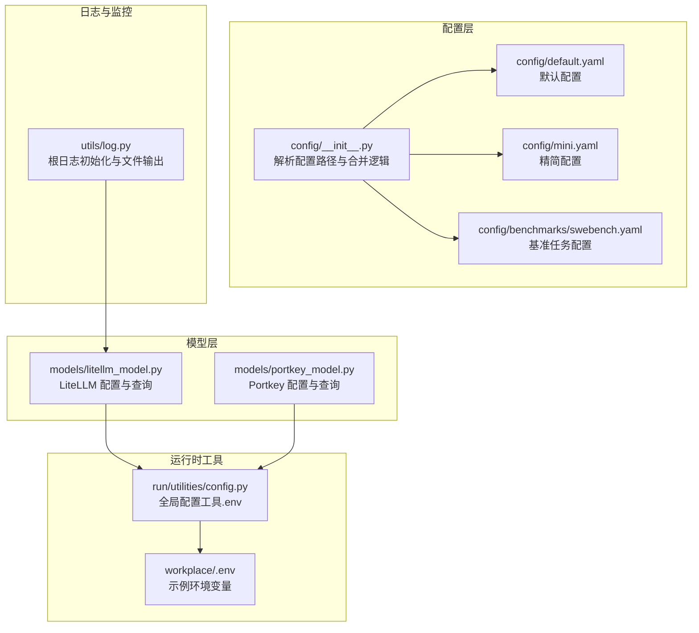
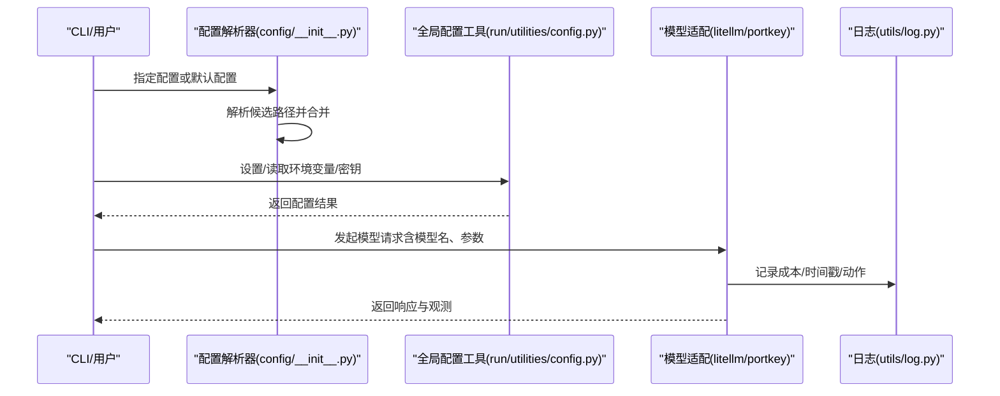
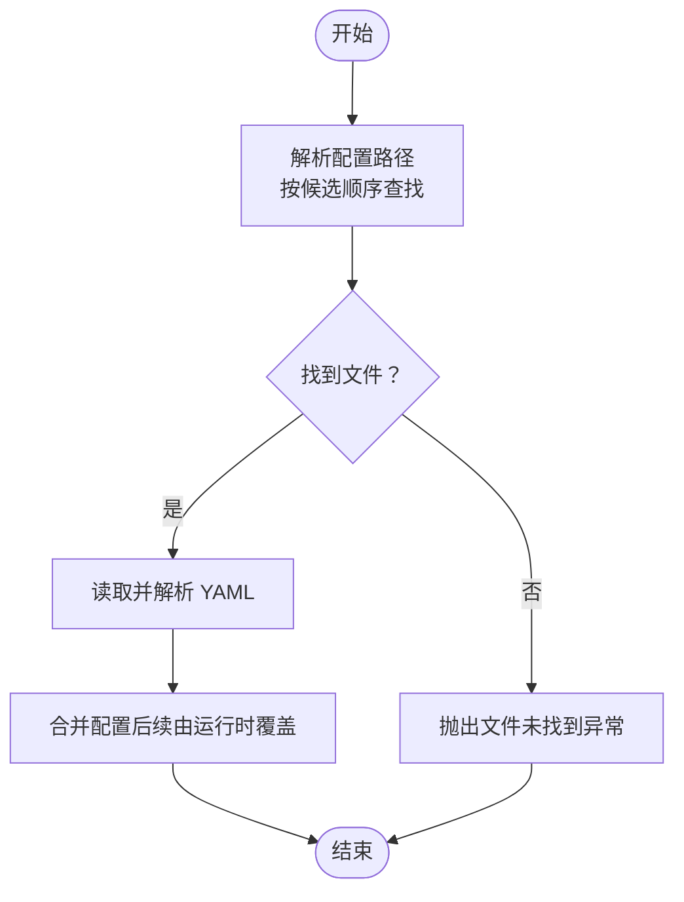
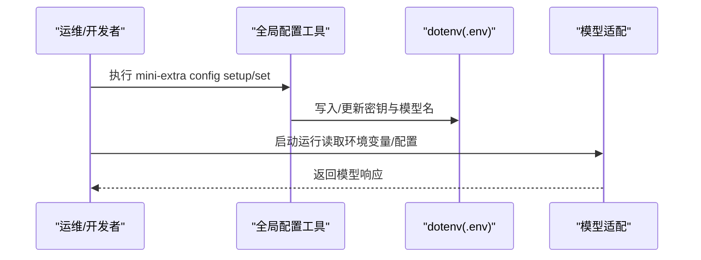
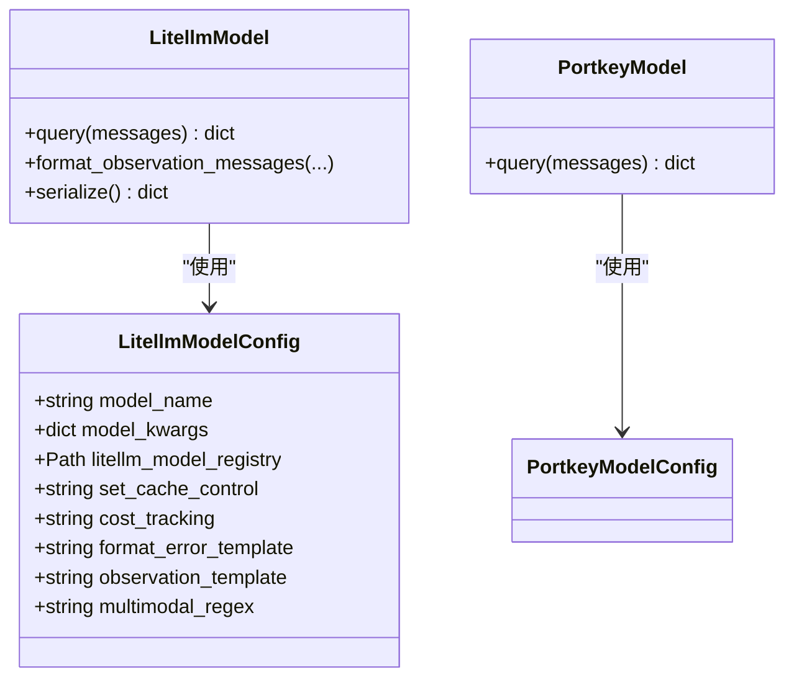
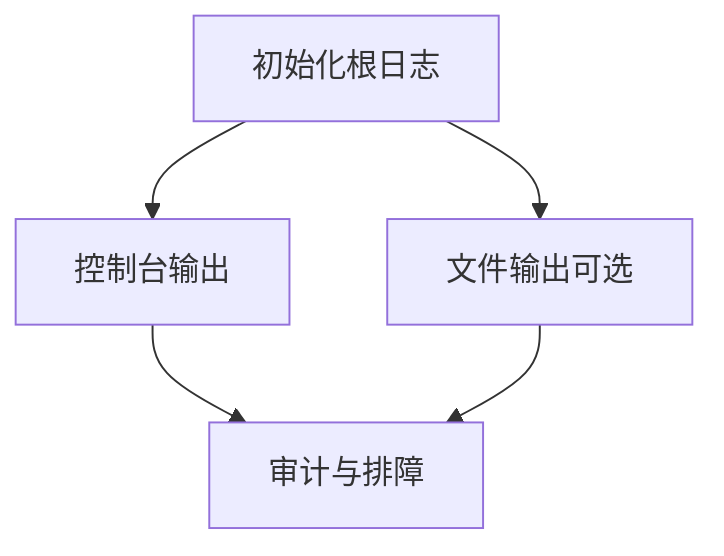
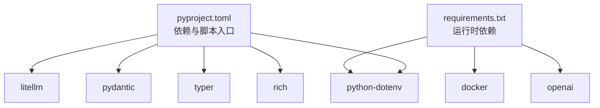

# 生产环境配置

<cite>
**本文引用的文件**
- [workplace/src/minisweagent/config/default.yaml](file://workplace/src/minisweagent/config/default.yaml)
- [workplace/src/minisweagent/config/mini.yaml](file://workplace/src/minisweagent/config/mini.yaml)
- [workplace/src/minisweagent/config/benchmarks/swebench.yaml](file://workplace/src/minisweagent/config/benchmarks/swebench.yaml)
- [workplace/src/minisweagent/config/__init__.py](file://workplace/src/minisweagent/config/__init__.py)
- [workplace/src/minisweagent/run/utilities/config.py](file://workplace/src/minisweagent/run/utilities/config.py)
- [workplace/src/minisweagent/models/litellm_model.py](file://workplace/src/minisweagent/models/litellm_model.py)
- [workplace/src/minisweagent/models/portkey_model.py](file://workplace/src/minisweagent/models/portkey_model.py)
- [workplace/src/minisweagent/utils/log.py](file://workplace/src/minisweagent/utils/log.py)
- [workplace/.env](file://workplace/.env)
- [.env.example](file://.env.example)
- [requirements.txt](file://requirements.txt)
- [workplace/pyproject.toml](file://workplace/pyproject.toml)
- [workplace/docs/faq.md](file://workplace/docs/faq.md)
- [workplace/docs/models/quickstart.md](file://workplace/docs/models/quickstart.md)
</cite>

## 目录
1. [简介](#简介)
2. [项目结构](#项目结构)
3. [核心组件](#核心组件)
4. [架构总览](#架构总览)
5. [详细组件分析](#详细组件分析)
6. [依赖关系分析](#依赖关系分析)
7. [性能考虑](#性能考虑)
8. [故障排查指南](#故障排查指南)
9. [结论](#结论)
10. [附录](#附录)

## 简介
本指南面向生产部署场景，系统性阐述如何在该代码库中完成生产级配置，涵盖以下方面：
- 环境变量与密钥管理：如何设置与轮换 API 密钥、代理地址等
- 配置文件层次结构：默认配置、环境特定配置与用户自定义配置的合并策略
- 性能调优参数：并发、缓存、重试与成本追踪等
- 安全配置最佳实践：密钥轮换、访问控制与审计日志
- 监控指标配置：性能指标、错误率与资源使用跟踪

## 项目结构
该项目采用“配置文件 + 运行时工具 + 模型适配层 + 日志与监控”的分层组织方式。配置通过 YAML 文件与运行时工具共同管理；模型层通过 LiteLLM 或第三方 SDK（如 Portkey）对接多家大模型供应商；日志模块提供控制台与文件双通道输出。

图表来源
- [workplace/src/minisweagent/config/__init__.py](file://workplace/src/minisweagent/config/__init__.py#L12-L29)
- [workplace/src/minisweagent/config/default.yaml](file://workplace/src/minisweagent/config/default.yaml#L1-L167)
- [workplace/src/minisweagent/config/mini.yaml](file://workplace/src/minisweagent/config/mini.yaml#L1-L148)
- [workplace/src/minisweagent/config/benchmarks/swebench.yaml](file://workplace/src/minisweagent/config/benchmarks/swebench.yaml#L1-L178)
- [workplace/src/minisweagent/run/utilities/config.py](file://workplace/src/minisweagent/run/utilities/config.py#L1-L117)
- [workplace/src/minisweagent/models/litellm_model.py](file://workplace/src/minisweagent/models/litellm_model.py#L26-L46)
- [workplace/src/minisweagent/models/portkey_model.py](file://workplace/src/minisweagent/models/portkey_model.py#L64-L96)
- [workplace/src/minisweagent/utils/log.py](file://workplace/src/minisweagent/utils/log.py#L7-L32)
- [workplace/.env](file://workplace/.env#L1-L2)

章节来源
- [workplace/src/minisweagent/config/__init__.py](file://workplace/src/minisweagent/config/__init__.py#L12-L29)
- [workplace/src/minisweagent/config/default.yaml](file://workplace/src/minisweagent/config/default.yaml#L1-L167)
- [workplace/src/minisweagent/config/mini.yaml](file://workplace/src/minisweagent/config/mini.yaml#L1-L148)
- [workplace/src/minisweagent/config/benchmarks/swebench.yaml](file://workplace/src/minisweagent/config/benchmarks/swebench.yaml#L1-L178)
- [workplace/src/minisweagent/run/utilities/config.py](file://workplace/src/minisweagent/run/utilities/config.py#L1-L117)
- [workplace/src/minisweagent/models/litellm_model.py](file://workplace/src/minisweagent/models/litellm_model.py#L26-L46)
- [workplace/src/minisweagent/models/portkey_model.py](file://workplace/src/minisweagent/models/portkey_model.py#L64-L96)
- [workplace/src/minisweagent/utils/log.py](file://workplace/src/minisweagent/utils/log.py#L7-L32)
- [workplace/.env](file://workplace/.env#L1-L2)

## 核心组件
- 配置解析器：负责定位与合并配置文件，支持内置、extra、benchmarks 以及用户指定目录优先级。
- 全局配置工具：提供交互式设置、编辑、卸载键值，持久化到全局 .env 文件。
- 模型适配层：统一 LiteLLM 与 Portkey 的配置项，支持成本追踪、缓存控制与多模态扩展。
- 日志系统：根日志初始化与文件输出，便于生产审计与问题定位。

章节来源
- [workplace/src/minisweagent/config/__init__.py](file://workplace/src/minisweagent/config/__init__.py#L12-L29)
- [workplace/src/minisweagent/run/utilities/config.py](file://workplace/src/minisweagent/run/utilities/config.py#L51-L84)
- [workplace/src/minisweagent/models/litellm_model.py](file://workplace/src/minisweagent/models/litellm_model.py#L26-L46)
- [workplace/src/minisweagent/utils/log.py](file://workplace/src/minisweagent/utils/log.py#L7-L32)

## 架构总览
下图展示了从配置加载到模型请求再到日志记录的关键流程，体现生产环境中的配置优先级与数据流。

图表来源
- [workplace/src/minisweagent/config/__init__.py](file://workplace/src/minisweagent/config/__init__.py#L12-L29)
- [workplace/src/minisweagent/run/utilities/config.py](file://workplace/src/minisweagent/run/utilities/config.py#L58-L84)
- [workplace/src/minisweagent/models/litellm_model.py](file://workplace/src/minisweagent/models/litellm_model.py#L80-L93)
- [workplace/src/minisweagent/utils/log.py](file://workplace/src/minisweagent/utils/log.py#L21-L29)

## 详细组件分析

### 配置文件层次结构与合并策略
- 默认配置：提供通用模板、观察模板、格式化错误模板与基础参数。
- 精简配置：面向快速运行的最小可用配置，包含成本限制与交互模式。
- 基准任务配置：面向 SWE-bench 的严格约束与超时设置。
- 配置解析：按顺序在当前工作目录、MSWEA_CONFIG_DIR、内置目录、extra、benchmarks 目录查找并返回首个存在的 YAML 文件；若未找到则抛出异常。

图表来源
- [workplace/src/minisweagent/config/__init__.py](file://workplace/src/minisweagent/config/__init__.py#L12-L29)
- [workplace/src/minisweagent/config/default.yaml](file://workplace/src/minisweagent/config/default.yaml#L1-L167)
- [workplace/src/minisweagent/config/mini.yaml](file://workplace/src/minisweagent/config/mini.yaml#L1-L148)
- [workplace/src/minisweagent/config/benchmarks/swebench.yaml](file://workplace/src/minisweagent/config/benchmarks/swebench.yaml#L1-L178)

章节来源
- [workplace/src/minisweagent/config/__init__.py](file://workplace/src/minisweagent/config/__init__.py#L12-L29)
- [workplace/src/minisweagent/config/default.yaml](file://workplace/src/minisweagent/config/default.yaml#L1-L167)
- [workplace/src/minisweagent/config/mini.yaml](file://workplace/src/minisweagent/config/mini.yaml#L1-L148)
- [workplace/src/minisweagent/config/benchmarks/swebench.yaml](file://workplace/src/minisweagent/config/benchmarks/swebench.yaml#L1-L178)

### 环境变量与密钥管理
- 环境变量来源：
  - 示例文件：workplace/.env 提供 OPENAI_API_KEY 与 OPENAI_API_BASE 的示例。
  - 全局配置工具：通过 mini-extra config set/unset/edit 持久化到全局 .env 文件，并支持交互式输入。
  - 文档指引：FAQ 与模型快速入门文档提供了设置默认模型与 API 密钥的多种方式。
- 密钥轮换建议：
  - 使用全局配置工具定期更新密钥，避免硬编码于代码或脚本。
  - 对于多实例或多租户场景，建议为不同供应商准备独立密钥并结合环境隔离。
- 第三方服务配置：
  - LiteLLM 支持通过环境变量与模型注册表进行成本追踪与元数据管理。
  - Portkey 模型需设置 PORTKEY_API_KEY 与可选的虚拟密钥或提供商参数。

图表来源
- [workplace/src/minisweagent/run/utilities/config.py](file://workplace/src/minisweagent/run/utilities/config.py#L58-L84)
- [workplace/.env](file://workplace/.env#L1-L2)
- [workplace/docs/faq.md](file://workplace/docs/faq.md#L68-L99)
- [workplace/docs/models/quickstart.md](file://workplace/docs/models/quickstart.md#L1-L17)
- [workplace/src/minisweagent/models/litellm_model.py](file://workplace/src/minisweagent/models/litellm_model.py#L35-L36)
- [workplace/src/minisweagent/models/portkey_model.py](file://workplace/src/minisweagent/models/portkey_model.py#L72-L88)

章节来源
- [workplace/src/minisweagent/run/utilities/config.py](file://workplace/src/minisweagent/run/utilities/config.py#L58-L84)
- [workplace/.env](file://workplace/.env#L1-L2)
- [workplace/docs/faq.md](file://workplace/docs/faq.md#L68-L99)
- [workplace/docs/models/quickstart.md](file://workplace/docs/models/quickstart.md#L1-L17)
- [workplace/src/minisweagent/models/litellm_model.py](file://workplace/src/minisweagent/models/litellm_model.py#L35-L36)
- [workplace/src/minisweagent/models/portkey_model.py](file://workplace/src/minisweagent/models/portkey_model.py#L72-L88)

### 模型配置与成本追踪
- LiteLLM 模型配置项：
  - 模型名与额外参数传递给 API
  - 可选的成本追踪模式（默认/忽略错误），用于统计与告警
  - 观察模板与格式化错误模板，确保输出一致性
  - 缓存控制标记与多模态正则，提升稳定性与兼容性
- Portkey 模型配置项：
  - 必须设置 PORTKEY_API_KEY，可选虚拟密钥或提供商参数
  - 通过客户端封装统一调用接口

图表来源
- [workplace/src/minisweagent/models/litellm_model.py](file://workplace/src/minisweagent/models/litellm_model.py#L26-L46)
- [workplace/src/minisweagent/models/litellm_model.py](file://workplace/src/minisweagent/models/litellm_model.py#L80-L93)
- [workplace/src/minisweagent/models/portkey_model.py](file://workplace/src/minisweagent/models/portkey_model.py#L64-L96)

章节来源
- [workplace/src/minisweagent/models/litellm_model.py](file://workplace/src/minisweagent/models/litellm_model.py#L26-L46)
- [workplace/src/minisweagent/models/litellm_model.py](file://workplace/src/minisweagent/models/litellm_model.py#L95-L113)
- [workplace/src/minisweagent/models/portkey_model.py](file://workplace/src/minisweagent/models/portkey_model.py#L64-L96)

### 日志与审计
- 根日志初始化：设置级别与控制台输出格式
- 文件输出：可添加文件处理器以实现审计日志持久化
- 建议：生产环境开启文件日志，按天滚动并保留必要字段（时间戳、级别、消息、模型名、耗时、成本）

图表来源
- [workplace/src/minisweagent/utils/log.py](file://workplace/src/minisweagent/utils/log.py#L7-L32)

章节来源
- [workplace/src/minisweagent/utils/log.py](file://workplace/src/minisweagent/utils/log.py#L7-L32)

## 依赖关系分析
- 语言与包管理：Python 版本要求、依赖声明与可选依赖（dev、modal、full）
- 关键依赖：
  - pydantic：配置模型校验
  - litellm：统一模型调用与成本追踪
  - python-dotenv：.env 文件读写
  - rich、typer：命令行与富文本输出
  - requests、jinja2：网络与模板渲染

图表来源
- [workplace/pyproject.toml](file://workplace/pyproject.toml#L33-L48)
- [requirements.txt](file://requirements.txt#L1-L4)

章节来源
- [workplace/pyproject.toml](file://workplace/pyproject.toml#L33-L48)
- [requirements.txt](file://requirements.txt#L1-L4)

## 性能考虑
- 并发与重试：
  - 模型层使用带重试机制的查询流程，减少瞬时失败对吞吐的影响
  - 建议在容器/集群环境中限制并发数，结合队列与限流策略
- 缓存与成本追踪：
  - LiteLLM 支持显式缓存控制标记，降低重复请求成本
  - 成本追踪模式可选择忽略错误，避免非关键错误阻断主流程
- 内存与输出截断：
  - 观察模板对长输出进行截断与警告，防止内存溢出
  - 建议在生产中设置合理的 step_limit 与 cost_limit，避免资源滥用
- 环境变量优化：
  - 在 workplace/.env 中预设 OPENAI_API_BASE 以减少网络往返
  - 使用 MSWEA_COST_TRACKING 控制成本追踪行为

章节来源
- [workplace/src/minisweagent/models/litellm_model.py](file://workplace/src/minisweagent/models/litellm_model.py#L80-L93)
- [workplace/src/minisweagent/models/litellm_model.py](file://workplace/src/minisweagent/models/litellm_model.py#L95-L113)
- [workplace/src/minisweagent/config/default.yaml](file://workplace/src/minisweagent/config/default.yaml#L114-L141)
- [workplace/src/minisweagent/config/mini.yaml](file://workplace/src/minisweagent/config/mini.yaml#L112-L128)
- [workplace/src/minisweagent/config/benchmarks/swebench.yaml](file://workplace/src/minisweagent/config/benchmarks/swebench.yaml#L128-L155)
- [workplace/.env](file://workplace/.env#L1-L2)

## 故障排查指南
- API 密钥相关问题：
  - FAQ 与快速入门文档提供了设置与查看密钥的方法
  - 若出现认证错误，模型层会在异常信息中提示使用全局配置工具设置密钥
- 配置文件未找到：
  - 配置解析器会按候选路径查找，若均不存在则抛出异常
  - 建议检查配置文件命名、后缀与路径
- 日志与审计：
  - 启用文件日志以便长期留存与回溯
  - 结合模型层的成本与时间戳字段进行问题定位

章节来源
- [workplace/docs/faq.md](file://workplace/docs/faq.md#L68-L99)
- [workplace/docs/models/quickstart.md](file://workplace/docs/models/quickstart.md#L10-L17)
- [workplace/src/minisweagent/models/litellm_model.py](file://workplace/src/minisweagent/models/litellm_model.py#L71-L73)
- [workplace/src/minisweagent/config/__init__.py](file://workplace/src/minisweagent/config/__init__.py#L24-L28)
- [workplace/src/minisweagent/utils/log.py](file://workplace/src/minisweagent/utils/log.py#L21-L29)

## 结论
通过明确的配置层次、完善的密钥管理与模型适配层、以及可审计的日志体系，该代码库能够满足生产环境对安全性、可观测性与稳定性的要求。建议在生产中：
- 使用全局配置工具集中管理密钥与模型名
- 启用文件日志与成本追踪，建立监控与告警
- 合理设置并发、缓存与输出截断策略，保障资源使用可控

## 附录
- 环境变量清单（示例与用途）
  - OPENAI_API_KEY：OpenAI API 密钥
  - OPENAI_API_BASE：OpenAI 代理/自建网关地址
  - MSWEA_MODEL_NAME：默认模型名称（含供应商前缀）
  - MSWEA_COST_TRACKING：成本追踪模式（默认/忽略错误）
  - PORTKEY_API_KEY：Portkey API 密钥
  - PORTKEY_VIRTUAL_KEY：Portkey 虚拟密钥（可选）
  - MSWEA_CONFIG_DIR：自定义配置目录（影响配置解析优先级）
- 常用命令
  - 初始化与设置：mini-extra config setup
  - 设置键值：mini-extra config set <KEY> <VALUE>
  - 卸载键值：mini-extra config unset <KEY>
  - 编辑配置：mini-extra config edit

章节来源
- [workplace/.env](file://workplace/.env#L1-L2)
- [workplace/src/minisweagent/run/utilities/config.py](file://workplace/src/minisweagent/run/utilities/config.py#L58-L84)
- [workplace/src/minisweagent/models/litellm_model.py](file://workplace/src/minisweagent/models/litellm_model.py#L35-L36)
- [workplace/src/minisweagent/models/portkey_model.py](file://workplace/src/minisweagent/models/portkey_model.py#L72-L88)
- [workplace/src/minisweagent/config/__init__.py](file://workplace/src/minisweagent/config/__init__.py#L17-L23)