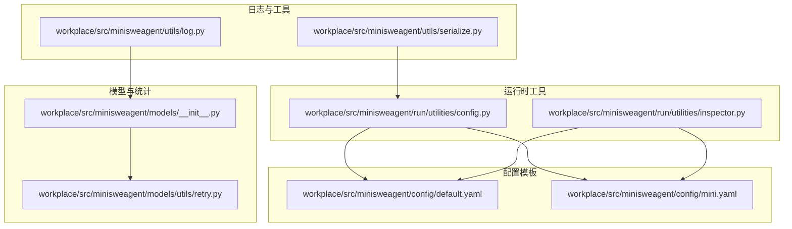
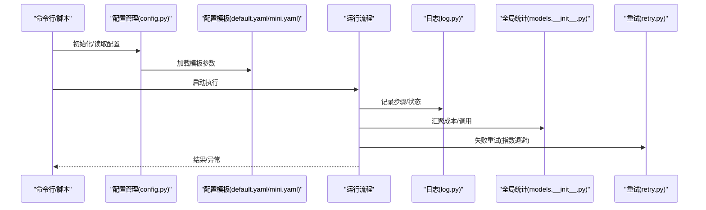
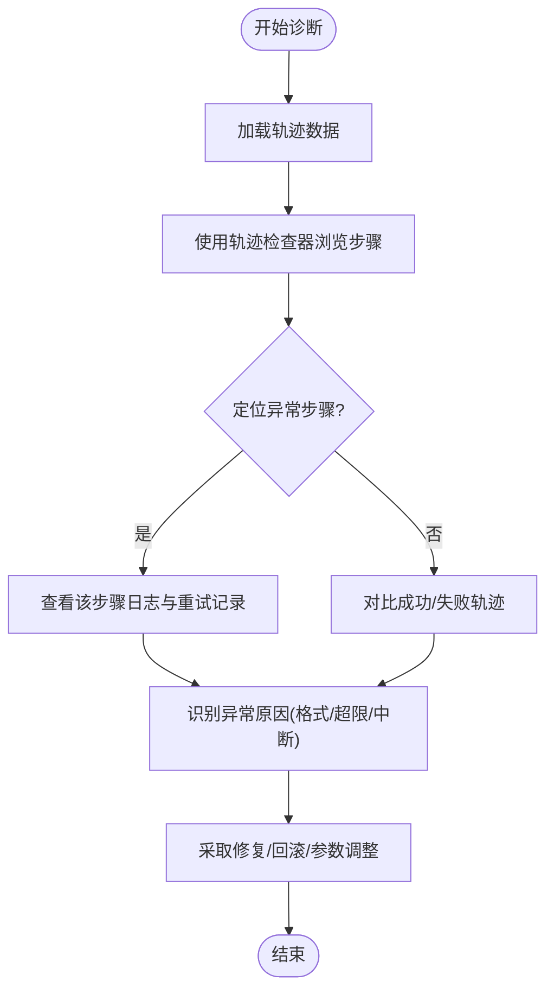
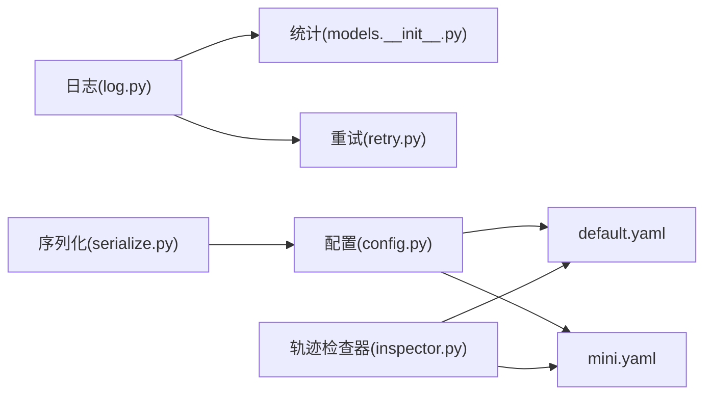

# 监控与维护

<cite>
**本文引用的文件**
- [workplace/src/minisweagent/utils/log.py](file://workplace/src/minisweagent/utils/log.py)
- [workplace/src/minisweagent/run/utilities/inspector.py](file://workplace/src/minisweagent/run/utilities/inspector.py)
- [workplace/src/minisweagent/models/__init__.py](file://workplace/src/minisweagent/models/__init__.py)
- [workplace/src/minisweagent/models/utils/retry.py](file://workplace/src/minisweagent/models/utils/retry.py)
- [workplace/src/minisweagent/run/utilities/config.py](file://workplace/src/minisweagent/run/utilities/config.py)
- [workplace/src/minisweagent/config/default.yaml](file://workplace/src/minisweagent/config/default.yaml)
- [workplace/src/minisweagent/config/mini.yaml](file://workplace/src/minisweagent/config/mini.yaml)
- [workplace/src/minisweagent/exceptions.py](file://workplace/src/minisweagent/exceptions.py)
- [workplace/src/minisweagent/utils/serialize.py](file://workplace/src/minisweagent/utils/serialize.py)
- [requirements.txt](file://requirements.txt)
</cite>

## 目录
1. [简介](#简介)
2. [项目结构](#项目结构)
3. [核心组件](#核心组件)
4. [架构总览](#架构总览)
5. [详细组件分析](#详细组件分析)
6. [依赖关系分析](#依赖关系分析)
7. [性能考虑](#性能考虑)
8. [故障排查指南](#故障排查指南)
9. [结论](#结论)
10. [附录](#附录)

## 简介
本指南面向系统运维与开发人员，围绕日志配置与分析、性能监控指标、故障诊断方法、系统维护任务以及告警与通知机制进行系统化说明。结合代码库中的日志模块、全局统计与重试策略、配置管理与轨迹检查器等能力，帮助您建立可操作的监控与维护体系。

## 项目结构
本项目采用“功能域+层次化”组织方式：日志与工具位于 utils，模型与统计位于 models，运行时工具（配置、检查器）位于 run/utilities，配置模板位于 config。下图展示与监控维护直接相关的模块关系：

图表来源
- [workplace/src/minisweagent/utils/log.py](file://workplace/src/minisweagent/utils/log.py#L1-L37)
- [workplace/src/minisweagent/models/__init__.py](file://workplace/src/minisweagent/models/__init__.py#L1-L42)
- [workplace/src/minisweagent/models/utils/retry.py](file://workplace/src/minisweagent/models/utils/retry.py#L1-L25)
- [workplace/src/minisweagent/run/utilities/config.py](file://workplace/src/minisweagent/run/utilities/config.py#L1-L117)
- [workplace/src/minisweagent/run/utilities/inspector.py](file://workplace/src/minisweagent/run/utilities/inspector.py#L1-L290)
- [workplace/src/minisweagent/config/default.yaml](file://workplace/src/minisweagent/config/default.yaml#L1-L167)
- [workplace/src/minisweagent/config/mini.yaml](file://workplace/src/minisweagent/config/mini.yaml#L1-L148)
- [workplace/src/minisweagent/utils/serialize.py](file://workplace/src/minisweagent/utils/serialize.py#L1-L30)

章节来源
- [workplace/src/minisweagent/utils/log.py](file://workplace/src/minisweagent/utils/log.py#L1-L37)
- [workplace/src/minisweagent/models/__init__.py](file://workplace/src/minisweagent/models/__init__.py#L1-L42)
- [workplace/src/minisweagent/models/utils/retry.py](file://workplace/src/minisweagent/models/utils/retry.py#L1-L25)
- [workplace/src/minisweagent/run/utilities/config.py](file://workplace/src/minisweagent/run/utilities/config.py#L1-L117)
- [workplace/src/minisweagent/run/utilities/inspector.py](file://workplace/src/minisweagent/run/utilities/inspector.py#L1-L290)
- [workplace/src/minisweagent/config/default.yaml](file://workplace/src/minisweagent/config/default.yaml#L1-L167)
- [workplace/src/minisweagent/config/mini.yaml](file://workplace/src/minisweagent/config/mini.yaml#L1-L148)
- [workplace/src/minisweagent/utils/serialize.py](file://workplace/src/minisweagent/utils/serialize.py#L1-L30)

## 核心组件
- 日志子系统：统一根日志器、控制台输出与文件落盘，支持结构化格式与路径打印提示。
- 全局统计与限制：全局成本/调用次数统计，环境变量驱动的上限与静默启动行为。
- 重试策略：基于 tenacity 的指数退避重试，可配置最大尝试次数与中止异常类型。
- 配置管理：交互式设置/取消键值、编辑全局配置文件，支持默认与精简配置模板。
- 轨迹检查器：可视化浏览与对比任务轨迹，辅助排障与复盘。
- 异常体系：用于中断流程、提交完成、超限、用户中断与格式错误等场景。

章节来源
- [workplace/src/minisweagent/utils/log.py](file://workplace/src/minisweagent/utils/log.py#L1-L37)
- [workplace/src/minisweagent/models/__init__.py](file://workplace/src/minisweagent/models/__init__.py#L1-L42)
- [workplace/src/minisweagent/models/utils/retry.py](file://workplace/src/minisweagent/models/utils/retry.py#L1-L25)
- [workplace/src/minisweagent/run/utilities/config.py](file://workplace/src/minisweagent/run/utilities/config.py#L1-L117)
- [workplace/src/minisweagent/run/utilities/inspector.py](file://workplace/src/minisweagent/run/utilities/inspector.py#L1-L290)
- [workplace/src/minisweagent/exceptions.py](file://workplace/src/minisweagent/exceptions.py#L1-L23)

## 架构总览
下图展示从运行到观测的关键链路：命令入口通过配置与模板加载，执行模型调用与动作，期间由日志记录、统计与重试协同保障；异常与轨迹数据为后续诊断提供依据。

图表来源
- [workplace/src/minisweagent/run/utilities/config.py](file://workplace/src/minisweagent/run/utilities/config.py#L1-L117)
- [workplace/src/minisweagent/config/default.yaml](file://workplace/src/minisweagent/config/default.yaml#L1-L167)
- [workplace/src/minisweagent/config/mini.yaml](file://workplace/src/minisweagent/config/mini.yaml#L1-L148)
- [workplace/src/minisweagent/utils/log.py](file://workplace/src/minisweagent/utils/log.py#L1-L37)
- [workplace/src/minisweagent/models/__init__.py](file://workplace/src/minisweagent/models/__init__.py#L1-L42)
- [workplace/src/minisweagent/models/utils/retry.py](file://workplace/src/minisweagent/models/utils/retry.py#L1-L25)

## 详细组件分析

### 日志配置与分析
- 控制台输出：初始化根日志器，使用富文本处理器，简洁输出格式，便于终端阅读。
- 文件落盘：可按需添加文件处理器，统一时间戳与层级格式，支持打印落盘路径提示。
- 建议实践：
  - 在生产环境启用文件处理器，并设置合适日志级别（如 DEBUG/INFO/WARNING）。
  - 使用结构化字段（时间、模块名、级别、消息）便于日志聚合与检索。
  - 对敏感信息进行脱敏处理，避免在日志中泄露密钥或令牌。
- 日志聚合策略：
  - 将应用日志与系统日志分离，分别采集与索引。
  - 通过日志标签区分环境、实例、任务ID，便于跨实例关联分析。
  - 定期轮转与压缩，保留周期按合规要求设定。

章节来源
- [workplace/src/minisweagent/utils/log.py](file://workplace/src/minisweagent/utils/log.py#L1-L37)

### 性能监控指标
- 响应时间：可通过统计模型查询耗时与动作执行耗时，结合日志时间戳计算端到端延迟。
- 吞吐量：以单位时间内 API 调用次数与处理任务数衡量，建议按分钟/小时窗口统计。
- 错误率：失败请求占比与异常类型分布，结合重试次数评估稳定性。
- 资源使用：CPU、内存、磁盘 IO 与网络带宽，结合系统监控工具采集。
- 成本与调用：全局统计模块提供累计成本与调用次数，结合环境变量限制实现预算控制。

章节来源
- [workplace/src/minisweagent/models/__init__.py](file://workplace/src/minisweagent/models/__init__.py#L1-L42)

### 故障诊断方法
- 常见错误模式识别：
  - 格式错误：模型输出不符合预期格式，触发格式错误异常。
  - 超限中断：超出成本或调用次数限制，抛出超限异常。
  - 用户中断：用户主动中断流程，触发用户中断异常。
  - 提交完成：任务完成后触发提交异常，用于收尾与归档。
- 调试工具使用：
  - 轨迹检查器：浏览与对比任务轨迹，快速定位步骤差异与异常点。
  - jless：在检查器中打开当前步或完整轨迹，进行交互式查看。
- 问题定位技巧：
  - 从日志时间线入手，结合异常类型与重试记录定位根因。
  - 使用轨迹检查器比对成功/失败案例，缩小范围。
  - 分离配置模板与运行参数，验证是否由配置变更引发问题。

图表来源
- [workplace/src/minisweagent/run/utilities/inspector.py](file://workplace/src/minisweagent/run/utilities/inspector.py#L1-L290)
- [workplace/src/minisweagent/exceptions.py](file://workplace/src/minisweagent/exceptions.py#L1-L23)

章节来源
- [workplace/src/minisweagent/run/utilities/inspector.py](file://workplace/src/minisweagent/run/utilities/inspector.py#L1-L290)
- [workplace/src/minisweagent/exceptions.py](file://workplace/src/minisweagent/exceptions.py#L1-L23)

### 系统维护任务
- 定期清理：
  - 清理过期日志文件与临时轨迹文件，避免磁盘占用增长。
  - 清理缓存目录（如模型响应缓存），释放空间。
- 备份策略：
  - 备份全局配置文件与关键运行参数，确保可快速恢复。
  - 备份轨迹数据与统计结果，满足审计与复盘需要。
- 版本升级流程：
  - 升级前先备份配置与数据，核对依赖版本兼容性。
  - 逐步替换配置模板，验证关键指标与日志无异常后再全面上线。
  - 升级后进行回归测试，关注重试策略与统计逻辑变化。

章节来源
- [workplace/src/minisweagent/run/utilities/config.py](file://workplace/src/minisweagent/run/utilities/config.py#L1-L117)
- [requirements.txt](file://requirements.txt#L1-L4)

### 告警配置与通知机制
- 告警维度建议：
  - 错误率阈值：连续窗口内错误率超过阈值触发告警。
  - 响应时间分位：P95/P99 延迟超过阈值触发告警。
  - 资源使用：CPU/内存/IO 超过阈值触发告警。
  - 成本预算：累计成本接近或超过预算触发告警。
- 通知渠道：
  - 邮件/IM 机器人/电话（根据严重等级分级）。
  - 与日志聚合平台联动，自动派单与升级。
- 与现有组件结合：
  - 利用全局统计模块的累计成本与调用次数作为预算告警依据。
  - 结合日志聚合与轨迹检查器，形成“告警—定位—修复”的闭环。

章节来源
- [workplace/src/minisweagent/models/__init__.py](file://workplace/src/minisweagent/models/__init__.py#L1-L42)
- [workplace/src/minisweagent/utils/log.py](file://workplace/src/minisweagent/utils/log.py#L1-L37)
- [workplace/src/minisweagent/run/utilities/inspector.py](file://workplace/src/minisweagent/run/utilities/inspector.py#L1-L290)

## 依赖关系分析
- 日志模块被统计与重试策略广泛使用，形成统一观测基座。
- 配置管理负责全局键值注入，模板文件决定运行参数与输出格式。
- 轨迹检查器依赖模板与序列化工具，用于可视化与对比分析。
- 重试策略与统计模块共同提升系统鲁棒性与可观测性。

图表来源
- [workplace/src/minisweagent/utils/log.py](file://workplace/src/minisweagent/utils/log.py#L1-L37)
- [workplace/src/minisweagent/models/__init__.py](file://workplace/src/minisweagent/models/__init__.py#L1-L42)
- [workplace/src/minisweagent/models/utils/retry.py](file://workplace/src/minisweagent/models/utils/retry.py#L1-L25)
- [workplace/src/minisweagent/run/utilities/config.py](file://workplace/src/minisweagent/run/utilities/config.py#L1-L117)
- [workplace/src/minisweagent/run/utilities/inspector.py](file://workplace/src/minisweagent/run/utilities/inspector.py#L1-L290)
- [workplace/src/minisweagent/config/default.yaml](file://workplace/src/minisweagent/config/default.yaml#L1-L167)
- [workplace/src/minisweagent/config/mini.yaml](file://workplace/src/minisweagent/config/mini.yaml#L1-L148)
- [workplace/src/minisweagent/utils/serialize.py](file://workplace/src/minisweagent/utils/serialize.py#L1-L30)

章节来源
- [workplace/src/minisweagent/utils/log.py](file://workplace/src/minisweagent/utils/log.py#L1-L37)
- [workplace/src/minisweagent/models/__init__.py](file://workplace/src/minisweagent/models/__init__.py#L1-L42)
- [workplace/src/minisweagent/models/utils/retry.py](file://workplace/src/minisweagent/models/utils/retry.py#L1-L25)
- [workplace/src/minisweagent/run/utilities/config.py](file://workplace/src/minisweagent/run/utilities/config.py#L1-L117)
- [workplace/src/minisweagent/run/utilities/inspector.py](file://workplace/src/minisweagent/run/utilities/inspector.py#L1-L290)
- [workplace/src/minisweagent/config/default.yaml](file://workplace/src/minisweagent/config/default.yaml#L1-L167)
- [workplace/src/minisweagent/config/mini.yaml](file://workplace/src/minisweagent/config/mini.yaml#L1-L148)
- [workplace/src/minisweagent/utils/serialize.py](file://workplace/src/minisweagent/utils/serialize.py#L1-L30)

## 性能考虑
- 日志开销：在高并发场景下，建议降低日志级别或启用异步写入，避免阻塞主流程。
- 重试策略：合理设置最大尝试次数与等待间隔，避免雪崩效应；对幂等性差的操作谨慎重试。
- 统计精度：全局统计使用锁保护，注意在高频调用下的锁竞争；必要时拆分统计维度。
- 轨迹体积：轨迹文件可能较大，建议按任务拆分存储与压缩，减少 I/O 压力。

## 故障排查指南
- 快速定位
  - 使用轨迹检查器对比成功/失败案例，确认异常步骤。
  - 检查日志中重试记录与异常类型，判断是格式错误、超限还是外部服务异常。
- 常见场景
  - 格式错误：调整模板或增加格式校验提示，减少格式错误导致的失败。
  - 超限中断：提高预算或优化调用策略，避免不必要的重复调用。
  - 用户中断：完善中断后的恢复流程，保证可重入性。
- 工具链
  - 配置管理：通过交互式命令设置/取消键值，快速验证参数影响。
  - 序列化工具：递归合并配置字典，避免嵌套 UNSET 导致的配置缺失。

章节来源
- [workplace/src/minisweagent/run/utilities/inspector.py](file://workplace/src/minisweagent/run/utilities/inspector.py#L1-L290)
- [workplace/src/minisweagent/exceptions.py](file://workplace/src/minisweagent/exceptions.py#L1-L23)
- [workplace/src/minisweagent/run/utilities/config.py](file://workplace/src/minisweagent/run/utilities/config.py#L1-L117)
- [workplace/src/minisweagent/utils/serialize.py](file://workplace/src/minisweagent/utils/serialize.py#L1-L30)

## 结论
通过统一的日志基座、全局统计与重试策略、交互式配置与轨迹检查器，本项目提供了完善的监控与维护基础。建议在生产环境中启用结构化日志与文件落盘、设置合理的成本与调用上限、结合告警与通知机制形成闭环，持续优化性能与稳定性。

## 附录
- 配置模板位置
  - 默认模板：workplace/src/minisweagent/config/default.yaml
  - 精简模板：workplace/src/minisweagent/config/mini.yaml
- 关键环境变量
  - 全局成本/调用限制：MSWEA_GLOBAL_COST_LIMIT、MSWEA_GLOBAL_CALL_LIMIT
  - 静默启动：MSWEA_SILENT_STARTUP
  - 模型重试次数：MSWEA_MODEL_RETRY_STOP_AFTER_ATTEMPT
  - 成本跟踪模式：MSWEA_COST_TRACKING
- 依赖清单
  - requirements.txt 中列出的依赖项，确保运行环境一致

章节来源
- [workplace/src/minisweagent/config/default.yaml](file://workplace/src/minisweagent/config/default.yaml#L1-L167)
- [workplace/src/minisweagent/config/mini.yaml](file://workplace/src/minisweagent/config/mini.yaml#L1-L148)
- [workplace/src/minisweagent/models/__init__.py](file://workplace/src/minisweagent/models/__init__.py#L1-L42)
- [workplace/src/minisweagent/models/utils/retry.py](file://workplace/src/minisweagent/models/utils/retry.py#L1-L25)
- [requirements.txt](file://requirements.txt#L1-L4)