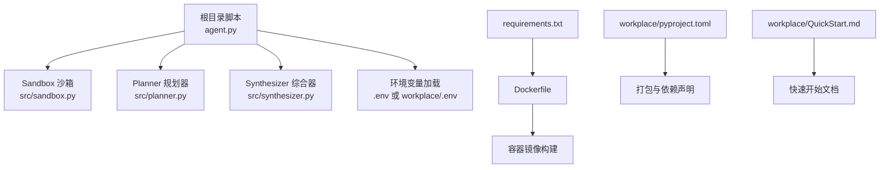
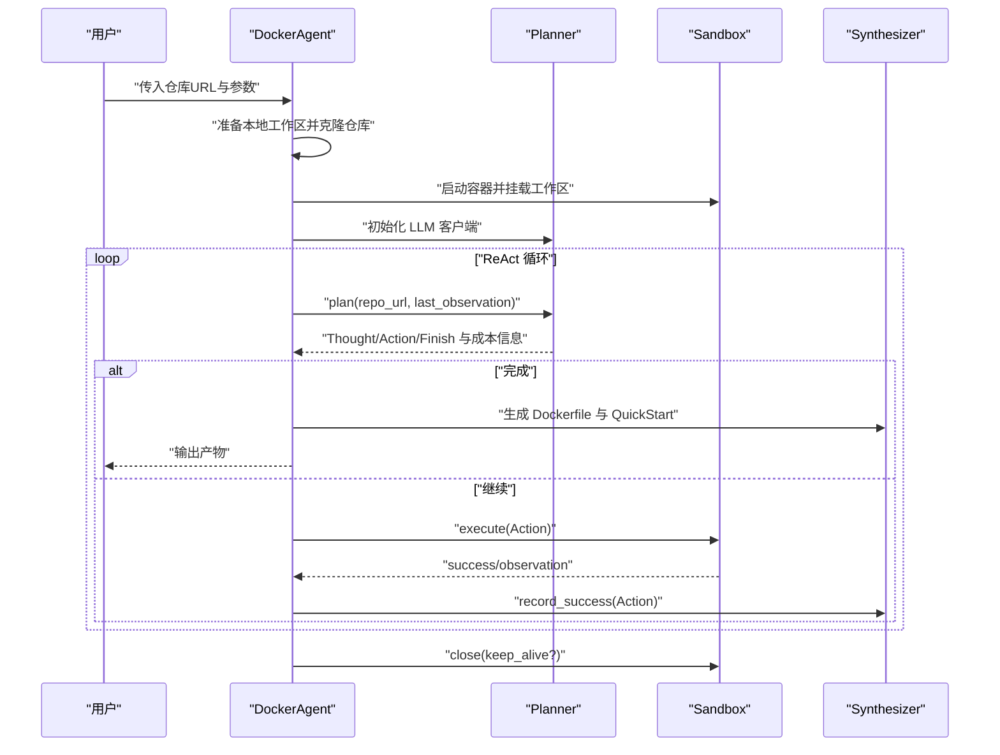
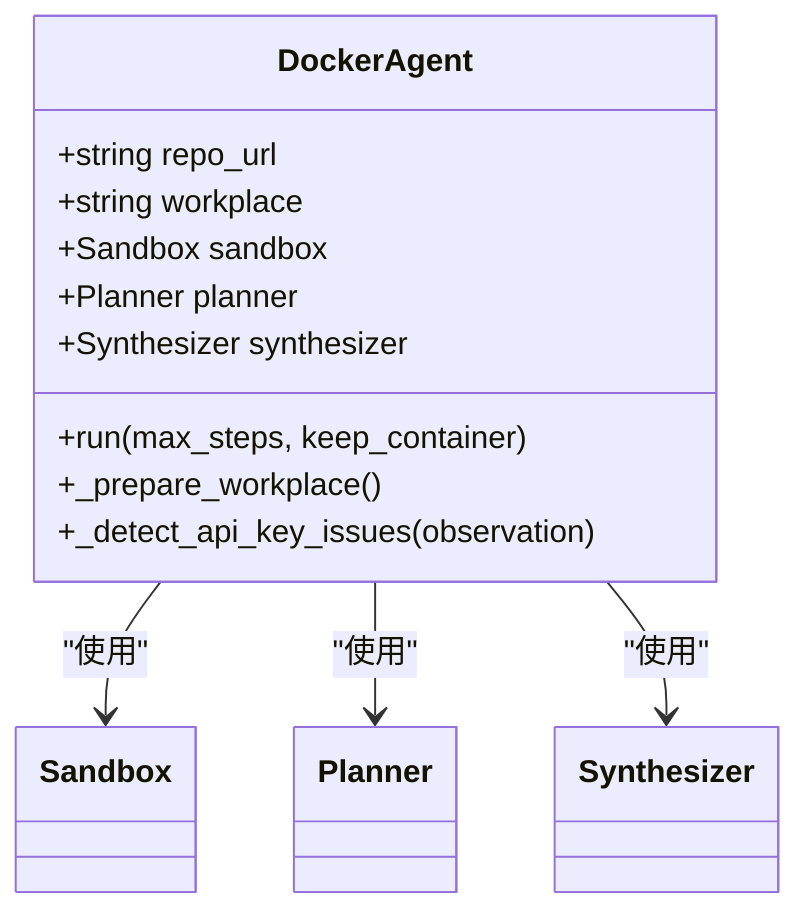
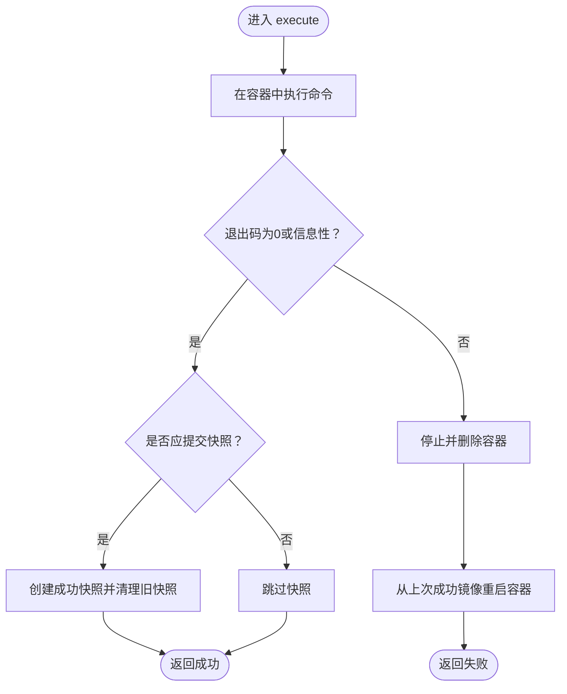
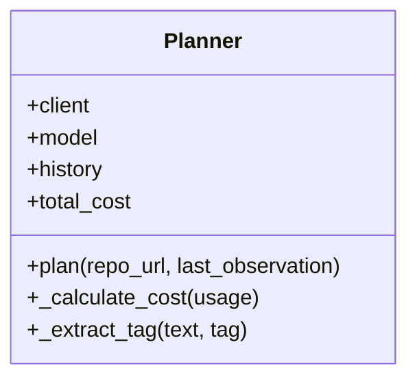
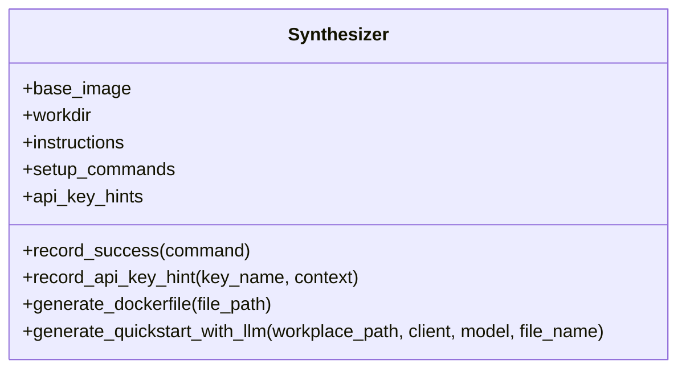
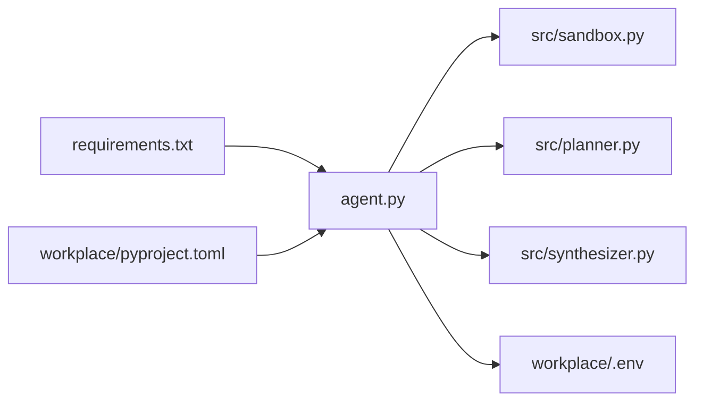

# 部署运维

<cite>
**本文引用的文件**
- [Dockerfile](file://Dockerfile)
- [requirements.txt](file://requirements.txt)
- [README.md](file://README.md)
- [agent.py](file://agent.py)
- [src/sandbox.py](file://src/sandbox.py)
- [src/planner.py](file://src/planner.py)
- [src/synthesizer.py](file://src/synthesizer.py)
- [workplace/.env](file://workplace/.env)
- [workplace/pyproject.toml](file://workplace/pyproject.toml)
- [workplace/QuickStart.md](file://workplace/QuickStart.md)
- [workplace/.github/dependabot.yml](file://workplace/.github/dependabot.yml)
- [workplace/mkdocs.yml](file://workplace/mkdocs.yml)
- [workplace/src/minisweagent/__main__.py](file://workplace/src/minisweagent/__main__.py)
</cite>

## 目录
1. [简介](#简介)
2. [项目结构](#项目结构)
3. [核心组件](#核心组件)
4. [架构总览](#架构总览)
5. [详细组件分析](#详细组件分析)
6. [依赖关系分析](#依赖关系分析)
7. [性能考虑](#性能考虑)
8. [CI/CD 集成](#cicd-集成)
9. [生产环境配置指南](#生产环境配置指南)
10. [故障排除指南](#故障排除指南)
11. [结论](#结论)
12. [附录](#附录)

## 简介
本文件面向“Repo Dockerizer Agent”项目的部署与运维，覆盖以下主题：
- Docker 部署方式：Dockerfile 使用、容器配置与最佳实践
- 生产环境配置：环境变量管理、日志与监控设置
- CI/CD 集成：GitHub Actions 工作流配置与自动化部署
- 性能监控与资源管理：内存使用优化与并发控制
- 故障排除与维护：日志分析、错误诊断与系统优化

## 项目结构
该项目采用“根目录脚本 + 子模块组件”的组织方式，核心入口为根目录的命令行脚本，功能由 src 下的模块实现；同时提供 workplace 目录下的打包与文档体系参考。

图表来源
- [agent.py](file://agent.py#L1-L160)
- [src/sandbox.py](file://src/sandbox.py#L1-L178)
- [src/planner.py](file://src/planner.py#L1-L145)
- [src/synthesizer.py](file://src/synthesizer.py#L1-L144)
- [Dockerfile](file://Dockerfile#L1-L7)
- [requirements.txt](file://requirements.txt#L1-L4)
- [workplace/pyproject.toml](file://workplace/pyproject.toml#L1-L282)
- [workplace/QuickStart.md](file://workplace/QuickStart.md#L1-L46)

章节来源
- [README.md](file://README.md#L1-L47)
- [agent.py](file://agent.py#L1-L160)

## 核心组件
- DockerAgent：负责准备本地工作区、初始化沙箱容器、构造 LLM 客户端、驱动 ReAct 循环、合成最终产物。
- Sandbox：通过 Docker SDK 在容器内执行命令，具备基于 commit 的回滚能力，支持只对有副作用的命令进行快照。
- Planner：以 ReAct 思维链格式生成下一步动作，内置成本统计与历史对话管理。
- Synthesizer：记录成功的命令序列，生成 Dockerfile 与 QuickStart 文档，并在必要时提示缺失的 API Key。

章节来源
- [agent.py](file://agent.py#L14-L126)
- [src/sandbox.py](file://src/sandbox.py#L4-L178)
- [src/planner.py](file://src/planner.py#L3-L145)
- [src/synthesizer.py](file://src/synthesizer.py#L1-L144)

## 架构总览
下图展示 Agent 的端到端执行流程：从克隆仓库、在容器中执行命令、到最终生成 Dockerfile 与 QuickStart 文档。

图表来源
- [agent.py](file://agent.py#L60-L126)
- [src/planner.py](file://src/planner.py#L69-L105)
- [src/sandbox.py](file://src/sandbox.py#L29-L91)
- [src/synthesizer.py](file://src/synthesizer.py#L9-L31)

## 详细组件分析

### DockerAgent 组件
- 职责：准备工作区、初始化容器、构造 LLM 客户端、驱动 ReAct 循环、生成最终产物。
- 关键点：
  - 通过环境变量加载 OPENAI_API_KEY，支持自定义 base_url。
  - 将本地工作区挂载到容器 /app，确保命令执行与文件持久化。
  - 支持最大步数限制与容器保留选项，便于排障。

图表来源
- [agent.py](file://agent.py#L14-L126)

章节来源
- [agent.py](file://agent.py#L14-L160)

### Sandbox 组件
- 职责：在容器内执行命令，具备回滚与快照能力，过滤只读命令，避免无意义镜像膨胀。
- 关键点：
  - 对成功且有副作用的命令进行 commit 快照，失败时回滚至上一成功镜像。
  - 提供 keep-alive 选项，便于手动检查容器状态。
  - 自动清理中间镜像与成功快照镜像，降低磁盘占用。

图表来源
- [src/sandbox.py](file://src/sandbox.py#L29-L91)

章节来源
- [src/sandbox.py](file://src/sandbox.py#L4-L178)

### Planner 组件
- 职责：以 ReAct 格式生成下一步动作，记录对话历史，计算 Token 成本。
- 关键点：
  - 系统提示限定环境约束（不可使用宿主机 Docker 命令等）。
  - 严格解析 Thought 与 Action，支持提前结束条件。
  - 内置多模型定价表，按模型单价与 Token 数量累计成本。

图表来源
- [src/planner.py](file://src/planner.py#L3-L145)

章节来源
- [src/planner.py](file://src/planner.py#L3-L145)

### Synthesizer 组件
- 职责：记录成功的命令，生成 Dockerfile 与 QuickStart 文档；识别缺失的 API Key 并提示配置方法。
- 关键点：
  - 仅记录安装/配置类命令，过滤纯查看类指令。
  - 通过 LLM 基于 README 与真实安装命令生成简洁的 QuickStart。
  - 支持记录 API Key 提示，辅助后续配置。

图表来源
- [src/synthesizer.py](file://src/synthesizer.py#L1-L144)

章节来源
- [src/synthesizer.py](file://src/synthesizer.py#L1-L144)

## 依赖关系分析
- 运行时依赖：OpenAI SDK、Docker SDK、dotenv、以及若干 Python 包。
- 构建依赖：pyproject.toml 中声明了打包与开发工具链。
- 环境变量：OPENAI_API_KEY 为必需项，可选 OPENAI_API_BASE。

图表来源
- [agent.py](file://agent.py#L1-L10)
- [requirements.txt](file://requirements.txt#L1-L4)
- [workplace/pyproject.toml](file://workplace/pyproject.toml#L33-L48)

章节来源
- [agent.py](file://agent.py#L1-L12)
- [requirements.txt](file://requirements.txt#L1-L4)
- [workplace/pyproject.toml](file://workplace/pyproject.toml#L33-L48)

## 性能考虑
- 容器快照与回滚
  - 仅对有副作用的命令进行 commit，减少镜像层数量与磁盘占用。
  - 失败时回滚至上一成功镜像，避免状态污染。
- 步数与成本控制
  - 通过最大步数限制防止无限循环。
  - Planner 内置 Token 成本统计，便于预算控制。
- 资源清理
  - 结束后清理成功快照镜像与悬空镜像，释放磁盘空间。
- 并发与隔离
  - 每次执行在独立容器中进行，避免相互干扰。
  - 建议在 CI 环境中限制并发，避免 Docker 引擎压力过大。

章节来源
- [src/sandbox.py](file://src/sandbox.py#L56-L91)
- [src/planner.py](file://src/planner.py#L107-L129)

## CI/CD 集成
- 依赖更新
  - 通过 Dependabot 定期扫描 GitHub Actions 依赖，建议开启 weekly 更新策略。
- 文档与版本
  - mkdocs.yml 配置站点主题、导航与插件，适合生成静态文档。
- 自动化建议
  - 在 CI 中执行：
    - 安装依赖（requirements.txt 或 pyproject.toml）
    - 准备 .env（含 OPENAI_API_KEY）
    - 运行 agent.py 指定仓库 URL
    - 产出 Dockerfile 与 QuickStart.md
  - 可选：将产物上传为工件或发布到制品库。

章节来源
- [workplace/.github/dependabot.yml](file://workplace/.github/dependabot.yml#L1-L8)
- [workplace/mkdocs.yml](file://workplace/mkdocs.yml#L1-L169)

## 生产环境配置指南
- 环境变量
  - OPENAI_API_KEY：必须项，用于 LLM 接口访问。
  - OPENAI_API_BASE：可选，用于代理或自定义服务端点。
  - workplace/.env 示例路径：workplace/.env。
- 日志与监控
  - 标准输出即为运行日志，包含每步 Thought/Action/观察结果与成本信息。
  - 建议在容器编排平台（如 Kubernetes）中启用日志采集与告警。
- 安全与密钥
  - 不要在日志中泄露敏感信息；若出现 API Key 相关错误，Synthesizer 会记录提示以便后续配置。
- 资源配额
  - 为容器设置 CPU/内存限制，避免单次任务占用过多资源。
  - 控制并发度，避免 Docker 引擎过载。

章节来源
- [agent.py](file://agent.py#L28-L36)
- [workplace/.env](file://workplace/.env#L1-L2)
- [src/synthesizer.py](file://src/synthesizer.py#L17-L21)

## 故障排除指南
- 常见问题定位
  - API Key 缺失：Planner 输出中若出现“Final Answer: Success”，表示配置成功；否则检查 API Key 是否正确。
  - 容器无法启动：确认 Docker Engine 已安装并运行；检查挂载路径权限。
  - 磁盘空间不足：Sandbox 会在每次成功后清理旧快照镜像，仍可能出现镜像堆积，需定期清理。
- 诊断步骤
  - 使用 keep-container 选项保留容器，进入容器内部排查。
  - 查看每步的 Observation 输出，定位失败命令。
  - 检查 API Key 提示，按提示补充 .env 或环境变量。
- 维护建议
  - 定期清理悬空镜像与不再使用的快照镜像。
  - 限制最大步数，避免长时间卡死。
  - 在 CI 中加入超时与重试策略。

章节来源
- [agent.py](file://agent.py#L127-L146)
- [src/sandbox.py](file://src/sandbox.py#L147-L178)

## 结论
本项目通过“容器 + LLM + 回滚快照”的组合，实现了对任意 GitHub 仓库的自动化 Docker 环境配置。生产部署建议关注环境变量安全、日志与监控、资源配额与并发控制，并结合 CI/CD 实现自动化交付。遇到问题时，优先检查 API Key、容器状态与磁盘空间，配合 keep-container 选项进行深入排查。

## 附录

### Docker 部署与最佳实践
- 使用根目录 Dockerfile 构建镜像，安装运行所需依赖。
- 在容器内运行 agent.py，通过参数指定仓库 URL、模型与步数。
- 最佳实践
  - 为容器设置 CPU/内存限制
  - 使用只读挂载 /app，避免意外修改宿主机文件
  - 限制最大步数，防止无限循环
  - 定期清理镜像与容器

章节来源
- [Dockerfile](file://Dockerfile#L1-L7)
- [agent.py](file://agent.py#L148-L159)

### 快速开始与产物
- QuickStart.md 由 Synthesizer 基于 README 与真实安装命令生成，包含 Setup Steps、How to Run、API Key 配置与 Notes。
- Dockerfile 由 Synthesizer 将成功命令序列转换为可复用的构建脚本。

章节来源
- [workplace/QuickStart.md](file://workplace/QuickStart.md#L1-L46)
- [src/synthesizer.py](file://src/synthesizer.py#L130-L143)