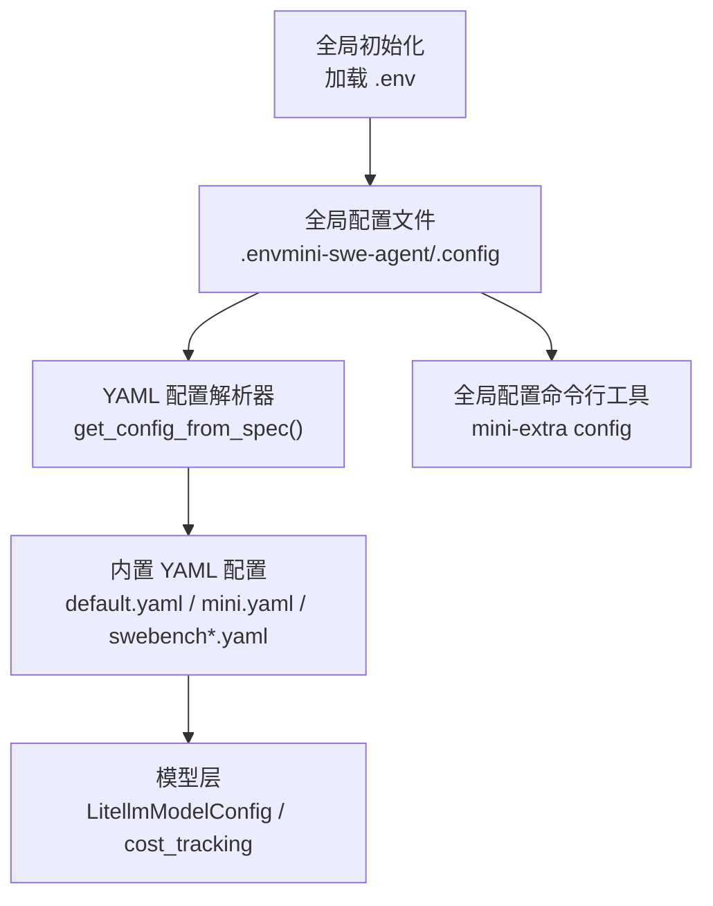
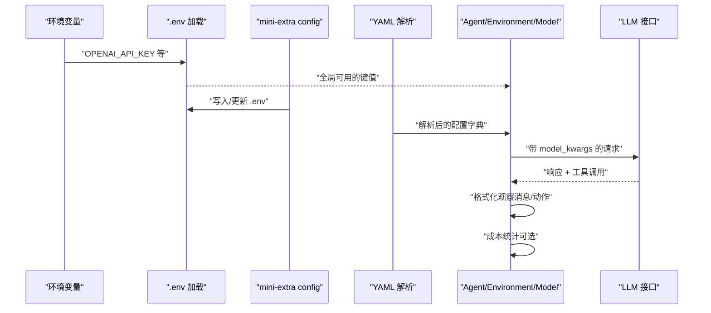
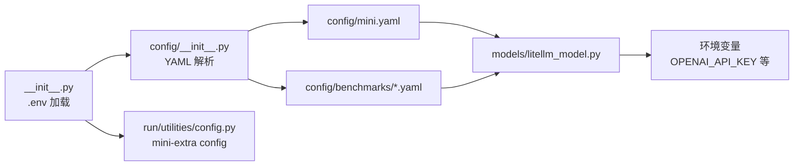

# 配置管理

<cite>
**本文引用的文件**
- [workplace/src/minisweagent/__init__.py](file://workplace/src/minisweagent/__init__.py)
- [workplace/src/minisweagent/run/utilities/config.py](file://workplace/src/minisweagent/run/utilities/config.py)
- [workplace/src/minisweagent/config/__init__.py](file://workplace/src/minisweagent/config/__init__.py)
- [workplace/src/minisweagent/config/default.yaml](file://workplace/src/minisweagent/config/default.yaml)
- [workplace/src/minisweagent/config/mini.yaml](file://workplace/src/minisweagent/config/mini.yaml)
- [workplace/src/minisweagent/config/benchmarks/swebench.yaml](file://workplace/src/minisweagent/config/benchmarks/swebench.yaml)
- [workplace/src/minisweagent/config/benchmarks/swebench_modal.yaml](file://workplace/src/minisweagent/config/benchmarks/swebench_modal.yaml)
- [workplace/src/minisweagent/models/litellm_model.py](file://workplace/src/minisweagent/models/litellm_model.py)
- [workplace/docs/advanced/yaml_configuration.md](file://workplace/docs/advanced/yaml_configuration.md)
- [workplace/docs/usage/config.md](file://workplace/docs/usage/config.md)
- [workplace/docs/reference/run/config.md](file://workplace/docs/reference/run/config.md)
- [workplace/docs/faq.md](file://workplace/docs/faq.md)
- [workplace/tests/config/test_init.py](file://workplace/tests/config/test_init.py)
- [workplace/tests/models/test_init.py](file://workplace/tests/models/test_init.py)
- [workplace/tests/agents/test_interactive.py](file://workplace/tests/agents/test_interactive.py)
</cite>

## 目录
1. [简介](#简介)
2. [项目结构](#项目结构)
3. [核心组件](#核心组件)
4. [架构总览](#架构总览)
5. [详细组件分析](#详细组件分析)
6. [依赖分析](#依赖分析)
7. [性能考虑](#性能考虑)
8. [故障排查指南](#故障排查指南)
9. [结论](#结论)
10. [附录](#附录)

## 简介
本文件系统性阐述 Repo Dockerizer Agent 的配置管理方案，涵盖以下主题：
- 全局环境变量与全局配置文件（.env）的加载与优先级
- YAML 配置文件的结构、字段与合并策略
- 模型配置、超参数与运行时参数
- 成本控制参数（全局与会话级）
- 不同使用场景（开发、生产、测试）的配置示例与最佳实践
- 配置验证方法与常见错误的定位与修复

## 项目结构
与配置管理直接相关的核心目录与文件：
- 全局配置与环境变量加载：workplace/src/minisweagent/__init__.py
- 全局配置文件管理工具：workplace/src/minisweagent/run/utilities/config.py
- YAML 配置解析与路径查找：workplace/src/minisweagent/config/__init__.py
- 内置 YAML 配置样例：workplace/src/minisweagent/config/*.yaml 及 benchmarks/*.yaml
- 模型层的成本跟踪与环境变量：workplace/src/minisweagent/models/litellm_model.py
- 文档参考：advanced/yaml_configuration.md、usage/config.md、reference/run/config.md、faq.md
- 测试用例：tests/config/test_init.py、tests/models/test_init.py、tests/agents/test_interactive.py

图表来源
- [workplace/src/minisweagent/__init__.py](file://workplace/src/minisweagent/__init__.py#L26-L36)
- [workplace/src/minisweagent/run/utilities/config.py](file://workplace/src/minisweagent/run/utilities/config.py#L58-L84)
- [workplace/src/minisweagent/config/__init__.py](file://workplace/src/minisweagent/config/__init__.py#L54-L62)
- [workplace/src/minisweagent/config/default.yaml](file://workplace/src/minisweagent/config/default.yaml#L1-L167)
- [workplace/src/minisweagent/config/mini.yaml](file://workplace/src/minisweagent/config/mini.yaml#L1-L148)
- [workplace/src/minisweagent/config/benchmarks/swebench.yaml](file://workplace/src/minisweagent/config/benchmarks/swebench.yaml#L1-L178)
- [workplace/src/minisweagent/models/litellm_model.py](file://workplace/src/minisweagent/models/litellm_model.py#L26-L46)

章节来源
- [workplace/src/minisweagent/__init__.py](file://workplace/src/minisweagent/__init__.py#L26-L36)
- [workplace/src/minisweagent/run/utilities/config.py](file://workplace/src/minisweagent/run/utilities/config.py#L58-L84)
- [workplace/src/minisweagent/config/__init__.py](file://workplace/src/minisweagent/config/__init__.py#L54-L62)

## 核心组件
- 全局配置文件与环境变量
  - 全局配置目录与文件路径由包初始化确定，并在启动时加载 .env 文件；支持通过环境变量覆盖配置目录位置。
  - 常见键：MSWEA_MODEL_NAME（默认模型名）、OPENAI_API_KEY 等（可通过全局配置工具写入或环境变量注入）。
- 全局配置命令行工具
  - 提供交互式 setup、设置键值、取消键值、编辑配置文件等能力，便于在不修改代码的情况下管理配置。
- YAML 配置系统
  - 支持从文件、键值字符串解析为嵌套字典；内置多份 YAML 示例，覆盖不同任务场景（如 SWE-bench）。
- 模型与成本控制
  - 模型配置类包含成本跟踪模式、观察模板、工具调用解析等；支持忽略成本计算错误或注册本地模型元数据。

章节来源
- [workplace/src/minisweagent/__init__.py](file://workplace/src/minisweagent/__init__.py#L26-L36)
- [workplace/src/minisweagent/run/utilities/config.py](file://workplace/src/minisweagent/run/utilities/config.py#L58-L113)
- [workplace/src/minisweagent/config/__init__.py](file://workplace/src/minisweagent/config/__init__.py#L54-L62)
- [workplace/src/minisweagent/models/litellm_model.py](file://workplace/src/minisweagent/models/litellm_model.py#L26-L46)

## 架构总览
下图展示了配置从环境变量到 YAML 到模型层的流转过程，以及成本控制的关键节点。

图表来源
- [workplace/src/minisweagent/__init__.py](file://workplace/src/minisweagent/__init__.py#L26-L36)
- [workplace/src/minisweagent/run/utilities/config.py](file://workplace/src/minisweagent/run/utilities/config.py#L58-L113)
- [workplace/src/minisweagent/config/__init__.py](file://workplace/src/minisweagent/config/__init__.py#L54-L62)
- [workplace/src/minisweagent/models/litellm_model.py](file://workplace/src/minisweagent/models/litellm_model.py#L80-L118)

## 详细组件分析

### 全局环境变量与 .env 文件
- 路径与加载
  - 全局配置目录可通过环境变量覆盖；默认位于用户配置目录；.env 文件即为全局配置文件。
  - 启动时自动加载 .env，使其中的键值对在进程内可用。
- 关键键位
  - OPENAI_API_KEY：用于 OpenAI 类模型的认证。
  - MSWEA_MODEL_NAME：默认模型名称（建议包含提供商前缀）。
  - MSWEA_COST_TRACKING：成本跟踪模式（默认或忽略错误）。
  - MSWEA_GLOBAL_COST_LIMIT / MSWEA_GLOBAL_CALL_LIMIT：全局成本/调用上限（用于统计与提示）。
  - MSWEA_SILENT_STARTUP：静默启动，不打印限制提示。
  - LITELLM_MODEL_REGISTRY_PATH：本地模型注册表路径（用于成本与元数据）。
- 优先级与覆盖
  - 环境变量优先于 .env 中的同名键；CLI 写入 .env 会持久化覆盖。

章节来源
- [workplace/src/minisweagent/__init__.py](file://workplace/src/minisweagent/__init__.py#L26-L36)
- [workplace/src/minisweagent/run/utilities/config.py](file://workplace/src/minisweagent/run/utilities/config.py#L58-L84)
- [workplace/tests/models/test_init.py](file://workplace/tests/models/test_init.py#L142-L187)

### 全局配置命令行工具（mini-extra config）
- 功能
  - setup：交互式引导设置默认模型与 API 密钥，并标记已配置。
  - set/unset：设置或移除 .env 中的键值。
  - edit：使用 $EDITOR 或 nano 打开 .env 文件进行手动编辑。
- 使用要点
  - 若已有环境变量，可跳过写入 .env；但建议统一通过该工具管理以避免散落。
  - 设置后立即生效（当前进程），新子进程会重新加载 .env。

章节来源
- [workplace/src/minisweagent/run/utilities/config.py](file://workplace/src/minisweagent/run/utilities/config.py#L58-L113)
- [workplace/docs/usage/config.md](file://workplace/docs/usage/config.md#L1-L66)
- [workplace/docs/reference/run/config.md](file://workplace/docs/reference/run/config.md#L1-L18)

### YAML 配置文件结构与选项
- 顶层键
  - agent：系统提示、实例提示、步骤/成本限制、执行模式等。
  - environment：工作目录、超时、解释器、环境变量、执行环境类型（如 docker、singularity、modal 等）。
  - model：模型名称、额外参数、观察模板、格式化错误模板、成本跟踪模式、缓存控制等。
  - run：输出文件等运行期参数（视具体脚本而定）。
- 模板与变量
  - Jinja2 渲染，支持在模板中使用环境变量、agent/config、environment/config、传入的 task、上一步执行输出等。
- 行为差异
  - 不同 YAML 示例适用于不同任务（如默认、mini、SWE-bench、Modal 等），可按需组合或覆盖。

章节来源
- [workplace/docs/advanced/yaml_configuration.md](file://workplace/docs/advanced/yaml_configuration.md#L10-L147)
- [workplace/src/minisweagent/config/default.yaml](file://workplace/src/minisweagent/config/default.yaml#L1-L167)
- [workplace/src/minisweagent/config/mini.yaml](file://workplace/src/minisweagent/config/mini.yaml#L1-L148)
- [workplace/src/minisweagent/config/benchmarks/swebench.yaml](file://workplace/src/minisweagent/config/benchmarks/swebench.yaml#L1-L178)
- [workplace/src/minisweagent/config/benchmarks/swebench_modal.yaml](file://workplace/src/minisweagent/config/benchmarks/swebench_modal.yaml#L1-L49)

### 模型配置与超参数
- 关键字段
  - model_name：建议包含提供商前缀，如 anthropic/claude-sonnet-4-5-20250929。
  - model_kwargs：透传给底层模型接口的参数（如温度、并行工具调用等）。
  - observation_template/format_error_template：控制如何渲染执行结果与错误信息。
  - cost_tracking：默认或忽略错误（当成本计算失败时的行为）。
  - set_cache_control：显式缓存控制标记（如针对某些模型）。
  - litellm_model_registry：本地模型注册表路径，用于成本与元数据。
- 与环境变量的关系
  - OPENAI_API_KEY 等通过环境变量注入；MSWEA_COST_TRACKING 控制成本跟踪行为。
  - LITELLM_MODEL_REGISTRY_PATH 可指向本地 JSON 注册表，提升成本追踪准确性。

章节来源
- [workplace/src/minisweagent/models/litellm_model.py](file://workplace/src/minisweagent/models/litellm_model.py#L26-L46)
- [workplace/src/minisweagent/config/benchmarks/swebench.yaml](file://workplace/src/minisweagent/config/benchmarks/swebench.yaml#L173-L178)

### 运行时参数与成本控制
- 会话级限制
  - agent.step_limit / agent.cost_limit：单次运行的步数与成本上限；超出时可交互调整或中断。
- 全局限制
  - MSWEA_GLOBAL_COST_LIMIT / MSWEA_GLOBAL_CALL_LIMIT：全局统计与提示；MSWEA_SILENT_STARTUP 可关闭提示。
- 成本计算
  - 模型查询后根据响应计算成本；若成本为非正值或不可计算且未启用忽略错误，将抛出错误并给出指引。

章节来源
- [workplace/src/minisweagent/config/mini.yaml](file://workplace/src/minisweagent/config/mini.yaml#L101-L103)
- [workplace/src/minisweagent/config/benchmarks/swebench.yaml](file://workplace/src/minisweagent/config/benchmarks/swebench.yaml#L112-L113)
- [workplace/tests/models/test_init.py](file://workplace/tests/models/test_init.py#L142-L187)
- [workplace/tests/agents/test_interactive.py](file://workplace/tests/agents/test_interactive.py#L811-L893)
- [workplace/src/minisweagent/models/litellm_model.py](file://workplace/src/minisweagent/models/litellm_model.py#L95-L118)

### 配置文件优先级、继承与覆盖机制
- 优先级（高到低）
  - 环境变量 > .env 文件 > YAML 默认值
- 组合与覆盖
  - 多个 YAML 配置可通过命令行多次指定并合并；后者键值覆盖前者同名键。
  - 示例：SWE-bench Modal 配置通过与基础 swebench 配置合并，将环境类切换为 Modal 并覆盖超时与部署参数。
- 键值字符串解析
  - 支持形如 "agent.mode=yolo" 的键值串，自动转为嵌套字典，便于命令行快速覆盖。

章节来源
- [workplace/src/minisweagent/config/benchmarks/swebench_modal.yaml](file://workplace/src/minisweagent/config/benchmarks/swebench_modal.yaml#L6-L10)
- [workplace/src/minisweagent/config/__init__.py](file://workplace/src/minisweagent/config/__init__.py#L54-L62)
- [workplace/tests/config/test_init.py](file://workplace/tests/config/test_init.py#L13-L41)

### 使用场景与配置示例
- 开发环境
  - 重点：低成本、可重复、易调试
  - 建议：降低 cost_limit、提高 step_limit；使用本地或轻量模型；开启详细日志；必要时禁用缓存控制。
  - 参考字段：agent.cost_limit、agent.step_limit、model.model_kwargs.temperature、model.set_cache_control。
- 生产环境
  - 重点：稳定性、成本可控、可观测
  - 建议：明确 MSWEA_GLOBAL_COST_LIMIT / MSWEA_GLOBAL_CALL_LIMIT；开启成本跟踪；使用稳定模型与固定参数；启用观察模板截断。
  - 参考字段：MSWEA_GLOBAL_COST_LIMIT、MSWEA_COST_TRACKING、model.observation_template。
- 测试环境
  - 重点：可复现、最小化成本
  - 建议：极低 cost_limit；短超时；固定 temperature；使用小镜像或容器。
  - 参考字段：agent.cost_limit、environment.timeout、model.model_kwargs.temperature。

说明：以上为通用实践建议，具体键位请对照各 YAML 示例与模型配置说明。

章节来源
- [workplace/src/minisweagent/config/mini.yaml](file://workplace/src/minisweagent/config/mini.yaml#L101-L103)
- [workplace/src/minisweagent/config/benchmarks/swebench.yaml](file://workplace/src/minisweagent/config/benchmarks/swebench.yaml#L112-L113)
- [workplace/src/minisweagent/config/benchmarks/swebench_modal.yaml](file://workplace/src/minisweagent/config/benchmarks/swebench_modal.yaml#L30-L38)

### 配置验证方法
- 语法检查
  - 使用 YAML 解析函数读取配置，若文件损坏将报错；可通过单元测试中的解析逻辑验证。
- 键位存在性
  - 确认必要键是否存在（如 model.model_name、agent.cost_limit 等）。
- 行为一致性
  - 对比不同场景下的配置差异，确保模板与动作解析一致（如 action_regex 与输出格式匹配）。
- 环境变量注入
  - 在运行前导出 OPENAI_API_KEY 等，确认 .env 与环境变量均被加载。

章节来源
- [workplace/src/minisweagent/config/__init__.py](file://workplace/src/minisweagent/config/__init__.py#L54-L62)
- [workplace/tests/config/test_init.py](file://workplace/tests/config/test_init.py#L98-L111)
- [workplace/docs/advanced/yaml_configuration.md](file://workplace/docs/advanced/yaml_configuration.md#L128-L132)

## 依赖分析
- 组件耦合
  - 全局初始化负责加载 .env，为后续模块提供环境变量上下文。
  - YAML 解析器与内置配置文件共同构成“配置源”，被 Agent/Environment/Model 模块消费。
  - 模型层依赖成本跟踪与环境变量，实现成本统计与错误处理。
- 外部依赖
  - python-dotenv：加载 .env。
  - litellm：完成模型调用与成本计算。
  - Jinja2：渲染模板（由 YAML 配置驱动）。

图表来源
- [workplace/src/minisweagent/__init__.py](file://workplace/src/minisweagent/__init__.py#L26-L36)
- [workplace/src/minisweagent/config/__init__.py](file://workplace/src/minisweagent/config/__init__.py#L54-L62)
- [workplace/src/minisweagent/run/utilities/config.py](file://workplace/src/minisweagent/run/utilities/config.py#L58-L113)
- [workplace/src/minisweagent/config/mini.yaml](file://workplace/src/minisweagent/config/mini.yaml#L1-L148)
- [workplace/src/minisweagent/config/benchmarks/swebench.yaml](file://workplace/src/minisweagent/config/benchmarks/swebench.yaml#L1-L178)
- [workplace/src/minisweagent/models/litellm_model.py](file://workplace/src/minisweagent/models/litellm_model.py#L26-L46)

## 性能考虑
- 成本控制
  - 合理设置 agent.cost_limit 与 MSWEA_GLOBAL_COST_LIMIT，避免大模型高频调用导致费用飙升。
  - 使用较小的 temperature 与更精确的 prompt，减少无效重试。
- 观察模板优化
  - 对长输出采用截断策略，减少上下文长度，提高响应速度。
- 环境与镜像
  - 在 Docker/Singularity 等环境中选择合适的基础镜像，减少冷启动时间与资源消耗。
- 缓存控制
  - 在支持的模型上合理设置缓存控制，避免不必要的重复计算。

## 故障排查指南
- API 密钥未设置或错误
  - 症状：认证失败异常并提示通过 mini-extra config 设置密钥。
  - 处理：使用 mini-extra config set 或在 .env 中写入 OPENAI_API_KEY；或在运行前导出环境变量。
- 成本计算失败
  - 症状：成本计算异常或返回非正值，抛出错误并建议忽略错误或注册模型元数据。
  - 处理：设置 MSWEA_COST_TRACKING='ignore_errors' 或提供 LITELLM_MODEL_REGISTRY_PATH。
- 会话限制触发
  - 症状：达到 step_limit 或 cost_limit，交互式提示更新限制。
  - 处理：根据提示输入新的限制值，或在配置中提高 agent.cost_limit / agent.step_limit。
- YAML 解析错误
  - 症状：键值字符串格式不正确导致解析失败。
  - 处理：遵循嵌套键值规范（如 "agent.mode=yolo"），或直接编辑 YAML 文件。

章节来源
- [workplace/src/minisweagent/models/litellm_model.py](file://workplace/src/minisweagent/models/litellm_model.py#L71-L73)
- [workplace/src/minisweagent/models/litellm_model.py](file://workplace/src/minisweagent/models/litellm_model.py#L102-L112)
- [workplace/tests/agents/test_interactive.py](file://workplace/tests/agents/test_interactive.py#L811-L893)
- [workplace/docs/faq.md](file://workplace/docs/faq.md#L68-L99)

## 结论
通过将环境变量、全局配置文件与 YAML 配置有机结合，Repo Dockerizer Agent 实现了灵活、可维护且可扩展的配置体系。配合成本控制与模板渲染机制，可在不同场景下平衡性能、成本与稳定性。建议在团队内统一使用 mini-extra config 管理密钥与默认项，并以 YAML 配置文件固化关键参数，确保可复现与可审计。

## 附录
- 快速参考
  - 全局配置文件位置：由初始化逻辑确定，默认位于用户配置目录。
  - 常用键：OPENAI_API_KEY、MSWEA_MODEL_NAME、MSWEA_COST_TRACKING、MSWEA_GLOBAL_COST_LIMIT、MSWEA_GLOBAL_CALL_LIMIT、LITELLM_MODEL_REGISTRY_PATH。
  - YAML 示例：default.yaml、mini.yaml、swebench.yaml、swebench_modal.yaml。
  - 命令：mini-extra config setup/set/unset/edit。

章节来源
- [workplace/src/minisweagent/__init__.py](file://workplace/src/minisweagent/__init__.py#L26-L36)
- [workplace/src/minisweagent/run/utilities/config.py](file://workplace/src/minisweagent/run/utilities/config.py#L58-L113)
- [workplace/src/minisweagent/config/default.yaml](file://workplace/src/minisweagent/config/default.yaml#L1-L167)
- [workplace/src/minisweagent/config/mini.yaml](file://workplace/src/minisweagent/config/mini.yaml#L1-L148)
- [workplace/src/minisweagent/config/benchmarks/swebench.yaml](file://workplace/src/minisweagent/config/benchmarks/swebench.yaml#L1-L178)
- [workplace/src/minisweagent/config/benchmarks/swebench_modal.yaml](file://workplace/src/minisweagent/config/benchmarks/swebench_modal.yaml#L1-L49)