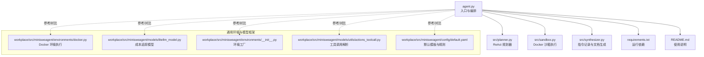
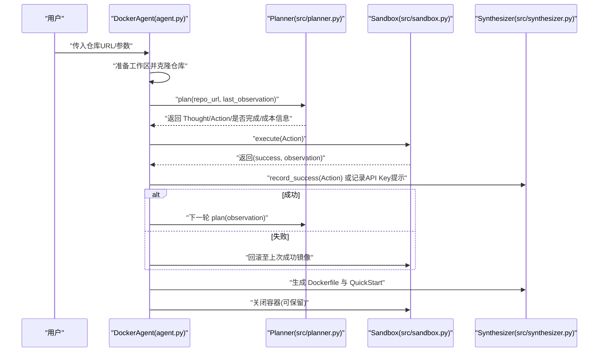
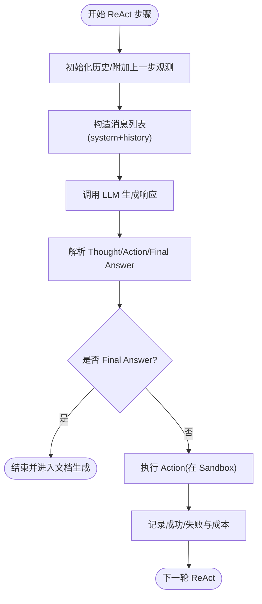
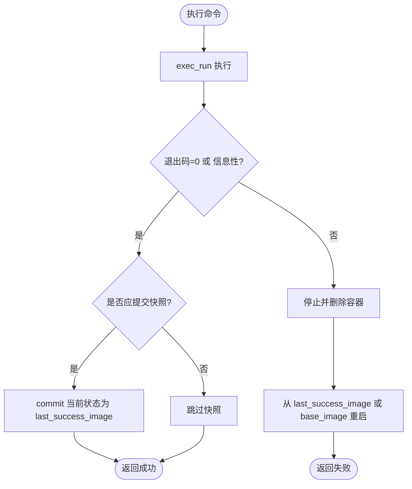
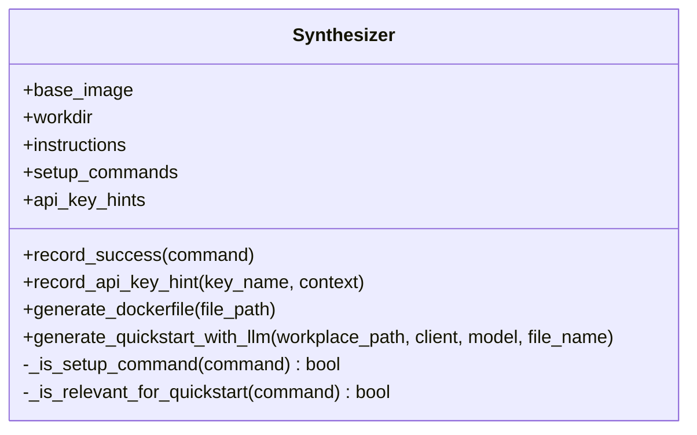
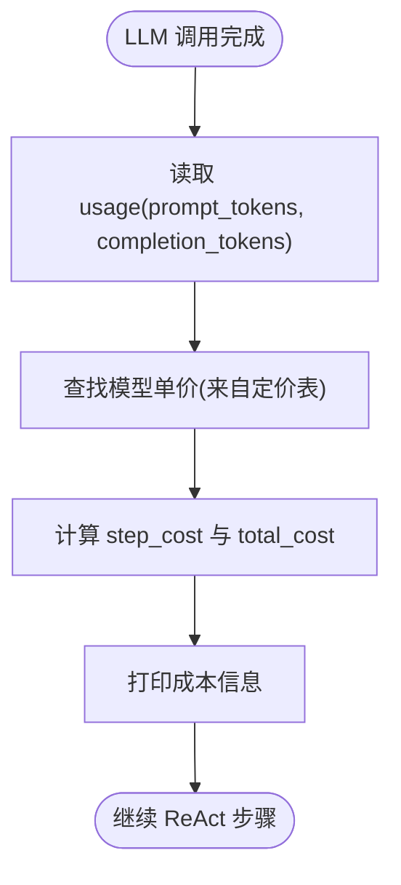
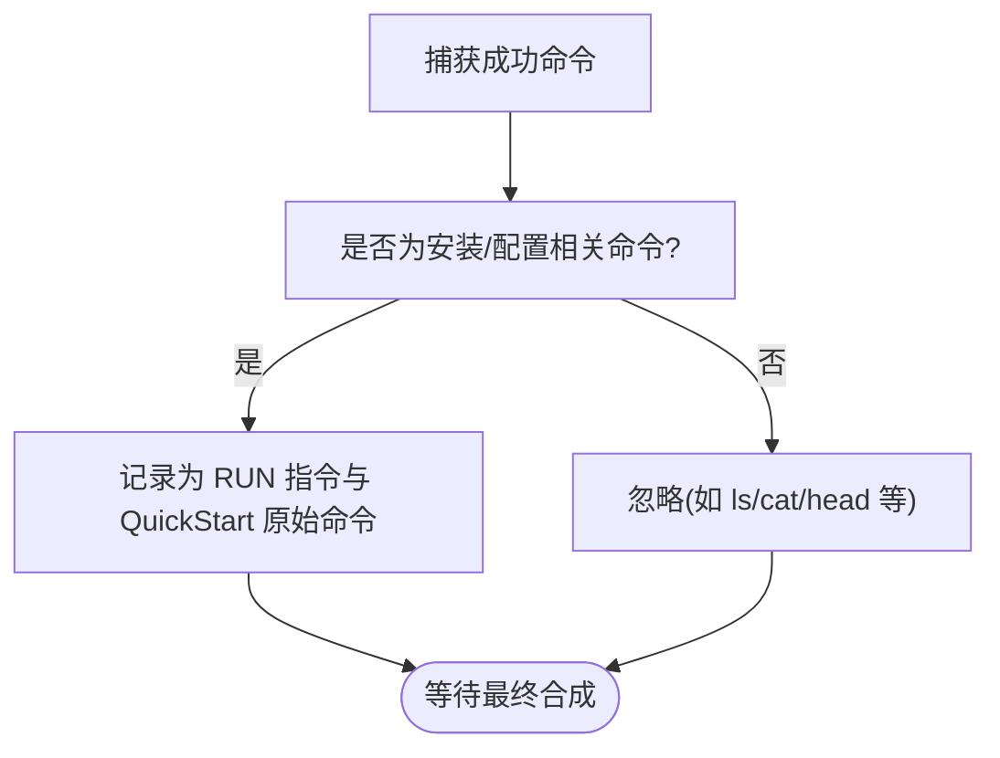
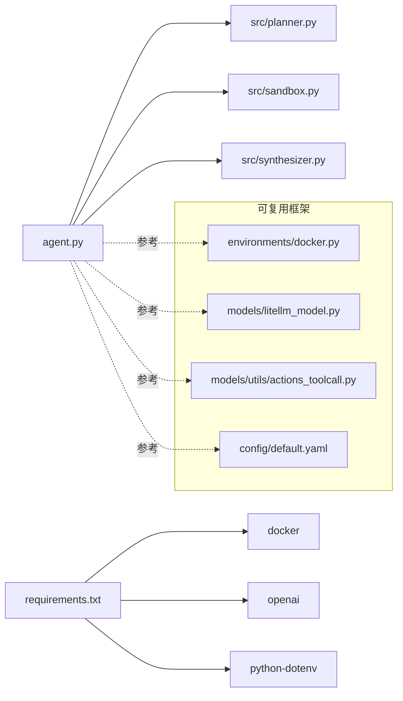

# 关键特性

<cite>
**本文引用的文件**
- [agent.py](file://agent.py)
- [src/planner.py](file://src/planner.py)
- [src/sandbox.py](file://src/sandbox.py)
- [src/synthesizer.py](file://src/synthesizer.py)
- [workplace/src/minisweagent/environments/docker.py](file://workplace/src/minisweagent/environments/docker.py)
- [workplace/src/minisweagent/models/litellm_model.py](file://workplace/src/minisweagent/models/litellm_model.py)
- [workplace/src/minisweagent/environments/__init__.py](file://workplace/src/minisweagent/environments/__init__.py)
- [workplace/src/minisweagent/models/utils/actions_toolcall.py](file://workplace/src/minisweagent/models/utils/actions_toolcall.py)
- [workplace/src/minisweagent/config/default.yaml](file://workplace/src/minisweagent/config/default.yaml)
- [requirements.txt](file://requirements.txt)
- [README.md](file://README.md)
- [doc/运行示例.md](file://doc/运行示例.md)
</cite>

## 目录
1. [引言](#引言)
2. [项目结构](#项目结构)
3. [核心组件](#核心组件)
4. [架构总览](#架构总览)
5. [详细特性分析](#详细特性分析)
6. [依赖关系分析](#依赖关系分析)
7. [性能考量](#性能考量)
8. [故障排查指南](#故障排查指南)
9. [结论](#结论)
10. [附录](#附录)

## 引言
本文件聚焦 Repo Dockerizer Agent 的五大关键特性：1) 智能 ReAct 决策系统；2) 安全的 Docker 执行环境与回滚保护；3) 自动化 Dockerfile 生成；4) 成本控制机制；5) 多种包管理器支持。我们将结合源码与示例，逐项阐述实现方式、使用场景与实际效果。

## 项目结构
该项目采用“核心 Agent + 子模块”的组织方式：
- 入口脚本负责工作区准备、初始化 LLM 客户端、启动 ReAct 循环、驱动沙箱执行与合成器生成文档。
- 核心子模块包括 Planner（ReAct 思考-行动-观察）、Sandbox（Docker 容器执行与回滚）、Synthesizer（记录成功指令并生成 Dockerfile/QuickStart）。
- 工程还包含一个可复用的环境与模型框架（workplace 下），用于更通用的 SWE 场景，其中也体现了成本控制与工具调用解析等能力。

图表来源
- [agent.py](file://agent.py#L1-L160)
- [src/planner.py](file://src/planner.py#L1-L145)
- [src/sandbox.py](file://src/sandbox.py#L1-L178)
- [src/synthesizer.py](file://src/synthesizer.py#L1-L144)
- [workplace/src/minisweagent/environments/docker.py](file://workplace/src/minisweagent/environments/docker.py#L1-L162)
- [workplace/src/minisweagent/models/litellm_model.py](file://workplace/src/minisweagent/models/litellm_model.py#L1-L148)
- [workplace/src/minisweagent/environments/__init__.py](file://workplace/src/minisweagent/environments/__init__.py#L1-L33)
- [workplace/src/minisweagent/models/utils/actions_toolcall.py](file://workplace/src/minisweagent/models/utils/actions_toolcall.py#L1-L103)
- [workplace/src/minisweagent/config/default.yaml](file://workplace/src/minisweagent/config/default.yaml#L1-L167)

章节来源
- [agent.py](file://agent.py#L1-L160)
- [README.md](file://README.md#L1-L47)

## 核心组件
- Planner：基于 ReAct 的思考-行动-观察循环，构造系统提示词，解析 LLM 输出中的 Thought 与 Action，并统计单步与累计成本。
- Sandbox：封装 Docker 容器执行，对成功且有副作用的命令进行 commit 快照，失败时回滚至上一成功镜像，支持清理与保留容器。
- Synthesizer：记录成功的 bash 命令为 Dockerfile 的 RUN 指令，生成可复现的 Dockerfile；同时基于 README 与真实安装步骤生成 QuickStart 文档。
- Agent 编排：克隆仓库、挂载工作区、初始化 LLM 客户端、驱动 Planner-Sandbox-Synthesizer 的完整流程，并在成功后生成文档。

章节来源
- [src/planner.py](file://src/planner.py#L1-L145)
- [src/sandbox.py](file://src/sandbox.py#L1-L178)
- [src/synthesizer.py](file://src/synthesizer.py#L1-L144)
- [agent.py](file://agent.py#L1-L160)

## 架构总览
ReAct 循环在 Agent 中的执行序列如下：

图表来源
- [agent.py](file://agent.py#L60-L126)
- [src/planner.py](file://src/planner.py#L69-L105)
- [src/sandbox.py](file://src/sandbox.py#L29-L91)
- [src/synthesizer.py](file://src/synthesizer.py#L9-L21)

## 详细特性分析

### 特性一：智能 ReAct 决策系统（思考-行动-观察循环）
- 实现要点
  - 系统提示词明确 Mission Guidelines 与约束，限定仅使用包管理器与语言运行时，禁止构建/运行容器。
  - 每轮仅输出一个 Thought 与一个 Action，便于 LLM 严格遵循格式。
  - 历史记录包含用户输入与助手输出，形成上下文闭环。
  - 解析 LLM 输出中的 Thought 与 Action，并提取 Final Answer 标志判断结束条件。
  - 单步与累计成本统计，便于成本控制。
- 使用场景
  - 仓库首次接触：先扫描依赖文件，再按顺序安装与验证。
  - 无 Dockerfile 的项目：直接解析 README 与入口点，尝试启动。
  - 缺少密钥：识别缺失的 API_KEY/Token 并提示配置方法。
- 实际效果
  - 示例中，Agent 在 FastAnime 项目中识别了 pyproject.toml、安装了 hatch 与依赖、验证了主命令可用，并最终输出 Final Answer: Success，随后生成 Dockerfile 与 QuickStart。

图表来源
- [src/planner.py](file://src/planner.py#L69-L105)
- [agent.py](file://agent.py#L70-L87)

章节来源
- [src/planner.py](file://src/planner.py#L43-L105)
- [doc/运行示例.md](file://doc/运行示例.md#L1-L475)

### 特性二：安全的 Docker 执行环境与回滚保护
- 实现要点
  - 通过 Docker SDK 启动容器，工作目录挂载工作区，命令在容器内执行。
  - 对“有副作用”的命令（如安装、下载、编译）进行 commit 快照，记录 last_success_image。
  - 仅对非只读/非信息性退出（如显示帮助）的命令进行快照，避免镜像膨胀。
  - 执行失败时，停止并删除当前容器，从 last_success_image 或 base_image 重启新容器，实现回滚。
  - 支持 keep_alive 参数，允许在完成后保留容器以便检查。
  - 结束时清理快照镜像与悬空镜像，减少磁盘占用。
- 使用场景
  - 安装复杂依赖链（如 Python 包、系统库、构建工具）时，确保失败可恢复。
  - 验证命令正确性：先在容器内尝试，失败即回滚，不污染宿主机。
- 实际效果
  - 示例中多次安装失败（如 hatch install 命令不存在）均被回滚，最终通过 hatch env create 成功创建环境并验证主命令可用。

图表来源
- [src/sandbox.py](file://src/sandbox.py#L29-L91)
- [src/sandbox.py](file://src/sandbox.py#L93-L134)

章节来源
- [src/sandbox.py](file://src/sandbox.py#L1-L178)
- [doc/运行示例.md](file://doc/运行示例.md#L14-L475)

### 特性三：自动化 Dockerfile 生成（可复现的环境配置）
- 实现要点
  - Synthesizer 将每次成功的 bash 命令记录为 Dockerfile 的 RUN 指令，形成可复现的构建脚本。
  - 仅记录与环境配置相关的命令（如 pip/apt/npm 等），过滤纯查看类指令，保证清单精简。
  - 生成 QuickStart 文档：基于 README 与真实安装步骤，提炼 Setup Steps、How to Run、API Key 配置与 Notes。
  - 生成 Dockerfile 与 QuickStart.md 文件，便于后续复用与分享。
- 使用场景
  - 团队协作：将 Agent 的探索结果固化为标准环境配置，降低环境差异。
  - CI/CD：将生成的 Dockerfile 直接接入流水线。
- 实际效果
  - 示例中在成功后自动生成 Dockerfile 与 QuickStart.md，内容来源于真实安装步骤与 README 提取。

图表来源
- [src/synthesizer.py](file://src/synthesizer.py#L1-L144)

章节来源
- [src/synthesizer.py](file://src/synthesizer.py#L9-L144)
- [doc/运行示例.md](file://doc/运行示例.md#L469-L475)

### 特性四：成本控制机制（实时监控与限制 LLM API 调用成本）
- 实现要点
  - Planner 维护 pricing 表与 total_cost，根据单次调用的 prompt/completion tokens 计算美元成本，并累加。
  - 在每步输出中打印 step_cost 与 total_cost，便于用户直观感知开销。
  - 该机制适用于本项目内置 Planner。
- 使用场景
  - 控制实验成本：在有限预算下迭代 ReAct 步数与模型选择。
  - 作为基线策略：为更复杂的成本控制（如全局 cost_limit）提供数据基础。
- 实际效果
  - 示例输出中每步都会打印当前步与累计成本，便于观察与记录。

图表来源
- [src/planner.py](file://src/planner.py#L97-L129)

章节来源
- [src/planner.py](file://src/planner.py#L10-L41)
- [src/planner.py](file://src/planner.py#L97-L129)
- [doc/运行示例.md](file://doc/运行示例.md#L75-L79)

### 特性五：多种包管理器支持（自动识别与处理）
- 实现要点
  - Synthesizer 的 _is_setup_command 识别常见安装相关关键词（pip install、apt、yum、npm install、yarn add、git clone、make、cmake、poetry install、conda install 等）。
  - Planner 的系统提示词明确仅使用包管理器与语言运行时，避免直接使用容器编排工具。
  - Agent 在检测到 API Key 相关错误时，记录所需密钥名称与上下文，辅助生成 QuickStart 的 API Key 配置部分。
- 使用场景
  - Python 项目：pip/uv/poetry/conda 等。
  - Node/JS 项目：npm/yarn/pnpm。
  - Linux 项目：apt/yum/dnf 等系统包管理器。
  - 跨语言混合项目：按类型自动识别并记录对应安装步骤。
- 实际效果
  - 示例中 FastAnime 项目通过 pip 安装 hatch 与依赖，最终验证主命令可用；API Key 检测逻辑可用于识别缺失的密钥需求。

图表来源
- [src/synthesizer.py](file://src/synthesizer.py#L23-L30)
- [src/synthesizer.py](file://src/synthesizer.py#L9-L16)
- [src/planner.py](file://src/planner.py#L59-L66)

章节来源
- [src/synthesizer.py](file://src/synthesizer.py#L23-L30)
- [src/synthesizer.py](file://src/synthesizer.py#L9-L16)
- [src/planner.py](file://src/planner.py#L59-L66)
- [doc/运行示例.md](file://doc/运行示例.md#L1-L475)

## 依赖关系分析
- 运行时依赖
  - Docker SDK、OpenAI SDK、python-dotenv。
- 组件耦合
  - Agent 依赖 Planner/Sandbox/Synthesizer 的单一职责接口，耦合度低、扩展性强。
  - workplace 下的环境与模型框架提供了更通用的成本控制与工具调用解析能力，可作为参考或迁移目标。

图表来源
- [requirements.txt](file://requirements.txt#L1-L4)
- [agent.py](file://agent.py#L1-L160)
- [workplace/src/minisweagent/environments/docker.py](file://workplace/src/minisweagent/environments/docker.py#L1-L162)
- [workplace/src/minisweagent/models/litellm_model.py](file://workplace/src/minisweagent/models/litellm_model.py#L1-L148)
- [workplace/src/minisweagent/models/utils/actions_toolcall.py](file://workplace/src/minisweagent/models/utils/actions_toolcall.py#L1-L103)
- [workplace/src/minisweagent/config/default.yaml](file://workplace/src/minisweagent/config/default.yaml#L1-L167)

章节来源
- [requirements.txt](file://requirements.txt#L1-L4)
- [agent.py](file://agent.py#L1-L160)

## 性能考量
- 容器快照与回滚
  - 成功且有副作用的命令才会 commit，避免频繁快照导致镜像膨胀；失败时回滚可显著减少试错成本。
  - 结束时清理快照镜像与悬空镜像，建议定期维护。
- LLM 成本
  - 使用定价表按 tokens 计算成本，可在受限预算下控制步数与模型；也可结合全局 cost_limit 策略进一步限制。
- I/O 与网络
  - 包管理器安装可能涉及大量网络请求与磁盘写入，建议在稳定网络环境下执行，并关注依赖冲突与缓存命中率。

## 故障排查指南
- 容器无法启动/命令执行失败
  - 检查 Docker Engine 是否正常运行与权限是否足够。
  - 查看 Sandbox 的回滚日志，确认是否因命令失败触发回滚。
- API 密钥缺失
  - Agent 会检测常见 API Key 相关错误并记录提示；可在 QuickStart 中补充环境变量或 .env 文件配置。
- LLM 输出格式异常
  - Planner 期望严格的 ReAct 格式；若出现“未检测到 Action”等提示，可调整系统提示词或模型参数。
- 环境残留
  - 使用 keep_container 参数保留容器进行调试；结束后手动清理容器与镜像，避免磁盘占用。

章节来源
- [src/sandbox.py](file://src/sandbox.py#L147-L178)
- [agent.py](file://agent.py#L127-L146)
- [src/planner.py](file://src/planner.py#L43-L67)

## 结论
Repo Dockerizer Agent 通过 ReAct 决策、Docker 安全执行与回滚、自动化 Dockerfile 生成、成本控制与多包管理器支持，形成了从“探索—验证—固化—复现”的完整闭环。其模块化设计便于扩展与复用，既适合快速验证单仓库环境，也可作为团队标准化配置的基座。

## 附录
- 快速开始
  - 准备 OPENAI_API_KEY（或兼容的 base_url），安装依赖，运行 agent.py 指向目标仓库 URL。
- 示例参考
  - 运行示例展示了完整的 ReAct 步骤、成本打印、回滚与最终文档生成过程。

章节来源
- [README.md](file://README.md#L11-L47)
- [doc/运行示例.md](file://doc/运行示例.md#L1-L475)