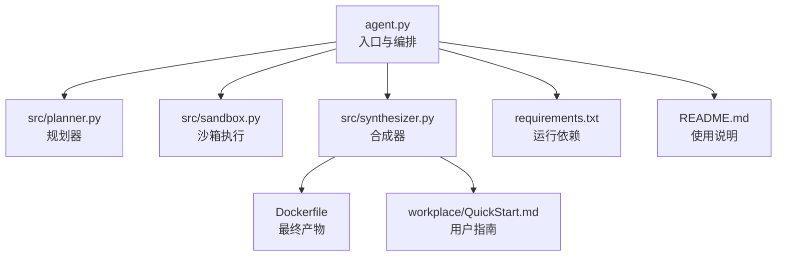
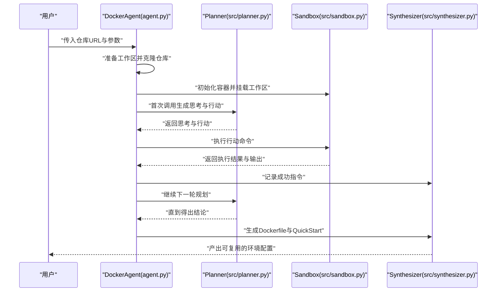
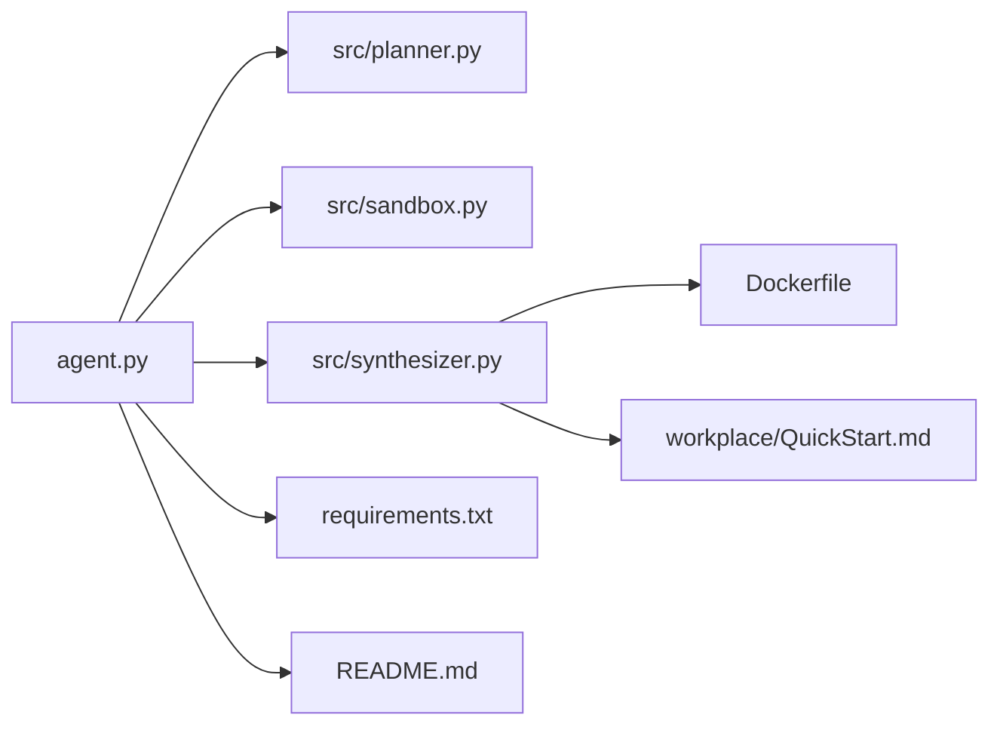

# 应用场景

<cite>
**本文引用的文件**
- [README.md](file://README.md)
- [agent.py](file://agent.py)
- [src/planner.py](file://src/planner.py)
- [src/sandbox.py](file://src/sandbox.py)
- [src/synthesizer.py](file://src/synthesizer.py)
- [Dockerfile](file://Dockerfile)
- [requirements.txt](file://requirements.txt)
- [workplace/README.md](file://workplace/README.md)
- [workplace/QuickStart.md](file://workplace/QuickStart.md)
- [doc/运行示例.md](file://doc/运行示例.md)
- [test.py](file://test.py)
</cite>

## 目录
1. [简介](#简介)
2. [项目结构](#项目结构)
3. [核心组件](#核心组件)
4. [架构总览](#架构总览)
5. [详细场景分析](#详细场景分析)
6. [依赖关系分析](#依赖关系分析)
7. [性能考量](#性能考量)
8. [故障排查指南](#故障排查指南)
9. [结论](#结论)
10. [附录](#附录)

## 简介
Repo Dockerizer Agent 是一个基于大语言模型（LLM）的自动化工具，目标是为任意 GitHub 仓库自动配置可运行的 Docker 环境。其核心能力包括：在沙箱环境中逐步探索并安装依赖、记录成功指令、生成可复用的 Dockerfile 以及配套的 QuickStart 文档。该 Agent 适用于多种实际应用场景，包括但不限于：
- 开发环境快速搭建
- CI/CD 流水线集成
- 团队协作一致性保障
- 历史项目复现与迁移
- 教育培训标准化学习环境

## 项目结构
本项目采用“核心 Agent + 组件模块”的分层设计，主要文件与职责如下：
- 入口与编排：agent.py
- 规划器：src/planner.py（ReAct 思维链驱动）
- 沙箱执行：src/sandbox.py（基于 Docker SDK 的命令执行与回滚）
- 综合合成器：src/synthesizer.py（记录成功指令、生成 Dockerfile 与 QuickStart 文档）
- 示例与文档：README.md、Dockerfile、requirements.txt、workplace/QuickStart.md、doc/运行示例.md、test.py

图表来源
- [agent.py](file://agent.py#L1-L160)
- [src/planner.py](file://src/planner.py#L1-L145)
- [src/sandbox.py](file://src/sandbox.py#L1-L178)
- [src/synthesizer.py](file://src/synthesizer.py#L1-L144)
- [Dockerfile](file://Dockerfile#L1-L7)
- [requirements.txt](file://requirements.txt#L1-L4)
- [workplace/QuickStart.md](file://workplace/QuickStart.md#L1-L46)

章节来源
- [README.md](file://README.md#L1-L47)
- [agent.py](file://agent.py#L1-L160)
- [src/planner.py](file://src/planner.py#L1-L145)
- [src/sandbox.py](file://src/sandbox.py#L1-L178)
- [src/synthesizer.py](file://src/synthesizer.py#L1-L144)
- [Dockerfile](file://Dockerfile#L1-L7)
- [requirements.txt](file://requirements.txt#L1-L4)
- [workplace/QuickStart.md](file://workplace/QuickStart.md#L1-L46)

## 核心组件
- 规划器（Planner）：以 ReAct 思维链格式输出“思考 + 行动”，根据系统提示词与历史对话，指导下一步命令。
- 沙箱（Sandbox）：基于 Docker SDK 在隔离容器中执行命令，具备“提交快照 + 失败回滚”的容错机制。
- 合成器（Synthesizer）：记录成功指令，生成 Dockerfile 与 QuickStart 文档，辅助用户快速上手。

章节来源
- [src/planner.py](file://src/planner.py#L1-L145)
- [src/sandbox.py](file://src/sandbox.py#L1-L178)
- [src/synthesizer.py](file://src/synthesizer.py#L1-L144)

## 架构总览
下图展示了从启动到产出 Dockerfile 的端到端流程，包括 LLM 推理、容器执行、指令记录与文档生成。

图表来源
- [agent.py](file://agent.py#L60-L126)
- [src/planner.py](file://src/planner.py#L69-L105)
- [src/sandbox.py](file://src/sandbox.py#L29-L91)
- [src/synthesizer.py](file://src/synthesizer.py#L9-L21)

## 详细场景分析

### 场景一：开发环境快速搭建
- 使用流程
  1) 准备本地 Docker 环境与 API 密钥（OPENAI_API_KEY）。
  2) 运行 Agent，传入目标仓库 URL，等待自动配置完成。
  3) 查看生成的 Dockerfile 与 QuickStart 文档，按步骤构建与运行。
- 预期效果
  - 自动生成可直接使用的 Dockerfile，减少手工排查依赖的时间。
  - 生成 QuickStart 文档，明确安装与运行步骤，降低上手门槛。
- 最佳实践
  - 使用 --keep-container 参数在失败时保留容器以便调试。
  - 若仓库包含多入口或复杂依赖，建议先阅读 README 再运行 Agent。
  - 对于私有仓库，确保网络可达且密钥有效。

章节来源
- [README.md](file://README.md#L11-L47)
- [agent.py](file://agent.py#L148-L159)
- [src/synthesizer.py](file://src/synthesizer.py#L32-L122)
- [workplace/QuickStart.md](file://workplace/QuickStart.md#L1-L46)

### 场景二：CI/CD 流水线集成
- 使用流程
  1) 在 CI 任务中拉起 Docker 引擎与 LLM API。
  2) 执行 Agent，生成 Dockerfile 与 QuickStart。
  3) 将 Dockerfile 作为流水线制品或缓存，后续构建镜像。
- 预期效果
  - 将“环境配置”从人工经验固化为可重复的自动化流程。
  - 降低因环境差异导致的构建失败率。
- 最佳实践
  - 在流水线中设置超时与重试策略，避免长耗时步骤阻塞。
  - 将生成的 Dockerfile 与 QuickStart 文档归档，便于审计与复用。
  - 对 API 调用成本进行监控与预算控制。

章节来源
- [src/planner.py](file://src/planner.py#L107-L129)
- [src/sandbox.py](file://src/sandbox.py#L147-L178)
- [Dockerfile](file://Dockerfile#L1-L7)

### 场景三：团队协作优化
- 使用流程
  1) 团队统一在仓库根目录放置 .env（含 OPENAI_API_KEY）。
  2) 团队成员运行 Agent，获得一致的 Docker 环境配置。
  3) 将生成的 Dockerfile 与 QuickStart 文档纳入版本管理。
- 预期效果
  - 消除“在我机器上能跑”的环境差异问题。
  - 新成员入职时可直接按 QuickStart 快速上手。
- 最佳实践
  - 将 .env 作为敏感信息管理，不在仓库中公开密钥。
  - 对 README 中的运行说明进行提炼，确保 QuickStart 文档与实际 README 一致。

章节来源
- [README.md](file://README.md#L28-L47)
- [src/synthesizer.py](file://src/synthesizer.py#L32-L122)
- [workplace/QuickStart.md](file://workplace/QuickStart.md#L1-L46)

### 场景四：项目复现与迁移
- 使用流程
  1) 对历史项目运行 Agent，生成 Dockerfile 与 QuickStart。
  2) 将产物迁移到新平台或新分支，验证可复现性。
  3) 如遇 API Key 缺失，参考合成器记录的提示信息补充配置。
- 预期效果
  - 以最小成本复现历史项目的运行环境。
  - 降低迁移过程中的试错成本。
- 最佳实践
  - 对缺失的 API Key 进行集中管理与文档化。
  - 在迁移后进行回归验证，确保行为一致。

章节来源
- [src/synthesizer.py](file://src/synthesizer.py#L17-L21)
- [doc/运行示例.md](file://doc/运行示例.md#L1-L475)

### 场景五：教育培训用途
- 使用流程
  1) 学员在本地运行 Agent，获得标准化的 Docker 环境。
  2) 按 QuickStart 文档完成安装与验证，熟悉项目结构与运行方式。
  3) 教师可基于生成的 Dockerfile 与文档设计课程实验。
- 预期效果
  - 统一学习环境，减少“环境问题”干扰。
  - 通过自动化文档提升教学效率。
- 最佳实践
  - 为不同课程阶段准备不同的仓库与参数组合。
  - 提供常见问题清单与调试技巧，配合 QuickStart 使用。

章节来源
- [workplace/README.md](file://workplace/README.md#L1-L222)
- [workplace/QuickStart.md](file://workplace/QuickStart.md#L1-L46)

## 依赖关系分析
- 运行时依赖
  - Docker 引擎：用于容器化执行与隔离。
  - LLM API：用于 ReAct 规划与文档生成。
  - Python 包：docker、openai、python-dotenv。
- 组件耦合
  - DockerAgent 串联 Planner、Sandbox、Synthesizer。
  - Sandbox 仅依赖 Docker SDK，职责清晰。
  - Synthesizer 依赖 LLM 生成文档，但不直接参与执行。

图表来源
- [agent.py](file://agent.py#L1-L39)
- [requirements.txt](file://requirements.txt#L1-L4)
- [README.md](file://README.md#L1-L47)
- [src/synthesizer.py](file://src/synthesizer.py#L130-L143)

章节来源
- [requirements.txt](file://requirements.txt#L1-L4)
- [agent.py](file://agent.py#L1-L39)

## 性能考量
- API 成本控制
  - Planner 内置按模型定价的 token 计费统计，可用于预算控制与优化。
  - 建议在 CI 中设置最大步数与成本上限，避免过度调用。
- 执行效率
  - Sandbox 的“只对有副作用的命令进行 commit”策略可减少镜像膨胀与回滚成本。
  - 对只读命令（如 ls/cat）跳过 commit，提高迭代速度。
- 资源占用
  - 生成快照会占用磁盘空间，建议在完成后清理无用镜像与容器。
  - 使用 --keep-container 仅在必要时保留容器，避免长期占用资源。

章节来源
- [src/planner.py](file://src/planner.py#L107-L129)
- [src/sandbox.py](file://src/sandbox.py#L93-L112)
- [src/sandbox.py](file://src/sandbox.py#L147-L178)
- [README.md](file://README.md#L43-L47)

## 故障排查指南
- 常见问题与处理
  - Docker 未就绪：确认 Docker 引擎已安装并运行。
  - API Key 缺失：检查 .env 是否正确配置 OPENAI_API_KEY。
  - LLM 返回格式异常：Planner 会解析“思考 + 行动”，若缺少格式会被识别为无效，需重新规划。
  - 容器回滚频繁：可能是命令存在副作用但未被识别，建议调整命令或增加前置检查。
- 调试建议
  - 使用 --keep-container 保留容器，进入容器内部查看状态。
  - 查看合成器记录的 API Key 提示，补齐缺失的密钥配置。
  - 参考运行示例文档，对比期望输出与实际输出，定位差异。

章节来源
- [agent.py](file://agent.py#L127-L146)
- [src/sandbox.py](file://src/sandbox.py#L147-L178)
- [doc/运行示例.md](file://doc/运行示例.md#L1-L475)

## 结论
Repo Dockerizer Agent 将 LLM 的推理能力与容器化执行相结合，实现了从“仓库到可运行环境”的自动化闭环。通过统一的 Dockerfile 与 QuickStart 文档，该工具在开发环境搭建、CI/CD 集成、团队协作、项目复现与迁移、教育培训等场景中均能显著提升效率与一致性。建议在生产使用中结合成本控制、资源清理与密钥管理的最佳实践，以获得更稳健的交付体验。

## 附录
- 快速开始
  - 安装依赖与运行：参考 README 的安装与运行说明。
  - 配置密钥：将 .env.example 重命名为 .env 并填入 OPENAI_API_KEY。
  - 运行示例：参考 doc/运行示例.md 中的完整交互记录。
- 验证 LLM 可用性
  - 可使用 test.py 中的代理验证脚本，确认 LLM 能力与网络可达性。

章节来源
- [README.md](file://README.md#L11-L47)
- [doc/运行示例.md](file://doc/运行示例.md#L1-L475)
- [test.py](file://test.py#L1-L45)