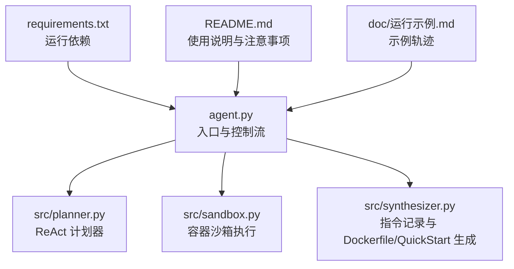
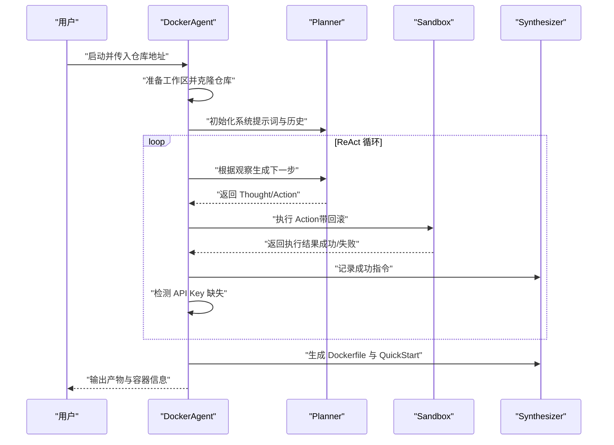
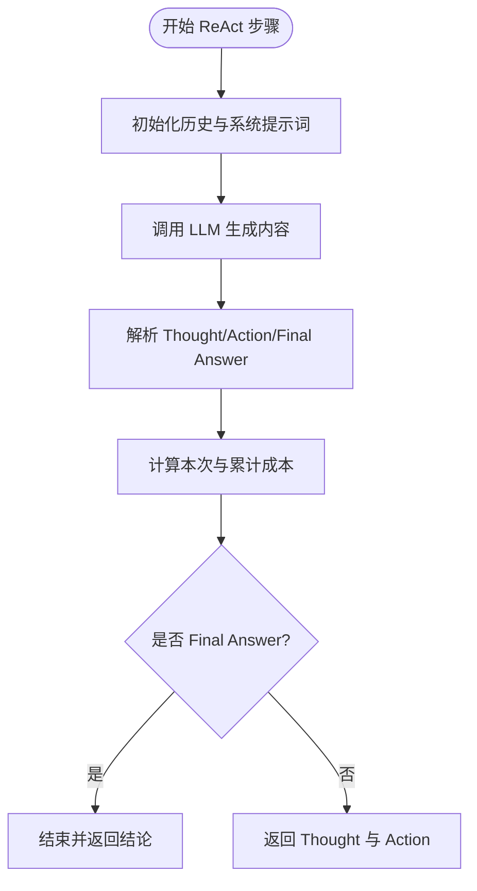
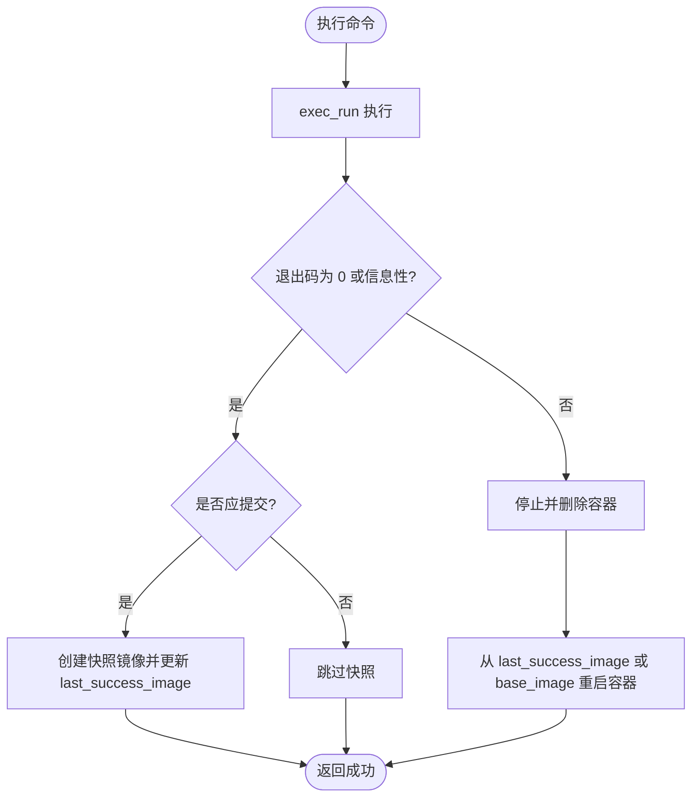
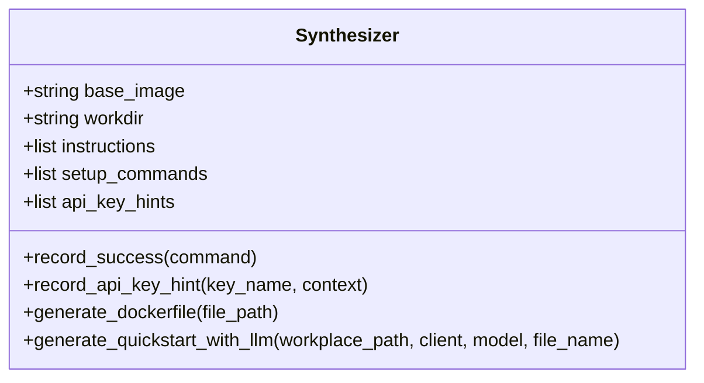
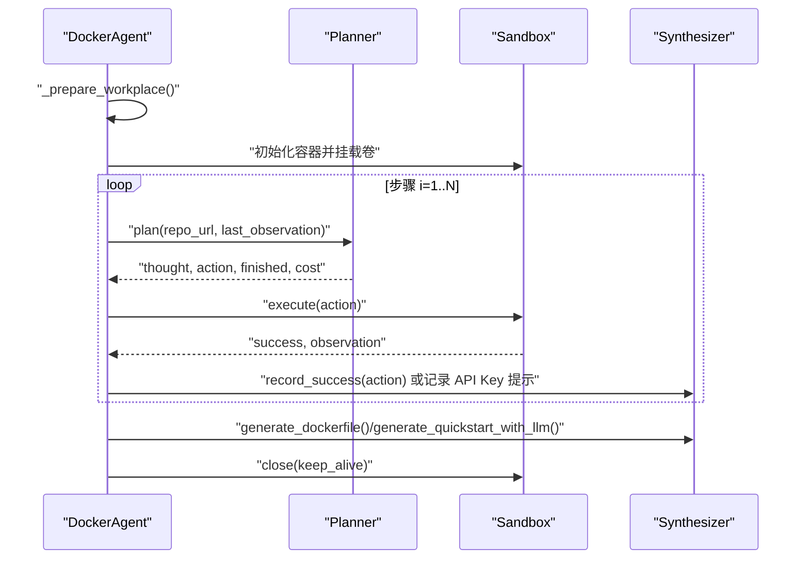
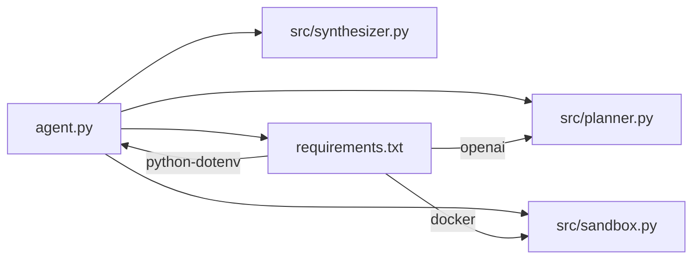

# 技术背景

<cite>
**本文引用的文件**
- [README.md](file://README.md)
- [agent.py](file://agent.py)
- [src/planner.py](file://src/planner.py)
- [src/sandbox.py](file://src/sandbox.py)
- [src/synthesizer.py](file://src/synthesizer.py)
- [requirements.txt](file://requirements.txt)
- [doc/运行示例.md](file://doc/运行示例.md)
- [workplace/docs/reference/environments/docker.md](file://workplace/docs/reference/environments/docker.md)
- [workplace/docs/reference/environments/bubblewrap.md](file://workplace/docs/reference/environments/bubblewrap.md)
- [workplace/docs/reference/environments/singularity.md](file://workplace/docs/reference/environments/singularity.md)
</cite>

## 目录
1. [引言](#引言)
2. [项目结构](#项目结构)
3. [核心组件](#核心组件)
4. [架构总览](#架构总览)
5. [详细组件分析](#详细组件分析)
6. [依赖关系分析](#依赖关系分析)
7. [性能考量](#性能考量)
8. [故障排查指南](#故障排查指南)
9. [结论](#结论)
10. [附录](#附录)

## 引言
本技术背景文档面向 Repo Dockerizer Agent 项目，系统梳理其技术背景与创新点，涵盖以下方面：
- LLM 在软件工程中的应用现状与趋势，以及在自动化环境配置中的价值
- ReAct 模式的理论基础与在本项目中的实践路径
- 容器化技术的发展历程与自动化环境配置的研究现状
- 本项目的技术创新点：基于 LLM 的智能环境配置、安全的容器化执行机制、成本优化策略
- 与现有方案的差异与优势，以及可参考的学术与技术资料

本项目通过“计划-执行-合成”的闭环，结合容器沙箱与 LLM 推理，实现对任意 GitHub 仓库的可复现 Docker 环境自动生成，具备较高的工程实用价值与可扩展性。

## 项目结构
项目采用分层模块化组织方式，围绕“代理（Agent）—计划器（Planner）—沙箱（Sandbox）—合成器（Synthesizer）”的主干流程展开，辅以最小依赖的运行时要求与示例运行轨迹。

图示来源
- [agent.py](file://agent.py#L1-L160)
- [src/planner.py](file://src/planner.py#L1-L145)
- [src/sandbox.py](file://src/sandbox.py#L1-L178)
- [src/synthesizer.py](file://src/synthesizer.py#L1-L144)
- [requirements.txt](file://requirements.txt#L1-L4)
- [README.md](file://README.md#L1-L47)
- [doc/运行示例.md](file://doc/运行示例.md#L1-L475)

章节来源
- [README.md](file://README.md#L1-L47)
- [requirements.txt](file://requirements.txt#L1-L4)
- [agent.py](file://agent.py#L1-L160)

## 核心组件
- 计划器（Planner）：基于 ReAct 思维链格式，引导 LLM 生成下一步“思考—动作”，并在受限约束下完成环境配置任务。内置成本统计与历史对话管理，确保可控与可追踪。
- 沙箱（Sandbox）：基于 Docker SDK 在隔离容器中执行命令，提供“提交—回滚”的安全执行机制；仅对会产生副作用的指令进行镜像快照，兼顾安全性与资源效率。
- 合成器（Synthesizer）：记录成功指令，生成最终 Dockerfile；同时基于 README 与真实安装步骤生成简洁的 QuickStart 文档，提升可复用性与可维护性。
- 代理（DockerAgent）：串联上述组件，负责工作区准备、LLM 初始化、ReAct 循环调度、API Key 检测与最终产物输出。

章节来源
- [src/planner.py](file://src/planner.py#L1-L145)
- [src/sandbox.py](file://src/sandbox.py#L1-L178)
- [src/synthesizer.py](file://src/synthesizer.py#L1-L144)
- [agent.py](file://agent.py#L1-L160)

## 架构总览
整体架构遵循“计划—执行—合成”的循环范式，结合容器化执行与 LLM 推理，形成可解释、可回滚、可量化的自动化环境配置流水线。

图示来源
- [agent.py](file://agent.py#L60-L126)
- [src/planner.py](file://src/planner.py#L69-L105)
- [src/sandbox.py](file://src/sandbox.py#L29-L91)
- [src/synthesizer.py](file://src/synthesizer.py#L9-L22)

## 详细组件分析

### 计划器（Planner）：ReAct 思维链与成本控制
- ReAct 模式：以“思维—动作—观察”为基本单元，限定输出格式，确保 LLM 的行动可解析、可观测、可回溯。
- 系统提示词设计：明确容器内限制、禁止命令清单、优先使用包管理器与语言运行时等约束，降低不可控风险。
- 成本控制：按模型定价表统计输入/输出/总 token 成本，累计步间成本，便于预算与优化。
- 历史管理：维护对话历史，支持多轮推理与上下文增强。

图示来源
- [src/planner.py](file://src/planner.py#L43-L67)
- [src/planner.py](file://src/planner.py#L85-L105)
- [src/planner.py](file://src/planner.py#L107-L129)

章节来源
- [src/planner.py](file://src/planner.py#L1-L145)

### 沙箱（Sandbox）：安全执行与回滚机制
- 容器生命周期：基于指定基础镜像启动交互式容器，挂载工作区目录，确保与宿主机隔离。
- 执行策略：区分只读/信息性命令与写时命令，仅对会产生持久状态变化的操作进行镜像提交，减少镜像膨胀。
- 回滚策略：失败时自动回滚至上一成功镜像，重新启动容器，保证环境一致性与可重复性。
- 信息性退出识别：对显示帮助或参数错误等“信息性退出”进行识别，避免误触发回滚。
- 资源清理：在关闭时清理快照镜像与悬空镜像，降低存储占用。

图示来源
- [src/sandbox.py](file://src/sandbox.py#L29-L91)
- [src/sandbox.py](file://src/sandbox.py#L93-L112)
- [src/sandbox.py](file://src/sandbox.py#L114-L134)
- [src/sandbox.py](file://src/sandbox.py#L147-L177)

章节来源
- [src/sandbox.py](file://src/sandbox.py#L1-L178)

### 合成器（Synthesizer）：指令记录与文档生成
- 指令记录：将成功执行的 bash 命令转化为 Dockerfile 的 RUN 指令序列，保留可复现的构建步骤。
- QuickStart 生成：基于 README 与真实安装步骤，由 LLM 生成简洁的“安装—运行—密钥配置”三段式文档，提升可操作性。
- API Key 提示：从输出中识别缺失密钥场景，记录变量名与上下文，辅助用户正确配置。

图示来源
- [src/synthesizer.py](file://src/synthesizer.py#L1-L144)

章节来源
- [src/synthesizer.py](file://src/synthesizer.py#L1-L144)

### 代理（DockerAgent）：端到端编排
- 工作区准备：清理/创建本地工作区并克隆目标仓库，确保容器内可见。
- LLM 初始化：加载环境变量，构造 OpenAI 客户端，支持自定义 base_url。
- ReAct 循环：驱动 Planner 生成动作，Sandbox 执行动作，Synthesizer 记录成功指令，检测 API Key 缺失。
- 最终产物：若配置成功，生成 Dockerfile 与 QuickStart；否则输出失败提示并清理资源。

图示来源
- [agent.py](file://agent.py#L14-L39)
- [agent.py](file://agent.py#L60-L126)
- [agent.py](file://agent.py#L127-L147)

章节来源
- [agent.py](file://agent.py#L1-L160)

## 依赖关系分析
- 运行时依赖：Docker SDK、OpenAI SDK、dotenv，分别用于容器执行、LLM 对话与密钥加载。
- 组件耦合：DockerAgent 作为编排者，依赖 Planner/Sandbox/Synthesizer 的清晰接口；Planner 与 Synthesizer 与 LLM 客户端解耦，便于替换模型或供应商。

图示来源
- [agent.py](file://agent.py#L1-L160)
- [requirements.txt](file://requirements.txt#L1-L4)

章节来源
- [requirements.txt](file://requirements.txt#L1-L4)
- [agent.py](file://agent.py#L1-L160)

## 性能考量
- 成本优化
  - 通过“只对写时命令提交快照”的策略，显著降低镜像数量与存储占用。
  - 将“信息性退出”识别为非错误，避免无效回滚与重复执行。
  - 成本统计与累计，便于在有限预算内控制步数与模型选择。
- 执行效率
  - 仅在必要时创建新镜像，减少镜像层叠加带来的体积增长。
  - 使用只读命令白名单，避免无意义的提交与回滚。
- 资源清理
  - 关闭时清理快照镜像与悬空镜像，降低长期运行的磁盘压力。

章节来源
- [src/sandbox.py](file://src/sandbox.py#L56-L74)
- [src/sandbox.py](file://src/sandbox.py#L114-L134)
- [src/sandbox.py](file://src/sandbox.py#L162-L177)
- [src/planner.py](file://src/planner.py#L107-L129)

## 故障排查指南
- 容器无法启动或命令执行失败
  - 检查 Docker Engine 是否正常运行与可用。
  - 查看回滚日志，确认是否因“信息性退出”被误判为失败。
- API Key 缺失导致验证失败
  - 合成器会记录常见密钥类型与上下文，可在 QuickStart 中查看所需变量名。
  - 建议在宿主环境设置对应环境变量后重新运行。
- 生成物为空或不完整
  - 确认 ReAct 循环是否提前结束且未达到“Final Answer: Success”。
  - 检查 README 中是否存在“快速开始”或启动说明，必要时手动补充。
- 存储占用过高
  - 使用“keep-container”选项临时保留容器以便检查，结束后及时清理镜像与容器。

章节来源
- [README.md](file://README.md#L43-L47)
- [agent.py](file://agent.py#L127-L147)
- [src/sandbox.py](file://src/sandbox.py#L76-L91)
- [src/synthesizer.py](file://src/synthesizer.py#L17-L22)

## 结论
Repo Dockerizer Agent 将 LLM 的推理能力与容器化执行的安全性相结合，提出了一条可解释、可回滚、可量化的自动化环境配置路径。其创新点体现在：
- 基于 ReAct 的可控计划与执行，确保每一步可追踪、可审计
- 安全的容器化执行机制，通过“提交—回滚”保障环境一致性
- 成本优化策略，降低镜像与 token 消耗
- 自动生成 Dockerfile 与 QuickStart 文档，提升可复用性与可维护性

这些特性使其在软件工程自动化、持续集成与交付、以及跨平台可复现环境构建等方面具备重要价值。

## 附录

### 与容器化生态的关系
- Docker 环境参考：项目直接使用 Docker SDK 进行容器生命周期管理，与主流容器化工具链兼容。
- 其他沙箱环境：项目文档中还提供了 Bubblewrap 与 Singularity 的参考链接，便于在不同场景下选择更合适的隔离方案。

章节来源
- [workplace/docs/reference/environments/docker.md](file://workplace/docs/reference/environments/docker.md#L1-L15)
- [workplace/docs/reference/environments/bubblewrap.md](file://workplace/docs/reference/environments/bubblewrap.md#L1-L5)
- [workplace/docs/reference/environments/singularity.md](file://workplace/docs/reference/environments/singularity.md#L1-L16)

### 示例运行轨迹
- 项目提供了完整的示例运行轨迹，展示了从仓库克隆、依赖安装、环境验证到最终产物生成的全过程，有助于理解 ReAct 循环在真实场景中的行为。

章节来源
- [doc/运行示例.md](file://doc/运行示例.md#L1-L475)