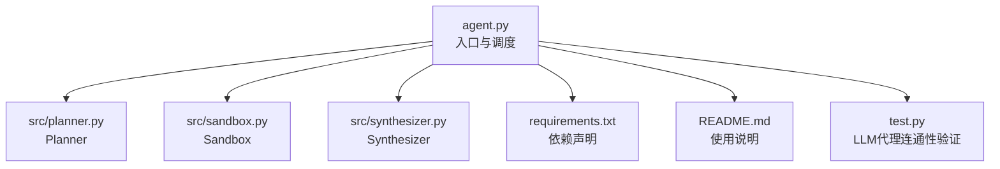
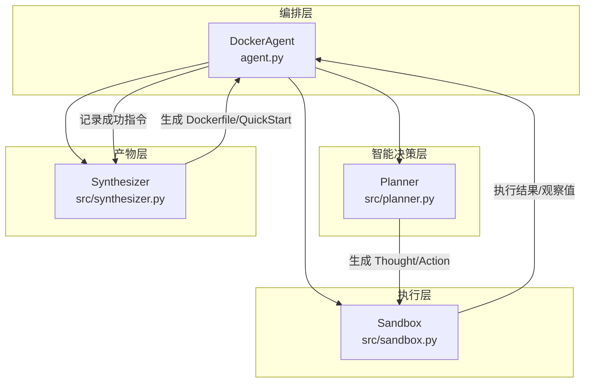
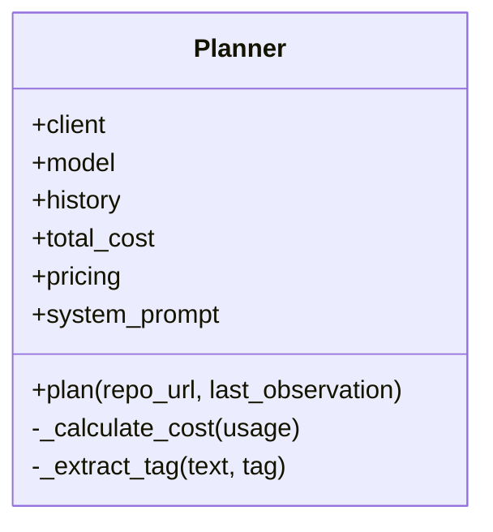
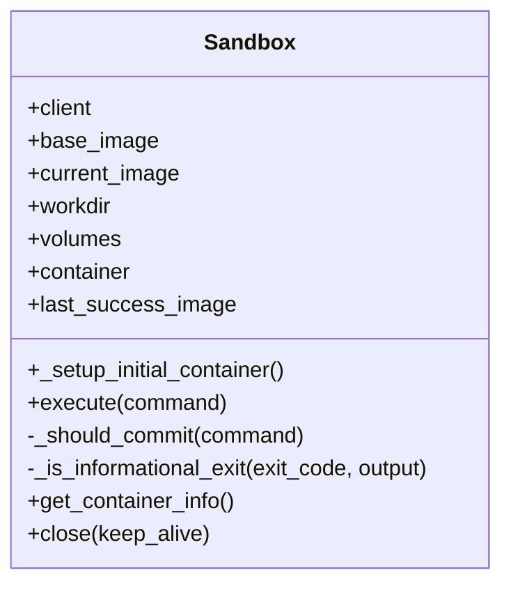
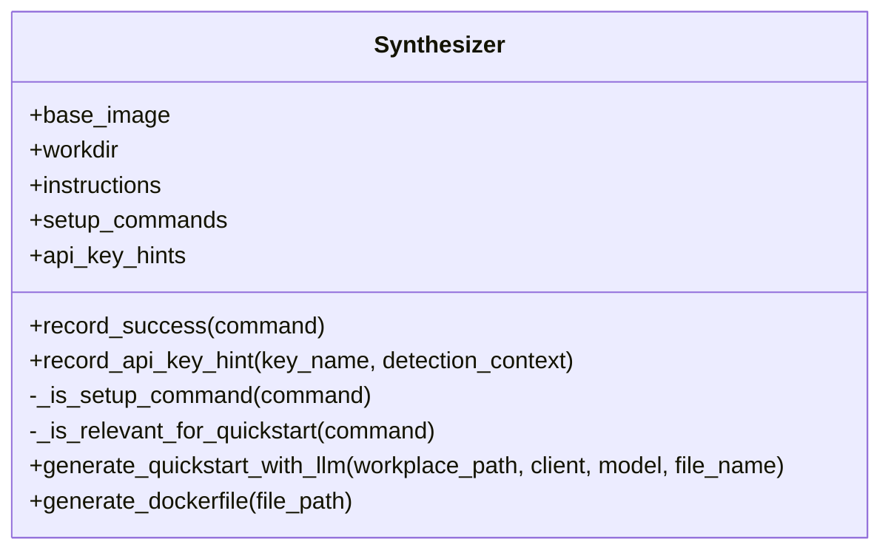
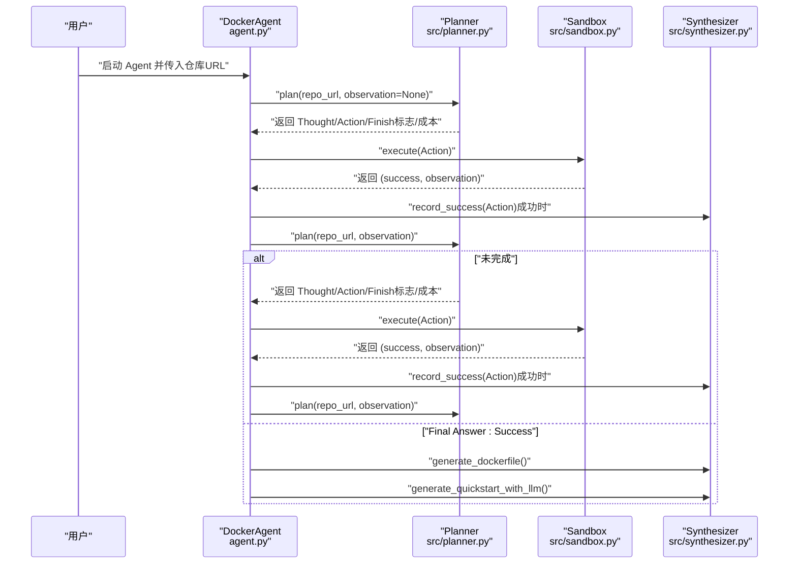
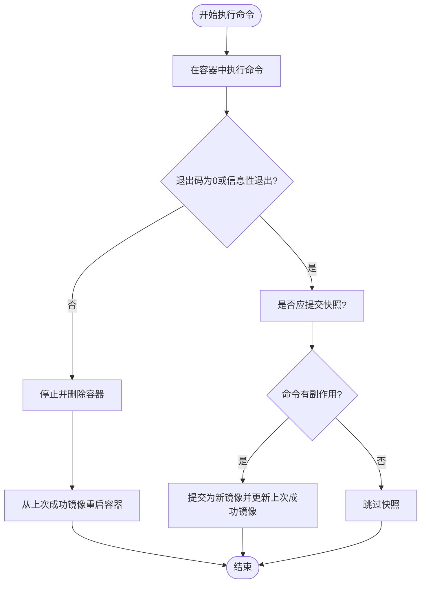
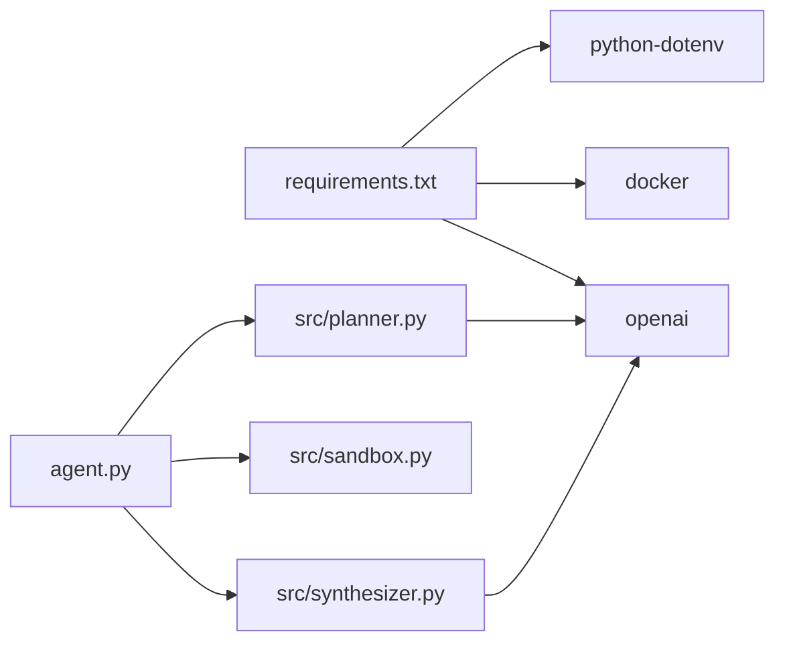

# 核心架构

<cite>
**本文引用的文件**
- [agent.py](file://agent.py)
- [src/planner.py](file://src/planner.py)
- [src/sandbox.py](file://src/sandbox.py)
- [src/synthesizer.py](file://src/synthesizer.py)
- [requirements.txt](file://requirements.txt)
- [README.md](file://README.md)
- [test.py](file://test.py)
</cite>

## 目录
1. [简介](#简介)
2. [项目结构](#项目结构)
3. [核心组件](#核心组件)
4. [架构总览](#架构总览)
5. [详细组件分析](#详细组件分析)
6. [依赖关系分析](#依赖关系分析)
7. [性能考量](#性能考量)
8. [故障排查指南](#故障排查指南)
9. [结论](#结论)
10. [附录](#附录)

## 简介
本文件面向 Repo Dockerizer Agent 的核心架构文档，系统采用 ReAct 智能决策范式（Thought/Action/Observation），围绕三大核心组件协同工作：Planner 负责智能决策与 LLM 对话管理；Sandbox 提供安全执行环境与回滚机制；Synthesizer 负责记录成功指令并生成最终产物（Dockerfile 与 QuickStart 文档）。本文将深入解析 ReAct 循环的执行流程、成本控制机制、状态管理以及组件间的数据流与交互关系，并辅以架构图与序列图帮助开发者快速理解整体设计。

## 项目结构
该项目采用按职责分层的模块化组织方式，入口脚本负责初始化与调度，核心组件分别位于独立模块中，便于扩展与维护。

图表来源
- [agent.py](file://agent.py#L1-L160)
- [src/planner.py](file://src/planner.py#L1-L145)
- [src/sandbox.py](file://src/sandbox.py#L1-L178)
- [src/synthesizer.py](file://src/synthesizer.py#L1-L144)
- [requirements.txt](file://requirements.txt#L1-L4)
- [README.md](file://README.md#L1-L47)
- [test.py](file://test.py#L1-L45)

章节来源
- [agent.py](file://agent.py#L1-L160)
- [README.md](file://README.md#L1-L47)

## 核心组件
- Planner（规划器）
  - 职责：基于 ReAct 思维链格式生成下一步思考与可执行命令；维护对话历史与成本统计；解析 LLM 输出中的 Thought/Action/Final Answer。
  - 关键点：系统提示词约束、停止符控制、成本计算、正则提取 Thought/Action。
- Sandbox（沙箱）
  - 职责：在 Docker 容器内执行命令，具备基于 commit 的快照与回滚能力；区分只读/信息性命令与有副作用命令；失败时自动回滚至上一成功镜像。
  - 关键点：只读命令白名单、信息性退出识别、成功即提交快照、失败回滚。
- Synthesizer（合成器）
  - 职责：记录成功的安装/配置命令，生成 Dockerfile；基于 README 与真实安装步骤生成 QuickStart 文档；记录 API Key 需求提示。
  - 关键点：RUN 指令累积、QuickStart 过滤无关指令、API Key 检测与提示。

章节来源
- [src/planner.py](file://src/planner.py#L1-L145)
- [src/sandbox.py](file://src/sandbox.py#L1-L178)
- [src/synthesizer.py](file://src/synthesizer.py#L1-L144)

## 架构总览
下图展示了 Agent 的整体架构与组件交互关系：DockerAgent 作为编排器，协调 Planner、Sandbox、Synthesizer 完成 ReAct 循环与最终产物生成。

图表来源
- [agent.py](file://agent.py#L14-L125)
- [src/planner.py](file://src/planner.py#L3-L105)
- [src/sandbox.py](file://src/sandbox.py#L4-L91)
- [src/synthesizer.py](file://src/synthesizer.py#L1-L143)

## 详细组件分析

### Planner 组件分析
- 设计要点
  - ReAct 系统提示词：明确任务目标、状态约束、禁止命令清单、输出格式要求。
  - 历史管理：首步记录仓库 URL，后续步将上一步观察值追加为用户消息。
  - 输出解析：使用正则提取 Thought 与 Action，支持去除代码块标记与单引号包裹。
  - 成本控制：根据模型定价表与 token 使用量计算单步与累计成本。
- 数据结构与复杂度
  - 历史列表：线性增长，每次步长 O(1) 追加。
  - 正则提取：按文本扫描，复杂度 O(n)，n 为输出长度。
  - 成本计算：O(1) 基于 usage 字段。
- 错误处理与边界
  - 无 Action 时触发澄清请求，避免循环停滞。
  - Final Answer 标志位用于提前终止循环。
- 性能影响
  - API 调用次数与 token 消耗直接影响成本，需合理设置 max_steps 与 stop 控制。

图表来源
- [src/planner.py](file://src/planner.py#L3-L145)

章节来源
- [src/planner.py](file://src/planner.py#L3-L145)

### Sandbox 组件分析
- 设计要点
  - 初始化容器：基于 base_image 启动交互式 bash 容器，绑定本地工作目录。
  - 执行策略：执行命令后根据退出码与输出特征判断是否为信息性退出；成功则提交快照，失败则回滚至上一成功镜像。
  - 回滚机制：停止并删除当前容器，从 last_success_image 或 base_image 重新启动。
  - 快照管理：仅对有副作用的命令进行 commit，避免镜像膨胀；清理旧快照与悬空镜像。
- 数据结构与复杂度
  - 容器对象：生命周期由 run/stop/remove 管理。
  - 快照镜像：按需创建，清理策略避免无限增长。
- 错误处理与边界
  - 信息性退出识别：针对常见帮助/用法输出关键字进行判定。
  - 只读命令白名单：跳过无副作用命令的快照。
- 性能影响
  - 频繁 commit 会产生大量镜像，需在结束时清理；建议控制执行命令数量与粒度。

图表来源
- [src/sandbox.py](file://src/sandbox.py#L4-L178)

章节来源
- [src/sandbox.py](file://src/sandbox.py#L4-L178)

### Synthesizer 组件分析
- 设计要点
  - 成功指令记录：将成功执行的命令转换为 Dockerfile 的 RUN 指令，并保留用于 QuickStart 的安装类指令。
  - API Key 检测：从命令输出中识别常见 API Key 缺失模式，记录变量名与上下文。
  - QuickStart 生成：基于 README 与真实安装步骤构造 Prompt，调用 LLM 生成简洁文档。
  - Dockerfile 生成：拼接 FROM/WORKDIR 与 RUN 指令，输出最终文件。
- 数据结构与复杂度
  - 指令列表：线性增长，写入 O(1)。
  - Prompt 构造：与 README 长度相关，上限受截断保护。
- 错误处理与边界
  - 无安装指令时跳过 QuickStart 生成。
  - 文件读写异常捕获与降级提示。
- 性能影响
  - LLM 调用成本取决于 README 与安装指令数量；建议在成功路径后再触发生成。

图表来源
- [src/synthesizer.py](file://src/synthesizer.py#L1-L144)

章节来源
- [src/synthesizer.py](file://src/synthesizer.py#L1-L144)

### ReAct 循环执行流程
下图展示一次完整的 ReAct 循环：Planner 生成 Thought/Action，Sandbox 执行 Action 并返回 Observation，Agent 将 Observation 作为下一步输入，直到 Planner 输出 Final Answer。

图表来源
- [agent.py](file://agent.py#L60-L125)
- [src/planner.py](file://src/planner.py#L69-L105)
- [src/sandbox.py](file://src/sandbox.py#L29-L91)
- [src/synthesizer.py](file://src/synthesizer.py#L9-L143)

章节来源
- [agent.py](file://agent.py#L60-L125)

### ReAct 决策与执行算法流程
下图以流程图形式展示 Sandbox 的执行与回滚决策逻辑，体现“只对有副作用的命令进行快照”的策略。

图表来源
- [src/sandbox.py](file://src/sandbox.py#L29-L112)

章节来源
- [src/sandbox.py](file://src/sandbox.py#L29-L112)

## 依赖关系分析
- 外部依赖
  - docker：容器运行与镜像管理。
  - openai：LLM 接口调用。
  - python-dotenv：加载 .env 中的 API Key。
- 内部耦合
  - DockerAgent 依赖 Planner/Sandbox/Synthesizer 的实例方法。
  - Planner 依赖 LLM 客户端；Synthesizer 依赖 README 与 LLM 客户端。
  - Sandbox 与 Docker 引擎强耦合，需确保本地 Docker 可用。
- 循环依赖
  - 无直接循环依赖，组件通过 DockerAgent 协调。

图表来源
- [requirements.txt](file://requirements.txt#L1-L4)
- [agent.py](file://agent.py#L1-L12)

章节来源
- [requirements.txt](file://requirements.txt#L1-L4)
- [agent.py](file://agent.py#L1-L12)

## 性能考量
- 成本控制
  - Planner 内置 token 用量统计与模型定价表，支持单步与累计成本输出；建议在 CLI 中设置合理的 max_steps，避免过度调用。
  - 可通过 stop 控制与系统提示词约束减少冗余输出。
- 执行效率
  - Sandbox 的快照策略仅对有副作用命令提交，避免镜像膨胀；失败回滚会重建容器，注意控制命令粒度与数量。
  - README 读取与 Prompt 截断避免 token 溢出，提升生成稳定性。
- 资源管理
  - 容器与镜像清理：在 finally 中统一清理容器与悬空镜像，防止磁盘占用。
  - 建议在完成配置后手动清理历史快照镜像，降低存储压力。

章节来源
- [src/planner.py](file://src/planner.py#L107-L129)
- [src/sandbox.py](file://src/sandbox.py#L147-L178)
- [src/synthesizer.py](file://src/synthesizer.py#L47-L100)

## 故障排查指南
- 环境变量缺失
  - 现象：初始化阶段抛出异常。
  - 处理：确认 .env 中已配置 OPENAI_API_KEY；若使用代理，同时配置 OPENAI_API_BASE。
- Docker 未就绪
  - 现象：Sandbox 初始化失败或容器无法启动。
  - 处理：确保本地 Docker Engine 已安装并运行；检查权限与网络。
- API Key 检测与提示
  - 现象：命令失败但提示缺少 API Key。
  - 处理：Synthesizer 会记录 API Key 需求，可在 QuickStart 中补充配置方法。
- LLM 代理连通性验证
  - 参考：test.py 中的代理验证逻辑，确认模型是否具备联网能力或是否返回实时信息。
- 回滚与快照问题
  - 现象：频繁回滚或快照过多导致磁盘不足。
  - 处理：减少无副作用命令；在结束时清理快照与悬空镜像；必要时调整 base_image 与工作目录映射。

章节来源
- [agent.py](file://agent.py#L27-L36)
- [src/sandbox.py](file://src/sandbox.py#L147-L178)
- [src/synthesizer.py](file://src/synthesizer.py#L17-L21)
- [test.py](file://test.py#L1-L45)

## 结论
Repo Dockerizer Agent 通过 ReAct 思维链将智能决策、安全执行与产物合成有机结合：Planner 负责“想”，Sandbox 负责“做”，Synthesizer 负责“收”。系统在保证安全性与可回滚的同时，提供了可观的成本控制与状态管理能力。建议在实际使用中结合 max_steps、快照清理与 README 截断等策略，平衡成本与效果，确保稳定高效的环境配置与文档生成。

## 附录
- 快速开始
  - 安装依赖：参考 requirements.txt。
  - 配置环境：复制 .env.example 为 .env，填入 OPENAI_API_KEY。
  - 运行 Agent：python agent.py <GITHUB_REPO_URL>。
- 参考实现路径
  - ReAct 循环与成本输出：[agent.py](file://agent.py#L60-L125)
  - Planner 思维链与成本计算：[src/planner.py](file://src/planner.py#L69-L129)
  - Sandbox 回滚与快照：[src/sandbox.py](file://src/sandbox.py#L29-L112)
  - Synthesizer 产物生成：[src/synthesizer.py](file://src/synthesizer.py#L9-L143)