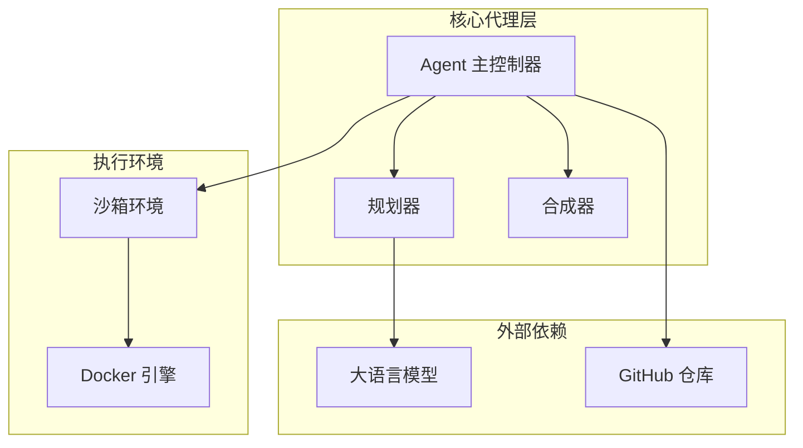
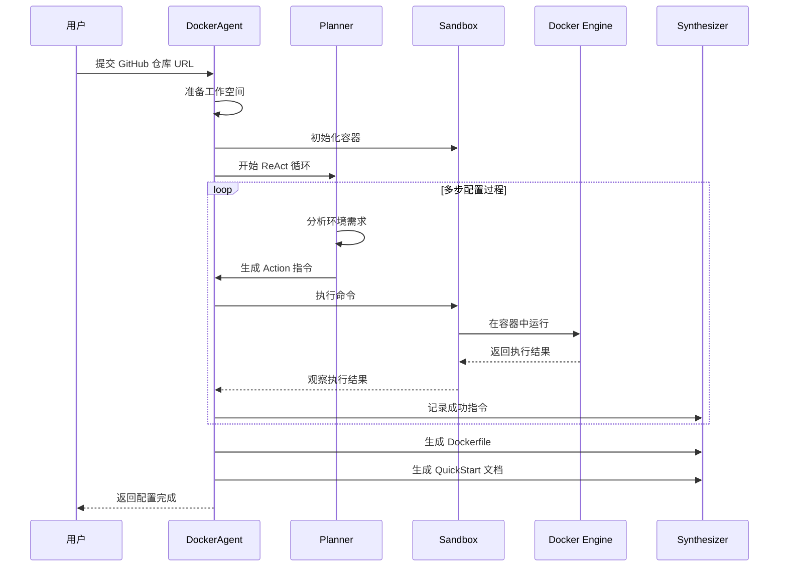
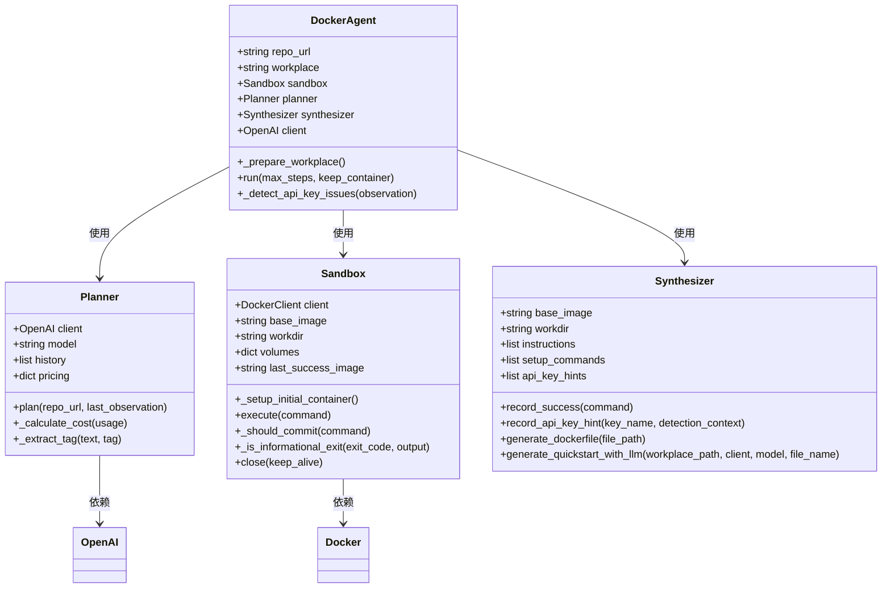
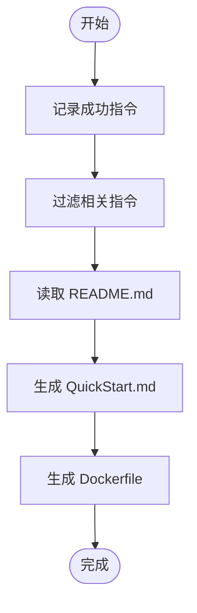
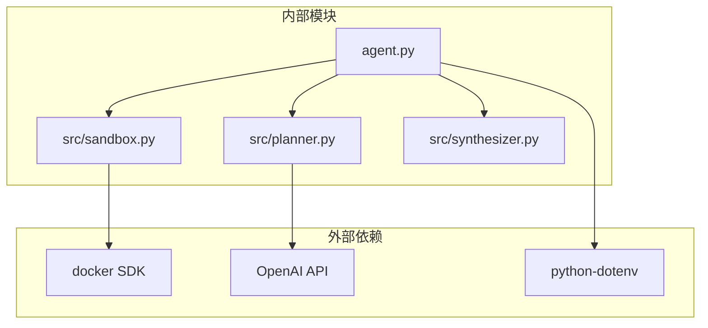

# 项目介绍

<cite>
**本文档引用的文件**
- [README.md](file://README.md)
- [agent.py](file://agent.py)
- [src/planner.py](file://src/planner.py)
- [src/sandbox.py](file://src/sandbox.py)
- [src/synthesizer.py](file://src/synthesizer.py)
- [requirements.txt](file://requirements.txt)
- [Dockerfile](file://Dockerfile)
- [.env.example](file://.env.example)
- [doc/运行示例.md](file://doc/运行示例.md)
- [workplace/QuickStart.md](file://workplace/QuickStart.md)
</cite>

## 目录
1. [简介](#简介)
2. [项目结构](#项目结构)
3. [核心组件](#核心组件)
4. [架构概览](#架构概览)
5. [详细组件分析](#详细组件分析)
6. [依赖关系分析](#依赖关系分析)
7. [性能考虑](#性能考虑)
8. [故障排除指南](#故障排除指南)
9. [结论](#结论)

## 简介

Repo Dockerizer Agent 是一个基于大型语言模型（LLM）的智能代理系统，专门设计用于自动为 GitHub 仓库配置可执行的 Docker 环境。该项目的核心目标是通过自动化的方式解决传统软件开发中的环境配置难题，实现开发环境的标准化、团队协作效率的提升以及项目可复现性的增强。

### 项目价值主张

**标准化开发环境**：通过自动化的 Docker 环境配置，确保每个开发者都能获得一致的开发体验，消除"在我机器上能运行"的问题。

**提升团队协作效率**：统一的环境配置流程减少了团队成员之间的环境差异，降低了沟通成本和问题排查时间。

**增强项目可复现性**：完整的 Dockerfile 和 QuickStart 文档确保项目可以在任何环境中被准确地重现和运行。

### 解决的实际问题

- **环境配置复杂性**：手动配置开发环境耗时且容易出错
- **团队协作障碍**：不同开发者的环境差异导致代码无法在他人机器上运行
- **项目维护困难**：缺乏标准化的环境配置使得项目迁移和维护变得困难
- **可复现性问题**：难以确保项目在不同环境中的一致行为

## 项目结构

项目采用模块化设计，主要分为以下几个核心部分：

**图表来源**
- [agent.py](file://agent.py#L14-L39)
- [src/planner.py](file://src/planner.py#L3-L67)
- [src/sandbox.py](file://src/sandbox.py#L4-L28)

### 文件组织结构

项目采用清晰的分层架构：

- **根目录**：主程序入口和配置文件
- **src/**：核心业务逻辑模块
- **workplace/**：工作空间和生成的文档
- **doc/**：项目文档和示例

**章节来源**
- [README.md](file://README.md#L1-L47)
- [agent.py](file://agent.py#L1-L160)

## 核心组件

Repo Dockerizer Agent 由三个核心组件构成，它们协同工作以实现自动化的 Docker 环境配置：

### 1. 规划器（Planner）

负责基于 ReAct（Thought/Action/Observation）模式进行环境配置规划。规划器使用系统提示词指导 LLM 执行正确的环境配置任务。

### 2. 沙箱（Sandbox）

使用 Docker SDK 在隔离环境中执行指令，具备基于提交的回滚机制，确保环境配置的安全性和可恢复性。

### 3. 合成器（Synthesizer）

记录成功的指令并生成最终的 Dockerfile 和 QuickStart 文档，提供完整的环境配置说明。

**章节来源**
- [README.md](file://README.md#L5-L9)
- [src/planner.py](file://src/planner.py#L3-L67)
- [src/sandbox.py](file://src/sandbox.py#L4-L28)
- [src/synthesizer.py](file://src/synthesizer.py#L1-L22)

## 架构概览

项目采用经典的 LLM 驱动的自动化代理架构：

**图表来源**
- [agent.py](file://agent.py#L60-L126)
- [src/planner.py](file://src/planner.py#L69-L105)
- [src/sandbox.py](file://src/sandbox.py#L29-L91)
- [src/synthesizer.py](file://src/synthesizer.py#L9-L22)

## 详细组件分析

### DockerAgent 主控制器

DockerAgent 是整个系统的协调者，负责管理整个配置流程：

**图表来源**
- [agent.py](file://agent.py#L14-L39)
- [src/planner.py](file://src/planner.py#L3-L145)
- [src/sandbox.py](file://src/sandbox.py#L4-L178)
- [src/synthesizer.py](file://src/synthesizer.py#L1-L144)

### Planner 组件

Planner 实现了 ReAct 思维模式，通过系统提示词指导 LLM 执行环境配置任务：

#### 关键特性

- **成本计算**：实时计算 API 调用成本，支持多种模型定价策略
- **历史记录**：维护对话历史，支持上下文理解
- **格式解析**：自动提取 Thought 和 Action 格式的响应内容

#### 系统提示词设计

Planner 的系统提示词包含了严格的环境限制和操作指导：

- **禁止命令**：明确禁止使用 Docker 相关命令和系统服务管理命令
- **依赖识别**：指导识别项目依赖文件（requirements.txt、pyproject.toml 等）
- **验证流程**：要求验证环境配置的有效性

**章节来源**
- [src/planner.py](file://src/planner.py#L43-L67)
- [src/planner.py](file://src/planner.py#L107-L129)

### Sandbox 组件

Sandbox 提供了安全的执行环境，实现了智能的回滚机制：

#### 核心机制

- **提交回滚**：每次成功执行后创建容器快照，失败时自动回滚到上一个成功状态
- **只读优化**：智能识别只读命令，避免不必要的镜像提交
- **信息性退出处理**：正确处理显示帮助信息等非错误退出

#### 安全特性

- **环境隔离**：完全隔离的 Docker 容器环境
- **资源控制**：限制容器资源使用
- **自动清理**：执行完成后自动清理临时资源

**章节来源**
- [src/sandbox.py](file://src/sandbox.py#L29-L91)
- [src/sandbox.py](file://src/sandbox.py#L93-L112)
- [src/sandbox.py](file://src/sandbox.py#L114-L134)

### Synthesizer 组件

Synthesizer 负责将执行过程转换为可复用的配置文件：

#### 功能特性

- **指令记录**：自动记录所有成功的配置命令
- **Dockerfile 生成**：基于记录的指令生成标准 Dockerfile
- **QuickStart 文档**：使用 LLM 生成简洁的使用说明文档
- **API 密钥提示**：自动检测并记录项目所需的 API 密钥配置

#### 文档生成流程

**图表来源**
- [src/synthesizer.py](file://src/synthesizer.py#L32-L122)
- [src/synthesizer.py](file://src/synthesizer.py#L130-L143)

**章节来源**
- [src/synthesizer.py](file://src/synthesizer.py#L9-L22)
- [src/synthesizer.py](file://src/synthesizer.py#L130-L143)

## 依赖关系分析

项目依赖关系清晰，采用松耦合的设计：

**图表来源**
- [requirements.txt](file://requirements.txt#L1-L4)
- [agent.py](file://agent.py#L1-L12)

### 外部依赖

- **docker**：Docker 容器管理
- **openai**：OpenAI API 客户端
- **python-dotenv**：环境变量管理

### 内部模块依赖

- **agent.py** 依赖所有核心组件
- **planner.py** 仅依赖 OpenAI API
- **sandbox.py** 仅依赖 Docker SDK
- **synthesizer.py** 依赖文件系统和 OpenAI API

**章节来源**
- [requirements.txt](file://requirements.txt#L1-L4)
- [agent.py](file://agent.py#L1-L12)

## 性能考虑

### 成本优化

Planner 实现了详细的 API 成本计算机制：

- **多模型支持**：支持多种 OpenAI 模型的定价策略
- **实时监控**：每步调用都计算并累计成本
- **透明显示**：在执行过程中显示详细的成本信息

### 执行效率

- **智能回滚**：只在必要时创建镜像快照，减少存储开销
- **只读优化**：跳过只读命令的镜像提交
- **并行处理**：各组件独立运行，无阻塞等待

### 资源管理

- **自动清理**：执行完成后自动清理容器和镜像
- **中间镜像清理**：定期清理未使用的中间镜像
- **存储优化**：避免重复的镜像提交

## 故障排除指南

### 常见问题及解决方案

#### Docker 相关问题

**问题**：Docker Engine 未启动
**解决方案**：确保 Docker 已正确安装并运行

**问题**：权限不足
**解决方案**：将当前用户添加到 docker 组

#### API 配置问题

**问题**：OPENAI_API_KEY 未设置
**解决方案**：复制 .env.example 为 .env 并填入 API 密钥

#### 环境配置问题

**问题**：容器执行失败但无错误信息
**解决方案**：使用 --keep-container 参数保持容器运行以便调试

### 调试技巧

1. **启用详细日志**：观察每步执行的 Thought、Action 和 Observation
2. **检查回滚机制**：确认容器快照是否正确创建和回滚
3. **验证生成文件**：检查 Dockerfile 和 QuickStart.md 的完整性

**章节来源**
- [README.md](file://README.md#L43-L47)
- [agent.py](file://agent.py#L127-L147)

## 结论

Repo Dockerizer Agent 代表了 AI 驱动的软件工程自动化的一个重要进展。通过将 LLM 的强大推理能力与容器化技术相结合，该项目成功解决了长期困扰软件开发者的环境配置难题。

### 主要优势

- **自动化程度高**：从环境识别到配置完成全程自动化
- **安全性强**：隔离的执行环境和智能回滚机制
- **可扩展性好**：模块化设计便于功能扩展
- **成本可控**：详细的 API 成本计算和优化

### 适用场景

- **开源项目维护**：为开源项目提供标准化的开发环境
- **团队协作**：确保团队成员使用一致的开发环境
- **CI/CD 集成**：作为持续集成流水线的一部分
- **教育用途**：为学生和研究人员提供标准化的学习环境

### 发展前景

随着 LLM 技术的不断进步和容器化技术的普及，Repo Dockerizer Agent 有望成为软件开发环境配置的标准工具，进一步推动软件工程领域的自动化进程。